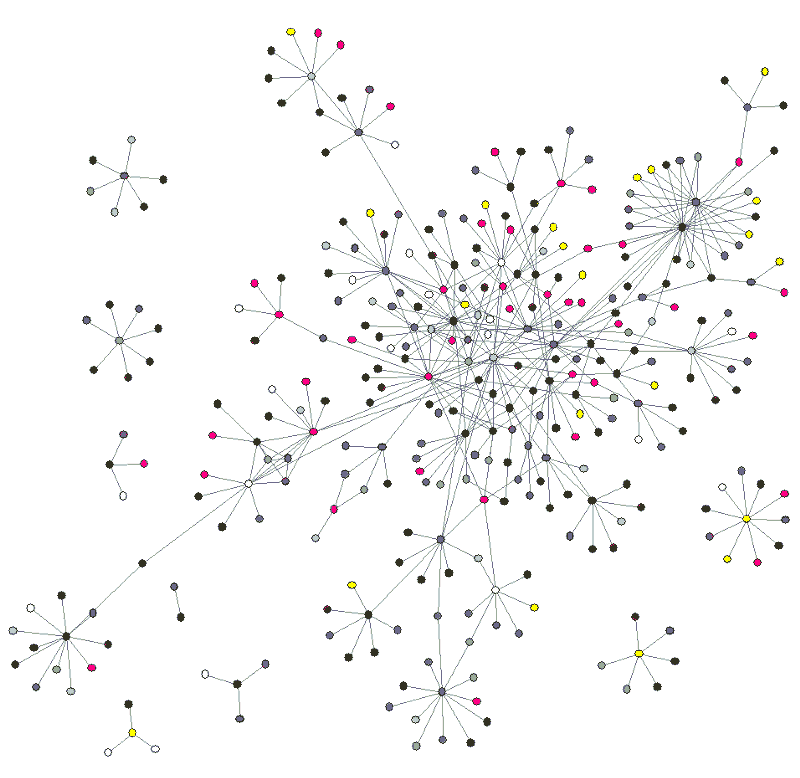

# 像我五岁一样解释比特币

> 原文：<https://www.freecodecamp.org/news/explain-bitcoin-like-im-five-73b4257ac833/>

尼克·库斯托迪奥

# 像我五岁一样解释比特币

#### 如果你还是不知道比特币到底是什么…

我们坐在公园的长椅上。这是伟大的一天。

我带了一个苹果。我把它给你。

你现在有一个苹果，而我一个也没有。

很简单，对吧？

**让我们仔细看看发生了什么:**

我的苹果被放在你手里。

你知道它发生了。我当时在场。你当时在场。你碰了它。

我们不需要一个第三人来帮助我们转移资金。我们不需要把汤米叔叔(他是一个著名的法官)拉进来和我们一起坐在长凳上，确认苹果从我这里到了你那里。

苹果是你的了！我不能再给你一个苹果了，因为我没有苹果了。我再也控制不住了。苹果完全离开了我的财产。你现在完全控制了那个苹果。你愿意的话可以给你的朋友，然后那个朋友可以给他的朋友。诸如此类。

这就是面对面交流的样子。我想这真的是一样的，无论我给你一根香蕉，一本书，或者说一个 25 美分的硬币，或者一张一美元的钞票。

但是我想得太多了。

### 回到苹果！

现在说，我有一个数字苹果。来，我给你我的*数码*苹果。

啊！现在变得有趣了。

你怎么知道那个曾经属于我的数字苹果现在是你的，而且仅仅是你的？想一想。

比较复杂吧？你怎么知道我没有先把那个苹果作为邮件附件发给汤米叔叔？还是你的朋友乔？或者我的朋友丽莎也是？

也许我在电脑上复制了几份苹果数码产品。也许我把它放到网上，有一百万人下载了它。

如你所见，这种数字交换有点问题。**送*数码*苹果看起来不像送*实物*苹果。**

一些聪明的计算机科学家实际上给这个问题起了一个名字:叫做 [**双重花费问题**](http://blogs.cornell.edu/info4220/2013/03/29/bitcoin-and-the-double-spending-problem/) 。但是不用担心。你需要知道的是，这个问题困扰了他们很长一段时间，他们从来没有解决过。

直到现在。

但是让我们试着自己想一个解决办法。

### 分类账

也许这些数字苹果需要在**分类账**中被追踪。它基本上是一本记录所有交易的书——一本会计书。

这个账本，既然是数字化的，就需要活在自己的世界里，需要有人负责。

比如说，就像魔兽世界一样。暴雪，创造了这个在线游戏的家伙，有一个“数字账本”,记录了他们系统中所有稀有的火焰剑。所以，酷，像他们这样的人可以跟踪我们的数字苹果。太棒了——我们解决了这个问题！

### 问题

但是有一个小问题:

1)如果暴雪的某个家伙创造了更多呢？只要他愿意，他可以在他的天平上添加几个数字苹果！

2)不完全像我们坐冷板凳那一天。那时只有你和我。经历*暴雪*就像把汤米叔叔(*第三方*)拉出法庭(我有没有提到他是个著名的法官？)为我们所有的公园长椅交易。我怎么能把我的数码苹果交给你呢，就像，你知道的——像平常一样？

> 有什么方法可以精确复制我们的公园长椅，只有你和我，数字交易**？似乎有点困难…**

### **解决方案**

****

**如果我们把这个账本给每个人会怎么样？账本不再存在于暴雪的电脑上，而是存在于每个人的电脑上。在数码苹果中，从古至今发生的所有交易都将被记录在里面。**

**你骗不了它。我不能给你送我没有的数字苹果，因为那样的话它就不会和系统中的每个人同步。这是一个很难攻克的系统。尤其是当它变得很大的时候。**

**另外，它不是由一个人控制的，所以我知道没有人可以决定给自己更多的数字苹果。这个系统的规则在一开始就已经*定义好了。而代码和规则都是[开源](http://en.wikipedia.org/wiki/Open_source)。它让聪明的人去贡献、维护、保护、改进和检查。***

**你也可以参与到这个网络中来，更新分类账，确保一切都核对无误。对于麻烦，你可以得到 25 个数字苹果作为奖励。事实上，这是在系统中创造更多数字苹果的唯一方法。**

### **我简化了很多**

**…但是我解释的那个系统是存在的。它叫做*比特币协议*。而那些数字苹果就是体制内的*【比特币】*。想不到！**

**你看到发生了什么吗？**公共分类账有什么作用？****

**1)它是开源的，记得吗？苹果的总数一开始就在公共账本里定义好了。我知道确切的数量。 ***在体制内，*我知道他们是有限的(*【稀缺】)*** 。**

**2)当我进行交易时，我现在知道 *digital* apple 可以证明**离开了我的所有，现在完全是你的了**。**我过去不能这么说数字事物。**将通过公共分类账进行更新和验证。**

**3)**

> *****在体制内，一个*数码*苹果的交换现在就像一个*实物*苹果的交换一样。现在就像看到一个实际的苹果离开我的手，落入你的口袋。就像在公园的长椅上，交换只涉及两个人。你*和*我*——我们不需要汤米叔叔在场来使它有效。******

****换句话说，它*的行为*就像一个物理对象。****

****但你知道什么很酷吗？还是数码的。我们现在可以处理*1000 个苹果、*或 1 *百万个苹果、*甚至*0000001 个苹果*。我可以通过点击一个按钮来发送它，如果我在尼加拉瓜而你远在纽约，我仍然可以把它放在你的*数字*口袋里。****

****我甚至可以让*其他数字东西*骑在*这些数字苹果的上面*！毕竟是数字化的。也许我可以在上面附上一些文字——一张数字便条。或者也许我可以附上更重要的东西；比如说一份合同，或者股票，或者身份证…****

****所以这太棒了！我们应该如何看待或评价这些“数字苹果”？它们很有用，不是吗？****

****嗯，现在很多人都在争论这个问题。这个经济学派和那个经济学派之间有争论。政治家之间。程序员之间。但是不要听他们所有人的。有些人很聪明。有些是误传。有人说这个系统很值钱，有人说它实际上一文不值。有些人实际上提出了一个硬性的数字:每个苹果 1300 美元。有人说是*数字黄金*，有人说是*货币*。其他人说它们就像郁金香一样。有些人说它会改变世界，有些人说它只是一种时尚。****

****关于这件事，我有自己的看法。****

****不过那是以后的事了。但是孩子，你现在比大多数人都了解比特币。****

*******推荐阅读(2017 年更新)*******

****[*《你不了解比特币是因为你认为钱是真实的》*](https://medium.com/@mariabustillos/you-dont-understand-bitcoin-because-you-think-money-is-real-5aef45b8e952?source=linkShare-2d6f142ff3cc-1512362100) *by [玛利亚·巴斯提洛斯](https://www.freecodecamp.org/news/explain-bitcoin-like-im-five-73b4257ac833/undefined)是很好的后续读物。*****

*****你还可以在这里阅读更多关于[以太坊和智能合约的信息。尽情享受吧！](https://medium.freecodecamp.org/smart-contracts-for-dummies-a1ba1e0b9575?source=linkShare-2d6f142ff3cc-1512086124)*****

********