# CSS 伪类如何工作，用代码和大量图表解释

> 原文：<https://www.freecodecamp.org/news/explained-css-pseudo-classes-cef3c3177361/>

纳什·韦尔

# CSS 伪类如何工作，用代码和大量图表解释


老实说，有时候 CSS 真的会伤到你的大脑。将一个元素放在其父元素的中心已经够难了。

今天，我们要理解 CSS 的一个更具挑战性的方面:伪类。

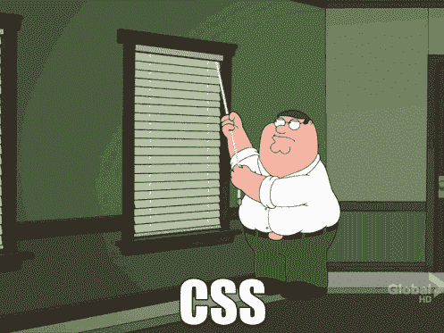

Obligatory Family Guy CSS gif

我将在这里介绍的伪类有两种风格。

*   *-类型选择器
*   *-子选择器

你可能在想，“但我是来学伪课的。为什么我们要讨论选择器？”这些基本上是一样的，我会交替使用这些术语。

伪类有时很难理解，主要是因为它们是以抽象的方式呈现的。所以我将采取不同的方法，通过画一个 DOM 树来帮助你理解这些。

#### 标记和树

首先，看一下这段 HTML。我将在所有的例子中使用这段代码。

```
<body>  <div class=”main”>     <a href=”#”>Inner Link 1</a>     <a href=”#”>Inner Link 2</a>     <ul>       <a href=”#”>Inner Inner Link 1</a>       <li>         <a href=”#”>List Item 1</a>       </li>       <li>         <a href=”#”>List Item 2</a>       </li>     </ul>     <a href=”#”>Inner Link 3</a>  </div>  <a href=”#”>Outer Link 1</a>  <a href=”#”>Outer Link 2</a></body>
```

现在我要把这段代码转换成更形象、更直观的东西:一棵树。

以下 body 元素有 3 个子元素，*。主*和两个*锚*元素。

```
<body>  <div class=”main”>   ...  </div>  <a href=”#”>Outer Link 1</a>  <a href=”#”>Outer Link 2</a></body>
```

下面是当你把它表示为一棵树时，*体*和它的三个子体之间的关系:

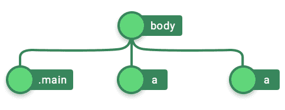

Fig. 1

需要记住的一点是，子节点在树中的放置顺序很重要。代码中从上到下的子节点在树中从左到右排列。

接下来，我们来看看*。主*分区:

```
<div class=”main”>   <a href=”#”>Inner Link 1</a>   <a href=”#”>Inner Link 2</a>   <ul>     ...   </ul>   <a href=”#”>Inner Link 3</a></div>
```

。main 有 4 个孩子。前两个是*锚*元素，然后是 *ul* 元素，最后是锚元素。

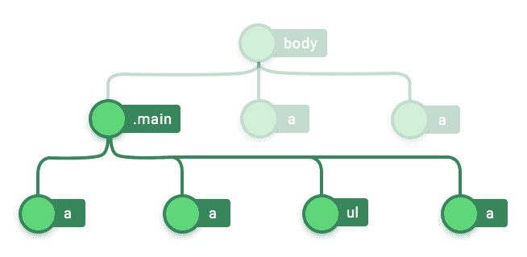

Fig . 2

类似地，我们逐步减少嵌套的每一层，并从 HTML 代码中画出完整的树。

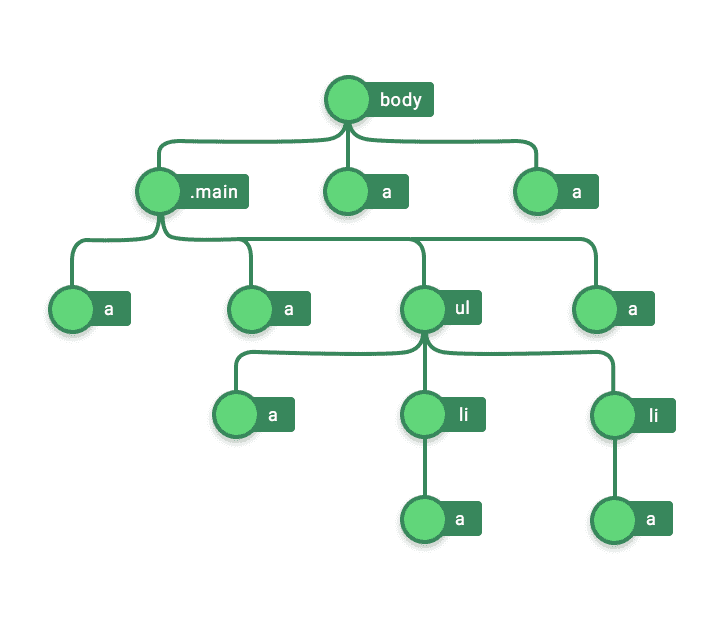

Fig. 3 — Tree representation of the HTML code

为了让这篇文章对你有所收获，理解这棵树是很重要的。

“哈哈好一语双关！”“谢谢！”将 pun 计数器增加到 1，然后让我们来看第一个伪类。

### 伪类#1:仅类型的

所有伪类都遵循相同的格式:

```
what-you-want-to-select:filter { /* styles */ }
```

*what-you-want-to-select* 可用于选择 DOM 中作为集合存在的任何内容。在这里，请允许我给你看一个例子:

```
a:only-of-type {   border: 2px solid black;}
```

在上面显示的代码片段中，*您想要选择的*是锚元素( *a* 标签)，而*过滤器*是 *only-of-type。我们马上会看到这个选择器是做什么的。*

首先，我已经设置了一个[代码笔](http://codepen.io/nashvail/pen/VKkXLB)，如果你懒得创建一个测试项目的话。不客气，朋友！

您可以继续下去，看到变化，感到困惑，然后回到本文中寻求解释。你做你的，我做我的。

我正在做我的工作，解释上面显示的代码。我们将从选择所有存在的东西开始，然后最终过滤掉。

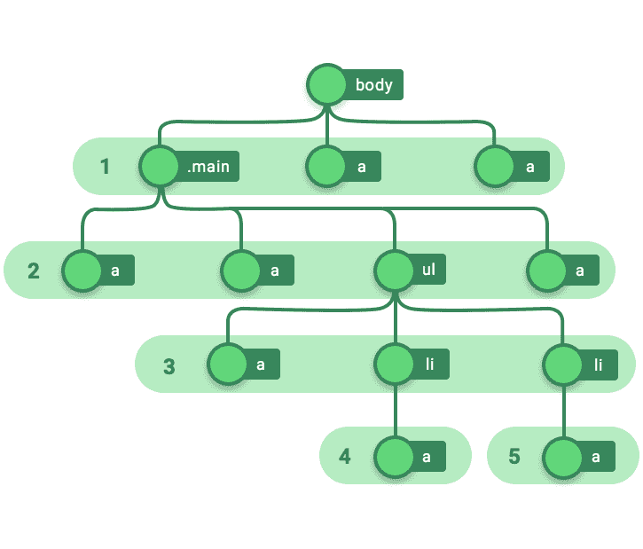

Fig. 4 — selecting everything

注意选择是如何完成的？树中的每个部分(编号为 1 到 5)都包含具有共同父级的元素。第 1 节的父节是*体*，第 2 节的父节是。*总管，*等等。**再一次，请注意每个部分对应于代码嵌套中更深的一层**。

接下来，由于锚元素是 *what-you-want-to-selec* t，我们就这么做:

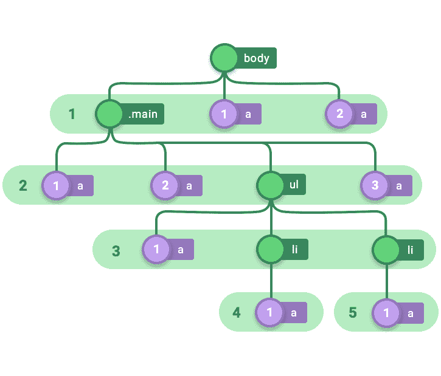

Fig. 5 — selecting just the anchor elements

我们选择了每个部分中的所有锚元素，并从左到右连续编号。我提到过，从左到右的顺序很重要。

这是*你想要选择的*部分结束和过滤开始的地方。

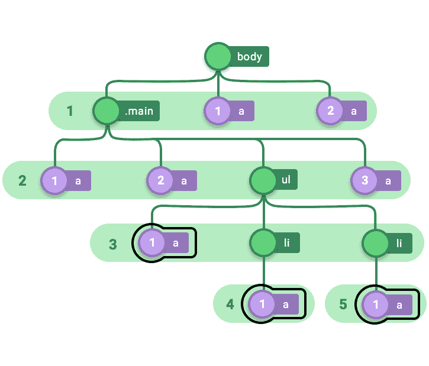

Fig. 6 — Selecting only-of-type anchor elements.

*only-of type t* 遍历每个部分，只选择那些在各自部分中唯一的锚元素。请注意，第 3、4 和 5 部分是仅有的具有锚元素的部分。如图 6 所示，这些是在应用样式时被选择和声明的。

### 伪类#2:第一类

让我们快进到结束选择所有"*您想要选择的*"的部分(在我们的例子中是锚元素)。


Fig. 7 — Selecting just the anchor elements.

filter *first-of-type* 转换为在每个部分中只选择锚元素的第一次出现。

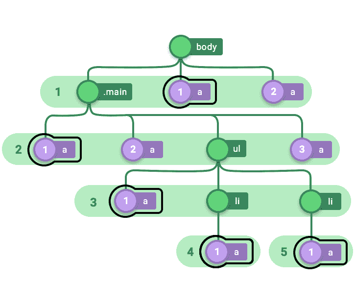

Fig. 8 — Selecting first-of-type anchor elements.

实现这一点的代码如下所示:

```
a:first-of-type {   border: 2px solid black;}
```

如果你忘记了我为你设置代码笔所做的艰苦工作，这里有[链接](http://codepen.io/nashvail/pen/VKkXLB)再次检查代码在浏览器中呈现的内容。

### 伪类#3:类型的最后一个

如果你不能从名字上看出来，*最后一种类型*与*第一种类型正好相反。*因此，这意味着在树的每个部分，不选择第一个出现的，而是选择最后一个。


Fig. 9 — :last-of-type selections

"只有一个锚元素的部分呢？"不太高兴你问了这个问题。很容易看出一个部分是否只有一个锚元素，它显然通过了 *only-of-type* 过滤器，但不仅如此。因为在那个特定标签之前或之后没有锚元素，所以它也通过了*第一类*和*最后一类*过滤器(例如 *a* 标签第 4 和第 5 部分)。

### 伪类#4:第 n 个类型(数字/an+b/偶数/奇数)

现在，我们终于咬到了文章的有趣部分，有一些五年级数学浇头的简单 CSS，希望你喜欢品尝它。

让我们首先声明下面的样式。

```
a:nth-of-type(1) {   border: 2px solid black;}
```

这看起来有点神秘，但实际上非常简单。要读取选择器，只需从括号中取出数字，并用该数字的**序数**形式替换选择器名称中的*n*。老实说，这是你的另一个花哨的英语单词…

好了，回来，*a:n-of-type(1)*因此可以读作 *a:first-of-type* 并且毫不奇怪它的工作方式与 *a:first-of-type* 完全一样，并且导致元素被选择，如下所示；仅仅是在它们各自的部分中属于第一类型的锚定元素。


Fig. 10 — Do people even read these?

这很好，但让我们尝试一些不同的东西。

```
a:nth-of-type(0) {   border: 2px solid black;}
```

如果你猜对了，我肯定你没有，在这种情况下没有锚元素被选中。由于每个部分中类型(以及我们将看到的子类型)的编号从 1 开始，而不是从 0 开始，所以任何部分中都没有“0”锚元素，因此 *a:zeroth-of-type* 不选择任何内容。对于 *a:第 n 种类型(5)* 或 *a:第 n 种类型(6/7/8)* 来说也是如此，因为在任何部分*中都没有 *a:第五种类型*或 *a:第六/第七/第八种类型*。*

但是如果我们继续使用…

```
a:nth-of-type(2) {   border: 2px solid black;}
```

…很明显，第 1 部分和第 2 部分有一个 *second-of-type* 锚元素，因此它们是被选中的元素。

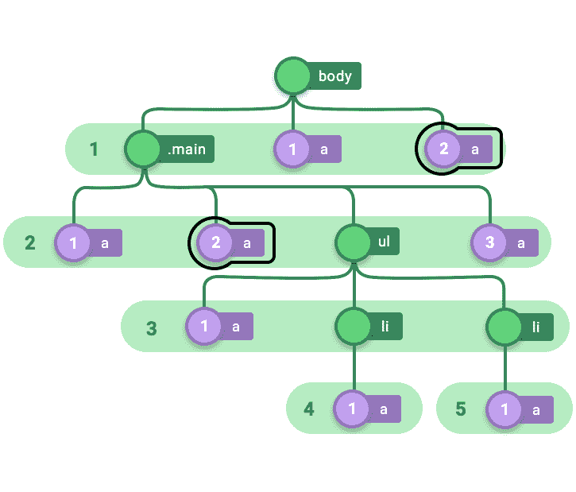

Fig. 11 — :nth-of-type(2) or read as :second-of-type

类似地，为了强调这一点，如果我们继续并声明下面的样式，

```
a:nth-of-type(3) {   border: 2px solid black;}
```

它将选择第二部分中的第三个锚元素，因为第二部分是唯一具有:*第三类型*锚元素的部分。

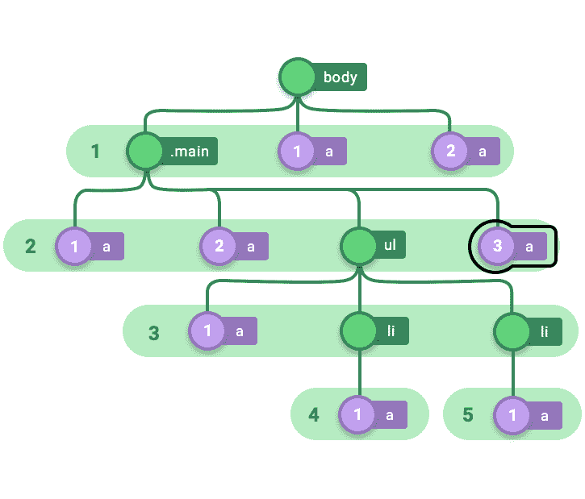

Fig. 12 — :nth-of-type(3) or read as :third-of-type

很简单不是吗？但是数字并不是唯一可以传递给*的东西:n-of-type(…)，*这个家伙比那个更强大，你还可以传递形式为 *(a*n) + b* (或者为了简洁起见 *an + b* ) *的公式。*其中 *a* 和 *b* 为常数， *n* 为值> = 0。你觉得数学第一名怎么样，先生？别担心，一会儿就会明白的。

考虑下面的风格

```
a:nth-of-type(n) {  border: 2px solid black; }
```

在上面的选择器中传递的公式是 *(1 * n) + 0 [= n]* ， *a* 是 1，b 是 0， *n* 是好的，n。接下来发生的是，从 0 开始， *n* 的数值被递增地插入到公式中，并进行选择。因此 *a:第 n 个类型(n)* 基本上转化为

```
a:nth-of-type(0) {  border: 2px solid black; } // n = 0a:nth-of-type(1) {  border: 2px solid black; } // n = 1a:nth-of-type(2) {  border: 2px solid black; } // n = 2a:nth-of-type(3) {  border: 2px solid black; } // n = 3a:nth-of-type(4) {  border: 2px solid black; } // n = 4
```

```
...
```

因此，这将导致所有锚元素被选中。

让我们再考虑一个例子

```
a:nth-of-type(2n + 1) {  border: 2px solid black; }
```

从 0 开始，在公式中递增地插入 *n* 的值，生成以下选择器。

```
// n = 0 implies (2 * 0) + 1 = 1a:nth-of-type(1) { border: 2px solid black; }
```

```
// n = 1 implies (2 * 1) + 1 = 3a:nth-of-type(3) { border: 2px solid black; }
```

```
// n = 2 implies (2 * 2) + 1 = 5 - No selections since no fifth-of-type present in any of the sectionsa:nth-of-type(5) { border: 2px solid black; }...
```

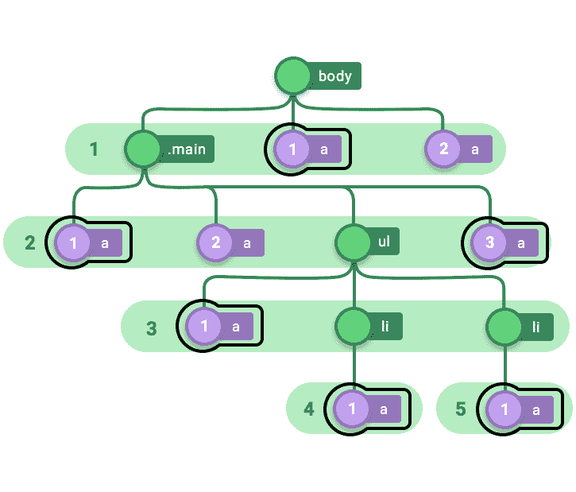

Fig 13 — nth-of-type(2n+1) selections

除了数字和生成数字*、*的公式，你可以传入*偶数*或*奇数*字符串*。偶数*选择一个部分中特定类型元素的所有偶数出现，即*:第二种类型* *:第四种类型* *:第六种类型*等等，另一方面显然*:第 n 种类型(奇数)*选择所有奇数出现，即*:第一种类型，*:第三种类型，**

### 伪类# 5:n-最后一个类型(数字/an+b/偶数/奇数)

这个选择器的功能与前一个完全一样，但是有一点不同。自己看吧…

```
a:nth-last-of-type(1) {  border: 2px solid black; }
```

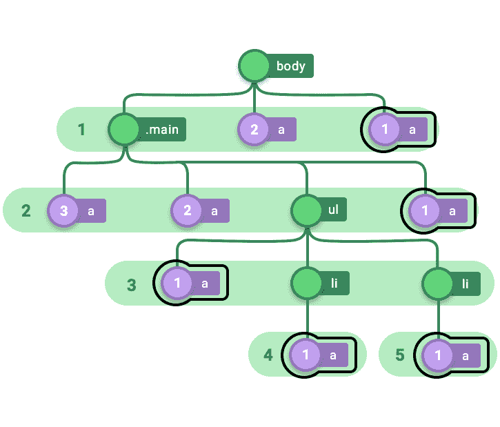

Fig. 14 — nth-last-of-type(1)

请注意，在每个级别中，锚类型的编号是如何从右到左进行的，而不是通常的从左到右。这是唯一的区别。 *last-of-type* 接受数字和公式以及偶数/奇数，就像*n-of-type*除了当选择时，最后一个类型被视为第一个，第二个被视为第二个，第三个被视为第三个，依此类推…

至此，我们结束了**-类型的*选择器。希望这对你来说是一次有趣的经历，我们从*的唯一类型*开始，然后转移到*的第一类型*、*的最后类型*，并深入了解了*的第 n 类型(…)* 和*的第 n 最后类型(..).如果在中间某处你失去了控制，掉了下来，我鼓励你拿着这支笔到处玩，并重新阅读解释。*

好了，是时候跳到 CSS 主题公园这个人迹罕至的角落的下一个了。我们要深入研究的另一类伪选择器/类是**-子类*。清楚地了解**类型选择器如何工作之后，掌握**子类型选择器的概念对你来说应该不在话下。“不在话下？那是什么？是计量单位吗？”不，傻瓜，这意味着一个非常简单的任务。不管怎样，让我们从第一个**-子选择器* : *独生子女*开始。**

### **子伪类#1:独生子女**

**考虑下面的风格。**

```
**`a:only-child {   border: 2px solid black;}`**
```

**这就是不言而喻的定义。选择器要求选择所有锚元素，假定锚元素应该是其父元素的唯一子元素，或者，换句话说，选择其父元素只有一个子元素并且这个子元素是锚元素的所有锚元素。**

**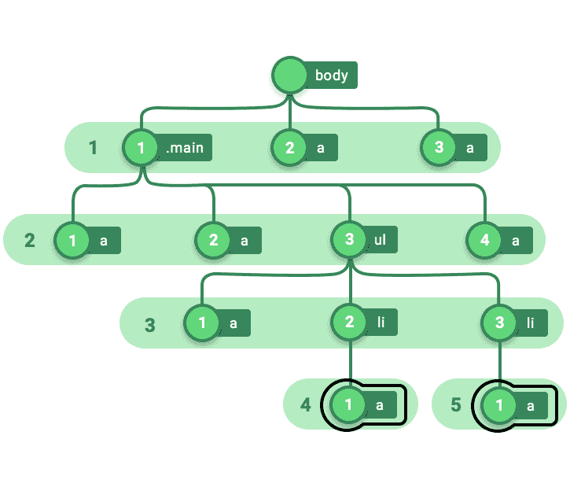

Fig. 15 — a:only-child selections** 

**我有一个朋友，他从来都不是他妈妈的最爱，他是独生子。我只是想把它插在那里，无论如何，请注意，与 **-of-type* 选择器相比，我们不再对类型进行编号，而是孩子，当然是从 1(而不是 0)开始。与类型唯一的*相比，*第 3 节中的锚元素未被选择作为其父元素( *ul* )有 3 个子元素，因此尽管它(级别 3 中的锚元素)是其父元素的类型‘a’的唯一子元素*，但它不是唯一的子元素，也有 2 个 *li* 。***

### *子伪类#2:第一个子类*

*考虑下面的样式声明。*

```
*`a:first-child {   border: 2px solid black;}`*
```

*它只是说，选择所有锚元素，但有一个条件，锚元素应该是其父元素的第一个子元素。就是这样，不需要进一步解释。*

*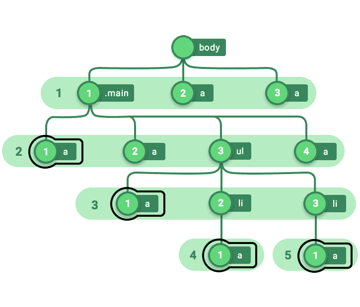

Fig. 16 — a:first-child selections* 

*因为如果你对为什么第 1 部分中的 *a* 没有被选中感到有点困惑，那是因为第 1 部分中的第一个孩子(其父代是 *body* )是*。main* ，第一节的第一个 *a* 是第二个孩子，不能通过*第一个孩子*的过滤，这就是为什么这个可怜的家伙最终没有被选中，并被给了一个大标签滚蛋。让我们继续下一个。*

### *子伪类#3:最后一个子类*

*这是选择器应该开始自我解释的部分，你应该开始认为我试图向你解释它们是愚蠢的。但是我的名字不是 blurryface，我不在乎你怎么想。"很好的 21 飞行员参考"是的，我知道，谢谢。现在，看下面的样式声明。*

```
*`a:last-child {   border: 2px solid black;}`*
```

**你想选择什么*？"锚元素。"还有你要用的*滤镜*？*独生子女。*这相当简单，即选择那些作为其父元素的最后一个子元素的锚元素。或者，换句话说，选择锚元素，其父母最终决定不再有趣，并在那个家伙出生后停止。下面是带有*的树的样子:最后一个孩子*选择。*

*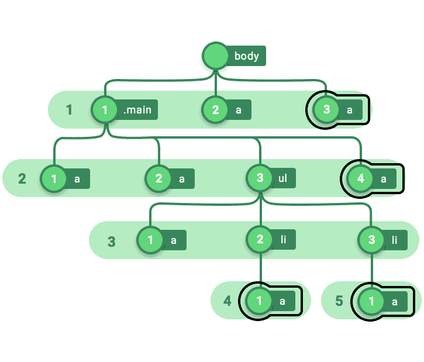

Fig. 16 — :last-child selections.* 

### *子伪类#4:第 n 个子类(数字/an+b/偶数/奇数)*

*我希望你能够消化上一次你得到的数学浇头，因为它将再次发生，只是这次在一个稍微不同的外壳上。*

*现在，我希望你把所有的注意力集中到下面的例子上。*

```
*`a:nth-child(1) {  border: 2px solid black; }`*
```

*这和*:n-of-type，*是一样的，我会在这里链接到文章的那个部分，但是 Medium policies 不允许这样做，如果你想复习，你必须向上滚动到那个部分。撇开将来可能改变的媒体政策不谈，不变的是解密*选择者的过程。**

*就像使用*:n-of-type 一样，选择器名称中的*使用括号中的数字，并用该数字的序数形式替换“*n”*。因此，示例中所示的选择器相当于 *a:第一个孩子*，并且工作方式完全相同；即选择所有锚元素，假定它们是其父元素的第一个子元素。*

*这应该确定了两个*第 n 个选择器(第 n 个类型*和*第 n 个孩子)*之间的相似性，但是我们还是要继续看另一个例子。*

```
*`a:nth-child(2n - 1) {  border: 2px solid black; }`*
```

*我们首先将从 0 开始的 *n* 的值递增地插入到公式中，这使我们意识到上面显示的选择器基本上等同于下面显示的选择器。*

```
*`// n = 0 implies (2 * 0) - 1 = 0 - 1 = -1a:nth-child(-1) { border: 2px solid black; }  | No selections`*
```

```
*`// n = 1 implies (2 * 1) - 1 = 2 - 1 = 1a:nth-child(1) { border: 2px solid black; }`*
```

```
*`// n = 2 implies (2 * 2) - 1 = 4 - 1 = 3a:nth-child(3) { border: 2px solid black; }`*
```

```
*`// n = 3 implies (2 * 3) - 1 = 6 - 1 = 5a:nth-child(5) { border: 2px solid black; } | No selections further...`*
```

*事实上，如果选择器接收到越界的数字(如上例中的-1，5，6…),它就忽略它们。下面是应用了*a:n-child(2n-1)*的树的样子。*

*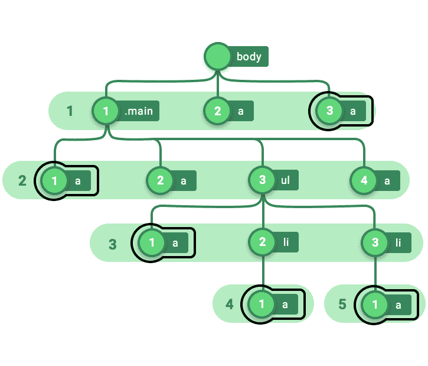

Fig. 17 — :nth-child(2n-1) selections.* 

*CSS Tricks 的人们有一篇非常有用的文章，叫做[:第 n 胎食谱](https://css-tricks.com/useful-nth-child-recipies/),你应该去看看，用你对*第 n 胎*的了解来测试*。*我挑战你 m8。*

*这样，我们将移动到这篇文章的最后一个选择器，双关语是*:n-last-child。*神圣的狗屎！为什么“双关”是一个偶数字？*

### *子伪类# 5:n-last-child(数字/an+b/偶数/奇数)*

*这个选择器的工作方式与*:n-child*完全一样，只是它开始从相反的方向选择元素，就像那个讨厌的高中老师会从坐在最后一排长椅上的安静的人开始向全班提问一样。天啊，我恨他。如果你看看目前画的树，每个部分的孩子都是从左到右编号的，但是这个选择者看到的树是这样的*

*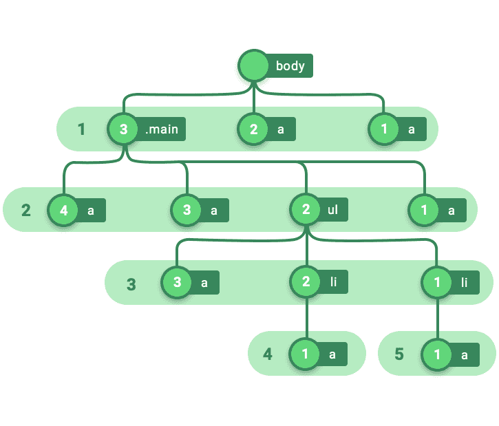

Fig. 18* 

*每个部分的孩子从右到左编号。所以如果我们继续应用下面的风格*

```
*`a:nth-last-child(1) {  border: 2px solid black; }`*
```

*锚元素将被选中，如下所示。*

*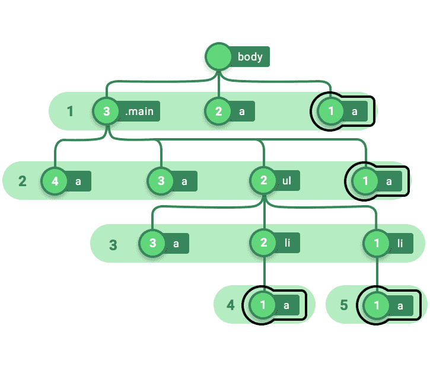*

*很简单，不是吗？这个选择器也非常容易接受公式(形式为 an + b)和*偶数/奇数*字符串，但是选择是从相反的一端进行的。*

*好了，我们的旅程到此结束。你可以通过将这篇文章推送给你的开发者伙伴来支付你的门票。*

*我希望你喜欢读这篇文章，并学到一些新东西，包括一些闪亮的新英语单词。*

*这是纳什的报告。下一篇文章再见。在 Twitter 上关注我，保持联系。我在推特上发布与开发相关的内容。很多。*

#### *想要更多吗？我定期在 nashvail.me 的[博客上发表文章。](https://nashvail.me)那里见，祝你愉快！*

**