# 简单解释:DeepMind 如何教 AI 玩视频游戏

> 原文：<https://www.freecodecamp.org/news/explained-simply-how-deepmind-taught-ai-to-play-video-games-9eb5f38c89ee/>

阿曼·阿加瓦尔

# 简单解释:DeepMind 如何教 AI 玩视频游戏

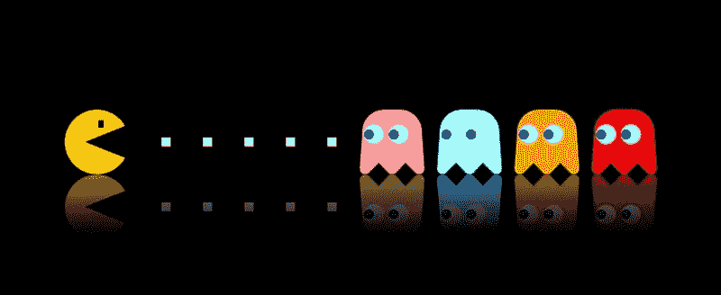

[Image credit](http://Image Source: http://truthorial.com/games/pacman-could-have-been-call-fuck-man)

谷歌的 DeepMind 是世界上最重要的人工智能研究团队之一。他们最出名的是创造了 2016 年击败韩国围棋冠军 Lee Sedol 的 AlphaGo 选手。

用于创建围棋人工智能的关键技术是深度强化学习。

让我们回到 4 年前，那时 DeepMind 第一次建造了一个可以玩 70 年代雅达利游戏的人工智能。像*突围、Pong* 和*太空入侵者*这样的游戏。正是这项研究导致了 AlphaGo 的诞生，并导致 DeepMind 被谷歌收购。

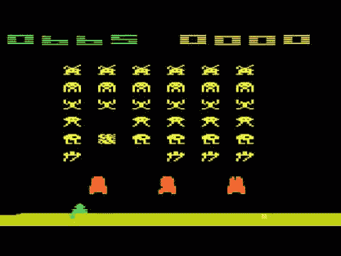

Space Invaders!

今天我们要把那篇原始的研究论文，一段一段地分解开来。这将使刚刚开始学习强化学习的人更容易理解。而对于那些不以英语为第一语言的人(这使得阅读这类论文非常困难)。

如果你想试着读一读，这是原文:

#### 一些快速笔记(以防你没有看完这篇 20 分钟的文章)

这里有两个人的解释:

1.  我是一名自动驾驶汽车工程师
2.  丹佛大学的博士生和研究员卢强

我们希望我们的工作将为您节省大量的时间和精力，如果你是自己研究这个。

#### 如果你更喜欢阅读中文，这里有这篇文章的非官方翻译。

1.  我们喜欢你的掌声，但更喜欢你的评论。将你心中的任何想法——感觉、建议、纠正或批评——放进评论框！
2.  我打算写更多这样的文章，并寻找更多的合作者。如果你真的想投稿，请留下评论。

### 我们开始吧

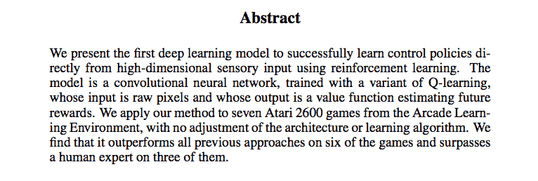

我们想让一个机器人通过强化学习自己学习如何玩雅达利游戏。

在我们的例子中，机器人是一个卷积神经网络。

这几乎是真正的端到端深度学习，因为我们的机器人以与人类玩家相同的方式获得输入——它直接看到屏幕上的图像和每次移动后的奖励/点数变化，这就是它做出决定所需的所有信息。

机器人输出什么？嗯，理想情况下，我们希望机器人选择它认为未来回报最高的行动。但是这里我们没有直接选择动作，而是让它给 18 个可能的操纵杆动作分配“值”。简而言之，任何动作 A 的值 V 代表了机器人对如果执行动作 A 将获得的未来回报的预期。

所以本质上，这个神经网络是一个价值函数。它将屏幕状态和奖励的变化作为输入，并输出与每个可能的动作相关联的不同值。这样你就可以选择价值最高的动作，或者根据你对整个玩家的编程来选择其他动作。

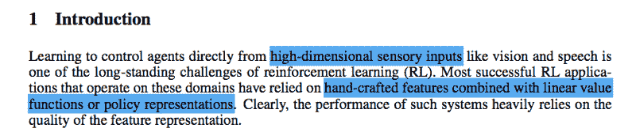

假设你有游戏屏幕，你想告诉一个神经网络屏幕上有什么。一种方法是将图像直接输入神经网络；我们不以任何其他方式处理输入。另一种方法是以数字形式总结屏幕上发生的事情，然后输入神经网络。前者在这里被称为“高维感官输入”，后者是“手工制作的特征表示”

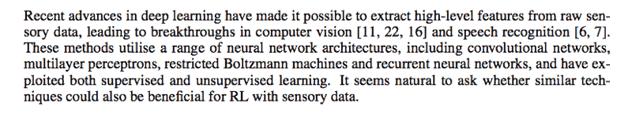

阅读抽象解释。那么这一段就不言自明了。

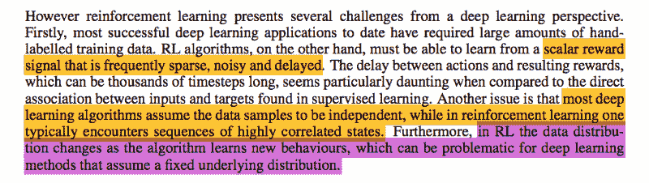

深度学习方法不像在监督/非监督学习中那样容易与强化学习一起工作。大多数 DL 应用程序都包含了大量具有精确样本和标签的训练数据集。或者在无监督学习中，目标成本函数仍然非常方便使用。

但在 RL 中，有一个问题——如你所知，RL 涉及的奖励可能会延迟到未来许多时间步(例如，在国际象棋中，要击败对手的女王需要几个步骤，而这些步骤中的每一步都不会像最后一步一样立即返回相同的奖励，即使其中一步可能比最后一步更重要)。

回报也可能是嘈杂的——例如，有时某一步棋的点数有点随机，不容易预测！

此外，在 DL 中，通常假设输入样本彼此不相关。例如，在图像识别网络中，训练数据将具有大量随机组织且不相关的图像。但是在学习如何玩游戏时，通常移动的策略不仅仅取决于屏幕的当前状态，还取决于一些先前的状态和移动。假设没有相关性并不简单。

现在，等一下。为什么我们的训练数据样本彼此不相关很重要？假设你有 5 个动物图像样本，你想学习将它们分为“猫”和“非猫”。如果其中一张照片是猫，会不会影响另一张照片也是猫的可能性？不。但在电子游戏中，屏幕的一帧肯定与下一帧相关。到下一帧。诸如此类。如果一束激光需要 10 帧来摧毁你的飞船，我很确定第 9 帧是一个很好的暗示，第 10 帧将会很痛苦。在学习过程中，你不会想把仅仅相隔几毫秒的两个画面视为完全独立的体验，因为它们显然携带了关于彼此的有价值的信息。它们是同样经历的一部分——激光束击中你的宇宙飞船。

随着机器人学习新的策略，甚至训练数据本身也在不断变化，这使得训练变得更加困难。那是什么意思？例如，假设你是一个 noob 国际象棋选手。当你下第一盘棋的时候，你开始有一些 noob 策略，比如继续前进，一有机会就杀卒等等。因此，当你不断学习这些行为，并乐于接受棋子时，这些动作就像你当前的训练集一样。

现在有一天你尝试了一个不同的策略——牺牲你自己的一个主教来救你的女王并拿走对方的车。你会意识到这太神奇了。你已经把这个新技巧添加到你的训练集中，如果你一直练习你以前的 noob 策略，你永远也学不会。

这就是非平稳数据分布的含义，这在监督/非监督学习中不会发生。

鉴于这些挑战，你如何在这种情况下训练神经网络呢？

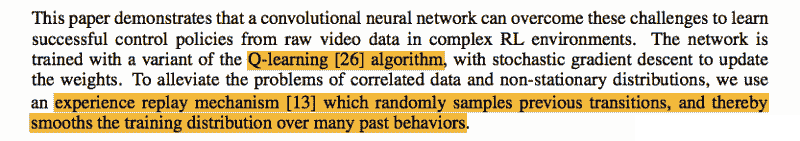

在本文中，我们展示了如何克服上述问题，并直接使用原始视频/图像数据。也就是说我们很棒。
值得一提的一个具体招数:“体验回放”。这解决了“数据相关性”和“非平稳数据分布”的挑战(参见上一段以理解其含义)。

我们记录我们所有的*经历—* 再次使用象棋类比，每个经历看起来像**【当前棋盘状态、我尝试的棋步、我得到的奖励、新棋盘状态】** —进入记忆。然后在训练的时候，我们随机挑选一些彼此不相关的经验。在每一批中，不同的经历也可能与不同的策略相关联——因为所有以前的经历和策略现在都混杂在一起了！有道理吗？

这使得训练数据样本更加随机和不相关，并且还使得它对于神经网络来说感觉更加稳定，因为每个新批次已经充满了随机策略经验。

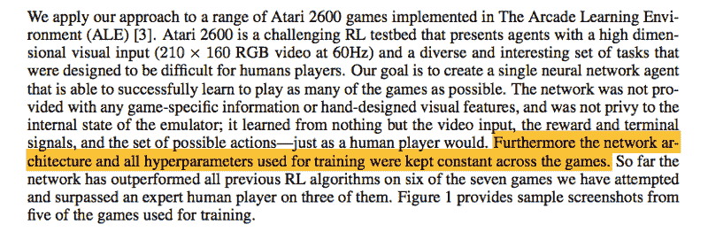

其中大部分是不言自明的。这里的关键是，完全相同的神经网络架构和超参数(学习率等)被用于每个不同的游戏。这并不像我们对太空入侵者使用更大的网络，对乒乓球使用更小的网络。我们确实为每个新游戏从头开始训练网络，但是网络设计本身是相同的。很棒吧？

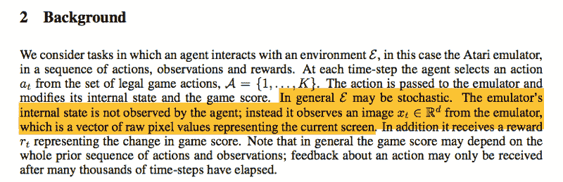

前几个句子不言自明。说‘E’是随机的，意味着环境并不总是可预测的(这在游戏中是正确的，对吗？任何事情都可能在任何时候发生)。

它还重复了神经网络没有得到任何关于游戏内部状态的信息。例如，我们不会告诉它“在这个位置有一个怪物正在向你开火并向这个方向移动，你的飞船在这里出现并向那里移动，等等”。我们简单地给它图像，让卷积网络自己计算出怪物在哪里，玩家在哪里，谁在哪里射击等等。这是为了让机器人以更像人类的方式训练。

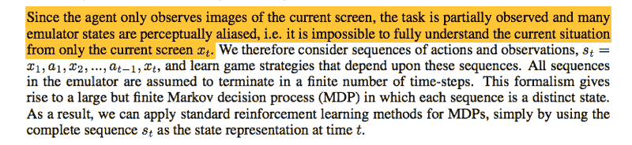

感知混淆:意味着两个不同的状态/位置可以被感知为相同。例如，在建筑物中，仅仅通过视觉信息来确定位置几乎是不可能的，因为所有的走廊可能看起来都一样。

感知混叠是一个问题。在 Atari 游戏中，游戏的状态不会在每一毫秒都发生如此大的变化，人类也不可能在每一毫秒都做出决定。所以当我们以每秒 60 帧的速度进行视频输入，并将每一帧视为一个独立的状态时，那么我们训练数据中的大多数状态看起来都会完全一样！最好保持一个更长的视野来观察一个“状态”是什么样子，比如说，至少有 4 到 5 帧(比如说)。多个连续的帧也包含关于彼此的有价值的信息——例如，两辆汽车相距一英尺的静止照片非常模糊——一辆汽车将要撞上另一辆汽车吗？或者在如此接近之后，它们会彼此远离吗？你不知道。但是如果你从视频中截取 4 帧，一个接一个地看，现在你知道汽车是如何运动的，并且可以猜测它们是否会发生碰撞。我们称之为连续帧的序列，用一个序列作为一个状态。

此外，当一个人移动操纵杆时，它通常会在同一位置停留几毫秒，所以这被合并到这个状态中。相同的动作在每一帧中继续。每个序列(包括几个帧和它们之间的相同动作)是一个单独的状态，这个状态仍然满足马尔可夫决策过程(MDP)。

如果你读过 RL，你就会知道 MDP 是什么，它们意味着什么！MDP 是 RL 的核心假设。

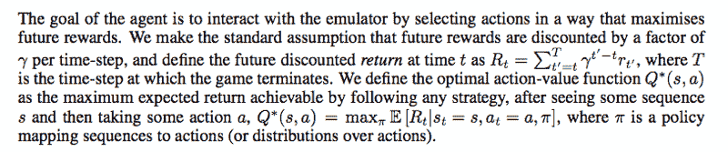

现在，为了理解这一部分，你应该先对强化学习和 Q-学习做一些背景研究。这很重要。你应该明白贝尔曼方程的作用，未来回报的折现等等。但是让我试着给 Q-learning 一个非常简单的概述。

还记得我之前说的“价值函数”吗？向上滚动到摘要并阅读它。

现在，让我们假设你有一个表，表中有一行代表游戏的所有可能状态，列代表所有可能的操纵杆移动。这一行中的每一个单元格都代表了如果你采取了特定的行动并尽了最大的努力的话，未来可能的最大总价值。这意味着您现在有了一个“备忘单”,可以知道在任何状态下可以从任何操作中得到什么！这些单元格的值称为 Q-star 值。(Q*(s，a))。对于任何状态 s，如果你采取行动 a，最大总未来值是 Q*(s，a)，如表中所示。

最后一行，圆周率是‘政策’。策略就是关于当你处于特定状态时该采取什么行动的策略。

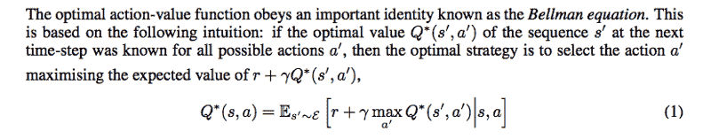

现在，如果你想一想，假设你在 S1。你可以在表中看到所有可能动作的 Q*值(在第 3 段中解释)，选择 A1 是因为它的 Q 值最高。你立即得到奖励 R1，游戏进入另一个状态 S2。对 S2 来说，如果它采取(比如说)表中的行动 A2，未来的最大回报将是。

现在，初始 Q 值 Q*(S1，A1)是你从那时起以最佳状态玩游戏所能得到的最大值，对吗？这意味着，Q*(S1，A1)应该等于奖励 R1 和下一个状态 Q*(S2，A2)的最大未来值之和！这有道理吗？但是我们想减少下一个状态的影响，所以我们把它乘以一个 0 到 1 之间的数γ。这叫做贴现 Q*(S2，A2)。

因此，Q*(S1，A1)= R1+[伽马 x Q*(S2，A2)]

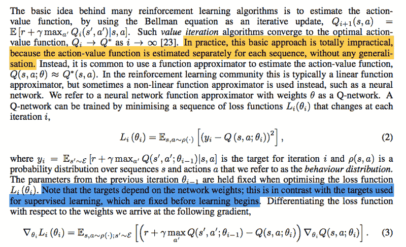

I’ll admit, this one won’t be easy to grasp just by reading my explanation. Put some time here.

再看前面的等式。我们假设对于任何状态，以及对于任何未来的行动，我们已经*知道*最优值函数，并且可以使用它来选择当前状态下的最佳行动(因为通过迭代所有可能的 Q 值，我们可以实际上展望未来)。当然，这样的 Q 函数在现实世界中并不存在！我们能做的最好的事情是用另一个函数来近似 Q 函数，并通过在现实世界中一次又一次地测试来一点一点地更新这个近似函数。这个近似函数可以是简单的线性多项式，但是我们甚至可以使用非线性函数。所以我们选择使用神经网络作为我们的“近似 Q 函数”

现在你知道我们为什么要首先阅读这篇论文了——deep mind 使用神经网络来逼近 Q 函数，然后他们让计算机使用网络来玩雅达利游戏，以帮助预测最佳移动。随着时间的推移，随着计算机越来越好地了解奖励是如何工作的，它可以调整它的神经网络(通过调整权重)，以便它成为“真实”Q 函数的越来越好的近似！当这种近似足够好的时候，瞧，我们意识到它实际上可以做出比人类更好的预测。

现在，抛开上面的一些数学术语(这对我也很难！).要知道 Q-learning 是一种*无模型*的方法。当你说“无模型”RL 时，意味着你的代理不需要明确地学习游戏的规则或物理。在基于模型的 RL 中，这些规则和物理是根据“转移矩阵”和“奖励函数”来定义的，前者在给定当前状态和动作的情况下计算下一个状态，后者在给定当前状态和动作的情况下计算奖励。在我们的情况下，这两个东西太复杂了，无法计算，如果你想一想，我们真的不需要它们！在我们的“无模型”方法中，我们简单地关心用试凑法学习 Q 值函数，因为我们假设一个好的 Q 函数固有地必须遵循游戏的规则和物理。

我们的方法也是“不符合政策”，而不是“符合政策”。这里的区别更加微妙，因为在这篇论文中，他们采用了混合排序。假设你处于状态 s，有几个动作可供选择。我们有一个近似的 Q 值函数，所以我们计算每个动作的 Q 值。现在，在选择行动时，您有两个选择。“常识”选项是简单地选择 Q 值最高的动作，对吗？是的，这就是所谓的“贪婪”策略。根据你对游戏的理解，换句话说，根据你目前对 Q 函数的近似，也就是说，根据你目前的策略，你总是选择对你来说最好的行动。但是问题就在这里——当你开始的时候，你并没有一个好的 Q 函数逼近器，对吗？即使你有一个稍微好点的策略，你仍然希望你的人工智能检查其他可能的策略，看看它们会导致什么结果。这就是为什么在你学习的时候,“贪婪”的策略并不总是最好的。在学习时，你不想只是不断尝试你认为会奏效的东西——你想尝试其他看起来不太可能的东西，这样你就可以获得经验。这就是政策上(贪婪)和政策外(不贪婪)的区别。

为什么我说我们使用某种混合体？因为我们根据我们学到的东西改变方法。我们改变代理人选择贪婪行为的概率。我们如何改变它？我们选择概率为(1-e)的贪婪行为，其中 e 是一个变量，表示选择的随机程度。所以 e=1 意味着选择是完全随机的，e=0 意味着我们总是选择贪婪的行动。有道理？起初，当网络刚刚开始学习时，我们选择 e 非常接近 1，因为我们希望人工智能探索尽可能多的策略。随着时间的推移，人工智能学习得越来越多，我们将 e 的值减少到 0，以便人工智能保持特定的策略。

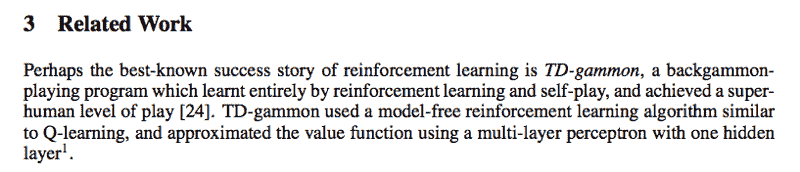

强:双陆棋游戏是科学家们最受欢迎的游戏，用于测试他们的各种人工智能和机器学习算法。参考文献[24]使用无模型算法实现了超人水平的发挥。无模型意味着算法的输入(屏幕图像)和输出(找到的最佳策略)之间没有明确的等式。

Q-learning，其中“Q”代表“质量”，使用一个 Q 函数来表示当我们在某个状态下执行某个动作时的最大贴现未来回报。然后从这一点开始不断地寻找最优策略(策略)。参考文献[24]的不同之处在于，他们使用多层感知器(MLP)对 q 值进行近似。在他们的 MLP 中，输出图层和输入图层之间存在一个隐藏图层。

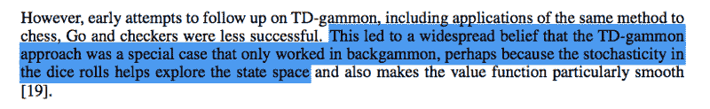

强:类似的方法在其他游戏上的不成功应用使人们不相信 TD-gammon 方法。他们把 TD-gammon 在双陆棋上的成功归功于掷骰子的随机性。

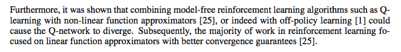

回到几段前，我们看到了什么样的函数可以用来逼近理论上完美的 Q 函数。显然，线性函数比神经网络等非线性函数更适合这项任务，因为它们使网络更容易“收敛”(即权重调整的方式使网络更加精确，而不是变得更加随机)。

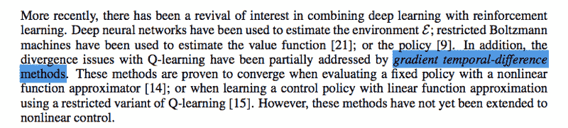

强:最近一段时间，深度学习和强化学习的结合又成为研究热点。环境、价值函数、政策都已经被深度学习算法估计出来了。同时，用梯度时间差分法部分解决了发散问题。然而，如文中所述，这些方法只能对非线性函数逼近器起作用，而不能直接对非线性函数起作用。

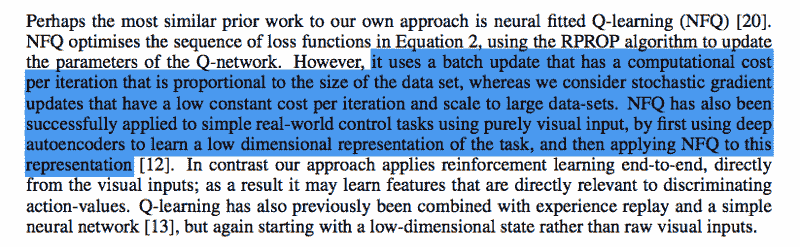

强:《NFQ》是与本文方法最相似的前期工作。NFQ 的主要思想是使用 RPROP(弹性反向传播)来更新 Q 网络的参数，以优化等式 2 中的损失函数序列。NFQ 的缺点是由于批量更新，它引入了与数据集大小成正比的计算成本。

本文使用随机梯度更新，这是有效的计算。NFQ 适用于简单任务，但不适用于视觉输入，本文的算法是端到端学习的。另一篇关于 Q-learning 的论文也使用低维状态代替原始视觉输入，这是本文的优点。

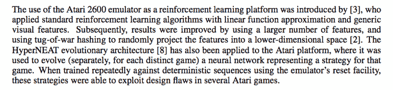

强:这一段介绍了 Atari 2600 仿真器的几个应用。使用 Atari 2600 仿真器作为强化学习平台的第一篇论文应用了具有线性函数近似和一般视觉特征的标准强化学习算法。更多的特征，以及将特征投影到低维空间改善了结果。和超净进化架构分别为每个游戏进化出一个神经网络。神经网络代表了游戏策略，它可以被训练并利用一些游戏中的一些设计缺陷。

但是正如论文中提到的，这篇论文的算法在不调整架构的情况下，为 7 个 Atari 2600 游戏学习策略。这是本文算法的一大优点。

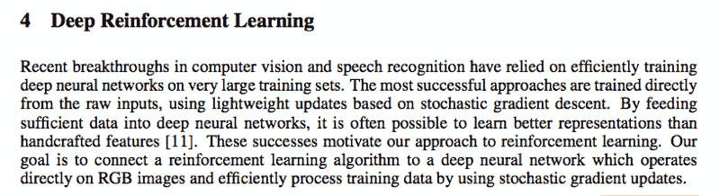

不言自明？

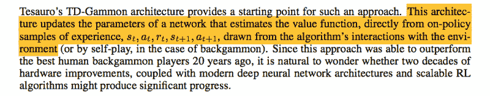

TD Gammon 是一种基于策略的方法，它直接使用经验(s1、a1、r1、s2)来训练网络(没有经验重放等)。

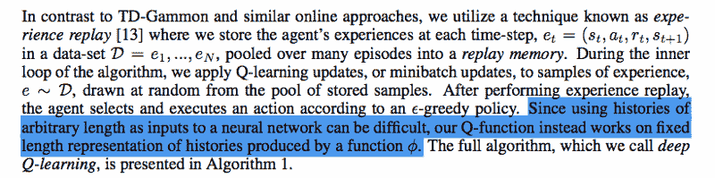

现在我们来看看对 TD Gammon 进行的具体改进。第一个是体验回放，之前已经讲过了。“phi”函数进行图像预处理等，因此游戏的状态被存储为最终的预处理形式(下一节将详细介绍)。

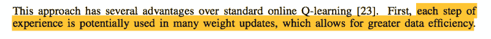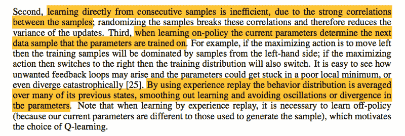

这些都是使用体验回放的具体优势(本段接下页)。首先，就像在常规的深度学习中，每个数据样本可以重复使用多次来更新权重，我们可以在训练时多次使用相同的经验。这是对数据更有效的利用。

第二和第三是非常相关的。因为每个状态都与下一个状态密切相关(就像玩视频游戏时一样)，所以用每个连续的状态训练权重将导致程序只遵循一种玩游戏的方式。你基于 Q 函数预测一个移动，你移动，并更新权重，这样下一次你可能会再次向左移动。但是通过打破这种模式，从过去的经验中随机抽取，你可以避免这些反馈循环。

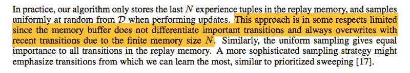

现在，从经验回放中随机抽取样本是很好的，但有时在游戏中有一些重要的转变，你希望代理了解。这是本文当前方法的局限性。给出的一个建议是，在使用体验回放时，以更大的概率挑选重要的过渡。或者类似的东西。

**(除此之外，一切都是基于前面章节中的理论，所以很多都只是技术细节)**

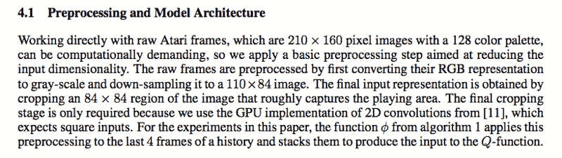

这大部分是不言自明的。状态 S 被预处理成包括 4 个连续的帧，所有帧都被预处理成灰度级，并被调整大小和裁剪成 84×84 的正方形。我认为这是因为考虑到游戏以超过每秒 24 帧的速度运行，而人类无法在每一帧中做出快速反应，因此将连续 4 帧视为处于相同状态是有意义的。

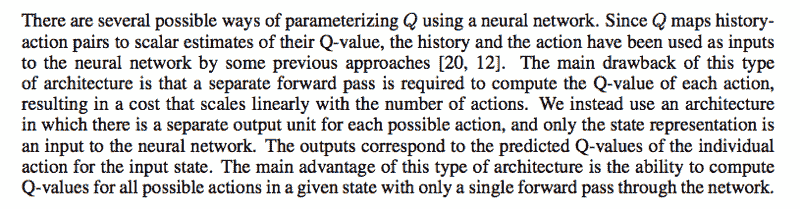

在构建网络架构时，您可以将它作为一个 Q 函数，该函数采用 S1 和 A1，并输出该组合的 Q 值。但这意味着你必须在每一步中为 18 种可能的操纵杆动作运行这个网络，并比较所有 18 次运行的输出。相反，您可以简单地建立一个架构，其中使用 S1 作为输入，并具有 18 个输出，每个输出对应于给定操纵杆动作的 Q 值。用这种方法比较 Q 值要有效得多！

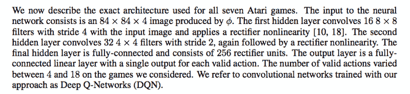

不言自明:)

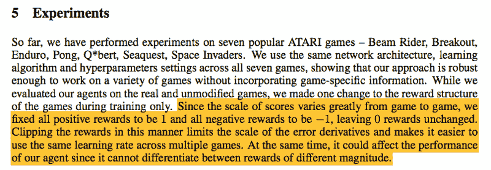

哦。前半部分不言自明。后半部分讲述了关于这个实验的一件非常重要的事情:输入给代理人的奖励的性质被修改了。于是，*任意*正奖励输入为+1，负奖励输入为-1，无变化输入为 0。这当然与真实游戏的工作方式非常不同——奖励总是在变化，一些成就的奖励高于其他成就。但令人印象深刻的是，尽管如此，该代理在某些游戏中的表现比人类还要好！

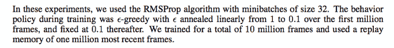

我们已经谈到了 e-greedy(在第 2 节)，并体验重放。这是关于他们实现的具体细节。

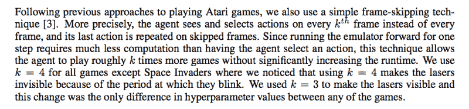

关于他们为什么使用 4 个视频帧的堆栈而不是为每个状态使用单个帧的更多细节。

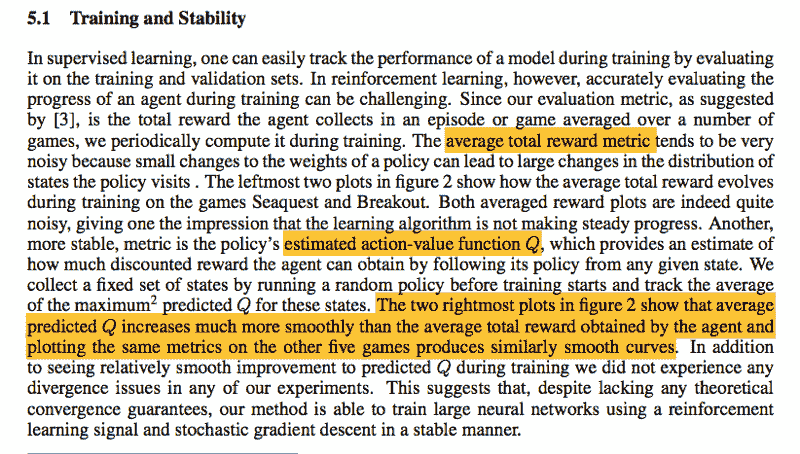

这是您在培训时使用的评估指标。通常在监督学习中，你有类似验证准确性的东西，但这里你没有任何验证集等来比较。那么，我们还可以用其他什么东西来检查我们的网络是在朝着一个点训练，还是权重只是在跳舞呢？嗯，让我们考虑一下。整篇论文的目的是创造一个在游戏中获得高分的人工智能代理，那么为什么不用总分作为我们的评估标准呢？而且我们可以打几场比赛，得到平均的总成绩。事实证明，使用这种度量标准在实践中并不奏效，因为它非常嘈杂。

让我们考虑一些其他的度量？嗯，我们在这个实验中做的另一件事是找到一个“策略”，人工智能将遵循它来确保最高分(正如前面解释的那样，这是一个非策略学习)。任何特定时刻的 Q 值代表人工智能未来期望的总回报。因此，如果人工智能发现了一个伟大的政策，那么该政策的 Q 值将会更高，对不对？让我们看看是否可以使用 Q 值本身作为我们的评估指标。瞧，它似乎比平均总报酬更稳定。现在，正如你所看到的，对此没有理论上的解释，这只是一个碰巧起作用的想法。(其实深度学习一直都是这样的。有些事情是行得通的，而其他一些看似常识的事情却行不通。另一个例子是辍学，这是一个疯狂的技术，但效果惊人。

这应该是不言自明的。它显示了价值函数在游戏的不同移动中是如何变化的。

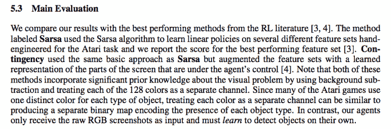

在这里，我们将这篇论文的结果与该领域先前的工作进行了比较。“Sarsa”是指【s1，a1，r，s2，a2】。这是一种基于策略的学习算法(与我们的非策略方法相反)。这么容易就能理解其中的区别，并不容易，[这里有一个很好的](https://studywolf.wordpress.com/2013/07/01/reinforcement-learning-sarsa-vs-q-learning/)。

还有[另一个](https://stackoverflow.com/a/41420616)。

这一段的其余部分很容易读懂。

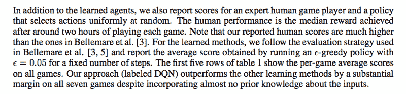

对于这一段和之后的所有内容… ' *看看他们的方法表现得有多好，你会惊叹不已！'*

哦，如果你出于任何原因(无论是营销还是教育)需要帮助向非技术人员解释你的科学或技术工作，我真的可以帮你。在推特上给我留言:@mngrwl