# 我见过的最好的 JavaScript 迷因，详细解释

> 原文：<https://www.freecodecamp.org/news/explaining-the-best-javascript-meme-i-have-ever-seen/>

### TLDR:强迫自己使用三重等式。

无意中在 Reddit 上发现了这个 JavaScript meme，是我见过的最好的一个。

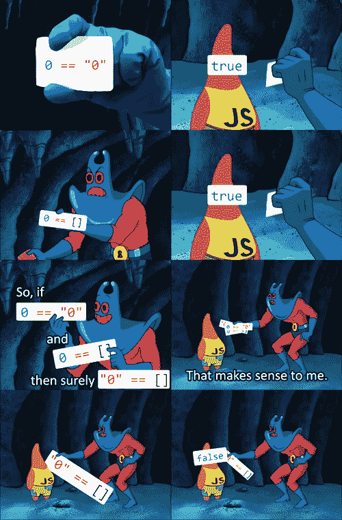

你可以通过运行开发者工具中的每个代码片段来验证这个迷因的准确性。结果并不令人惊讶，但还是有点令人失望。

当然，这个小实验让我产生了疑问...

## 为什么会这样？


有了经验之后，我学会了拥抱 JavaScript 光滑的一面，同时警惕它多刺的松树。尽管如此，这个角落案件的细节仍然刺痛了我。

正如凯尔·辛普森所说...

> "我认为没有人真正了解 JS，至少不完全了解."

当这些情况出现时，最好查阅来源 JavaScript 构建的官方 ECMAScript 规范。

有了 spec 在手，让我们深入了解一下这里到底是怎么回事。

## 第 1 小组-介绍胁迫

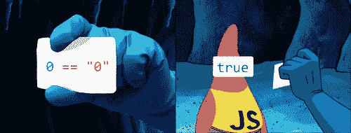

如果你在你的开发者控制台中运行`0 == "0"`，为什么它会返回`true`？

`0`是一个数字，`"0"`是一个字符串，它们绝对不能相同！大多数编程语言都尊重这一点。`0 == "0"`以 Java 为例，返回这个:

```
error: incomparable types: int and String 
```

这很有道理。如果你想在 Java 中比较 int 和 String，你必须先把它们转换成相同的类型。

但这是 JavaScript，伙计们！
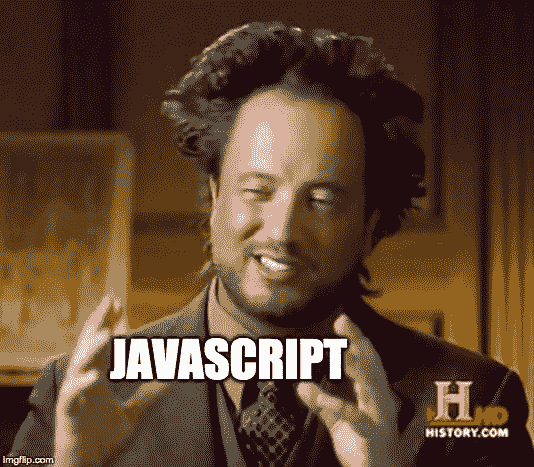

当您通过`==`比较两个值时，其中一个值可能会经历*强制*。

> 强制—**自动**将一个值从一种类型更改为另一种类型。

***自动*** 是这里的关键词。不是你*显式地*转换你的类型，而是 JavaScript 在幕后为你完成。

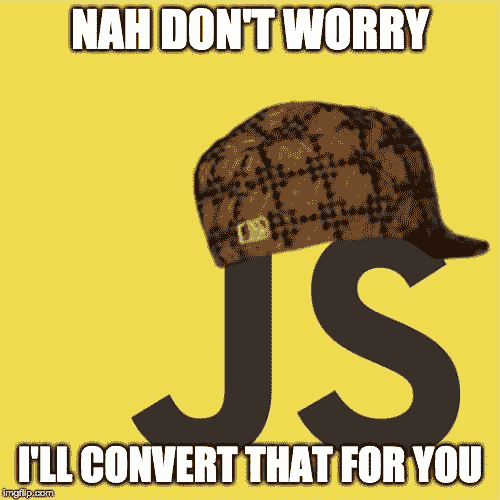

如果你有意利用它，这是很方便的，但是如果你没有意识到它的含义，这可能是有害的。

这是官方的 ECMAScript 语言规范。我来转述一下相关部分:

> 如果 x 是数字，y 是字符串，则返回 x == ToNumber(y)

所以对于我们的`0 == "0"`案例:

> 因为 0 是数字，“0”是字符串，所以返回 0 = = to Number(“0”)

我们的字符串`"0"`已经被偷偷转换为`0`，现在我们有匹配了！

```
0 == "0" // true
// The second 0 became a number!
// so 0 equals 0 is true.... 
```

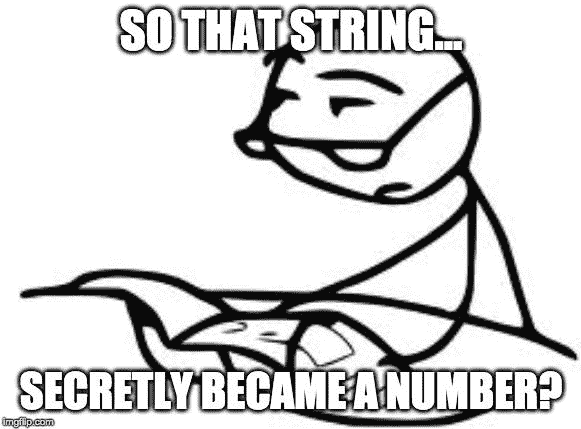

很奇怪吧？习惯吧，我们还没完成一半呢。

## 面板 2 -数组也被强制

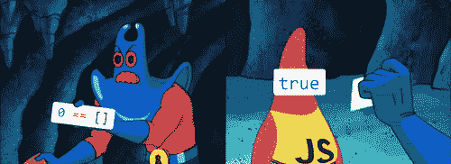

这种无意义并不局限于字符串、数字或布尔这样的原语。下面是我们的下一个对比:

```
0 == [] // true
// What happened...? 
```

又是胁迫！我将解释规范的相关部分:

> 如果 x 是字符串或数字，y 是对象，则返回 x == ToPrimitive(y)

这里有三件事:

### 1.是的，数组是对象

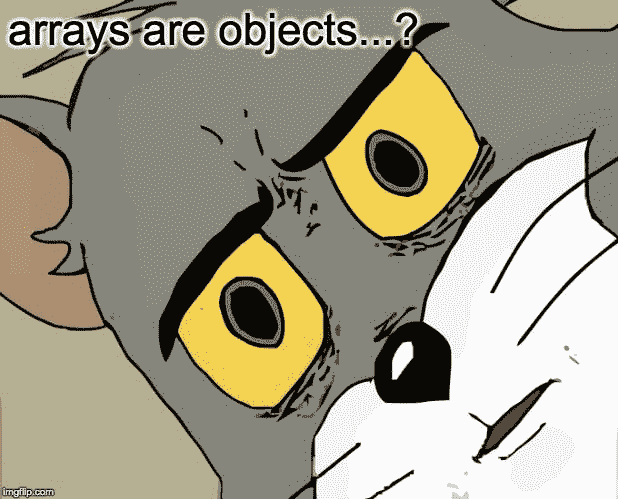

对不起，把它弄坏了。

### 2.空数组变成空字符串

再次[根据规范](https://www.ecma-international.org/ecma-262/5.1/#sec-8.12.8)，JS 首先寻找一个对象的`toString`方法来强制它。

对于数组，`toString`连接它的所有元素，并以字符串的形式返回它们。

```
[1, 2, 3].toString() // "1,2,3"
['hello', 'world'].toString() // "hello,world" 
```

因为我们的数组是空的，我们没有什么可加入的！因此...

```
[].toString() // "" 
```

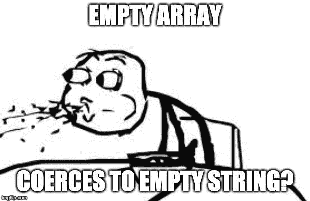

规范的`ToPrimitive`将这个空数组变成一个空字符串。为了您的方便(或困惑)，参考资料是这里的和这里的。

### 3.空字符串随后变为 0

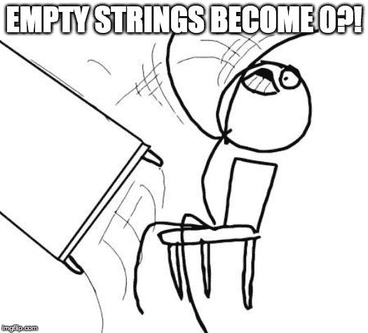

你不能编造这些东西。现在我们已经将数组强制为`""`，我们回到第一个算法...

> 如果 x 是数字，y 是字符串，则返回 x == ToNumber(y)

所以对于`0 == ""`

> 因为 0 是数字，而""是字符串，所以返回 0 == ToNumber(" ")

`ToNumber("")`返回 0。

因此，`0 == 0`再一次...

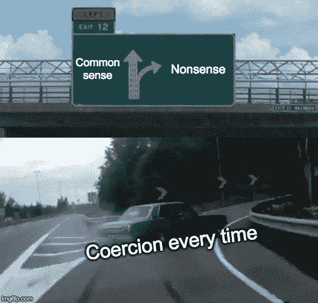

## 面板 3 -快速回顾

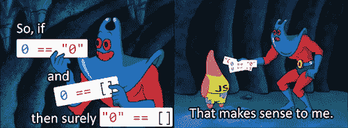

### 这是真的

```
0 == "0" // true 
```

因为强制把这个变成了`0 == ToNumber("0")`。

### 这是真的

```
0 == [] // true 
```

因为强制运行两次:

1.  `ToPrimitive([])`给出空字符串
2.  然后`ToNumber("")`给 0。

那么告诉我...按照上面的规则，这个应该回报什么？

```
"0" == [] 
```

## 面板 4 -错误！

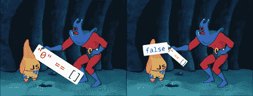

假的！正确。

如果你理解规则，这部分是有意义的。

下面是我们的对比:

```
"0" == [] // false 
```

再次引用规范:

> 如果 x 是字符串或数字，y 是对象，则返回 x == ToPrimitive(y)

这意味着...

> 因为“0”是字符串而[]是对象，所以返回 x == ToPrimitive([])

`ToPrimitive([])`返回空字符串。这种比较现在变成了

```
"0" == "" 
```

`"0"`和`""`都是字符串，所以 JavaScript 说*不再需要强制*。这就是我们得到`false`的原因。

## 结论

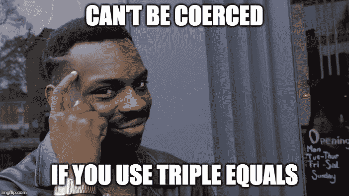

使用三倍等于，晚上睡得香。

```
0 === "0" // false
0 === [] // false
"0" === [] // false 
```

它完全避免了强制，所以我想它也更有效率！

但是性能提升几乎没有意义。真正的胜利是增加你对你的代码的信心，使额外的击键完全值得。

## 想要免费辅导？

如果你想安排一个**免费的** 15-30 分钟的电话，讨论关于代码、面试、职业或任何其他方面的前端开发问题[请在 Twitter 上关注我，并给我发短信](https://twitter.com/yazeedBee)。

之后，如果你喜欢我们的第一次会议，我们可以讨论一个持续的教练关系，这将有助于你达到你的前端发展目标！

## 感谢阅读

更多类似的内容，请查看[https://yazeedb.com！](https://yazeedb.com)

下次见！