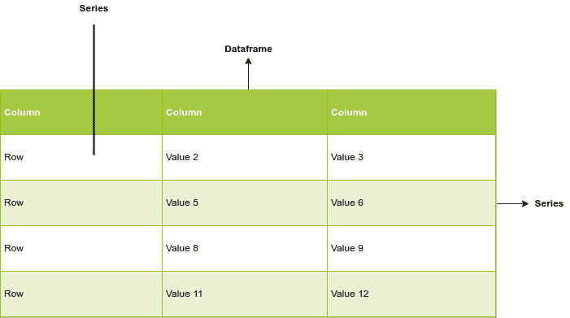

# Go 中的数据分析——如何使用 Gota 包

> 原文：<https://www.freecodecamp.org/news/exploratory-data-analysis-in-go-with-gota/>

数据分析是过滤、操作和处理原始数据和数据集以从中获得洞察力的过程。

Python 和 R 通常是数据分析的首选语言。但是这些日子围棋越来越受欢迎了。

在本教程中，我们将介绍 Gota，一个 Go 中的数据分析包，以及它的核心功能和用途。

## Gota 是什么？

Gota 是 Go 编程语言的一个系列、数据框架和数据争论模块。

Gota 类似于 Python 中的 Pandas 库，是为了与 Go 中的科学计算包 [Gonum](https://www.gonum.org/) 接口而构建的，就像 Pandas 和 Numpy 一样。

Gota 模块使 Go 中的数据交换(转换和操作)操作变得非常容易。它支持 Go 内置的数据类型和各种文件格式，如 JSON、CSV 和 HTML。

以下是一些先决条件:

*   对您系统的终端有所了解
*   一些围棋和函数式编程的知识
*   Go 的最新版本(我用的是 Go 1.17.6，但是你可以用不同的版本)
*   像 VS Code 这样的文本编辑器或者像 Goland 这样的专用 IDE

以下是我们将要介绍的内容:

*   Gota 系列
*   Gota 数据帧
*   将文件作为数据帧读取
*   Gota 数据帧上的操作
*   导出和保存文件

## 如何开始使用 Gota

首先，创建一个新目录，并在终端中导航到该目录。

对于本教程，我创建了一个名为`gota-tutorial`的新目录。

对于 Linux 或 Mac:

```
mkdir gota-tutorial
cd gota-tutorial
```

在新目录中，创建一个名为`main.go`的文件。

然后在`main.go`文件中，添加以下代码:

```
package main

import (
	"fmt"
	"github.com/go-gota/gota/dataframe"
	"github.com/go-gota/gota/series"
)

func main() {
	// Future code will go here
} 
```

请注意，本教程中所有未来的代码都将放在`main`函数体中。

接下来，在您的终端中运行下面的命令来初始化一个模块并启用依赖项跟踪。这是一个简单的例子，所以模块名/路径将被称为`example/gota-tutorial`:

```
go mod init example/gota-tutorial
```

您应该会看到以下输出:

```
go: creating new go.mod: module example/gota-tutorial
go: to add module requirements and sums:
        go mod tidy
```

您应该会在项目目录中看到一个新的`go.mod`文件。

最后，运行`go mod tidy`添加模块需求和总数，或者换句话说，安装运行 Gota 所需的一切:

```
go mod tidy
```

运行该命令后，您应该会看到一个新的`go.sum`文件。所以您的目录现在应该有一个`main.go`文件，以及自动生成的`go.mod`和`go.sum`文件。

你可以在这个[官方入门指南](https://go.dev/doc/tutorial/getting-started#install)中阅读更多关于依赖性跟踪的内容。

## Gota 的基本概念



在开始之前，让我们学习一些 Gota 基础知识。

**数据集**是数据的集合，无论是表格形式还是其他形式。

**数据帧**是将数据组织成二维(行和列)表格的数据结构，通常用于分析目的。

**系列**是属于数据帧的一维数据的集合。

注意，`df`和类似`dogsDf`的变体是 DataFrame 对象的变量名，在本文中用作示例。

## Gota 系列是什么？

Gota 系列是使用复合数据类型的`series.New()`方法创建的，比如切片和地图。

对于切片，`series.New()`接受三个参数:它接受切片、序列类型(包含在序列中的元素类型)和列名。

```
series.New([]string{"z", "y", "d", "e"}, series.String, "col") 
```

通过将键初始化为类型`series`并使用`.Type`方法插入系列类型，也可以从映射中创建系列。

```
a := map[string]series.Type{
	"A": series.String,
	"D": series.Bool,
} 
```

这些切片可以传递到数据帧中，以供进一步操作。

请注意，如果您想查看上面代码的输出，您需要注释掉`"github.com/go-gota/gota/dataframe"`，并使用`fmt.Println()`，如下所示:

```
package main

import (
	"fmt"
	// "github.com/go-gota/gota/dataframe"
	"github.com/go-gota/gota/series"
)

func main() {
	fmt.Println(series.New([]string{"z", "y", "d", "e"}, series.String, "col"))

	a := map[string]series.Type{
		"A": series.String,
		"D": series.Bool,
	}

	fmt.Println(a)
}
```

然后，在终端中输入`go run .`命令，运行代码后，您可以在控制台中看到这两个系列。

**输出:**

```
[z y d e]
map[A:string D:bool]
```

## 什么是 Gota 数据框架？

数据帧功能包含在 Gota `dataframe`子模块中。

数据帧是其他数据结构的数据结构。本质上，它们将数据格式化为二维表格，以便您可以操作这些数据。因此，为了使用数据帧，我们读取其他数据结构和数据类型。

在本教程中，我们将阅读 Series、structs、JSON 和 CSV 文件。

## 如何将系列转换为 DataFrame 对象

您可以使用`dataframe.New()`方法将一个系列或一组系列转换成 DataFrame 对象。它接受系列或系列集作为参数:

```
package main

import (
	"fmt"
	"github.com/go-gota/gota/dataframe"
	"github.com/go-gota/gota/series"
)

func main() {
	df := dataframe.New(
		series.New([]string{"a", "b", "c", "d", "e"}, series.String, "alphas"),
		series.New([]int{5, 4, 2, 3, 1}, series.Int, "numbers"),
		series.New([]string{"a1", "b2", "c3", "d4", "e5"}, series.String, "alnums"),
		series.New([]bool{true, false, true, true, false}, series.Bool, "state"),
	)

	fmt.Println(df)
} 
```

请注意，`"github.com/go-gota/gota/dataframe"`在上面的代码中已经被取消注释。

**输出**:

```
[5x4] DataFrame

    alphas   numbers alnums   state
 0: a        5       a1       true
 1: b        4       b2       false
 2: c        2       c3       true
 3: d        3       d4       true
 4: e        1       e5       false
    <string> <int>   <string> <bool>
```

## 结构类型的数据框架

您可以使用结构来创建数据帧:

```
package main

import (
	"fmt"
	"github.com/go-gota/gota/dataframe"
	// "github.com/go-gota/gota/series"
)

func main() {
	type Dog struct {
		Name       string
		Color      string
		Height     int
		Vaccinated bool
	}

	dogs := []Dog{
		{"Buster", "Black", 56, false},
		{"Jake", "White", 61, false},
		{"Bingo", "Brown", 50, true},
		{"Gray", "Cream", 68, false},
	}

	dogsDf := dataframe.LoadStructs(dogs)

    fmt.Println(dogsDf)
} 
```

您可以通过创建 struct 类型实例的切片并使用接受切片的`dataframe.LoadStructs`方法创建数据帧来实现这一点。

另外，请注意`"github.com/go-gota/gota/series"`被注释掉了。

**输出**:

```
[4x4] DataFrame

    Name     Color    Height Vaccinated
 0: Buster   Black    56     false
 1: Jake     White    61     false
 2: Bingo    Brown    50     true
 3: Gray     Cream    68     false
    <string> <string> <int>  <bool>
```

## 如何在 Gota 中查询数据帧

当我们有一个 DataFrame 对象时，我们可以使用各种方法查询它，以获得有关 DataFrame 组成的信息。

*   `df.Dims()` →输出数据框对象的尺寸
*   `df.Types()` →输出构成数据帧的数据类型
*   `df.Names()` →输出数据帧的列名
*   `df.Nrow()` →输出行数
*   `df.Ncol()` →输出列数

下面是使用之前的`dogsDf`示例时的情况:

```
package main

import (
	"fmt"
	"github.com/go-gota/gota/dataframe"
)

func main() {
	type Dog struct {
		Name       string
		Color      string
		Height     int
		Vaccinated bool
	}

	dogs := []Dog{
		{"Buster", "Black", 56, false},
		{"Jake", "White", 61, false},
		{"Bingo", "Brown", 50, true},
		{"Gray", "Cream", 68, false},
	}

	dogsDf := dataframe.LoadStructs(dogs)

	fmt.Println(dogsDf.Dims())
	fmt.Println(dogsDf.Types())
	fmt.Println(dogsDf.Names())
	fmt.Println(dogsDf.Nrow())
	fmt.Println(dogsDf.Ncol())
} 
```

**输出:**

```
4 4
[string string int bool]
[Name Color Height Vaccinated]
4
4
```

## 如何查询列

Gota DataFrame 列有许多方法可以帮助查询列值。

一旦您用`df.Col("column_name")`选择了一列，您可以使用以下一些方法:

*   `col.IsNaN()` →检查是否为空列
*   `col.Mean()` →返回列的平均值
*   `col.Copy()` →创建列的新副本
*   `col.HasNaN()` →检查列中是否有空值
*   `col.Records()` →返回列中的值

下面是使用之前的`dogsDf`示例时的情况:

```
package main

import (
	"fmt"
	"github.com/go-gota/gota/dataframe"
)

func main() {
	type Dog struct {
		Name       string
		Color      string
		Height     int
		Vaccinated bool
	}

	dogs := []Dog{
		{"Buster", "Black", 56, false},
		{"Jake", "White", 61, false},
		{"Bingo", "Brown", 50, true},
		{"Gray", "Cream", 68, false},
	}

	dogsDf := dataframe.LoadStructs(dogs)

	col := dogsDf.Col("Height") // Selects a column
	fmt.Println(col.IsNaN())
	fmt.Println(col.Mean())
	fmt.Println(col.Copy())
	fmt.Println(col.HasNaN())
	fmt.Println(col.Records())
} 
```

**输出:**

```
[false false false false]
58.75
[56 61 50 68]
false
[56 61 50 68]
```

## 如何将 JSON 和 CSV 字符串转换成 DataFrame 对象

JSON 和 CSV 字符串可以分别传递给`dataframe.ReadJSON()`和`dataframe.ReadCSV()`。

### 如何将 JSON 字符串转换成数据帧

使用`strings.NewReader()`将 JSON 字符串变量作为参数传递给`dataframe.ReadJSON()`，后者返回一个缓冲的 JSON 字符串。

将`"strings"`包和`"github.com/go-gota/gota/dataframe"`一起导入，也可以选择`"fmt"`。

然后在您的`main`函数中，包含一个 JSON 字符串，用`strings.NewReader()`读取它，并将其传递给`dataframe.ReadJSON()`:

```
package main

import (
	"fmt"
	"github.com/go-gota/gota/dataframe"
	"strings"
)

func main() {
	jsonString := `[
  {
    "Name": "John",
    "Age": 44,
    "Favorite Color": "Red",
    "Height(ft)": 6.7
  },
  {
    "Name": "Mary",
    "Age": 40,
    "Favorite Color": "Blue",
    "Height(ft)": 5.7
  }
]`

	jsonDf := dataframe.ReadJSON(strings.NewReader(jsonString))
	fmt.Println(jsonDf)
} 
```

**输出:**

```
[2x4] DataFrame

    Age   Favorite Color Height(ft) Name
 0: 44    Red            6.700000   John
 1: 40    Blue           5.700000   Mary
    <int> <string>       <float>    <string>
```

### 如何将 CSV 字符串转换成数据帧

下面是一个类似的例子，但是使用的是 CSV 字符串。

这一次，用`strings.NewReader()`读取 CSV 字符串，并将其传递给`dataframe.ReadCSV()`:

```
package main

import (
	"fmt"
	"github.com/go-gota/gota/dataframe"
	"strings"
)

func main() {
	csvString := `
Name,Age,Favorite Color,Height(ft)
John,44,Red,6.7
Mary,40,Blue,5.7`

	csvDf := dataframe.ReadCSV(strings.NewReader(csvString))
	fmt.Println(csvDf)
} 
```

main.go

**输出**:

```
[2x4] DataFrame

    Name     Age   Favorite Color Height(ft)
 0: John     44    Red            6.700000
 1: Mary     40    Blue           5.700000
    <string> <int> <string>       <float>
```

### 如何将 CSV 文件转换成数据帧

假设您在一个名为`stats.csv`的单独文件中有一些 CSV 文件，包含以下内容:

```
Name,Age,Favorite Color,Height(ft)
John,44,Red,6.7
Mary,40,Blue,5.7
Esther,35,Black,4.9
Jason,36,Green,5.2 
```

stats.csv

你可以用`os.Open()`读取你的 CSV 文件，它以文件名作为参数。

`defer`和`.Close()`模式有助于在程序结束运行时关闭文件，以防止数据丢失。

首先，连同`"github.com/go-gota/gota/dataframe"`和`"fmt"`一起导入`"log"`和`"os"`。

然后，用`os.Open()`读取文件，使用`defer`和`.Close()`模式，并添加一些简单的错误记录:

```
package main

import (
	"fmt"
	"github.com/go-gota/gota/dataframe"
	"log"
	"os"
)

func main() {
	file, err := os.Open("stats.csv")
	defer file.Close()
	if err != nil {
		log.Fatal(err)
	}
	df := dataframe.ReadCSV(file)

	fmt.Println(df)
} 
```

**输出:**

```
[4x4] DataFrame

    Name     Age   Favorite Color Height(ft)
 0: John     44    Red            6.700000
 1: Mary     40    Blue           5.700000
 2: Esther   35    Black          4.900000
 3: Jason    36    Green          5.200000
    <string> <int> <string>       <float>
```

### 如何将 JSON 文件转换成数据帧

读取一个单独的 JSON 文件并将其转换成 DataFrame 是非常相似的。

假设你这次有一个`stats.json`文件:

```
[
  {
    "Name": "John",
    "Age": 44,
    "Favorite Color": "Red",
    "Height(ft)": 6.7
  },
  {
    "Name": "Mary",
    "Age": 40,
    "Favorite Color": "Blue",
    "Height(ft)": 5.7
  },
  {
    "Name": "Esther",
    "Age": 35,
    "Favorite Color": "Black",
    "Height(ft)": 4.9
  },
  {
    "Name": "Mary",
    "Age": 40,
    "Favorite Color": "Green",
    "Height(ft)": 5.2
  }
] 
```

但是这一次，你需要用`dataframe.ReadJSON()`来代替:

```
package main

import (
	"fmt"
	"github.com/go-gota/gota/dataframe"
	"log"
	"os"
)

func main() {
	file, err := os.Open("stats.json")
	defer file.Close()
	if err != nil {
		log.Fatal(err)
	}
	df := dataframe.ReadJSON(file)

	fmt.Println(df)
} 
```

**输出:**

```
[4x4] DataFrame

    Age   Favorite Color Height(ft) Name
 0: 44    Red            6.700000   John
 1: 40    Blue           5.700000   Mary
 2: 35    Black          4.900000   Esther
 3: 40    Green          5.200000   Mary
    <int> <string>       <float>    <string>
```

## Gota 数据帧操作

现在，您已经了解了使用数据帧和数据系列的基本知识，以及如何用数据填充这两者，我们将了解更多用数据帧处理数据的方法。

### 如何在 Gota 中选择行

您可以使用 DataFrame 对象的`.Subset()`方法选择行。

`df.Subset()`接受两个整数的切片，这两个整数描述了应该选择的行数:

```
// This selects the first two rows of the DataFrame
rows := df.Subset([]int{0, 2}) 
```

下面是根据上面的 CSV 文件示例构建的完整代码:

```
package main

import (
	"fmt"
	"github.com/go-gota/gota/dataframe"
	"log"
	"os"
)

func main() {
	file, err := os.Open("stats.csv")
	defer file.Close()
	if err != nil {
		log.Fatal(err)
	}
	df := dataframe.ReadCSV(file)

	// This selects the first two rows of the DataFrame
	rows := df.Subset([]int{0, 2})

	fmt.Println(rows)
} 
```

**输出:**

```
[2x4] DataFrame

    Name     Age   Favorite Color Height(ft)
 0: John     44    Red            6.700000
 1: Esther   35    Black          4.900000
    <string> <int> <string>       <float>
```

### 如何在 Gota 中选择列

使用`.Select()`方法选择数据帧的列。

`df.Select()`接受两个整数的切片，这两个整数描述了应该选择多少列:

```
// This selects the first two columns of a DataFrame
columns := df.Select([]int{0, 2}) 
```

您也可以通过传递一段字符串来按索引(列名)选择列:

```
// This selects columns of a DataFrame by name
columns := df.Select([]string{"Name", "Favorite Color"}) 
```

下面是使用前面的 CSV 文件示例的完整代码，展示了选择列的两种方法:

```
package main

import (
	"fmt"
	"github.com/go-gota/gota/dataframe"
	"log"
	"os"
)

func main() {
	file, err := os.Open("stats.csv")
	defer file.Close()
	if err != nil {
		log.Fatal(err)
	}
	df := dataframe.ReadCSV(file)

	// This selects the first two columns of a DataFrame
	firstTwoColumns := df.Select([]int{0, 2})

	// This selects columns of a DataFrame by name
	namedColumns := df.Select([]string{"Name", "Favorite Color"})

	fmt.Println(firstTwoColumns)
	fmt.Println(namedColumns)
} 
```

**输出:**

```
[4x2] DataFrame

    Name     Favorite Color
 0: John     Red
 1: Mary     Blue
 2: Esther   Black
 3: Jason    Green
    <string> <string>

[4x2] DataFrame

    Name     Favorite Color
 0: John     Red
 1: Mary     Blue
 2: Esther   Black
 3: Jason    Green
    <string> <string>
```

### 如何在 Gota 中更新数据帧

使用 DataFrame 对象的`.Set()`方法更新条目。

`df.Set()`接受一个整数片，指定要更新的行数限制，以及一个`dataframe.LoadRecords()`函数，接受一个二维片，类型为:

```
updatedDf := df.Set(
	[]int{0, 3},
	dataframe.LoadRecords(
		[][]string{
			[]string{"Jenny", "23", "Purple", "2.2"},
			[]string{"Jesse", "34", "Indigo", "3.5"},
			[]string{"Peter", "33", "Violet", "3.3"},
		},
	),
)
```

注意，`df.Set()`方法修改了

同样，基于前面的 CSV 文件示例，下面是如何更新数据帧中的条目:

```
package main

import (
	"fmt"
	"github.com/go-gota/gota/dataframe"
	"log"
	"os"
)

func main() {
	file, err := os.Open("stats.csv")
	defer file.Close()
	if err != nil {
		log.Fatal(err)
	}
	df := dataframe.ReadCSV(file)

	updatedDf := df.Set(
		[]int{0, 3},
		dataframe.LoadRecords(
			[][]string{
				[]string{"Jenny", "23", "Purple", "2.2"},
				[]string{"Jesse", "34", "Indigo", "3.5"},
				[]string{"Peter", "33", "Violet", "3.3"},
			},
		),
	)

	fmt.Println(updatedDf)
} 
```

**输出**:

```
[4x4] DataFrame

    Name     Age   Favorite Color Height(ft)
 0: Jesse    34    Indigo         3.500000
 1: Mary     40    Blue           5.700000
 2: Esther   35    Black          4.900000
 3: Peter    33    Violet         3.300000
    <string> <int> <string>       <float>
```

### 如何在 Gota 中过滤值

在 DataFrame 对象上使用`.Filter()`方法过滤出值。

这需要接受`dataframe.F`，向其传递一个 struct 文本。

struct 文本接受一个列名`Colname`、一个比较器`Comparator`和一个值`Comparando`，该值是您想要从 DataFrame 中过滤出来的值。

**比较器:**

*   `series.Eq` →等于=
*   `series.Neq` →不等于≠
*   `series.Greater` →大于>
*   `series.GreaterEq` →大于等于≥
*   `series.Less` →小于<
*   `series.LessEq` →小于或等于≤
*   `series.In` →包含在

在本例中，我们使用了系列中的 dataframe 对象到上面的 dataframe 部分。

使用本教程前面的一些不同的示例代码，下面是一个简单的`.Filter()`方法示例:

```
package main

import (
	"fmt"
	"github.com/go-gota/gota/dataframe"
	"github.com/go-gota/gota/series"
)

func main() {
	df := dataframe.New(
		series.New([]string{"a", "b", "c", "d", "e"}, series.String, "alphas"),
		series.New([]int{5, 4, 2, 3, 1}, series.Int, "numbers"),
		series.New([]string{"a1", "b2", "c3", "d4", "e5"}, series.String, "alnums"),
		series.New([]bool{true, false, true, true, false}, series.Bool, "state"),
	)

	// Filter out b from the column named alphas
	fil := df.Filter(
		dataframe.F{Colname: "alphas", Comparator: series.Eq, Comparando: "b"},
	)

	fmt.Println(fil)
} 
```

**输出:**

```
[1x4] DataFrame

    alphas   numbers alnums   state
 0: b        4       b2       false
    <string> <int>   <string> <bool>
```

### 如何在 Gota 中对数据帧进行排序

要对 DataFrame 进行排序，请使用 DataFrame 对象的`.Arrange()`方法。

`df.Arrange()`方法接受`dataframe.Sort()`或`dataframe.RevSort()`，它们分别按升序或降序排序。它还接受要作为字符串排序的列的名称。

**如何升序排序:**

这里有一个片段展示了如何使用`df.Arrange()`方法按升序排序:

```
sorted := df.Arrange(
	dataframe.Sort("numbers"),
)
```

**如何降序排序:**

以下代码片段向您展示了如何按降序排序:

```
sorted := df.Arrange(
	dataframe.RevSort("numbers"),
)
```

下面是完整的代码，使用了本教程前面的一个示例，展示了如何按升序和降序排序:

```
// Continue from How to Sort a Dataframe in Gota

package main

import (
	"fmt"
	"github.com/go-gota/gota/dataframe"
	"github.com/go-gota/gota/series"
)

func main() {
	df := dataframe.New(
		series.New([]string{"a", "b", "c", "d", "e"}, series.String, "alphas"),
		series.New([]int{5, 4, 2, 3, 1}, series.Int, "numbers"),
		series.New([]string{"a1", "b2", "c3", "d4", "e5"}, series.String, "alnums"),
		series.New([]bool{true, false, true, true, false}, series.Bool, "state"),
	)

	sortedAscending := df.Arrange(
		dataframe.Sort("numbers"),
	)

	fmt.Println(sorted)
} 
```

**输出:**

```
[5x4] DataFrame

    alphas   numbers alnums   state
 0: e        1       e5       false
 1: c        2       c3       true
 2: d        3       d4       true
 3: b        4       b2       false
 4: a        5       a1       true
    <string> <int>   <string> <bool>

[5x4] DataFrame

    alphas   numbers alnums   state
 0: a        5       a1       true
 1: b        4       b2       false
 2: d        3       d4       true
 3: c        2       c3       true
 4: e        1       e5       false
    <string> <int>   <string> <bool>
```

### 如何在 Gota 中对数据进行分类

您可以使用 DataFrame 对象的`.GroupBy()`方法根据特定的列对数据进行分类。

要使用`df.GroupBy()`方法，只需传入想要分组的列名:

```
categorize := df.GroupBy("Name", "Age")
```

同样，基于前面的 CSV 文件示例，下面是如何更新数据帧中的条目:

同样，使用前面的 CSV 文件示例，下面是如何使用`df.GroupBy()`按列对数据进行分类或分组:

```
package main

import (
	"fmt"
	"github.com/go-gota/gota/dataframe"
	"log"
	"os"
)

func main() {
	file, err := os.Open("stats.csv")
	defer file.Close()
	if err != nil {
		log.Fatal(err)
	}
	df := dataframe.ReadCSV(file)

	categorize := df.GroupBy("Name", "Age")

	fmt.Println(categorize)
} 
```

### 如何在 Gota 中连接数据框架

连接是数据帧的组合。用 Gota 连接数据帧就像在 SQL(结构化查询语言)中一样。

**连接类型:**

*   内部连接→ `df.InnerJoin()`返回两个表中匹配值的数据帧
*   左连接→ `df.LeftJoin()`匹配右数据帧和左数据帧的相似性
*   右连接→ `df.RightJoin()`匹配左数据帧和右数据帧的相似性
*   外部连接→ `df.OuterJoin()`返回数据帧的所有值

以下是联接 DataFrames 对象的基本语法:

```
joinVariableName := df.joinType(otherDataframe, joinKey) 
```

联接键是 DataFrame 对象中要执行联接的列。

请注意，`joinKey`是 DataFrame 对象的列的字符串，其中应该执行连接。

下面是一些显示如何进行左连接的代码:

```
package main

import (
	"fmt"
	"github.com/go-gota/gota/dataframe"
	"github.com/go-gota/gota/series"
)

func main() {
	dfA := dataframe.New(
		series.New([]string{"a", "b", "c", "d", "e"}, series.String, "alphas"),
		series.New([]int{5, 4, 2, 3, 1}, series.Int, "numbers"),
		series.New([]string{"a1", "b2", "c3", "d4", "e5"}, series.String, "alnums"),
		series.New([]bool{true, false, true, true, false}, series.Bool, "state"),
	)
	dfB := dataframe.New(
		series.New([]string{"f", "g", "h", "i", "j"}, series.String, "alphas"),
		series.New([]int{1, 2, 3, 4, 5}, series.Int, "numbers"),
		series.New([]string{"f6", "g7", "h8", "i9", "j10"}, series.String, "alnums"),
		series.New([]bool{false, true, false, false, true}, series.Bool, "state"),
	)

	leftJoin := dfA.RightJoin(dfB, "state")

	fmt.Println(leftJoin)
} 
```

**输出:**

```
[12x7] DataFrame

    state  alphas_0 numbers_0 alnums_0 alphas_1 numbers_1 alnums_1
 0: false  b        4         b2       f        1         f6
 1: false  e        1         e5       f        1         f6
 2: true   a        5         a1       g        2         g7
 3: true   c        2         c3       g        2         g7
 4: true   d        3         d4       g        2         g7
 5: false  b        4         b2       h        3         h8
 6: false  e        1         e5       h        3         h8
 7: false  b        4         b2       i        4         i9
 8: false  e        1         e5       i        4         i9
 9: true   a        5         a1       j        5         j10
    ...    ...      ...       ...      ...      ...       ...
    <bool> <string> <int>     <string> <string> <int>     <string>
```

### 如何在 Gota 中对数据帧应用函数

要将函数应用于 DataFrame 的列和行，请分别对 DataFrame 对象使用`.Capply()`和`.Rapply()`方法。

这些函数接受要应用于列或行的函数:

```
df.Capply(function)
df.Rapply(function) 
```

下面是一个完整的示例，展示了从单个系列创建的简单数据框架。其中，`.Capply()`和`.Rapply()`方法用于应用一个函数来计算一列的平均值:

```
package main

import (
	"fmt"
	"github.com/go-gota/gota/dataframe"
	"github.com/go-gota/gota/series"
)

func main() {
	df := dataframe.New(
		series.New([]int{95, 74, 59, 82, 87}, series.Int, "score"),
	)

	mean := func(s series.Series) series.Series {
		floats := s.Float()
		sum := 0.0
		for _, f := range floats {
			sum += f
		}
		return series.Floats(sum / float64(len(floats)))
	}

	meanScore := df.Capply(mean)

	fmt.Println(meanScore)
} 
```

[Source of the `mean` function](https://github.com/go-gota/gota#function-application)

### 如何在 Gota 中的数据帧上使用 Describe

使用 DataFrame 对象上的`.Describe()`返回 DataFrame 值的描述性统计数据:

```
description := df.Describe() 
```

这是一个完整的例子:

```
package main

import (
	"fmt"
	"github.com/go-gota/gota/dataframe"
	"github.com/go-gota/gota/series"
)

func main() {
	df := dataframe.New(
		series.New([]string{"a", "b", "c", "d", "e"}, series.String, "alphas"),
		series.New([]int{5, 4, 2, 3, 1}, series.Int, "numbers"),
		series.New([]string{"a1", "b2", "c3", "d4", "e5"}, series.String, "alnums"),
		series.New([]bool{true, false, true, true, false}, series.Bool, "state"),
	)

	description := df.Describe()

	fmt.Println(description)
} 
```

**输出:**

```
[8x5] DataFrame

    column   alphas   numbers  alnums   state
 0: mean     -        3.000000 -        0.600000
 1: median   -        3.000000 -        NaN
 2: stddev   -        1.581139 -        0.547723
 3: min      a        1.000000 a1       0.000000
 4: 25%      -        2.000000 -        0.000000
 5: 50%      -        3.000000 -        1.000000
 6: 75%      -        4.000000 -        1.000000
 7: max      e        5.000000 e5       1.000000
    <string> <string> <float>  <string> <float>
```

## 如何导出数据帧(在 Go 中写文件)

一旦完成数据操作，就可以使用`.WriteCSV()`和`.WriteJSON()`方法将数据导出为 CSV 或 JSON 文件。

### 如何将数据帧导出为 CSV 文件

要将数据导出为 CSV 文件，只需对要导出为 CSV 文件的 DataFrame 对象使用`.WriteCSV()`方法。

首先，使用`os`包创建一个文件，然后将该文件传递给`df.WriteCSV()`方法，以 CSV 格式导出数据帧:

```
file, err := os.Create("output.csv")
if err != nil {
	log.Fatal(err)
}

df.WriteCSV(file) 
```

下面是一个完整的示例，展示了如何从 CSV 字符串构建数据帧、更新数据帧以及将更新后的数据帧导出为 CSV 文件:

```
package main

import (
	"github.com/go-gota/gota/dataframe"
	"log"
	"os"
	"strings"
)

func main() {
	csvString := `
Name,Age,Favorite Color,Height(ft)
John,44,Red,6.7
Mary,40,Blue,5.7
Paul,27,green,5.6`

	df := dataframe.ReadCSV(strings.NewReader(csvString))

	updatedDf := df.Set(
		[]int{0, 2},
		dataframe.LoadRecords(
			[][]string{
				[]string{"Jenny", "23", "Purple", "2.2"},
				[]string{"Jesse", "34", "Indigo", "3.5"},
				[]string{"Peter", "33", "Violet", "3.3"},
			},
		),
	)

	file, err := os.Create("output.csv")
	if err != nil {
		log.Fatal(err)
	}

	updatedDf.WriteCSV(file)
} 
```

下面的 CSV 将被写入`output.csv`:

```
Name,Age,Favorite Color,Height(ft)
Jesse,34,Indigo,3.500000
Mary,40,Blue,5.700000
Peter,33,Violet,3.300000 
```

### 如何将数据帧导出为 JSON 文件

将您的数据导出为 JSON 文件非常类似，只是在您想要导出的 DataFrame 对象上使用了`.WriteJSON()`方法。

这里有一个完整的例子:

```
package main

import (
	"github.com/go-gota/gota/dataframe"
	"log"
	"os"
	"strings"
)

func main() {
	csvString := `
Name,Age,Favorite Color,Height(ft)
John,44,Red,6.7
Mary,40,Blue,5.7
Paul,27,green,5.6`

	df := dataframe.ReadCSV(strings.NewReader(csvString))

	updatedDf := df.Set(
		[]int{0, 2},
		dataframe.LoadRecords(
			[][]string{
				[]string{"Jenny", "23", "Purple", "2.2"},
				[]string{"Jesse", "34", "Indigo", "3.5"},
				[]string{"Peter", "33", "Violet", "3.3"},
			},
		),
	)

	file, err := os.Create("output.json")
	if err != nil {
		log.Fatal(err)
	}

	updatedDf.WriteJSON(file)
} 
```

现在您应该有一个名为`output.json`的文件，包含以下 JSON 数组:

```
[{"Age":34,"Favorite Color":"Indigo","Height(ft)":3.5,"Name":"Jesse"},{"Age":40,"Favorite Color":"Blue","Height(ft)":5.7,"Name":"Mary"},{"Age":33,"Favorite Color":"Violet","Height(ft)":3.3,"Name":"Peter"}] 
```

## 结论

在本教程中，您学习了如何在 Go 中执行数据分析。您还了解了 Gota 包的各种功能。

主要使用 Python 和 R 进行数据分析仍然是一个好主意，因为它们被认为是行业标准。但是 Gota 对于要求速度和同质性的应用是有用的。

查看 [Gota 文档](https://pkg.go.dev/github.com/go-gota/gota/dataframe)以了解更多信息或为项目做出贡献。

享受编码和探索的乐趣！