# 什么是数据分析？如何用 Python，Numpy，Pandas，Matplotlib & Seaborn 教程可视化数据

> 原文：<https://www.freecodecamp.org/news/exploratory-data-analysis-with-numpy-pandas-matplotlib-seaborn/>

数据分析是使用统计测量和可视化从数据中探索、调查和收集见解的过程。

数据分析的目标是通过揭示趋势、关系和模式来发展对数据的理解。

数据分析既是一门科学也是一门艺术。一方面，它要求你了解统计学、可视化技术和数据分析工具，如 Numpy、Pandas 和 Seaborn。

另一方面，它要求你提出有趣的问题来引导调查，然后解读数字和图形以产生有用的见解。

本数据分析教程涵盖以下主题:

1.  [什么是数值计算？面向初学者的 Python 和 Numpy】](#what-is-numerical-computation-python-and-numpy-for-beginners)
2.  [如何使用 Python 和 Pandas 分析表格数据](#how-to-analyze-tabular-data-using-python-and-pandas)
3.  [使用 Python、Matplotlib 和 Seaborn 的数据可视化](#data-visualization-using-python-matplotlib-and-seaborn)

## 什么是数值计算？面向初学者的 Python 和 Numpy

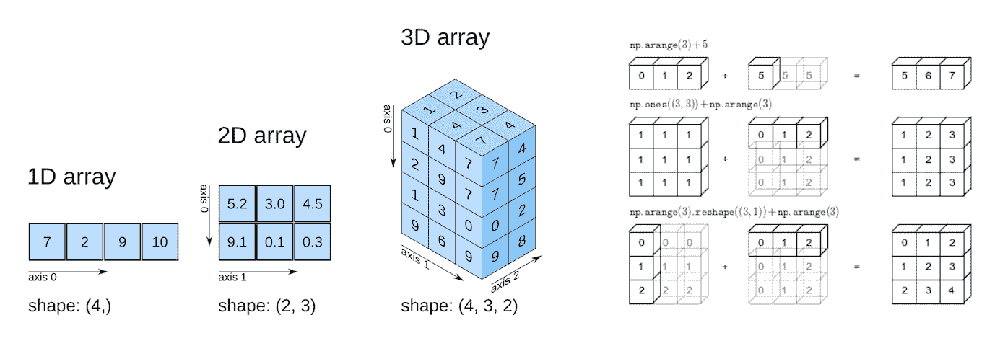

Source: [Elegant Scipy](https://github.com/elegant-scipy/elegant-scipy/blob/master/figures/NumPy_ndarrays_v2.png)

你可以跟随教程并在这里运行代码:[https://jovian . ai/aakashns/python-numerical-computing-with-nump](https://jovian.ai/aakashns/python-numerical-computing-with-numpy)y

本节涵盖以下主题:

*   如何在 Python 中处理数值数据
*   如何将 Python 列表转换成 Numpy 数组
*   多维数字阵列及其优势
*   数组操作、广播、索引和切片
*   如何使用 Numpy 处理 CSV 数据文件

### 如何在 Python 中处理数值数据

**数据分析** 中的“数据”通常是指数字数据，如股票价格、销售数字、传感器测量值、体育比分、数据库表等等。

Numpy 库为 Python 中的数值计算提供了专门的数据结构、函数和其他工具。让我们通过一个例子来看看为什么以及如何使用 Numpy 来处理数字数据。

假设我们想要使用温度、降雨量和湿度等气候数据来确定一个地区是否非常适合种植苹果。

一个简单的方法是将苹果年产量(吨/公顷)与平均温度(华氏度)、降雨量(毫米)和平均相对湿度(百分比)等气候条件之间的关系用线性方程表示。

`yield_of_apples = w1 * temperature + w2 * rainfall + w3 * humidity`

我们将苹果的产量表示为温度、降雨量和湿度的加权和。

这个等式是一个近似值，因为实际的关系不一定是线性的，可能还涉及其他因素。但是像这样简单的线性模型在实践中通常效果很好。

基于对历史数据的一些统计分析，我们可能会得出权重`w1`、`w2`和`w3`的合理值。以下是一组值的示例:

```
w1, w2, w3 = 0.3, 0.2, 0.5
```

给定一个地区的一些气候数据，我们现在可以预测苹果的产量。以下是一些示例数据:

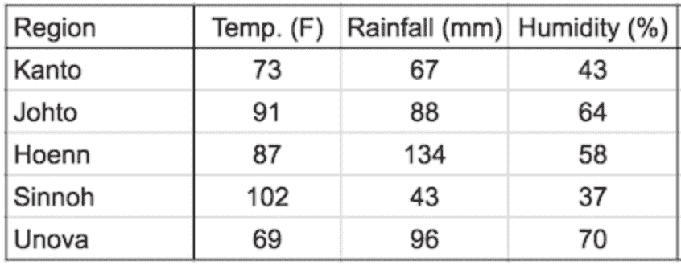

首先，我们可以定义一些变量来记录一个地区的气候数据。

```
kanto_temp = 73
kanto_rainfall = 67
kanto_humidity = 43
```

我们现在可以把这些变量代入线性方程来预测苹果的产量。

```
kanto_yield_apples = kanto_temp * w1 + kanto_rainfall * w2 + kanto_humidity * w3
kanto_yield_apples
# 56.8

print("The expected yield of apples in Kanto region is {} tons per hectare.".format(kanto_yield_apples))
# The expected yield of apples in Kanto region is 56.8 tons per hectare.
```

为了更容易地对多个地区进行上述计算，我们可以将每个地区的气候数据表示为一个向量，即一系列数字。

```
kanto = [73, 67, 43]
johto = [91, 88, 64]
hoenn = [87, 134, 58]
sinnoh = [102, 43, 37]
unova = [69, 96, 70]
```

每个向量中的三个数字分别代表温度、降雨量和湿度数据。

我们也可以将公式中使用的权重集表示为一个向量。

```
weights = [w1, w2, w3]
```

我们现在可以编写一个函数`crop_yield`来计算苹果(或任何其他作物)的产量，给出气候数据和各自的权重。

```
def crop_yield(region, weights):
    result = 0
    for x, w in zip(region, weights):
        result += x * w
    return result

crop_yield(kanto, weights)
# 56.8

crop_yield(johto, weights)
# 76.9

crop_yield(unova, weights)
# 74.9
```

### 如何将 Python 列表转换成 Numpy 数组

由`crop_yield`执行的计算(两个向量的逐元素相乘并对结果求和)也被称为 **点积** 。点击了解更多关于点产品[的信息。](https://www.khanacademy.org/math/linear-algebra/vectors-and-spaces/dot-cross-products/v/vector-dot-product-and-vector-length )

Numpy 库提供了一个内置函数来计算两个向量的点积。然而，我们必须首先将列表转换成 Numpy 数组。

让我们使用`pip`包管理器安装 Numpy 库。

```
!pip install numpy --upgrade --quiet
```

接下来，让我们导入`numpy`模块。用别名`np`导入 numpy 是常见的做法。

```
import numpy as np
```

我们现在可以使用`np.array`函数来创建 Numpy 数组。

```
kanto = np.array([73, 67, 43])

kanto
# array([73, 67, 43])

weights = np.array([w1, w2, w3])

weights
# array([0.3, 0.2, 0.5])
```

Numpy 数组的类型是`ndarray`。

```
type(kanto)
# numpy.ndarray

type(weights)
# numpy.ndarray
```

就像列表一样，Numpy 数组支持索引符号`[]`。

```
weights[0]
# 0.3

kanto[2]
#43
```

### 如何在 Numpy 数组上操作

我们现在可以使用`np.dot`函数计算两个向量的点积。

```
np.dot(kanto, weights)
# 56.8
```

我们可以通过 Numpy 数组支持的低级操作获得相同的结果:执行元素级乘法并计算结果数的和。

```
(kanto * weights).sum()
# 56.8
```

如果两个数组具有相同的大小，那么`*`操作符执行这两个数组的逐元素乘法。`sum`方法计算数组中数字的总和。

```
arr1 = np.array([1, 2, 3])
arr2 = np.array([4, 5, 6])

arr1 * arr2
# array([ 4, 10, 18])

arr2.sum()
# 15
```

### 使用 Numpy 数组有什么好处？

与 Python 列表相比，Numpy 数组在处理数值数据方面具有以下优势:

*   **它们很容易到**使用**** :你可以像`(kanto * weights).sum()`一样编写短小、简洁、直观的数学表达式，而不是像`crop_yield`一样使用循环和自定义函数。
*   ****性能**** : Numpy 操作和函数在 C++内部实现，这使得它们比使用 Python 语句和在运行时解释的循环要快得多

下面是使用 Python 循环和 Numpy 数组在两个各有一百万个元素的向量上执行的点积的比较。

```
# Python lists
arr1 = list(range(1000000))
arr2 = list(range(1000000, 2000000))

# Numpy arrays
arr1_np = np.array(arr1)
arr2_np = np.array(arr2)

%%time
result = 0
for x1, x2 in zip(arr1, arr2):
    result += x1*x2
result

# CPU times: user 300 ms, sys: 3.26 ms, total: 303 ms
# Wall time: 302 ms
# 833332333333500000

%%time
np.dot(arr1_np, arr2_np)

# CPU times: user 2.11 ms, sys: 951 µs, total: 3.07 ms
# Wall time: 1.58 ms
# 833332333333500000
```

如你所见，使用`np.dot`比使用`for`循环快 100 倍。这使得 Numpy 在处理具有数万或数百万个数据点的大型数据集时特别有用。

### 多维数字阵列

我们现在可以更进一步，用一个二维 Numpy 数组来表示所有地区的气候数据。

```
climate_data = np.array([[73, 67, 43],
                         [91, 88, 64],
                         [87, 134, 58],
                         [102, 43, 37],
                         [69, 96, 70]])

climate_data
# array([[ 73,  67,  43],
#        [ 91,  88,  64],
#        [ 87, 134,  58],
#        [102,  43,  37],
#        [ 69,  96,  70]])
```

如果你在高中上过线性代数课，你可能会认出上面的二维数组是一个五行三列的矩阵。每行代表一个地区，每列分别代表温度、降雨量和湿度。

Numpy 数组可以有任意多个维度，并且每个维度的长度不同。我们可以使用数组的`.shape`属性检查每个维度的长度。

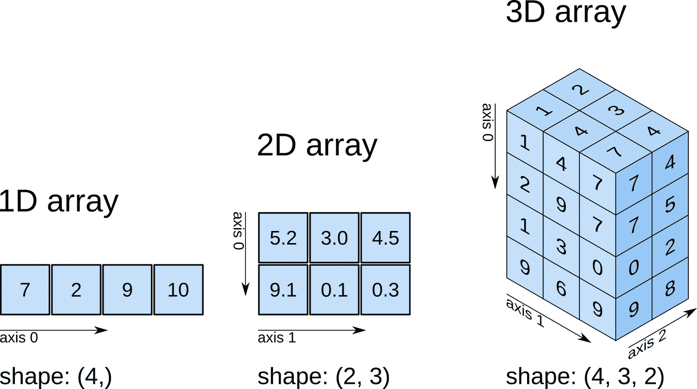

Source: [Elegant Scipy](https://github.com/elegant-scipy/elegant-scipy/blob/master/figures/NumPy_ndarrays_v2.png)

```
# 2D array (matrix)
climate_data.shape
# (5, 3)

weights
# array([0.3, 0.2, 0.5])

# 1D array (vector)
weights.shape
# (3,)

# 3D array 
arr3 = np.array([
    [[11, 12, 13], 
     [13, 14, 15]], 
    [[15, 16, 17], 
     [17, 18, 19.5]]])

arr3.shape
# (2, 2, 3)
```

numpy 数组中的所有元素都具有相同的数据类型。您可以使用`.dtype`属性检查数组的数据类型。

```
weights.dtype
# dtype('float64')

climate_data.dtype
# dtype('int64')
```

如果一个数组只包含一个浮点数，所有其他的元素也会被转换成浮点数。

```
arr3.dtype
# dtype('float64')
```

现在，我们可以计算所有地区的苹果预测产量，只需在`climate_data`(一个 5x3 矩阵)和`weights`(一个长度为 3 的向量)之间进行一次矩阵乘法。这是它的视觉效果:

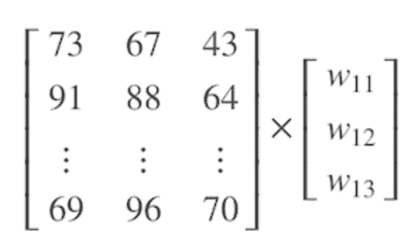

你可以通过观看[这个 YouTube 播放列表](https://www.youtube.com/watch?v=xyAuNHPsq-g&list=PLFD0EB975BA0CC1E0&index=1)的前 3-4 个视频来学习矩阵和矩阵乘法。

我们可以使用`np.matmul`函数或`@`运算符来执行矩阵乘法。

```
np.matmul(climate_data, weights)
# array([56.8, 76.9, 81.9, 57.7, 74.9])

climate_data @ weights
# array([56.8, 76.9, 81.9, 57.7, 74.9])
```

### 如何使用 CSV 数据文件

Numpy 还提供读写文件的帮助函数。让我们下载一个文件`climate.txt`，它包含 10，000 个气候测量值(温度、降雨量和湿度)，格式如下:

```
temperature,rainfall,humidity
25.00,76.00,99.00
39.00,65.00,70.00
59.00,45.00,77.00
84.00,63.00,38.00
66.00,50.00,52.00
41.00,94.00,77.00
91.00,57.00,96.00
49.00,96.00,99.00
67.00,20.00,28.00
... 
```

这种存储数据的格式被称为 **逗号分隔值** 或 CSV。

> ****CSVs**** :逗号分隔值(CSV)文件是使用逗号分隔值的分隔文本文件。文件的每一行都是一条数据记录。每个记录由一个或多个用逗号分隔的字段组成。CSV 文件通常以纯文本形式存储表格数据(数字和文本)，在这种情况下，每行都有相同数量的字段。(维基百科)

要将这个文件读入 numpy 数组，我们可以使用`genfromtxt`函数。

```
import urllib.request

urllib.request.urlretrieve(
    'https://hub.jovian.ml/wp-content/uploads/2020/08/climate.csv', 
    'climate.txt')

climate_data = np.genfromtxt('climate.txt', delimiter=',', skip_header=1)

climate_data
# array([[25., 76., 99.],
#        [39., 65., 70.],
#        [59., 45., 77.],
#        ...,
#        [99., 62., 58.],
#        [70., 71., 91.],
#        [92., 39., 76.]])

climate_data.shape
# (10000, 3)
```

我们现在可以使用`@`操作符执行矩阵乘法，使用一组给定的权重来预测整个数据集的苹果产量。

```
weights = np.array([0.3, 0.2, 0.5])

yields = climate_data @ weights
yields
# array([72.2, 59.7, 65.2, ..., 71.1, 80.7, 73.4])

yields.shape
# (10000,)
```

让我们使用 [`np.concatenate`](https://jovian.ai/outlink?url=https%3A%2F%2Fnumpy.org%2Fdoc%2Fstable%2Freference%2Fgenerated%2Fnumpy.concatenate.html) 函数将`yields`添加到`climate_data`作为第四列。

```
climate_results = np.concatenate((climate_data, yields.reshape(10000, 1)), axis=1)

climate_results
# array([[25\. , 76\. , 99\. , 72.2],
#        [39\. , 65\. , 70\. , 59.7],
#        [59\. , 45\. , 77\. , 65.2],
#        ...,
#        [99\. , 62\. , 58\. , 71.1],
#        [70\. , 71\. , 91\. , 80.7],
#        [92\. , 39\. , 76\. , 73.4]])
```

这里有几个微妙之处:

*   因为我们希望添加新列，所以我们将参数`axis=1`传递给`np.concatenate`。`axis`参数指定连接的维度。
*   除了用于连接的维度之外，数组应该具有相同的维数和相同的长度。我们使用 [`np.reshape`](https://jovian.ai/outlink?url=https%3A%2F%2Fnumpy.org%2Fdoc%2Fstable%2Freference%2Fgenerated%2Fnumpy.reshape.html) 函数将`yields`的形状从`(10000,)`改为`(10000,1)`。

下面是对沿着`axis=1`的`np.concatenate`的直观解释(你能猜到`axis=0`的结果是什么吗？):

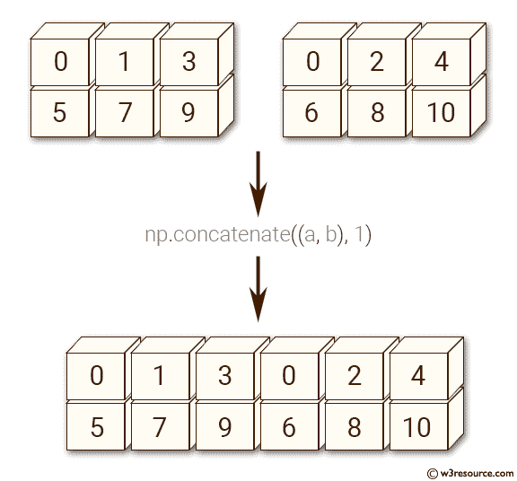

Source: [w3resource.com](https://www.freecodecamp.org/news/exploratory-data-analysis-with-numpy-pandas-matplotlib-seaborn/w3resource.com)

理解 Numpy 函数作用的最好方法是试验它，并阅读文档以了解它的参数和返回值。使用下面的单元格来试验`np.concatenate`和`np.reshape`。

让我们使用`np.savetxt`函数将上述计算的最终结果写回到一个文件中。

```
np.savetxt('climate_results.txt', 
           climate_results, 
           fmt='%.2f', 
           delimiter=',',
           header='temperature,rainfall,humidity,yeild_apples', 
           comments='')
```

结果以 CSV 格式写回到文件`climate_results.txt`。

```
temperature,rainfall,humidity,yeild_apples
25.00,76.00,99.00,72.20
39.00,65.00,70.00,59.70
59.00,45.00,77.00,65.20
84.00,63.00,38.00,56.80
...
```

Numpy 提供了数百个对数组执行操作的函数。以下是一些常用的函数:

*   数学:`np.sum`、`np.exp`、`np.round`，算术运算符
*   数组操作:`np.reshape`、`np.stack`、`np.concatenate`、`np.split`
*   线性代数:`np.matmul`、`np.dot`、`np.transpose`、`np.eigvals`
*   统计:`np.mean`、`np.median`、`np.std`、`np.max`

**那么如何**找到自己需要的功能呢？**** 为特定操作或用例找到合适功能的最简单方法是进行网络搜索。例如，搜索“如何连接 numpy 数组”会导致[这篇数组连接教程](https://jovian.ai/outlink?url=https%3A%2F%2Fcmdlinetips.com%2F2018%2F04%2Fhow-to-concatenate-arrays-in-numpy%2F)。

你可以在这里找到数组函数的完整列表。

### Numpy 算术运算、广播和比较

Numpy 数组支持算术运算符，如`+`、`-`、`*`等。您可以对单个数字(也称为标量)或相同形状的另一个数组执行算术运算。

运算符使得用多维数组编写数学表达式变得很容易。

```
arr2 = np.array([[1, 2, 3, 4], 
                 [5, 6, 7, 8], 
                 [9, 1, 2, 3]])

arr3 = np.array([[11, 12, 13, 14], 
                 [15, 16, 17, 18], 
                 [19, 11, 12, 13]])

# Adding a scalar
arr2 + 3

# array([[ 4,  5,  6,  7],
#        [ 8,  9, 10, 11],
#        [12,  4,  5,  6]])

# Element-wise subtraction
arr3 - arr2

# array([[10, 10, 10, 10],
#        [10, 10, 10, 10],
#        [10, 10, 10, 10]])

# Division by scalar
arr2 / 2

# array([[0.5, 1\. , 1.5, 2\. ],
#        [2.5, 3\. , 3.5, 4\. ],
#        [4.5, 0.5, 1\. , 1.5]])

# Element-wise multiplication
arr2 * arr3

# array([[ 11,  24,  39,  56],
#        [ 75,  96, 119, 144],
#        [171,  11,  24,  39]])

# Modulus with scalar
arr2 % 4

# array([[1, 2, 3, 0],
#        [1, 2, 3, 0],
#        [1, 1, 2, 3]])
```

#### **Numpy 阵列广播**

Numpy 数组还支持 **广播** ，允许维数不同但形状兼容的两个数组之间进行算术运算。让我们看一个例子来看看它是如何工作的。

```
arr2 = np.array([[1, 2, 3, 4], 
                 [5, 6, 7, 8], 
                 [9, 1, 2, 3]])               
arr2.shape
# (3, 4)

arr4 = np.array([4, 5, 6, 7])
arr4.shape
# (4,)

arr2 + arr4
# array([[ 5,  7,  9, 11],
#        [ 9, 11, 13, 15],
#        [13,  6,  8, 10]])
```

当表达式`arr2 + arr4`被求值时，`arr4`(其形状为`(4,)`)被复制三次，以匹配`arr2`的形状`(3, 4)`。Numpy 执行复制，而不实际创建较小维度数组的三个副本，因此提高了性能并使用了较少的内存。

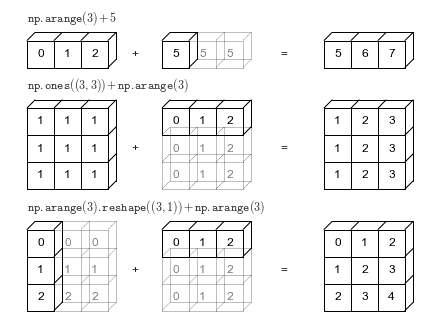

Source: [Python Data Science Handbook](https://jakevdp.github.io/PythonDataScienceHandbook/02.05-computation-on-arrays-broadcasting.html)

只有当其中一个阵列可以被复制以匹配另一个阵列的形状时，广播才起作用。

```
arr5 = np.array([7, 8])
arr5.shape
# (2,)

arr2 + arr5
# ValueError: operands could not be broadcast together with shapes (3,4) (2,) 
```

上例中，即使`arr5`复制三次，也不会与`arr2`的形状相匹配。所以`arr2 + arr5`无法评估成功。[在这里了解更多关于广播的信息](https://numpy.org/doc/stable/user/basics.broadcasting.html)。

#### **Numpy 数组比较**

Numpy 数组还支持比较操作，如`==`、`!=`、`>`等。结果是一个布尔数组。

```
arr1 = np.array([[1, 2, 3], [3, 4, 5]])
arr2 = np.array([[2, 2, 3], [1, 2, 5]])

arr1 == arr2
# array([[False,  True,  True],
#        [False, False,  True]])

arr1 != arr2
# array([[ True, False, False],
#        [ True,  True, False]])

arr1 >= arr2
# array([[False,  True,  True],
#        [ True,  True,  True]])

arr1 < arr2
# array([[ True, False, False],
#        [False, False, False]])
```

数组比较常用于使用`sum`方法计算两个数组中相同元素的数量。请记住，当您在算术运算中使用布尔值时，`True`的值为`1`，而`False`的值为`0`。

```
(arr1 == arr2).sum()
# 3
```

### Numpy 数组索引和切片

Numpy 使用`[]`以直观的方式将 Python 的列表索引符号扩展到多个维度。您可以提供逗号分隔的索引或范围列表，以从 Numpy 数组中选择特定元素或子数组(也称为切片)。

```
arr3 = np.array([
    [[11, 12, 13, 14], 
     [13, 14, 15, 19]], 

    [[15, 16, 17, 21], 
     [63, 92, 36, 18]], 

    [[98, 32, 81, 23],      
     [17, 18, 19.5, 43]]])

arr3.shape
# (3, 2, 4)

# Single element
arr3[1, 1, 2]

# 36.0

# Subarray using ranges
arr3[1:, 0:1, :2]

# array([[[15., 16.]],
# 
#        [[98., 32.]]])

# Mixing indices and ranges
arr3[1:, 1, 3]

# array([18., 43.])

arr3[1:, 1, :3]
# array([[63\. , 92\. , 36\. ],
#        [17\. , 18\. , 19.5]])

# Using fewer indices
arr3[1]

# array([[15., 16., 17., 21.],
#        [63., 92., 36., 18.]])

arr3[:2, 1]
# array([[13., 14., 15., 19.],
#        [63., 92., 36., 18.]])

# Using too many indices
arr3[1,3,2,1]

# IndexError: too many indices for array: array is 3-dimensional, but 4 were indexed
```

这个符号和它的结果一开始看起来可能会令人困惑，所以花点时间去试验，慢慢适应它。

使用下面的单元格尝试一些数组索引和切片的示例，使用不同的索引和范围组合。以下是更多直观演示的示例:

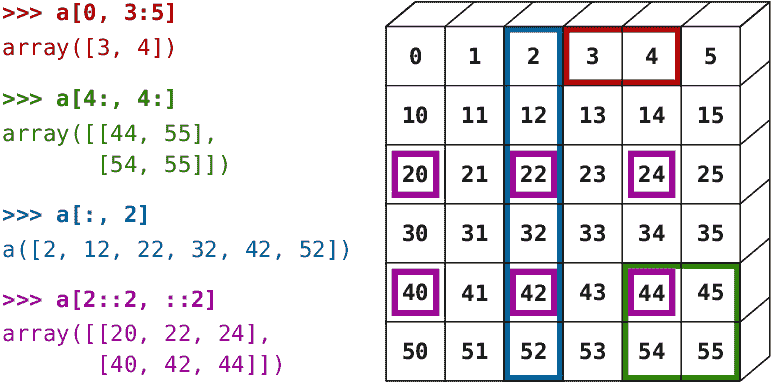

Source: [Scipy Lectures](https://scipy-lectures.org/intro/numpy/array_object.html)

### 如何创建 Numpy 数组–其他方法

Numpy 还提供了一些方便的函数来创建具有固定或随机值的所需形状的数组。查看[官方文档](https://jovian.ai/outlink?url=https%3A%2F%2Fnumpy.org%2Fdoc%2Fstable%2Freference%2Froutines.array-creation.html)或使用`help`功能了解更多信息。

```
# All zeros
np.zeros((3, 2))

# array([[0., 0.],
#        [0., 0.],
#        [0., 0.]])

# All ones
np.ones([2, 2, 3])

# array([[[1., 1., 1.],
#         [1., 1., 1.]],
#
#        [[1., 1., 1.],
#         [1., 1., 1.]]])

# Identity matrix
np.eye(3)

# array([[1., 0., 0.],
#        [0., 1., 0.],
#        [0., 0., 1.]])

# Random vector
np.random.rand(5)

# array([0.92929562, 0.11301864, 0.64213555, 0.8600434 , 0.53738656])

# Random matrix
np.random.randn(2, 3) # rand vs. randn - what's the difference?

# array([[ 0.09906435, -1.64668094,  0.08073528],
#        [ 0.1437016 ,  0.80715712,  1.27285476]])

# Fixed value
np.full([2, 3], 42)

# array([[42, 42, 42],
#        [42, 42, 42]])

# Range with start, end and step
np.arange(10, 90, 3)

# array([10, 13, 16, 19, 22, 25, 28, 31, 34, 37, 40, 43, 46, 49, 52, 55, 58,
#        61, 64, 67, 70, 73, 76, 79, 82, 85, 88])

# Equally spaced numbers in a range
np.linspace(3, 27, 9)

# array([ 3.,  6.,  9., 12., 15., 18., 21., 24., 27.])
```

### 练习

尝试以下练习来熟悉 Numpy 数组并练习您的技能:

*   Numpy 数组函数赋值:[https://jovian.ml/aakashns/numpy-array-operations](https://jovian.ai/outlink?url=https%3A%2F%2Fjovian.ml%2Faakashns%2Fnumpy-array-operations)
*   (可选)100 个数字练习:[https://jovian.ml/aakashns/100-numpy-exercises](https://jovian.ai/outlink?url=https%3A%2F%2Fjovian.ml%2Faakashns%2F100-numpy-exercises)

### 总结和进一步阅读

至此，我们完成了对 Numpy 数值计算的讨论。我们已经在本部分教程中讨论了以下主题:

*   如何从 Python 列表到 Numpy 数组
*   如何在 Numpy 数组上操作
*   使用 Numpy 数组优于列表的好处
*   多维数字阵列
*   如何使用 CSV 数据文件
*   算术运算和广播
*   数组索引和切片
*   创建 Numpy 数组的其他方法

查看以下资源，了解更多关于 Numpy 的信息:

*   [官方教程](https://numpy.org/devdocs/user/quickstart.html)
*   免费代码营的 Numpy 课程
*   [高级 Numpy(探索内部)](http://scipy-lectures.org/advanced/advanced_numpy/index.html)

### 复习问题，检查你的理解能力

尝试回答以下问题，以测试您对本笔记本所涵盖主题的理解程度:

1.  什么是向量？
2.  如何用 Python 列表表示向量？举个例子。
3.  两个向量的点积是什么？
4.  写一个函数来计算两个向量的点积。
5.  什么是 Numpy？
6.  怎么安装 Numpy？
7.  如何导入`numpy`模块？
8.  用别名导入模块是什么意思？举个例子。
9.  `numpy`的常用别名是什么？
10.  什么是 Numpy 数组？
11.  如何创建 Numpy 数组？举个例子。
12.  Numpy 数组的类型是什么？
13.  如何访问 Numpy 数组的元素？
14.  如何使用 Numpy 计算两个向量的点积？
15.  如果你试图计算两个不同大小的向量的点积，会发生什么？
16.  如何计算两个 Numpy 数组的元素乘积？
17.  如何计算 Numpy 数组中所有元素的总和？
18.  使用 Numpy 数组而不是 Python 列表来操作数值数据有什么好处？
19.  为什么 Numpy 数组操作比 Python 函数和循环有更好的性能？
20.  用一个例子说明 Numpy 数组操作和 Python 循环之间的性能差异。
21.  什么是多维 Numpy 数组？
22.  演示如何创建 2 维、3 维和 4 维的 Numpy 数组。
23.  如何检查 Numpy 数组中的维数和每个维数的长度？
24.  Numpy 数组的元素可以有不同的数据类型吗？
25.  如何检查 Numpy 数组元素的数据类型？
26.  Numpy 数组的数据类型是什么？
27.  矩阵和 2D 数列的区别是什么？
28.  如何使用 Numpy 执行矩阵乘法？
29.  Numpy 中的`@`运算符是用来做什么的？
30.  CSV 文件格式是什么？
31.  如何使用 Numpy 从 CSV 文件中读取数据？
32.  如何连接两个 Numpy 数组？
33.  `np.concatenate`的`axis`自变量的目的是什么？
34.  什么时候两个 Numpy 数组可以兼容连接？
35.  给出两个可以连接的 Numpy 数组的例子。
36.  举一个两个 Numpy 数组不能串联的例子。
37.  `np.reshape`函数的用途是什么？
38.  “重塑”一个 Numpy 数组意味着什么？
39.  如何将 numpy 数组写入 CSV 文件？
40.  给出一些执行数学运算的 Numpy 函数的例子。
41.  给出一些执行数组操作的 Numpy 函数的例子。
42.  给出一些执行线性代数的 Numpy 函数的例子。
43.  给出一些执行统计操作的 Numpy 函数的例子。
44.  如何为特定的操作或用例找到正确的 Numpy 函数？
45.  在哪里可以看到所有 Numpy 数组函数和操作的列表？
46.  Numpy 数组支持哪些算术运算符？举例说明。
47.  什么是阵列广播？怎么有用？举例说明。
48.  举几个兼容广播的数组例子。
49.  举一些不兼容广播的数组的例子。
50.  Numpy 数组支持哪些比较运算符？举例说明。
51.  如何从 Numpy 数组中访问特定的子数组或片？
52.  举例说明多维 Numpy 数组中的数组索引和切片。
53.  如何用一个给定的包含所有零的形状创建一个 Numpy 数组？
54.  如何用一个给定的形状创建一个包含所有 1 的 Numpy 数组？
55.  如何创建给定形状的单位矩阵？
56.  如何创建一个给定长度的随机向量？
57.  如何创建一个给定形状的 Numpy 数组，每个元素有一个固定值？
58.  如何使用包含随机初始化元素的给定形状创建 Numpy 数组？
59.  `np.random.rand`和`np.random.randn`有什么区别？举例说明。
60.  `np.arange`和`np.linspace`有什么区别？举例说明。

您已经准备好进入本教程的下一部分。

## 如何使用 Python 和 Pandas 分析表格数据

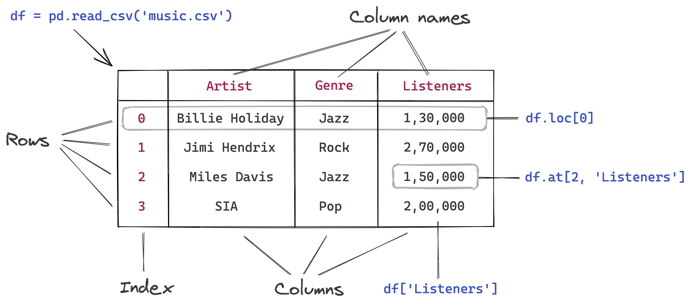

跟随并运行这里的代码:[https://jovian.ai/aakashns/python-pandas-data-analysis](https://jovian.ai/aakashns/python-pandas-data-analysis)。

本节涵盖以下主题:

*   如何将 CSV 文件读入熊猫数据框
*   如何从熊猫数据框中检索数据
*   如何查询、排序和分析数据
*   如何合并、分组和聚合数据
*   如何从日期中提取有用的信息
*   使用折线图和条形图进行基本绘图
*   如何将数据帧写入 CSV 文件

### 如何使用熊猫阅读 CSV 文件

Pandas 是一个流行的 Python 库，用于处理表格数据(类似于存储在电子表格中的数据)。它提供了帮助器函数来读取各种文件格式的数据，如 CSV、Excel 电子表格、HTML 表格、JSON、SQL 等等。

让我们下载一个文件`italy-covid-daywise.txt`，它包含意大利每天的新冠肺炎数据，格式如下:

```
date,new_cases,new_deaths,new_tests
2020-04-21,2256.0,454.0,28095.0
2020-04-22,2729.0,534.0,44248.0
2020-04-23,3370.0,437.0,37083.0
2020-04-24,2646.0,464.0,95273.0
2020-04-25,3021.0,420.0,38676.0
2020-04-26,2357.0,415.0,24113.0
2020-04-27,2324.0,260.0,26678.0
2020-04-28,1739.0,333.0,37554.0
... 
```

这种存储数据的格式被称为 **逗号分隔值** 或 CSV。如果您需要 CSV 格式的定义，这里有一个提示:

> ****CSVs**** :逗号分隔值(CSV)文件是使用逗号分隔值的分隔文本文件。文件的每一行都是一条数据记录。每个记录由一个或多个字段组成，用逗号分隔。CSV 文件通常以纯文本形式存储表格数据(数字和文本)，在这种情况下，每行都有相同数量的字段。(维基百科)

我们将使用`urllib.request`模块中的`urlretrieve`函数下载这个文件。

```
from urllib.request import urlretrieve

urlretrieve('https://hub.jovian.ml/wp-content/uploads/2020/09/italy-covid-daywise.csv', 'italy-covid-daywise.csv')
```

要读取文件，我们可以使用 Pandas 的`read_csv`方法。首先，让我们安装熊猫图书馆。

```
!pip install pandas --upgrade --quiet
```

我们现在可以导入`pandas`模块。按照惯例，它以别名`pd`导入。

```
import pandas as pd

covid_df = pd.read_csv('italy-covid-daywise.csv')
```

文件中的数据被读取并存储在一个`DataFrame`对象中 Pandas 中用于存储和处理表格数据的核心数据结构之一。我们通常在数据帧的变量名中使用`_df`后缀。

```
type(covid_df)
# pandas.core.frame.DataFrame

covid_df
```

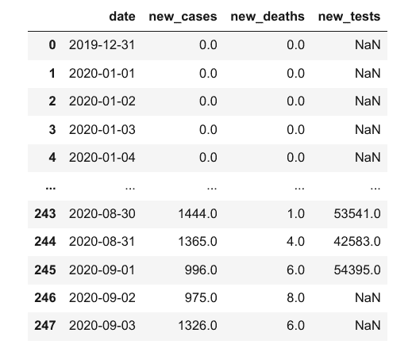

通过查看数据帧，我们可以得出以下结论:

*   该文件提供了意大利新冠肺炎的四天计数
*   报告的指标是新病例、死亡和测试
*   提供 248 天的数据:从 2019 年 12 月 12 日到 2020 年 9 月 3 日

请记住，这些是官方报告的数字。实际病例和死亡人数可能更高，因为并非所有病例都得到诊断。

我们可以使用`.info`方法查看数据帧的一些基本信息。

```
covid_df.info()
```

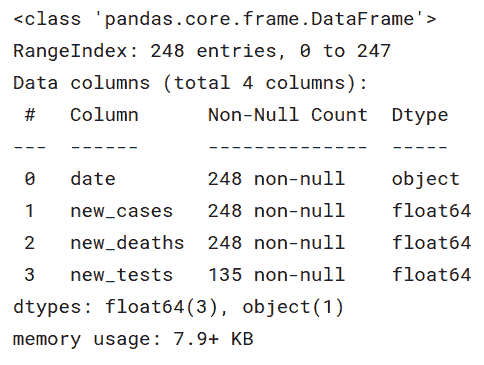

似乎每一列都包含特定数据类型的值。您可以使用`.describe`方法查看数字列的统计信息(平均值、标准偏差、最小/最大值以及非空值的数量)。

```
covid_df.describe()
```

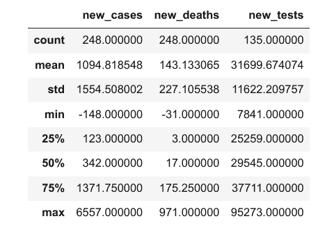

`columns`属性包含数据框中的列列表。

```
covid_df.columns
# Index(['date', 'new_cases', 'new_deaths', 'new_tests'], dtype='object')
```

您还可以使用`.shape`方法检索数据框中的行数和列数。

```
covid_df.shape
# (248, 4)
```

下面是我们到目前为止所看到的函数和方法的总结:

*   `pd.read_csv`–将 CSV 文件中的数据读入熊猫`DataFrame`对象
*   `.info()`–查看行、列和数据类型的基本信息
*   `.describe()`–查看数字列的统计信息
*   `.columns`–获取列名列表
*   `.shape`–以元组的形式获取行数和列数

### 如何在 Pandas 中从数据框中检索数据

您可能要做的第一件事是从该数据框中检索数据，比如特定日期的计数或特定列中的值列表。

为此，您应该了解数据框中数据的内部表示。从概念上讲，您可以将 dataframe 视为列表的字典:键是列名，值是包含相应列的数据的列表/数组。

```
# Pandas format is simliar to this
covid_data_dict = {
    'date':       ['2020-08-30', '2020-08-31', '2020-09-01', '2020-09-02', '2020-09-03'],
    'new_cases':  [1444, 1365, 996, 975, 1326],
    'new_deaths': [1, 4, 6, 8, 6],
    'new_tests': [53541, 42583, 54395, None, None]
}
```

用上述格式表示数据有几个好处:

*   一列中的所有值通常具有相同类型的值，因此将它们存储在单个数组中会更有效。
*   检索特定行的值只需要从每个列数组中提取给定索引处的元素。
*   与为每一行数据使用一个字典的其他格式相比，这种表示更加紧凑(列名只记录一次)(参见下面的例子)。

```
# Pandas format is not similar to this
covid_data_list = [
    {'date': '2020-08-30', 'new_cases': 1444, 'new_deaths': 1, 'new_tests': 53541},
    {'date': '2020-08-31', 'new_cases': 1365, 'new_deaths': 4, 'new_tests': 42583},
    {'date': '2020-09-01', 'new_cases': 996, 'new_deaths': 6, 'new_tests': 54395},
    {'date': '2020-09-02', 'new_cases': 975, 'new_deaths': 8 },
    {'date': '2020-09-03', 'new_cases': 1326, 'new_deaths': 6},
]
```

记住列表字典的类比，您现在可以猜测如何从数据框中检索数据。例如，我们可以使用`[]`索引符号从特定的列中获得一个值列表。

```
covid_data_dict['new_cases']
# [1444, 1365, 996, 975, 1326]

covid_df['new_cases']
# 0         0.0
# 1         0.0
# 2         0.0
# 3         0.0
# 4         0.0
#         ...  
# 243    1444.0
# 244    1365.0
# 245     996.0
# 246     975.0
# 247    1326.0
# Name: new_cases, Length: 248, dtype: float64
```

每一列都使用一个名为`Series`的数据结构来表示，这实际上是一个带有一些额外方法和属性的 numpy 数组。

```
type(covid_df['new_cases'])
# pandas.core.series.Series
```

像数组一样，您可以使用索引符号`[]`通过序列检索特定的值。

```
covid_df['new_cases'][246]
# 975.0

covid_df['new_tests'][240]
57640.0
```

Pandas 还提供了`.at`方法来直接检索特定行&列的元素。

```
covid_df.at[246, 'new_cases']
# 975.0

covid_df.at[240, 'new_tests']
# 57640.0
```

除了使用索引符号`[]`，Pandas 还允许使用`.`符号将列作为 dataframe 的属性进行访问。但是，此方法仅适用于名称不包含空格或特殊字符的列。

```
covid_df.new_cases
# 0         0.0
# 1         0.0
# 2         0.0
# 3         0.0
# 4         0.0
#         ...  
# 243    1444.0
# 244    1365.0
# 245     996.0
# 246     975.0
# 247    1326.0
# Name: new_cases, Length: 248, dtype: float64
```

此外，您还可以传递索引符号`[]`中的列列表，以访问只包含给定列的数据框的子集。

```
cases_df = covid_df[['date', 'new_cases']]
cases_df
```

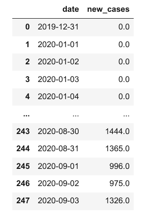

新数据帧`cases_df`只是原始数据帧`covid_df`的“视图”。两者都指向计算机内存中的相同数据。更改其中一个中的任何值也会更改另一个中相应的值。

在数据框之间共享数据使得熊猫的数据操作速度极快。每次想要通过对现有数据框进行操作来创建新的数据框时，您不必担心复制数千或数百万行的开销。

有时您可能需要数据帧的完整副本，在这种情况下，您可以使用`copy`方法。

```
covid_df_copy = covid_df.copy()
```

`covid_df_copy`内的数据与`covid_df`完全分离，改变其中一个内部的值不会影响另一个。

为了访问特定的数据行，Pandas 提供了`.loc`方法。

```
covid_df
```

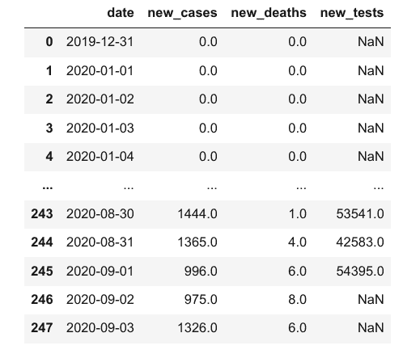

```
covid_df.loc[243]
# date          2020-08-30
# new_cases         1444.0
# new_deaths           1.0
# new_tests        53541.0
# Name: 243, dtype: object
```

每个检索到的行也是一个`Series`对象。

```
type(covid_df.loc[243])
# pandas.core.series.Series
```

我们可以使用`.head`和`.tail`方法来查看第一行或最后几行数据。

```
covid_df.head(5)
```

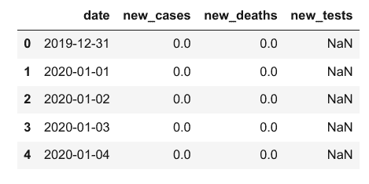

```
covid_df.tail(4)
```

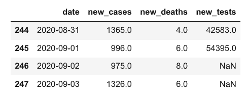

请注意，虽然`new_cases`和`new_deaths`列中的前几个值是`0`，但是`new_tests`列中对应的值是`NaN`。这是因为 CSV 文件不包含特定日期的`new_tests`列的任何数据(您可以通过查看文件来验证这一点)。这些值可能缺失或未知。

```
covid_df.at[0, 'new_tests']
# nan

type(covid_df.at[0, 'new_tests'])
# numpy.float64
```

`0`和`NaN`之间的区别是微妙但重要的。在该数据集中，它表示没有在特定日期报告每日测试数。意大利于 2020 年 4 月 19 日开始报告每日检测。在 4 月 19 日之前，他们已经进行了 935，310 次测试。

我们可以使用列的`first_valid_index`方法找到第一个不包含`NaN`值的索引。

```
covid_df.new_tests.first_valid_index()
# 111
```

让我们看看这个索引前后的几行，以验证这些值从`NaN`变成了实际数字。我们可以通过向`loc`传递一个范围来做到这一点。

```
covid_df.loc[108:113]
```

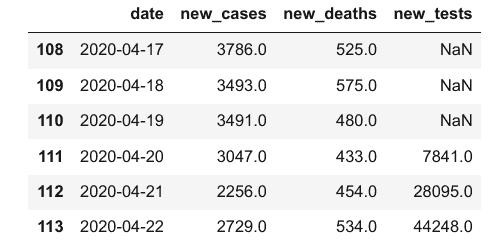

我们可以使用`.sample`方法从数据帧中检索随机的行样本。

```
covid_df.sample(10)
```

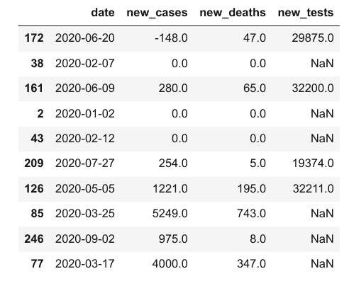

请注意，尽管我们采取了随机抽样，但每行的原始索引都被保留了下来。这是数据框的一个有用属性。

下面是我们在这一节中研究的函数和方法的总结:

*   `covid_df['new_cases']`–使用列名作为`Series`检索列
*   `new_cases[243]`–使用索引从`Series`中检索值
*   `covid_df.at[243, 'new_cases']`–从数据帧中检索单个值
*   `covid_df.copy()`–创建数据帧的深层副本
*   `covid_df.loc[243]` -从数据帧中检索一行或多行数据
*   `head`、`tail`和`sample`–从数据帧中检索多行数据
*   `covid_df.new_tests.first_valid_index`–查找序列中的第一个非空索引

### 如何分析熊猫数据框中的数据

让我们试着回答一些关于我们数据的问题。

问:意大利与新冠肺炎相关的报告病例和死亡总数是多少？

类似于 Numpy 数组，Pandas 系列支持`sum`方法来回答这些问题。

```
total_cases = covid_df.new_cases.sum()
total_deaths = covid_df.new_deaths.sum()

print('The number of reported cases is {} and the number of reported deaths is {}.'.format(int(total_cases), int(total_deaths)))
# The number of reported cases is 271515 and the number of reported deaths is 35497.
```

****问:总体死亡率(报告死亡数与报告病例数之比)是多少？****

```
death_rate = covid_df.new_deaths.sum() / covid_df.new_cases.sum()

print("The overall reported death rate in Italy is {:.2f} %.".format(death_rate*100))
# The overall reported death rate in Italy is 13.07 %.
```

****问:总共进行了多少次测试？在报告每日测试数字之前，总共进行了 935 次**、 **310 次测试。****

```
initial_tests = 935310
total_tests = initial_tests + covid_df.new_tests.sum()

total_tests
# 5214766.0
```

问:有多少测试返回了阳性结果？

```
positive_rate = total_cases / total_tests

print('{:.2f}% of tests in Italy led to a positive diagnosis.'.format(positive_rate*100))
# 5.21% of tests in Italy led to a positive diagnosis.
```

试着问和回答一些关于数据的问题。

### 如何在 Pandas 中查询和排序行

假设我们只想查看报告病例数超过 1，000 的日子。我们可以使用布尔表达式来检查哪些行满足这个标准。

```
high_new_cases = covid_df.new_cases > 1000

high_new_cases
# 0      False
# 1      False
# 2      False
# 3      False
# 4      False
#        ...  
# 243     True
# 244     True
# 245    False
# 246    False
# 247     True
# Name: new_cases, Length: 248, dtype: bool
```

布尔表达式返回包含`True`和`False`布尔值的序列。您可以使用该序列从原始数据帧中选择行的子集，对应于序列中的`True`值。

```
covid_df[high_new_cases]
```

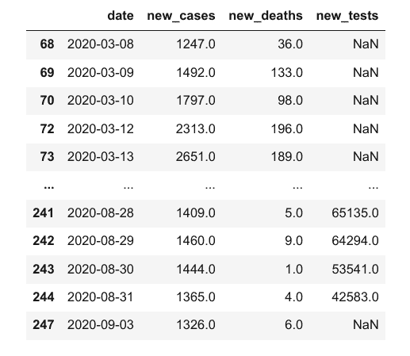

数据框包含 72 行，但为了简洁起见，默认情况下 Jupyter 只显示前五行和后五行。我们可以更改一些显示选项来查看所有行。

```
high_cases_df = covid_df[covid_df.new_cases > 1000]

high_cases_df
```

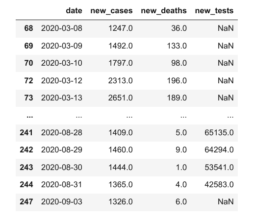

数据框包含 72 行，但为了简洁起见，默认情况下 Jupyter 只显示前 5 行和后 5 行。我们可以更改一些显示选项来查看所有行。

```
from IPython.display import display
with pd.option_context('display.max_rows', 100):
    display(covid_df[covid_df.new_cases > 1000])
```

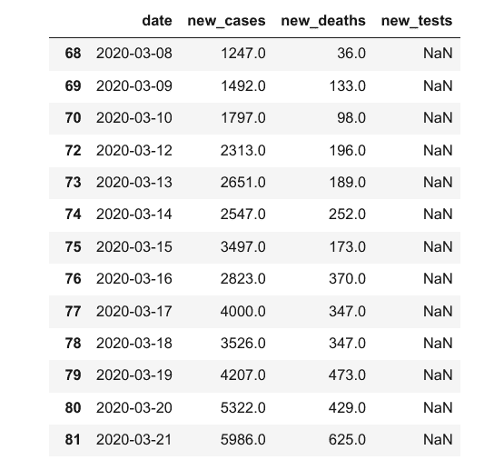

This is just part of the data frame. Check out the rest [here](https://jovian.ai/embed?url=https://jovian.ai/aakashns/python-pandas-data-analysis).

我们还可以制定涉及多个列的更复杂的查询。例如，让我们尝试确定报告的案例与进行的测试的比率高于总体比率的日期`positive_rate`。

```
positive_rate
# 0.05206657403227681

high_ratio_df = covid_df[covid_df.new_cases / covid_df.new_tests > positive_rate]

high_ratio_df
```

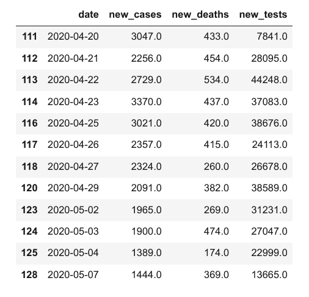

对两列执行运算的结果是一个新的系列。

```
covid_df.new_cases / covid_df.new_tests
# 0           NaN
# 1           NaN
# 2           NaN
# 3           NaN
# 4           NaN
#          ...   
# 243    0.026970
# 244    0.032055
# 245    0.018311
# 246         NaN
# 247         NaN
# Length: 248, dtype: float64
```

我们可以使用这个系列在数据框中添加一个新列。

```
covid_df['positive_rate'] = covid_df.new_cases / covid_df.new_tests

covid_df
```

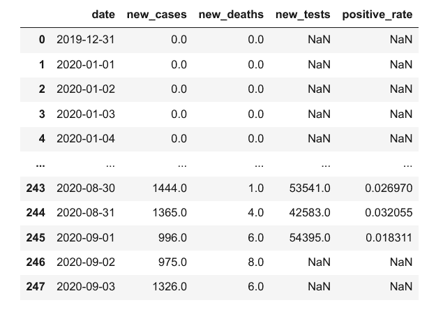

然而，请记住，有时需要几天时间才能得到检测结果，因此我们无法将新增病例数与同一天进行的检测数进行比较。基于此`positive_rate`列的任何推断都可能是不正确的。

必须注意这种微妙的关系，它们通常不会在 CSV 文件中传达，并且需要一些外部上下文。通读数据集提供的文档或询问更多信息总是一个好主意。

现在，让我们使用`drop`方法删除`positive_rate`列。

```
covid_df.drop(columns=['positive_rate'], inplace=True)
```

你能理解这个论点的目的吗？

#### **如何在 Pandas 中使用列值对行进行排序**

您还可以使用`.sort_values`按特定列对行进行排序。让我们进行排序，找出案例数量最多的日子，然后用`head`方法将其链接起来，只列出前十个结果。

```
covid_df.sort_values('new_cases', ascending=False).head(10)
```

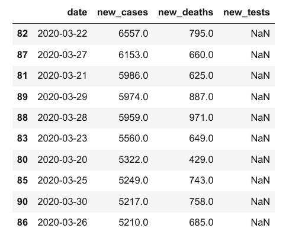

看起来三月的最后两周每天的病例数最高。让我们把这与死亡人数最高的日子进行比较。

```
covid_df.sort_values('new_deaths', ascending=False).head(10)
```

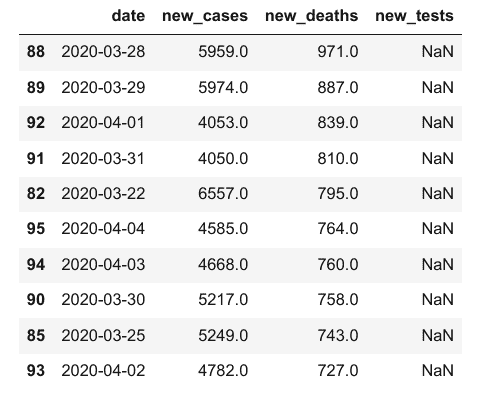

似乎每日死亡人数在每日新增病例高峰后一周左右达到高峰。

我们再来看看案件数量最少的日子。我们可能会在这个列表中看到今年的头几天。

```
covid_df.sort_values('new_cases').head(10)
```

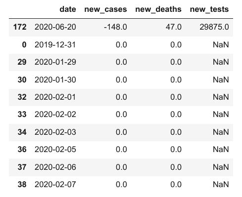

似乎 2020 年 6 月 20 日的新增病例数是一个负数！这可能不是我们所期望的，但这是真实世界数据的本质。这可能是一个数据输入错误，或者政府可能已经发布了更正，以说明过去的错误计算。

你能从网上的新闻文章中找出为什么这个数字是负数吗？

让我们看看 2020 年 6 月 20 日前后的一些日子。

```
covid_df.loc[169:175]
```

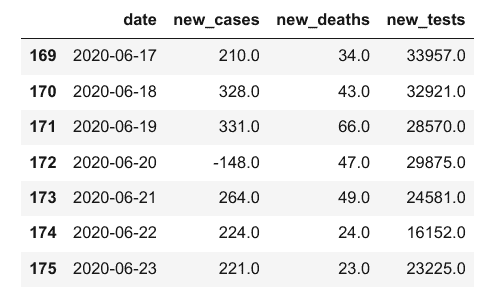

现在，让我们假设这确实是一个数据输入错误。我们可以使用以下方法之一来处理缺失值或错误值:

1.  替换为`0`。
2.  用整个列的平均值替换它
3.  用前一天和下一天的平均值替换它
4.  完全放弃该行

您选择哪种方法需要一些关于数据和问题的上下文。在这种情况下，由于我们处理的是按日期排序的数据，我们可以采用第三种方法。

您可以使用`.at`方法修改数据帧中的特定值。

```
covid_df.at[172, 'new_cases'] = (covid_df.at[171, 'new_cases'] + covid_df.at[173, 'new_cases'])/2
```

下面是我们在这一节中研究的函数和方法的总结:

*   `covid_df.new_cases.sum()`–计算列或系列中值的总和
*   `covid_df[covid_df.new_cases > 1000]`–使用布尔表达式查询满足所选标准的行子集
*   `df['pos_rate'] = df.new_cases/df.new_tests`–通过合并现有列中的数据来添加新列
*   `covid_df.drop('positive_rate')`–从数据框中删除一列或多列
*   `sort_values`–使用列值对数据框的行进行排序
*   `covid_df.at[172, 'new_cases'] = ...`–替换数据框内的值

### 如何在熊猫中处理日期

虽然我们已经查看了病例、测试、阳性率等的总体数字，但逐月研究这些数字也是有用的。

这里的`date`列可能会派上用场，因为 Pandas 提供了许多处理日期的实用程序。

```
covid_df.date
# 0      2019-12-31
# 1      2020-01-01
# 2      2020-01-02
# 3      2020-01-03
# 4      2020-01-04
#           ...    
# 243    2020-08-30
# 244    2020-08-31
# 245    2020-09-01
# 246    2020-09-02
# 247    2020-09-03
# Name: date, Length: 248, dtype: object
```

date 的数据类型目前是`object`，所以 Pandas 不知道这个列是一个日期。我们可以使用`pd.to_datetime`方法将它转换成一个`datetime`列。

```
covid_df['date'] = pd.to_datetime(covid_df.date)

covid_df['date']
# 0     2019-12-31
# 1     2020-01-01
# 2     2020-01-02
# 3     2020-01-03
# 4     2020-01-04
#          ...    
# 243   2020-08-30
# 244   2020-08-31
# 245   2020-09-01
# 246   2020-09-02
# 247   2020-09-03
# Name: date, Length: 248, dtype: datetime64[ns]
```

您可以看到它现在的数据类型是`datetime64`。我们现在可以使用`DatetimeIndex`类([视图文档](https://jovian.ai/outlink?url=https%3A%2F%2Fpandas.pydata.org%2Fpandas-docs%2Fversion%2F0.23.4%2Fgenerated%2Fpandas.DatetimeIndex.html))将数据的不同部分提取到单独的列中。

```
covid_df['year'] = pd.DatetimeIndex(covid_df.date).year
covid_df['month'] = pd.DatetimeIndex(covid_df.date).month
covid_df['day'] = pd.DatetimeIndex(covid_df.date).day
covid_df['weekday'] = pd.DatetimeIndex(covid_df.date).weekday

covid_df
```

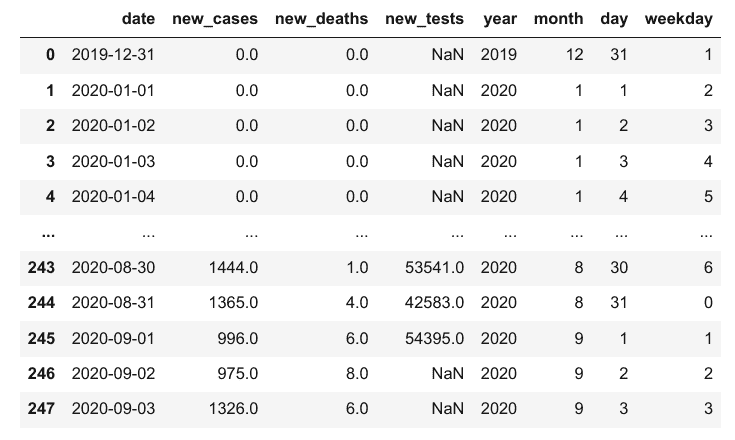

让我们检查一下五月份的总体指标。我们可以查询 May 的行，选择一个列的子集，并使用`sum`方法聚合每个所选列的值。

```
# Query the rows for May
covid_df_may = covid_df[covid_df.month == 5]

# Extract the subset of columns to be aggregated
covid_df_may_metrics = covid_df_may[['new_cases', 'new_deaths', 'new_tests']]

# Get the column-wise sum
covid_may_totals = covid_df_may_metrics.sum()

covid_may_totals
# new_cases       29073.0
# new_deaths       5658.0
# new_tests     1078720.0
# dtype: float64

type(covid_may_totals)
# pandas.core.series.Series
```

我们也可以将上述操作合并成一条语句。

```
covid_df[covid_df.month == 5][['new_cases', 'new_deaths', 'new_tests']].sum()
# new_cases       29073.0
# new_deaths       5658.0
# new_tests     1078720.0
# dtype: float64
```

再举一个例子，我们来看看周日的报案数是否高于每天的平均报案数。这一次，我们可能想要使用`.mean`方法聚合列。

```
# Overall average
covid_df.new_cases.mean()

# 1096.6149193548388

# Average for Sundays
covid_df[covid_df.weekday == 6].new_cases.mean()

# 1247.2571428571428
```

与其他日子相比，周日报告的病例似乎更多。

试着问和回答一些与数据相关的问题。

### 如何在 Pandas 中分组和聚合数据

下一步，我们可能希望汇总一天的数据，并用一个月的数据创建一个新的数据框架。我们可以使用`groupby`函数为每个月创建一个组，选择我们希望聚合的列，并使用`sum`方法聚合它们。

```
covid_month_df = covid_df.groupby('month')[['new_cases', 'new_deaths', 'new_tests']].sum()

covid_month_df
```

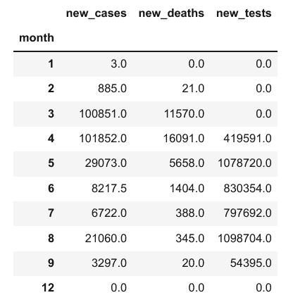

结果是一个新的数据框，它使用传递给`groupby`的列中的唯一值作为索引。分组和聚合是一种将数据逐步汇总成更小的数据框架的强大方法。

除了通过总和进行聚合，您还可以通过其他方法(如平均值)进行聚合。让我们计算一下每个月每天新增病例、死亡和检测的平均数量。

```
covid_month_mean_df = covid_df.groupby('month')[['new_cases', 'new_deaths', 'new_tests']].mean()

covid_month_mean_df
```

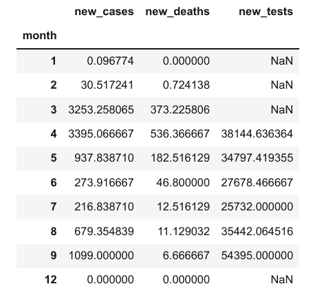

除了分组之外，另一种聚合形式是到每一行的日期为止病例、检验或死亡的运行或累积总和。我们可以使用`cumsum`方法计算一个列的累计和作为一个新的序列。

让我们添加三个新列:`total_cases`、`total_deaths`和`total_tests`。

```
covid_df['total_cases'] = covid_df.new_cases.cumsum()
covid_df['total_deaths'] = covid_df.new_deaths.cumsum()
covid_df['total_tests'] = covid_df.new_tests.cumsum() + initial_tests
```

我们还在`total_test`中包含了初始测试计数，以说明在开始每日报告之前进行的测试。

```
covid_df
```

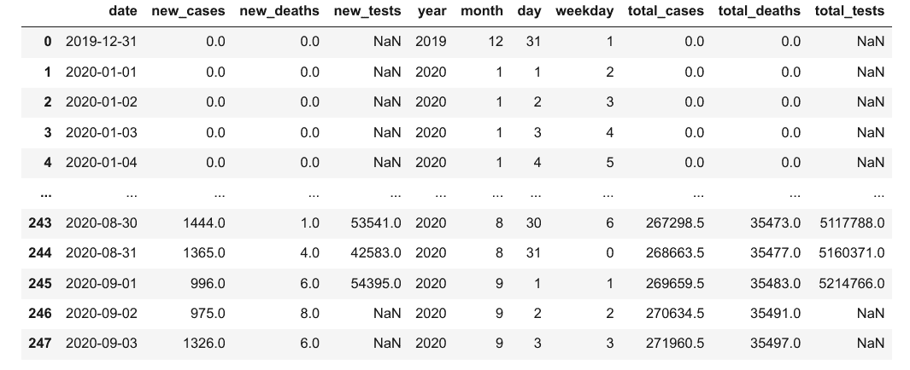

注意`total_tests`列中的`NaN`值如何保持不受影响。

### 如何在 Pandas 中合并来自多个来源的数据

要确定其他指标，如每百万测试数、每百万病例数等等，我们需要更多关于这个国家的信息，即人口。

让我们下载另一个文件`locations.csv`，它包含许多国家的健康相关信息，包括意大利。

```
urlretrieve('https://gist.githubusercontent.com/aakashns/8684589ef4f266116cdce023377fc9c8/raw/99ce3826b2a9d1e6d0bde7e9e559fc8b6e9ac88b/locations.csv', 'locations.csv')

locations_df = pd.read_csv('locations.csv')
locations_df
```

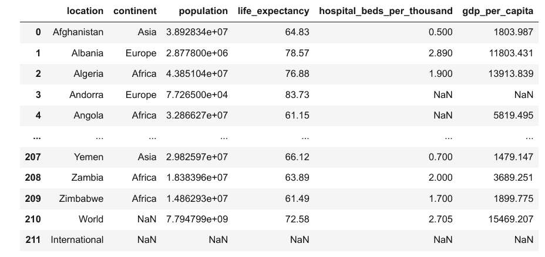

```
locations_df[locations_df.location == "Italy"]
```

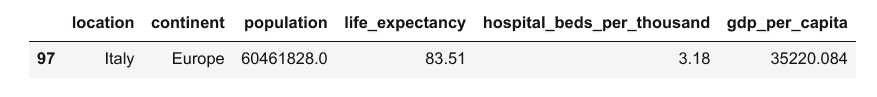

我们可以通过添加更多列将这些数据合并到现有的数据框中。然而，要合并两个数据框，我们至少需要一个公共列。让我们在`covid_df`数据帧中插入一个`location`列，所有值都设置为`"Italy"`。

```
covid_df['location'] = "Italy"

covid_df
```

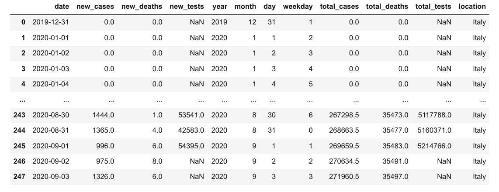

我们现在可以使用`.merge`方法将`locations_df`中的列添加到`covid_df`中。

```
merged_df = covid_df.merge(locations_df, on="location")

merged_df
```

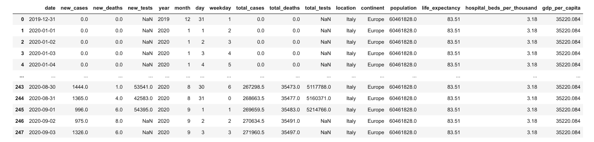

Check out the full data frame [here](https://jovian.ai/embed?url=https://jovian.ai/aakashns/python-pandas-data-analysis).

意大利的位置数据被附加到`covid_df`内的每一行。如果`covid_df`数据框包含多个位置的数据，那么各个国家的位置数据将被附加到每一行。

我们现在可以计算每百万病例数、每百万死亡数和每百万测试数等指标。

```
merged_df['cases_per_million'] = merged_df.total_cases * 1e6 / merged_df.population
merged_df['deaths_per_million'] = merged_df.total_deaths * 1e6 / merged_df.population
merged_df['tests_per_million'] = merged_df.total_tests * 1e6 / merged_df.population

merged_df
```

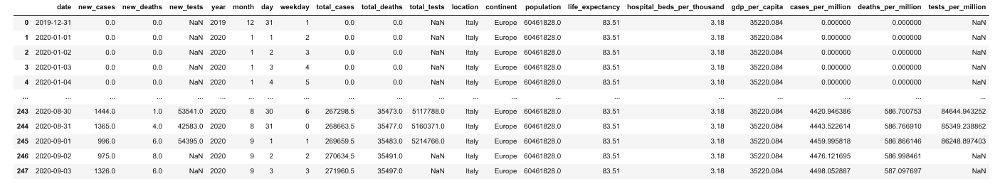

Check out the full data frame [here](https://jovian.ai/embed?url=https://jovian.ai/aakashns/python-pandas-data-analysis).

### 如何在 Pandas 中将数据写回文件

完成分析并添加新列后，您应该将结果写回到文件中。否则，Jupyter 笔记本关机时，数据将会丢失。

在写入文件之前，让我们首先创建一个数据框，只包含我们希望记录的列。

```
result_df = merged_df[['date',
                       'new_cases', 
                       'total_cases', 
                       'new_deaths', 
                       'total_deaths', 
                       'new_tests', 
                       'total_tests', 
                       'cases_per_million', 
                       'deaths_per_million', 
                       'tests_per_million']]

result_df
```

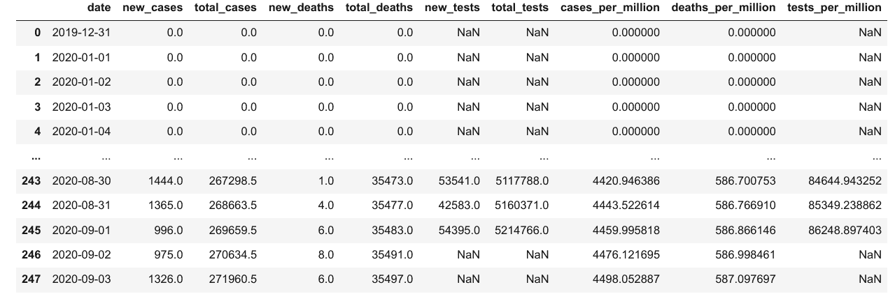

要将数据框中的数据写入文件，我们可以使用`to_csv`函数。

```
result_df.to_csv('results.csv', index=None)
```

默认情况下,`to_csv`函数还包括一个额外的列，用于存储数据帧的索引。我们通过`index=None`来关闭这种行为。您现在可以验证`results.csv`是否已创建并包含 CSV 格式的数据框中的数据:

```
date,new_cases,total_cases,new_deaths,total_deaths,new_tests,total_tests,cases_per_million,deaths_per_million,tests_per_million
2020-02-27,78.0,400.0,1.0,12.0,,,6.61574439992122,0.1984723319976366,
2020-02-28,250.0,650.0,5.0,17.0,,,10.750584649871982,0.28116913699665186,
2020-02-29,238.0,888.0,4.0,21.0,,,14.686952567825108,0.34732658099586405,
2020-03-01,240.0,1128.0,8.0,29.0,,,18.656399207777838,0.47964146899428844,
2020-03-02,561.0,1689.0,6.0,35.0,,,27.93498072866735,0.5788776349931067,
2020-03-03,347.0,2036.0,17.0,52.0,,,33.67413899559901,0.8600467719897585,
...
```

### 额外收获:熊猫的基本绘图

我们通常使用像`matplotlib`或`seaborn`这样的库在 Jupyter 笔记本中绘制图形。然而，熊猫数据帧和系列提供了一个方便快捷的`.plot`方法。

让我们绘制一个线形图，显示每日病例数如何随时间变化。

```
result_df.new_cases.plot();
```

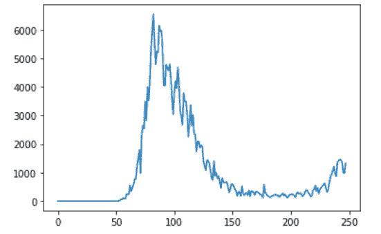

虽然该图显示了总体趋势，但很难判断峰值出现在哪里，因为 X 轴上没有日期。我们可以使用`date`列作为数据框的索引来解决这个问题。

```
result_df.set_index('date', inplace=True)

result_df
```

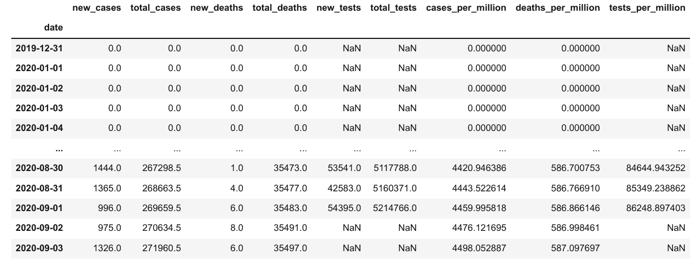

请注意，数据框的索引不一定是数字。使用日期作为索引还允许我们使用`.loc`获得特定数据的数据。

```
result_df.loc['2020-09-01']
# new_cases             9.960000e+02
# total_cases           2.696595e+05
# new_deaths            6.000000e+00
# total_deaths          3.548300e+04
# new_tests             5.439500e+04
# total_tests           5.214766e+06
# cases_per_million     4.459996e+03
# deaths_per_million    5.868661e+02
# tests_per_million     8.624890e+04
# Name: 2020-09-01 00:00:00, dtype: float64
```

让我们把每天的新增病例和新增死亡人数绘制成线图。

```
result_df.new_cases.plot()
result_df.new_deaths.plot();
```

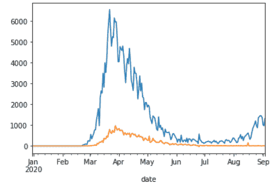

我们还可以比较总病例数和总死亡数。

```
result_df.total_cases.plot()
result_df.total_deaths.plot();
```

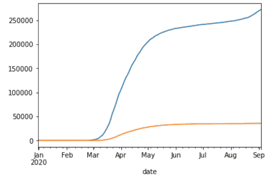

让我们看看死亡率和阳性检测率是如何随时间变化的。

```
death_rate = result_df.total_deaths / result_df.total_cases

death_rate.plot(title='Death Rate');
```

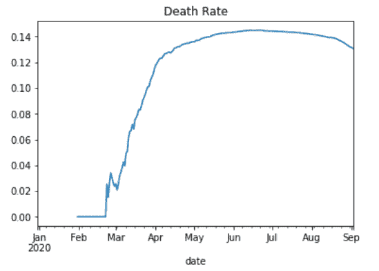

```
positive_rates = result_df.total_cases / result_df.total_tests

positive_rates.plot(title='Positive Rate');
```

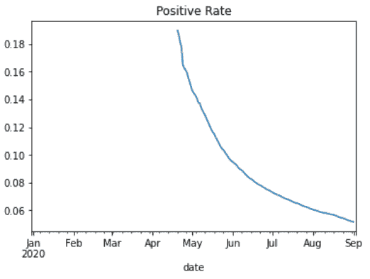

最后，让我们使用条形图绘制一些月的数据，以在更高的级别上可视化趋势。

```
covid_month_df.new_cases.plot(kind='bar');
```


```
covid_month_df.new_tests.plot(kind='bar')
```

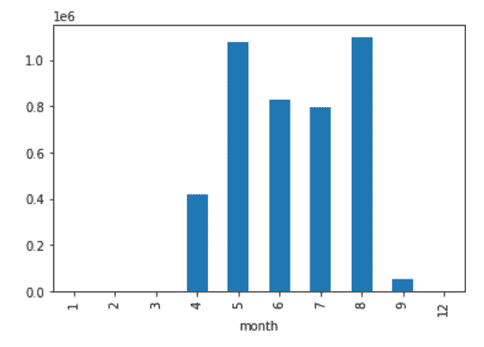

### 熊猫练习

尝试以下练习，熟悉熊猫数据框架并练习您的技能:

*   [熊猫数据帧的赋值](https://jovian.ml/aakashns/pandas-practice-assignment)
*   [关于熊猫的附加练习](https://github.com/guipsamora/pandas_exercises)
*   [尝试从 Kaggle 下载并分析一些数据](https://www.kaggle.com/datasets)

### 总结和进一步阅读

我们在本教程中讨论了以下主题:

*   如何将 CSV 文件读入熊猫数据框
*   如何从熊猫数据框中检索数据
*   如何查询、排序和分析数据
*   如何合并、分组和聚合数据
*   如何从日期中提取有用的信息
*   使用折线图和条形图进行基本绘图
*   如何将数据帧写入 CSV 文件

查看以下资源，了解更多关于熊猫的信息:

*   [熊猫用户指南](https://pandas.pydata.org/docs/user_guide/index.html)
*   [用于数据分析的 Python(Wes McKinney 的书——熊猫的创造者)](https://www.oreilly.com/library/view/python-for-data/9781491957653/)

### 复习问题，检查你的理解能力

尝试回答以下问题，以测试您对本笔记本所涵盖主题的理解程度:

1.  熊猫是什么？是什么让它有用？
2.  你如何安装熊猫图书馆？
3.  如何导入`pandas`模块？
4.  导入`pandas`模块时常用的别名是什么？
5.  如何使用熊猫读取 CSV 文件？举个例子。
6.  你能用熊猫阅读的其他文件格式是什么？举例说明。
7.  什么是熊猫数据帧？
8.  Pandas 数据帧和 Numpy 数组有什么不同？
9.  你如何找到一个数据帧中的行数和列数？
10.  如何获得数据帧中的列列表？
11.  数据帧的`describe`方法的目的是什么？
12.  `info`和`describe` dataframe 方法有什么不同？
13.  熊猫数据框架在概念上类似于字典列表还是列表的字典？举例说明。
14.  什么是熊猫`Series`？它与 Numpy 数组有什么不同？
15.  如何从数据帧中访问列？
16.  如何从数据帧中访问一行？
17.  如何访问数据帧中特定行和列的元素？
18.  如何用一组特定的列创建数据帧的子集？
19.  如何用特定范围的行创建数据帧的子集？
20.  更改数据帧中的值会影响使用行或列的子集创建的其他数据帧吗？为什么会这样呢？
21.  如何创建数据帧的副本？
22.  为什么应该避免为一个数据帧创建太多副本？
23.  如何查看数据帧的前几行？
24.  如何查看数据帧的最后几行？
25.  如何查看数据帧中随机选择的行？
26.  数据帧中的“索引”是什么？怎么有用？
27.  熊猫数据帧中的`NaN`值代表什么？
28.  `Nan`和`0`有什么不同？
29.  如何识别熊猫系列或列中的第一个非空行？
30.  `df.loc`和`df.at`有什么区别？
31.  在哪里可以找到熊猫`DataFrame`和`Series`对象支持的方法的完整列表？
32.  如何计算一个数据帧中一列数字的总和？
33.  你如何找到一个数据帧中一列数字的平均值？
34.  如何找到一个数据帧的一列中非空数字的个数？
35.  在布尔表达式中使用熊猫列会得到什么结果？举例说明。
36.  如何选择特定列的值满足给定条件的行子集？举例说明。
37.  表达式`df[df.new_cases > 100]`的结果是什么？
38.  如何在 Jupyter 单元格输出中显示熊猫数据帧的所有行？
39.  在数据帧的两列之间执行算术运算会得到什么结果？举例说明。
40.  如何通过合并两个现有列中的值向 dataframe 中添加新列？举例说明。
41.  如何从数据帧中删除一列？举例说明。
42.  dataframe 方法中的`inplace`参数的目的是什么？
43.  如何根据特定列中的值对数据帧中的行进行排序？
44.  如何使用多列中的值对熊猫数据帧进行排序？
45.  在对熊猫数据帧进行排序时，如何指定是按升序还是降序排序？
46.  如何更改数据帧中的特定值？
47.  如何将 dataframe 列转换为`datetime`数据类型？
48.  使用`datetime`数据类型代替`object`有什么好处？
49.  如何将月、年、月、工作日等日期列的不同部分提取到单独的列中？举例说明。
50.  如何将一个数据帧的多列聚合在一起？
51.  数据帧的`groupby`方法的目的是什么？举例说明。
52.  有哪些不同的方法可以聚合由`groupby`创建的组？
53.  你说的累计总和是什么意思？
54.  如何创建包含另一列的累计和的新列？
55.  熊猫数据框架支持的其他累积度量还有哪些？
56.  合并两个数据帧意味着什么？举个例子。
57.  如何指定用于合并两个数据帧的列？
58.  如何将熊猫数据帧中的数据写入 CSV 文件？举个例子。
59.  你还可以从熊猫数据帧中写入其他的文件格式吗？举例说明。
60.  如何创建一个折线图来显示一个数据帧的一列中的值？
61.  如何将数据帧的一列转换成它的索引？
62.  数据帧的索引可以是非数字的吗？
63.  使用非数字数据框架有什么好处？举例说明。
64.  如何创建一个条形图来显示一个数据帧的一列中的值？
65.  熊猫数据帧和系列支持的其他类型的情节是什么？

您已经准备好进入教程的下一部分。

## 使用 Python、Matplotlib 和 Seaborn 的数据可视化

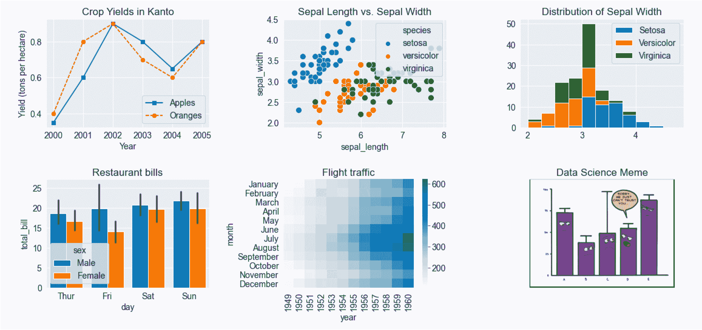

笔记本链接:[https://jovian . ai/aakashns/python-matplotlib-data-visualization](https://jovian.ai/aakashns/python-matplotlib-data-visualization)

数据可视化是数据的图形表示。它包括生成图像，向观众传达所表示的数据之间的关系。

可视化数据是数据分析和机器学习的重要组成部分。我们将使用 Python 库 [Matplotlib](https://jovian.ai/outlink?url=https%3A%2F%2Fmatplotlib.org) 和 [Seaborn](https://jovian.ai/outlink?url=https%3A%2F%2Fseaborn.pydata.org) 来学习和应用一些流行的数据可视化技术。在本教程中，我们将交替使用 **图表****绘图** 和 **图形** 。

首先，让我们安装并导入库。我们将使用`matplotlib.pyplot`模块进行基本绘图，如线形图和条形图。经常用别名`plt`导入。我们将使用`seaborn`模块来制作更高级的剧情。通常使用别名`sns`导入。

```
!pip install matplotlib seaborn --upgrade --quiet

import matplotlib.pyplot as plt
import seaborn as sns
%matplotlib inline
```

请注意，我们还包含了特殊的命令`%matplotlib inline`，以确保我们的绘图显示并嵌入 Jupyter 笔记本本身。如果没有此命令，有时弹出窗口中可能会显示出图。

### 如何用 Python 创建折线图

折线图是最简单也是最广泛使用的数据可视化技术之一。折线图将信息显示为由直线连接的一系列数据点或标记。

您可以自定义线条和标记的形状、大小、颜色和其他美学元素，以获得更好的视觉清晰度。

这是一个 Python 列表，显示了一个名为 Kanto 的虚构国家六年来的苹果产量(吨/公顷)。

```
yield_apples = [0.895, 0.91, 0.919, 0.926, 0.929, 0.931]
```

我们可以用折线图来显示苹果产量随时间的变化。要画折线图，我们可以使用`plt.plot`函数。

```
plt.plot(yield_apples)
```

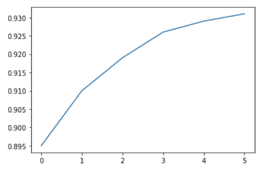

调用`plt.plot`函数按预期绘制折线图。它还返回一个绘制的图表列表`[<matplotlib.lines.Line2D at 0x7ff70aa20760>]`，显示在输出中。我们可以在单元格中最后一条语句的末尾加上一个分号(`;`)，以避免显示输出，而只显示图形。

```
plt.plot(yield_apples);
```

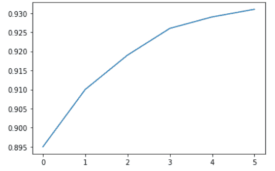

让我们一步一步地增强这个情节，使它更有知识性和美感。

#### **如何在 MatPlotLib 中自定义 X 轴**

该图的 X 轴当前显示列表元素索引 0 到 5。如果我们能够显示我们绘制数据的年份，那么这个图将会提供更多的信息。我们可以通过两个论证来做到这一点。

```
years = [2010, 2011, 2012, 2013, 2014, 2015]
yield_apples = [0.895, 0.91, 0.919, 0.926, 0.929, 0.931]

plt.plot(years, yield_apples)
```

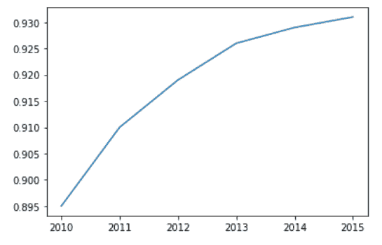

#### **MatPlotLib 中的轴标签**

我们可以使用`plt.xlabel`和`plt.ylabel`方法向轴添加标签来显示每个轴代表什么。

```
plt.plot(years, yield_apples)
plt.xlabel('Year')
plt.ylabel('Yield (tons per hectare)');
```

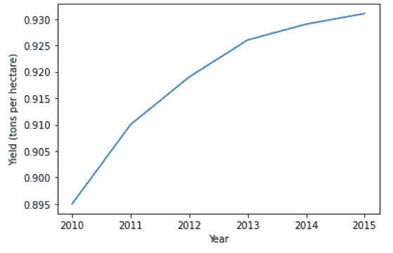

#### **如何在 MatPlotLib 中绘制多行**

您可以为每条线调用一次`plt.plot`函数，以便在同一个图形中绘制多条线。我们来比较一下关东苹果和橘子的产量。

```
years = range(2000, 2012)
apples = [0.895, 0.91, 0.919, 0.926, 0.929, 0.931, 0.934, 0.936, 0.937, 0.9375, 0.9372, 0.939]
oranges = [0.962, 0.941, 0.930, 0.923, 0.918, 0.908, 0.907, 0.904, 0.901, 0.898, 0.9, 0.896, ]

plt.plot(years, apples)
plt.plot(years, oranges)
plt.xlabel('Year')
plt.ylabel('Yield (tons per hectare)');
```

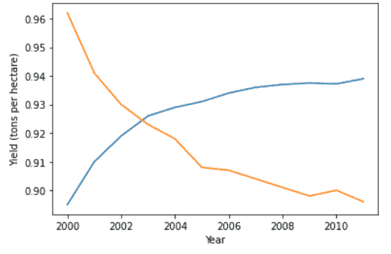

#### **MatPlotLib 中的图表标题和图例**

为了区分多条线，我们可以使用`plt.legend`函数在图形中包含一个图例。我们还可以使用`plt.title`函数为图表设置一个标题。

```
plt.plot(years, apples)
plt.plot(years, oranges)

plt.xlabel('Year')
plt.ylabel('Yield (tons per hectare)')

plt.title("Crop Yields in Kanto")
plt.legend(['Apples', 'Oranges']);
```

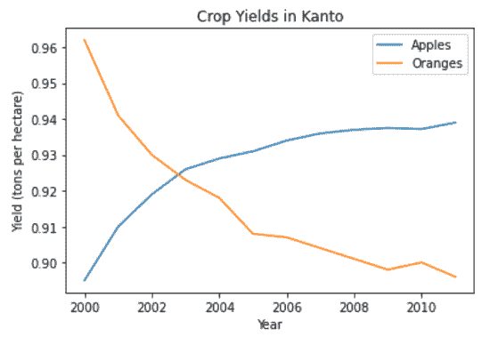

#### **如何在 MatPlotLib 中使用线条标记**

我们还可以使用`plt.plot`的`marker`参数在每一行显示数据点的标记。

Matplotlib 提供了许多不同的标记，如圆形、十字、方形、菱形等等。你可以在这里找到标记类型的完整列表:[https://matplotlib.org/3.1.1/api/markers_api.html](https://jovian.ai/outlink?url=https%3A%2F%2Fmatplotlib.org%2F3.1.1%2Fapi%2Fmarkers_api.html)。

```
plt.plot(years, apples, marker='o')
plt.plot(years, oranges, marker='x')

plt.xlabel('Year')
plt.ylabel('Yield (tons per hectare)')

plt.title("Crop Yields in Kanto")
plt.legend(['Apples', 'Oranges']);
```

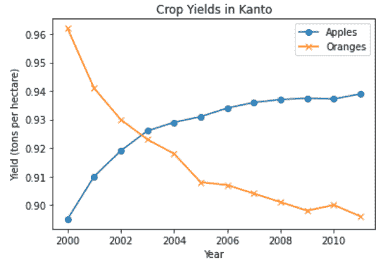

#### **如何在 MatPlotLib 中设计线条和标记的样式**

`plt.plot`函数支持许多用于设计线条和标记样式的参数:

*   `color`或`c`–设置线条的颜色([支持的颜色](https://jovian.ai/outlink?url=https%3A%2F%2Fmatplotlib.org%2F3.1.0%2Fgallery%2Fcolor%2Fnamed_colors.html)
*   `linestyle`或`ls`–选择实线或虚线
*   `linewidth`或`lw`–设置线条的宽度
*   `markersize`或`ms`–设置标记的大小
*   `markeredgecolor`或`mec`–设置标记的边缘颜色
*   `markeredgewidth`或`mew`–设置标记的边缘宽度
*   `markerfacecolor`或`mfc`–设置标记的填充颜色
*   `alpha`–绘图的不透明度

查看`plt.plot`的文档了解更多:[https://matplotlib . org/API/_ as _ gen/matplotlib . py plot . plot . html # matplotlib . py plot . plot](https://jovian.ai/outlink?url=https%3A%2F%2Fmatplotlib.org%2Fapi%2F_as_gen%2Fmatplotlib.pyplot.plot.html%23matplotlib.pyplot.plot)。

```
plt.plot(years, apples, marker='s', c='b', ls='-', lw=2, ms=8, mew=2, mec='navy')
plt.plot(years, oranges, marker='o', c='r', ls='--', lw=3, ms=10, alpha=.5)

plt.xlabel('Year')
plt.ylabel('Yield (tons per hectare)')

plt.title("Crop Yields in Kanto")
plt.legend(['Apples', 'Oranges']);
```

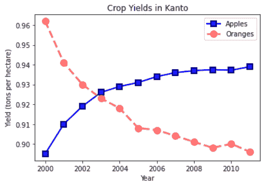

`fmt`参数提供了指定标记形状、线条样式和线条颜色的简写方式。你可以把它作为第三个参数提供给`plt.plot`。

```
fmt = '[marker][line][color]'

plt.plot(years, apples, 's-b')
plt.plot(years, oranges, 'o--r')

plt.xlabel('Year')
plt.ylabel('Yield (tons per hectare)')

plt.title("Crop Yields in Kanto")
plt.legend(['Apples', 'Oranges']);
```

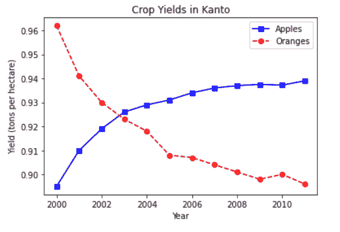

您可以使用`plt.figure`功能来改变图形的大小。

```
plt.plot(years, oranges, 'or')
plt.title("Yield of Oranges (tons per hectare)");
```

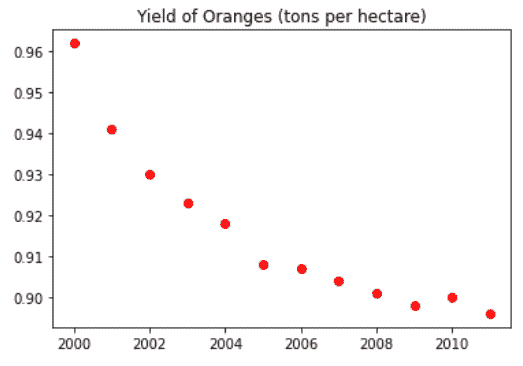

#### **如何在 MatPlotLib 中改变图形尺寸**

您可以使用`plt.figure`功能来改变图形的大小。

```
plt.figure(figsize=(12, 6))

plt.plot(years, oranges, 'or')
plt.title("Yield of Oranges (tons per hectare)");
```

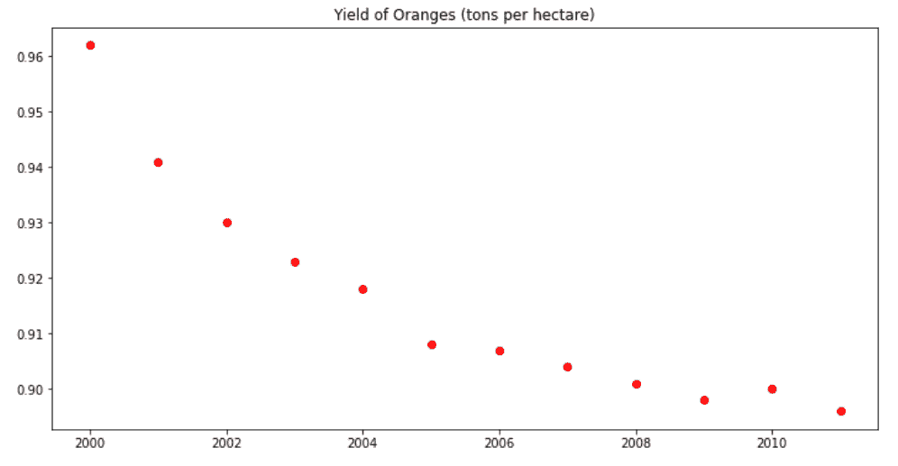

#### **如何使用 Seaborn 改进默认样式**

让图表看起来漂亮的一个简单方法是使用 Seaborn 库中的一些默认样式。您可以使用`sns.set_style`函数全局应用它们。你可以在这里看到预定义风格的完整列表:[https://seaborn.pydata.org/generated/seaborn.set_style.html](https://jovian.ai/outlink?url=https%3A%2F%2Fseaborn.pydata.org%2Fgenerated%2Fseaborn.set_style.html)。

```
sns.set_style("whitegrid")
plt.plot(years, apples, 's-b')
plt.plot(years, oranges, 'o--r')

plt.xlabel('Year')
plt.ylabel('Yield (tons per hectare)')

plt.title("Crop Yields in Kanto")
plt.legend(['Apples', 'Oranges']);
```

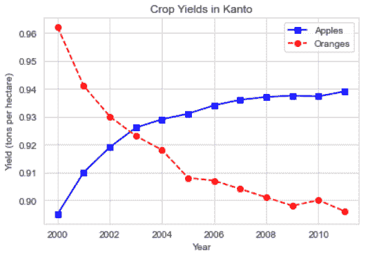

```
sns.set_style("darkgrid")

plt.plot(years, apples, 's-b')
plt.plot(years, oranges, 'o--r')

plt.xlabel('Year')
plt.ylabel('Yield (tons per hectare)')

plt.title("Crop Yields in Kanto")
plt.legend(['Apples', 'Oranges']);
```

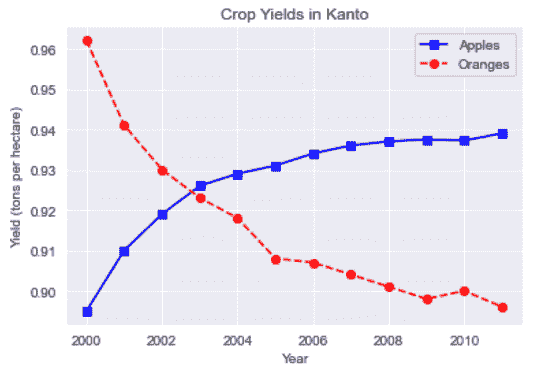

```
plt.plot(years, oranges, 'or')
plt.title("Yield of Oranges (tons per hectare)");
```

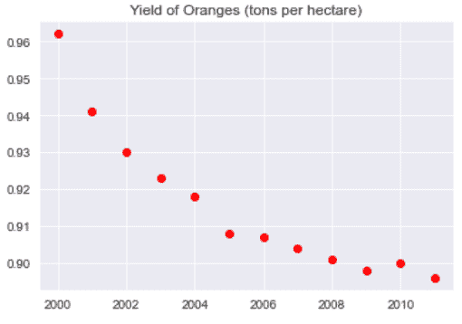

也可以通过修改`matplotlib.rcParams`字典直接编辑默认样式。了解更多:[https://matplotlib . org/3 . 2 . 1/tutorials/introductive/customizing . html # matplotlib-RC params](https://jovian.ai/outlink?url=https%3A%2F%2Fmatplotlib.org%2F3.2.1%2Ftutorials%2Fintroductory%2Fcustomizing.html%23matplotlib-rcparams)。

```
import matplotlib

matplotlib.rcParams['font.size'] = 14
matplotlib.rcParams['figure.figsize'] = (9, 5)
matplotlib.rcParams['figure.facecolor'] = '#00000000'
```

### MatPlotLib 中的散点图

**在散点图中，两个变量的值被绘制为二维网格上的点。此外，您还可以使用第三个变量来确定点的大小或颜色。让我们试一个例子。**

**[鸢尾花数据集](https://jovian.ai/outlink?url=https%3A%2F%2Fen.wikipedia.org%2Fwiki%2FIris_flower_data_set)提供了三种花的萼片和花瓣的样本测量值。Iris 数据集包含在 Seaborn 库中，您可以将其作为 Pandas 数据框进行加载。**

```
`# Load data into a Pandas dataframe
flowers_df = sns.load_dataset("iris")

flowers_df`
```

**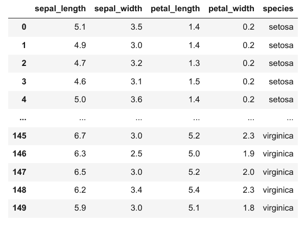**

```
`flowers_df.species.unique()
# array(['setosa', 'versicolor', 'virginica'], dtype=object)`
```

**让我们试着想象一下萼片长度和萼片宽度之间的关系。我们的第一反应可能是使用`plt.plot`创建一个折线图。**

```
`plt.plot(flowers_df.sepal_length, flowers_df.sepal_width);`
```

**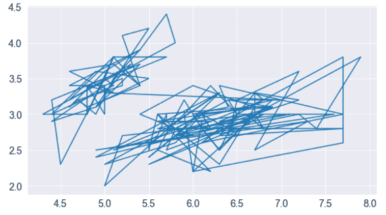**

**由于数据集中这两种属性的组合太多，所以输出的信息并不丰富。他们之间似乎没有简单的关系。**

**我们可以使用散点图来可视化萼片长度和萼片宽度如何变化，使用来自`seaborn`模块的`scatterplot`函数(作为`sns`导入)。**

```
`sns.scatterplot(x=flowers_df.sepal_length, y=flowers_df.sepal_width);`
```

**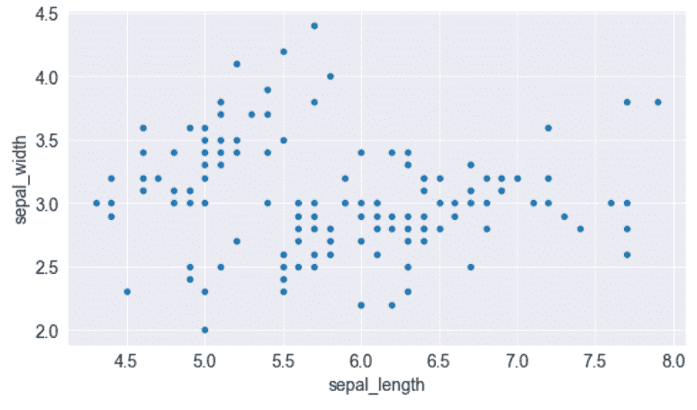**

#### ****如何在 MatPlotLib 中添加色调****

**请注意，上图中的点似乎形成了带有一些异常值的独特聚类。我们可以用花的种类作为`hue`来给这些点上色。我们还可以使用`s`参数使点变大。**

```
`sns.scatterplot(x=flowers_df.sepal_length, y=flowers_df.sepal_width, hue=flowers_df.species, s=100);`
```

**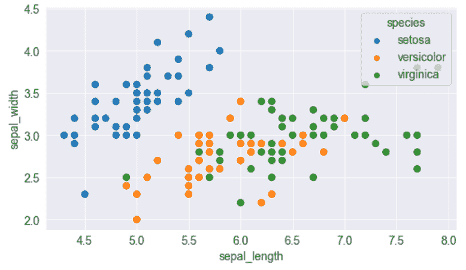**

**添加色调使情节更丰富。我们可以立即分辨出刚毛鸢尾的萼片长度较小，但萼片宽度较大。相比之下，海滨鸢尾的情况正好相反。**

#### ****如何**定制** e **海上人物******

**由于 Seaborn 内部使用了 Matplotlib 的绘图函数，所以我们可以使用类似`plt.figure`和`plt.title`这样的函数来修改图形。**

```
`plt.figure(figsize=(12, 6))
plt.title('Sepal Dimensions')

sns.scatterplot(x=flowers_df.sepal_length, 
                y=flowers_df.sepal_width, 
                hue=flowers_df.species,
                s=100);`
```

**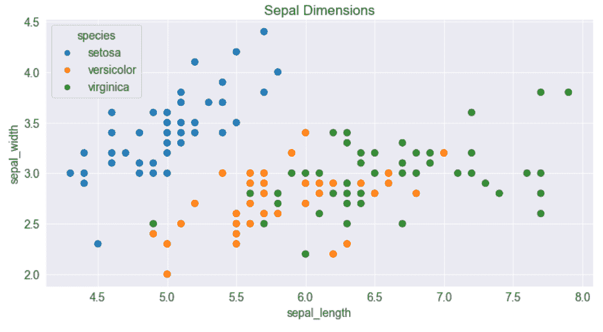**

#### ****如何通过 Seaborn 使用 Pandas 数据框绘制数据****

**Seaborn 内置了对熊猫数据框的支持。您可以提供列名并使用`data`参数来指定数据框，而不是将每一列作为一个序列来传递。**

```
`plt.title('Sepal Dimensions')
sns.scatterplot(x='sepal_length', 
                y='sepal_width', 
                hue='species',
                s=100,
                data=flowers_df);`
```

**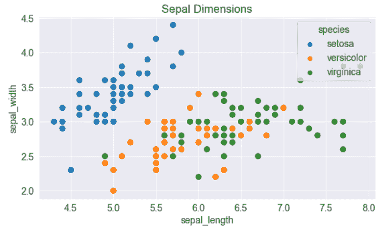**

### **MatPlotLib 中的直方图**

****直方图通过沿数值范围创建柱(区间)并显示竖条来表示每个柱中的观察值数量，从而表示变量的分布。****

****例如，让我们可视化虹膜数据集中萼片宽度值的分布。我们可以使用`plt.hist`函数来创建一个直方图。****

```
**`# Load data into a Pandas dataframe
flowers_df = sns.load_dataset("iris")

flowers_df.sepal_width
# 0      3.5
# 1      3.0
# 2      3.2
# 3      3.1
# 4      3.6
#       ... 
# 145    3.0
# 146    2.5
# 147    3.0
# 148    3.4
# 149    3.0
# Name: sepal_width, Length: 150, dtype: float64`**
```

```
**`plt.title("Distribution of Sepal Width")
plt.hist(flowers_df.sepal_width);`**
```

****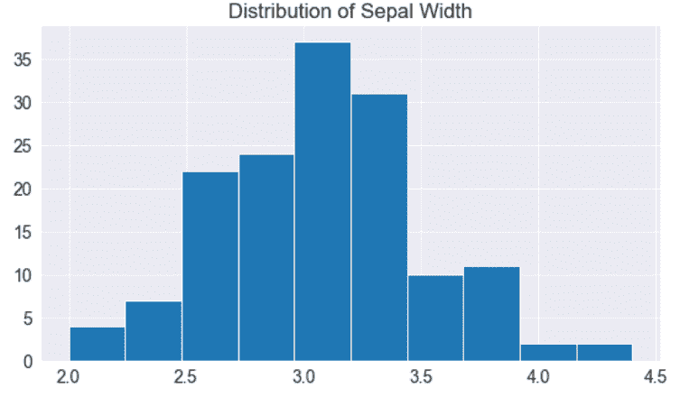****

****我们可以立即看到萼片宽度在 2.0 - 4.5 的范围内，并且大约 35 个值在 2.9 - 3.1 的范围内，这似乎是最多的面元。****

#### ******如何控制** S **尺寸和** N **数量**B**ins******

****我们可以使用 bin 参数来控制 bin 的数量或每个 bin 的大小。****

```
**`# Specifying the number of bins
plt.hist(flowers_df.sepal_width, bins=5);`**
```

****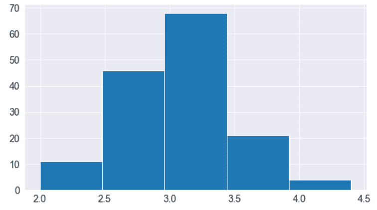****

```
**`import numpy as np

# Specifying the boundaries of each bin
plt.hist(flowers_df.sepal_width, bins=np.arange(2, 5, 0.25));`**
```

********

```
**`# Bins of unequal sizes
plt.hist(flowers_df.sepal_width, bins=[1, 3, 4, 4.5]);`**
```

****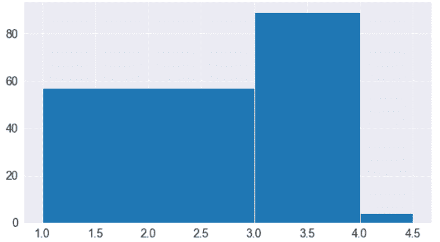****

#### ******如何在 MatPlotLib 中管理多个直方图******

****类似于折线图，我们可以在单个图表中绘制多个直方图。我们可以降低每个直方图的不透明度，这样一个直方图的条就不会隐藏其他直方图的条。****

****让我们为每种花分别绘制直方图。****

```
**`setosa_df = flowers_df[flowers_df.species == 'setosa']
versicolor_df = flowers_df[flowers_df.species == 'versicolor']
virginica_df = flowers_df[flowers_df.species == 'virginica']

plt.hist(setosa_df.sepal_width, alpha=0.4, bins=np.arange(2, 5, 0.25));
plt.hist(versicolor_df.sepal_width, alpha=0.4, bins=np.arange(2, 5, 0.25));`**
```

****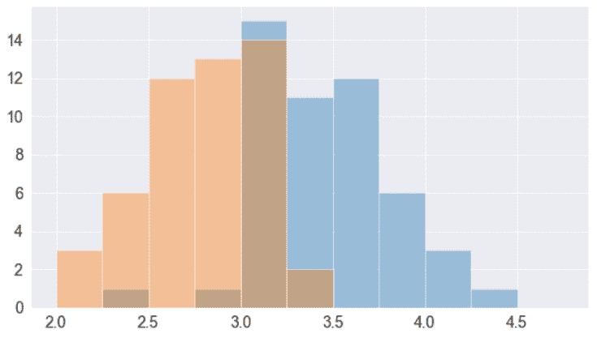****

****我们还可以将多个直方图堆叠在一起。****

```
**`plt.title('Distribution of Sepal Width')

plt.hist([setosa_df.sepal_width, versicolor_df.sepal_width, virginica_df.sepal_width], 
         bins=np.arange(2, 5, 0.25), 
         stacked=True);

plt.legend(['Setosa', 'Versicolor', 'Virginica']);`**
```

****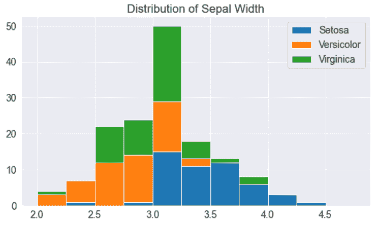****

### ****MatPlotLib 中的条形图****

******条形图与折线图非常相似，即它们显示一系列数值。但是，每个值都显示一个条形，而不是由线条连接的点。我们可以使用`plt.bar`函数来绘制条形图。******

```
****`years = range(2000, 2006)
apples = [0.35, 0.6, 0.9, 0.8, 0.65, 0.8]
oranges = [0.4, 0.8, 0.9, 0.7, 0.6, 0.8]

plt.bar(years, oranges);`****
```

******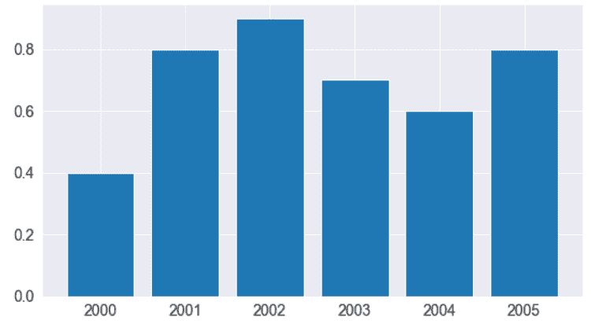******

******像直方图一样，我们可以将条形图堆叠在一起。我们使用`plt.bar`的`bottom`参数来实现这一点。******

```
****`plt.bar(years, apples)
plt.bar(years, oranges, bottom=apples);`****
```

******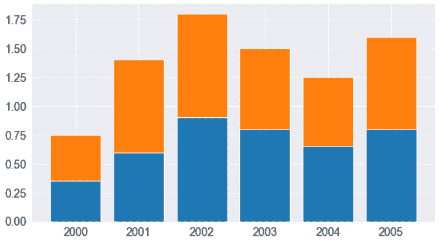******

#### ********Seaborn 平均值柱状图********

****让我们看看 Seaborn 附带的另一个样本数据集`tips`。该数据集包含一周内光顾餐馆的顾客的性别、时间、总账单和小费金额等信息。****

```
**`tips_df = sns.load_dataset("tips");

tips_df`**
```

****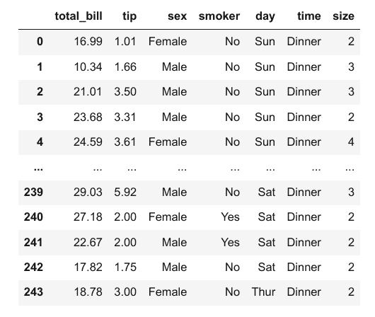****

****我们可能希望绘制一个条形图来直观地显示平均账单金额在一周的不同日子里是如何变化的。一种方法是计算一天的平均值，然后使用`plt.bar`(作为练习)。****

****然而，由于这是一个非常常见的用例，Seaborn 库提供了一个可以自动计算平均值的`barplot`函数。****

```
**`sns.barplot(x='day', y='total_bill', data=tips_df);`**
```

****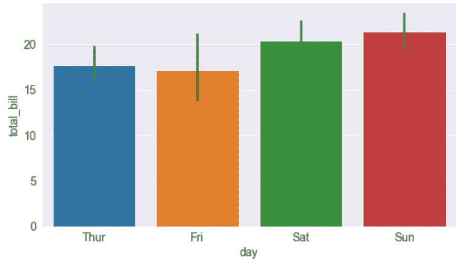****

****切割每个条形的线代表数值的变化量。例如，看起来总账单的变化在周五相对较高，在周六相对较低。****

****我们还可以指定一个`hue`参数，根据第三个特征(例如性别)并排比较条形图。****

```
**`sns.barplot(x='day', y='total_bill', hue='sex', data=tips_df);`**
```

****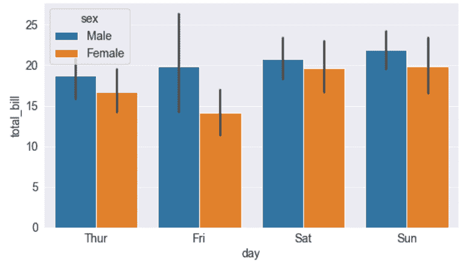****

****只需切换轴，就可以使条形水平。****

```
**`sns.barplot(x='total_bill', y='day', hue='sex', data=tips_df);`**
```

****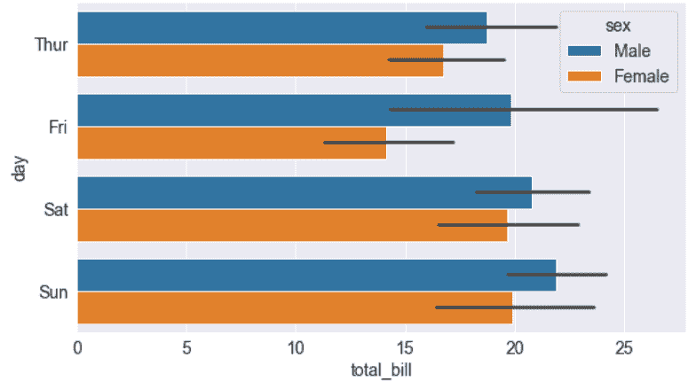****

### ****锡伯恩的热图****

****热图用于可视化二维数据，如使用颜色的矩阵或表格。理解它的最好方法是看一个例子。****

****我们将使用来自 Seaborn 的另一个样本数据集，名为`flights`，来可视化一个机场 12 年来的每月客流量。****

```
**`flights_df = sns.load_dataset("flights").pivot("month", "year", "passengers")

flights_df`**
```

****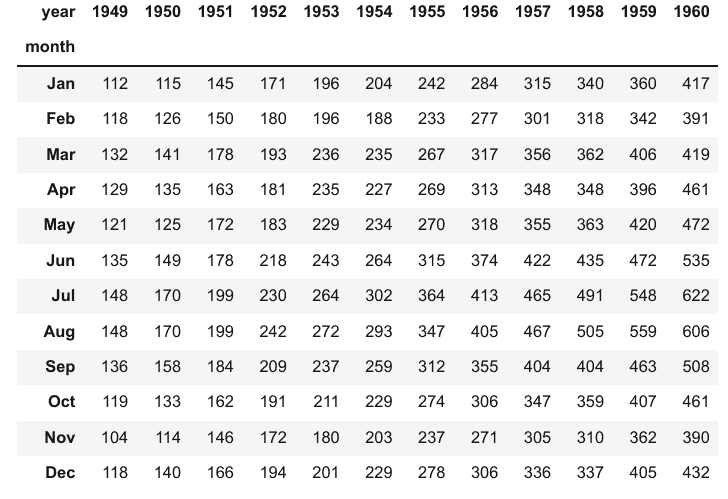****

****`flights_df`是一个矩阵，每个月一行，每年一列。这些值显示了在一年中特定月份访问机场的乘客数量(以千计)。我们可以使用`sns.heatmap`函数来可视化机场的人流。****

```
**`plt.title("No. of Passengers (1000s)")
sns.heatmap(flights_df);`**
```

****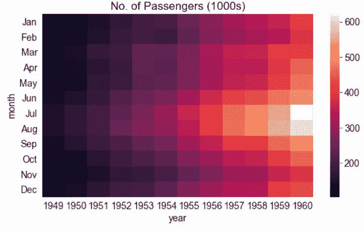****

****较亮的颜色表示机场的客流量较大。通过查看图表，我们可以推断出两件事:****

*   ****在任何一年的 7 月和 8 月，机场的客流量都是最高的。****
*   ****任何一个月的机场客流量都有逐年增长的趋势。****

****我们还可以通过指定`annot=True`并使用`cmap`参数改变调色板来显示每个块中的实际值。****

```
**`plt.title("No. of Passengers (1000s)")
sns.heatmap(flights_df, fmt="d", annot=True, cmap='Blues');`**
```

****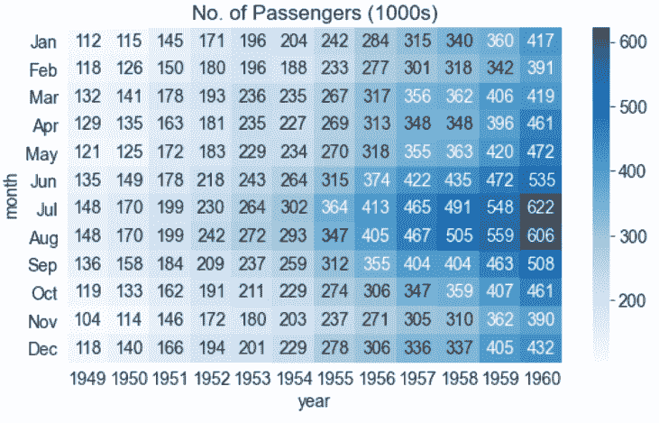****

### ****MatPlotLib 中的图像****

******我们也可以使用 Matplotlib 来显示图像。我们从网上下载一张图片吧。******

```
****`from urllib.request import urlretrieve

urlretrieve('https://i.imgur.com/SkPbq.jpg', 'chart.jpg');`****
```

******在显示图像之前，必须使用`PIL`模块将其读入内存。******

```
****`from PIL import Image

img = Image.open('chart.jpg')`****
```

******使用 PIL 加载的图像只是一个三维 numpy 数组，包含图像的红、绿、蓝(RGB)通道的像素强度。我们可以使用`np.array`将图像转换成数组。******

```
****`img_array = np.array(img)

img_array.shape
# (481, 640, 3)`****
```

******我们可以使用`plt.imshow`显示 PIL 图像。******

```
****`plt.imshow(img);`****
```

******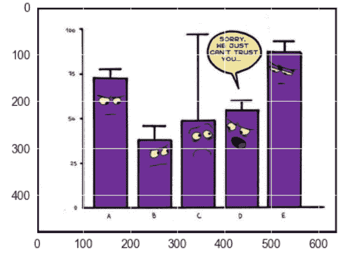******

******我们可以关闭轴和网格线，并使用相关功能显示标题。******

```
****`plt.grid(False)
plt.title('A data science meme')
plt.axis('off')
plt.imshow(img);`****
```

************

******为了显示图像的一部分，我们可以简单地从 numpy 数组中选择一个切片。******

```
****`plt.grid(False)
plt.axis('off')
plt.imshow(img_array[125:325,105:305]);`****
```

************

### ******如何在 MatPlotLib 和 Seaborn 中绘制一个网格中的多个图表******

******Matplotlib 和 Seaborn 也支持在一个网格中绘制多个图表，使用`plt.subplots`，它返回一组用于绘制的轴。******

******这里有一个网格，显示了我们在本教程中介绍的不同类型的图表。******

```
****`fig, axes = plt.subplots(2, 3, figsize=(16, 8))

# Use the axes for plotting
axes[0,0].plot(years, apples, 's-b')
axes[0,0].plot(years, oranges, 'o--r')
axes[0,0].set_xlabel('Year')
axes[0,0].set_ylabel('Yield (tons per hectare)')
axes[0,0].legend(['Apples', 'Oranges']);
axes[0,0].set_title('Crop Yields in Kanto')

# Pass the axes into seaborn
axes[0,1].set_title('Sepal Length vs. Sepal Width')
sns.scatterplot(x=flowers_df.sepal_length, 
                y=flowers_df.sepal_width, 
                hue=flowers_df.species, 
                s=100, 
                ax=axes[0,1]);

# Use the axes for plotting
axes[0,2].set_title('Distribution of Sepal Width')
axes[0,2].hist([setosa_df.sepal_width, versicolor_df.sepal_width, virginica_df.sepal_width], 
         bins=np.arange(2, 5, 0.25), 
         stacked=True);

axes[0,2].legend(['Setosa', 'Versicolor', 'Virginica']);

# Pass the axes into seaborn
axes[1,0].set_title('Restaurant bills')
sns.barplot(x='day', y='total_bill', hue='sex', data=tips_df, ax=axes[1,0]);

# Pass the axes into seaborn
axes[1,1].set_title('Flight traffic')
sns.heatmap(flights_df, cmap='Blues', ax=axes[1,1]);

# Plot an image using the axes
axes[1,2].set_title('Data Science Meme')
axes[1,2].imshow(img)
axes[1,2].grid(False)
axes[1,2].set_xticks([])
axes[1,2].set_yticks([])

plt.tight_layout(pad=2);`****
```

******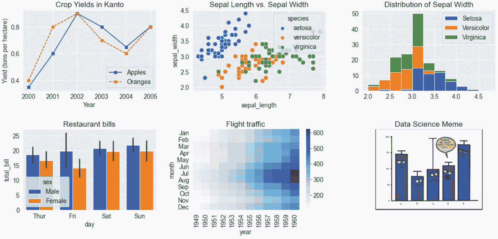******

******有关支持的函数的完整列表，请参见本页:[https://matplotlib . org/3 . 3 . 1/API/axes _ API . html # the-axes-class](https://jovian.ai/outlink?url=https%3A%2F%2Fmatplotlib.org%2F3.3.1%2Fapi%2Faxes_api.html%23the-axes-class)。******

#### **********一对** P **一对**********

**Seaborn 还提供了一个助手函数`sns.pairplot`,为一个数据帧中的成对特征自动绘制几个不同的图表。**

```
`sns.pairplot(flowers_df, hue='species');`
```

**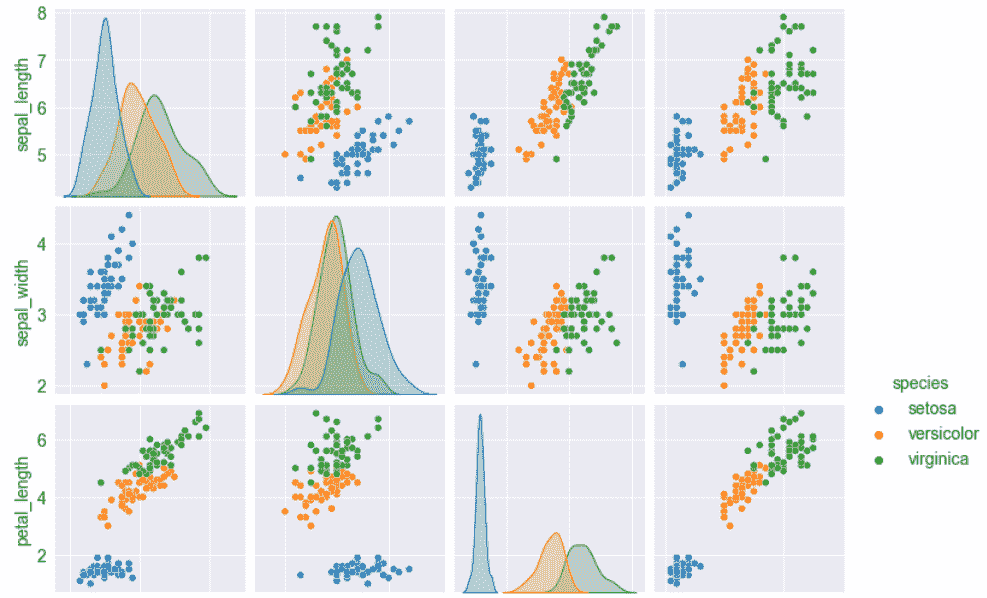

See the full output [here](https://jovian.ai/embed?url=https://jovian.ai/aakashns/python-matplotlib-data-visualization/).** 

```
`sns.pairplot(tips_df, hue='sex');`
```

**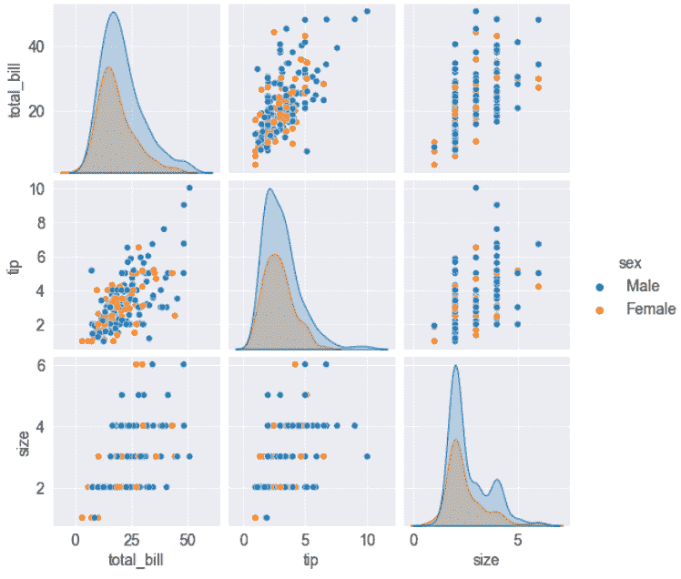**

### **总结和进一步阅读**

**我们已经在本教程中讨论了以下主题:**

*   **如何使用 Matplotlib 创建和定制折线图**
*   **如何使用散点图可视化两个或多个变量之间的关系**
*   **如何使用直方图和条形图研究变量的分布**
*   **如何使用热图可视化二维数据**
*   **如何使用 Matplotlib 的`plt.imshow`显示图像**
*   **如何在网格中绘制多个 Matplotlib 和 Seaborn 图表**

**在本教程中，我们已经介绍了使用 Matplotlib 和 Seaborn 进行数据可视化的一些基本概念和流行技术。数据可视化是一个广阔的领域，我们在这里仅仅触及了皮毛。查看这些参考资料，了解和发现更多信息:**

*   **数据可视化备忘单:[https://jovian.ml/aakashns/dataviz-cheatsheet](https://jovian.ai/outlink?url=https%3A%2F%2Fjovian.ml%2Faakashns%2Fdataviz-cheatsheet)**
*   **Seaborn 画廊:[https://seaborn.pydata.org/examples/index.html](https://jovian.ai/outlink?url=https%3A%2F%2Fseaborn.pydata.org%2Fexamples%2Findex.html)**
*   **Matplotlib 图库:[https://matplotlib.org/3.1.1/gallery/index.html](https://jovian.ai/outlink?url=https%3A%2F%2Fmatplotlib.org%2F3.1.1%2Fgallery%2Findex.html)**
*   **Matplotlib 教程:https://github . com/rouguiar/matplot lib 教程**

### **复习问题，检查你的理解能力**

**尝试回答以下问题，以测试您对本笔记本所涵盖主题的理解程度:**

1.  **什么是数据可视化？**
2.  **什么是 Matplotlib？**
3.  **什么是 Seaborn？**
4.  **如何安装 Matplotlib 和 Seaborn？**
5.  **如何导入 Matplotlib 和 Seaborn？导入这些模块时常用的别名是什么？**
6.  **魔法命令`%matplotlib inline`的目的是什么？**
7.  **什么是折线图？**
8.  **如何用 Python 绘制折线图？举例说明。**
9.  **如何为折线图的 X 轴指定值？**
10.  **如何指定图表坐标轴的标签？**
11.  **如何在同一坐标轴上绘制多个折线图？**
12.  **如何为多线折线图显示图例？**
13.  **如何为图表设置标题？**
14.  **如何在折线图上显示标记？**
15.  **折线图中线条和标记的样式有哪些不同的选项？举例说明。**
16.  **`fmt`变元给`plt.plot`的目的是什么？**
17.  **在哪里可以看到`plt.plot`接受的所有参数列表？**
18.  **如何使用 Matplotlib 改变图形的大小？**
19.  **如何将 Seaborn 的默认样式应用于所有图表？**
20.  **Seaborn 中有哪些预定义的可用样式？举例说明。**
21.  **什么是散点图？**
22.  **散点图与折线图有何不同？**
23.  **如何使用 Seaborn 绘制散点图？举例说明。**
24.  **你如何决定何时使用散点图还是折线图？**
25.  **如何使用分类变量指定散点图上的点的颜色？**
26.  **你如何为 Seaborn plots 定制标题、图形大小、图例和子图？**
27.  **如何使用熊猫数据帧和`sns.scatterplot`？**
28.  **什么是直方图？**
29.  **什么时候应该使用柱状图而不是折线图？**
30.  **如何使用 Matplotlib 绘制直方图？举例说明。**
31.  **直方图中的“仓”是什么？**
32.  **你如何改变直方图的大小？**
33.  **如何改变直方图中的仓数量？**
34.  **如何在同一轴上显示多个直方图？**
35.  **如何将多个直方图堆叠在一起？**
36.  **什么是条形图？**
37.  **如何使用 Matplotlib 绘制条形图？举例说明。**
38.  **条形图和直方图有什么区别？**
39.  **条形图和折线图有什么区别？**
40.  **你如何把一根根的酒吧堆叠起来？**
41.  **`plt.bar`和`sns.barplot`有什么区别？**
42.  **在 Seaborn 条形图中，切割条形的线代表什么？**
43.  **如何并排显示条形图？**
44.  **怎么画单杠图？**
45.  **什么是热图？**
46.  **什么类型的数据最好用热图可视化？**
47.  **熊猫数据帧的`pivot`方法是做什么的？**
48.  **如何使用 Seaborn 绘制热图？举例说明。**
49.  **如何更改热图的配色方案？**
50.  **如何在热点图上显示数据集的原始值？**
51.  **如何用 Python 从 URL 下载图片？**
52.  **如何在 Python 中打开图像进行处理？**
53.  **Python 中的`PIL`模块有什么用途？**
54.  **如何将使用 PIL 加载的图像转换成 Numpy 数组？**
55.  **一个图像的 Numpy 数组有多少维？每个维度代表什么？**
56.  **图像中的“颜色通道”是什么？**
57.  **什么是 RGB？**
58.  **如何使用 Matplotlib 显示图像？**
59.  **如何关闭图表中的坐标轴和网格线？**
60.  **如何使用 Matplotlib 显示图像的一部分？**
61.  **如何使用 Matplotlib 和 Seaborn 在一个网格中绘制多个图表？举例说明。**
62.  **`plt.subplots`函数的用途是什么？**
63.  **Seaborn 中的结对情节是什么？举例说明。**
64.  **如何使用 Matplotlib 将绘图导出为 PNG 图像文件？**
65.  **从哪里可以了解到使用 Matplotlib 和 Seaborn 可以创建不同类型的图表？**

**祝贺您完成了本教程的最后一课！您现在可以应用这些技能来分析来自像 [Kaggle](https://kaggle.com/datasets) 这样的来源的真实世界数据集。**

**如果你正在追求数据科学和机器学习的职业生涯，考虑加入 Jovian 的[零到数据科学训练营。这是一个为期 20 周的兼职项目，你将完成 7 门课程、12 项编码作业和 4 个真实世界项目。您还将获得 6 个月的职业支持，帮助您找到第一份数据科学工作。](https://zerotodatascience.com)**

**[Part-Time Data Science Bootcamp - Money Back Guarantee - JovianLearn industry-relevant skills from Silicon Valley engineers, build real-world projects, and start your data science career. Get hired or get your money back.Jovian](https://www.jovian.ai/zero-to-data-science-bootcamp)**