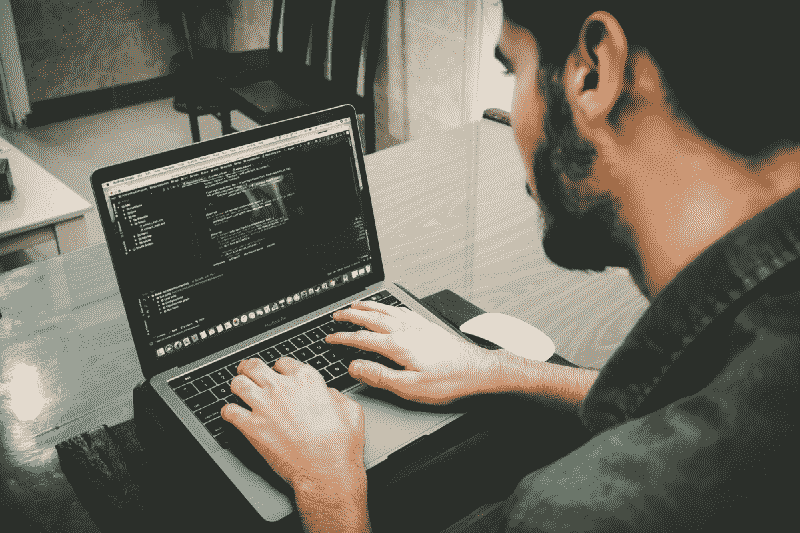

# 用#NewLangWeekends 探索每个周末的新境界！

> 原文：<https://www.freecodecamp.org/news/explore-a-new-realm-each-weekend-with-newlangweekends-cdd2eb2436ac/>

乔尔·V·扎卡里亚

# 用#NewLangWeekends 探索每个周末的新境界！

#### 你有兴趣尝试用一种新的语言编写代码吗？加入#NewLangWeekend 挑战赛！

Together, the travel is better experienced

在过去的 60 年里，编程世界已经呈指数级增长。从四十年代的 [Plankalkül](https://en.wikipedia.org/wiki/Plankalk%C3%BCl) 和[短码](https://en.wikipedia.org/wiki/Short_Code_(computer_language))到这十年的[雨燕](https://en.wikipedia.org/wiki/Swift_(programming_language))和[环](https://en.wikipedia.org/wiki/Ring_(programming_language))。焦点已经明显地从语法转移到所需的逻辑。虽然大多数语言都是为了改进现有系统而开发的，但每种语言都有其独特的功能和应用。

因此，很容易引发一场关于当今最佳编程语言的辩论。然而它归结为一个事实:

我们大多数人都是从帮助我们理解编程如何工作的简单语言开始的。我们逐渐转向以应用为中心的替代方案。( [SQL](https://en.wikipedia.org/wiki/SQL) 用于数据库管理/ [C#](https://en.wikipedia.org/wiki/C_Sharp_(programming_language)) 用于 VR 开发等)。选择真的很多，人们出于他们认为合理的原因有他们自己的口味。

> 但是我们大多数人求助于我们熟悉的一两种语言——为什么不呢？如果它完成了任务，目的就达到了。然而，我们中的一些人在内心深处一直有这样的想法:“事情会不会有所不同？”

如果我们探索我们所知甚少的东西会怎么样？如果我们穿越到一个新的领域，去理解其中的好处和细微差别，会怎么样？最重要的是，如果我们能够直观地理解编程语言的基本原理，会怎么样呢？

我向你介绍 **#NewLangWeekend** 挑战！

#### 这是什么？

当你从工作中得到时间的时候，花你的周末去探索一种你感兴趣的新的编程语言。在 Twitter 上用#NewLangWeekend 标签分享学习和经验。在很多方面类似于 [100DaysOfCode 挑战。](https://www.100daysofcode.com/)微小的区别是专注于在周末学习一门特别的编程语言。

#### 为什么有益？

当人们怀着一个共同的目标走到一起时，想法被分享，经验被吸取。我们发现我们的观点与其他人有多么不同，以及如何找到解决共同障碍的新方法。

然而，在我们忙碌的生活中，找到聚在一起讨论的人、时间和空间是一项挑战。即使是在网上，少数人在公共论坛上讨论也有点令人生畏。

所以#NewLangWeekend 旨在提供的解决方案是一个开放的渠道，让你可以在推特上发布你的学习成果，并看到其他人在学习什么。

#### 挑战的最终目标是什么？

保持你的一致性。学习新事物总是伴随着许多障碍。这可以消除初学者的疑虑，理解实现，并实际应用您的知识从头构建一些东西。

通过关注探索的动力，每个周末加入我们，投入到新的编程语言中。花 48 小时左右的时间了解基本知识。用这种语言画出一张追寻你的道路的路线图，并在 Twitter 上更新。

如果你愿意，你可以在接下来的几周里继续学习同样的内容。或者，如果你感到饱和，当你学习另一种语言时，换个角度看问题。追求的目的是探索尽可能多的选择，看看什么能让你继续前进。

Photo by [Danial RiCaRoS](https://unsplash.com/@ricaros?utm_source=medium&utm_medium=referral) on [Unsplash](https://unsplash.com?utm_source=medium&utm_medium=referral)

#### 我该如何开始？

1.  决定你想开始的语言
2.  每个周末，花些时间从你的资源中学习同样的东西
3.  用#NewLangWeekend 发同样的微博
4.  通过每个周末追求同样的目标，让自己对动态的在线社区负责。
5.  当你觉得是时候改变时，就开始下一个选择

> 注意:当我们探索各种选择时，请确保不要陷入*无所不能的问题。永远保持开放的心态，但要有一门语言的坚实基础(几乎)永远支持你。*

> 每年有 52 个周末——其中有多少会改变你？

想要一个起点吗？这个[播放列表](https://www.youtube.com/playlist?list=PLGLfVvz_LVvSX7fVd4OUFp_ODd86H0ZIY)可能会有所帮助。

所以，如果你是个游戏玩家，加入这场运动，看看一个驱动力和一个支持性的社区能给你带来什么！我们期待看到一个充满活力的社区崛起，一起学习。