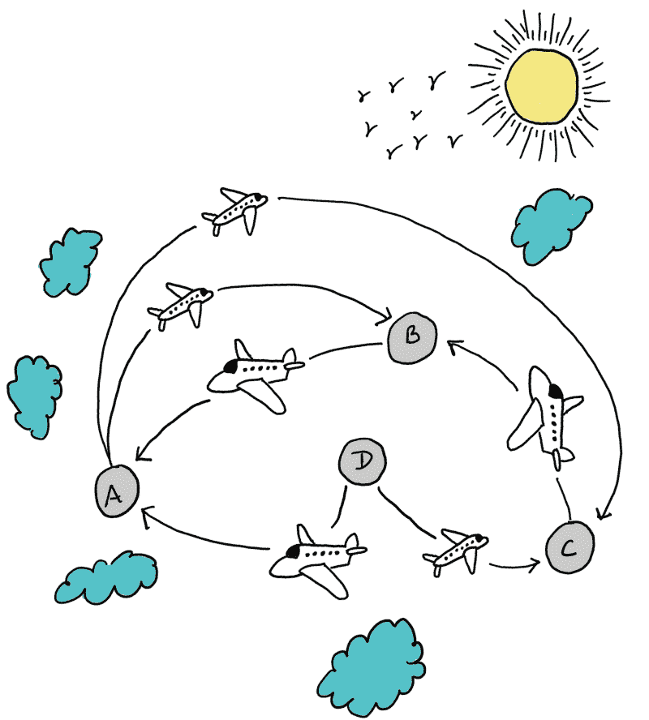
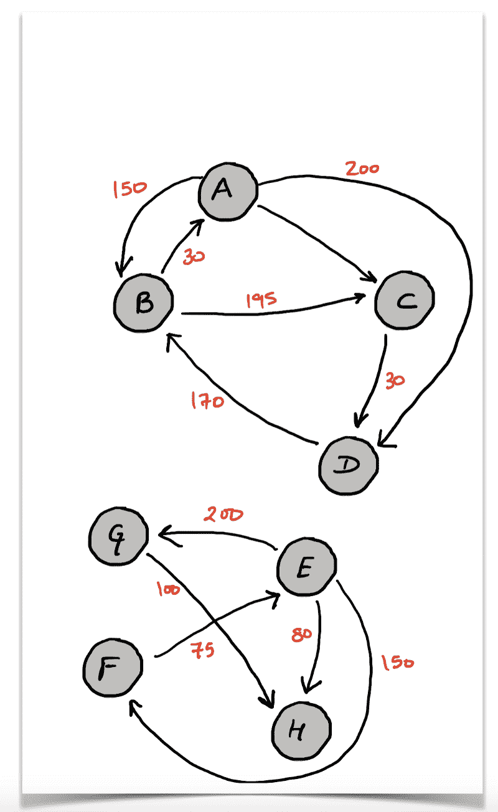
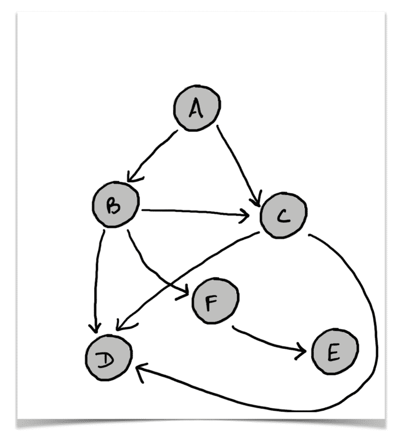
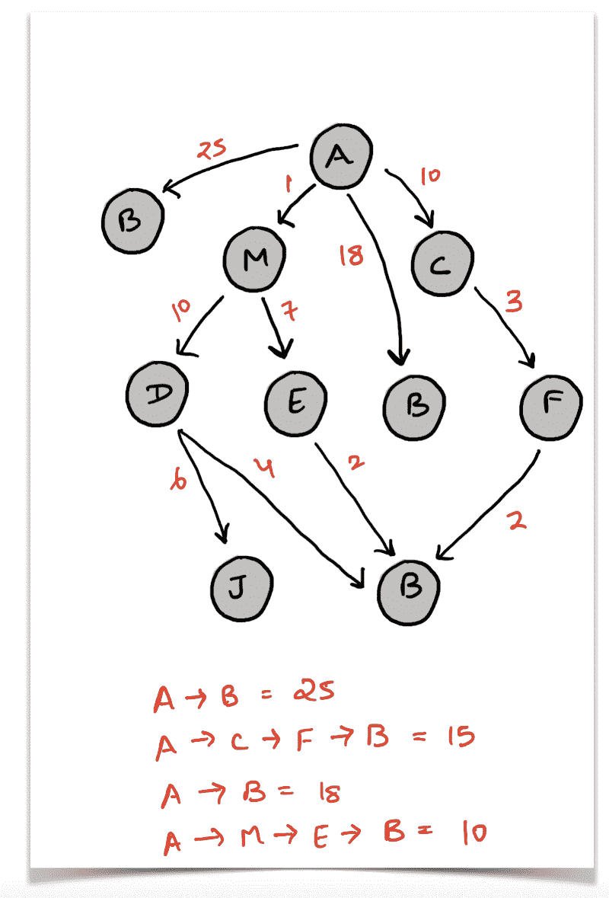
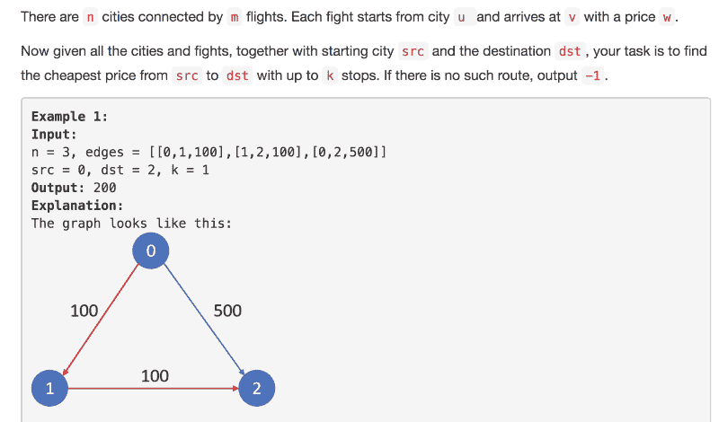

# 使用广度优先搜索寻找最短路径

> 原文：<https://www.freecodecamp.org/news/exploring-the-applications-and-limits-of-breadth-first-search-to-the-shortest-paths-in-a-weighted-1e7b28b3307/>

作者:Sachin Malhotra

# 使用广度优先搜索寻找最短路径



你知道 2017 年全球航空运输量吗？你知道在过去的几年里空中交通的增长率是多少吗？好吧，让我们来看一些统计数据。


Source: [https://www.statista.com/statistics/564769/airline-industry-number-of-flights/](https://www.statista.com/statistics/564769/airline-industry-number-of-flights/)

根据国际民用航空组织(ICAO)的数据，2017 年，航空业在定期航班上运送了创纪录的 41 亿乘客。2017 年，全球航班数量上升至 3700 万次。

全世界每天都有大量的乘客和航班占据着这片空域。由于全球有成千上万的这样的航班，从一个地方到另一个地方之间必然会有不同的路线和多次停留。

每个航班都有自己的始发地和目的地，以及与之相关的标准经济舱价格。我们不要考虑昂贵的商务舱机票和额外的腿部空间等等。

在这种情况下，如果我们想从一个地方到另一个地方，选择什么航班是最好的，这太混乱了。

让我们看看航班选项的数量 [StudentUniverse](https://www.studentuniverse.com/?noMoreRedirect=true) (为学生提供优惠？)给了我从洛杉矶到新德里。


Every flight has a Details hyperlink with it, so we searched for that and found 119 total flights.

总共提供 119 次航班。然后，网站上出现一个弹出窗口，说还有其他网站可能以更低的价格提供类似的航班。？

这么多的网站和数不清的航班只有一个来源和目的地。

作为一名开发人员，如果我想解决这个问题，我会构建一个系统来有效地处理以下查询:

*   从我的当前位置可到达的目的地总数(最多停留次数)，并列出这些目的地。当一个人想去旅行时，他应该保留自己的选择权？。
*   这是众所周知的事实(IMO？)与直飞相比，多站路线往往是更便宜的选择。因此，给定一个来源和一个目的地，我们可能希望找到至少有 2 或 3 个站点的路线。
*   最重要的是:从一个给定的源到一个给定的目的地，最便宜的路线是什么？
*   还有…我们最后会谈到这一点？。

正如您可能猜到的那样，前两个查询的输出可能会有数千个航班。但是我们当然可以通过提供一些其他标准来减少输出大小。就本文的范围而言，让我们关注这些原始查询本身。

### 将飞行网络建模为图形

从这篇文章的标题可以很清楚地看出，在某个地方会涉及到图形，不是吗？

将这个问题建模为一个图遍历问题极大地简化了它，使问题更容易处理。因此，作为第一步，让我们定义我们的图表。

我们将空中交通建模为:

*   径直的
*   可能是循环的
*   衡量过的
*   森林。 **G (V，E)**

**定向**因为每一次飞行都会有指定的出发地和目的地。这些承载了很多意义。

**循环**因为很有可能跟踪一批从给定位置出发并在同一位置结束的航班。

**加权**因为每趟航班都有相关的费用，对于本文来说就是经济舱机票。

最后，一个**森林**，因为我们可能有多个连接的组件。没有必要让世界上所有的城市之间都有某种形式的航班网络。所以，这个图可以是不连通的，因此是一个森林。

顶点 **V** 将是世界上任何有机场的地方。

这些边， **E** ，将代表构成空中交通的所有航班。一个缘自`u -->`；v 仅仅意味着你有一个从这个地点出发的直飞航班。



Sample flight network with the cost labelling for different flights.

既然我们已经知道了如何将航班网络建模为一个图，那么让我们继续并解决用户可能有的第一个常见查询。

### 可到达的目的地总数

谁不喜欢旅游？

作为一个喜欢探索不同地方的人，你可能想知道从你当地的机场可以到达哪些目的地。同样，这里会有额外的标准来减少这个查询的结果。但是为了简单起见，我们将简单地尝试找到从我们当地机场可以到达的所有位置。

现在我们有了一个定义良好的图，我们可以应用遍历算法来处理它。

从一个给定的点出发，我们可以使用[广度优先搜索](https://en.wikipedia.org/wiki/Breadth-first_search) (BFS)或[深度优先搜索](https://en.wikipedia.org/wiki/Depth-first_search) (DFS)来探索图形或在最大停车次数内从起始位置**可到达的位置。**因为这篇文章是关于广度优先搜索算法的，所以让我们看看如何使用著名的 BFS 来完成这项任务。

我们将以给定的位置作为起点来初始化 BFS 队列。然后，我们执行广度优先遍历，并继续下去，直到队列为空，或者直到用尽了最大数量的停靠点。

**注意:**如果你不熟悉广度优先搜索或深度优先搜索，我建议在继续之前浏览一下[这篇文章](https://medium.freecodecamp.org/deep-dive-into-graph-traversals-227a90c6a261)。

让我们看看初始化我们的图形数据结构的代码。我们还需要看看 BFS 算法最终将如何给出从给定源可到达的所有目的地。

既然我们对如何初始化图形有了一个很好的想法，让我们看看 BFS 算法的代码。

在洛杉矶表演会给我们带来以下可到达的目的地:

```
{'Chicago', 'France', 'Ireland', 'Italy', 'Japan', 'New Delhi', 'Norway'}
```

这很简单，不是吗？

在本文的后面，我们将研究如何将 BFS 限制到最大的停靠点数量。

如果我们有一个庞大的飞行网络，这是我们在生产场景中会有的，那么我们不会理想地想要从一个给定的起点探索所有可到达的目的地。

如果航班网络非常小或者仅适用于美国的几个地区，这就是一个用例。

但是，对于一个大型网络，更现实的用例是查找所有有多个停靠点的飞行路线。让我们更详细地看看这个问题，看看我们如何解决它。

### 多站路线

众所周知，对于给定的出发地和目的地，多站旅行往往比直达航班便宜。

很多时候，我们喜欢直飞航班，以避免中途停留。还因为多站航班确实需要很多时间，而我们没有。

然而，如果你没有任何截止日期，你想节省一些钱(并且对许多航空公司建议的多站路线感到满意)，那么你可能会从这样的事情中受益匪浅。

此外，你可能会经过一些世界上最美丽的地方，那里有一些你可以享受的最先进的机场。所以，这是足够的动力。

根据我们一直在讨论的图模型，给定一个源和一个目的地，我们需要为给定的源和目的地提供有 2 个或更多站点的路线。

作为最终用户，我们可能不希望在这个查询中看到这个顺序的航班:

```
[A, C, D, B], 2 stops, $X[A, E, D, C, F, W, G, T, B], 8 stops, $M[A, R, E, G, B], 3 stops, $K[A, Z, X, C, V, B, N, S, D, F, G, H, B, 11 stops, $P
```

我知道。没有哪个头脑正常的人会愿意选择一条有 11 个停靠站的航线。但我想说的是，最终用户会想要对称。也就是说，他们想先看到所有有 2 个停靠站的航班，然后是所有有 3 个停靠站的航班，依此类推，直到最多，比如说，5 个停靠站。

但是，所有中途停留次数相同的飞行路线应该一起显示。这是我们需要满足的要求。

让我们看看如何解决这个问题。因此，给定飞行网络图，一个来源`S`和一个目的地`D`，我们必须执行一个层级顺序遍历并报告从`S -->`出发的飞行路线；d .中间至少停 2 次，最多停 5 次。这意味着我们必须做一个层次顺序遍历，直到从开始的深度为 7。

看看解决这个问题的代码:

这可能不是大规模解决这个问题的最佳方式—最大的内存限制是由当前队列中的节点造成的。

由于每个节点或位置都可能有数千次飞往世界其他目的地的航班，如果我们像这样存储实际航班数据，队列可能会非常庞大。这只是为了演示广度优先搜索算法的一个用例。

现在，让我们只关注遍历，看看它是如何完成的。遍历算法很简单。然而，层次顺序遍历的整个空间复杂度来自于队列中的元素和每个元素的大小。

有多种方法来实现该算法。此外，在队列中的元素在任何给定时间消耗的最大内存方面，它们都有所不同。

我们希望看到队列在层次顺序遍历期间的任何时间点消耗的最大内存。在此之前，我们先构建一个价格随机的随机航班网络。

现在让我们看看层次顺序遍历的实现。

以上是层次顺序遍历算法最简单直接的实现。

对于我们添加到队列中的每个节点，我们还存储级别信息，并将一个元组`(node, level)`推入队列。因此，每次我们从队列中弹出一个元素时，我们都会将级别信息附加到节点本身。

对于我们的用例，级别信息意味着飞行路线中从源到这个位置的停留次数。

事实证明，就程序的内存消耗而言，我们可以做得更好。让我们看一个稍微好一点的方法来进行层次顺序遍历。

这里的想法是，我们不存储任何关于被推入队列的节点的额外信息。我们使用一个`None`对象来标记一个给定关卡的结束。我们不知道任何级别的大小，除了第一个级别，它只有我们的`source`节点。

因此，我们用`[source, None]`开始队列，并不断弹出元素。每次遇到一个`None`元素，我们就知道一个关卡结束了，新的一个又开始了。我们推动另一个`None`来标志这个新水平的结束。

这里考虑一个非常简单的图表，然后我们将在图表中运行它。



```
**************************************************** LEVEL 0 beginslevel = 0, queue = [A, None]level = 0, pop, A, push, B, C, queue = [None, B, C]pop None ******************************************* LEVEL 1 beginspush Nonelevel = 1, queue = [B, C, None]level = 1, pop, B, push, C, D, F, queue = [C, None, C, D, F]level = 1, pop, C, push, D, D (lol!), queue = [None, C, D, F, D, D]pop None ******************************************* LEVEL 2 beginspush Nonelevel = 2, queue = [C, D, F, D, D, None] .... and so on
```

我希望这很好地总结了算法。这当然是一个很好的技巧，可以遍历级别顺序，跟踪级别，并且不会遇到太多的内存问题。这无疑减少了代码的内存占用。

不要自满，认为这是一个很大的进步。

是的，但是你应该问两个问题:

1.  这是多大的进步？
2.  我们能做得更好吗？

我将从第二个问题开始回答这两个问题。答案是肯定的！

我们可以做得更好，完全不需要队列中的`None`。这种方法的动机来自于前一种方法本身。

如果你仔细观察上面的试运行，你会发现每次我们弹出一个`None`，一个关卡就完成了，另一个就准备好处理了。重要的是，在弹出一个`None`时，整个下一级存在于队列中。我们可以在遍历逻辑中利用这种考虑队列大小的思想。

下面是这个改进算法的伪代码:

```
queue = Queue()queue.push(S)level = 0while queue is not empty {      size = queue.size()      // size represents the number of elements in the current level      for i in 1..size {          element = queue.pop()          // Process element here          // Perform a series of queue.push() operations here
```

```
 level += 1
```

这是相同的代码。

伪代码是不言自明的。我们基本上消除了每个级别需要额外的`None`元素，而是利用队列的大小来改变级别。这也将导致对最后一种方法的改进，但是改进了多少呢？

看看下面的 Jupyter 笔记本，看看三种方法的内存区别。

*   我们通过考虑单个队列元素的总大小来跟踪任何时候队列的最大大小。
*   根据 Python 的文档，`sys.getsizeof`以字节为单位返回对象的指针或引用的大小。因此，通过从最初的层次顺序遍历方法切换到`None`方法，我们节省了将近 4.4Kb 的空间`(20224 — 15800 bytes)`。这只是这个随机例子节省的内存，我们只进行到遍历的第 5 层。
*   最终的方法仅比`None`方法提高了 16 个字节。这是因为我们去掉了 4 个`None`对象，它们被用来标记我们处理的 4 个级别(除了第一个级别)。在 32 位系统上，Python 中每个指针的大小(指向一个对象的指针)是 4 个字节。

既然我们已经有了从源到目的地的所有这些有趣的多路径路由和高效的等级顺序遍历算法来解决它，我们可以使用我们自己的 BFS 来解决一个更有利可图的问题。

从我的出发地到目的地最便宜的航班路线是什么？这是每个人都会立即感兴趣的事情。我是说谁不想省点钱呢？

### 从给定源到目的地的最短路径

问题陈述没有太多描述。我们只需要找到最短的路径，让最终用户满意。

在算法上，给定一个加权有向图，我们需要找到从源到目的地的最短路径。从算法的角度来看，最短或最便宜是一回事。

我们不会去描述这个问题的一个可能的 BFS 解决方案，因为这样的解决方案将是棘手的。让我们看看下面的图表来理解为什么会这样。



我们说，如果我们想在一个[无向、无权重的图](https://medium.freecodecamp.org/deep-dive-into-graph-traversals-227a90c6a261) ***中找到**最短路径**，可以使用 BFS 算法。BFS 的说法是，在遍历过程中第一次发现一个节点时，到源节点的距离会给我们提供最短的路径。***

对于一个带权的图来说，情况就不一样了。考虑上面的图表。假设我们要在图的无向图中找到从节点`A`到`B`的最短路径，那么最短路径将是 A 和 b 之间的直接链接。因此，最短路径的长度将是`1`，BFS 将正确地为我们找到它。

然而，我们在这里处理的是一个加权图。因此，在遍历**期间第一次发现节点并不能保证**是该节点的最短路径。例如，在上图中，最初会发现节点`B`，因为它是`A`的邻居，并且与该路径(在这种情况下是边)相关联的成本是`25`。但是，这不是最短的路。最短路径是`A --> M --> E` - > B o `f` 长度 10。

广度优先搜索无法知道某个节点的特定发现是否会给我们提供到该节点的最短路径。因此，BFS(或 DFS)在加权图中寻找最短路径的唯一可能的方法是搜索整个图，并保持记录从源到目的顶点的最小距离。

这种解决方案对于像我们的飞行网络这样可能具有成千上万个节点的巨大网络来说是不可行的。

我们不会详细讨论如何解决这个问题。这超出了本文的范围。

如果我告诉你 BFS 正好是在有轻微约束的加权图**中寻找最短路径的正确算法**会怎么样？

### 受限最短路径

由于飞行网络图非常庞大，我们知道完全探索它是不可能的。

从客户的角度考虑最短路径的问题。当您想要预订航班时，以下是您最理想的选择:

*   飞行时间不会太长。
*   应该在你的预算之内(非常重要)。
*   它可以有多个停靠点，但不超过`K`，其中`K`因人而异。
*   最后，我们有个人偏好，包括休息室使用权、食物质量、中途停留地点和平均腿部空间等。

这里要考虑的重点是上面的第三点:它可以有多个停靠点，但不要超过`K`，其中`K`可以因人而异。

客户想要最便宜的飞行路线，但是他们也不想在他们的出发地和目的地之间停留 20 次。客户可能会接受最多 3 次停留，或者在极端情况下甚至 4 次，但不会超过这个数。

我们希望有一个应用程序能够找出给定来源和目的地的最便宜的航班路线，最多有 K 站。



Source: Leetcode.com

LeetCode 的这个问题一直是我写这篇文章的主要动力。我强烈建议浏览一遍这个问题，不要只依赖上面的快照。

“为什么 BFS 会在这里工作？”有人可能会问。“这也是一个加权图，我们在上一节讨论的 BFS 失败的原因同样适用于此。”不要！

搜索将达到的级别数受问题中的值`K`或本节开头提供的描述的限制。因此，本质上，我们将试图找到最短的路径，但我们不必探索整个图。我们将上升到第一层`K`。

从现实生活场景来看，对于任何一个理智的旅行者来说,`K`的值都会低于 5？。

让我们看看算法的伪代码:

```
def bfs(source, destination, K):      min_cost = dictionary representing min cost under K stops for each node reachable from source. 
```

```
 set min_cost of source to be 0
```

```
 Q = queue()      Q.push(source)      stops = 0      while Q is not empty {
```

```
 size = Q.size           for i in range 1..size {                 element = Q.pop() 
```

```
 if element == destination then continue
```

```
 for neighbor in adjacency list of element {                        if stops == K and neighbor != destination        then continue 
```

```
 if min_cost of neighbor improves, update and add back to the queue.                }           }               stops ++       }
```

这也是层次顺序遍历，这里使用的方法是利用每一层的队列大小。让我们看一下解决这个问题的代码的注释版本。

本质上，我们跟踪每个节点到给定源的最小距离。源的最小距离最初将是 0，而所有其他源的最小距离将是+inf。

每当我们遇到一个节点，我们检查当前的最小路径长度是否可以改进。如果可以改进，这意味着我们已经找到了一条从源到这个顶点的替代路径，成本更低——一条到达这个顶点的更便宜的飞行路线。我们再次对这个顶点进行排队，以便从这个顶点可到达的位置和节点也被更新(可能更新，也可能不更新)。

关键是这个:

```
# No need to update the minimum cost if we have already exhausted our K stops. if stops == K and neighbor != dst:    continue
```

所以我们只是在代码中弹出了一个由`element`表示的节点，而`neighbor`既可以是目的地，也可以是一个随机的其他节点。如果我们已经用尽了我们的`K`站点，并且`element`是`Kth`站点，那么我们不应该处理和更新`neighbor`的最小距离(可能)。在这种情况下，这将违反我们的最大`K`止损条件。

事实证明，我最初使用动态编程解决了这个问题，在 LeetCode 平台上运行大约需要 165 毫秒。我用 BFS 运行，运行速度非常快，只需 45 毫秒。有足够的动力为你们写这篇文章。

我希望您能够从这篇关于广度优先搜索及其一些应用的文章中获益。主要的焦点是展示它在一些约束下的加权图中最短路径的应用？。