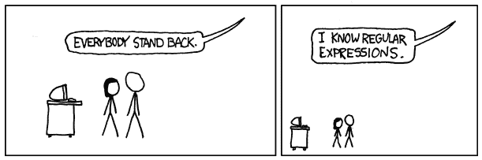
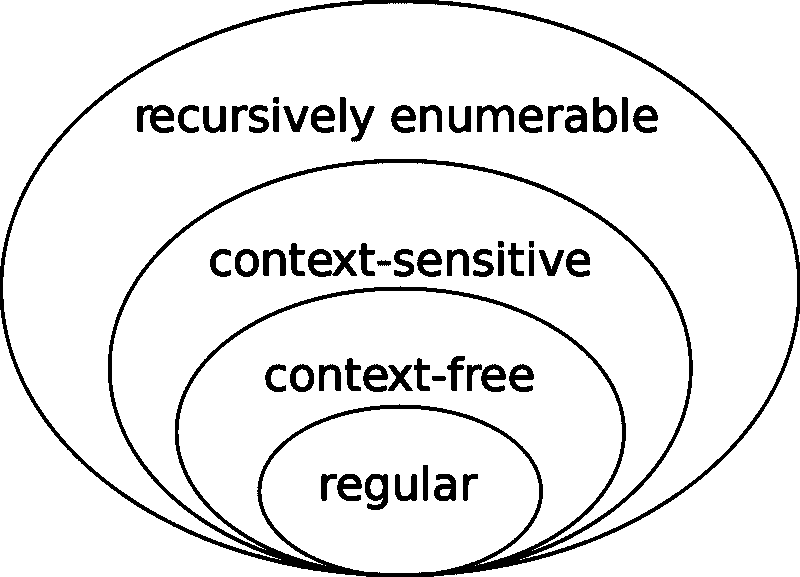

# 探索正则表达式背后的语言学

> 原文：<https://www.freecodecamp.org/news/exploring-the-linguistics-behind-regular-expressions-596fab41146/>

阿兰·卡夫卡

# 探索正则表达式背后的语言学

#### 语言上的突破是如何在代码中结束的

Image Credit: [xkcd](https://xkcd.com/)

正则表达式让新手和有经验的程序员都感到恐惧。当我第一次看到正则表达式(通常缩写为“regex”)时，我记得看到一连串的括号、星号、字母和数字时感到头晕目眩。正则表达式似乎是荒谬的，难以理解的。

我预计正则表达式会再次出现在我的高年级计算机科学课程中——也许到那时我终于准备好解决它们了——但是我在一门导论课上遇到了它们，我把它推迟到了高三。本课程的目的是通过向学生介绍密码学、人机交互、机器学习等概念，吸引从未编写过计算机科学代码的学生——你知道，这些都是最新、最棒的技术术语。

我参加的讲座不多，但其中一个作业让我印象深刻。我必须写一篇关于一位著名的计算机科学家或学者的论文，他的工作影响了计算机科学。我选择了诺姆·乔姆斯基。

我一点也不知道，学习乔姆斯基会把我拖进兔子洞回到正则表达式，然后神奇地将正则表达式转换成令我着迷的东西。正则表达式让我着迷的是支持它们的同音异义的语言概念。

我也希望用正则表达式背后的语言学来迷惑你，这是一个大多数程序员都不知道的背景故事。虽然我不会教您如何在任何特定的编程语言中使用正则表达式，但我希望我的语言学介绍能够启发您更深入地了解正则表达式在您选择的编程语言中是如何工作的。

首先，让我们回到乔姆斯基:他和正则表达式有什么关系？见鬼，他和计算机科学有什么关系？

### 一个偶然的计算机科学家

维基百科将[诺姆·乔姆斯基](https://en.wikipedia.org/wiki/Noam_Chomsky)命名为语言学家、哲学家、认知科学家、历史学家、社会评论家和政治活动家，但*不是*计算机科学家。因为他在所有这些领域都备受推崇，所以他对计算机科学领域的间接贡献常常半途而废。

我对乔姆斯基的学术工作研究得越多，乔姆斯基涉足计算机领域似乎就越偶然。这坚定了我的信念，所有领域——即使是那些看起来与计算机科学完全不同的领域——都可以为计算机和技术产业做出贡献。

他对语言学领域的贡献尤其体现了跨学科研究对计算机科学的影响。乔姆斯基层次结构改变了计算机科学家、软件工程师和业余爱好者今天编写的代码。

是的，正是这种层次结构给计算机科学带来了正则表达式。但是，在我们理解从乔姆斯基到正则表达式的跳跃之前，我将概述一下乔姆斯基的层次结构。

### 语言法律与秩序

[**乔姆斯基层级**](https://en.wikipedia.org/wiki/Chomsky_hierarchy) 是 [**形式语法**](https://en.wikipedia.org/wiki/Formal_grammar)——想想 [**形式语言**](http://interactivepython.org/courselib/static/thinkcspy/GeneralIntro/FormalandNaturalLanguages.html) 的句法规则——使得每个语法作为层级中它上面的语法的[真子集](http://mathworld.wolfram.com/ProperSubset.html)而存在。一些形式语言比其他语言有更严格的语法，所以乔姆斯基试图将形式语法组织到他的同名层次结构中。

我简单地提到了形式语法是句法规则:为给定的形式语言给出所有可能的有效短语的规则。语法提供了构建语言的规则。用语言学家的话说，一种语言的形式语法提供了一个框架，通过这个框架可以将**非终结符**(输入或中间字符串值)转换成**终结符**(输出字符串值)。

为了阐明这个新词汇，我将通过一个例子，使用一个虚构的形式语法将一组非终结符转换成终结符。假设我们的假装形式语言 [Parseltongue](http://harrypotter.wikia.com/wiki/Parseltongue) ，具有以下形式语法:

*   端子:{s，sh，ss}
*   非终结符:{snake，I，am}
*   产生式规则:{I → sh，am → s，snake → ss}

使用产生式规则，我可以将输入句子“我是蛇”转换成“sh s ss”这种转换是一点一点发生的:“我是蛇”→“sh am 蛇”→“sh s 蛇”→“sh s ss。”

正如我的 Parseltongue 示例所示，形式语法将非终结符字符串解析为只有终结符的字符串——语法上正确的短语。但是形式语法不仅作为一种语言的生成器，还作为一个字符串是否符合形式语法的 T2 识别器。尽管示例字符串“我是一条蛇”可以完全转换为终结符，但字符串“我不是一条蛇”不能用 Parseltongue 编写，因为非终结符“not”不能转换为 Parseltongue 终结符。

再次强调我之前说过的:形式语法产生形式语言。这意味着，通过创建形式语法的层次结构，乔姆斯基也对语言本身进行了分类。

有了这个发人深省的介绍，让我们看看乔姆斯基的层次结构中的四种形式语法。从最严格到最不严格，它们是:

*   **常规语法**，从输入字符串到输出字符串不保留过去的状态知识
*   **上下文无关文法**，其仅保留从输入字符串到输出字符串的最近状态知识
*   **上下文敏感语法**，它保存从输入字符串到输出字符串的所有过去的状态知识
*   **无限制的**(或**递归可枚举的** ) **文法**，它们拥有所有的状态知识，因此可以从给定的输入字符串创建任何可以想象的输出字符串

我所说的“国家知识”是什么？根据[范围](https://en.wikipedia.org/wiki/Scope_(computer_science))来思考知识。例如，在将输入字符串转换为输出字符串的过程中，常规语法不知道字符串在其“作用域”内的过去状态。这表明，一旦语法将非终结符单独转换为终结符(加上一系列零个或更多的非终结符)，语法就会“忘记”字符串以前的状态。

另一方面，不受限制的语法抓住了翻译中的字符串的每一种可能的状态。上下文无关和上下文相关的语法介于两者之间。

如果你正在寻找乔姆斯基层次结构中语法的更详细的解释，你将不得不看一眼[自动机理论](https://en.wikipedia.org/wiki/Automata_theory)。我将把重点放在将我们带回正则表达式的语法上，恰当地称为正则语法。

### 关于正则表达式

正则表达式和正则语法是等价的。尽管使用不同的形式，但它们传达相同的语法规则，并且都产生相同的正则语言。

在语言学中，**正则表达式**递归定义如下:

*   空集是一个正则表达式。
*   空字符串是正则表达式。
*   对于输入字母表中的任何字符 x，x 是产生正则语言{x}的正则表达式。
*   **交替**:如果 x 和 y 是正则表达式，那么 x | y 是正则表达式。比如正则表达式`0|1`产生正则语言`{0,1}`。
*   **串联**:如果 x 和 y 是正则表达式，那么 xy 就是正则表达式。比如正则表达式`0•1`产生正则语言`{01}`。
*   **重复**(又称**克林星**):如果 x 和 y 是正则表达式，那么 x*就是正则表达式。例如，正则语言`0•1*`无限地产生正则语言`{0, 01, 011, 0111, ...}`。

正规语法是由类似于蛇佬腔的规则组成的。正如正则语法可以用来将输入字符串解析为输出字符串一样，正则表达式也可以非常类似地转换字符串。您可以看到正则表达式采用的交替、连接和重复操作(或者用我之前的比喻，规则)的解析示例。

让我们暂时回到我们的朋友诺姆·乔姆斯基身上。根据他的语法层次结构，正则语法不保留关于从输入字符串转换到输出字符串的中间步骤的信息。关于正则表达式，这告诉了我们什么？

正则语法的“遗忘”意味着字符串中一部分的翻译不会影响字符串中其他非终结符在后续步骤中的翻译。在创建输出字符串时，字符串的不同部分之间没有协调。

观察正则语法背后的语言学可以让我们理解为什么程序员首先在代码中引入正则表达式。虽然我只讨论了作为语言的生成器和识别器的形式语法，但是正则语法将输入字符串一部分一部分地转换成输出字符串的事实使它们成为*模式匹配器*。在编程中，正则表达式使用产生式规则将输入字符串(一种模式)转换为正则语言(一组匹配该模式的字符串)。

但是，如果编程语言的创造者们完全按照语言学领域的定义来实现正则表达式，我就不会写这篇博客了。计算正则表达式与其语言前身相去甚远，但是我所介绍的语言正则表达式为理解代码中的正则表达式提供了一个有用的框架。

### 两个正则表达式，两者都有相同的尊严

此后，我将使用术语**正则表达式**来表示一个*语言的*正则表达式，使用术语**正则表达式**来表示一个*程序的*正则表达式。在野外，语言正则表达式和编程正则表达式都被称为“正则表达式”,尽管它们彼此完全不同——多么令人困惑！

正则表达式和正则表达式的区别源于它们的使用方式。正则表达式——或正则语法——是[形式语言*理论*](https://en.wikipedia.org/wiki/Formal_language) 的一部分，其存在是为了*描述**自然语言**的*共享元素——这些语言是在没有人类预谋的情况下随着时间的推移而进化的。语言学家将正则表达式用于理论目的，比如乔姆斯基层次结构中形式语法的分类。正则表达式帮助语言学家理解人类所说的语言。

另一方面，正则表达式被日常的程序员使用，他们想用 T2 搜索与给定模式匹配的字符串。正则表达式是理论上的，而正则表达式是实用的。编程语言是**正式语言**:人们(这里指程序员)为特定目的设计的语言。正如您所想象的，编程语言的创造者在代码中增加了正则表达式的功能。让我们来看看这些增强。

记住正则表达式有三个操作:交替、连接和重复。我不是正则表达式专家——正则专家？—但是只要看一眼维基百科页面上的[正则表达式，就会发现正则表达式实现的不仅仅是三个操作。](https://en.wikipedia.org/wiki/Regular_expression)

例如，使用 [POSIX regex 语法](https://www.regular-expressions.info/posix.html)，模式`.ork`匹配所有以三个字符“ork”结尾的四字符字符串那个句号比简单的交替，串联，重复更有力量，对吧？

没有。说实话，即使是最奇特的正则表达式 [**元字符**](https://en.wikipedia.org/wiki/Metacharacter)——调用正则表达式操作的字符——也是从正则表达式操作中派生出来的。假设字母表中的 26 个小写字母是正则语法中唯一的字符，正则表达式模式`.ork`可以只使用正则表达式操作写成`[a|b|c|...|z]ork`。

尽管大量元字符表明 regex 拥有比正则表达式本身更强大的操作集，但元字符只是定义正则表达式的各种操作排列的快捷方式。正则表达式元字符为交替、连接和重复的常见组合提供了程序员友好的抽象。

到目前为止，我已经把正则表达式描绘成具有惊人快捷方式和清晰用例的正则表达式。然而，你可能还记得乔姆斯基的层次结构，正则语法有最严格的规则，没有范围。幸运的是，正则表达式比它们的语言前身有更多的回旋余地，从而赋予它们更多的实际权力。

### 打破常规的语法规则

回想一下，根据 Chomsky 的层次结构，正则语法在将输入字符串转换为输出字符串的过程中没有保留任何知识。由于正则表达式等同于正则语法，这意味着正则表达式也不会记住字符串从输入变为输出时的中间状态。这也意味着翻译正则表达式中一部分的非终结符与翻译表达式中另一部分的非终结符没有关系。

对于正则表达式，情况就不同了。正则表达式支持反向引用的能力，违反了这个关键的正则语法特征。**反向引用**允许程序员用括号分隔正则表达式的一个子部分，并使用元字符引用它。举个例子，模式`(la)\1`通过使用`\1`元字符重复搜索“la”来匹配“lala”

因为字符串的不同部分在正则表达式中不能相互影响，反向引用赋予正则表达式比其前身更大的能力。更重要的是，反向引用有助于正则表达式的实际应用，比如搜索同一个单词在一行中意外键入两次的错别字。实用主义让我们深入了解为什么在编程中调整正则表达式来创建正则表达式。

增加 regex 功能的另一个特性是改变匹配贪婪性的能力。不同的**量词**——正则表达式模式的类别——可能看起来相似，但匹配字符串中完全不同的部分。一个**贪婪的量词** (*)会尝试匹配尽可能多的字符串，而一个**不情愿的量词**(？)将尝试匹配字符串中最小数量的字符。给定字符串“abcorgi”，模式`.*corgi`将匹配整个字符串，但是模式`.?corgi`将只匹配“bcorgi”

一个**所有格量词** (+)也试图匹配尽可能多的字符串，但是，与贪婪量词不同，它不会回溯到字符串中之前的字符，以找到最大可能的匹配。给定字符串“abcorgi”，模式`.*corgi`和`.+corgi`将匹配整个字符串。尽管所有格限定词和贪婪限定词通常会产生相同的结果，但所有格限定词往往更有效，因为它们避免了回溯。

因为量词是元字符，所以从技术上讲，它们可以通过交替、连接和重复来构建:这是正则表达式的三种操作。然而，量词创建了一个简单的抽象，允许程序员快速指定他们想要的匹配类型。

### 结论和进一步阅读

我们经历了多么漫长的旅程啊！我们学习了乔姆斯基和他的同名层次，然后深入到常规语法。从正则语法中，我们探索了正则表达式的语言学定义。最后，我们利用正则表达式和正则表达式之间的差异来激励程序员如何使用正则表达式。

虽然我追溯了从乔姆斯基到现代编程语言的正则表达式的历史，但这篇博文并不是正则表达式故事的终结。如果你想了解更多关于语言和计算正则表达式的知识，我有一些激励性的问题要问你。

*   什么是自动机理论，它与乔姆斯基层次结构有什么关系？
*   正则表达式是如何实现的？各种正则表达式算法的权衡是什么？
*   什么时候适合使用正则表达式而不是内置的字符串匹配和操作库？

我也有一个资源列表，用来研究正则表达式的语言和计算元素。快乐正则表达式！

*   [正则表达式信息](https://www.regular-expressions.info/)
*   [维基百科:正则表达式](https://en.wikipedia.org/wiki/Regular_expression)
*   StackOverflow:简明英语中的乔姆斯基层次结构
*   [*《自动机理论、语言和计算简介》*](https://www.amazon.com/Introduction-Automata-Theory-Languages-Computation/dp/0321455363)hop croft 等人著。
*   [StackOverflow:自动机中正则表达式和语法的区别](https://cs.stackexchange.com/questions/45755/difference-between-regular-expression-and-grammar-in-automata)
*   如何像计算机科学家一样思考:形式语言和自然语言
*   [甲骨文的 Java 教程:量词](https://docs.oracle.com/javase/tutorial/essential/regex/quant.html)
*   [StackOverflow:将编程语言中的正则表达式与自动机/形式语言中的正则表达式进行比较](https://cs.stackexchange.com/questions/53397/compare-regex-in-programming-languages-with-regular-expression-from-automata-for?rq=1)
*   Quora:正则表达式是如何实现的？

享受你所阅读的内容？通过喜欢和分享这篇文章来传播爱。有想法或问题吗？请在推特或下面的评论中联系我。感谢迈尔斯·辛森校对这篇文章！