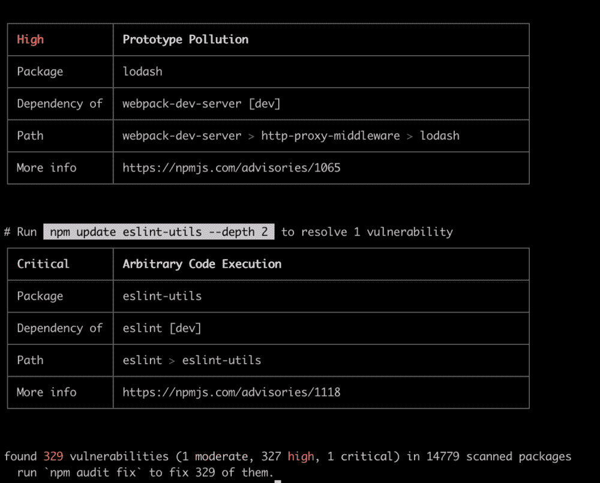

# Express.js 安全提示:如何保存和保护您的应用程序

> 原文：<https://www.freecodecamp.org/news/express-js-security-tips/>

# 采取 7 个步骤来确保你的应用程序是不可战胜的

你的手机锁了吗？你有个人识别码、密码、指纹或 FaceID 吗？我 99%肯定你知道。原因很明显——你关心自己的安全。如今，保护手机就像早上刷牙一样重要。

对于勤奋和细心的软件开发人员来说，保护他们的应用程序安全与保护他们的手机同样重要。如果你是一个开发者，你选择忽视它——请重新考虑你的方法。如果您是项目所有者，而您的开发团队认为数据安全可以等等，请重新考虑您的团队。

在这篇文章中，我想谈谈如何确保您的 [Express.js](https://keenethics.com/tech-back-end-express) 项目是安全的，并且不会受到恶意攻击。

为了保证数据安全，需要采取 7 种简单和不太简单的措施:

1.  **使用 Express.js 的可靠版本**
2.  **保护连接和数据**
3.  **保护你的饼干**
4.  **保护您的依赖关系**
5.  **验证用户的输入**
6.  **保护您的系统免受暴力攻击**
7.  **控制用户访问**

让我们仔细看看每一个。

## **1。使用可靠版本的 Express.js**

不推荐使用或过期的 Express.js 版本是不行的。不再支持 Express 的第二版和第三版。在这些中，安全或性能问题不再是固定的。

作为开发者，你绝对要[迁移到 Express 4](https://expressjs.com/en/guide/migrating-4.html) 。这个版本是一场革命！它在路由系统、中间件和其他次要方面有很大不同。

## **2。保护连接和数据**

为了保护 HTTP 头，您可以使用[helmet . js](https://helmetjs.github.io/)——一个有用的 Node.js 模块。它是 13 个用于设置 HTTP 响应头的中间件函数的集合。具体来说，有用于设置内容安全策略、处理证书透明性、防止点击劫持、禁用客户端缓存或添加一些小 XSS 保护的功能。

```
npm install helmet --save
```

即使你不想使用头盔的所有功能，你必须做的绝对最低限度是禁用 X-Powered-By 标题:

```
app.disable('x-powered-by')
```

该报头可用于检测应用程序是否由 Express 支持，这使得黑客可以进行精确的攻击。当然，X-Powered-By 头不是识别快速运行应用程序的唯一方法，但它可能是最常见和最简单的方法。

为了保护您的系统免受 HTTP 参数污染攻击，您可以使用[](https://www.npmjs.com/package/hpp)。这个中间件将 req.query 和 req.body 这样的参数放在一边，而是选择最新的参数值。安装命令如下所示:

```
`npm install hpp --save` 
```

要加密从客户端发送到服务器的数据，请使用传输层安全性(TLS)。TLS 是一种用于保护计算机网络安全的加密协议，是安全套接字层(SSL)加密的后代。TLS 可以用[Nginx](https://www.nginx.com/)——一个免费但有效的 HTTP 服务器——和 [让我们加密](https://letsencrypt.org/about/)——一个免费的 TLS 证书。

## **3。保护您的 cookie**

在 Express.js 4 中，有两个 cookie 会话模块:

*   express-session(在 Express.js 3 中是 express.session)
*   cookie-session(在 Express.js 3 中，它是 express.cookieSession)

快速会话模块将会话 ID 存储在 cookie 中，将会话数据存储在服务器上。cookie 会话将所有会话数据存储到 cookie 中。

一般来说，cookie-session 效率更高。但是，如果您需要存储的会话数据很复杂，并且每个 cookie 可能超过 4096 字节，请使用 express-session。使用 express-session 的另一个原因是您需要保持 cookie 数据对客户端不可见。

此外，您应该设置 cookie 安全选项，即:

*   安全的
*   httpOnly
*   领域
*   小路
*   期满

如果“安全”设置为“真”，浏览器将只通过 HTTPS 发送 cookies。如果“httpOnly”设置为“the cookie 将不会通过客户端 JS 发送，而是通过 HTTP(S)发送。“域”的值表示 cookie 的域。如果 cookie 域与服务器域匹配，则“path”用于指示 cookie 路径。如果 cookie 路径与请求路径匹配，cookie 将在请求中发送。最后，顾名思义,“expires”的值代表 cookies 将过期的时间。

另一个重要的建议是不要使用默认的会话 cookie 名称。它可以让黑客检测到服务器并进行有针对性的攻击。相反，使用通用的 cookie 名称。

## **4。保护您的依赖关系**

毫无疑问，npm 是一个强大的 web 开发工具。但是，为了确保最高级别的安全性，可以考虑只使用它的第 6 个版本—[NPM @ 6](https://www.npmjs.com/package/npm/v/6.0.1)。老一点的可能包含一些严重的依赖安全漏洞，会危及你整个 app。此外，要分析依赖关系树，请使用以下命令:

```
`npm audit`
```

npm 审计有助于解决项目中的实际问题。它检查 dependencies、devDependencies、bundledDependencies 和 optionalDependencies 中的所有依赖项，但不检查 peerDependencies。 [在这里](https://www.npmjs.com/advisories) 你可以阅读任何 npm 包中所有当前的漏洞。



另一个保证依赖安全的工具是 [Snyk](https://snyk.io/) 。Snyk 运行应用程序检查，以确定它是否包含 Snyk 的开源数据库中列出的任何漏洞。要进行检查，运行三个简单的步骤。

### 第一步。安装 Snyk

```
`npm install -g snyk
cd your-app`
```

### 第二步。进行测试

```
`snyk test`
```

### 第三步。了解如何解决该问题

```
`snyk wizard`
```

Wizard 是一种 Snyk 方法，它解释了依赖关系漏洞的本质并提供了修复方法。

## **5。验证用户的输入**

控制用户输入对于服务器端开发来说是极其重要的一部分。这是一个不亚于未授权请求的重要问题，将在本文的第七部分进行描述。

首先，当一些值未定义并且您没有针对特定端点的错误处理时，错误的用户输入可能会破坏您的服务器。然而，当您试图在数据库中设置未定义的、空的或其他数据类型时，不同的 ORM 系统可能会有不可预测的行为。

例如，loopback . js ORM(node . js framework)中的 destroyAll 方法可以销毁数据库的一个表中的所有数据:当它与任何记录都不匹配时，它会删除所有内容，如这里的[所述](https://www.npmjs.com/package/npm/v/6.0.1)。想象一下，您可能会因为忽略了输入验证而丢失生产表中的所有数据。

### 使用中间检验的主体/对象验证

首先，您可以使用中间检验的主体/对象验证。例如，我们使用 ajv 验证器，它是 Node.js 最快的 JSON 模式验证器。

```
`const Ajv = require('ajv'); 
const ajv = new Ajv({allErrors: true}); 
const speaker = { 
  'type': 'object', 
  'required': [
    'id', 
    'name'
  ],
  'properties': { 
    'id': {
      'type': 'integer', 
    }, 
    'name': { 
      'type': 'string',
    }, 
  }, 
};
const conversation = { 
  type: 'object', 
  required: [
    'duration', 
    'monologues'
  ], 
  properties: { 
    duration: { 
      type: 'integer',
    }, 
    monologues: { 
      type: 'array', 
      items: monolog, 
    }, 
  }, 
};
const body = { 
  type: 'object', 
  required: [
    'speakers', 
    'conversations'
  ], 
  properties: { 
    speakers: { 
      type: 'array', 
      items: speaker, 
    }, 
    conversations: { 
      type: 'array', 
      items: conversation, 
    }, 
  }, 
}; 
const validate = ajv.compile(body); 
const isValidTranscriptBody = transcriptBody => { 
  const isValid = validate(transcriptBody);
  if (!isValid) { 
    console.error(validate.errors); 
  } 
  return isValid; 
};`
```

### 处理错误

现在，假设你忘记检查某个对象，你用未定义的属性做了一些操作。或者你使用一个特定的库，你得到一个错误。它会破坏您的实例，服务器也会崩溃。然后，攻击者可以 ping 存在此漏洞的特定端点，并可以长时间停止您的服务器。

进行错误处理的最简单方法是使用 try-catch 构造:

```
`try { 
  const data = body;
  if (data.length === 0) throw new Error('Client Error'); 
  const beacons = await  this.beaconLogService.filterBeacon(data); 
  if (beacons.length > 0) { 
    const max = beacons.reduce((prev, current) => (prev.rssi > current.rssi) ? prev : current); 
    await this.beaconLogService.save({ 
      ...max,
      userId: headers['x-uuid'] 
    }); 
    return { 
      data: { 
        status: 'Saved', 
        position: max 
      }, 
    }; 
  } 
  return { 
    data: { 
      status: 'Not valid object, 
    }, 
  }; 
} 
catch(err) { 
  this.logger.error(err.message, err.stack); 
  throw new HttpException('Server Error',     HttpStatus.INTERNAL_SERVER_ERROR); 
}`
```

随意使用一个新的错误(' message ')构造函数来处理错误，甚至可以为自己的目的扩展这个类！

### Use JOI

这里的主要教训是，您应该始终验证用户输入，这样您就不会成为中间人攻击的受害者。另一种方法是借助[@ hapi/joi](https://www.npmjs.com/package/@hapi/joi)——hapi 生态系统的一部分，以及强大的 JS 数据验证库。

这里注意模块 [joi](https://www.npmjs.com/package/joi) 已经弃用。因此，以下命令不适用:

```
`npm install joi`
```

相反，使用这个:

```
`npm install @hapi/joi`
```

### 使用快速验证器

验证用户输入的另一种方法是使用 express-validator——一组 express.js 中间件，包括 validator.js 和 function sanitizer。要安装它，请运行以下命令:

```
`npm install --save express-validator `
```

### 净化用户输入

此外，要采取的一个重要措施是净化用户输入，以保护系统免受 MongoDB 操作符注入的影响。为此，您应该安装并使用 express-mongo-sanitize:

```
`npm install express-mongo-sanitize`
```

### 保护您的应用免受 CSRF 病毒的侵害

此外，你应该保护你的应用程序免受跨站点请求伪造(CSRF)。CSRF 是指可信用户发送未经授权的命令。你可以借助 [csurf](https://www.npmjs.com/package/csurf) 来做到这一点。在此之前，您需要确保 cookies 的会话中间件已经按照本文前面的描述进行了配置。要安装此 Node.js 模块，请运行以下命令:

```
`npm install csurf` 
```

## **6。保护您的系统免受暴力攻击**

暴力攻击是访问网站或服务器最简单也是最常见的方式。黑客(在大多数情况下是自动的，很少是手动的)反复尝试不同的用户名和密码来闯入系统。

这些攻击可以借助 [限速器-灵活](https://github.com/animir/node-rate-limiter-flexible) 包来防止。这个包快速、灵活，适用于任何节点框架。

要安装，请运行以下命令:

```
`npm i --save rate-limiter-flexible
yarn add rate-limiter-flexible`
```

这个方法有一个更简单但更原始的替代方案: [快速限速](https://www.npmjs.com/package/express-rate-limit) 。它唯一做的事情是限制对公共 API 或密码重置的重复请求。

```
`npm install --save express-rate-limit`
```

## **7。控制用户访问**

在身份验证方法中，有令牌、Auth0 和 JTW。下面重点说说第三个！JTW (JSON Web 令牌)用于在客户端-服务器应用程序中传输身份验证数据。令牌由服务器创建，用密钥签名，然后传输到客户端。然后，客户端使用这些令牌来确认身份。

[Express-jwt-permissions](https://www.npmjs.com/package/express-jwt-permissions)是与 [express-jwt](https://github.com/auth0/express-jwt) 配合使用的工具，用于检查某个令牌的权限。这些权限是令牌内的字符串数组:

```
`"permissions": [
  "status",
  "user:read",
  "user:write"
]`
```

要安装该工具，请运行以下命令:

```
`npm install express-jwt-permissions --save`
```

## **总结**

在这里，我列出了基本的 Express.js 安全最佳实践和一些可以使用的工具。

### **回顾一下:**


我强烈建议您确保您的应用程序能够抵御恶意攻击。否则，您的企业和用户可能会遭受重大损失。

## 你对 Express.js 项目有想法吗？

我的公司 KeenEthics 在 [express js 开发](https://keenethics.com/tech-back-end-express)方面经验丰富。如果您需要类似项目的免费评估，请随时与**联系。**

如果你喜欢这篇文章，你肯定应该继续写一篇关于外包给乌克兰的数据安全的文章: [KeenEthics Team on Guard:你的数据在乌克兰是安全的](https://keenethics.com/blog/1543388400000-your-data-is-safe-in-ukraine?utm_source=freecodecamp&utm_medium=freecodecamp&utm_campaign=freecodecamp)。在 KeenEthics 博客上发布的原文可以在这里找到:[快递 js 安全提示](https://keenethics.com/blog/express-js-security-tips)。

## 附言

非常感谢全栈软件开发人员@KeenEthics 帮助我完成这篇文章。

KeenEthics 博客上发布的文章原文可以在这里找到: [Express.js 安全提示:保存你的 App！](https://keenethics.com/blog/express-js-security-tips)