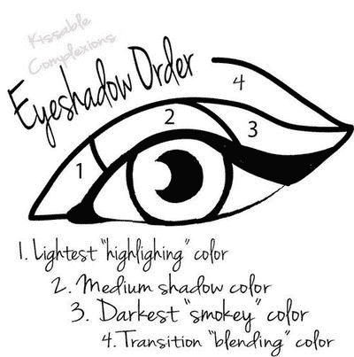
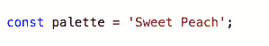
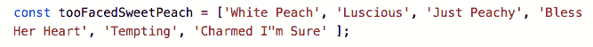
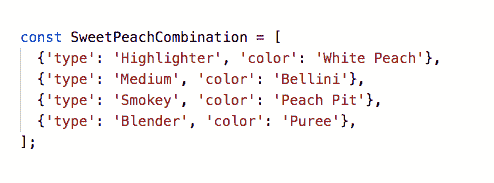
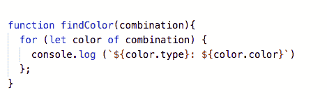
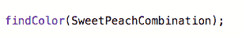
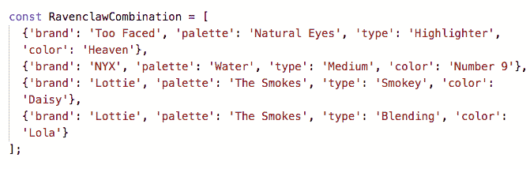
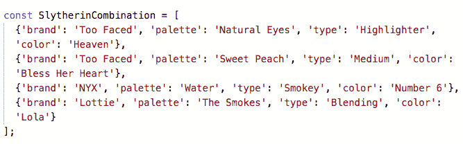
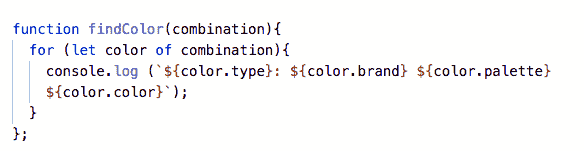
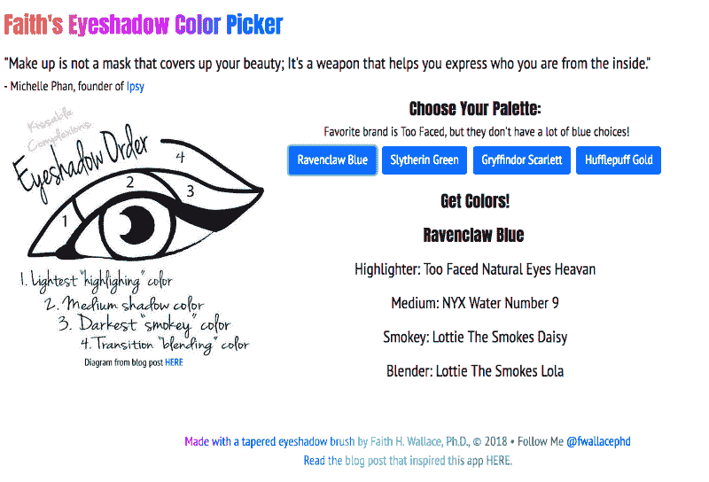

# 关于编码，眼影的选择和使用能教会我们什么

> 原文：<https://www.freecodecamp.org/news/eyeshadow-932b6cd5cfee/>

由代码女孩

# 关于编码，眼影的选择和使用能教会我们什么

Photo by [freestocks.org](https://unsplash.com/photos/jVSbAFJBVsg?utm_source=unsplash&utm_medium=referral&utm_content=creditCopyText) on [Unsplash](https://unsplash.com/search/photos/eyeshadow?utm_source=unsplash&utm_medium=referral&utm_content=creditCopyText)

我喜欢眼影。我有超过 40 个眼影调色板(一个调色板是一个容器，里面有任意数量的单独眼影颜色)，我不认为我的痴迷降低了我作为技术进步女性的地位。我因我闪亮的蓝色而闻名，蓝色代表我对《哈利·波特》中拉文克劳学院的无限热爱。

然而，令人悲伤的事实是，我在选择和涂抹眼影方面很糟糕，这可能与以下事实有关:

1.  我有太多的颜色可供选择，而且
2.  我需要摘下眼镜来做这件事。

然而，这并没有阻止我获取更多影子期权的贪得无厌的需求。上周，我离开了我信任的化妆品店——花了 100 多美元购买产品，包括一个新的眼影调色板(这些都不是我需要的)——我想，“要是选择和涂抹眼影像写一个函数一样简单就好了。”

这就是本文的由来。使用代码解决实际问题是技术领域的一个标志，但这需要实践。下面是我尝试用一个**自言自语**来解决我的眼影问题。

对于我们这些没有教育背景的人来说，**自言自语**是一种让看不见的思维过程变得可见的方法。我们在阅读教学中经常使用这种方法。

### **功能基础和我的眼影套路**

理解函数是编程的必经之路。当你第一次开始你的旅程时，你无数次地写出每一行代码。输入函数。功能只不过是一个过程，一组完成任务的步骤。

通常，函数会获取一些输入数据，对这些数据执行所需的过程，并返回任何结果数据。让函数在代码中如此通用的原因是，您可以用不同的输入反复调用该函数或一组步骤，从而得到不同的输出。

涂上眼影就像按照一套步骤。下图说明了我每天选择和涂抹眼影的步骤(功能)。

This image was part of a blog post on BellaBox [HERE](https://bellabox.com.au/beautyguide/9-Awesome-Eyeshadow-Hacks)

让我们从编程的角度来考虑这个问题，我们有一个输入、一组步骤和一个输出:

*   **输入**:我需要输入一个眼影调色板。让我们说一下[的“甜桃”调色盘。](https://www.toofaced.com/)
*   **函数**:我的函数需要过滤所有的颜色(总共 18 种)，找到要使用的四种关键颜色:`highlighter`、`medium`、`smokey`和`blender`。
*   **输出:**具体说说哪些颜色搭配哪个眼部涂抹区域。

### **输入眼影数据**

这里的第一个问题你猜到了吗？输入数据不像带有字符串或数值的变量那么简单:

甜桃调色板有 18 种颜色。你可能会想，我们可以把每种颜色写成一个数组(或列表):

Yes, that’s only 6 out of the 18, and yes, eyeshadow color names are quirky.

这个数据的形态还是有问题的。数组只是颜色的列表。

每种颜色都需要一个标签来标识是哪种颜色:`highlighter`、`medium`、`smokey`和`blender`。

更好的选择可能是对象数组。对象是由键和值组织的数据集合。在这里的每个对象中，我们有两个键值对，一个用于类型，另一个用于颜色:

完美。每次我使用`SweetPeachCombination`作为我的输入，我都会准确地知道我的眼睛的哪个部分使用哪个颜色。

### **findColor 函数:参数和自变量**

现在我们有了一些数据，我们可以看看这个函数会做什么。我希望能够用任何输入数据调用这个`findColor`函数，并确切地知道什么颜色去哪里。首先，我需要遍历数组。然后，我需要记录类型和颜色。代码可能如下所示:

I am using ES6 template literals in the console.log.

由于这不是实际的代码，我将把信息记录到控制台。在我的实际网站上，我通过 DOM 更新信息。见网站 [**此处**](https://fwallacephd.github.io/EyeshadowApp/) 。

我们来剖析一下上面的代码。

这个函数叫做`findColor`，它**有**一个**参数**。

这里，参数是输入占位符的一种技术说法——意思是，我们需要`combination`信息来运行函数。但是请记住，我们可以使用任何想要的组合，所以参数不是特定的。

我如何告诉函数使用哪个组合？当我们调用这个函数时:

我们**在特定组合中传递**。这改变了技术词汇。它不再是一个参数，它现在是一个**变量**。区别在于这是真实的数据，而不是占位符。

你可以清楚地看到，因为**参数**被称为`combination`，而**参数**被称为`SweetPeachCombination`。

### 重构眼影输入

现在看起来是个很蹩脚的功能，对吧？我实际上是给它数据，告诉它哪种颜色去了哪里，然后让函数将这些信息返回(输出)。但是记住我有 40 种眼影。老实说，我记不住每一种颜色或可能的组合。现在，我只有一个调色板的一个组合…

我打赌你明白我的意思了。

我的眼影输入数据不能反映现实——多种颜色的多个调色板意味着无限的可能性。

数据的形状不必改变，但我需要添加更多信息:

This is one of my blue combinations, so I’ve named it accordingly.

Can’t leave out Slytherin House and the green combination!

自然，我们需要根据这些新信息修改函数，但这是最简单的部分:

理论上，我可以有 400 种组合！我早上没那么多时间去寻找正确的组合。这也是我的`findColor`功能完美运行的原因。每次我调用那个函数时，我都使用一个`combination`参数。

### 最重要的部分

关于编程，我总是这么说。如果你能梦想它，你就能建造它。

我梦见了一个眼影取色器，我做了一个(下图屏幕帽)。

Check it out [HERE](https://fwallacephd.github.io/EyeshadowApp/). Get the code [HERE](https://github.com/fwallacephd/EyeshadowApp).

构建是现实调试(发现错误)和重构(使代码更好)的唯一途径。这将是你作为一名程序员的生活，所以你为它建立肌肉记忆是至关重要的。

此外，我要求你在构建的时候练习所有的东西，不仅仅是功能(这里是 JavaScript)，还有你的基础:HTML，CSS(这里是 Bootstrap)。每次我建造的时候，我都会学到一些新的东西，甚至是我的基本技能。

为了这个项目，我学会了如何使用 CSS 在标题上制作彩虹效果。我也借此机会练习使用一个数据库， [Firebase](https://firebase.google.com/docs/database/) 。这是一个免费且易于使用的数据库系统，用于设置和检索颜色组合对象，但这是另一篇文章的主题。

那么你下一步打算建造什么？

注意:如果你使用太露脸的眼影，并且想帮助我开发这个应用程序，然后把它变成一个移动应用程序，请发邮件给我