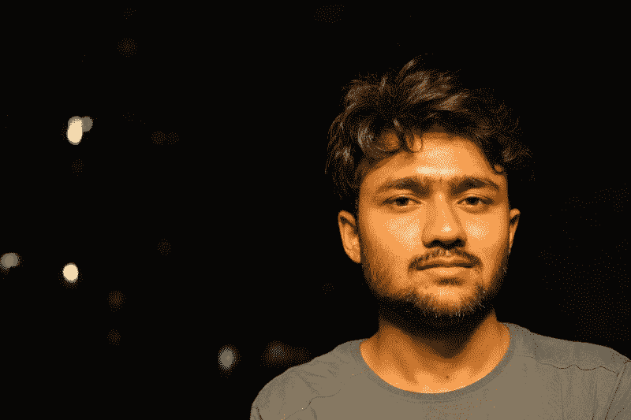
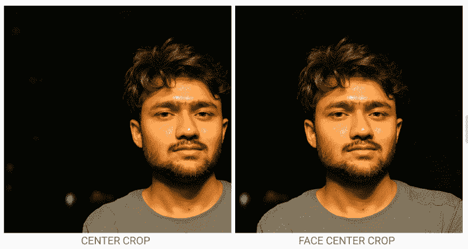
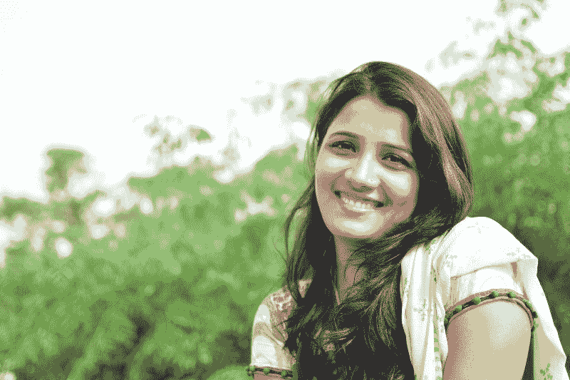
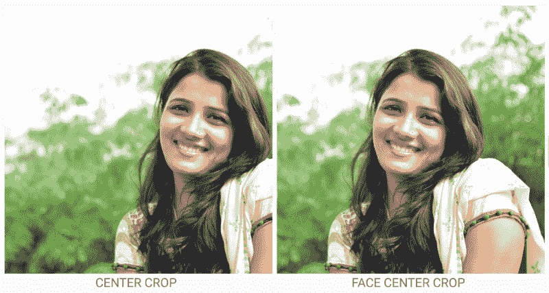
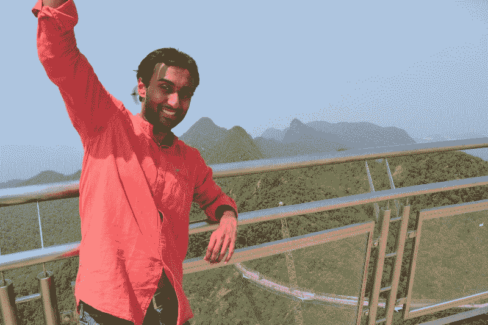
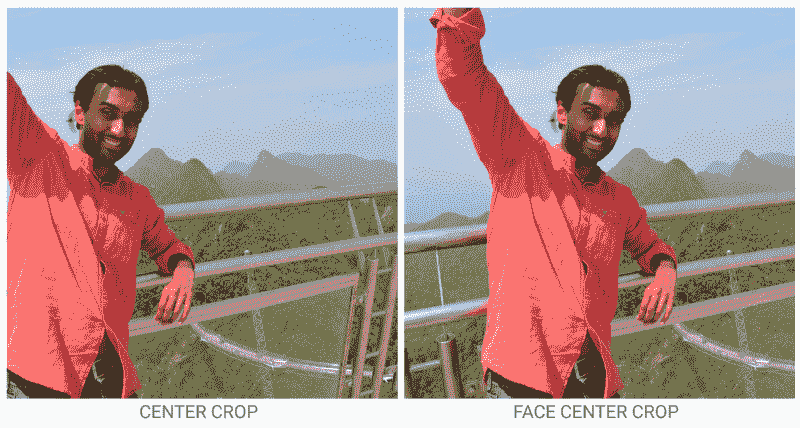
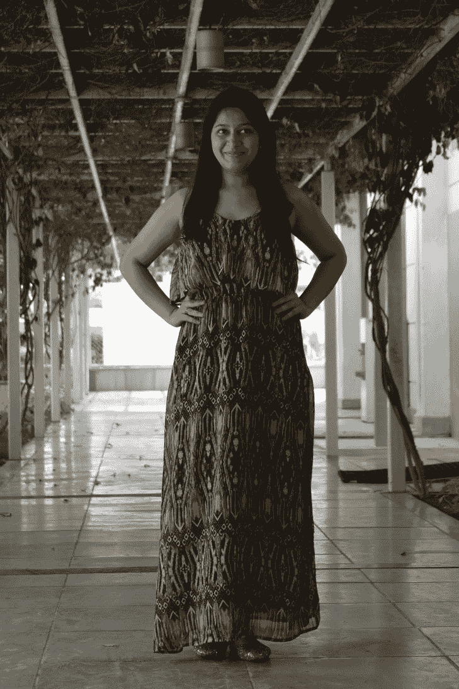
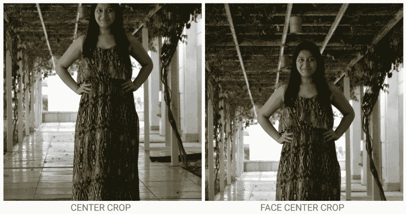

# 基于 Google Vision API 构建的人脸居中 Android 库

> 原文：<https://www.freecodecamp.org/news/face-centering-android-library-build-on-top-of-google-vision-api-f88661b97959/>

作者 Rohit Arya

# 基于 Google Vision API 构建的人脸居中 Android 库


Results after cropping

在我们的 Android 应用程序中，当我们裁剪照片以显示它们时，我们经常会遇到正确定位人脸的问题。

这启发了我去创造一个工具，它可以定位图像中的人脸(如果有的话),并使裁剪后的图像围绕人脸居中。

我是这样做的。

我从谷歌移动视觉的[人脸检测 API](https://developers.google.com/vision/face-detection-concepts) 开始。该 API 提供:

*   人脸检测(不是人脸识别)
*   面部跟踪(将面部检测扩展到视频序列)
*   一个**标志**——一张脸内的一个兴趣点(如眼睛、鼻子等)
*   对人脸进行分类，以确定人脸是否在微笑、眼睛是睁着还是闭着以及其他特征

因为我只是想要面部的位置，所以我只使用了面部检测组件。首先，我创造了面部检测器:

```
FaceDetector detector = new FaceDetector.Builder(context)
    .setTrackingEnabled(false)
    .build();
```

现在给定一个位图，我从该位图创建一个帧实例以提供给检测器:

```
Frame frame = new Frame.Builder().setBitmap(bitmap).build();
```

现在，我试着在画面中同步检测人脸:

```
SparseArray<Face> faces = detector.detect(frame);
```

一旦我得到了脸，我选择了一张脸(现在)来裁剪图像，保持这张脸在中心。

现在开始裁剪图像:

*   我创建了一个缩放的新位图来适应目标视图(ImageView)。
*   然后我重新计算了这张脸在新位图中的位置。
*   保持脸部在中心，我裁剪了原始的位图来得到一个新的位图。
*   如果没有检测到人脸，那么我回退到中间裁剪。

你可以在下面的[我的 GitHub 库](https://github.com/aryarohit07)中找到完整的代码。

以下是它的一些结果:



Original image to be cropped.



Results after cropping



Original image



Results after cropping



Original Image



Results after cropping



Original Image



Results after cropping

我最终导出了这个库，你可以在下面找到它。

对于[滑行](https://github.com/bumptech/glide):

[**aryarohit 07/glidefaceteditiontransformation**](https://github.com/aryarohit07/GlideFaceDetectionTransformation)
[*glidefaceteditiontransformation-一个提供人脸检测上方裁剪的 Android 图像转换库…*](https://github.com/aryarohit07/GlideFaceDetectionTransformation)
[github.com](https://github.com/aryarohit07/GlideFaceDetectionTransformation)

对于[毕加索](https://github.com/square/picasso):

[**aryarohit 07/picassofectiontransformation**](https://github.com/aryarohit07/PicassoFaceDetectionTransformation)
[*picassofectiontransformation-一个提供人脸检测上方裁剪的 Android 图像转换库…*](https://github.com/aryarohit07/PicassoFaceDetectionTransformation)
[github.com](https://github.com/aryarohit07/PicassoFaceDetectionTransformation)

我也计划为壁画发布它。

请随意使用这个工具，并帮助我在 GitHub 上改进它。

> 如果你喜欢读这篇文章，如果你用❤图标推荐它，并与你的同事和朋友分享，那将意味着很多。谢谢！