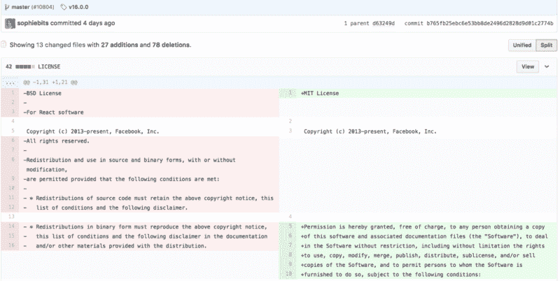
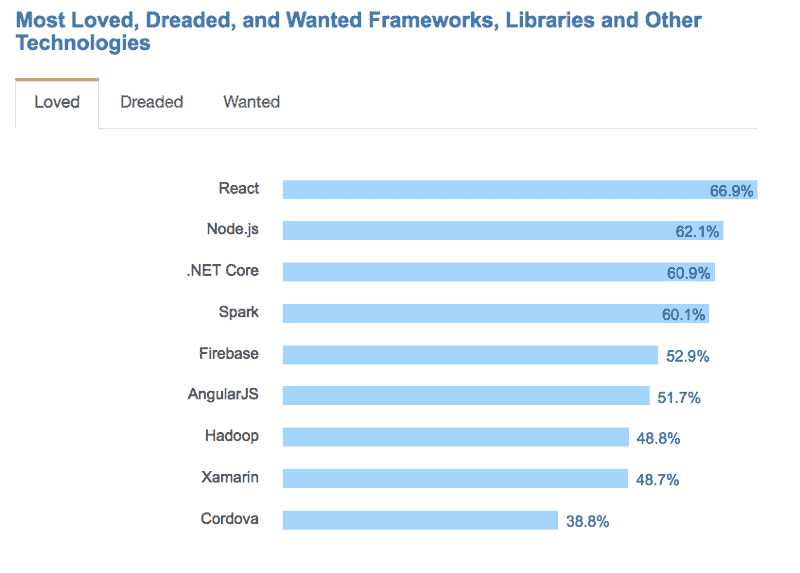
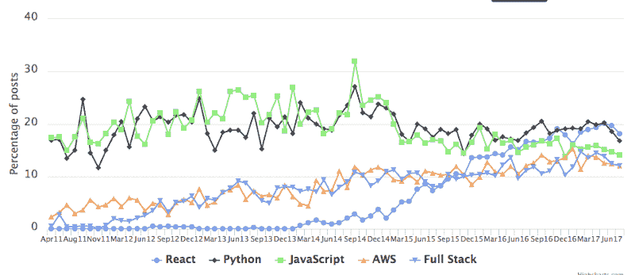

# 脸书刚刚在 React 上换了执照。这里有一个两分钟的解释。

> 原文：<https://www.freecodecamp.org/news/facebook-just-changed-the-license-on-react-heres-a-2-minute-explanation-why-5878478913b2/>

脸书刚刚将它的几个开源项目——包括 React——转到了广受欢迎的麻省理工学院许可证上。

在此之前，脸书使用的是他们自己定制的“BSD+专利”许可证。这类似于广泛使用的 BSD 许可证，但也包括一个基本条款:“你不能起诉脸书侵犯你的专利。”

这个许可证在今年夏天遭到了抨击。事情是这样的。

### 7 月 15 日:阿帕奇基金会禁令反应

Apache 基金会[发出通知](https://issues.apache.org/jira/browse/LEGAL-303)禁止在他们的开源项目中使用任何 BSD+专利授权工具。(Apache 有禁止他们认为限制太多的许可证的历史，[，比如 GNU GPL](https://www.apache.org/licenses/GPL-compatibility.html) 。)

### 8 月 18 日:脸书称 BSD+专利许可证是为了保护他们免受“毫无价值的专利诉讼”

脸书在博客上写道，他们需要 BSD+专利许可证[，这样他们就可以更快地开发 React】，而不需要律师签署他们的变更。](https://code.facebook.com/posts/112130496157735/explaining-react-s-license/)

这刺激了 Reddit、Hacker News 和 freeCodeCamp 等社区讨论 React 替代方案。

### 9 月 14 日:WordPress 表示对脸书的 BSD+专利许可感到不舒服

WordPress——为大约 25%的网站提供支持——说[他们不会在未来的项目中使用 React，除非许可改变](https://ma.tt/2017/09/on-react-and-wordpress/)。

### 9 月 22 日:脸书宣布放弃 BSD+专利许可证，转而使用麻省理工学院许可证

### 9 月 24 日:WordPress 表示现在可以使用 React 了

WordPress 的创始人说[他对这一改变感到高兴，WordPress 可能会在未来的项目中使用 React](https://ma.tt/2017/09/facebook-dropping-patent-clause/)。

### 9 月 25 日:脸书正式改用麻省理工学院的执照

索菲·阿尔珀特做出了[的承诺，将许可证移交给麻省理工学院](https://github.com/facebook/react/commit/b765fb25ebc6e53bb8de2496d2828d9d01c2774b)。

### 9 月 26 日:脸书[发布 React 16](https://github.com/facebook/react/releases)

React is the “most loved” developer tool, according to [64,000 developers surveyed in April 2017 by Stack Overflow](https://medium.freecodecamp.org/73-of-programmers-are-web-developers-and-other-insights-from-stack-overflows-massive-2017-survey-89a13b11e370).

React is now [the most commonly requested skill](https://medium.freecodecamp.org/trending-developer-skills-based-on-my-analysis-of-ask-hn-whos-hiring-26c02a3ca1fd) in Hacker News “Who’s Hiring?” posts.

现在，围绕 React 许可的不确定性已经解决，React 很可能仍然是最受欢迎的 web 开发工具之一。

脸书也在为它的其他开源项目转向更宽松的许可。

我希望这个解释对你有所帮助。如果你想探索开源许可，GitHub 创建了这个工具来帮助你选择合适的许可。

我只写编程和技术。如果你在推特上关注我，我不会浪费你的时间。