# 从增强现实到情感探测:相机如何成为解读世界的最佳工具

> 原文：<https://www.freecodecamp.org/news/facial-recognition-as-aux-driver-8a49dfd477ca/>

阿维·阿什肯纳兹

# 从增强现实到情感探测:相机如何成为解读世界的最佳工具

这款相机最终将帮助解决用户体验(UX)的设计、技术和沟通问题。

在 Kinect 被废弃和谷歌眼镜失败的几年后，现在有了新的希望。从[苹果](https://en.wikipedia.org/wiki/Apple_Inc.)最小化的 [PrimeSense](https://en.wikipedia.org/wiki/PrimeSense) 到 [iPhone X](https://www.apple.com/ca/iphone-x/?afid=p238%7CskwMTeFkg-dc_mtid_20925xpb40345_pcrid_220916805480_&cid=wwa-ca-kwgo-iphone-slid-) 令人印象深刻的技术阵列是情感依赖互动的开始。

这不是新的。它是商业化的，给开发者提供了不可或缺的信息。

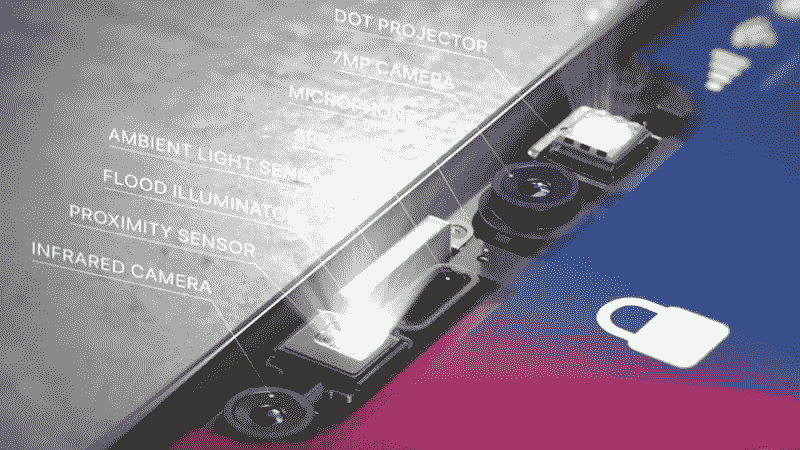

最近，马克·扎克伯格提到，脸书的大部分注意力将放在相机及其周围环境上。 [Snapchat](https://www.snapchat.com/l/en-gb/) 已经将自己定义为一家相机公司。苹果和谷歌也在相机方面投入巨资。**相机有着我们尚未发掘的巨大力量。它有探测情绪的能力。**

### 输入需要简单、自然、轻松

当脸书第一次引入表情符号作为对 *Like、*的增强反应时，我意识到他们说到点子上了。脸书最近增加了五种情绪，这有助于脸书更好地理解用户对其内容的情绪反应。我认为表情符号是同一事物的美化形式，但它比其他任何东西都更有效。

以前脸书只有*喜欢* 按钮而 [YouTube](https://www.youtube.com/) 有*喜欢* 和*不喜欢*按钮。但这些不足以跟踪情绪，也没有为研究人员和广告商提供多少价值。大多数人在评论中表达他们的情感，然而喜欢的比评论多。

这些评论是基于文本的，甚至带有图像，很难分析。这是因为算法需要猜测许多上下文关联。例如，对帖子做出反应的人与发帖的人有多熟悉，反之亦然？这个人是如何与指定的主题联系在一起的？

是否有潜台词、俚语，或者任何与此人经历相关的东西？是过去的继续对话吗？脸书在保持积极对话方面做得非常好。脸书阻止了*不喜欢*按钮转移焦点，这可能会阻止人们创造和分享内容。脸书保持它非常愉快。

现在我想把脸书比作一个美化了的论坛。用户可以回复评论或表情符号。用户可以*喜欢*一个*喜欢*？。然而，仍然很难了解人们的感受。大多数阅读的人不会留下评论。那么当读者阅读一篇文章时，他们会有什么感受呢？

### 相机的旧用户体验

你用照相机做什么？拍照录像，也就这些了。相机应用有了巨大的发展。有许多功能与主要用例的环境相关，例如高动态范围(HDR)、慢动作、肖像模式等。

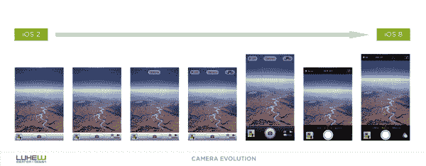

[image source](https://twitter.com/lukew/status/522056776477200384)

基于用户生成的大量图片，新一波智能图库、照片处理和元数据应用已经诞生。

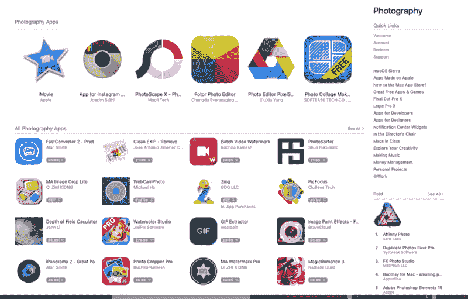

Photography from the Mac App Store

然而，最近焦点发生了变化。它现在出现在生活集成相机上，这是手机的最强款待和最佳用例的组合。下一代相机将完全融入我们的生活，并可能取代信息应用程序中的所有输入图标(麦克风、相机和位置)。

照相机是以令人眼花缭乱的速度持续发展的三个项目之一。屏幕和处理器是另外两个。每一款问世的手机都突破了极限，而且年复一年都是如此。对相机的改进在于它们的百万像素、运动稳定性、光圈、速度以及上面提到的应用程序。

让我们评价几个公司创造的产品的演变。

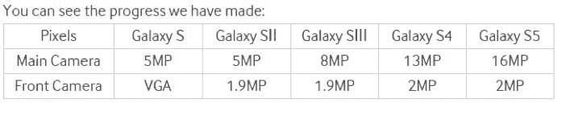

This is just a glimpse of the upgrade to megapixels (MP), not including double cameras, flash, etc. There have been many software changes.

大部分开发都集中在手机背面的摄像头上，因为至少在一开始，前置摄像头被认为只对视频通话有用。然而，自拍文化和 Snapchat 改变了这一点。Snapchat 的面具后来被其他所有人复制，这是一个巨大的成功。口罩并不新鲜。谷歌不久前推出了它们，但 Snapchat 在增加面具的使用方面很有效。

### 回忆里的精彩片段

2009 年 12 月，谷歌推出了[谷歌眼镜](https://en.wikipedia.org/wiki/Google_Goggles)。这是用户第一次可以使用他们的手机来获取关于他们周围环境的信息。这些信息最初主要是关于地标的。

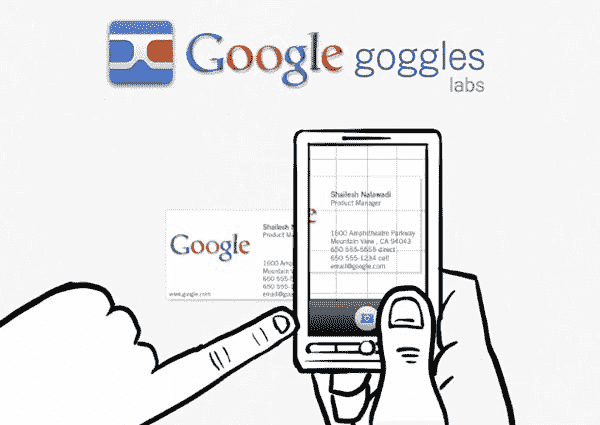

2011 年 11 月，[三星 Nexus](https://en.wikipedia.org/wiki/Galaxy_Nexus) 推出了面部识别作为解锁手机的一种方式。和很多第一次做的东西一样，不是很好，后来报废了。

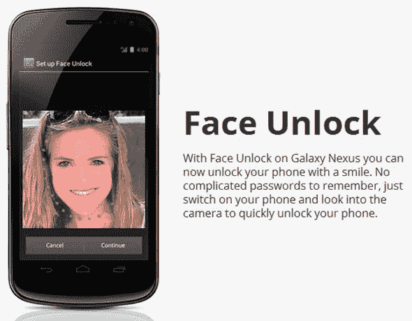

Samsung (Google) Nexus

2013 年 2 月，谷歌发布了[谷歌眼镜](https://en.wikipedia.org/wiki/Google_Glass)。它有更多的使用案例，因为它不仅能够接收来自摄像头的输入，还能够接收来自语音等其他项目的输入。谷歌眼镜一直存在，但它未能获得牵引力，因为它太贵了，看起来不时尚，并引发了公众的反弹。只是还没准备好迎接黄金时间。

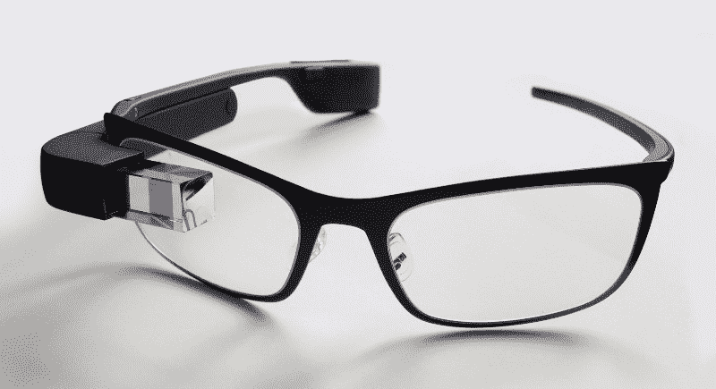

Google Glass 1

到目前为止，设备只能处理有限的信息。他们拥有的信息是带有 GPS 和历史数据的音频视频。但它限制了谷歌眼镜在靠近用户眼睛的小屏幕上显示信息。屏幕阻止用户看其他任何东西。将这项技术放在手机上供外部使用不仅是技术上的限制，也是物理上的限制。

当你专注于你的手机时，你看不到其他任何东西。你的视野有限。这类似于虚拟现实(VR)的用户体验原则中的视野。这就是为什么有些城市为边走边用手机的人开辟了路线，还设置了帮助人们边走边发短信的红绿灯。像[微软的 HoloLens](https://en.wikipedia.org/wiki/Microsoft_HoloLens) 这样的前提更符合空间环境，并且可以在用户移动和使用手机时实际上帮助他们，而不是吸引他们的注意力并将他们置于危险之中。

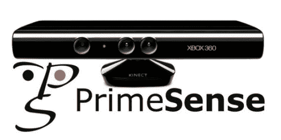

[Kinect](https://en.wikipedia.org/wiki/Kinect) bought by Apple Inc.

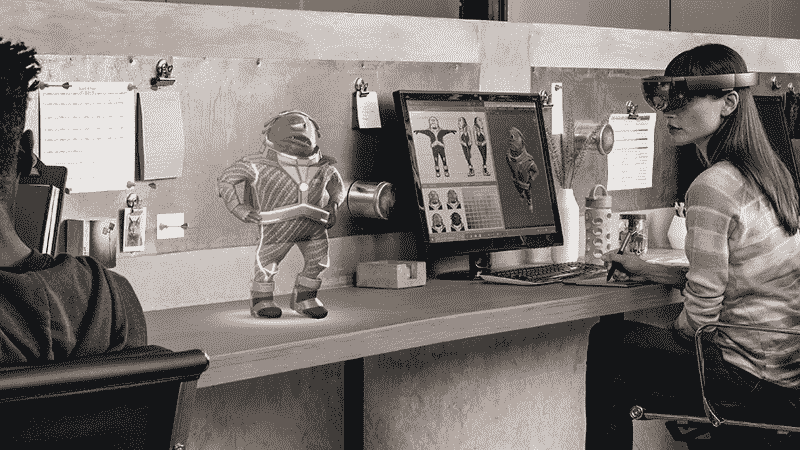

Microsoft HoloLens

2014 年 7 月，亚马逊推出了 [Fire 手机](https://en.wikipedia.org/wiki/Fire_Phone)。它的特点是手机前面有四个摄像头。这是一个突破，尽管它没有成功。四个前置摄像头用于滚动，并根据加速度计和用户的目光创建 3D 效果。这是手机首次使用前置摄像头作为用户的输入方式。

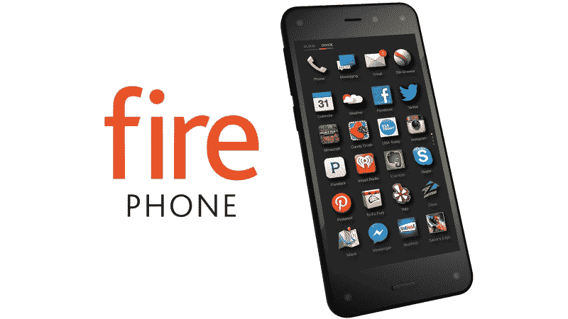

The Fire Phone

2016 年 8 月，[三星的 Note 7](https://en.wikipedia.org/wiki/Samsung_Galaxy_Note_7) 上市。它允许用户通过虹膜扫描解锁手机。三星重新启用了搁置了六年的面部识别技术。不幸的是，仅仅看一下教程就令人烦恼。三星没有对该功能进行太多的用户体验测试。

拿着这个巨大的手机，并把它与你的脸成 90 度角是令人不安的。这不是任何人在街上行走时都应该做的事情。对于遮住脸的沙特妇女来说，它可以很好地工作，但由于制造缺陷，许多 Note 7 手机过热，燃烧或爆炸。虹膜扫描的概念又被搁置了整整一年，直到 [Note 8](http://www.samsung.com/ca/smartphones/galaxy-note8/) 问世。

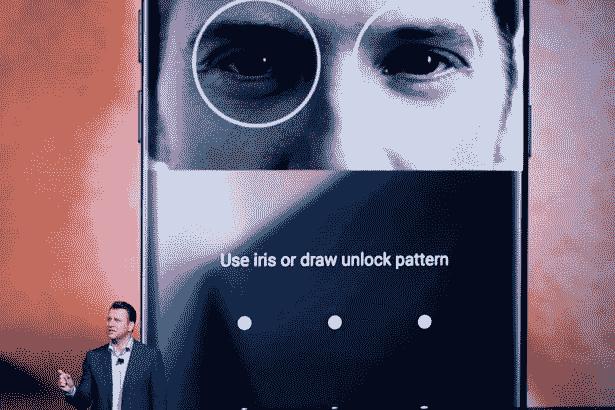

From Samsung’s keynote

但那时候没人提虹膜扫描。Note 8 提到虹膜扫描是结合指纹传感器解锁手机的另一种方式。很可能是因为手机不够好或者三星没能做出决定(类似于 [Galaxy 6](https://en.wikipedia.org/wiki/Samsung_Galaxy_S6) 和 [6 Edge](http://www.samsung.com/global/galaxy/galaxys6/galaxy-s6-edge/) 的发布)。一个产品要想成功，需要具备多种功能，否则就有被遗忘的风险。

谷歌休息了一段时间，然后在 2017 年 7 月发布了第二版谷歌眼镜，作为企业对企业的产品。对于某些行业，用例变得更加具体。

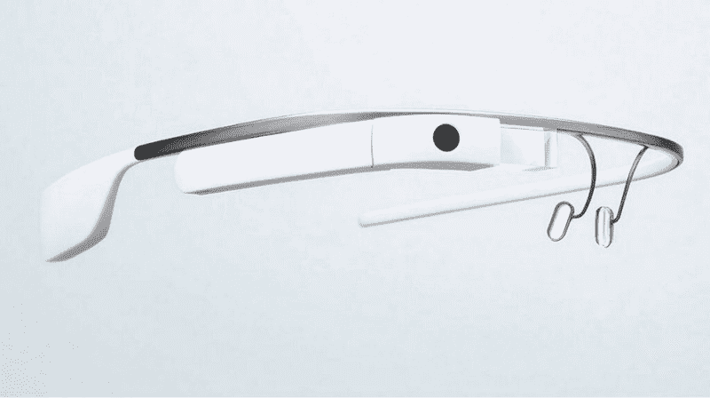

Google Glass 2

现在谷歌即将发布[谷歌镜头](https://en.wikipedia.org/wiki/Google_Lens)将最初的护目镜用例带到现在。谷歌努力学习如何在额外的背景下使用视觉信息，并找出下一步要开发的产品。谷歌似乎倾向于用户可以佩戴的摄像头。

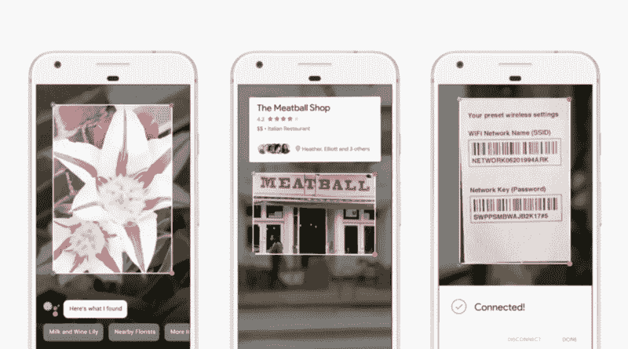

Google Lens App

还有其他公司也在探索视觉输入。例如， [Pinterest](https://www.pinterest.ca/) 看到了对其视觉搜索镜头的巨大需求，其用户正在使用它来搜索要购买的物品，并帮助人们在线挑选产品和服务。

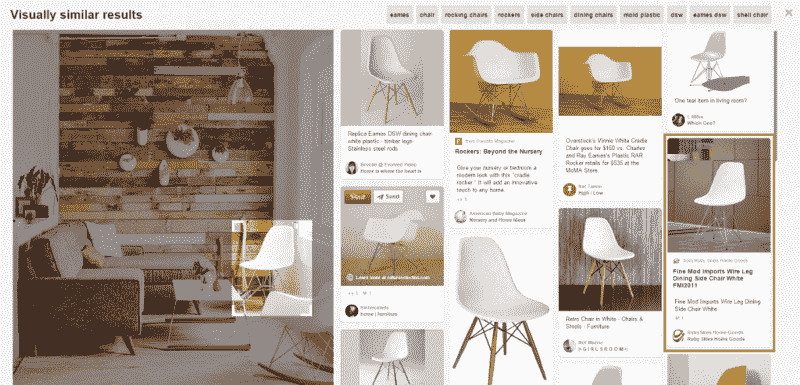

Pinterest Visual Search

[Snapchat 的 spectacles](https://www.spectacles.com/) 允许用户轻松录制短视频(即使上传过程很繁琐)。

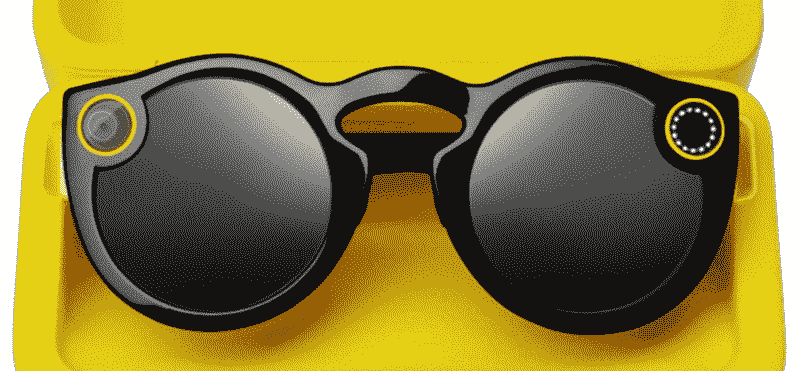

Snap’s Specs

现在面部识别也在 Note 8 和 [Galaxy 8](http://www.samsung.com/ca/smartphones/galaxy-note8/) 上，但这项功能并没有像希望的那样顺利实现。

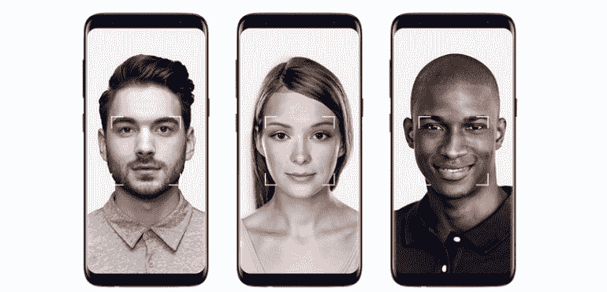

Galaxy S8 facial recognition

要查看面部识别演示，请点击[此处](https://twitter.com/MelTajon/status/904058526061830144/video/1)。

相对于竞争对手，苹果采用新技术的速度较慢。但另一方面，苹果将自己的产品商业化，比如苹果[手表](https://www.apple.com/ca/apple-watch-series-1/)。这款手表的核心是面部识别和有限屏幕。让人们使用这个功能最好的方法就是去掉所有其他选项(比如[触控 ID](https://en.wikipedia.org/wiki/Touch_ID) )。毫不奇怪，苹果去年在 [MacBook Pro](https://en.wikipedia.org/wiki/MacBook_Pro) 上通过无线音频(苹果移除了耳机插孔)和 [USB C](https://en.wikipedia.org/wiki/USB-C) (通过移除其他所有东西)做到了这一点。

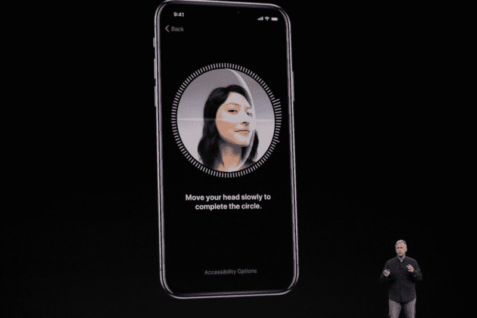

苹果此时选择这项技术还有一个大得多的原因。这与它的增强现实努力有关。

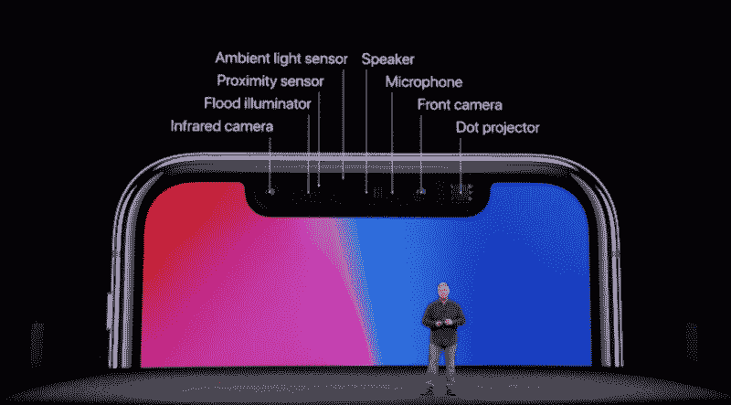

Face ID 面临的挑战包括识别佩戴 [Niqāb](https://en.wikipedia.org/wiki/Niq%C4%81b) (面部覆盖物)的用户、做过整形手术的用户以及因为成长而身体发生变化的用户。但是更大的画面更有趣。这是用户第一次可以毫不费力地做一些他们自然会做的事情，同时接收对未来技术有意义的数据。我相信能读取指纹的屏幕更好。三星似乎正朝着这个方向前进(尽管有传言称苹果尝试过，但失败了)。

### 那么，这将走向何方？目标是什么？

过去，公司使用特殊的眼镜和设备进行用户测试。他们能给出的唯一输出是[热图](https://en.wikipedia.org/wiki/Heat_map)。然而，他们无法记录用户的关注点或他们的情绪和反应。

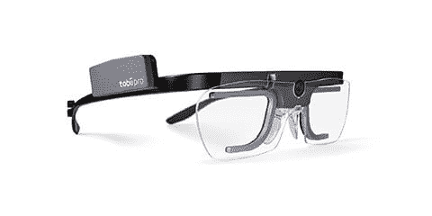

Tobii Pro glasses — is one example

根据技术趋势，未来似乎涉及增强现实和虚拟现实。但在我看来，它包括音频、3D 声音和视觉输入的组合。这将是一个美妙的体验，它将允许用户在任何地方查看任何东西，同时获取信息。

如果我们能够知道用户在看哪里，他们在关注什么呢？多年来，这是营销和设计专业人士试图捕捉和分析的东西。有什么能比像 iPhone X 这样的设备作为起点的数组集做得更好呢？后来，这种眼镜演变成了可以看到用户所关注的东西的眼镜。

### **反应是强大和上瘾的**

反应有助于人们交谈，并提高记忆力和参与度。一些应用程序提供对帖子的反应，作为可以发送给朋友的消息。YouTube 上有搞笑的视频，展示了看视频的人的反应。甚至还有一个电视节目，叫做 [Gogglebox](https://en.wikipedia.org/wiki/Gogglebox) ，专门用来展示人们看电视的样子。

在一年一度的开发者节上，谷歌开放了向平台创作者付费的选项。这就像辉煌的 [Patreon](https://en.wikipedia.org/wiki/Patreon) 网站正在做的，但以一种更具主导性的方式。帮助你脱颖而出并抓住创作者注意力的一个方法是 [SuperChat](https://www.youtube.com/watch?v=b9szyPvMDTk) 。

在 Chris Harrison 2009 年的学生项目中，Harrison 创造了一个带有压力感应键的键盘。根据用户打字的力度，键盘读取用户的情绪，并确定他们是生气还是兴奋。结果字母也变大了。现在想象一下，将它与一台可以在用户打字时看到他们面部表情的相机结合起来，因为人们在键入信息时往往会表达他们的情绪。

### 这样的 UX 会是什么样子呢

考虑虚拟现实中远程点和中心点的配对。中心是我们的焦点，但我们还有一个次要焦点，也就是远处的点。然而，这种类型的用户体验无法在增强现实中工作。为了利用增强现实，这是苹果的一个新焦点，用户的焦点必须是已知的。

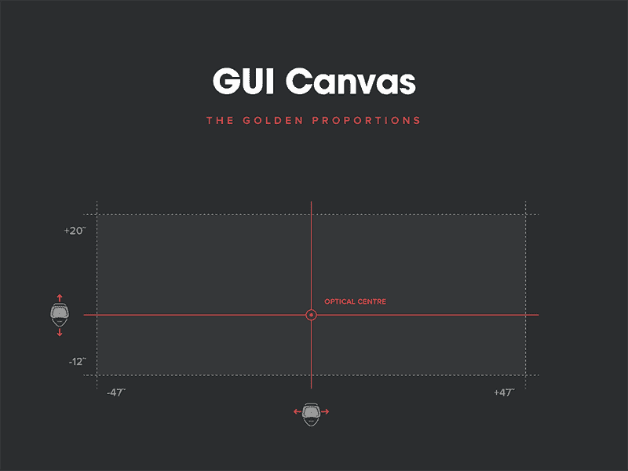

[illustration source](https://blog.kickpush.co/beyond-reality-first-steps-into-the-unknown-cbb19f039e51)

最初的 ARKit 和谷歌的 ARCore SDK 都将成为发展的未来。这是因为前后摄像头**组合**可以获得惊人的输出和输入。这将允许更多地关注输入。

### **对未来发展的更具批判性的观点**

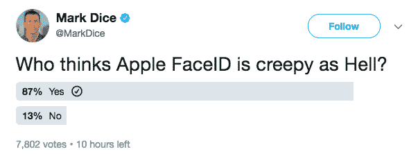

虽然苹果为面部识别开辟了道路，并引发了反动的敌意，但当其他组织开始实施 T2 Face ID 时，这将变得有趣。目前，它以一种基本且无害的方式表现出来，但目标仍然是获得更多信息。将用于跟踪和向我们销售产品的信息。这也能让我们更多地了解自己，收集我们的情感数据。

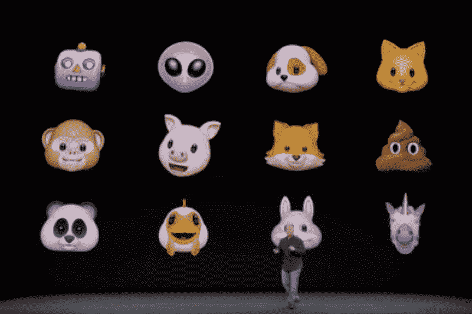

Animoji

重要的是说前置摄像头不是一个人来的。这是苹果收购 [PrimeSense](https://en.wikipedia.org/wiki/PrimeSense) 的预期结果。一系列前置技术包括红外摄像头、深度传感器等。(我认为他们也可以用热传感器做得很好。)这并不是说有人会用手机保存我们面部的视频，而是说会有一个刮刀记录我们情绪的所有信息。

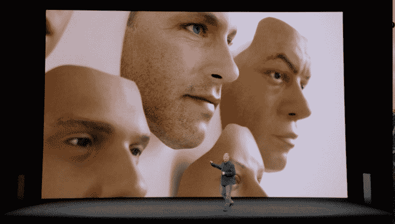

Can’t be fooled by a mask — from Apple’s keynote

Or funny enough

### **总结**

令人兴奋的是，增强现实拥有可以读取面部的算法。有很多书谈到如何识别面部反应，但现在是技术来做这件事的时候了。它会因为很多原因而变得精彩。例如，机器人现在可以看到我们的感觉和反应，或者通过眼镜，我们可以获得更多关于我们需要它们做什么的背景信息。与计算机相关，最好看元素的组合，因为这有助于机器更好地理解你。

如果你有用户关注的信息，你可以做的事情是无穷无尽的。这是每个从事技术工作的人的梦想。

这篇博文最初显示在这里[。](https://superavi.com/facial-recognition-as-ux-driver-from-ar-to-emotion-detection-how-the-camera-turned-to-be-the-best-tool-to-decipher-the-world/)