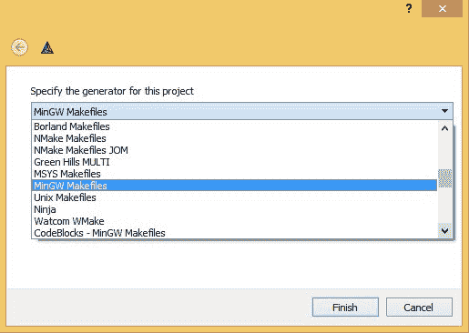
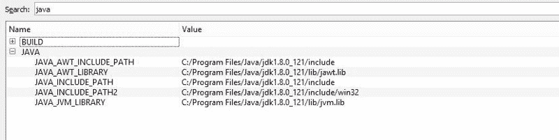
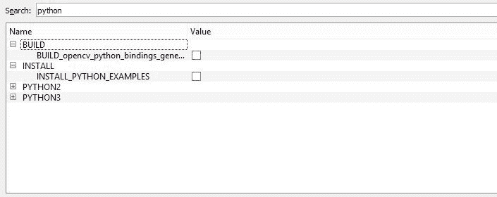
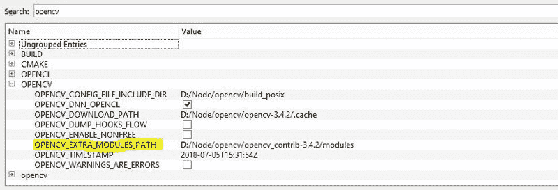
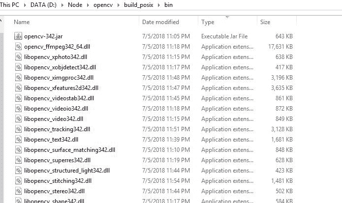
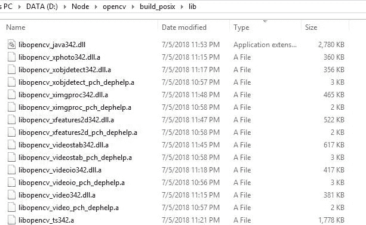
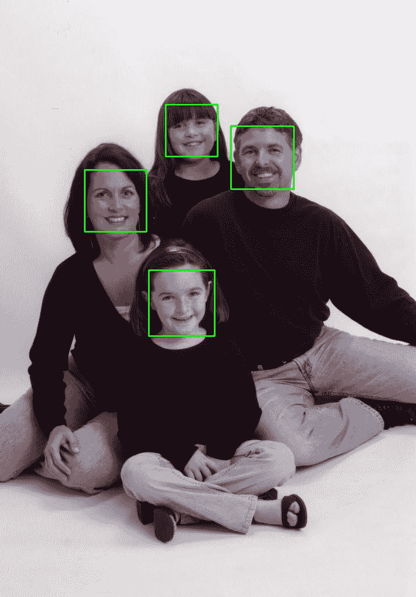
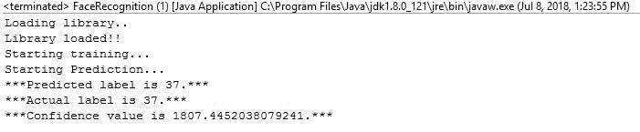

# 在 Java 中使用 OpenCV 进行人脸识别

> 原文：<https://www.freecodecamp.org/news/facial-recognition-using-opencv-in-java-92fa40c22f62/>

作者马尼什·班萨尔

# 在 Java 中使用 OpenCV 进行人脸识别


source: [https://statescoop.com](https://statescoop.com)

自从人工智能热潮开始——或者以面部解锁功能为特色的 iPhone X 广告出现在电视屏幕上——我就想尝试这项技术。然而，一旦我开始搜索它，我通常只能找到 Python 中的代码示例。作为一个七年的 Java 爱好者，我看到这些就失去了动力。因此，我最终决定为此寻找 Java 开源库。

目前，有各种各样的 Java 库。但是我发现最流行的是 [OpenCV](https://github.com/opencv/opencv) 。

OpenCV 是一个开源的计算机视觉库，拥有大量的模块，如对象检测、人脸识别和增强现实。虽然这个库是用 C++编写的，但是它也提供了经过实战考验的 Java 绑定。

然而，有一个问题。作为其软件发布的一部分，它只提供了一些开箱即用的模块(带有 Java 绑定)——面部识别不在其中。因此，要使用它，需要手动构建。

**等等！什么？为什么？**

是的 OpenCV 社区引用的原因是这些模块并不完全稳定。因此，它们不与标准版本捆绑在一起。因此，他们在一个单独的仓库[中维护它们。](https://github.com/opencv/opencv_contrib)

如果你没有或者很少 C++经验(像我一样)，你一定已经开始对自己构建 C++库感到头晕了。但不要担心，我在这里握着你的手，陪你走过这个繁琐的过程。我们开始吧，好吗？

### 从头开始构建 OpenCV for Java


“Birds flying around a half-built building and construction site” by [贝莉儿 NG](https://unsplash.com/@danist07?utm_source=medium&utm_medium=referral) on [Unsplash](https://unsplash.com?utm_source=medium&utm_medium=referral)

您可以找到各种资源来获得分步说明，如[这个](https://opencv-java-tutorials.readthedocs.io/en/latest/01-installing-opencv-for-java.html#install-opencv-3-x-under-windows)、[这个](https://www.learnopencv.com/install-opencv3-on-windows/)和[这个](https://perso.uclouvain.be/allan.barrea/opencv/cmake_config.html)。然而，它们都不太适合我，因为少了一些东西。我找到的最接近的，对我有帮助的，是[这个](https://opencv-java-tutorials.readthedocs.io/en/latest/01-installing-opencv-for-java.html#install-opencv-3-x-under-linux)的。但是，您不需要参考它。你可以遵循下面的步骤，你会很好。

首先，你需要在你的电脑上安装以下软件。在这里，我正在构建一个 64 位版本的库，因为我拥有一台 64 位 PC。但是您也可以为 32 位构建它。

所需的软件是:

1.  [Cmake](https://cmake.org) (我用的是 3.6.0 rc-4 版本)。
2.  [Ant](https://ant.apache.org) (内部用于构建 JAR)
3.  MinGW — W64 GCC-8.1.0
4.  [64 位 JDK 1.8](http://www.oracle.com/technetwork/java/javase/downloads/jdk8-downloads-2133151.html)

**关于 MinGW 的一句话:**这里，要构建这个库，我们需要 C++编译器。可以用 Visual Studio tools (VS)，这样好得多。然而，我没有这个闲工夫，因为我是在我的办公室笔记本电脑上构建的，而 VS 是授权软件，这里的 Java 人无法使用。因此，我不得不使用开源工具，最好的是 MinGW(Windows 的极简 GNU)。

此外，使用正确版本的 MinGW 非常重要。下载版本 [x86_64-posix-seh](https://sourceforge.net/projects/mingw-w64/files/Toolchains%20targetting%20Win64/Personal%20Builds/mingw-builds/8.1.0/threads-posix/seh/x86_64-8.1.0-release-posix-seh-rt_v6-rev0.7z) ，因为这个版本有线程支持。其他版本我都没试过。但是版本 [x86_64-win32-sjlj](https://sourceforge.net/projects/mingw-w64/files/Toolchains%20targetting%20Win64/Personal%20Builds/mingw-builds/8.1.0/threads-win32/sjlj/x86_64-8.1.0-release-win32-sjlj-rt_v6-rev0.7z) 根本不行。

为了提供更多的视角，构建是由作为 MinGW (bin/mingw32-make.exe)一部分的名为 **make** 的实用程序完成的。make 是 C++的任务运行器，就像“Ant”是 Java 的任务运行器一样。但是 C++代码和 make 脚本非常依赖于平台。因此，为了使可分发软件独立于平台，使用了实用程序 **CMake** 。CMake 生成依赖于平台的 Make 脚本。

### **使用 CMake 生成构建配置**

**第一步:**下载 [opencv](https://github.com/opencv/opencv/releases) 和 [opencv_contrib](https://github.com/opencv/opencv_contrib/releases) 的源代码 zip，解压到一个目录下。此外，在同一个目录中创建一个名为“build”的文件夹(我创建了“build_posix ”,如屏幕截图所示)。

**第二步:**打开 CMake。将“源代码在哪里”指向 opencv 解压文件夹。此外，将“构建二进制文件的位置”指向您创建的“build”文件夹。


**步骤 3:** 将 64 位 JDK 1.8 bin 文件夹、MinGW bin 文件夹、蚂蚁 bin 文件夹添加到“PATH”环境变量中。这很重要，因为 CMake 将在环境变量中查找配置。如果不这样做，那么我们将不得不在步骤 5 中手动配置 CMake。

**如果您的系统中有多个 JDK，并且您已经在“路径”&中有一些不同的 JDK，您不想在“路径”中添加 JDK 1.8，您可以跳过这一步。但是请在步骤 5 中进行手动配置。**

**第四步:**按“配置”按钮，选择“MinGw Makefiles”和“完成”。之后，CMake 将开始配置您的项目。这需要一段时间，完成配置后，它将显示当前可用的配置。

如果您想知道为您生成的配置是否正确，您可以在这里查看为我生成的日志[并进行比较。](https://pastebin.com/50rtPkt6)



第五步:现在是最重要的部分——改变配置。首先，单击复选框“分组”和“高级”来组织配置。


*   验证 ANT_EXECUTABLE(在搜索框中搜索“ANT_EXECUTABLE ”)和所有五个“JAVA”配置都指向 64 位 JDK 1.8。如果第 3 步做得正确，那么这将是正确的。否则，请更正它们。



*   取消选中“构建”和“安装”组下的 Python(搜索“Python”)相关复选框，因为我们不需要 Python 构建。



*   禁用“与 _MSMF”和“与 _IPP &与 _TBB”。这些库只适用于 VS。
*   编辑“OPENCV”组下的“OPENCV_EXTRA_MODULES_PATH”，并将其设置为之前提取的“opencv_contrib”源文件夹下的“MODULES”文件夹。



之后，再次按下“配置”按钮。这将做最后的配置。你可以在这里查阅为我生成的日志[。](https://pastebin.com/B71iVjQT)

**注意**:确保将您生成的“配置”日志与我在上面的 pastebin 中共享的日志进行比较。如果你发现一些**主要**差异，那么首先尝试纠正你的配置，并再次按下“配置”。否则，您的构建有可能会失败，并且调试会更加困难。

**第六步:**这之后，按“生成”。这需要几秒钟时间，然后关闭 CMake。

### **编译 OpenCV**

现在，如果上面生成的所有配置都是正确的，那么这项任务将轻而易举(2-3 小时！).只需打开命令提示符，转到“build”文件夹，并执行下面的命令。

```
mingw32-make.exe  -j5 > buildLogs.txt
```

这里添加了`-j5`，它指示 make 实用程序并行运行五个作业。这将使你的构建更快，至少理论上是这样。

此外，不要忘记将日志推送到文本文件中。这些可能会变得太大，在这种情况下，您的命令提示符窗口可能会将其截断。你需要它们以防编译失败。你可以在这里查阅我的案例[中生成的编译日志。](https://pastebin.com/r7RSXSDm)

**注意**:日志语句的顺序可能与您的不同，因为构建是在五个并行线程中进行的。

构建完成后，您可以检查“构建”目录中的“bin”和“lib”文件夹。在“bin”中，您将拥有所有 opencv*。exe 和 libopencv*。dll 和你编译的 JAR。此外，“lib”将包含您的主 dll(libopencv _ javaxx . dll)以及一些更多的依赖文件。



“bin” folder after successful compilation



“lib” folder after successful compilation

### 动手使用 OpenCV 人脸识别 API


Photo by [rawpixel](https://unsplash.com/@rawpixel?utm_source=medium&utm_medium=referral) on [Unsplash](https://unsplash.com?utm_source=medium&utm_medium=referral)

既然已经构建了库，那么首先需要在 Eclipse 中设置环境变量和用户库。

1.  创建一个变量 OPENCV_JAVA_BIN，并将其指向“build”目录中生成的“BIN”文件夹。
2.  创建 OPENCV_JAVA_LIB，并将其指向“build”目录中生成的“LIB”文件夹。
3.  将上述两个变量附加到“PATH”变量中。
4.  打开您的 Eclipse 并创建一个新的用户库，您将在您的人脸识别项目中使用它。进入“窗口”>“首选项 **es** ”。从菜单中，在“Java”>“构建路径”>“用户库”下导航，并选择“新建…”。输入库的名称—例如 opencv —并选择新创建的用户库。选择“添加外部 JARs”并从您的计算机中浏览选择“opencv-3xx.jar”。

在这之后，**不需要**来链接本地库，因为这已经在第 3 步中添加到您的“path”变量中了。

一旦您完成了这个设置，您就可以从这里的[克隆我的 Git 库，并将项目导入到您的 Eclipse 工作区中。此外，您将需要添加 JDK 1.8 以及 opencv 用户库(刚刚创建)到这个项目中。一旦完成，就可以测试新构建的 OpenCV 库了。](https://github.com/manishbansal8843/Opencv-facerec-java)

在撰写本文时，这个项目中有三个程序。

*   你可以运行这个来测试你的 OpenCV 库设置是否正常。如果这不能正常工作，你需要先解决这个问题**。此时，您将遇到的唯一问题与系统环境变量或用户库设置有关。**
*   ****人脸检测**:可以用这个来测试人脸检测模块。它与人脸识别是不同的模块。这是一个随 OpenCV 标准版本一起发布的模块。在撰写本文时，我们可以提供一个图像作为程序的输入，它将检测图像中的所有人脸。输出图像在所有检测到的面上都绘制了绿色矩形。**

**

Input image for Face Detection program** **

Output image of face detection program** 

*   ****face recognition:**OpenCV facerec 模块包括三种算法:**

1.  **特征脸**
2.  **鱼脸**
3.  **局部二元模式直方图。**

**关于所有这些算法的技术细节，你可以参考[这篇](https://docs.opencv.org/2.4/modules/contrib/doc/facerec/facerec_tutorial.html)官方文章。出于演示的目的，我将向您展示如何使用特征脸算法。**

**首先你需要[从人脸数据库下载](http://www.cl.cam.ac.uk/Research/DTG/attarchive/pub/data/att_faces.zip)训练数据。该数据包含 40 个不同对象中的每一个的 10 个不同图像(400 个图像)。对于一些受试者来说，这些图像是在不同的时间拍摄的，改变了光线、面部表情(睁开/闭上眼睛、微笑/不微笑)和面部细节(戴眼镜/不戴眼镜)。在您的计算机上提取它们之后，您需要准备一个. csv 文件，其中包含每个图像的路径以及它们对应的标签。**

**为了简单起见，我在我的 Git 存储库中有一个 TrainingData.txt。但是，您需要编辑文件，并根据您的计算机目录位置更改图像的路径。**

****注**:下载的人脸数据库包含中的图像。pgm 格式。这种格式**不被 Windows 支持**。把它们转化成。jpg，我将 PGMToJPGConverter 添加到我的存储库中。您可以使用它来转换图像，并实际查看训练数据。**

**在此之后，您可以运行面部识别程序。以下是程序中执行的步骤:**

1.  **OpenCV 库照常被[加载](https://github.com/manishbansal8843/Opencv-facerec-java/blob/0d56b0a369e33a09e8af52613dbd79afdccad397/src/com/demo/facerecognition/FaceRecognitionEigenFaces.java#L20)。**
2.  **的。csv 文件被读取，两个数组列表被创建。一个用于图像矩阵，另一个用于它们相应的标签。**
3.  **在 400 个输入图像中，列表数据结构中的最后一个条目[被移除并被保存](https://github.com/manishbansal8843/Opencv-facerec-java/blob/0d56b0a369e33a09e8af52613dbd79afdccad397/src/com/demo/facerecognition/FaceRecognitionEigenFaces.java#L26-L29)用于稍后测试训练的模型。**
4.  **之后，剩余的 399 幅图像用于[训练](https://github.com/manishbansal8843/Opencv-facerec-java/blob/0d56b0a369e33a09e8af52613dbd79afdccad397/src/com/demo/facerecognition/FaceRecognitionEigenFaces.java#L34)特征脸算法。**
5.  **一旦训练完成，模型被要求[预测](https://github.com/manishbansal8843/Opencv-facerec-java/blob/0d56b0a369e33a09e8af52613dbd79afdccad397/src/com/demo/facerecognition/FaceRecognitionEigenFaces.java#L39)我们在步骤 3 中移除的图像的标签。**

**

Output of Face Recognition Program** 

**这里，我们可以观察到，该算法能够预测我们的测试对象的标签，置信度值为 1807。值越低，预测越好。类似地，您可以用另外两个算法来执行这个练习。C++代码可以从[这里](https://docs.opencv.org/2.4/modules/contrib/doc/facerec/facerec_tutorial.html#fisherfaces-in-opencv)和[这里](https://docs.opencv.org/2.4/modules/contrib/doc/facerec/facerec_tutorial.html#local-binary-patterns-histograms-in-opencv)下载。**

> ****更新(2018 年 12 月 27 日)**:如果你觉得构建 openCV java 绑定很痛苦，那么我有一个好消息要告诉你。最近，我发现了一种更简单的方法来获得 java 的所有 openCV 依赖项。完整的细节，请参考我的[另一篇文章](https://medium.com/@manishbansal8843/face-recognition-using-opencv-in-java-updated-8fc329863e52)。**

****恭喜**！！？你坚持到了最后。如果你喜欢呢？这篇文章，点击下面的按钮？。这对我意义重大，也有助于其他人了解这个故事。**