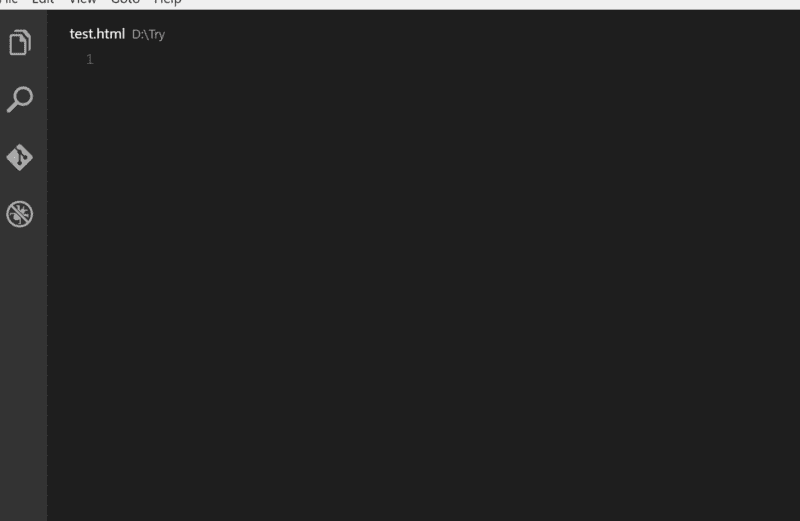
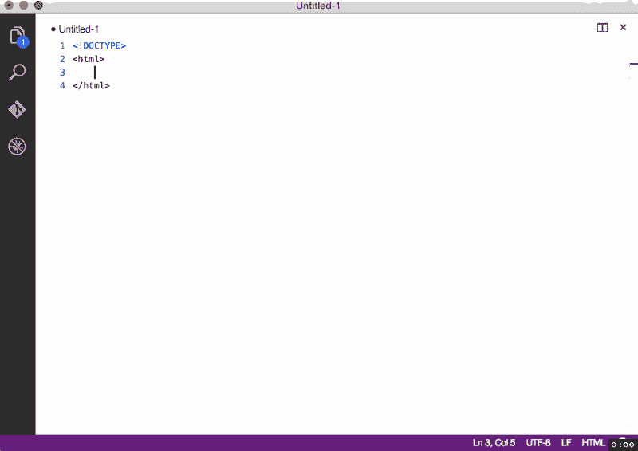
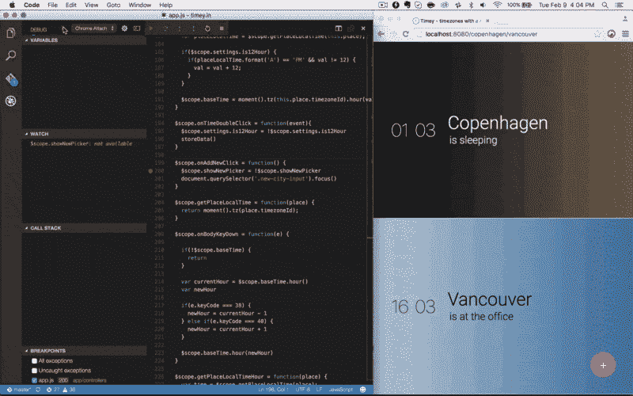
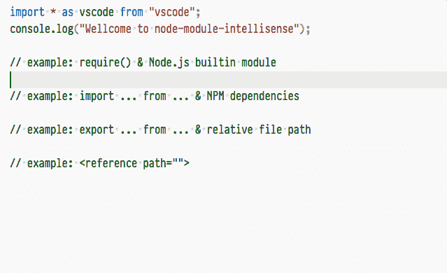
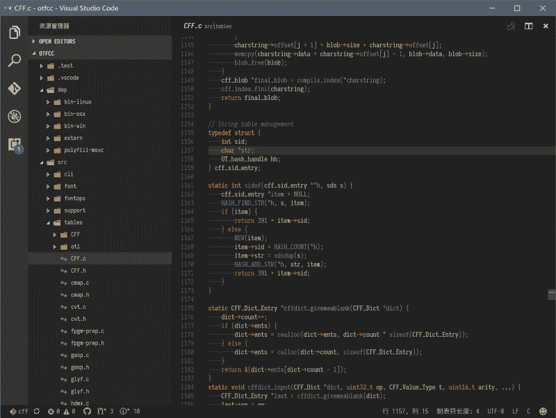
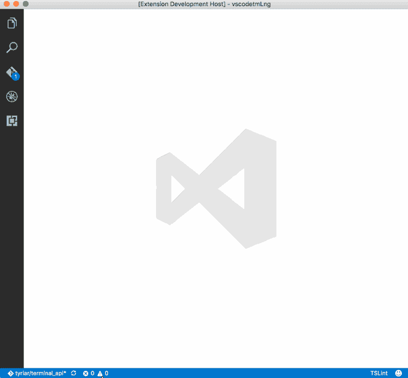
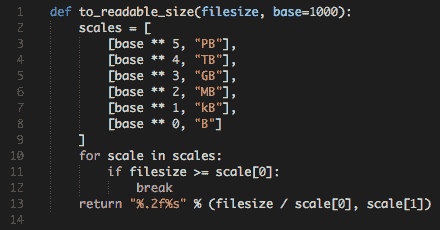

# 2017 年最受欢迎的 Visual Studio 代码扩展

> 原文：<https://www.freecodecamp.org/news/favorite-vs-code-extensions-2017-786ea235812f/>

丹尼尔·多伊奇

# 最喜欢的 **Visual Studio 代码**2017 的扩展

Photo by Kevin on Unsplash — [https://unsplash.com/photos/w7ZyuGYNpRQ](https://unsplash.com/photos/w7ZyuGYNpRQ)

下面是我喜欢的 Visual Studio 代码(VSCode)的一些扩展列表。由于我在前端做了很多工作，这些扩展中的大部分对 web 开发人员都是有用的。我以前一直在与 Atom，Visual Studio 和 Webstorm 合作，但 VSCode 最适合我，简直令人难以置信。开发人员做得非常好(现在仍然如此！).自己试试，好好享受吧！

> 享受生活，你不需要花里胡哨的废话，但你需要控制你的时间，并意识到大多数事情并不像你想象的那么严重― [蒂莫西·费里斯](https://en.wikiquote.org/wiki/Timothy_Ferriss)

### HTML 扩展

#### 自动关闭标签

自动添加 HTML/XML 结束标记，与 Visual Studio IDE 或 Sublime Text 一样。

[查看更多](https://marketplace.visualstudio.com/items?itemName=formulahendry.auto-close-tag)

#### 自动重命名标签

与 Visual Studio IDE 一样，自动重命名成对的 HTML/XML 标记。

[查看更多](https://marketplace.visualstudio.com/items?itemName=formulahendry.auto-rename-tag)

#### HTML 片段

这个扩展为 VS 代码的 HTML 标记增加了丰富的语言支持，包括:完整的 HTML5 标签、着色和代码片段。

[查看更多](https://marketplace.visualstudio.com/items?itemName=abusaidm.html-snippets)

### 降价扩展

#### 自动打开减价预览

每当你打开新的降价文件时，这个 VS 代码扩展自动显示降价预览。如果你觉得多次键入“Ctrl+K V”或“⌘+K V”(并排预览)很烦人，这个扩展可以帮助你。
[查看更多](https://marketplace.visualstudio.com/items?itemName=hnw.vscode-auto-open-markdown-preview)

#### 降价目录

从已解析的降价文件中生成标题的目录。
[查看更多](https://marketplace.visualstudio.com/items?itemName=AlanWalk.markdown-toc)

#### 减价主题套件

基于 SublimeText 的一组主题-Markdown/MarkdownEditing。
[查看更多](https://marketplace.visualstudio.com/items?itemName=ms-vscode.Theme-MarkdownKit)

#### 代码拼写检查器

一个基本的拼写检查器，适用于 camelCase 代码。
[查看更多](https://marketplace.visualstudio.com/items?itemName=streetsidesoftware.code-spell-checker)

### JavaScript 扩展

#### 巴别 ES6/ES7

添加了 JavaScirpt Babel es6/es7 语法颜色。
[查看更多](https://marketplace.visualstudio.com/items?itemName=dzannotti.vscode-babel-coloring)

#### Chrome 调试器

在 Chrome 浏览器或任何其他支持 Chrome 调试器协议的目标中调试您的 JavaScript 代码。

[查看更多](https://marketplace.visualstudio.com/items?itemName=msjsdiag.debugger-for-chrome)

#### 埃斯林特

将 ESLint 集成到 VS 代码中。
[查看更多](https://marketplace.visualstudio.com/items?itemName=dbaeumer.vscode-eslint)

#### JavaScript (ES6)代码片段

该扩展包含 Vs 代码编辑器的 ES6 语法中 JavaScript 的代码片段(支持 JavaScript 和 TypeScript)。
[查看更多](https://marketplace.visualstudio.com/items?itemName=xabikos.JavaScriptSnippets)

#### 代码拼写检查器

一个基本的拼写检查器，适用于 camelCase 代码。
[查看更多](https://marketplace.visualstudio.com/items?itemName=leizongmin.node-module-intellisense)

#### Node.js 模块智能感知

在导入语句中自动完成 JavaScript / TypeScript 模块的 Visual Studio 代码插件。

[查看更多](https://marketplace.visualstudio.com/items?itemName=streetsidesoftware.code-spell-checker)

#### 适用于 ES6/ES7 的 React-Native/React/Redux 片段

[查看更多](https://marketplace.visualstudio.com/items?itemName=EQuimper.react-native-react-redux)

#### 契特林

将 TypeScript 语言的 tslint linter 集成到 VS 代码中。
[查看更多](https://marketplace.visualstudio.com/items?itemName=eg2.tslint)

#### vs code-styled-组件

样式化组件的语法高亮显示*。*
[查看更多](https://marketplace.visualstudio.com/items?itemName=jpoissonnier.vscode-styled-components)

#### VSCode 的 GraphQL

GraphQL 语法突出显示，林挺，自动完成，等等！
[查看更多](https://marketplace.visualstudio.com/items?itemName=kumar-harsh.graphql-for-vscode)

#### 故事

VSCode 的纱线命令。
[查看更多](https://marketplace.visualstudio.com/items?itemName=gamunu.vscode-yarn)

### 一般扩展

#### 彩色高光

vscode-ext-color-highlight 这个扩展设计了文档中的 css/web 颜色。
[查看更多](https://marketplace.visualstudio.com/items?itemName=naumovs.color-highlight)

#### 自定义 CSS 和 JS 加载程序

自定义 CSS 到你的 VS 代码中。基于 Roberto Huertasm 的 vscode-icons。

[查看更多](https://marketplace.visualstudio.com/items?itemName=be5invis.vscode-custom-css)

#### VS 代码的编辑器配置

EditorConfig 帮助开发人员在不同的编辑器和 ide 之间定义和维护一致的编码风格。EditorConfig 项目由一个用于定义编码样式的文件格式和一组文本编辑器插件组成，这些插件使编辑器能够读取文件格式并遵循定义的样式。
[查看更多](https://marketplace.visualstudio.com/items?itemName=EditorConfig.EditorConfig)

#### 文件模板

允许基于定义的模板快速创建新文件的 Visual Studio 代码扩展。
[查看更多](https://marketplace.visualstudio.com/items?itemName=brpaz.file-templates)

#### Git History (git log)

查看 git 日志以及图表和详细信息。查看文件的历史(Git 日志)或文件中某行的历史(Git 责备)。查看文件的以前副本。将以前的版本与工作区中的版本或其他版本进行比较。查看所选提交的提交日志详细信息。比较提交。

[查看更多](https://marketplace.visualstudio.com/items?itemName=donjayamanne.githistory9)

#### 指导

用于更多指导线的 Visual Studio 代码扩展。

[查看更多](https://marketplace.visualstudio.com/items?itemName=spywhere.guides)

#### 材料图标主题

材料图标主题提供了许多基于 Visual Studio 代码材料设计的图标。
[查看更多](https://marketplace.visualstudio.com/items?itemName=PKief.material-icon-theme)

#### 彩虹括号

为圆括号、方括号和曲线括号提供彩虹色。
[查看更多](https://marketplace.visualstudio.com/items?itemName=2gua.rainbow-brackets)

#### 较美丽

VS 代码包来格式化你的 JavaScript / TypeScript / CSS。
[查看更多](https://marketplace.visualstudio.com/items?itemName=esbenp.prettier-vscode)

#### 项目管理人

在 Visual Studio 代码中管理您的项目。轻松访问并在它们之间切换。
[查看更多](https://marketplace.visualstudio.com/items?itemName=alefragnani.project-manager)

#### 主题——Seti-mono kai

Seti Monokai 配色方案。
[查看更多](https://marketplace.visualstudio.com/items?itemName=SmukkeKim.theme-setimonokai)

#### 瓦卡提时间

从您的编程活动中自动生成的指标、见解和时间跟踪。
[查看更多](https://marketplace.visualstudio.com/items?itemName=WakaTime.vscode-wakatime)

#### 设置同步

使用 GitHub Gist 在多台机器上同步设置、代码片段、主题、文件图标、启动、按键绑定、工作区和扩展。
[查看更多](https://marketplace.visualstudio.com/items?itemName=Shan.code-settings-sync)

感谢阅读我的文章！欢迎留下任何反馈！

丹尼尔是商法专业的法学硕士学生，在维也纳担任软件工程师和科技相关活动的组织者。他目前的个人学习努力集中在机器学习上。

关系

*   [LinkedIn](https://www.linkedin.com/in/createdd)
*   [Github](https://github.com/Createdd)
*   [中等](https://medium.com/@ddcreationstudi)
*   [推特](https://twitter.com/DDCreationStudi)
*   [Steemit](https://steemit.com/@createdd)
*   [哈希节点](https://hashnode.com/@DDCreationStudio)