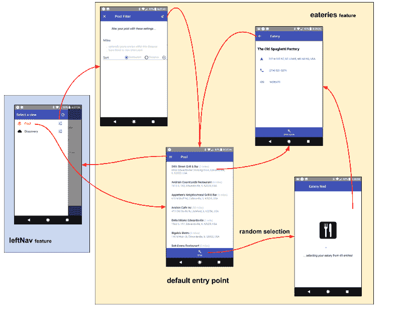

# feature-u(基于特性的 React 项目组织)

> 原文：<https://www.freecodecamp.org/news/feature-u-cf3277b11318/>

作者:凯文·布里吉斯

# Feature-u:(React 的基于特性的项目组织)


本文介绍了[feature-u](https://feature-u.js.org/)—**在您的 [react](https://reactjs.org/) 项目中为**基于特性的项目组织**提供便利的库。此实用程序有助于按单个功能组织项目。**

**大多数开发人员都会同意，通过特性来组织项目比基于类型的模式更可取。因为**应用领域在现实世界中增长**，项目**按类型组织**根本无法扩展，它只是变得难以管理！**

**有许多关于这个主题的好文章，对基于功能的设计和结构有深刻的见解(参见:[参考资料](#15dd))。**

**这篇文章概述了我对基于特征的合成的探索。在研究细节的过程中，我意识到有一个机会让一个图书馆来帮助管理和简化这个过程中遇到的一些障碍。结果: **feature-u** (查看[全文档](https://feature-u.js.org/)、 [GitHub 源码](https://github.com/KevinAst/feature-u)、 [NPM 包](https://www.npmjs.com/package/feature-u))。**

> *****更新***:2018 年 8 月 14 日 [feature-u V1](https://feature-u.js.org/1.0.0/history.html#v1_0_0) 发布，重新设计的 Cross[Feature Communication`new`](https://feature-u.js.org/1.0.0/crossCommunication.html)将包含 [UI Composition `new`](https://feature-u.js.org/1.0.0/crossCommunication.html#ui-composition) 作为核心产品。**在[这里](http://bit.ly/feature-u-V1)** 可以找到一篇新的文章，全面地向你介绍 **feature-u** (包括 **V1** )。我们对这次更新感到非常兴奋，因为它 ***为所有功能协作*** 推出了一个解决方案！虽然升级到 V1 需要一些客户端代码模块(参见 [V1 迁移说明](https://feature-u.js.org/1.0.0/migration.1.0.0.html))，但这是值得的。这篇文章基于 [feature-u V0](https://feature-u.js.org/0.1.3/history.html#v0_1_3) ，并且使用了一些过时的 API(主要是`Feature.publicFace`和`app`对象)。尽管如此，这仍然是一个让您接触 feature-u 的好资源。**

#### *****一瞥*****

**[背景](#e4bb) —为什么创建 feature-u**

**[feature-u 基础知识](#b996) —介绍高级 feature-u 概念**

**[eatery-nod 应用程序](#077e) —用于演示 feature-u 的示例应用程序**

**[前&后](#688e) — **饮食店—点头**项目前后结构特点**

**[feature-u In Action](#ecd3) —通过具体示例探索 feature-u 的各个方面**

**[特性-优势](#3ef6) —总结**

**[参考文献](#15dd) —基于特征的文章**

### **[背景](#e80d)**

**让我们从记录我在这个过程中的旅程开始**

#### ****走出起跑门……****

**很快…我决定根据特性来重组我的项目。从设计角度来看，在确定特征边界时有许多考虑因素。我阅读了所有的文章，并将我的设计应用于一个**新的基于特性的目录结构。****

**总的来说，我对自己的进步感觉良好。我开始看到具体的好处… **特性分离将会产生更易于管理的代码！****

#### ****跨栏…****

**然而，还有许多障碍有待解决…**

**我如何封装和隔离我的特性，同时仍然允许它们相互协作？**

**选定的特性如何引入启动初始化(甚至在根 DOM 注入实用程序)，而不依赖于某些外部启动过程？**

**我如何以一种隔离和自治的方式提升基于特性的 UI 组件？**

**既然我的代码如此分散，我该如何配置我选择的框架呢？**

**如何启用/禁用可选或需要许可证升级的选定功能？**

**简而言之，我如何将它们整合在一起，使我的个人特性作为一个应用程序运行？**

#### ****目标*(现在怎么办？)*****

**feature-u 的首要目标是双重的:**

1.  **允许功能**即插即用！这包含了很多东西，比如:封装、交叉通信、启用、初始化等等。在本文中，我们将构建这些概念。****
2.  **自动启动您的应用程序！！你具备这些特征。允许他们推广他们的特性，这样一个中央实用程序就可以**自动**配置你的应用中使用的框架，从而启动你的应用。这个任务必须以可扩展的方式完成，因为不是每个人都使用同一套框架。**

### **[feature-u Basics](#e80d)**

****feature-u** 的基本过程是每个特性提升一个[特性](https://feature-u.js.org/0.1.3/api.html#Feature)对象，该对象包含该特性的各个方面——例如特性的名称、它的公共 API、它是否被启用、初始化构造以及用于配置它在使用中的框架的资源。**

**反过来，这些特性对象被提供给 [launchApp()](https://feature-u.js.org/0.1.3/api.html#launchApp) ，它配置并启动您的应用程序运行。此外，导出返回的 [App](https://feature-u.js.org/0.1.3/api.html#App) 对象，以提升各功能的公共 API。**

#### **方面**

**在 feature-u 中，“方面”是一个广义的术语，用来指组成应用程序的各种成分。**

**方面可以采取许多不同的形式:**

*   **UI 组件和路线**
*   **状态管理(动作、缩减器、选择器)**
*   **业务逻辑**
*   **启动初始化代码**
*   **诸如此类…**

**并非所有方面都是 feature-u 感兴趣的——只有那些设置和启动应用程序所需的方面——所有其他方面都被视为该功能的内部实现细节。**

**例如，考虑 redux 状态管理器。虽然它使用了动作、reducer 和选择器……但是只需要 redux 的 reducer 来设置和配置。**

#### **框架集成**

**feature-u 的一个基本目标是**自动配置运行时堆栈中使用的框架** (s )(通过在所有特性中积累必要的资源)。因为不是每个人都使用相同的框架，feature-u 通过**可扩展方面**来实现这一点(你可以在外部 NPM 包中找到它们，或者你可以创建自己的)。**

**理解你选择的框架的接口不会以任何方式改变是很重要的。您可以像往常一样使用它们(只在您的特征边界内)。**

**feature-u 仅仅提供了一个定义良好的组织层，通过在所有特性中积累必要的资源，可以自动设置和配置框架。**

### **[eatery-nod App](#e80d)**

**[**eatery-nod**](https://github.com/KevinAst/eatery-nod/tree/after-features) 是 feature-u 被构思的应用。这是一款 [react-native](https://facebook.github.io/react-native/) [expo](https://expo.io/) 手机应用，也是我用来测试框架的沙盒应用之一。我喜欢开发我可以使用的应用程序，但要有足够的现实需求才能让它变得有趣。**

**eatery-nod 从最受欢迎的餐馆中随机选择一家“约会之夜”餐馆。我的妻子和我有一个稳定的“约会之夜”，我们总是拿不定主意去哪家我们最喜欢的餐馆:-)所以 eatery-nod 提供了纺车！**

**看一下 eatery-nod 的自述文件,感受一下这个应用程序。屏幕流是可用的，所以它真的有助于你对项目的定位。**

**

**eatery-nod’s** primary screen flow** 

**此外，[自述文件](https://github.com/KevinAst/eatery-nod/blob/after-features/src/feature/README.md)可在每个特性中找到，描述了每个特性的功能。现在花些时间浏览这些资源:**

*   **[**设备**](https://github.com/KevinAst/eatery-nod/blob/after-features/src/feature/device/README.md) —初始化设备以供 app 使用，并升级设备 API 抽象**
*   **[**认证**](https://github.com/KevinAst/eatery-nod/blob/after-features/src/feature/auth/README.md) —促进完整的用户认证**
*   **[**leftNav**](https://github.com/KevinAst/eatery-nod/blob/after-features/src/feature/leftNav/README.md) —提升应用左侧的特定抽屉/侧边栏**
*   **[**当前视图**](https://github.com/KevinAst/eatery-nod/blob/after-features/src/feature/currentView/README.md) —用获取/设置跨特征通信绑定维护当前视图**
*   **[](https://github.com/KevinAst/eatery-nod/blob/after-features/src/feature/eateries/README.md)****—管理和推广餐饮景观******
*   ******[**发现**](https://github.com/KevinAst/eatery-nod/blob/after-features/src/feature/discovery/README.md) —管理和提升发现视图******
*   ****[**Firebase**](https://github.com/KevinAst/eatery-nod/blob/after-features/src/feature/firebase/README.md)**—初始化 Google Firebase 服务******
*   ******[](https://github.com/KevinAst/eatery-nod/blob/after-features/src/feature/logActions/README.md)****—记录所有调度的动作和结果状态**********
*   ******[**沙盒**](https://github.com/KevinAst/eatery-nod/blob/after-features/src/feature/sandbox/README.md) —促进各种交互式测试，用于开发中，可以很容易地被禁用******

### ****[之前&之后](#e80d)****

****任何认识我的人都会告诉你，我欣赏良好的前/后分析。无论是家居改造还是软件重构，它都有助于记录你去过哪里，从而量化具体的成就，并给你一种成就感。****

********

****我们来看看 eatery-nod 的目录结构(前/后)。****

****为了便于说明，我只展开了几个目录，但是我想您已经明白了。****

******之前:这是我项目的[之前的特色](https://github.com/KevinAst/eatery-nod/tree/before-features/src) …******

```
****`eatery-nod src BEFORE featuressrc/├──actions/        ... redux actions│     auth.js│     discovery.js│     eateries.js│     ... snip snip├──api/            ... various abstract APIs│     device.js│     discovery.js│     ... snip snip├──app/            ... mainline startup **1**│  │  ScreenRouter.js│  │  SideBar.js│  │  index.js│  └──startup/│     │  createAppStore.js│     │  platformSetup.android.js│     │  platformSetup.ios.js│     └──firebase/│           firebaseAppConfig.js│           initFireBase.js├──appState/       ... redux reducers│     auth.js│     discovery.js│     eateries.js│     ... snip snip├──comp/           ... UI Component Screens│     DiscoveryListScreen.js│     EateriesListScreen.js│     ... snip snip├──logic/          ... redux-logic modules│     auth.js│     discovery.js│     eateries.js│     ... snip snip└──util/           ... common utilities`****
```

******之后**:这是同一个项目的[之后](https://github.com/KevinAst/eatery-nod/tree/after-features/src) …********

```
**`eatery-nod src AFTER featuressrc/│  app.js          ... launches app via launchApp() **2**├──feature/│  │  index.js     ... accumulate/promote all app Feature objects│  ├──auth/        ... the app's authorization feature│  │  │  actions.js│  │  │  featureName.js│  │  │  index.js│  │  │  logic.js│  │  │  publicFace.js│  │  │  route.js│  │  │  signInFormMeta.js│  │  │  state.js│  │  └──comp/│  │        SignInScreen.js│  │        SignInVerifyScreen.js│  ├──currentView/ ... other features│  ├──device/      ... feature to initialize the device│  │  │  actions.js│  │  │  api.js│  │  │  appDidStart.js│  │  │  appWillStart.js│  │  │  featureName.js│  │  │  index.js│  │  │  logic.js│  │  │  publicFace.js│  │  │  route.js│  │  │  state.js│  │  └──init/│  │        platformSetup.android.js│  │        platformSetup.ios.js│  ├──discovery/   ... more features│  ├──eateries/│  ├──firebase/│  ├──leftNav/│  ├──logActions/│  └──sandbox/└──util/           ... common utilities used across all features`**
```

****不出所料，项目组织的差异是戏剧性的！****

*   ******Before features —** 您会发现给定特性的构造分布在许多类型化的目录中。****
*   ******After features** :给定特性的所有方面都包含在它自己的独立目录中。****
*   ****一个显著的不同是**大大降低了应用程序启动过程的复杂性！**“前功能”包含一个完整的启动代码`app\`目录(见上文`[**1**](#226c)`),而“后功能”仅包含一个`app.js`启动文件(见上文`[**2**](#f98f)`)。所有的复杂性都去哪里了？...敬请期待！****

### ****[feature-u In Action](#e80d)****

****为了更好地理解 feature-u，让我们仔细看看一些 eatery-nod 的实际例子。****

********

****下面的每一节都简要介绍了一个新的 feature-u topic，它关联了 eatery-nod 的示例代码。额外的信息通过链接提供，既有 feature-u 文档，也有 eatery-nod 源代码。在某些情况下，内嵌的示例代码已经被简化了(以强调重点)，但是标题链接会把你带到实际的代码(托管在 GitHub 上)。****

****以下是我们的话题…****

1.  ****[简化的 App 启动](#5974)****
2.  ****[React 平台](#af00)****
3.  ****[特征对象](#6db0)****
4.  ****[功能初始化](#c1a5)****
5.  ****[功能协作](#1895)****
6.  ****[框架整合](#cfeb)****
7.  ****[功能启用](#e557)****
8.  ****[托管代码扩展](#5fab)****
9.  ****[UI 组件升级](#2666)****
10.  ****[真相的单一来源](#c174)****

### ****[1。简化的应用启动](#6561)****

****在将你的应用程序分成几个部分(包括特性)之后，你如何将它们重新组合在一起，并让你的应用程序真正开始运行？乍一看，这似乎是一项艰巨的任务。然而，事实证明，由于 feature-u 所提倡的结构，这实际上是一个非常简单的过程。****

****为了解决这个问题，feature-u 提供了`[launchApp()](https://feature-u.js.org/0.1.3/api.html#launchApp)`功能(参见:[启动您的应用程序](https://feature-u.js.org/0.1.3/detail.html#launching-your-application))。****

****这里是 eatery-nod 的主线…****

****首先要注意的是主线启动过程是多么简单和普通。没有真正的应用程序特定的代码…甚至没有任何全局初始化！****

****这是因为 feature-u 提供了各种挂钩，允许您的特性注入它们自己的特定于应用程序的结构。****

****主线只是积累方面和特性，通过调用`launchApp()`启动 app。****

****以下是一些重要的兴趣点(将上面代码中的数字与`*n*`匹配):****

1.  ****`([*1*](#a002))`所提供的方面(从单独的 NPM 包中提取)反映了我们的运行时栈的框架(在我们的例子中是`[redux](http://redux.js.org/)`、`[redux-logic](https://github.com/jeffbski/redux-logic)`和`[feature-router](https://github.com/KevinAst/feature-router)`，并分别扩展了可接受的特性属性——`Feature.reducer`、`Feature.logic`和`Feature.route`。(参见[可扩展方面](https://feature-u.js.org/0.1.3/detail.html#extendable-aspects))。****
2.  ****`([*2*](#a002))`所有应用程序功能都是从我们的`feature/`目录中积累的****
3.  ****`([*3*](#a002))`作为对[功能协同](#1895)的预览，`launchApp()`导出的返回值是一个`App`对象，提升所有功能的累积公共 API。****

### ****[2。React 平台](#6561)****

****在上面的例子中(参见`[*4*](#a002)`)，你可以看到`launchApp()`使用一个`[registerRootAppElm()](https://feature-u.js.org/0.1.3/api.html#registerRootAppElmCB)`回调钩子将提供的`rootAppElm`注册到正在使用的特定 React 平台。因为这种注册是由特定于应用的代码完成的，所以 feature-u 可以在任何 React 平台上运行(参见 [React 注册](https://feature-u.js.org/0.1.3/detail.html#react-registration))。****

****以下是一些变化:****

****[反应网](https://reactjs.org/):****

****[react-native](https://facebook.github.io/react-native/) :****

****[世博会](https://expo.io/):****

### ****[3。特征对象](#6561)****

****每个特性都位于自己的目录中，并通过一个`Feature`对象(使用`[createFeature()](https://feature-u.js.org/0.1.3/api.html#createFeature)`)提升方面内容。****

****这里有一个来自 eatery-nod 的[设备](https://github.com/KevinAst/eatery-nod/blob/after-features/src/feature/device/README.md)功能的例子。****

****正如你所看到的，`Feature`对象仅仅是一个容器，保存 feature-u 感兴趣的方面内容。`Feature`对象的唯一目的是将这个方面信息传递给`launchApp()`。****

****稍后我们将补充更多的细节，但是现在请注意，这个特性正在传送 reducers、逻辑模块、路由，并执行某种类型的初始化(`appWillStart` / `appDidStart`)。它还促进了一个可以被其他特性使用的`publicFace`(比如特性的公共 API)。****

****更多信息请参考[特性&方面内容](https://feature-u.js.org/0.1.3/detail.html#feature-object-relaying-aspect-content)。****

### ****[4。功能初始化](#6561)****

****任何给定的特性都不应该依赖外部启动进程来执行它所需要的初始化。相反，该特性应该能够产生它所依赖的初始化。****

****这可以是任何数量的东西，例如:****

*   ****初始化一些服务 API****
*   ****在应用程序根注入一个实用的 react 组件****
*   ****分派启动启动进程的操作****
*   ****更多...****

****为了解决这个问题，feature-u 引入了两个[应用生命周期挂钩](https://feature-u.js.org/0.1.3/appLifeCycle.html)，通过以下特性方面注入:****

1.  ****`[Feature.appWillStart({app, curRootAppElm}): rootAppElm || falsy](https://feature-u.js.org/0.1.3/appLifeCycle.html#appwillstart)`在应用程序启动前调用一次。这可以做任何类型的初始化，包括补充 app 的顶级根元素(比如 React `component`实例)。****
2.  ****`[Feature.appDidStart({app, appState, dispatch}): void](https://feature-u.js.org/0.1.3/appLifeCycle.html#appDidStart)`
    在应用程序启动后立即调用一次。这个钩子的典型用法是分派某种类型的`bootstrap action`。****

****以下是 eatery-nod 的一些例子:****

****FireBase 初始化:****

****引导动作:****

****注入 DOM 根榆树:****

### ****[5。功能协作](#6561)****

****即使特性的实现是封装的，它仍然需要与周围环境交互。更复杂的是，一个特性不应该从另一个特性导入资源，因为它应该努力做到即插即用。因此，我们需要一个定义良好的基于特性的公共 API。****

****为了解决这个问题，feature-u 推出了一个[交叉功能通信](https://feature-u.js.org/0.1.3/crossCommunication.html)。这是通过`Feature.publicFace` [内置的方面](https://feature-u.js.org/0.1.3/detail.html#built-in-aspects)属性来完成的。一个特性可以通过它的`publicFace`暴露任何它认为必要的东西。这个资源没有真正的限制。它是真正开放的。****

****通常，这包括促进选定的:****

*   ****行动****
*   ****选择器****
*   ****蜜蜂****
*   ****等等****

****所有特征的`publicFace`通过`App`对象(从`launchApp()`发出)累积并曝光。****

****它包含命名的要素节点，如下所示:****

```
**`App.{featureName}.{publicFace}`**
```

****这里有一个来自 eatery-nod 的 [auth](https://github.com/KevinAst/eatery-nod/blob/after-features/src/feature/auth/README.md) 特性的例子。****

****在`auth`特性的所有项目中，只有两个动作和一个选择器是公共的。****

****下面是这个例子中的`App`对象的样子:****

```
**`app: {  auth: {    actions: {      userProfileChanged(userProfile),      signOut(),    },    sel: {      getUserPool(appState),    },  },  currentView: {   // other features    ... snip snip  },}`**
```

****因此，`auth`特性的公共 API 可以如下访问:****

```
**`app.auth.actions.userProfileChanged(userProfile)app.auth.actions.signOut()app.auth.sel.getUserPool(appState)`**
```

### ****[6。框架整合](#6561)****

****很可能你的应用程序使用了一个或多个框架(比如`redux` 或`[redux-logic](https://github.com/jeffbski/redux-logic)`)。这些框架所需的资源是如何在你的应用的众多特性中积累和配置的？****

****为了解决这个问题，feature-u 引入了[可扩展方面](https://feature-u.js.org/0.1.3/detail.html#extendable-aspects)。**特征-u** 是[可延伸](https://feature-u.js.org/0.1.3/extending.html)。它提供了您的特性和您选择的框架之间的集成点。****

****可扩展的方面与 feature-u 分开打包，以免引入不必要的依赖(因为不是每个人都使用相同的框架)。您可以根据项目中使用的框架(与项目的运行时堆栈相匹配)来挑选它们。它们是用 feature-u 的可扩展 API 创建的，使用了 [createAspect()](https://feature-u.js.org/0.1.3/api.html#createAspect) 。如果您需要的方面还不存在，您可以定义自己的方面。****

****让我们看一个来自 eatery-nod 的 redux 例子。****

****`device`特性维护它自己的状态树切片。****

****它通过`Feature.reducer`方面提升其减速器:****

****因为`Feature.reducer`是一个扩展的方面(而不是内置的方面)，所以它只有在我们注册了[功能——将](https://github.com/KevinAst/feature-redux) `reducerAspect`还原为`launchApp()`(请参考上面的[简化 App 启动](#5974))时才可用。****

****需要理解的关键是，feature-u(通过 feature-redux 扩展)将通过将所有特性缩减器累积到一个整体 appState 中来自动配置 redux。****

****这是减速器代码…****

****基于特性的缩减器只是一个普通的缩减器，它管理整个 appState 的特性部分。唯一的区别是它必须用`[slicedReducer()](https://github.com/KevinAst/feature-redux#slicedreducer)`来修饰，它提供了在整个顶级 appState 中何处插入它的指令。****

****因此，`device` reducer 只维护与`device`特性相关的状态(就像它的一小部分世界)——一个状态、一个字体加载指示器和设备位置。****

******侧栏**:我们正在使用 [astx-redux-util](https://astx-redux-util.js.org/) 实用程序的`[reducerHash()](https://astx-redux-util.js.org/1.0.0/api.html#reducerHash)`函数来简洁地实现特性的缩减器(提供了一个通用 switch 语句的替代方案)。我发现，在使用这样的实用程序时，大多数情况下，在一个文件中实现一个特性的所有缩减器是可行的(部分原因是特性的边界较小)。astx-redux-util 还促进其他[高阶减速器](https://medium.com/@mange_vibration/reducer-composition-with-higher-order-reducers-35c3977ed08f)的发展。您可能想看看这个。****

### ****[7。功能启用](#6561)****

****您的某些功能可能需要动态启用或禁用。例如，某些功能可能仅通过许可证升级来启用，或者其他功能可能仅用于诊断目的。****

****为了解决这个问题，feature-u 引入了[特性启用](https://feature-u.js.org/0.1.3/enablement.html)。使用`Feature.enabled`内置方面(一个布尔属性)，您可以启用或禁用您的特性。****

****以下是 eatery-nod 的[沙盒](https://github.com/KevinAst/eatery-nod/blob/after-features/src/feature/sandbox/README.md)功能的一个例子:****

****沙箱特性促进了开发中使用的各种交互式测试，这些测试很容易被禁用。****

****通常，该指标基于动态表达式，但在这种情况下，它只是硬编码的(由开发人员设置)。****

******侧边栏**:当其他功能与一个可以禁用的功能交互时，您可以使用`App`对象来确定一个功能是否存在(更多信息请参见:[功能启用](https://feature-u.js.org/cur/enablement.html))。****

### ****[8。托管代码扩展](#6561)****

****一般来说，在内联代码扩展期间访问**导入的资源**可能会有问题，这是由于这些资源被扩展的顺序。feature-u `App`对象是如此关键的资源(因为它促进了所有特性的公共 API)，**它必须在代码扩展期间可用**。换句话说，我们不能依赖于在代码扩展期间解析“导入的应用程序”。****

****为了解决这个问题，feature-u 引入了[托管代码扩展](https://feature-u.js.org/0.1.3/crossCommunication.html#managed-code-expansion)。****

****当方面内容定义在代码扩展时需要`App`对象时，只需将定义包装在`[managedExpansion()](https://feature-u.js.org/0.1.3/api.html#managedExpansion)`函数中。换句话说，方面内容可以是实际的内容本身(比如一个缩减器)，也可以是返回内容的函数。****

****完成后，feature-u 将通过受控方式调用它来扩展它，将完全解析的`App`对象作为参数传递。****

****以下是 eatery-nod 的 [auth](https://github.com/KevinAst/eatery-nod/blob/after-features/src/feature/auth/README.md) 特性的逻辑模块:****

****您可以看到 auth 特性正在使用来自[设备](https://github.com/KevinAst/eatery-nod/blob/after-features/src/feature/device/README.md)特性的动作，要求访问`app`对象(参见`[*2*](#8030)`)。因为在代码扩展期间需要`app`对象，所以我们使用`managedExpansion()`函数(参见`[*1*](#8030)`，允许 feature-u 以可控的方式扩展它，将完全解析的`app`对象作为参数传递。****

### ****[9。UI 组件升级](#6561)****

****维护自己的 UI 组件的特性需要一种方法来在整个应用程序的 GUI 中提升它们。因为特性是封装的，这是如何以自主的方式完成的？****

****为了解决这个问题，feature-u 建议考虑通过[特征路由器](https://github.com/KevinAst/feature-router)可扩展方面(单独包装)的[基于特征的路线](https://feature-u.js.org/0.1.3/featureRouter.html)。这种方法甚至可以与其他导航解决方案结合使用。****

****特性路线基于一个非常简单的概念:允许应用程序状态驱动路线！它通过一系列基于特征的路由函数进行操作，这些函数对 appState 进行推理，或者返回一个呈现的组件，或者返回 null 以允许下游路由有相同的机会。****

****这里有一个来自[设备](https://github.com/KevinAst/eatery-nod/blob/after-features/src/feature/device/README.md)功能的简单例子。****

****该路径分析当前的 appState，并显示一个闪屏，直到系统准备就绪:****

****在基于特征的路由中，您将不会找到典型的“路由路径到组件”映射目录，其中(例如)一些伪`route('device')`指令导致设备屏幕显示，这又导致系统通过适当地调整其状态来适应请求。****

****相反，会对 appState 进行分析，如果设备没有准备好，甚至不会给其他屏幕提供呈现的选项...很简单！****

****根据您的观点，这种方法可以更自然，但更重要的是，它允许功能以封装和自治的方式推广自己的屏幕。****

### ****10。真相的单一来源****

****特性实现(像所有编码结构一样)应该努力遵循**单一事实来源**原则。在这样做的过程中，一行代码的修改可能会传播到实现的许多方面。****

****什么是与特性相关的单源事实的最佳实践，以及 feature-u 有什么帮助？****

****[最佳实践](https://feature-u.js.org/0.1.3/bestPractices.html)部分重点介绍了许多基于特征的单一事实来源项目。这些是指导原则，因为您必须在您的应用程序代码中实现它们(feature-u 不控制这一点)。****

****这里有一个来自[餐馆](https://github.com/KevinAst/eatery-nod/blob/after-features/src/feature/eateries/README.md)功能的例子:****

****`featureName`用于指定该特征的顶级状态位置(见`[*1*](#d59b)`)。feature-u 保证特征名是唯一的。因此，它可以用来限定几个特征方面的身份。****

****例如:****

*   ****用 featureName 作为动作类型的前缀，保证它们在应用范围内的唯一性(参见: [feature-redux](https://github.com/KevinAst/feature-redux#action-uniqueness-single-source-of-truth) docs)****
*   ****用特性名称作为逻辑模块名称的前缀，标识该模块所在的位置(见:[特性-冗余-逻辑](https://github.com/KevinAst/feature-redux-logic#single-source-of-truth)文档)****
*   ****根据上下文，特征名可用作特征状态形状的根(见:[特征-冗余](https://github.com/KevinAst/feature-redux#state-root-single-source-of-truth)文档)****

****因为 feature-u 依赖于`[slicedReducer()](https://github.com/KevinAst/feature-redux#slicedreducer)`(在 feature-redux 包中)，所以最佳实践是使用 reducer 的修饰选择器在所有选择器定义中限定您的特性状态根。因此，切片定义保持在一个点上(见`[*2*](#d59b)`)。****

### ****[特色优势](#e80d)****

****总之，使用 feature-u 的好处包括:****

*   ******特性封装** —隔离特性实现提高了代码的可管理性****
*   ******跨特性通信** —一个特性的公共 API 通过一个明确定义的标准来提升****
*   ******功能启用** —通过运行时开关启用/禁用功能****
*   ******应用生命周期挂钩** —特性可以在不依赖外部进程的情况下自行初始化****
*   ******单一事实来源**——在一个特性的实现中，有多种方式可以实现****
*   ******框架集成** —使用 feature-u 的可扩展 API 配置您选择的框架(匹配您的运行时堆栈)****
*   ******UI 组件升级** —通过特征路线****
*   ******最小化特征顺序依赖性问题**——即使在内嵌扩展的代码中****
*   ******即插即用** —可轻松添加/删除功能****
*   ******简化主线** — `launcApp()`通过配置使用中的框架启动应用程序运行，所有这些都由一组简单的功能驱动。****
*   ******运行于任何 React 平台**(包括 React Web、React Native 和 Expo)****

****希望这篇文章能让你感受到 feature-u 是如何改进你的项目的。更多详情请参考[完整文档](https://feature-u.js.org/)。****

****feature-u 允许您将注意力集中在功能的“业务端”!往前走，开始计算！！****

### ****[参考文献](#e80d)****

*   ****基于特性的 React 开发方法 … Ryan Lanciaux****
*   ****如何更好地组织 React 应用程序？ …亚历克西斯·曼金****
*   ****[如何在高可伸缩的 javascript 应用上使用 Redux？](https://medium.com/@alexmngn/how-to-use-redux-on-highly-scalable-javascript-applications-4e4b8cb5ef38) …亚历克西斯·曼金****
*   ****[构建 React 应用程序的 100%正确的方法(或者为什么没有这样的东西)](https://hackernoon.com/the-100-correct-way-to-structure-a-react-app-or-why-theres-no-such-thing-3ede534ef1ed) …大卫·吉尔伯森****
*   ****[Redux 用于大型 web 应用中的状态管理](https://blog.mapbox.com/redux-for-state-management-in-large-web-apps-c7f3fab3ce9b) …大卫·克拉克****