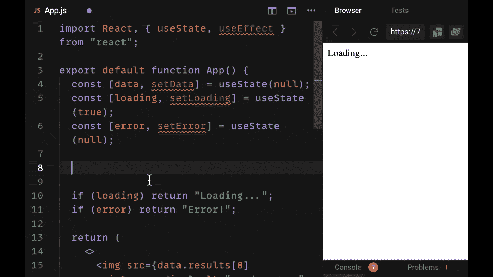
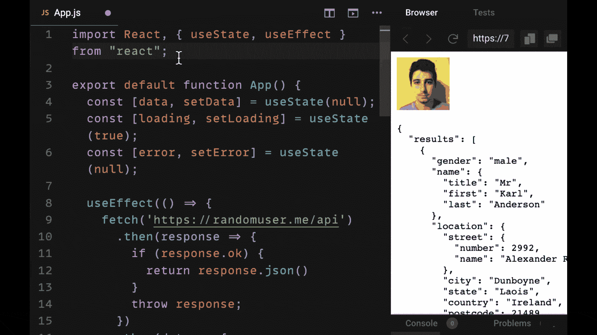
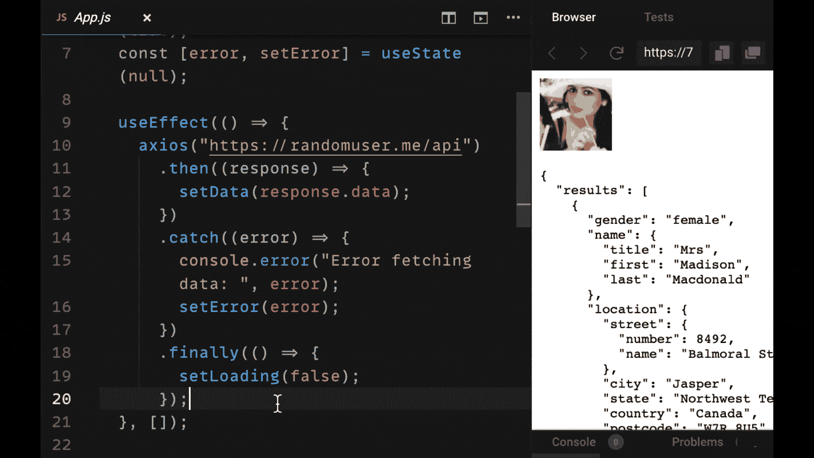
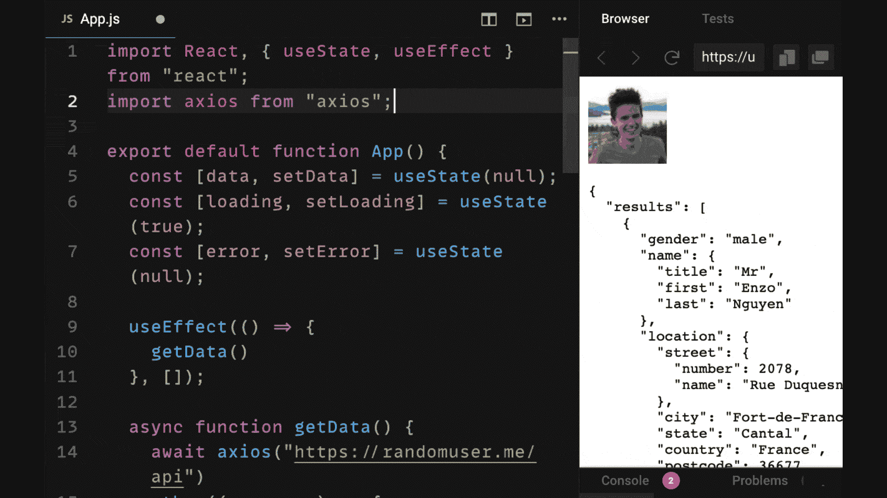
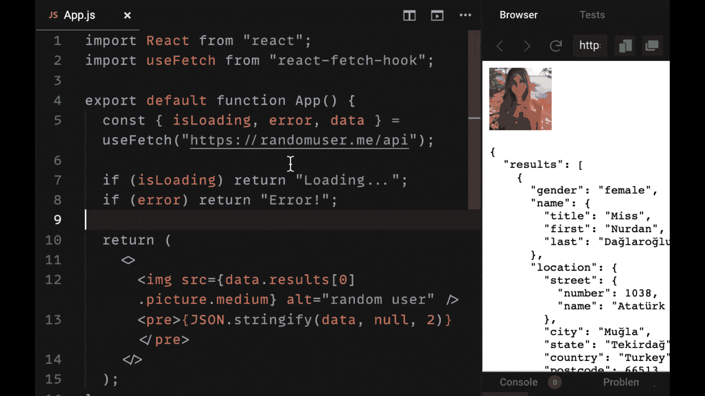

# 如何在 React 中获取数据:备忘单+示例

> 原文：<https://www.freecodecamp.org/news/fetch-data-react/>

在 React 中，有许多方法可以从外部 API 获取数据。但是，在 2021 年，您的应用程序应该使用哪一种呢？

在本教程中，我们将回顾五种最常用的通过向 REST API 发出 HTTP 请求来获取数据的模式。

我们不仅将讨论如何获取数据，还将讨论在获取数据时如何最好地处理加载和错误状态。

我们开始吧！

> 对于所有这些例子，我们将使用来自流行的 JSON Placeholder API 的端点，但是您也可以使用您自己创建的 API(比如带有 Express 的节点 API)或任何其他公共 API。

### 想要你自己的副本吗？‬

**[点击此处下载 PDF 格式的备忘单](http://bit.ly/react-fetch-data-2021)** (耗时 5 秒)。

它包括所有的基本信息，作为一个方便的 PDF 指南。

## 1.如何使用获取 API 在 React 中获取数据

用 React 获取数据最容易的方法是使用 Fetch API。

Fetch API 是一个内置在大多数现代浏览器的窗口对象(`window.fetch`)上的工具，它使我们能够使用 JavaScript promises 非常容易地发出 HTTP 请求。

要用 fetch 发出一个简单的 GET 请求，我们只需要包含我们要向其发出请求的 URL 端点。我们希望在 React 组件挂载后发出这个请求。

为此，我们在 useEffect 钩子中发出请求，并确保提供一个空的 dependencies 数组作为第二个参数，这样我们的请求只发出一次(假设它不依赖于组件中的任何其他数据)。



在第一个`.then()`回调中，我们检查响应是否正常(`response.ok`)。如果是这样，我们返回我们的响应以传递给下一个，然后作为 JSON 数据回调，因为这是我们将从随机用户 API 返回的数据。

如果这不是一个好的响应，我们就认为发出请求时出错了。使用 fetch，我们需要自己处理错误，所以我们抛出`response`作为错误，由我们的`catch`回调来处理。

在我们的示例中，我们将错误数据置于状态为`setError`的状态。如果有错误，我们返回文本“错误！”。

> 注意，您也可以使用`error.message`显示来自我们置于状态的错误对象的错误消息。

我们使用`.finally()`回调函数作为当我们的承诺成功或失败时调用的函数。在其中，我们将`loading`设置为 false，这样我们就看不到我们的加载文本了。

相反，如果请求成功，我们会在页面上看到我们的数据，如果不成功，我们会看到请求出错。

## 2.如何使用 Axios 在 React 中获取数据

用 React 发出请求的第二种方法是使用库`axios`。

在本例中，我们将简单地修改我们的 Fetch 示例，首先使用 npm 安装`axios`:

```
npm install axios
```

然后，我们将在组件文件的顶部导入它。

axios 使我们能够使用与 fetch 完全相同的 promise 语法——但不是使用我们的 first then 回调来手动确定响应是否正确并抛出错误，而是由 axios 为我们处理。

此外，它使我们能够在第一个回调中从`response.data`获取 JSON 数据。

使用 axios 的便利之处在于，它有一个更短的语法，允许我们减少代码，并且它包括许多 Fetch API 中没有的工具和功能。

所有这些原因都是它成为 React 开发人员首选的 HTTP 库的原因。



## 3.如何使用 async / await 语法在 React 中提取数据

在 ES7 中，使用`async / await`语法解析承诺成为可能。

这样做的好处是，它使我们能够删除我们的`.then()`、`.catch()`和`.finally()`回调，并简单地取回我们异步解析的数据，就好像我们正在编写同步代码而没有任何承诺一样。

换句话说，当我们在 React 中使用 async / await 时，我们不必依赖回调。

我们必须意识到这样一个事实，当我们使用`useEffect`时，效果函数(第一个参数)不能成为`async`函数。

如果我们看一看 React 给我们的林挺错误[，如果我们使用 Create React App](https://reedbarger.com/create-react-app-10-steps) 来构建我们的项目，我们将被告知这个函数不能是异步的，以防止竞态条件。



因此，我们可以简单地在组件中创建一个单独的异步函数，我们可以同步调用它，而不是让这个函数异步。也就是前面没有`await`关键字。

在这个例子中，我们创建了一个名为`getData`的异步函数。通过在 useEffect 中同步调用它，我们可以像预期的那样获取数据。

## 4.如何在 React 中使用自定义 React 挂钩(useFetch)获取数据

随着时间的推移，您可能会意识到，在您想要获取数据的每个组件中编写带有所有样板文件的 useEffect 钩子会变得有些乏味和耗时。

为了减少我们重用的代码，我们可以使用一个定制的钩子作为特殊的抽象，我们可以从第三方库自己编写(就像我们在这里一样，使用库`react-fetch-hook`)。

一个定制的钩子使得我们的 HTTP 请求可以让我们的组件更加简洁。我们要做的就是在组件的顶部调用我们的钩子。



在这种情况下，我们获得了所有的数据、加载和错误状态，我们需要能够像以前一样为我们的组件使用相同的结构，但是不需要`useEffect`。此外，我们不再需要在每次想要发出请求时，强制性地编写如何从 GET 请求中解析我们的承诺。

## 5.如何使用 React 查询库在 React 中获取数据

使用定制钩子是编写更简洁的 HTTP 请求来获取数据及其所有相关状态的好方法。但是 React Query 是一个真正将钩子取数据提升到下一个层次的库。

React Query 不仅允许我们使用可以在组件间以简洁的方式重用的定制挂钩，而且它还为我们提供了大量的状态管理工具，以便能够控制何时、如何以及多久获取一次数据。

特别是，React query 给了我们一个缓存，你可以在下面通过 React Query Devtools 看到。这使我们能够根据我们为每个请求指定的键值轻松地管理我们所做的请求。

对于下面的请求，我们对随机用户数据的查询由字符串‘random-user’标识(作为第一个参数提供给`useQuery`)。



通过引用那个键，我们可以做一些强大的事情，比如重新提取、验证或重置我们的各种查询。

> 如果我们依赖我们的定制钩子解决方案或 useEffect，我们将在每次组件被挂载时重新获取我们的数据。在大多数情况下，这样做是不必要的。如果我们的外部状态没有改变，我们就不应该在每次显示组件时都显示加载状态。

React Query 通过尝试首先从缓存中提供数据，然后在后台更新数据以显示 API 状态的变化，极大地改善了用户体验。

它还为我们提供了一个强大的工具库，可以根据数据在请求过程中的变化来更好地管理我们的请求。

例如，如果我们的应用程序允许我们添加一个不同的用户，一旦用户被添加，我们可能想要重新提取那个查询。如果我们知道查询被频繁地更改，我们可能希望指定它应该每分钟左右刷新一次。或者每当用户聚焦他们的窗口标签时被刷新。

简而言之，React Query 不仅能以简洁的方式发出请求，还能高效地管理应用程序组件中为 HTTP 请求返回的数据。

## 想保留此指南以供将来参考吗？‬

**[点击此处下载有用的 PDF 格式备忘单](http://bit.ly/react-fetch-data-2021)。**

当您获得可下载版本时，您将获得 3 个快速胜利:

*   您将获得大量可复制的代码片段，以便在您自己的项目中重用。
*   这是一个很好的参考指南，可以加强你作为 React 开发人员的技能，也可以用于工作面试。
*   你可以在任何你喜欢的地方拿走、使用、打印、阅读和重读这个指南。