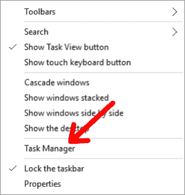
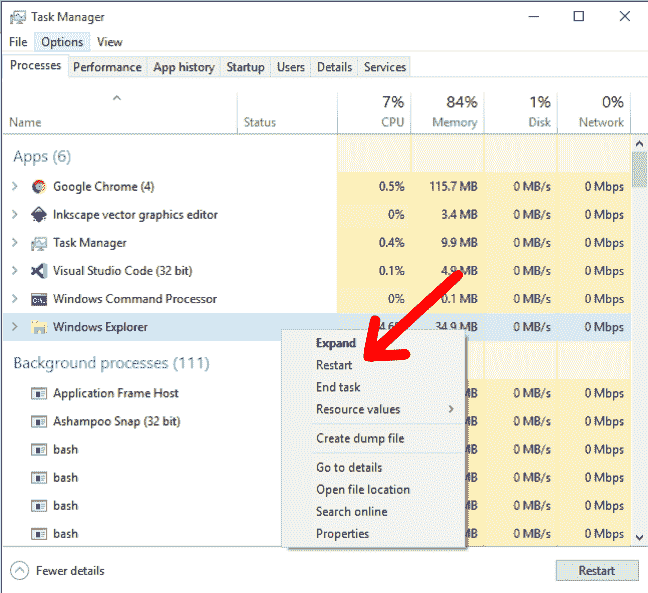
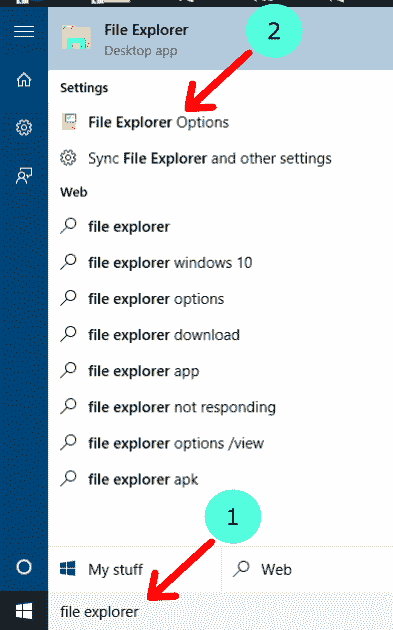
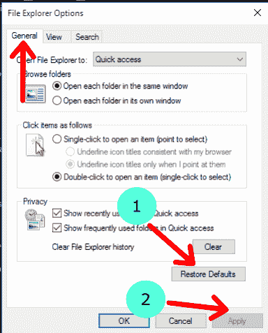
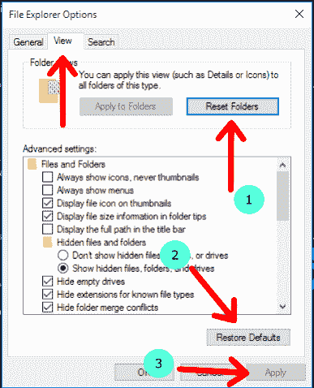
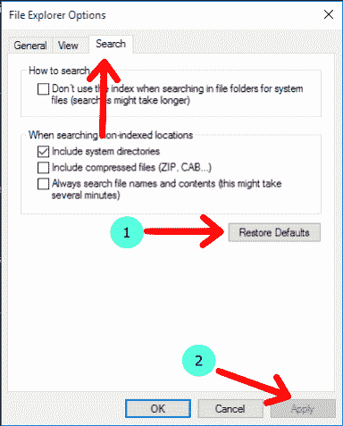
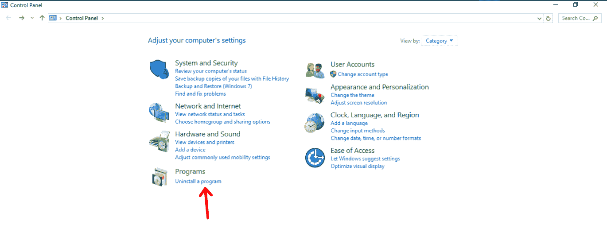
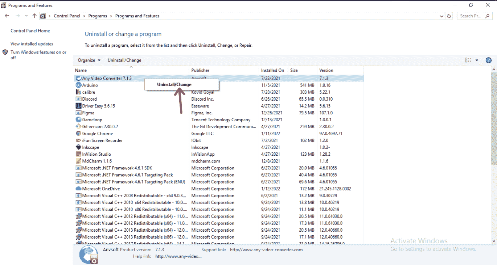
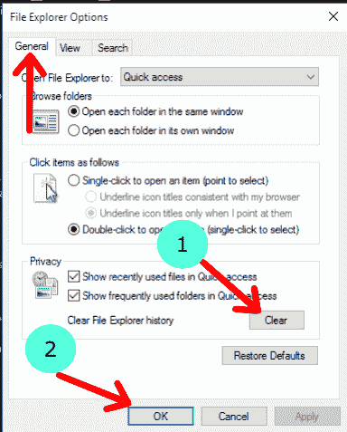

# 文件资源管理器没有响应–已在 Windows 10 PC 上修复

> 原文：<https://www.freecodecamp.org/news/file-explorer-not-responding-fixed-on-windows-10-pc/>

文件浏览器是一个管理文件的应用程序。它也被称为 Windows 资源管理器。它是微软视窗操作系统的内置应用程序之一。

文件浏览器是非常重要的，因为它可以帮助你组织和管理你电脑中的文件。

有时，文件资源管理器停止响应，您无法再与应用程序的界面进行交互。在这篇文章中，我们将看到一些解决这个问题的方法。

## 如何通过使用任务管理器重新启动文件资源管理器来修复文件资源管理器不响应的问题

以下步骤将向您展示如何修复无响应的文件资源管理器窗口:

### 步骤 1 -打开任务管理器

你可以通过使用快捷命令 **Ctrl + Shift + Esc** 来实现。或者，您应该能够在右键单击任务栏时打开任务管理器。那就是:

Open task manager from taskbar

### 步骤 2 -从任务管理器重新启动文件资源管理器

当您成功启动任务管理器时，您应该会看到有关您的 PC 上运行的进程的信息。

滚动并找到 Windows 资源管理器，然后右键单击。右键单击后，您应该会看到各种选项-我们正在寻找的是重新启动选项。我的意思是:

Restart windows explorer

单击“重新启动”后，文件资源管理器将关闭，然后自动再次打开。新的文件浏览器窗口应该工作正常。

## 如何通过恢复文件资源管理器默认值来修复文件资源管理器不响应的问题

自定义我们的文件浏览器有时会使它变得没有反应。因此，将它重置为默认值可能会让它再次变得更加灵敏。

### 步骤 1 -搜索文件资源管理器选项

为此，请转到任务栏上的搜索框。在搜索框中，键入“文件资源管理器选项”。

search box 

search for file explorer options

### 步骤 2 -在常规选项卡中恢复默认值

*   单击常规选项卡。
*   点击“恢复默认值”。
*   点击“应用”。

restore defaults in General tab

### 步骤 3 -在视图选项卡中恢复默认值

*   单击查看选项卡。
*   点击“重置文件夹”。
*   点击“应用”。

restore defaults in View tab

### 步骤 3 -在搜索选项卡中恢复默认值

*   单击搜索选项卡。
*   点击“恢复默认值”。
*   点击“应用”。

restore defaults in Search tab

## 如何通过卸载未使用和不相关的应用程序来修复文件资源管理器不响应

通过卸载不相关的应用程序，您可以为您的电脑提供更多的处理空间。

### 步骤 1 -搜索并打开控制面板

就像上一节的第一步一样，点击任务栏上的搜索框，输入“控制面板”，然后启动程序。

### 第 2 步-点击卸载程序

在控制面板选项中，单击程序选项正下方的“卸载程序”选项。

control panel

### 第 3 步-右击应用程序卸载

*   右键单击要卸载的应用程序。
*   单击卸载并等待应用程序被卸载。

uninstall program from control panel

卸载您不想要的应用程序后，您应该重新启动电脑。

## 如何通过禁用启动应用程序来修复文件资源管理器不响应

启动应用程序将在启动计算机后立即运行。有些人在你不知情的情况下跑了。

禁用启动应用程序可以让您的电脑平稳运行，不会有不需要的后台应用程序减慢其他进程。以下步骤将向您展示如何做到这一点。

### 步骤 1 -打开任务管理器

回想一下，您可以通过 **Ctrl + Shift + Esc** 命令或右击任务栏获得以下选项来完成此操作:

open task manager from taskbar

### 第 2 步-转到启动标签，禁用应用程序

*   单击启动选项卡。
*   右键单击任何你不想在启动时运行的启动应用程序。
*   点击“禁用”。

disable startup applications

## 如何通过清除文件资源管理器历史来修复文件资源管理器不响应的问题

Windows 文件资源管理器跟踪最近打开的文件夹和文件。这些可以在快速访问部分看到。

有时，清除此历史记录可以减少实例中正在处理的数据量，并使您的文件资源管理器保持响应。以下是帮助您做到这一点的步骤:

### 步骤 1 -搜索文件资源管理器选项

单击任务栏上的搜索框，然后键入“文件浏览器选项”:

search box

file explorer options

### 步骤 2 -使用常规选项卡下的清除选项

在“常规”选项卡下，

*   点击“清除”。
*   点击“确定”。

clear file explorer hsitory

## 结论

在本文中，我们研究了当 Windows 文件资源管理器停止响应时可以使用的各种解决方案。当你遇到这个问题的时候，希望他们能帮到你。

感谢您的阅读！