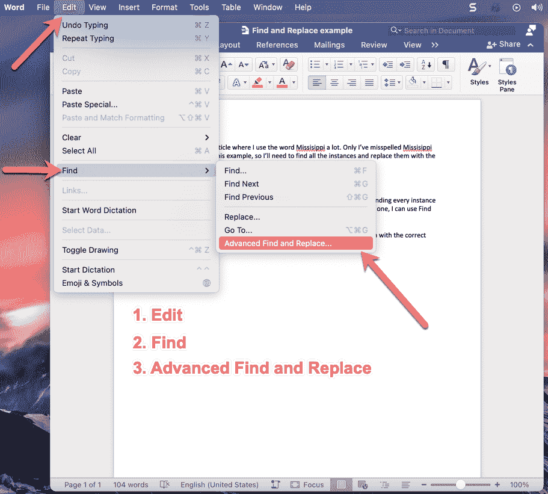
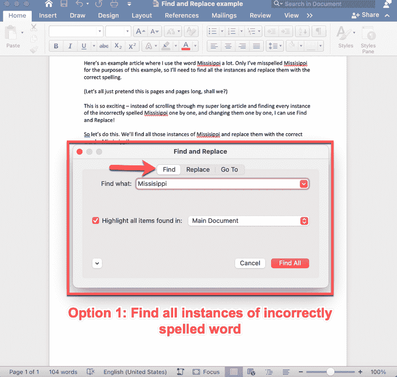
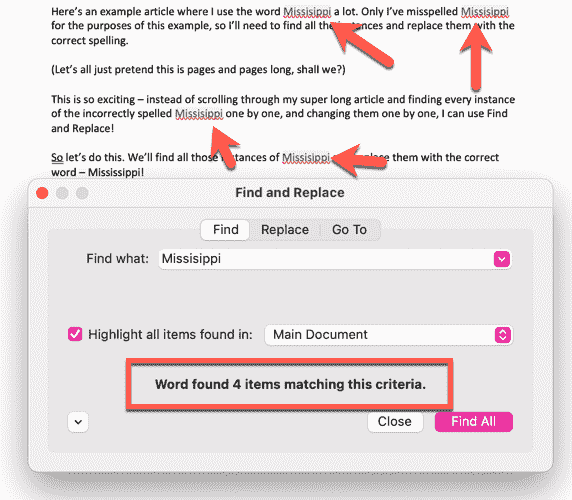
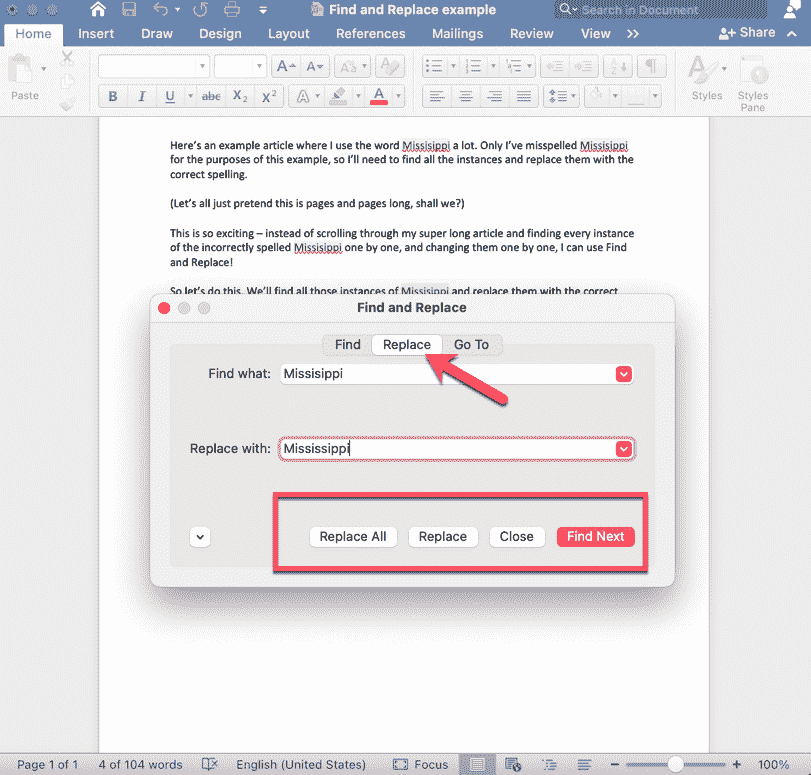
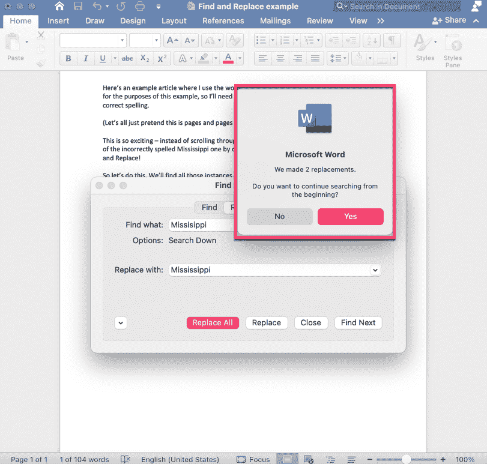
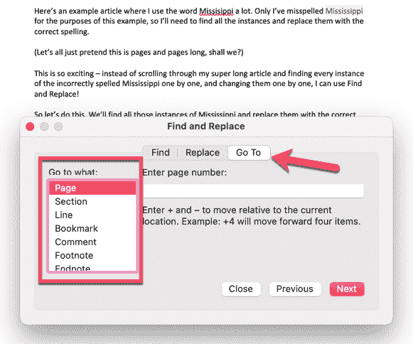
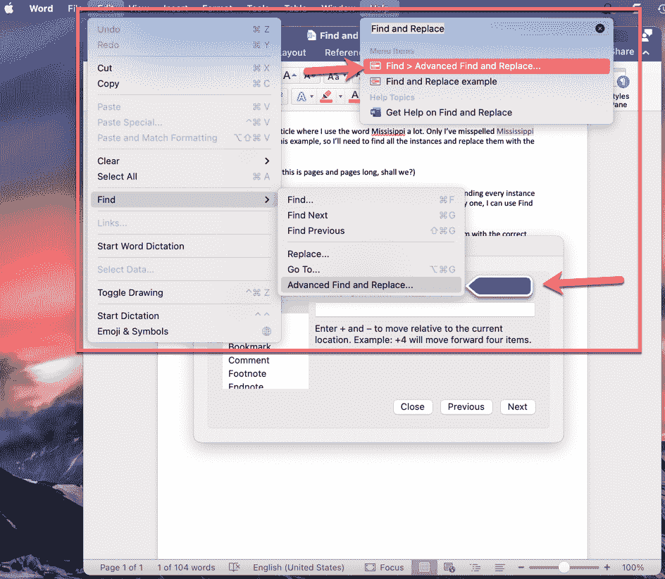

# 在 Word 中查找和替换 Microsoft Office 教程

> 原文：<https://www.freecodecamp.org/news/find-and-replace-in-word-a-microsoft-office-tutorial/>

假设你写了一篇很长的文章，准备发表。但是随后，您的校对员会让您知道您拼错了某个单词，或者犯了其他一些错误。在那篇长文章中，你已经多次这样做了。

你是做什么的？好吧，你当然不希望滚动查找那个错误的每个实例。因此，您可以使用 Word 方便的查找和替换功能。让我们看看现在该如何做。

## 如何在 Word 中使用“查找和替换”

查找和替换很容易使用。只需点击几下。

### 步骤 1:导航到“查找和替换”屏幕

进入 Word 文档后，转到 Word 主菜单中的“编辑”选项卡(位于屏幕顶部)。

向下滚动，直到你看到“查找”，悬停在它上面，会弹出一个侧菜单。在该菜单的底部，您会看到“高级查找和替换”:

How to find the "Find and Replace" option in Word.

当你点击“高级查找和替换”选项卡时，你会看到一个带有查找、替换和定位选项的屏幕。

### 第二步:找出所有错误

如果您只想找到您的错误的所有实例，您可以选择第一个选项“查找”。请确保选中“突出显示在:主文档中找到的所有项目”复选框。

当您单击“查找全部”按钮时，Word 将突出显示您拼错单词的所有次数(或任何问题),并告诉您它出现了多少次。

在下图中，您可以看到拼写错误的单词“Missisippi”有 4 个实例:

现在，如果您不想单独修复每个拼写错误的单词，可以使用替换工具。

### 第三步:用正确的单词替换所有的错误

为此，只需单击“替换”按钮(在“查找”旁边)，您将看到以下屏幕:

How to replace your mistakes all in one go.

一旦准备好用正确的单词替换拼写错误的单词，您有两种选择:

1.  您可以通过单击“全部替换”来一次性替换它们。如果你确定你想替换你犯的每一个错误，这是最好的选择(花费更少的时间)。
2.  但是您也可以一次替换一个实例。比如，如果你想留下一个拼写错误的例子呢？然后你可以选择“替换”按钮，点击它，然后点击“查找下一个”，再次点击“替换”...诸如此类。

如果你点击“全部替换”，会弹出一个小消息框，确认 Word 找到的实例数，并询问你是否要从头开始搜索:

Word 这样做是为了防止您直到文档中间才开始搜索/替换。如果你想彻底，只需在上面的屏幕中点击“是”。

### “转到”按钮呢？

在查找和替换屏幕上还有一个选项:转到。比方说，你想专门查看第 15 页，你只需点击下拉菜单中的页码选项，然后进入具体的页面。

这也适用于文档的各种功能，如行号、注释、脚注、图形和图表等。只需向下滚动上面用红色标出的小下拉菜单。

### 还有一个小小的单词提示...

如果你想知道如何在 word 中导航到一个特定的地方,“帮助”选项卡非常有用。

只需点击“帮助”，输入你想要查找的内容(如“查找和替换”)，当答案出现时，只需将鼠标悬停在上面(无需点击)。您将看到您正在搜索的路径，如下所示:

它甚至有一个漂亮的蓝色箭头，准确地指向你要找的东西。如果你想直接去那里，然后只需点击结果，它会带你到查找和替换屏幕。

### 就是这样！

现在，您可以轻松地查找和替换 Word 文档中的任何内容！您甚至不必花费数小时在冗长的文档中搜索每个错误(可能会遗漏一些)。