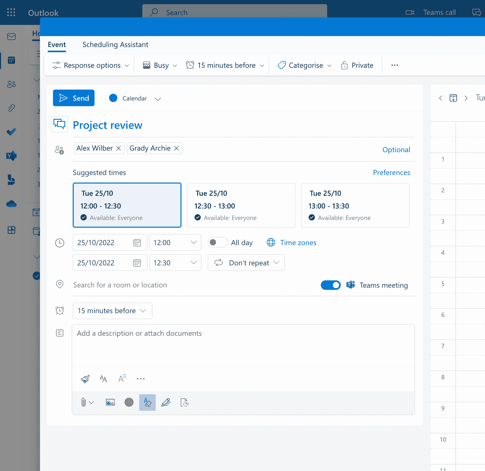
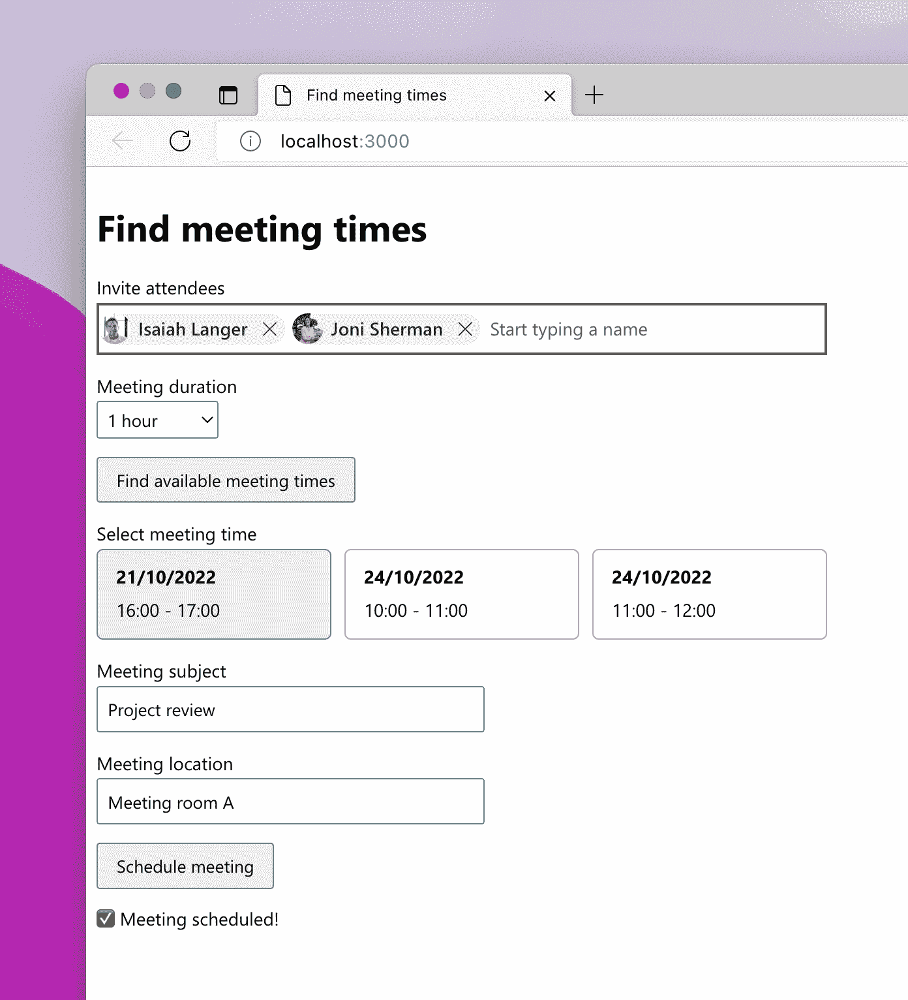
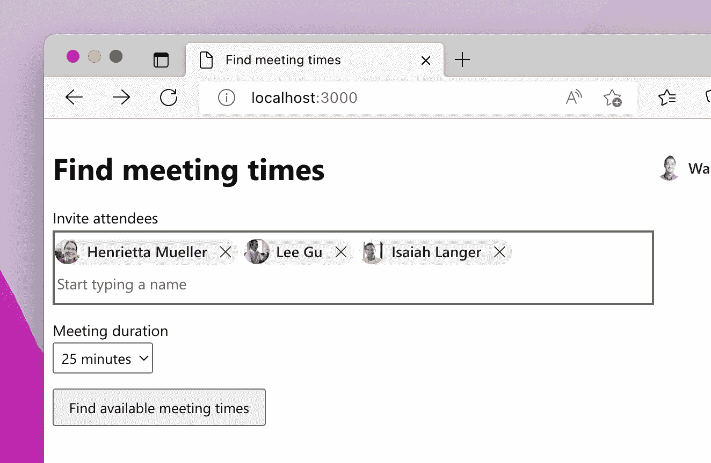
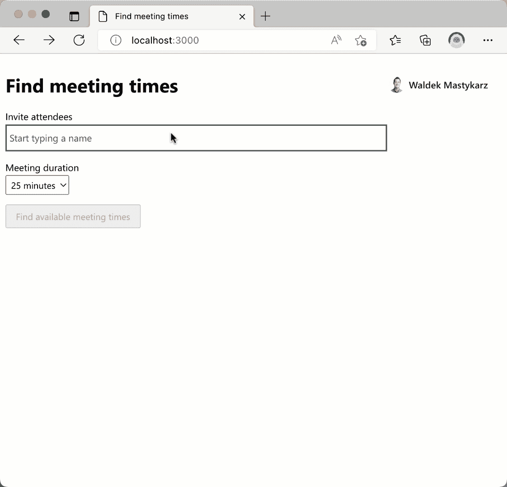
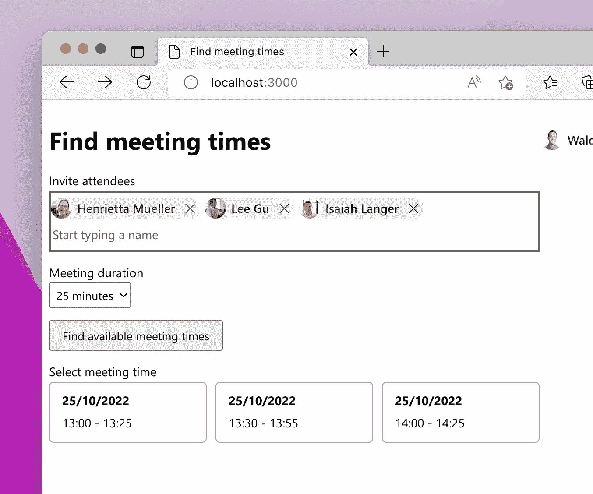
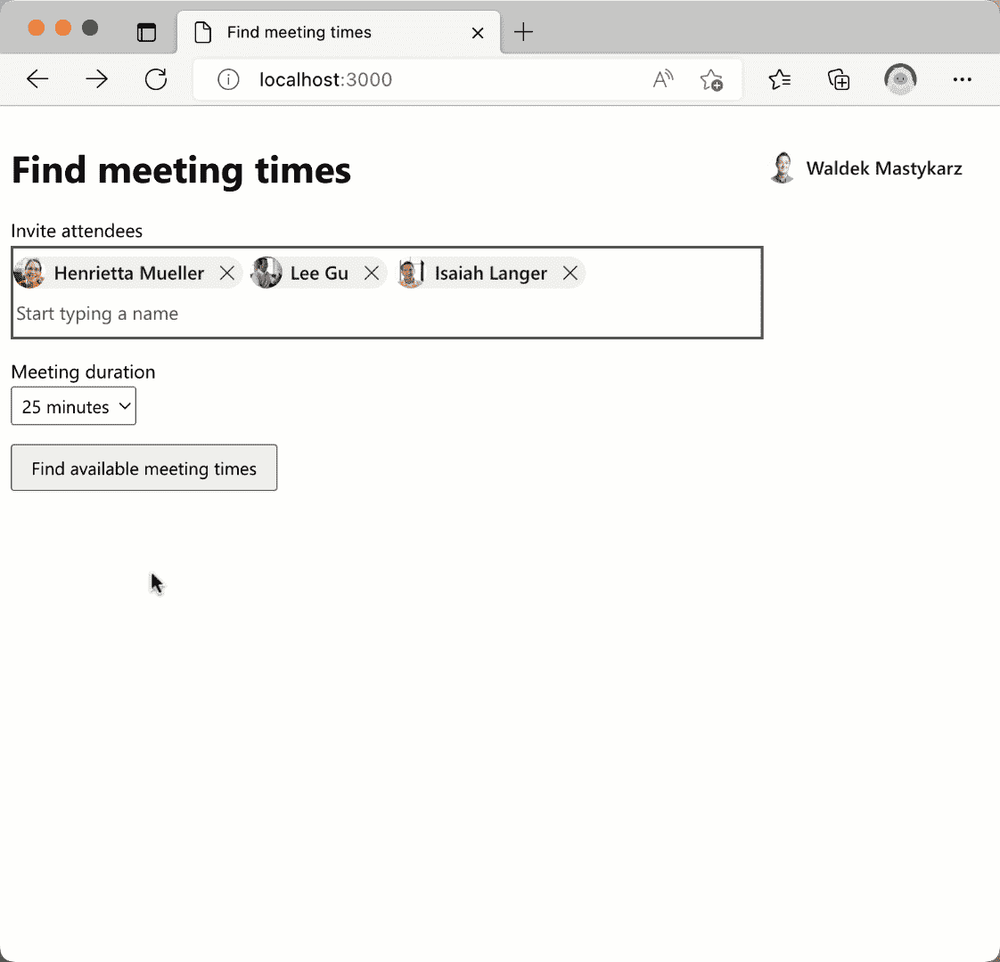
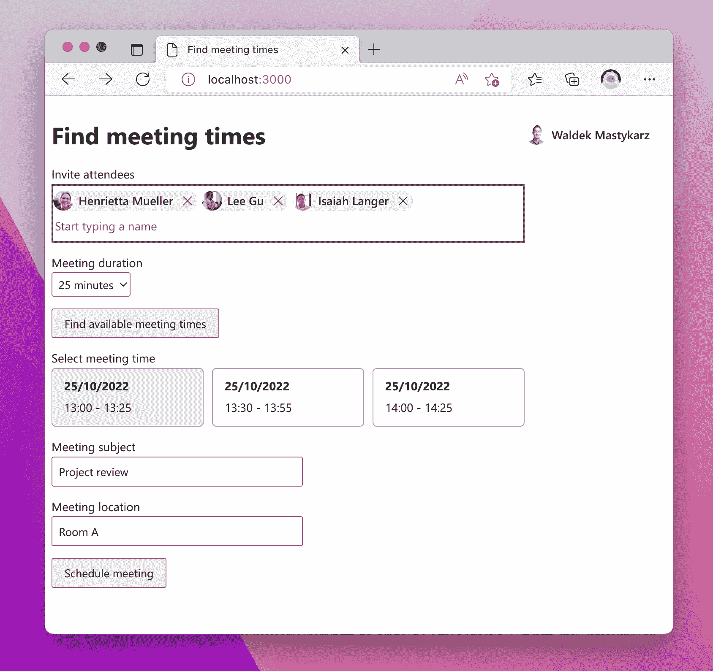
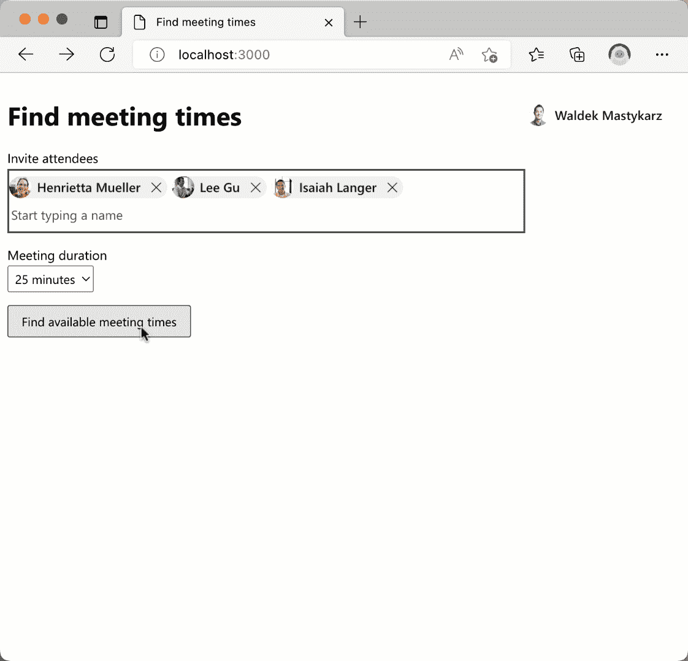

# 如何在 Microsoft 365 上找到会议时间并安排会议

> 原文：<https://www.freecodecamp.org/news/find-meeting-time-schedule-meeting-microsoft-365/>

许多工作应用程序的一个常见功能是让用户安排与组织中其他人的会议。以下是在微软 365 上的操作方法。

## 工作应用需要工作数据

如果您的组织使用 Microsoft 365，它应该考虑将其与工作中使用的应用程序集成。

将来自 Microsoft 365 的数据和见解引入工作应用的环境中，有助于用户保持工作流程，并在一个位置访问所有相关信息。

比方说，您的组织有一个用于管理项目的应用程序。除了关于项目本身的信息，应用程序的用户还需要关于项目人员的信息，以获得更新或安排会议。

有关您组织中的人员及其工作的信息存储在 Microsoft 365 上，您可以将其带入您的应用程序环境中。

当你为工作构建应用程序时，你可以使用微软 365 的 API[Microsoft Graph](https://graph.microsoft.com/)，与微软 365 交互并检索存储在那里的数据。

## 在 Microsoft 365 上查找会议时间并安排与与会者的会议

许多工作场景需要能够安排与组织中其他人的会议。对于使用 Microsoft 365 的组织，此功能在 Microsoft Outlook 中随时可用。



Scheduling a meeting in Microsoft Outlook on the web

但是，如果您不希望您的用户离开您的应用程序，转到 Outlook，手动安排与合适人员的会议，该怎么办呢？

使用 Microsoft Graph，您可以让用户**选择与会者，找到合适的会议时间，并直接从您的应用程序**安排会议。让我告诉你怎么做。



Custom web app allowing users to find a meeting time and schedule a meeting

使用本文中的代码片段构建的示例应用程序可以在 [GitHub](https://github.com/waldekmastykarz/mgt-spa-findmeetingtimes) 上获得。要运行它，你需要 [Node.js LTS](https://nodejs.org/) 和一个微软 365 开发者租户，你可以从[微软 365 开发者计划](https://developer.microsoft.com/microsoft-365/dev-program)免费获得。

### 选择会议与会者

第一步是让用户选择他们想和谁见面。



Web app with a few people selected to find available meeting times

最简单的方法是使用微软 Graph Toolkit 的[人物选择器](https://learn.microsoft.com/graph/toolkit/components/people-picker)组件。

> Microsoft Graph Toolkit 是一组连接到 Microsoft Graph 的 web 组件，可以在任何 web 框架中工作。

要添加人物挑选器，您需要将以下内容添加到您的应用程序中:

```
<mgt-people-picker></mgt-people-picker>
```

People picker 会自动从 Microsoft 365 检索您组织中的人员信息，并在您键入时筛选列表。每个人都会显示他们的名字和照片，以帮助用户选择合适的人。



Selecting people from Microsoft 365 in a custom web app

将它与来自 Microsoft Graph Toolkit 的[登录组件](https://learn.microsoft.com/graph/toolkit/components/login)相结合，您可以让用户使用他们的 Microsoft 365 帐户登录您的应用程序，并访问 Microsoft Graph API。

### 查找会议时间

下一步是查找包括当前用户在内的选定与会者的可用会议时间。



Available meeting times for the selected people from Microsoft 365

不必为所有用户下载日历并手动寻找合适的会议时间，您可以调用 [`findMeetingTimes` Microsoft Graph API](https://learn.microsoft.com/graph/api/user-findmeetingtimes?view=graph-rest-1.0&tabs=javascript) ，将与会者数组和会议持续时间作为参数传递。

```
const meetingTimes = await graphClient
  .api('/me/findMeetingTimes')
  .post({
    attendees: document.querySelector('mgt-people-picker').selectedPeople.map(p => {
      return {
        emailAddress: {
          address: p.userPrincipalName,
          name: p.displayName
        },
        type: 'required'
      };
    }),
    maxCandidates: 3,
    meetingDuration: `PT${document.querySelector('#duration').value}`,
    returnSuggestionReasons: true,
    minimumAttendeePercentage: 100
  });
availableMeetingTimes = meetingTimes.meetingTimeSuggestions;
```

您可以从 People picker 获得与会者列表，该 picker 公开了用户选择的人员列表。

当请求可用的会议时间时，您可以传递许多附加选项，例如您希望得到多少建议(`maxCandidates`)、至少有多少与会者必须能够参加会议(`minimumAttendeePercentage`)，或者会议应该在哪些时间之间举行。



Finding available meeting times for the selected attendees and meeting duration

### 安排会议

最后一步是安排一次会面。



Scheduling a meeting on Microsoft 365 from a custom web app

此时，您已经具备了代表当前用户向所选人员发送会议邀请的所有必要信息。

您可以通过调用`events` Microsoft Graph API，在请求体中传递所有信息，如主题、开始和结束时间以及与会者列表。

```
const meetingTime = availableMeetingTimes[selectedMeetingTime].meetingTimeSlot;

await graphClient
  .api('/me/events')
  .post({
    subject: document.querySelector('#subject').value,
    start: meetingTime.start,
    end: meetingTime.end,
    attendees: document.querySelector('mgt-people-picker').selectedPeople.map(p => {
      return {
        emailAddress: {
          address: p.userPrincipalName,
          name: p.displayName
        },
        type: 'required'
      };
    })
  });
```



Scheduling a meeting on Microsoft 365 from a custom web app

## 摘要

通过将 Microsoft 365 集成到您的工作应用中，您可以帮助您的用户更有效地工作。

使用 Microsoft Graph API，您可以将来自 Microsoft 365 的数据和见解引入您的工作应用程序。这为您的用户提供了完成任务所需的所有信息。

因为他们指尖上有他们需要的所有信息，他们不需要在不同的应用程序之间切换，并且可以保持他们的工作流程。通过使用 Microsoft Graph Toolkit 中的 web 组件，您可以更快地构建连接到 Microsoft 365 的应用程序。

查看一下[示例应用](https://github.com/waldekmastykarz/mgt-spa-findmeetingtimes)，我期待着听到您对它的评价，以及您对其他哪些集成场景感兴趣。