# 如何求一个数的平方根并手工计算

> 原文：<https://www.freecodecamp.org/news/find-square-root-of-number-calculate-by-hand/>

有时，在日常生活中，我们可能会面临计算一个数的平方根的任务。如果手边没有计算器或智能手机怎么办？我们能用老式的纸和铅笔做一个长除法吗？

是的，我们可以，有几种不同的方法。有些比其他的更复杂。一些提供更准确的结果。

我想和你分享的就是其中之一。为了使这篇文章对读者更友好，每一步都附有插图。

## 第一步:将数字分成两个一组

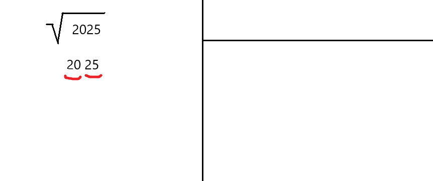

首先，让我们组织工作空间。我们将把空间分成三部分。然后，让我们从右到左将数字分成两个一组。

例如，数字 7469.17 变成了 **74** **69。** **17** 。或者是 19036 等奇数位数的情况，我们就从**1**9036 开始。

在我们这里的例子中，2025 变成了**20**25。

## 第二步:找到最大的整数

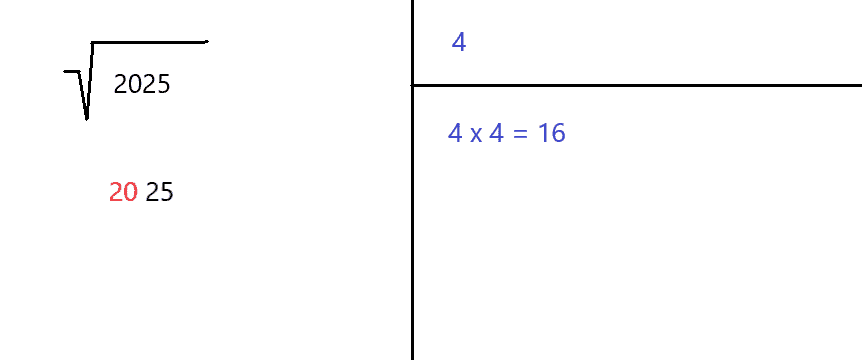

下一步，我们需要找到最大的整数(I ),它的平方小于或等于最左边的数字。

在我们当前的例子中，最左边的数字是 20。由于 4 = 16 <= 20 and 5² = 25 > 20，所以问题中的整数是 4。我们把 4 存到右上角，4 = 16 存到右下角。

## 第三步:现在减去整数

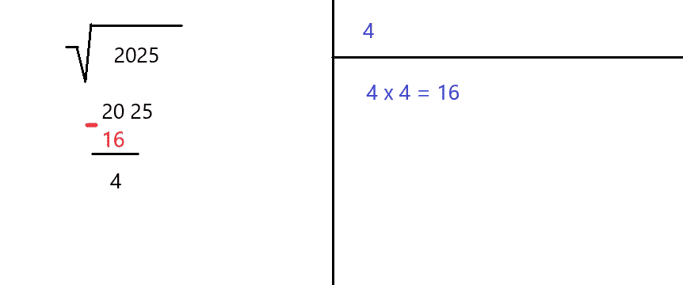

现在我们需要从最左边的数字(等于 20)中减去该整数的平方(等于 16)。结果等于 4，我们将把它写成如上所示。

## 第四步:让我们进入下一组

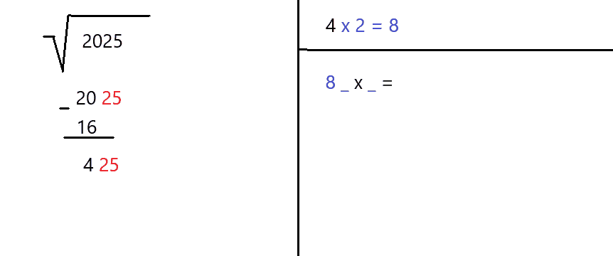

接下来，让我们向下移动数字中的下一对(25)。我们把它写在已经减去的值(4)旁边。

现在把右上角的数字(也是 4)乘以 2。结果是 8，我们把它写在右下角，然后是 **_ x _ =**

## 第五步:找到合适的搭配

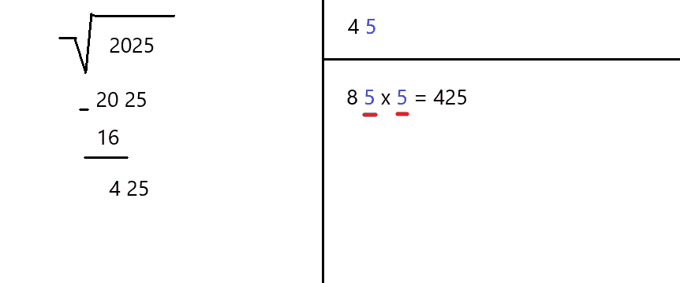

用相同的整数(I)填充每个空格的时间。它必须是允许乘积小于或等于左边数字的最大可能整数。

例如，如果我们选择数字 6，第一个数字就变成 86 (8 和 6)，我们也必须将它乘以 6。结果 516 大于 425，所以我们降低到 5。数字 8 和数字 5 等于 85。85 乘以 5 的结果是 425，这正是我们所需要的。

在右上角 4 旁边写 5。它是根中的第二个数字。

## 第六步:再次减去

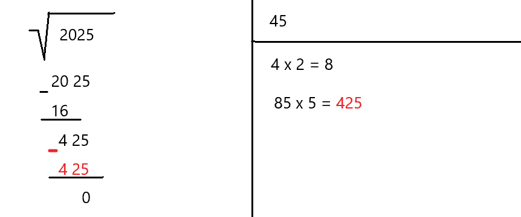

从左边的当前数字(也是 425)中减去我们计算的乘积(也是 425)。结果为零，表示任务完成。

**注:**我故意选了一个完美的正方形(2025 = 45 x 45)。这样我可以展示解决平方根问题的规则。

事实上，数字由许多数字组成，包括小数点后的数字。在这种情况下，我们重复步骤 4、5 和 6，直到达到我们想要的精度。

下一个例子解释了我的意思。

## 例子:我们深入挖掘...

这一次，数字由奇数个数字组成，包括小数点后的数字。

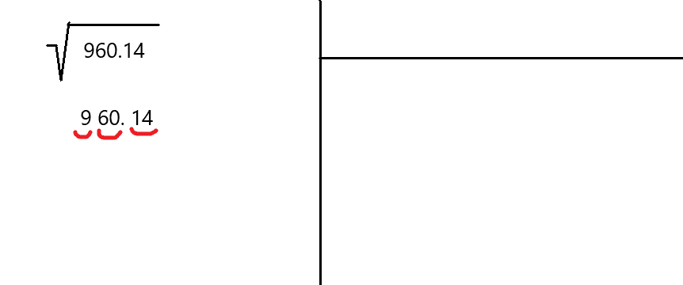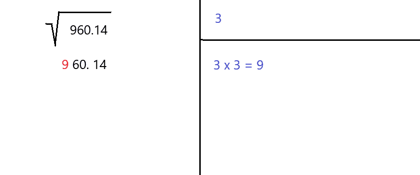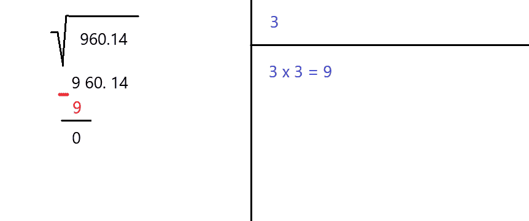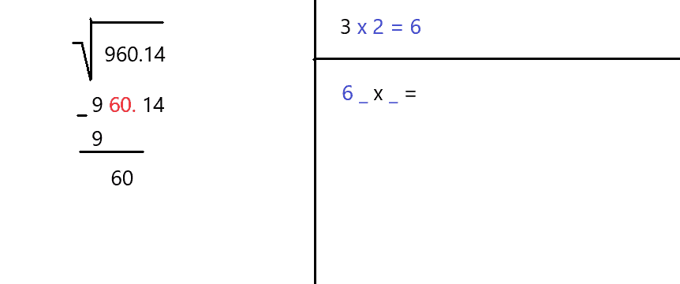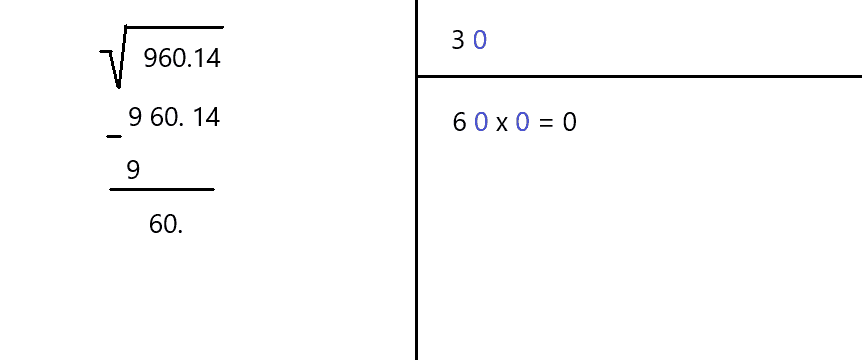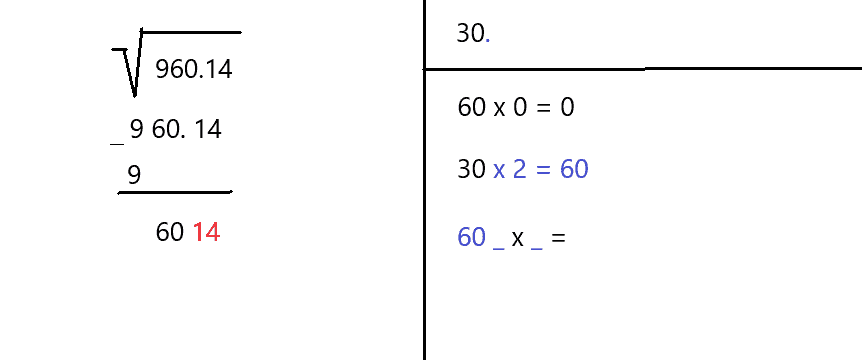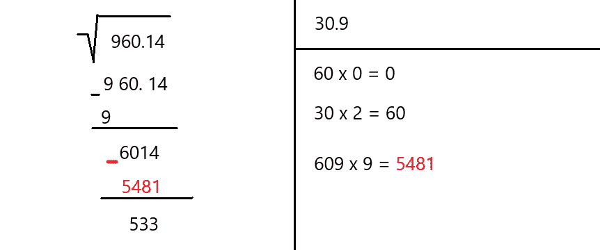

正如我们在这个例子中看到的，这个过程可以重复几次，以达到所需的精度水平。