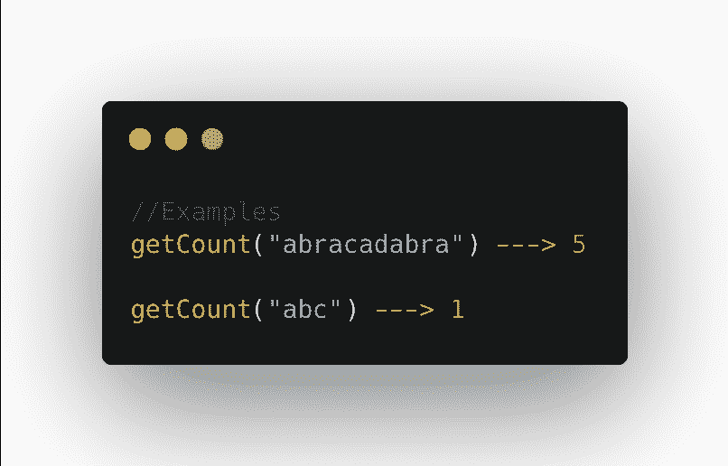
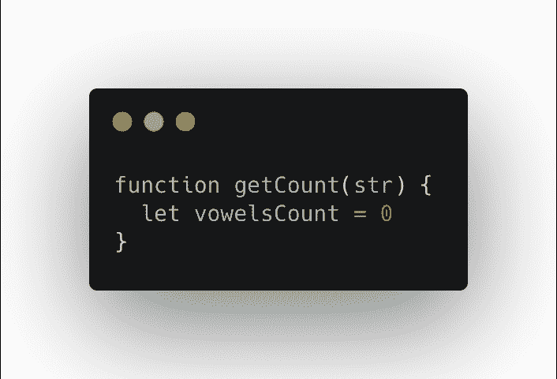
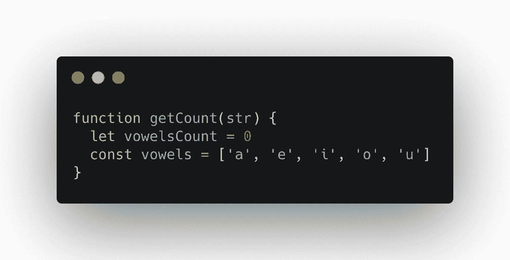
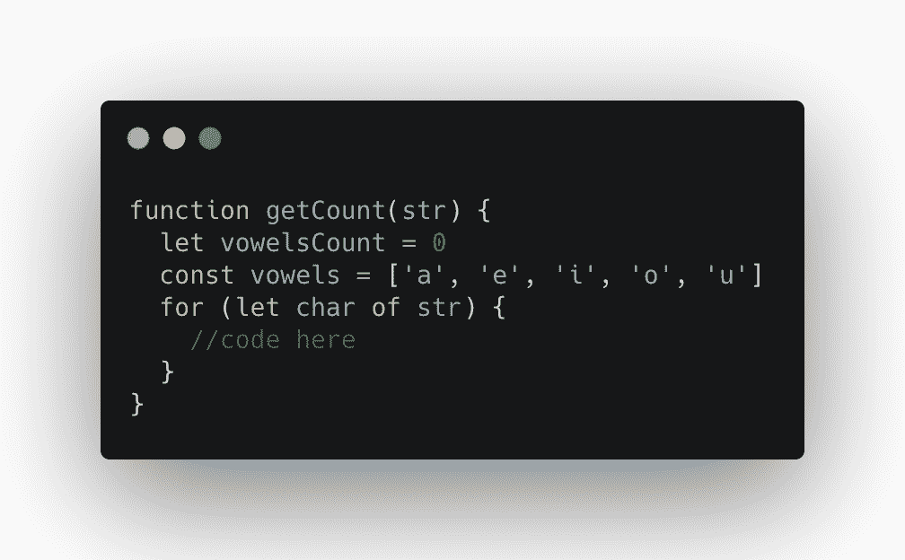
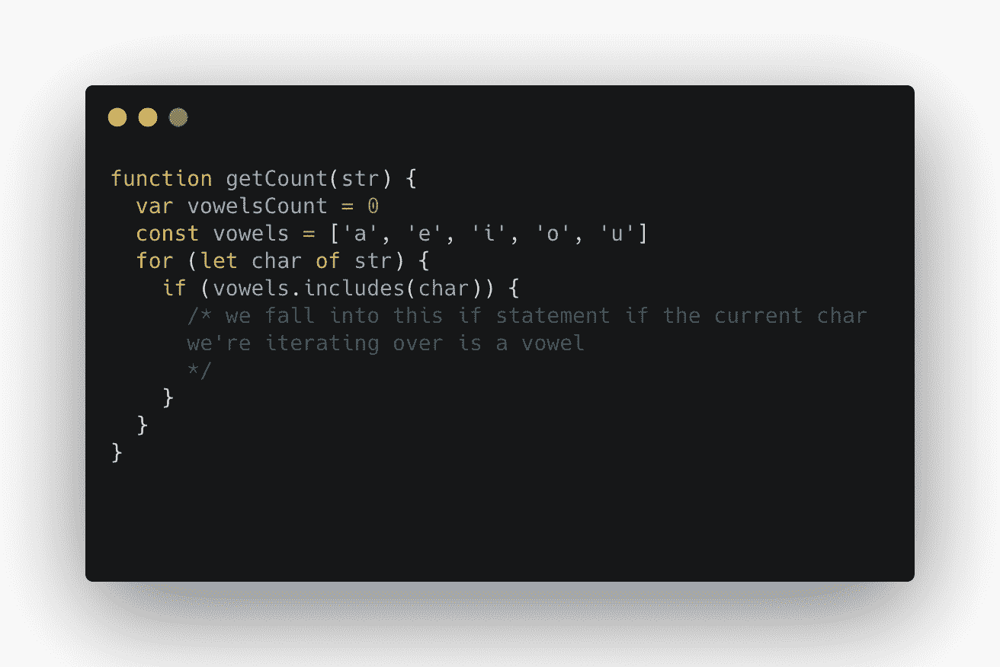
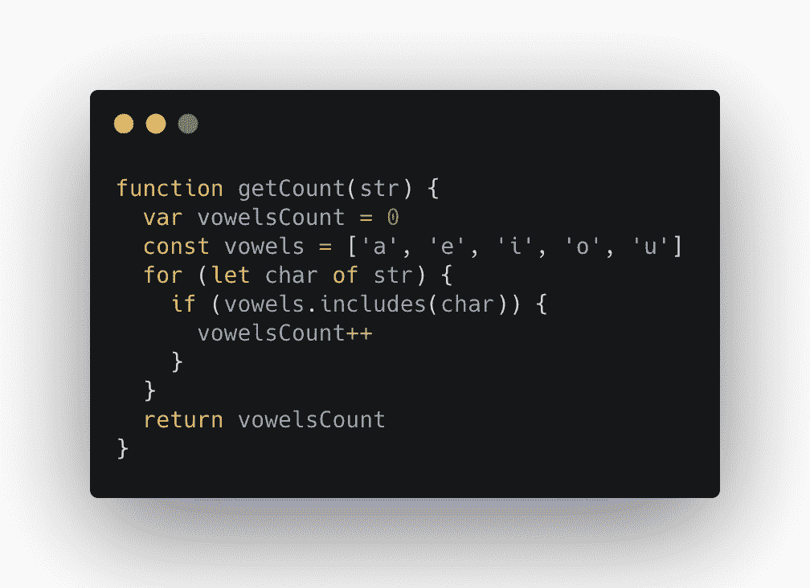

# 如何用 JavaScript 找到一个字符串中元音的个数

> 原文：<https://www.freecodecamp.org/news/find-the-number-of-vowels-in-a-string-with-javascript/>

在本教程中，我们将学习如何用 JavaScript 找到一个字符串中元音的数量。这是一个你可能在初级开发人员的面试中被问到的问题，也是一个 [CodeWars](https://www.codewars.com/kata/54ff3102c1bad923760001f3) 问题。

在我们开始编码之前，让我们通读一下完整的问题描述:

**返回给定字符串中元音的数量(计数)。我们将 a、e、I、o 和 u 视为元音，而不是 y。输入字符串将只包含小写字母和/或空格。**

## 第一步:制定解决问题的计划

对于这个问题，我们将创建一个名为`getCount`的函数，它将一个字符串作为输入，并将该字符串中有多少个元音的计数作为输出返回。

我们来看一些例子。

在第一个例子中，我们看到我们的函数返回 5，这是一个元音在字符串`abracadabra`中出现的次数。对于字符串`abc`，只返回 1，因为只出现了一个元音字母(a)。

为了解决这个问题，我们将创建一个`vowelsCount`变量来跟踪字符串中有多少元音。

我们还将创建一个存放所有元音的数组元音。我们将遍历字符串中的每个字符。如果字符是一个元音，我们将增加我们的`vowelsCount`变量。

最后，我们将返回`vowelsCount`变量。

我们开始吧！

## 第二步:编写解决问题的代码

首先我们写我们的函数，`getCount`。接下来，我们将创建一个变量`vowelsCount`，并将其设置为`0`。

接下来我们将创建元音数组。这使得我们可以将每个元音放在一个位置，以后我们可以使用这个数组。

现在我们需要遍历输入字符串中的每个字符，`str`。我们需要检查或查看字符串中的每个字符，这样我们就可以确定它是否是一个元音。

为此，我们可以使用作用于字符串的`for...of`语句。你可以在这里了解更多信息。

现在，在我们的 for 循环中，我们有能力查看字符串中的每个字符。

接下来，我们要检查每个字符是否是元音。

为此，我们可以使用`includes`方法。`includes()`方法确定数组的条目中是否包含某个值。如果是，则返回 true，否则返回 false。

使用`includes`，我们将检查我们的元音数组是否包含我们当前在循环中迭代的字符。

我们已经创建了`if statement`来检查当前字符是否是元音。如果字符是一个元音，那么我们要增加我们的`vowelsCount`变量。为此，我们可以在 JavaScript 中使用 increment 运算符:

在我们代码的这一点上，我们已经查看了字符串中的每个字符，确定它是否是一个元音，如果是，就增加我们存储在`vowelsCount`中的数字。

最后，我们需要做的就是让我们的函数返回我们的`vowelsCount`变量。我们可以通过在循环之外返回变量来做到这一点。

我们知道了。

## 就是这样！

我们现在已经编写了一个函数，它将一个字符串作为输入，并将一个元音在字符串中出现的次数作为输出返回。

### 如果你喜欢这篇文章，加入我的[编码俱乐部](https://madisonkanna.us14.list-manage.com/subscribe/post?u=323fd92759e9e0b8d4083d008&id=033dfeb98f)，在那里我们每周日一起应对编码挑战。

如果你对这篇文章有任何反馈或问题，欢迎发微博给我@madisonkanna。