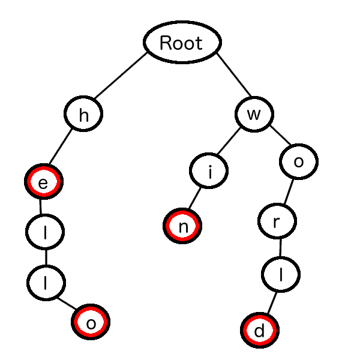
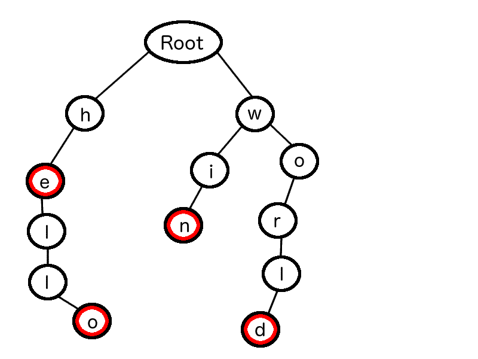
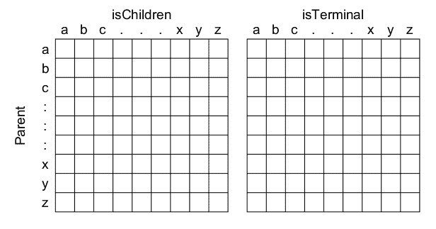
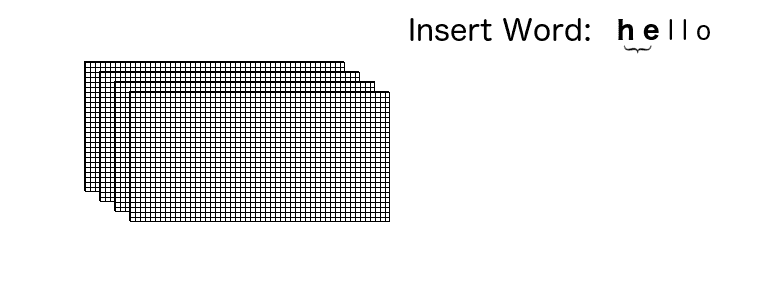
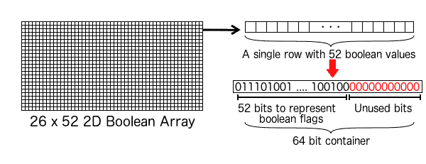
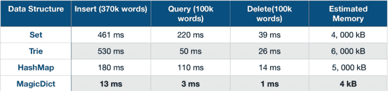

# 寻找时间和内存复杂度之间的平衡——一个示例

> 原文：<https://www.freecodecamp.org/news/finding-the-balance-between-time-and-memory-complexity-an-illustrated-example-4845ab7afadd/>

作者安莫尔·乌帕尔

# 寻找时间和内存复杂度之间的平衡——一个示例


作为程序员，我们经常要在时间和内存复杂度之间进行权衡。管理一个往往意味着在另一个上妥协。很难在它们之间找到合适的平衡点。

对于资源相对有限的 Android 和 iOS 设备来说，这个问题变得更加紧迫。

让我们用一个例子来看看如何找到这个“最佳点”。我们的例子是开发一个查询来检查一个给定的单词是否出现在英语词典中*。*

这个用例非常特定于文本输入应用程序(比如手机键盘)，但是本文中使用的概念也可以用于其他领域。

经常应用于这个问题的数据结构包括:

*   一组
*   特里
*   散列表

在这些数据结构中，Trie 是专门为拼写检查定制的。其他数据结构是通用的，可以应用于许多数据类型。让我们想象一下它是如何工作的。

#### 理解 Trie

假设我们的字典里只有四个词，例如:“你好”、“世界”、“他”和“赢”。

我们可以把这本词典的一个 Trie 想象成:



Sample Trie Visualization

红色圆圈表示有效单词的终止。Trie 结构维护有效父子关系的层次结构。每个节点至少包含这三个字段:

```
TrieNode {    char            character;  // a, b, c, d, ... y, z    boolean         isTerminal; // If this node ends in a valid word    List<TrieNode>  children;   // List of children nodes.}
```

关于构造 Trie 的详细讨论不在本文的讨论范围之内，但是我们将简单介绍一下如何在 Trie 中执行搜索:



Visualisation of searching word in Trie

假设在上面的 Trie 中(只有四个有效单词)，我们需要搜索“hell”是否是一个有效单词。

我们将从根节点开始，取“h”，即“hell”的第一个字符，然后迭代根节点的子节点。如果找到了“h”，那么我们将迭代“h”的子节点，并忽略根节点的其他子节点。

这个过程一直运行到我们找到搜索词的最后一个字符。对于最后一个字符“l”，我们还要检查该节点的`isTerminal` 字段。在这种情况下，这是`false`，因为本词典中的有效单词只有“he”、“hello”、“win”和“world”。

#### MagicDict 简介

MagicDict 利用了 Trie 忽略的语言特有的属性:

*   所有字符(a-z)都可以想象成一个连续的整数范围(0–26)。

因为给定节点的所有可能的子字符(a-z)都可以实现为一个连续的整数范围，所以我们可以使用一个由`Boolean`值组成的数组来表示子字符。

我们将使用一个大小为 26 的`Boolean`数组，所有元素`False`作为初始值。我们还需要另一个由 26 个`Boolean`值组成的数组来表示`isTerminal`。



Magic Dict visualisation of parent child relationship

这个单个 2D 数组只代表一级父子关系。对于 26 个字符的英语，2D 数组的大小应该是:26×52。

我们可以把它们叠在一起。这意味着第一层的子层成为第二层的父层，第二层的子层成为第三层的父层…依此类推。这就形成了一种链式结构，也是魔术的基本元素。

#### 在 MagicDict 中插入

我们构建了一个 2D 层的堆栈，其中构建堆栈所需的层数是`longest_word_length — 1`。

对于前一组单词:“他”、“你好”、“赢”和“世界”，`longest_word_length`等于 5。因此，我们需要保留堆栈大小为 4。

假设我们想在这个数据结构中插入“hello”。我们从第一对{“h”和“e”}开始，打开第 1 层中相应的`isChildren`布尔标志。

然后我们取下一对{“e”，“l”}，类似地打开第 2 层中相应的`isChildren`布尔标志。重复这个过程，直到我们到达终端对{“l”和“o”}，在这里我们也打开相应的`isTerminal`布尔标志。

整个过程可以如下图所示:



#### 在 MagicDict 中搜索

搜索遵循与插入相同的流程。唯一的区别是在插入时，我们改变了比特值。但是在搜索的情况下，我们只读取值来检查查询词中的字符序列是否有效。

#### 最后的魔法触摸

现在我们有了一个存储大小为 26 x 52 的 *n* 个 2D 数组的数据结构。每个 2D 数组存储 1352 个布尔值(真/假)。

我们还知道这样一个事实，即布尔值最多占用 1 个字节的内存(因为内存的最小可寻址单元是一个字节)。消耗 1 个字节来存储一个`Boolean`标志并不是理想的情况。

如果我们能找到一种足够大的数据类型，以连续的位模式保存 2D 数组的布尔标志，那会怎么样呢？

原来一个都没有！原始数据类型有 8 位、16 位、32 位、64 位、128 位表示形式…但是没有一种原始数据类型大到足以存储 1352 个连续位。

最接近的可用连续位模式似乎是 64 位，在某些语言中也称为`long`。我们用保存 64 位的`long`值替换 2D 数组中的行。



Visualization of boolean array as contiguous bit pattern

对于最大字长为 21 的字典，并且每一层消耗 26×8 字节，数据结构的总大小将是 4，160 字节。

#### 标杆管理

我们分析了来自这个 [Github repo](https://github.com/dwyl/english-words/blob/master/words_alpha.txt) 的 370，000 个英语单词，并记录了:

*   插入 37 万字
*   删除 10 万字
*   查询 100，000 个单词(50，000 个现有单词，50，000 个不存在的单词

我们还查看了各种数据结构的估计内存消耗。



Practical benchmarks for mainstream Data Structures

#### **最终想法**

这种初始模型没有广泛的特征。但是，通过使用更大的数据类型，它可以扩展到英语以外的语言。

这种数据结构的主要好处是有效利用空间，同时提高运行时性能。这更接近于“两全其美”的场景。

有关如何实现这种数据结构的详细信息，可以查看 MagicDict 的[源代码。](https://github.com/anmoluppal/MagicDict)