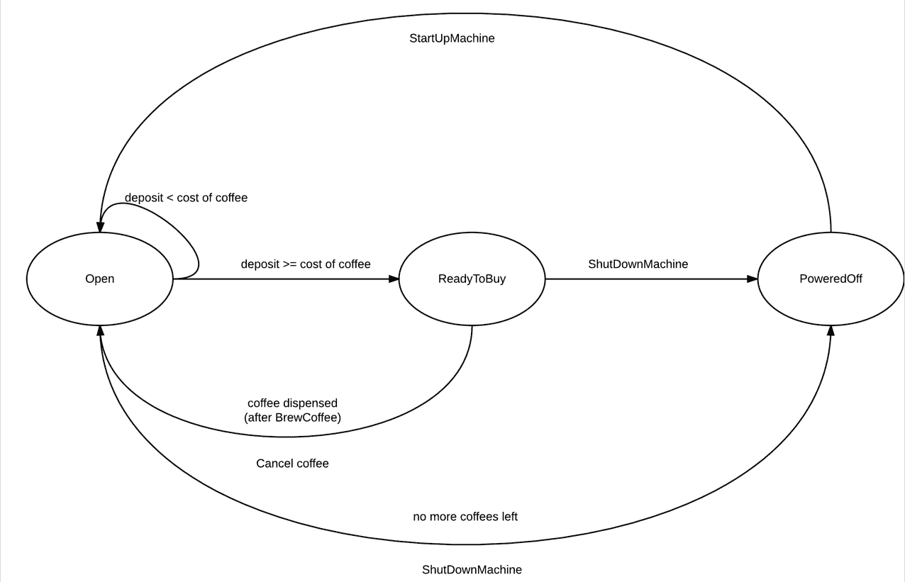

# 有限状态机解释

> 原文：<https://www.freecodecamp.org/news/finite-state-machines/>

有限状态机(FSM)是一种软件设计模式，其中给定的模型通过外部输入转换到其他行为状态。

## **了解有限状态机**

FSM 由其 ****状态**** 、其 ****初始状态**** 和 ****转换**** 来定义。

FSM 的强大之处在于能够清楚地定义不同条件下的不同行为。通常，FSM 与循环行为脚本一起使用，这些脚本不断评估循环或事件中的当前情况。

为了帮助形成如何应用的图像，咖啡机将被用作有限状态机的例子。我们还将介绍一个状态图来可视化 FSM，并提供编码示例。

### **状态图**

该图显示了咖啡机的三种可能状态:

*   打开
*   准备购买
*   断电

这些状态之间的线条显示了状态之间可能的转换以及转换的方向。当 FSM 需要在状态之间改变时，这些转换具有条件。

*   启动机器从断电状态到打开状态，机器必须启动。在这种情况下，这是手动完成的。
*   存款> =咖啡的成本 FSM 以循环方式或在金额变化时(在这种情况下建议)评估存款金额。如果您向咖啡机中存入足够的现金，FSM 将从“开放”变为“准备购买”。
*   关闭机器如果满足“没有更多的咖啡了”的条件，机器将通过关闭机器方法自动从打开状态转为关闭状态。
*   在准备购买状态下，用户可以购买咖啡，之后咖啡将被冲泡和分配。条件是当 BuyCoffee 事件(！链接到观察者模式！)大火。(图中未显示)
*   CancelCoffee 如果用户选择取消，机器将从 ReadyToBuy 转为 Open。
*   关闭机器机器将进入断电状态

## 州

在每个状态中，都有定义的行为，只有当对象处于该状态时才会执行这些行为。例如，在断电期间，咖啡机不会在通电之前冲泡咖啡，在打开状态期间，它会等待，直到有足够的现金投入，直到给出断电命令，或者直到咖啡用完。在这种开放状态下，它可以做其他状态下不会发生的例行工作，如清洁。

### **初始状态**

每个 FSM 都有一个初始状态，这意味着它在创建时从哪个状态开始，并且必须在构造或实例化时定义。当然，如果条件满足，也可以直接改变状态。

### **跃迁**

每个状态或者不断地评估它是否应该转换到另一个状态，或者将基于触发的事件转换到另一个状态。

## **DFA 和 NFA**

有两种类型的有限自动机，确定性的(DFA)和非确定性的(NFA)。它们都接受常规语言，并以与上述相同的方式或多或少地操作，但是有一些不同。

DFA 接受或拒绝一串符号，并且对于每个输入串只产生一个唯一的计算或自动机。*确定性*指计算的唯一性。如果有限状态机遵循以下规则，则称为 DFA:

1.  它的每个转换都是由它的源状态和输入符号唯一确定的
2.  每个状态转换都需要读取输入符号。

NFA 不需要遵守这些限制，这意味着每个 DFA 也是一个 NFA。因为它们都只识别常规语言，所以可以使用 powerset 构造算法将每个 NFA 转换成等价的 DFA。

那么，我们可以期待在 NFA 中找到什么样的规则而不是 DFA 呢？

1.  一个 NFA 可以有一个*空字符串*转换(通常用ε表示)。这意味着当处于具有转变规则的ε的某个状态时，机器可以在不读取输入符号的情况下转变到下一状态
2.  在 NFA 中，每对状态和转换符号可以有多个目标状态，这与 DFA 中成对的唯一目标不同
3.  每对状态和转换符号为它每个可能的目的地产生一个计算的“分支”,创建某种多线程系统。
4.  如果输入字符串处于除接受状态之外的任何状态，DFA 将拒绝它。在 NFA 中，我们只需要一个“分支”到达接受状态来接受字符串。

如果你想了解更多，这里有一个关于状态机的[深度指南。](https://www.freecodecamp.org/news/state-machines-basics-of-computer-science-d42855debc66/)