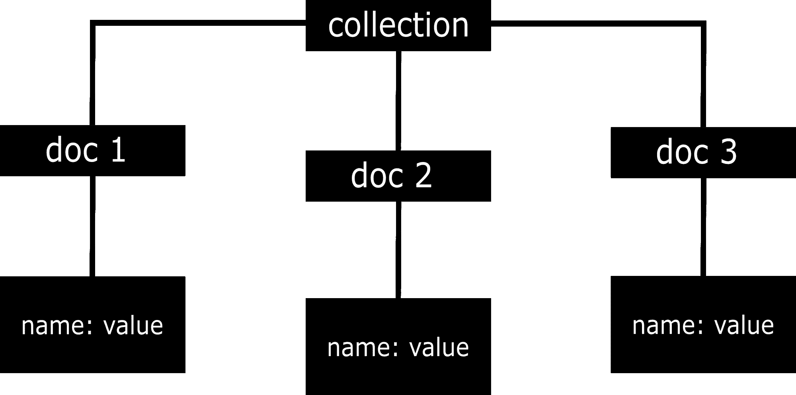
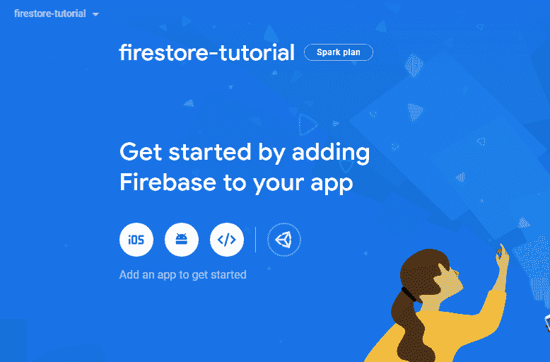
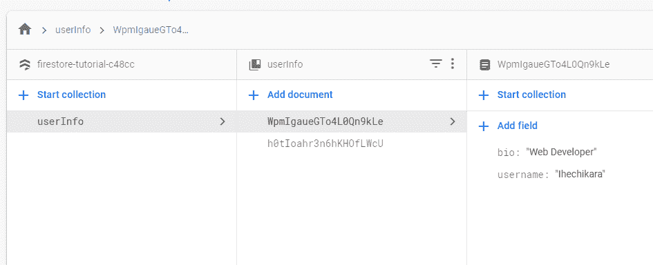

# firebase 云风暴-数据库速成班

> 原文：<https://www.freecodecamp.org/news/firebase-firestore-crash-course/>

在本文中，我们将了解 Firebase 的一个构建产品，名为 Cloud Firestore。它允许您在基于文档的数据库中存储、同步和检索数据。

我们将学习如何为网络设置我们的项目。由于这不是一个侧重于设计的教程，我们将只使用一个 HTML 和 JavaScript 文件来展示如何添加(存储)、同步和查询数据。

云 Firestore 非常有用，因为它是一个安全且可伸缩的后端数据库。当您使用它时，您不必担心编写代码来创建和管理自己的数据库。

如果您是前端开发人员，这也是一个很好的选择，因为它使您能够构建全栈应用程序。让我们开始吧。

## 什么是云 Firestore？

根据 [Firebase 文档](https://firebase.google.com/docs/firestore)，

> “云 Firestore 是一个灵活、可扩展的数据库，用于 Firebase 和 Google Cloud 的移动、web 和服务器开发……”。

Firestore 是一个 NoSQL 数据库，它不在具有行和列的表格中存储数据。相反，它将数据存储在集合中，每个集合下都有存储数据的各种文档。



我们将专注于使用 Firestore 来存储和检索网络数据。你可以在这里找到代码[。每个部分都有自己的分支。](https://github.com/ihechikara/firebase-firestore)

## 如何在本地创建项目

我们将只处理 HTML 和 JS 文件，所以你可以随心所欲地设计你的网页。这里主要关注的是添加存储在数据库中的数据并与之交互。

以下是 HTML 文件:

```
<!DOCTYPE html>
<html lang="en">
<head>
    <meta charset="UTF-8">
    <meta http-equiv="X-UA-Compatible" content="IE=edge">
    <meta name="viewport" content="width=device-width, initial-scale=1.0">
    <title>Firestore</title>
</head>
<body>

    <script src="app.js"></script>
</body>
</html>
```

现在您只需要创建一个 JavaScript 文件。我已经调用了我的 app.js，你可以在上面看到。

## 如何在 Firebase 中建立项目

要设置您的项目，请访问 [Firebase 网站](https://firebase.google.com/)并注册(如果您还没有帐户，请登录)。

登录后，根据具体情况，点击“转到控制台”(应该在页面的右上角)或“开始”。

接下来，点击“添加项目”并给你的项目起一个名字。接下来的步骤非常简单——只需继续点击 next，然后等待您的项目被创建。

## 如何安装和初始化 Firebase

首先，如果您还没有安装 Firebase，那么在项目终端中运行以下命令:

`npm install firebase`

安装后，转到 HTML 页面的 head 部分，并包含以下脚本:

```
<head>
    <meta charset="UTF-8" />
    <meta http-equiv="X-UA-Compatible" content="IE=edge" />
    <meta name="viewport" content="width=device-width, initial-scale=1.0" />
    <script src="https://www.gstatic.com/firebasejs/8.10.0/firebase-app.js"></script>
    <script src="https://www.gstatic.com/firebasejs/8.10.0/firebase-firestore.js"></script>
    <title>Firestore</title>
  </head>
```

第一个脚本加载 Firebase 应用程序库，而第二个脚本使我们能够使用 Firestore 功能。

接下来，转到项目的 Firebase 控制台，单击 Firestore Database。请确保以测试模式启动，这样您就可以在没有身份验证的情况下发出请求，因为我们处于开发模式。

请确保在需要时更改您的安全规则，以便您的项目可以在 internet 上访问。创建数据库后，单击导航栏上的 Project Overview。您应该会看到如下所示的页面:



点击>图标，为 web 初始化您的项目。在下一页上，复制 apiKey、authDomain 和 projectId。我们将使用 Firestore Web 第 8 版方法初始化项目，如下所示:

```
<!DOCTYPE html>
<html lang="en">
  <head>
    <meta charset="UTF-8" />
    <meta http-equiv="X-UA-Compatible" content="IE=edge" />
    <meta name="viewport" content="width=device-width, initial-scale=1.0" />
    <script src="https://www.gstatic.com/firebasejs/8.10.0/firebase-app.js"></script>
    <script src="https://www.gstatic.com/firebasejs/8.10.0/firebase-firestore.js"></script>
    <title>Firestore</title>
  </head>
  <body>
    <script>
      firebase.initializeApp({
        apiKey: "### FIREBASE API KEY ###",
        authDomain: "### FIREBASE AUTH DOMAIN ###",
        projectId: "### CLOUD FIRESTORE PROJECT ID ###",
      });

      const db = firebase.firestore();
    </script>
    <script src="app.js"></script>
  </body>
</html>
```

确保在为 web 初始化您的项目时，用您复制的相应值替换`### FIREBASE API KEY ###`、`### FIREBASE AUTH DOMAIN ###`和`### CLOUD FIRESTORE PROJECT ID ###`。

## 如何向 firestorm 添加数据

您可以手动将数据添加到数据库中，方法是转到控制台，用可能具有不同数据类型的文档创建一个新集合。但是这里我们将采用不同的方法——使用输入字段从前端向我们的数据库添加数据。

我在代码中添加了一个带有输入字段和文本区域的 div:

```
<div class="content">
    <input type="text" id="username" placeholder="username">
    <textarea name="" id="about" placeholder="about"></textarea>
    <button id="btn">ADD</button>
</div>
```

这应该是目前所有的加价。让我们用一些香草味的 JavaScript 来弄脏我们的手。我们必须创建变量来获取我们的输入值:

```
const username = document.getElementById('username');
const about = document.getElementById('about');
const btn = document.getElementById('btn');
```

接下来，我们将一个事件监听器附加到按钮上，然后编写向数据库添加数据的代码:

```
btn.addEventListener('click', ()=>{
    db.collection('userInfo').add({
        username: username.value,
        bio: about.value
    });
    username.value = '';
    about.value = '';
})
```

**`db.collection('userInfo')`** 寻找此时不存在的名为 **`userInfo`** 的集合。如果它不存在，将自动创建。如果没有指定，文档的 id 也会自动生成。

**`.add()`** 将花括号中的数据添加到集合中，这将在`userInfo`集合下创建一个新文档。花括号中的数据以名称和值对的形式出现。

我在自己的数据库中添加了一些数据。你可以随意摆弄它，想加多少就加多少。按下 add 按钮后，转到数据库控制台并刷新。然后，您应该会看到您的数据在数据库中冻结，如下所示:



您可以在 [addData 分支中找到代码。](https://github.com/ihechikara/firebase-firestore-tutorial/tree/addData)

## 如何获取数据

现在我们将遍历之前存储的数据，并在前端显示它们。

我们首先在 HTML 文件中创建一个 **`ul`** 元素作为容器。

```
<body>
    <div class="content">
      <ul id="lists">

      </ul>
    </div>
</body>
```

我们将使用 JavaScript 动态创建其余部分:

```
const lists = document.getElementById("lists");

db.collection("userInfo")
  .get()
  .then((querySnapshot) => {
    querySnapshot.forEach((doc) => {
      let li = document.createElement("li");
      let username = document.createElement("h4");
      let bio = document.createElement("p");

      username.textContent = doc.data().username;
      bio.textContent = doc.data().bio;

      li.appendChild(username);
      li.appendChild(bio);

      lists.appendChild(li);
    });
  })
  .catch((error) => {
    console.log("Error getting documents: ", error);
  });
```

**`db.collection("userInfo").get()`** 得到了`userInfo`的收藏。既然这返回了一个承诺，我们可以附加一个 **`.then()`** 方法，它有一个带有 **`querySnapshot`** 参数的回调函数。此参数返回数据库的当前状态。

然后我们使用 **`forEach()`** 方法遍历当前状态。我们创建了三个新元素: **`li`、`h4`、**和 **`p`** ，其中`h4`的值是存储在数据库中的用户名。我们使用 **`data().username`** 检索用户名(对于 bio 也是同样的过程)。

然后我们将`h4`和`p`元素追加到`li` 元素，并将`li` 元素追加到已经存在于 DOM 中的`ul`元素。

这个部分的代码可以在 [getDAta 分支中找到。](https://github.com/ihechikara/firebase-firestore-tutorial/tree/getData)

## 如何对数据执行查询

查询允许您筛选从数据库中获得的数据，并根据给定的条件返回值。例如，只返回特定关键字的数据。这里有一个例子:

```
db.collection("userInfo").where('username', '==', 'Ihechikara')
  .get()
  .then((querySnapshot) => {
    querySnapshot.forEach(doc =>{
        console.log(doc.data())
    })
  })
  .catch((error) => {
    console.log("Error getting documents: ", error);
  });
```

这里的请求与上一节相同，除了 **`where()`** 方法，它接受三个参数:用户名、对用户名的评估以及我们想要用来评估用户名的值。

所以这就像说，“转到`userInfo`集合，在文档中，返回一个用户名等于‘Ihechikara’的用户”。

您可以决定如何在前端显示您的结果。在上面的例子中，我们将结果记录到控制台。

以下是更多可用于评估查询的比较运算符:

*   < =小于或等于
*   >大于
*   = >大于或等于
*   ！=不等于
*   数组-包含
*   数组包含任何
*   在
*   不在

您可以在[查询分支](https://github.com/ihechikara/firebase-firestore-tutorial/tree/queries)中看到这一部分的代码

## 如何对数据进行排序和限制

正如标题所示，您可以对数据的排列进行排序，或者限制要返回的数据量。

### 如何订购数据

```
db.collection("userInfo").orderBy('username')
  .get()
  .then((querySnapshot) => {
    querySnapshot.forEach(doc =>{
        console.log(doc.data())
    })
  })
  .catch((error) => {
    console.log("Error getting documents: ", error);
  }); 
```

这将根据用户名按字母顺序返回数据库中的数据。您也可以通过在用户名后添加“desc”来将顺序更改为降序。那就是:

```
db.collection("userInfo").orderBy('username', 'desc')
  .get()
  .then((querySnapshot) => {
    querySnapshot.forEach(doc =>{
        console.log(doc.data())
    })
  })
  .catch((error) => {
    console.log("Error getting documents: ", error);
  }); 
```

你也可以链接方法。您可以将 **`where()`** 方法与 **`orderBy()`** 方法结合使用来过滤返回的数据，如下所示:

```
db.collection("userInfo").where("bio", "==", "Web Developer")
  .orderBy('username')
  .get()
  .then((querySnapshot) => {
    querySnapshot.forEach(doc =>{
        console.log(doc.data())
    })
  })
  .catch((error) => {
    console.log("Error getting documents: ", error);
  });
```

如果这抛出一个错误，说明查询需要一个索引，那么单击错误消息中的 URL，在控制台中创建一个索引。

### 如何限制数据

```
db.collection("userInfo").limit(1)
  .get()
  .then((querySnapshot) => {
    querySnapshot.forEach((doc) => {
      console.log(doc.data());
    });
  })
  .catch((error) => {
    console.log("Error getting documents: ", error);
  });
```

**`limit()`** 方法接受一个参数，即要返回的文档数量。在上面的例子中，只返回一个。

你可以在 [order_and_limit 分支](https://github.com/ihechikara/firebase-firestore-tutorial/tree/order_and_limit)中看到这个部分的代码。

## 结论

这就是本文的全部内容。如果你遵循这一点，那么你应该有足够的知识开始使用 Firestore 制作令人敬畏的网络应用程序。

这篇文章并没有涵盖所有关于 Firestore 的知识，所以请继续阅读并查看[文档](https://firebase.google.com/docs/firestore)以了解更多信息。

这里是链接到文章仓库的[链接。](https://github.com/ihechikara/firebase-firestore)

可以在 Twitter 上关注我 [@ihechikara2](https://twitter.com/Ihechikara2) 。谢谢你的时间。