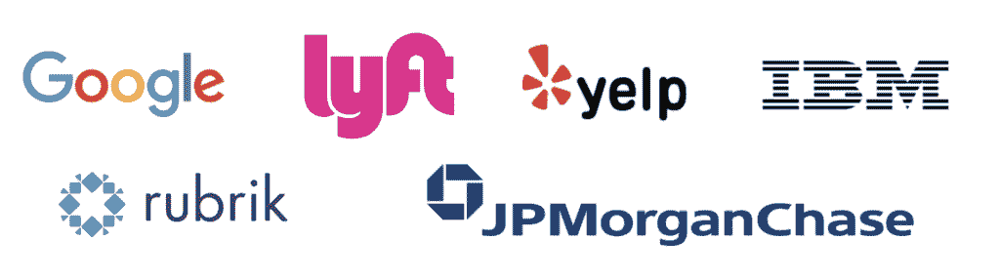
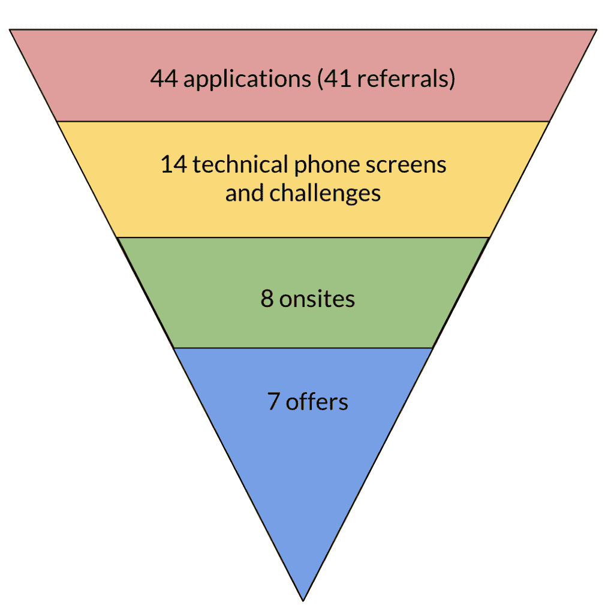
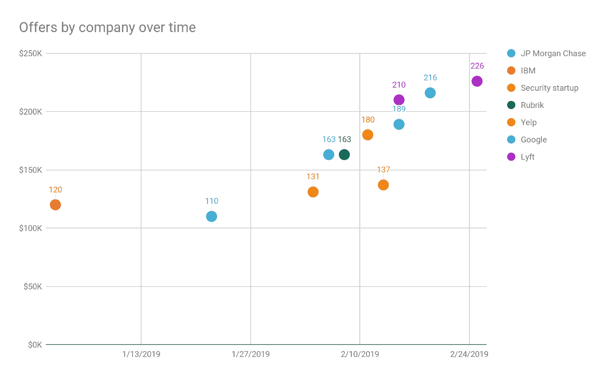

# 我是如何在短短 8 个月内从编写第一行代码到获得 22.6 万美元的工作机会的

> 原文：<https://www.freecodecamp.org/news/first-line-of-code-to-226k-job-offer-in-8-months/>

我收到了谷歌、Lyft、Yelp、云独角兽 Rubrik、IBM 人工智能和摩根大通的邀请。我的故事可能会对你的求职有所帮助。

### 介绍

我希望我的故事能激励当前的软件工程求职者——尤其是非传统背景的求职者。

你可能在想“我也能成功的可能性有多大？”在这篇文章中，我将具体说明我的决定和思考过程。我也会给出进一步阅读的链接。

首先，我必须承认我受益于巨大的特权:我是一名白人、异性恋、独联体男性，拥有美国排名前 20 的大学的学士学位。在旧金山湾区工作三年后，我也建立了一个网络。

每个求职者的故事都会不同，但我希望你的故事能从我的故事中受益。

## **决定冒险一试**

2018 年 7 月 29 日，我做了一个不理智的决定。

我在为一家高速增长的广告技术公司担任参谋长和参加一个编码“训练营”之间做出了选择幕僚长的角色利润丰厚且确定无疑——这似乎是通往硅谷快车道的非凡入场券。训练营似乎既昂贵又冒险。

五周前的 6 月 24 日，我写下了我的第一行 JavaScript 代码，并没有打算成为一名工程师。我已经获得了经济学学位，并作为非营利组织的非技术管理顾问有了三年的经验。我只是想让自己成为一个更有吸引力的候选人，在湾区与工程师一起工作。

事实上，成为一名工程师似乎是一个遥不可及的想法。我听说过有人在不到一年的时间里通过训练营自学成才的故事。但我努力相信我也能做到。

我认识的大多数工程师都有四年的计算机科学学位，多年的经验，而且似乎会说一门外语。我怎么能在这么短的时间内学会所有这些呢？此外，这样做需要我放弃我在运营和战略方面的职业生涯——这是一个不确定回报的高成本。

另一方面，参谋长的角色看起来像是梦想成真。大约 10 年后，我将是“发生的房间”中最年轻的成员，因为该公司正在进行即将到来的收购谈判。薪资谈判比预期的要好，看起来几年后我可能会继承一个属于自己的部门。

但是一旦我开始编码，我就不想停下来。我喜欢技术挑战，很高兴能在如此令人生畏的事情上取得进展。我认为[发展第二种专业技能](https://dilbertblog.typepad.com/the_dilbert_blog/2007/07/career-advice.html)可能会让我为一份非同寻常的有影响力的职业做好准备。

一个来自内心的声音问道，成为一名工程师是否会像专业人士一样带来个人转变:*如果我成功地学会了这一点，我还有什么学不到的呢？这种态度比其他任何东西都更能成为我旅程的主题。*

我参加了一个在线课程，在连续三周每周编程 40 小时后，我决定申请 [Hack Reactor](https://www.hackreactor.com/onsite-immersive) ，我曾听说它被称为“训练营的哈佛”，只是想看看我是否能进去。就在我收到参谋长聘书的那个星期，我勉强通过了入学考试。

经过 72 小时的自我反省，我最后一次检查了我的银行账户。我估计拆了反应堆后我会有三个月的房租和食物。刚刚够时间找工作，我想。

我选择了训练营。

我拒绝了 adtech 公司的电话，挂了电话，我被一股复杂的情绪所打击。我有点害怕:我正在放弃一个千载难逢的登月想法的机会！另一个兴奋的部分:*我和后悔之间唯一的障碍就是冒险！*

很快我的兴奋战胜了。现在不能回头——我是在冒险。

## **学习编码**

> “你不必一开始就变得伟大，但你必须开始变得伟大。”–金克拉

Hack Reactor 和其他“训练营”希望在三个月内完成传统大学计算机科学课程四年内完成的大部分工作:让学生为竞争顶级软件工程工作做好准备。

目标远大，分秒必争。在 3 个月的时间里，每天 12-14 个小时，每周 6 天，这个项目让我们在紧迫的时间限制下不断地完成艰巨的任务。

在每项任务开始时，我都会感到恶心，心想:*这个期限似乎是不可能的——我甚至不知道从哪里开始*！但不知何故，我总是(几乎)在时间到期时拼凑出一个可行的解决方案。

在做了足够多的重复后，我开始把我肚子里的坑和兴奋感联系起来——挑战看起来越不可能，找到解决方案就越令人满意。

Hack Reactor 不仅仅是教授内容，它还教授一种新的[勇气](https://en.wikipedia.org/wiki/Grit_(personality_trait))和[成长心态](https://www.mindsetworks.com/science/)，这个过程令人振奋。

我仍然怀疑自己能否在积蓄耗尽之前找到工作，于是我投资于我能找到的最好的学习和自我护理习惯。

为了保证充足的睡眠来学习，我严格遵守就寝时间。

为了对抗重复性的压力疼痛，提升幸福感，支持学习，我每隔一天进行一次锻炼。

为了提高记忆力，让每一天的学习都比前一天好一点，我复习了核心课程，反思了大多数晚上哪些做得好，哪些做得不好。

最重要的是，为了在如此紧张的时间表中保持基线健康，我每天早上上课前冥想一个小时，通常是结合使用内观(一种身体扫描的形式)和 T2 的慈爱技术。

这最后一个习惯可能会让一些人觉得极端，但是冥想改善健康背后的[证据是强有力的，尤其是](https://nccih.nih.gov/health/meditation/overview.htm)[仁爱](https://www.psychologytoday.com/us/blog/feeling-it/201409/18-science-backed-reasons-try-loving-kindness-meditation)。我不能夸大这种做法的价值，它帮助我拥抱学习的好奇心和快乐，而不是对训练营和不确定就业的挑战感到焦虑。

我也因祸得福。一个旅行冲突使我无法报名参加面对面的沉浸式学习，所以尽管离旧金山校园步行 10 分钟，我还是不得不参加远程课程。由于不需要通勤，很容易获得食物，而且我的公寓很安静，我能够保证每天另外 90 分钟不受干扰的深度工作。

前六周包括两天的结对编程冲刺，构建在半完成的代码库中。我们快速地重写了 JavaScript [下划线](https://underscorejs.org/)库，从头开始构建基本的数据结构，学习面向对象与函数式编程，计算时间和空间复杂度，以及从客户端到服务器再到数据库连接一个完整的堆栈应用程序。我们规模较小的 24 人团队通过每天 10 多个小时的视频会议相互开着玩笑。

三个星期后，我担心自己无法通过门控中期评估，所以我[写了一封未来的信给自己](https://www.creativityatwork.com/2003/01/10/art-of-possibility-ben-zander/)解释我是如何通过评估的。

我提到了我现有的所有自我照顾和学习习惯，并增加了一些，包括审查我没有完全理解的代码，直到我可以在脑海中向一个想象的 8 岁孩子解释核心概念(费曼技术)。

三周后，我在 24 小时内从零开始构建了我的第一个全栈应用程序，并以优异的成绩通过了考试。大学是很好的教育。这是另一个层面。

第二个六周涉及更多自由形式的小组项目。从[积极偏差](https://en.wikipedia.org/wiki/Positive_deviance)中获得灵感，我追踪并联系了在求职中特别成功的训练营校友。我遵循他们的指导，为令人生畏的技术挑战设定严格的个人期限，选择就业市场上的“热门”技能(如与 Docker 和微服务合作)，并在不同的项目中分散我的角色。我和一位校友安排了一次辅导会议，并在两天内成功实现了一项原本需要他花费数周时间的功能。

Hack Reactor 从每个队列中雇佣一些毕业生作为临时的兼职助教来支持全职员工。毕业后，我接受了一份为期 6 周的工作，每周工作约 35 小时，并帮助推出新课程，进行独立研究，就我的发现给求职的校友讲课，并面试即将加入 Hack Reactor 的候选人。

我谈判了一个 6 周的职位，而不是典型的 12 周职位，让我接触新课程，同时限制找工作和全职学习的延迟。我很感激能在工作中学习(尤其是教学促进了我自己的学习),微薄的工资让我多了两个月的生活费——这是一大解脱！

## 获得一份软件工程师的工作

Companies that made me offers

12 月 7 日，在我写完第一行代码 165 天后，我在 Hack Reactor 的工作结束了，剩下的钱可以支付四个月的房租和食物。Hack Reactor 警告毕业生要为六个月的找工作做预算。时间紧迫！

我写下了我的目标。我雄心勃勃，但机会对我不利。我想要:

*   薪酬排名前 25%的黑客反应堆，希望年薪超过 12 万美元
*   最陡的学习曲线；理想的职位是既有自主权又能接触到有经验的导师
*   技术强大但以人为本的团队和公司文化
*   有趣且有意义的工作
*   一个后端角色，或者至少是一个完整的堆栈，这比新兵训练营毕业生登陆的前端角色更不常见

我从未想过我会得到我想要的一切，甚至更多。但是搜索将会是一个跌宕起伏的过山车。

Hack Reactor 让我在很短的时间内打下了一个非常好的基础，但我仍然需要数周(如果不是数月)的全职学习，才能在顶级公司成功面试。

我还将不得不面对无情的、持续的、没有成功把握的拒绝。从编码训练营中招聘还不是主流，尽管有证据表明训练营的毕业生在面试中的表现和那些拥有四年计算机学位的人一样好，但要获得面试机会将是一场艰苦的战斗。软件工程面试中涉及的大量话题意味着我永远不可能完全准备好。

当这一切结束时，我已经向 44 家公司申请了 41 次推荐，并收到了 14 次编码挑战或技术电话采访，到 2019 年 2 月 15 日，即我的第一行代码后 245 天，这些挑战或技术电话采访转化为 8 次现场和 7 次提供。

16% of my applications converted to offers just over 8 months after my first line of code

## 开始探索，从失败中学习

> 学习不是偶然获得的，必须用热情去追求，用勤奋去对待―阿比盖尔·亚当斯

我找工作的头几周是最艰难的。整个 12 月，我只遇到了一些编码挑战和一次 IBM 人工智能的面试。

对我前两次带回家的编码挑战的反馈并不令人鼓舞。随着时间的推移，我去了，并被告知我的代码是“既不准确，也没有性能。”

我的第三个编码挑战是一个持续数小时、令人心跳加速的事件，我在剩下几秒钟的时间里通过了所有测试，但在时间到期前没有点击提交！

我告诉自己这是一个数字游戏，每天早上在我一小时的仁爱冥想后，我会花一分钟提醒自己两件事:

*   首先，虽然我的目标给了我方向，但过度关注目标只会让我对我所在的位置和我想要的位置之间的差距不满意。我想要习惯胜过目标。
*   第二，我意识到不管找到什么工作，这段旅程的真正收获是个人的转变，而不是职业的转变。我很幸运有几个月的时间专门用来学习如何学习，并且我爱上了它！

我知道早期的失败可能是后来成功的种子，但它们需要特别的关注。我确保对每一个失败的编码挑战和面试进行事后分析，然后在我的文本编辑器中重做这个问题，直到我解决它。一个 20 分钟的提示花了我 3 天 9 个小时才解决！

我记下了新的概念和解决问题后的“啊哈”时刻，把它们作为我的“[心智模型](https://fs.blog/mental-models/)的无价收藏，我希望它们能成长到足以匹配任何面试提示的模式。我会以[间隔的重复间隔](https://artofmemory.com/wiki/Spaced_Repetition_and_Recall)来复习它们，以最有效地进行长期记忆。

对于涉及新代码语法的问题，我会在时间压力下重做，以确保在面试环境中准确回忆。

这些习惯不仅提高了记忆力，还建立了令人安心的信心。我不知道我是否能在钱花完之前找到工作，但令人满意的是，即使是我最大的失望也在让我变得更好。

我开始了稳定的日常生活，每天 8 小时，每周 5 天以上:学习和/或面试，诊断失败/成功，反思，重复。

我策划并不断修改我的学习计划，首先对我可能遇到的各种不同类型的面试(数据结构/算法、前端 DOM 操作、系统设计等)中的出色表现有所了解。).然后，我会估计在接下来的面试中遇到每种类型的可能性，并根据我对自己表现的自我评估进行权衡，以决定接下来要学习什么。

为了确保我只使用最好的资源，我保留了按主题组织的同行推荐资源列表。当到了研究这个话题的时候，我会用谷歌快速搜索得到的任何新东西来补充这个列表，然后浏览每一个资源，确定最好的一两个，然后再深入研究。我会在前一天做大部分的优先排序，这样我就可以在第二天从早上的冥想直接进入 2-3 小时不间断的深度工作。

我又花了 2-3 个小时/天来建立吸引公司的渠道，产生推荐，提交申请。完成一份申请花费的时间比我喜欢的要多，而且我的首选数量有限，所以我尽最大努力提高应用程序到面试的对话率

*   在我的简历中，强调结果而不是背景或行动，
*   研究我的哪些方法和信息通过电子邮件和 LinkedIn 获得推荐最快，
*   在电子表格中跟踪我的整个渠道，以及
*   跟进所有的通信。

我将大多数应用程序视为提高投入时间回报的实验。习惯在这里也得到了回报——不断地把公司放在我的渠道中意味着当我收到拒绝时，我可以立即期待下一个机会。

我还尽最大努力安排申请时间，这样我就可以先面试不太理想的公司，同时推进缓慢的流程(比如谷歌)。

我在 IBM 的面试被证明是我艰难起步的一个亮点，但即使如此，它也是在不确定性中坚持的一课。它包括一次电话面试和三次现场面试

每次面试开始时，我都经历着现在熟悉的胃里的那个坑，我想:*我不知道如何做这个*。

每次我都会深吸一口气，提醒自己:*在家里把这种感觉变成一个可行的解决方案是很有趣的，所以想象一下，在风险更高、工作岌岌可危的地方，这会有多有趣！*

在前两次面试后，我想知道我的兴奋和学习倾向是否会传染——我的面试官当然知道我没有马上看到答案，但他们似乎很享受当我接近解决方案时，对话中的能量如何上升。

我离开 IBM 的时候受到了鼓舞，虽然我可能不总是能破解面试提示，但我总能享受在压力下分享成长的心态。我确信这种心态帮助我改变了八个网站中的七个。

幸运的是，12 月的失败播下的种子在 1 月的成功中开花结果。

## 建立势头和早期成功

> “你最艰难的时候往往会带来你一生中最伟大的时刻。坚持下去。”―罗伊·t·贝内特

一月份的第一周，IBM 打电话来提出了一个非正式的提议，正式的细节即将公布。与此同时，我可以用这个作为筹码吗？我以为。我把这个消息告诉了谷歌的一名招聘人员，他的回应是让我通过电话面试，直接进入现场。

突然间，我可以引起招聘人员的注意。我立即通知所有与我交谈的公司，我收到了一份邀请。在新年伊始这样做立即让我的管道升温。

接下来的一周，我第一次在摩根大通现场的四次技术面试中感到自信，在剩余时间内完成了大部分面试。我欣喜若狂，因为我 12 月份的工作得到了明显的回报。

几天后，我的谷歌网站。难度的差异令人震惊。我在涉及异步 JavaScript 承诺的第二次面试中表现糟糕。

午休时，我在休息室里花了一会儿时间进行了一次微型冥想。我想我几乎没有机会获得工作，所以现在的目标是从失败中尽可能多的学习。

我知道我会在晚上做尸检。与此同时，我挑战自己，看看在这样一个高风险的环境中，我能培养出多少感激和镇定。毕竟，我在谷歌面试时有多兴奋？

这个想法似乎帮我摆脱了困境，整个下午我都感觉好多了。当我离开的时候，我甚至对谷歌可能会给我提供一份工作抱有一线希望。

按照我的事后分析习惯，我回家后找到了在线资源来帮助我从零开始构建一个 JavaScript 承诺。第二天，我拿了三个手机屏幕，大起大落的情况又出现了。

我在与一家安全初创公司的通话中表现出色。我用一个小型能源创业公司让自己难堪。我在与云存储独角兽 Rubrik 的电话中经历了一生中的回归。

Rubrik 问了另一个关于承诺的问题，比一天前我在谷歌面试中失败的那个问题更难。做完事后分析后，我当场进行了创新，在时间用完的时候冲向了终点。

面试官说我可能是该公司面试过的第一个训练营毕业生——他们传统上只从名牌大学招聘——他不相信我在去年夏天写了第一行代码。我在房间里跳了会儿舞。

第二周，摩根大通打电话给我，给我 11 万美元/年，没有股权和奖金。我不认为这是一个文化契合，我还没有达到 12 万美元/年的目标，但我很高兴有了我的第一份正式工作。有人要付钱让我写代码！

我开始每天处理几个来自电话面试者、招聘人员和顾问的电话，而且经常不可预测的起伏还在继续。谷歌打电话来说，现场结果喜忧参半，但我会去招聘委员会。优步提供了现场服务。我认为我在亚马逊手机屏幕上表现很好，但没有获得现场支持。我以为我炸了 Yelp 手机屏幕，得到了一个现场。

随着现场工作的来来去去，我不得不在招聘人员面前小心说话。这家安全初创公司说，他们担心赶不上 IBM 和摩根大通这样的大公司，并问我收到了什么样的薪水。

我几乎上钩了，但我停顿了一下，并按照 Hack Reactor 的指示转移了薪资问题。*“*实际上我想走另一条路——你能告诉我你的范围吗，我会告诉你你是否在大概范围内？”我说。“当然，我们的起价是 12.5 万美元。”

十二万五千美元。那超过了我的目标！

我看向别处，希望通过让它看起来像是我在想这件事来掩饰我的兴奋。我回过头，平静地说，*如果那是你的出发点，我想我们可以进行一次对话。”他回应道:“哦，太好了，我很欣慰我们还有机会！”*我也是，*我想。*

*几天后，正式报价出来了:12.5 万美元，外加按当前估值计算的每年 6 万美元的股票期权。但是这些钱几乎微不足道！这是一个很好的文化契合，一个迷人的后端角色，导师机会看起来异常多。这个由大约 40 名工程师组成的团队都有至少两年的工作经验，并且大部分来自顶尖学校，如麻省理工学院、斯坦福大学或伯克利大学。这是我想要的一切！*

*但是优惠才刚刚开始。*

## *就报价进行谈判并选择公司*

> *卓有成效的谈判者会越过对方声明的立场，深入探究他们潜在的动机...他们非常好奇。"–克里斯·沃斯*

*两天后，Rubrik 打电话给我，让我震惊。他们也想让我成为他们的第一个新兵训练营雇员。Rubrik 的估值已经达到 33 亿美元——这是一个炙手可热的新独角兽，也是经验丰富的软件工程师梦寐以求的工作场所。我和招聘人员一起笑了，欣喜若狂，这样一个竞争激烈的公司想要我，挂电话时我兴奋得几乎没有意识到我有一个来自谷歌的未接电话。*

*我屏息回拨。招聘人员开门见山:“我刚从招聘委员会出来，想马上给你打电话。我们想给你一个提议——”*

*我控制不住自己。我喊道，跳进我的空厨房。谷歌！软件工程的黄金标准和我最难的面试官已经决定要我了！然后她提到了数字，事情变得超现实了。163，000 美元全包:120 美元基本工资、18，000 美元最低奖金和 25，000 美元年度(流动)股权。*

*16.3 万美元。*

*你疯了吗？我以为。我最近的纳税申报单申报了 77，000 美元。*那是一大笔钱。**

*我请了一个下午的假，在我家附近跳舞，当时我以为没有人在看，并打电话给家人分享这个令人难以置信的消息。*

*第二天早上，我又回到了工作岗位，学习谈判而不是算法。一夜之间，指导我面试的招聘人员变成了我的谈判对手。我感觉自己就像一群狼中的一只孤独的绵羊——这些都是专业人士，在持续几分钟的对话中，数字可以带来数万美元。*

*起初，我担心会被视为贪婪，但我的黑客反应堆职业教练态度坚决。她说这是意料之中的事，除了钱，这显示了在艰难的谈话中的体贴和自信，并为工作的第一周设定了期望。*

*

I saw almost a 90% increase in compensation by waiting and passing on my first offer* 

*接下来的几天在与招聘人员和顾问的一系列电话中度过，学习、准备和进行谈判的事后总结。我写了一页纸，预测每一次谈判，并对哪些进展顺利，哪些进展不顺利进行事后分析，类似于我对失败面试的反思。*

*我学会了爱它。每一次对话都是一个迷人的谜题，从高层次的策略，比如我何时以及如何分享信息，到即时策略，比如我的语气。有这么多面试机会尤其有趣——我有时会在一天之内与多个招聘人员交谈，每个电话都是尝试新技能和从错误中学习的又一次机会。*

*我在大学读过哈佛谈判项目的*获得肯定*和*获得否定*，熟悉 BATNA 和双赢解决方案等概念。但我的大部分灵感来自克里斯·沃斯的*永不分裂*，在谷歌出价后，我立即重读了这本书。*

*我还浏览了另一位来自训练营的毕业生 Haseeb Qureshi 的博客文章，并定期与我的黑客反应堆职业教练聊天，他在我之前已经建议了数百次谈判。*

*Rubrik 的第一个报价是 16.3 万美元，与谷歌完全匹配。然后 Yelp 打电话告诉我最新的剧情转折。他们将我的申请“提升”到非入门级职位，并给了我 16 万美元，外加 2 万美元的签约奖金，作为第一年 18 万美元的总薪酬。*

*18 万美元和一个非入门级的角色？*

*我在 Yelp 的面试中展现了自己最出色的表现——在有剩余时间的情况下完成了每个挑战，无缝地修改代码以满足新的约束，并使用信封背面的计算对系统架构发表了评论，这似乎让我的面试官感到惊讶。但这并没有改变我零经验的事实！谷歌和 Rubrik 立即表示，他们将准备还价。*

*最后，求职达到了高潮。*

*Lyft 发邮件要求接通电话。Lyft 是迄今为止我最喜欢的面试经历，但我不认为我的现场表现值得一份工作。我几乎立即从概念上解决了一个面试，但从未让我的代码工作。我在另一场比赛中完成了一次迟到的复出，但由于时间已过，我没有提交。经过多轮日常谈判，我回复了这封邮件:*

*“我现在正在应付几个不同的电话。你介意用电子邮件告诉我这个消息吗？我猜这是拒绝，在这种情况下，我希望每次面试都能得到 1-2 句反馈。除此之外，感谢您抽出时间指导我完成这一过程！”*

*她用一句话回应:*“不是拒绝:)”**

**什么！没有公司会拒绝我吗？*我不敢相信我的首选又回来了。第二天我们讨论了数字:21 万美元全押。*

*21 万美元。*

*想想那是 Lyft，我喜欢在那里工作，撇开钱不谈！我在 Lyft 的几个朋友是我最喜欢的人——很难说他们是善良还是聪明——我的面试官似乎都是一路货色。*

*我通知每个人最后一分钟的报价已经做出，并设定一周的决定期限，鼓励每个人做出他们的最终报价。我在不断的谈判中筋疲力尽，我觉得最后期限会在专业上限制每个人对我的候选人资格投入的时间，沃斯建议可以利用最后期限为你带来好处。*

*谷歌已经准备了 18.9 万美元来收购 Yelp，但表示鉴于 Lyft 的消息，它会再次回来。Rubrik 同意打电话。Yelp 和这家安全初创公司表示，他们无法进一步谈判，我也不再让摩根大通(JP Morgan Chase)或 IBM 了解最新进展。优步，我在现场唯一的另一个人，没有给我一个报价。*

*Lyft 团队请我吃午饭，我晕了过去。谷歌、Yelp 和安全初创公司的团队令人愉快，但有 9 个人抽出时间在 Lyft 与我共进午餐，笑着好像我已经是团队的一员。他们想让我参与公司 2019 年的首要任务，一位高级工程师告诉我，他很乐意担任导师。Lyft 还有几个月就要上市了。*

*我拥有一切:导师、高增长环境中的机会、以人为本的文化、令人兴奋的工作，以及现在高得离谱的薪酬。*

*Rubrik 没有及时还价，但谷歌的出价是 23.3 万美元，在他们的 401(k) match 和慈善 match 计划之前是 21.6 万美元(我认为这是一笔不错的现金，因为我[挣了就给了](https://en.wikipedia.org/wiki/Earning_to_give)，今年将捐出我税前收入的 25%)。这个团队也有很好的文化契合度，谷歌在将初级工程师培养成顶尖人才方面是世界一流的。*

*我在谷歌和 Lyft 之间摇摆不定，挣扎了好几天，但我逐渐相信，除了薪酬，Lyft 是一个我不能错过的机会。我谈妥了 226 美元的一揽子最终薪酬:135000 美元的基本工资，71000 美元的上市前估值，以及 20000 美元的签约奖金。2 月 25 日，星期一，在我写完第一行代码的 245 天后，我说出了结束这一切的两个字:“我接受。”*

*六个月后，我在 Lyft 工作得再开心不过了。令我高兴的是，我早晨的倒影完全正确。我的团队很支持我，我的工作很吸引人，我的报酬也很丰厚，但成为一名工程师的无价回报是爱上学习。既然恋爱了，就不打算离开了。*

## *寻找软件工程职位？*

*我整理了一份我用来准备面试的顶级资源清单。我还为那些承诺将未来收入的 10%或更多捐给高影响力慈善机构的求职者提供辅导课程。**在这里访问两个[。](http://www.swejobsearch.com/resources/)***

*注意:我用笔名写作，是为了在我的个人生活和作为一名求职教练的日益增多的存在之间保持一点距离。*

*我在本文中分享具体的薪酬信息有两个原因。第一，我希望这篇文章对非传统背景的求职者尽可能有用，他们中的许多人可能不太熟悉这些数字。第二，因为[分享我们的薪水](https://www.nytimes.com/2018/08/31/smarter-living/pay-secrecy-national-labor-rights-act.html)是对抗伤害所有人[尤其是少数民族](https://leanin.org/equal-pay-data-about-the-gender-pay-gap)的薪酬不平等的具体方式。*

*打击薪酬不平等也符合 Lyft 的使命和文化，Lyft 非常致力于打击薪酬不平等。它每年管理第三方薪酬公平审计，在过去的一年里，Lyft 成为硅谷的另一种“独角兽”，因为[没有发现系统性薪酬差距](https://www.forbes.com/sites/maggiemcgrath/2019/07/31/lyfts-2019-pay-equity-audit-has-a-surprising-result-its-male-and-female-employees-earn-the-same-thing/#56e6e0357a8d)。在 [paysa](https://www.paysa.com/salaries/software-engineer--t) 、 [levels](https://www.levels.fyi/) 和 [blind](https://www.teamblind.com/search/software%20engineer%20lyft) 等网站上已经有精确的薪资信息，所以这里分享的细节并不新鲜。*

*最后，我要感谢这段旅程中许多人的支持，特别是我的求职教练和谈判顾问莉娜·约翰逊，以及我的技术导师罗宾·金。谢谢大家！*