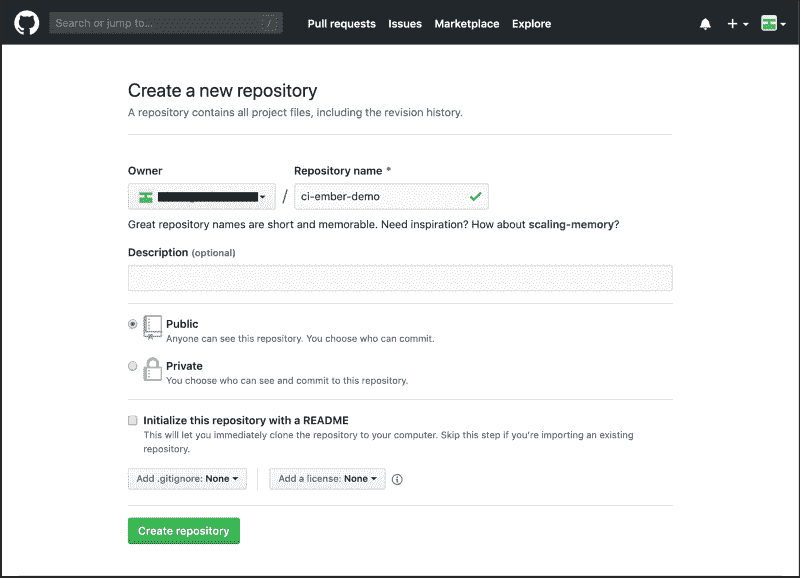
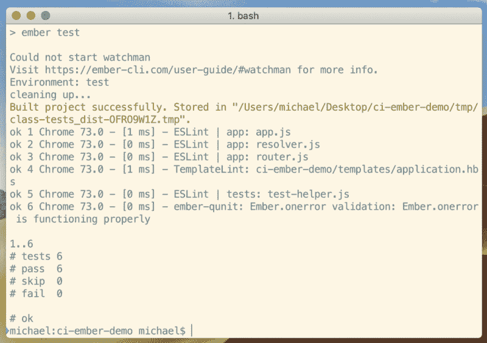
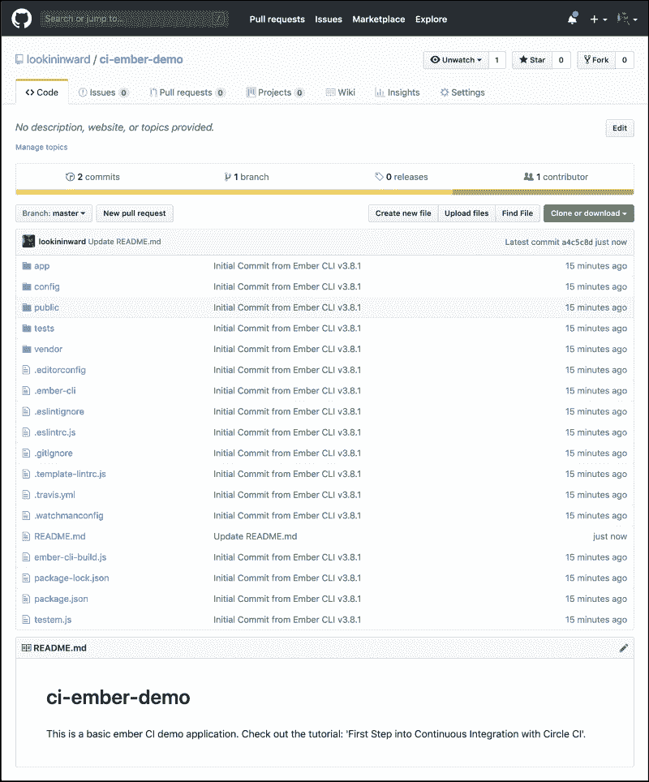
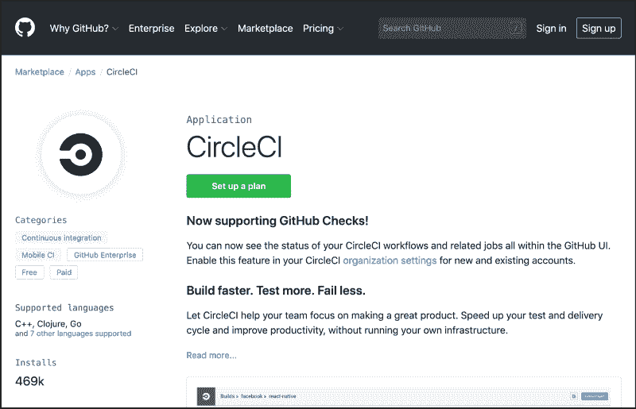
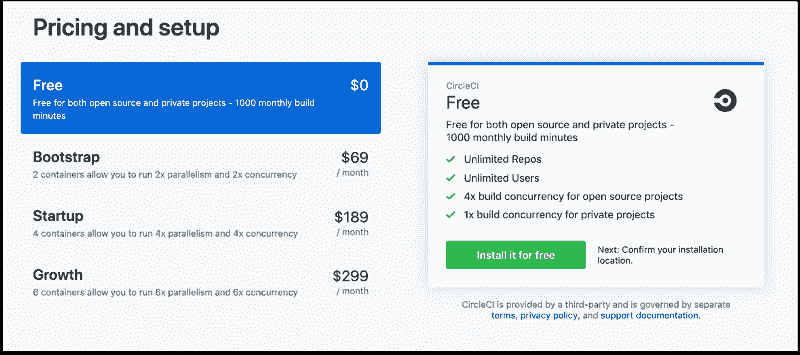
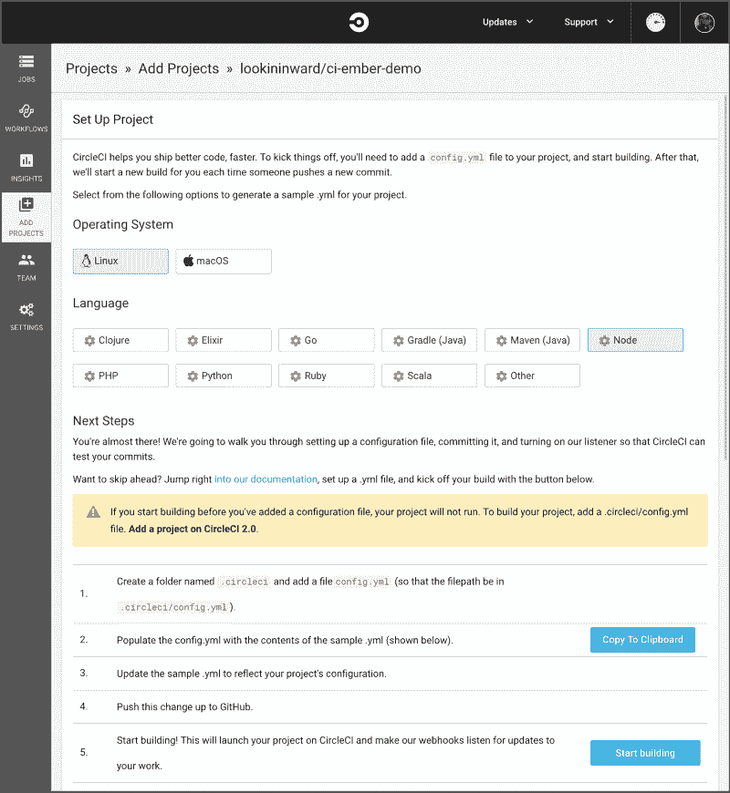
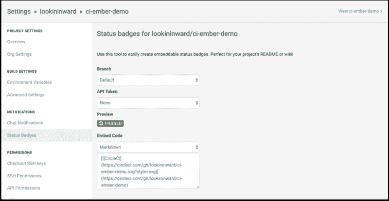
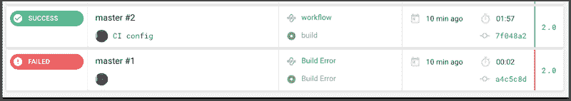
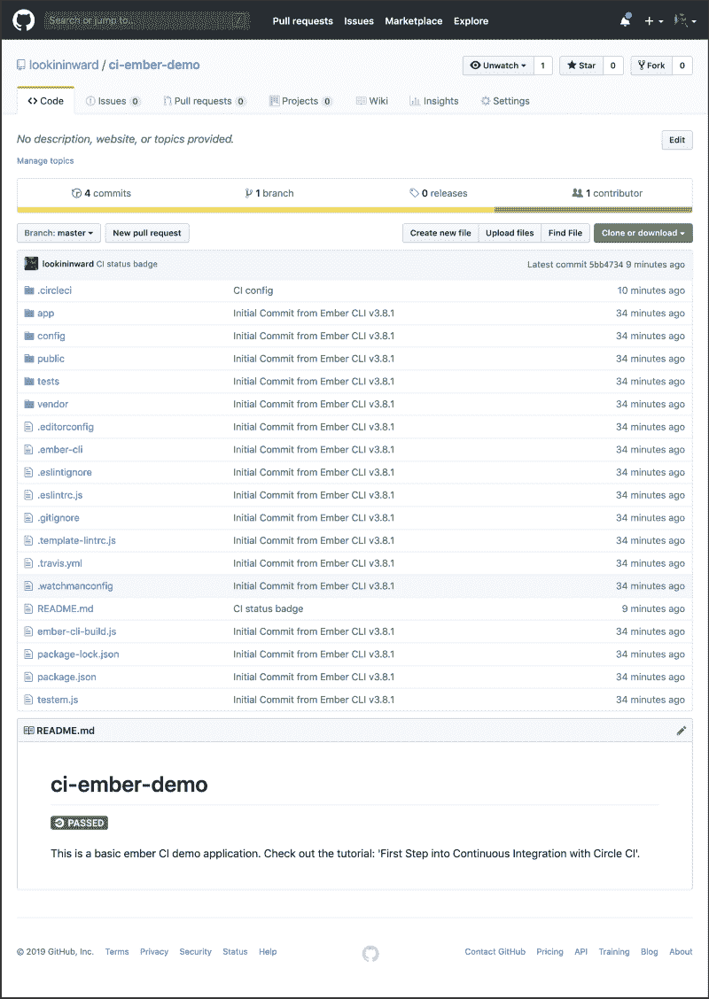

# 如何设置与 Circle CI、EmberJS 和 GitHub 的持续集成

> 原文：<https://www.freecodecamp.org/news/first-steps-into-continuous-integration-with-circle-ci-emberjs-and-github-1e273ea62f0c/>

### **什么是持续集成，我们为什么要这样做？**

持续集成(CI)是自动构建和测试代码的过程。每当项目团队成员提交对版本控制的更改时，都会发生这种情况。

例如，您对 GitHub 存储库的代码进行了更改，并将该更改推送到主分支。这将触发 CI 流程来构建虚拟环境并运行命令。这些命令将环境配置为生产服务器上的环境。然后他们运行你写的自动化测试套件来测试你的代码。

CI 通常用于:

*   验证开发人员正在处理的独立分支。在合并到项目的主分支之前，分支都经过了充分的测试。
*   当分支通过验证时，验证和部署项目的最新版本。

将代码持续集成到项目中并对其进行测试可以减少:

*   合并冲突
*   很难修复错误
*   不同的代码策略
*   重复的努力

它能保持主枝的清洁。点击阅读更多关于持续集成的信息[。](https://docs.microsoft.com/en-us/azure/devops/learn/what-is-continuous-integration)

### 教程目标

这是您进入持续集成过程的第一步。所以，让我们保持事情非常简单。我们的目标是在 GitHub 上创建一个存储库，并在每次推送新的提交时在该存储库上运行 CI。我们还将显示一个徽章，表明我们当前构建的状态。

我们将在本次演示中使用的工具:

*   [GitHub](https://github.com/)
*   循环
*   [人类](https://ember-cli.com/)

现在让我们开始吧。

### **设置 Github 账户**

如果你还没有，给自己弄一个[免费的 GitHub 账户](https://github.com/)。

接下来，前往[账单设置](https://github.com/settings/billing)并输入您的支付信息。不用担心被收费。我们将每月有 1000 分钟的免费建设分钟，我们将选择的选项(圈 CI)。对于这个演示项目来说，这已经足够了。

最后，创建一个名为 **ci-ember-demo** 的新存储库。不要初始化它。



### 创建一个基本的 Ember 应用程序

#### **安装 Ember CLI**

让我们使用 NPM 来安装 [Ember CLI](https://ember-cli.com/) 。它包括我们生成一个基本项目所需的工具。

```
npm install -g ember-cli
```

#### 创建一个 Ember 项目

让我们使用 Ember CLI 创建一个名为 **ci-ember-demo** 的项目:

```
# cd into the desktop
  cd ~/desktop/
# create a new project
  ember new ci-ember-demo
# cd into the directory
  cd ci-ember-demo
# run the server
  ember s
```

现在，转到`http://localhost:4200`，您应该会看到这个屏幕:


Up and running

基本 Ember 项目正在按预期运行。可以用`ctrl+C`关闭服务器。

#### 检查默认测试是否通过

现在，让我们在终端中运行项目生成的测试:

```
npm test
# alternatively
ember test
```



您应该会看到运行了一系列的六个默认测试。一切都会过去。

这个想法是，当您开发项目时编写的这些和其他测试将随着您将变更推送到存储库而持续运行。

### **将您的项目推送到 Github**

前往 **ci-ember-demo** 项目文件夹编辑`README.md`文件。将现有内容替换为如下内容:

```
## ci-ember-demo
```

```
This is a basic Ember CI demo application. Check out the tutorial: 'First Step into Continuous Integration with Circle CI'.
```

#### 获取您的远程 URL 并设置它

回到你的 GitHub 库，获取远程 URL，看起来应该是这样的:

```
git@github.com:username/repo_name.git
```

在 **ci-ember-demo** 文件夹中初始化存储库:

```
git init
```

然后[添加远程 URL](https://help.github.com/articles/adding-a-remote/) ,这样 Git 就知道我们将文件推送到哪里:

```
git remote add origin git@github.com:username/repo_name.git
# check that it's been set, should display the updated origin
  git remote -v
```

是时候把我们的代码推送到 Github 了:

```
# add all changes
  git add .
# create a commit with a message
  git commit -m "[INIT] Project"
# push changes to the repo's master branch
  git push origin master
```

远程 Git 存储库更新了我们推送的更改:



现在我们有了一个主项目目录和一个存储库。是时候搭建 CI 平台了。

### 设置 CircleCI —持续集成和交付平台

CircleCI 将是我们持续集成的首选工具。它简单明了，广受欢迎，并且每月有 1000 分钟的免费构建时间。

前往 [GitHub 的市场](https://github.com/marketplace/circleci)制定一个计划。



选择免费计划。



接下来前往 CircleCI，使用您的 GitHub 帐户登录[:](https://circleci.com/vcs-authorize/)


进入后，转到**添加项目**部分。您将看到所有 GitHub 库的列表。

在我们的 **ci-ember-demo** 上点击**设置项目**。

然后选择 Linux 作为我们的操作系统和语言节点。



点击**开始建造**。该项目将尝试构建并做持续集成过程所做的事情。

由于我们没有配置设置，该过程几乎会立即失败。

转到 **Builds** 选项卡，它列出了所有运行的**作业**，您应该会看到这样的失败:


这是我们所期望的。因为没有配置 CI 流程，所以什么都不会真正起作用。

### **在 Ember 项目中配置 CI**

#### **获得降价以显示我们项目的 CI 状态**

CircleCI 提供可嵌入的状态徽章。它们显示您最新构建的状态。在我们走之前，让我们把状态徽章的价格降下来。

进入设置→项目→ **ember-ci-demo** 的设置→状态徽章。

复制 Markdown 中的嵌入代码。



在 **ci-ember-demo** 的`README.md`文件中，将嵌入代码粘贴到标题下。它看起来会像这样:

```
## ci-ember-demo
[](https://circleci.com/gh/username/ci-ember-demo)
...
```

#### 添加配置项配置

在**的根目录下，ember-ci-demo** 创建一个名为`.circleci`的文件夹和一个名为`config.yml`的文件。这是我们所有配置设置的位置。添加以下内容:

```
version: 2
jobs:
  build:
    docker:
      - image: circleci/node:7.10-browsers
        environment:
          CHROME_BIN: "/usr/bin/google-chrome"
    steps:
      - checkout
      - run: npm install
      - run: npm test
```

让我们停下来看看这里发生了什么。

```
# set the version of CircleCI to use.
# we'll use the latest version.
version: 2
```

接下来，我们将设置当 CI 被触发时运行的作业。

```
jobs:
  # tell CI to create a virtual node environment with Docker
  # specify the virtual image to use
  # the -browsers suffix tells it to have browsers pre-installed
  build:
    docker:
      - image: circleci/node:7.10-browsers

        # use Google Chrome to run our tests
        environment:
          CHROME_BIN: "/usr/bin/google-chrome"
```

最后，让我们告诉它在环境设置好之后要做什么:

```
steps:
  - checkout

  # install the required npm packages
  - run: npm install
  # run the test suite
  - run: npm test
```

#### 将更改推送到主分支。

检查您的更改，并将它们提交到存储库的主分支。

现在，回到 CircleCI，查看一下**工作**标签。您现在将看到一个经过的构建。它能够从`config.yml`获取设置，建立正确的虚拟环境，并运行我们的测试，就像我们第一次生成项目时在本地所做的一样。



如果你在 GitHub 上查看这个库，你会看到绿色的 CircleCI 状态标记。这再次表明最新的构建正在通过。



### **结论**

就是这样！现在，每当您创建一个新的 pull 请求或者将任何更改推送到 master 时，CI 将运行所有的测试。该作业的状态将显示在 CircleCI 和存储库中的徽章中。不管是通过还是失败，你都可以获得发展所需的正确信息。

祝贺您迈出持续集成的第一步！


Exciting times

### 来源

[什么是持续集成？—山姆·古肯海默](https://docs.microsoft.com/en-us/azure/devops/learn/what-is-continuous-integration)