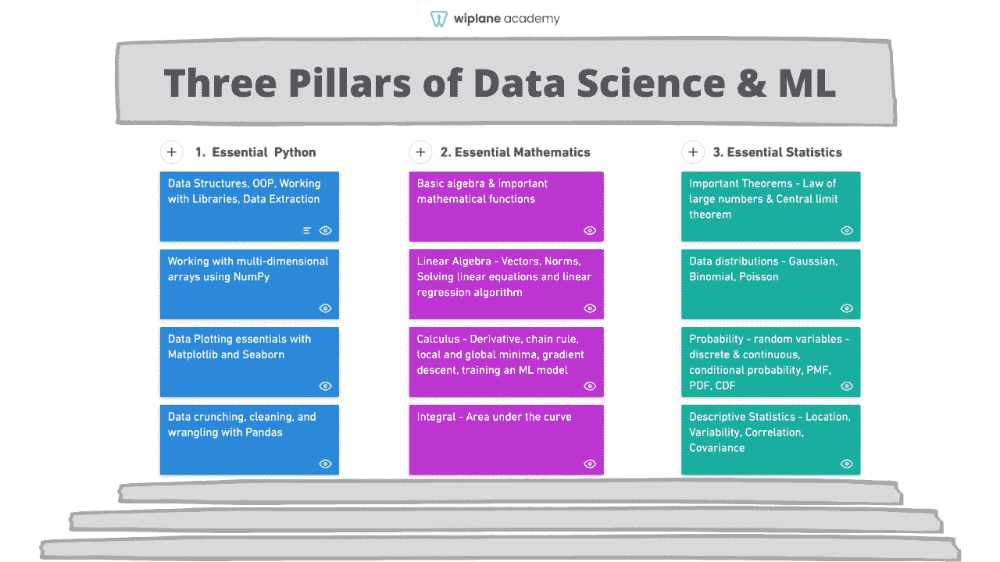
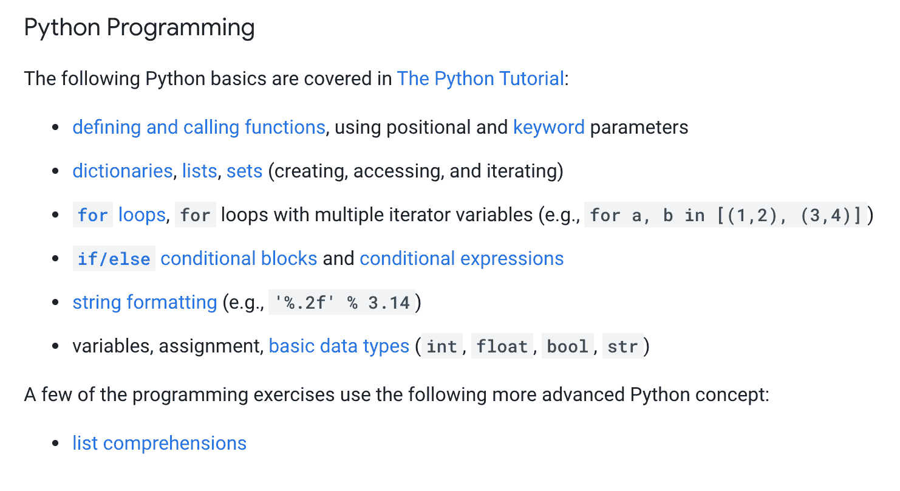
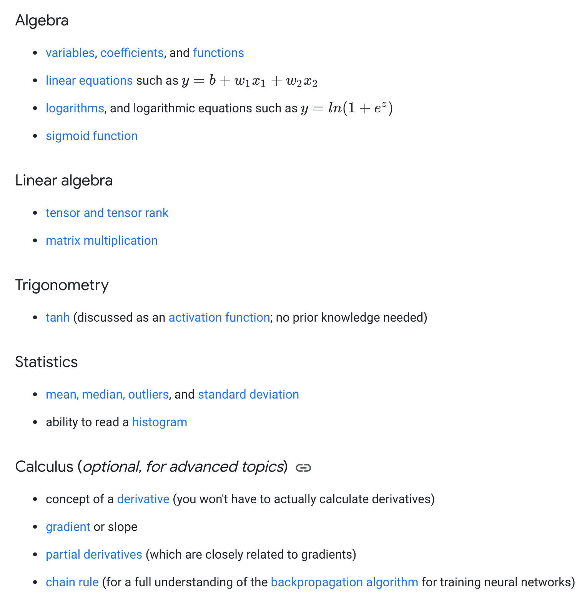
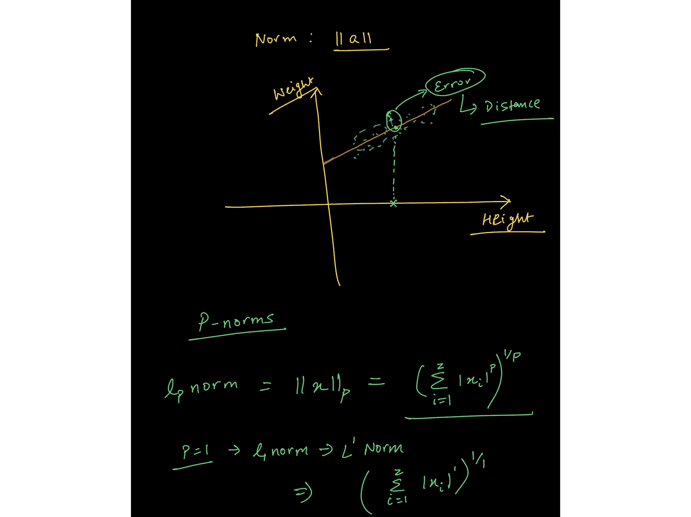
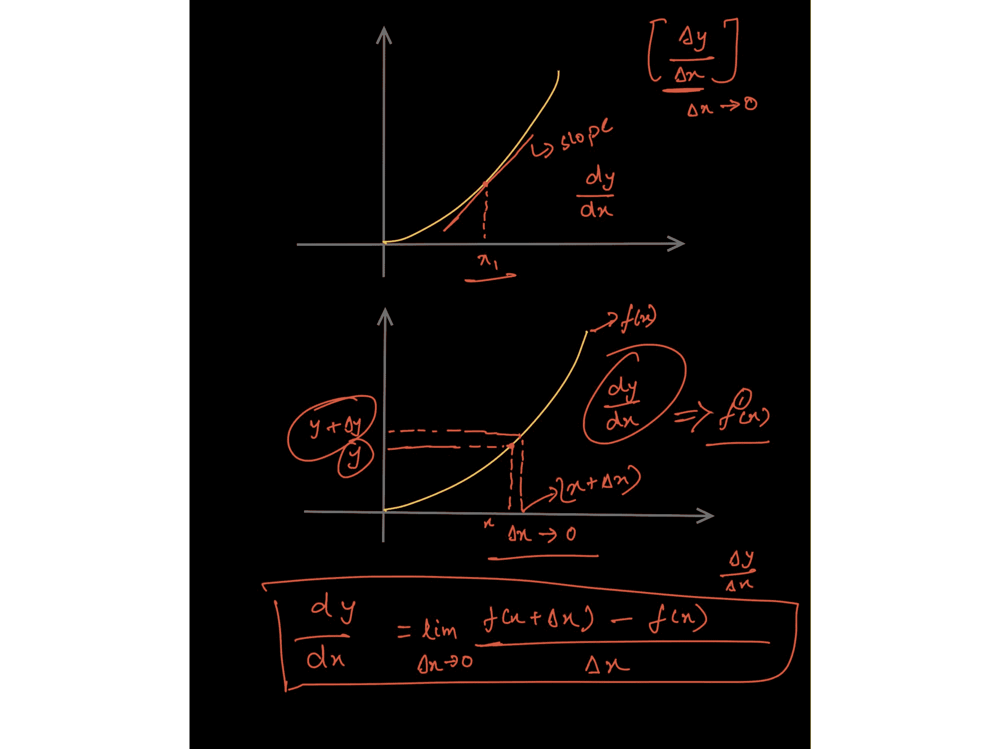
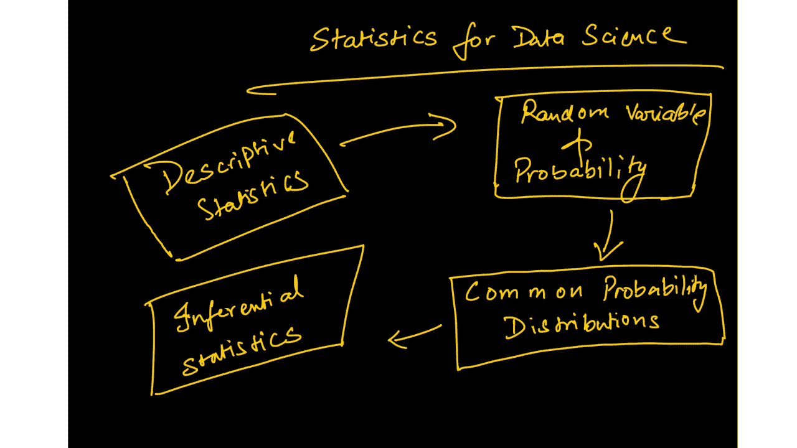
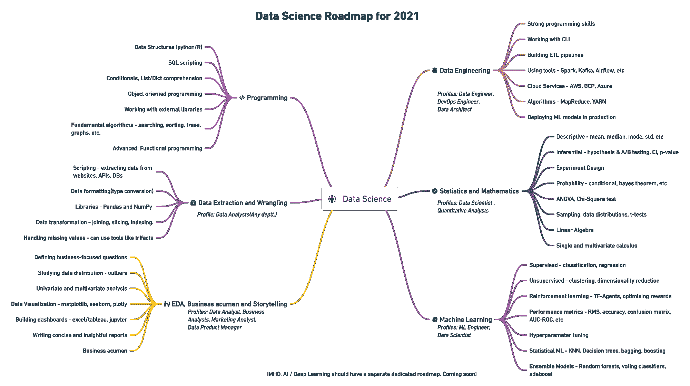

# 数据科学和机器学习需要了解的编程、数学和统计学

> 原文：<https://www.freecodecamp.org/news/first-steps-to-learn-data-science-or-ml-after-the-roadmap/>

今年年初，我发表了一篇关于[数据科学学习路线图(如下图)](https://www.freecodecamp.org/news/data-science-learning-roadmap/)的思维导图。许多人发现路线图很有用，我的文章被翻译成了不同的语言，很多人感谢我发表了它。

一切都很好，直到有几个开发者指出资源太多，而且很多都很贵。Python 编程是唯一一个有很多非常好的课程的分支，但对于初学者来说，它就到此为止了。

关于基础数据科学的几个重要问题让我印象深刻:

*   学会如何编码后应该做什么？有没有帮助你巩固数据科学基础的主题？
*   如果你讨厌数学和教程，或者太基础或者太深奥怎么办？我可以推荐一门紧凑而全面的数学和统计学课程吗？
*   有多少数学知识足以开始学习 ML 算法是如何工作的？
*   数据分析或数据科学入门的基本统计主题是什么？

你可以在由**伊恩·古德菲勒和约舒阿·本吉奥合著的《深度学习》一书中找到这些问题的答案。但是对许多人来说，这本书有点太专业和数学了。**

因此，在本文中，我将列出学习数据科学或机器学习应该采取的一些初步措施。

## 数据科学和机器学习的三大支柱

Source: [wiplane.com](https://www.freecodecamp.org/news/first-steps-to-learn-data-science-or-ml-after-the-roadmap/wiplane.com)

如果你仔细阅读任何 ML/DS 课程的先决条件或准备工作，你会发现编程、数学和统计学的结合。

以下是[谷歌推荐](https://developers.google.com/machine-learning/crash-course/prereqs-and-prework)你在参加 ML 课程前应该做的事情:

Google's recommended Python skills for Data Science and Machine Learning

Google's recommended Math and Statistics skills for ML and DS ([Source](https://developers.google.com/machine-learning/crash-course/prereqs-and-prework))

让我们更详细地了解一下这些基本技能，看看你需要学习什么才能进入数据科学和机器学习领域。

## 数据科学和机器学习的基本编程技能

大多数数据角色都是基于编程的，只有少数例外，如商业智能、市场分析、产品分析师等。

我将专注于需要至少一门编程语言专业知识的技术数据工作。

相对于其他语言，我个人更喜欢 Python，因为它的多功能性以及相对容易学习。毫无疑问，这是开发端到端项目的好选择。

### 数据科学需要了解的主题和库:

*   **常用数据结构**(数据类型、列表、字典、集合、元组)、编写函数、逻辑、控制流、搜索和排序算法、面向对象编程、与外部库协同工作。
*   **编写 Python 脚本来提取**，格式化数据，并将数据存储到文件或数据库中。
*   **处理多维数组**，使用 NumPy 进行索引、切片、转置、广播和伪随机数生成。
*   使用 NumPy 等科学计算库执行矢量化运算。
*   **使用 Pandas** 操作数据—系列、数据帧、数据帧中的索引、比较运算符、合并数据帧、映射和应用函数。
*   **使用 Pandas** 处理数据——检查空值、输入空值、对数据分组、描述数据、执行探索性分析等等。
*   **使用 Matplotlib** 的数据可视化 API 层次结构，如何向绘图添加样式、颜色和标记，各种绘图的知识以及何时使用它们，线图、条形图、散点图、直方图、箱线图和 Seaborn，用于更高级的绘图。

## 数据科学和机器学习的基础数学

对于那些想成为人工智能从业者、数据科学家或深度学习工程师的人来说，数学是必不可少的，这是有实际原因的。

### 您将使用线性代数来表示数据

An image from the lecture on Vector Norms ([from this course](https://www.wiplane.com/p/foundations-for-data-science-ml))

ML 本质上是数据驱动的。数据是机器学习的核心。我们可以将数据视为**向量—** 遵循算术规则的对象。这让我们理解了线性代数的规则是如何操作数据数组的。

### 您将使用微积分来训练 ML 模型

模型训练不会“自动”发生。微积分推动了大多数 ML 和 DL 算法的学习。

最常用的优化算法之一——**梯度下降**——是偏导数的应用。

模型是某些信念和假设的数学表示。它(大致)了解数据是如何提供的过程(线性、多项式等)，以及数据最初是如何生成的。然后，它根据学习过程进行预测。

### 数据科学和机器学习需要了解的重要数学主题:

*   **基础代数—** 变量、系数、方程、函数—线性、指数、对数等等。
*   **线性代数—** 标量、向量、张量、范数(L1 & L2)、点积、矩阵的类型、线性变换、用矩阵符号表示线性方程、利用向量和矩阵解决线性回归问题。
*   **微积分—** 导数和极限、导数规则、链规则(用于反向传播算法)、偏导数(用于计算梯度)、函数的凸性、局部/全局最小值、回归模型背后的数学、从头开始训练模型的应用数学。

## 数据科学和机器学习的基本统计学

如今，每个组织都在努力成为数据驱动型组织。为了实现这一目标，数据分析师和科学家需要以不同的方式使用他们的数据，以推动他们的决策。

### 如何描述数据——从数据到见解

数据总是原始而丑陋的。最初的探索告诉您缺少什么，数据是如何分布的，以及清理数据以满足最终目标的最佳方式是什么。

为了回答已定义的问题，描述性统计使您能够将数据中的每个观察结果转化为有意义的见解。

### 如何量化不确定性

你还需要能够量化不确定性，这是一项非常有价值的技能，在任何数据公司都受到高度重视。了解任何实验/决策的成功机会对所有企业都至关重要。

### 数据科学和机器学习需要了解的基本统计数据:

*   位置估计值——平均值、中间值和其他变量。
*   可变性的估计
*   相关性和协方差
*   随机变量
*   数据分发— PMF、PDF、CDF
*   条件概率—贝叶斯统计
*   常用的统计分布——高斯分布、二项式分布、泊松分布、指数分布。
*   重要定理-大数定律和中心极限定理。

Image from the lecture on Poisson distribution ([from this course](https://www.wiplane.com/p/foundations-for-data-science-ml))

*   **推断统计—** 一种更实用、更高级的统计分支，有助于设计假设检验实验，推动我们深入理解指标的含义，同时帮助我们量化结果的重要性。
*   **重要测试—** 学生的 t 检验、卡方检验、ANOVA 检验等等。

现在你知道了。每个初级数据科学爱好者都应该在深入任何核心数据科学或 ML 课程之前关注这三大支柱。

## 学习数据科学和机器学习基础知识的资源

[https://www.freecodecamp.org/news/data-science-learning-roadmap/](https://www.freecodecamp.org/news/data-science-learning-roadmap/)

我的学习路线图也告诉你要学什么，上面有你可以用来学习这些技能的资源、课程和计划。

但是在推荐的资源和我绘制的路线图之间有一些不一致。许多人都在寻找一个紧凑，全面，但负担得起的课程。

### 数据科学或 ML 课程的问题

1.  我在那篇文章中推荐的每一门数据科学课程都要求您对编程、数学或统计有相当好的理解。例如，[吴恩达最著名的 ML 课程](https://www.youtube.com/watch?v=PPLop4L2eGk&list=PLLssT5z_DsK-h9vYZkQkYNWcItqhlRJLN)也非常依赖学生对向量代数和微积分的理解。
2.  大多数涵盖数据科学的数学和统计学的课程只是 DS/ML 所需概念的清单，没有解释它们如何应用以及它们如何被编程到机器中。
3.  有一些特殊的资源可以深入研究数学，但我们大多数人并不适合数学，你不需要成为数学金牌获得者来学习数据科学。

**底线:**缺少一种资源，这种资源涵盖了足够的应用数学、统计学或编程，可以开始学习数据科学或 ML。

### 双翼学院

所以，我决定让步，全靠自己。在过去的三个月里，我制定了一套课程，为你的职业生涯打下坚实的基础

*   数据分析师
*   数据科学家
*   ML 从业者/工程师

因此，我在这里向您介绍数据科学的 [**基础或 ML**](https://www.wiplane.com/p/foundations-for-data-science-ml)**——**[**学习数据科学和 ML**](https://www.wiplane.com/p/foundations-for-data-science-ml) 的第一步

That's me when I decided to launch.

这是一门全面而紧凑且负担得起的课程，不仅涵盖了**所有的基本要素、先决条件和准备工作**，还解释了如何通过计算和编程(用 Python 语言)来使用每个概念**。**

不仅如此，我还会根据您的反馈每月更新课程内容。

点击了解更多[。](https://www.wiplane.com/p/foundations-for-data-science-ml)

#### 早鸟优惠！

我很高兴启动本课程的预售，因为我目前正在录制和编辑 2-3 个模块(15-20 个讲座)的最后部分。这些也将在 9 月的第一周上线。

抢早鸟优惠，有效期仅至 2021 年 8 月 30 日。