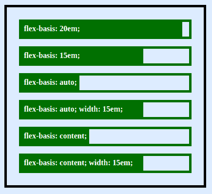
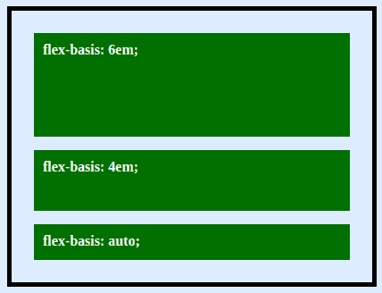

# Flexbox 中的 Flex Basis 属性

> 原文：<https://www.freecodecamp.org/news/flex-basis-property-in-flexbox/>

# **弹性基础**

`flex-basis`属性定义了`flex-item`沿着 flex 容器主轴的大小。如果`flex-direction`设置为`row`，主轴是水平的，如果`flex-direction`属性设置为`column`，主轴是垂直的。

## **语法**

```
flex-basis: auto | content | <width> | <height>;
```

## **弹性基础:自动**

`flex-basis: auto`查找元素的主要尺寸并定义尺寸。例如，在一个水平的 flex 容器上，如果容器轴是垂直的，`auto`将寻找`width`和`height`。

如果没有指定大小，`auto`将回退到`content`。

## **弹性基础:内容**

`flex-basis: content`根据元素的内容解析大小，除非`width`或`height`通过普通`box-sizing`设置。

在`flex-basis`为`auto`或`content`的两种情况下，如果指定了主尺寸，则该尺寸优先。

## **弹性基础:**

这就像指定`width`或`height`一样，只是更加灵活。`flex-basis: 20em;`会将元素的初始大小设置为`20em`。其最终大小将基于可用空间、`flex-grow`倍数和`flex-shrink`倍数。

规范建议使用`flex`速记属性。这有助于编写`flex-basis`以及`flex-grow`和`flex-shrink`属性。

## **例题**

这里是几行单独的 flex 容器和单独的 flex 元素，显示了`flex-basis`如何影响`box-sizing`。



当`flex-direction`为`column`时，同一`flex-basis`将控制`height`财产。您可以在下面的示例中看到它:



### 更多信息:

您可以在以下页面中为有关弹性基准属性的附加参考提供资金:

*   CSS 规范[第一级](https://drafts.csswg.org/css-flexbox-1/)
*   基于 flex 的 Mozilla 开发者网络页面

## 关于 Flexbox 的更多信息:

*   [CSS Flexbox 提示和技巧](https://guide.freecodecamp.org/css/tutorials/css-flexbox-tips-and-tricks/)
*   [Flexbox——终极备忘单](https://www.freecodecamp.org/news/flexbox-the-ultimate-css-flex-cheatsheet/)