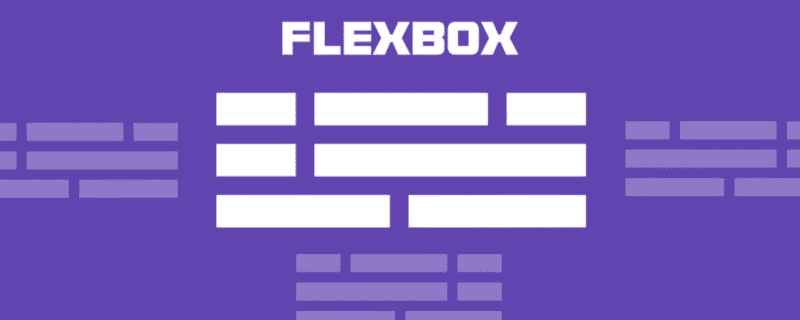
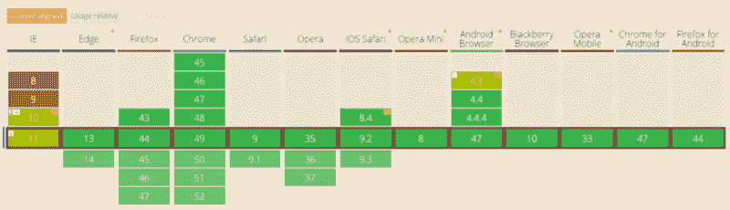
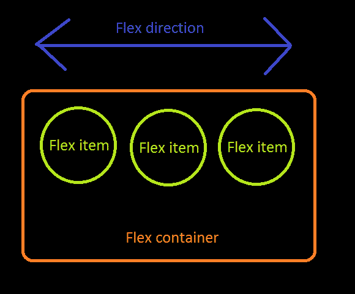

# 仅需 10 分钟即可了解基本的 Flexbox

> 原文：<https://www.freecodecamp.org/news/flexbox-in-10-minutes-7295497804ed/>

贾斯汀·叶克

# 仅需 10 分钟即可了解基本的 Flexbox



### 什么是 Flexbox？

[Flexbox](https://developer.mozilla.org/en-US/docs/Web/CSS/CSS3) ，是“柔性框”的缩写，是 [CSS3](https://developer.mozilla.org/en-US/docs/Web/CSS/CSS3) 中引入的一种布局模式，它决定了元素在页面上的排列方式，以便它们在不同的屏幕尺寸和设备下表现出可预测的行为。

它被称为 Flexbox，因为它能够扩展和收缩 flex box 内部的元素，以最佳地填充可用空间。与旧的布局方法(如显示表格和浮动内嵌块)相比，Flexbox 是一种更强大的方法，可以:

*   向不同方向布局元素
*   重新排列元素的显示顺序
*   更改元素的对齐方式
*   动态地将元素放入容器

### 何时不使用 Flexbox？

虽然 Flexbox 非常适合缩放、对齐和重新排序元素，但请尽量避免将其用于:

*   [整体页面布局](https://jakearchibald.com/2014/dont-use-flexbox-for-page-layout/)
*   完全支持旧浏览器的网站



Browser support of Flexbox from [Can I Use…](http://caniuse.com/#search=flex)

老一点的浏览器，像 IE 11 或者更低版本，不支持或者只部分支持 Flexbox。如果你想稳扎稳打，你应该退回到其他 CSS 布局方法，如`display: inline-block`与`float`和`display: table`。
不过，如果你只针对现代浏览器，Flexbox 绝对值得一看。

### 术语



在 Flexbox 模型中，有三个核心概念:

*   弹性项目，需要布局的元素
*   包含 flex 项目的 flex 容器
*   流向，决定伸缩项的布局方向

人类从经验和例子中学习最好，所以让我们开始吧！

### 1 级—基本

1)创建 flex 容器

```
<div class="flex-container">    <div class="flex-item"></div>  <div class="flex-item"></div></div>
```

```
.flex-container {  display: flex;}
```

要创建一个 flex 容器，你只需要给一个元素添加`display: flex`属性。默认情况下，所有直接子项都被视为弹性项，从左到右水平排列在一行中。如果 flex 项目的总宽度大于容器，项目将缩小，以便适合容器。

2)将弹性项目放在一列中

```
.flex-container {  display: flex;  flex-direction: column;}
```

通过设置`flex-direction: column`可以垂直布局柔性项目。也可以通过设置`flex-direction: column-reverse`或`flex-direction: row-reverse`以相反的顺序排列它们。

```
.flex-container {  display: flex;  flex-direction: column-reverse;}
```

### 第 2 级—初学者

1)向右对齐弹性项目

```
.flex-container {  display: flex;  justify-content: flex-end;}
```

回想一下，每个 Flexbox 型号都有 flex 方向。`justify-content`用于指定伸缩项沿伸缩方向放置的位置。在上面的例子中，`justify-content: flex-end`意味着项目在水平方向上与 flex 容器的末端对齐。这就是它们被放在右边的原因。

2)居中对齐弹性项目

```
.flex-container {  display: flex;  justify-content: center;}
```

3)展开弹性项目

通过使用`justify-content`属性的三个可能的间距值之一，您可以指定容器中的项目之间应该出现多少间距:

*   `space-evenly`:容器起始边缘与第一个项目之间的间距等于每个项目与其相邻项目之间的间距。
*   `space-between`:任意两个相邻项之间的间距相同，但不一定等于第一个/最后一个项与其最近边之间的间距；起始边和第一个项目之间的间距等于结束边和最后一个项目之间的间距。
*   `space-around`:物品每边的空间对于容器中的每个物品都是一样的。请注意，这意味着两个相邻项目之间的间距将是第一个/最后一个项目与其最近边缘之间的间距的两倍。

4)沿第二方向对齐柔性项目

```
.flex-container {  display: flex;  justify-content: center;  align-items: center;}
```

通常，我们希望沿着弯曲方向排列项目，同时也在垂直于弯曲方向的方向上对齐项目。通过设置`justify-content: center`和`align-items: center`，可以将 flex 项目水平和垂直放置在 flex 容器的中心。

5)对齐特定的弹性项目

```
.flex-container {  display: flex;  align-items: center;}
```

```
.flex-bottom {  align-self: flex-end;}
```

通过使用该项目的`align-self` CSS 属性，可以将特定的 flex 项与容器中的其他项不同地对齐。

### 3 级—中级

1)允许弹性项目换行到其他行/列

```
.flex-container {  display: flex;  flex-wrap: wrap;}
```

默认情况下，flex 项目不允许换行，如果 flex 容器不够大，无法容纳所有项目，则会调整它们的大小以适合单行或单列。通过添加`flex-wrap: wrap`，将溢出容器的 flex 项目将被包装到另一行。

2)反向包装

```
.flex-container {  display: flex;  flex-wrap: wrap-reverse;}
```

Flex 项目仍然分布在多行`flex-wrap: wrap-reverse`中，但是它们从 flex 容器的末尾开始。

3)对齐元素行的位置

```
.flex-container {  display: flex;  flex-wrap: wrap;  align-content: flex-start;}
```

默认情况下，换行的 flex 项目行将被拉伸以占据所有剩余空间，相邻行之间的间距相等。您可以在 flex 容器上设置`align-content`来决定换行时行的位置。可能的值有`flex-start`、`flex-end`、`center`、`space-between`、`space-around`和`stretch`(默认)。

### 第 4 级—高级

1)扩展元素

```
.flex-container {  display: flex;}
```

```
.flex-item.nth-of-type(1){  flex-grow: 1;}
```

```
.flex-item.nth-of-type(2) {  flex-grow: 2;}
```

`flex-grow`仅在 flex 容器中有剩余空间时生效。flex 项目的`flex-grow`属性指定一个项目相对于其他项目的扩展量，以填充 flex 框。默认值为 1。当设置为 0 时，项目根本不会增长到填满剩余空间。在本例中，两个项目的比例是 1:2，这意味着第一个项目将占用⅓，而第二个项目将占用⅔的剩余空间。

2)收缩元素

```
.flex-container {  display: flex;}
```

```
.flex-item:nth-of-type(1) {  flex-shrink: 1;}
```

```
.flex-item:nth-of-type(2) {  flex-shrink: 2;}
```

`flex-shrink`仅在 flex 项目因空间不足而溢出 flex 容器时生效。它指定一个项目相对于其他项目收缩多少，以使这些项目不会溢出伸缩框。默认值为 1。当设置为 0 时，伸缩项根本不会收缩。在本例中，比率为 1:2，这意味着第一个项目将收缩⅓，而第二个项目将收缩溢出空间的⅔。

3)设置元素的大小

```
.flex-container {  display: flex;}
```

```
.flex-item.nth-of-type(1) {  flex-basis: 200px;}
```

```
.flex-item.nth-of-type(2) {  flex-basis: 10%;}
```

您可以使用`flex-basis`定制元素的大小，而不是使用元素的初始大小。默认情况下，它的值是`flex-basis: auto`，这意味着从非 Flexbox CSS 规则计算的大小。您也可以将其设置为某个绝对值或代表 flex 容器百分比的值；比如`flex-basis: 200px`和`flex-basis: 10%`。

4)将灵活增长、灵活收缩和灵活基础放在一起

```
.flex-container {  display: flex;}
```

```
.flex-item:nth-of-type(1) {  flex: 1 0 100px;}
```

```
.flex-item:nth-of-type(2) {  flex: 2 0 10%;}
```

`flex`是`flex-grow`、`flex-shrink`和`flex-basis`的简称。在本例中，第一个伸缩项设置为`flex-grow=1` *、* `flex-shrink=0` *、* `flex-basis=100px`，第二个伸缩项设置为`flex-grow=2` *、* `flex-shrink=0` *、* `flex-basis=10%`。在这种情况下，由于 flex 容器中还有剩余空间，因此只有`flex-grow`生效，而`flew-shrink`被忽略。

### 结论

Flexbox 易于学习和操作。因为 web 开发周期很短，迭代很快，所以了解它的使用非常有帮助。如果你想在项目中使用 Flexbox 之前进行更多的试验，你可以访问[flexy box](http://the-echoplex.net/flexyboxes/)和 [Flexbox Froggy](http://flexboxfroggy.com/) 进行练习。你也可以阅读更多关于 [CSS 技巧:Flexbox 指南](https://css-tricks.com/snippets/css/a-guide-to-flexbox/)和 [W3C: CSS 灵活盒](https://drafts.csswg.org/css-flexbox/)的内容。

*这篇文章最初发表在 Altitude Labs 的[博客](http://altitudelabs.com/blog/)上，作者是我们的软件工程师 Felix Yau。 [Altitude Labs](http://altitudelabs.com) 是一家软件公司，专门开发个性化的、移动优先的 React 应用。*