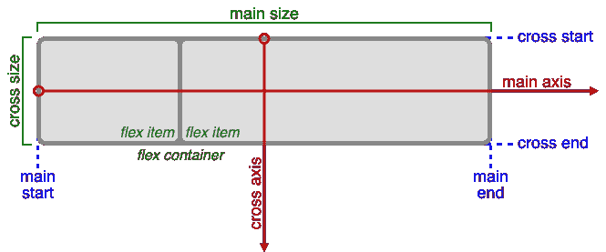
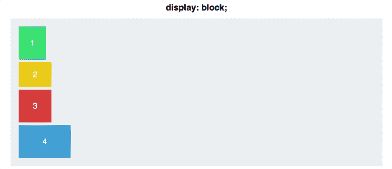
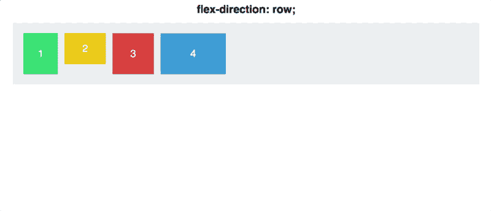
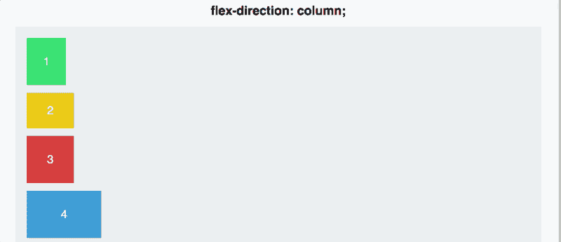
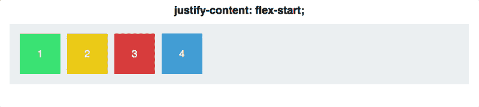
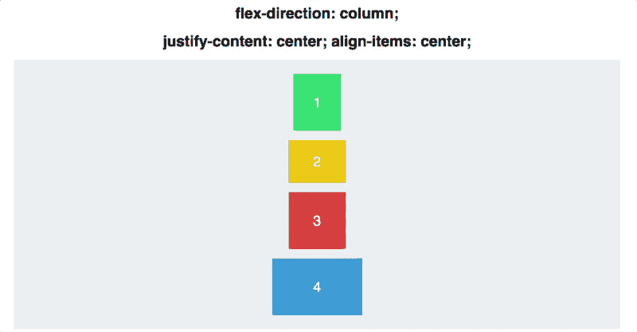
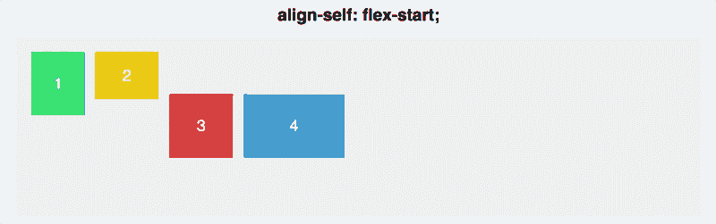

# Flexbox -终极 CSS Flex Cheatsheet(带动画图！)

> 原文：<https://www.freecodecamp.org/news/flexbox-the-ultimate-css-flex-cheatsheet/>

这份全面的 CSS flexbox 备忘单将涵盖在您的 web 项目中开始使用 flexbox 所需要知道的一切。

CSS flexbox 布局允许你轻松格式化 HTML。Flexbox 使使用行和列垂直和水平对齐项目变得简单。项目将“伸缩”到不同的大小，以填补空间。它使响应式设计更容易。

CSS flexbox 非常适合用于网站或应用程序的总体布局。它很容易学习，所有现代浏览器都支持，并且不需要很长时间就能搞清楚基础知识。本指南结束时，您将可以开始在您的 web 项目中使用 flexbox。

这篇文章包括来自 Scott Domes 的有用的[动画 gif，这将使 flexbox 更容易理解和可视化。](https://www.freecodecamp.org/news/an-animated-guide-to-flexbox-d280cf6afc35/)

## 所有 CSS Flexbox 属性

以下是所有可用于在 CSS 中定位元素的 CSS flexbox 属性的列表。接下来，您将看到它们是如何工作的。

### **可应用于容器的 CSS**

```
display: flexbox | inline-flex;
flex-direction: row | row-reverse | column | column-reverse;
flex-wrap: nowrap | wrap | wrap-reverse;
flex-flow: <‘flex-direction’> || <‘flex-wrap’>
justify-content: flex-start | flex-end | center | space-between | space-around;
align-items: flex-start | flex-end | center | baseline | stretch;
align-content: flex-start | flex-end | center | space-between | space-around | stretch;
```

### **可应用于容器中项目/元素的 CSS**

```
order: <integer>;
flex-grow: <number>; /* default 0 */
flex-shrink: <number>; /* default 1 */
flex-basis: <length> | auto; /* default auto */
flex: none | [ <'flex-grow'> <'flex-shrink'>? || <'flex-basis'> ]
align-self: auto | flex-start | flex-end | center | baseline | stretch;
```

## 术语



Flexbox terminology diagram from [official W3C specification](https://www.w3.org/TR/css-flexbox-1/).

在您学习 flexbox 属性做什么之前，理解相关的术语是很重要的。以下是 flexbox 关键术语的定义，摘自 flexbox 的官方 W3C 规范。

*   ****主轴**** :伸缩容器的主轴是伸缩项目布局的主轴。方向基于“伸缩方向”特性。
*   ****main-start | main-end****:**flex 项目从 main-start 侧开始向 main-end 侧放置在容器内。**
*   ******主尺寸**** :伸缩容器或伸缩项的宽度或高度，以主尺寸中的一个为该盒子的主尺寸。因此，它的主要大小属性是它的宽度或高度属性，以主维度中的一个为准。**
*   ******横轴**** :垂直于主轴的轴称为横轴。其方向取决于主轴方向。**
*   ******【cross-start | cross-end****:Flex 行从 Flex 容器的 cross-start 侧开始向 cross-end 侧填充项目并放入容器。**
*   ******交叉尺寸**** :伸缩项的宽度或高度，取交叉尺寸中的一个，即为该项的交叉尺寸。交叉尺寸属性是交叉尺寸中的“宽度”或“高度”中的任意一个。**

## **CSS 显示 Flex**

**is 告诉你的浏览器，“我想在这个容器上使用 flexbox。”**

**一个`div`元素默认为`display:block`。具有此显示设置的元素会占据其所在行的整个宽度。下面是一个父 div 中四种颜色 div 的示例，默认显示设置为:**

**

Source: Scott Domes** 

**要在页面的某个部分使用 flexbox，首先通过将`display: flex;`添加到父容器的 CSS 中，将父容器转换为 flex 容器。**

**这将把这个容器初始化为 flex 容器，并应用一些默认的 flex 属性。**

**

Source: Scott Domes** 

## **弯曲方向**

**`flex-direction`允许您控制容器中的项目如何显示。你想让他们从左到右，从右到左，从上到下，还是从下到上？您可以通过设置容器的`flex-direction`轻松完成所有这些操作。**

**应用`display: flex`后的默认排列是项目沿主轴从左到右排列。下面的动画展示了当`flex-direction: column`被添加到容器元素时会发生什么。**

**

Source: Scott Domes** 

**也可以将`flex-direction`设置为`row-reverse`和`column-reverse` **。****

**

Source: Scott Domes** 

## **对齐内容**

**`justify-content`是将容器中的项目沿主轴对齐的属性(参见上面的术语图)。这取决于内容的显示方式。它允许我们填充行上的任何空白空间，并定义我们想要如何“调整”它。**

**以下是我们用来调整内容的最常用选项:`flex-start | flex-end | center | space-between | space-around`。**

**以下是不同选项的样子:**

**

Source: Scott Domes** 

**`space-between`分配项目，使第一个项目与起点齐平，最后一个项目与终点齐平。`space-around`与此类似，但项目两端各有一半大小的空间。**

## **弹性对齐项目**

**`align-items`允许我们沿横轴对齐项目(见上面的术语图)。这允许使用对齐内容和对齐项目以多种不同的方式定位内容。**

**以下是用于对齐项目的最常用选项:`flex-start | flex-end | center | baseline | stretch`**

**为了让`stretch`按照您的预期工作，元素的高度必须设置为`auto`而不是特定的高度。**

**该动画展示了选项的外观:**

**

Source: Scott Domes** 

**现在我们将同时使用`justify-content`和`align-items`。这将显示主轴和横轴之间的差异。**

**

Source: Scott Domes** 

## **自我对齐**

**`align-self`允许您调整单个元素的对齐方式。**

**它拥有`align-items`所有相同的属性。**

**在下面的动画中，父 div 有 CSS `align-items: center`和`flex-direction: row`。前两个方块通过不同的`align-self`值循环。**

**

Source: Scott Domes** 

## **柔性包装**

**默认情况下，Flexbox 会尝试将所有元素放入一行。但是，您可以使用`flex-wrap`属性来更改这一点。有三个值可用于确定元素何时转到另一行。**

**默认值为`flex-wrap: nowrap`。这将导致所有内容从左到右都停留在一行中。**

**如果第一行没有足够的空间，将允许项目弹出到下一行。这些项目将从左到右显示。**

**`flex-wrap: wrap-reverse`也允许项目弹出到下一行，但这次项目是从右向左显示的。**

## **弹性流动**

**`flex-flow`将`flex-wrap`和`flex-direction`的使用组合成一个属性。使用时，先设置方向，然后换行。下面是一个例子:`flex-flow: column wrap;`**

## **对齐内容**

**`align-content`用于对齐多行项目。它用于在横轴上对齐，对单行内容没有影响。**

**以下是选项:`align-content: flex-start | flex-end | center | space-between | space-around | stretch;`**

## **使用 Flexbox 垂直居中**

**如果您想将父元素中的所有内容垂直居中，请使用`align-items`。下面是要使用的代码:**

```
`.parent {
    display: flex;
    align-items: center;
}`
```

## ****游戏和应用****

**如果你想练习使用 flexbox，试试这些游戏和应用程序，它们会帮助你掌握 flexbox。**

*   **[Flexbox 防御](http://www.flexboxdefense.com/)是一款网页游戏，你在学习 Flexbox 的同时试图阻止来袭的敌人越过你的防御。**
*   **[Flexbox Froggy](http://flexboxfroggy.com/) 是一款游戏，你通过编写 CSS 代码来帮助 Froggy 和朋友。**
*   **[Flexyboxes](http://the-echoplex.net/flexyboxes/) 是一个允许你查看代码样本和更改参数的应用程序，以直观地了解 Flexbox 的工作方式。**
*   **[Flexbox Patters](http://www.flexboxpatterns.com/) 是一个展示大量 Flexbox 示例的网站。**

## **结论**

**我们已经涵盖了所有最常见的 CSS flexbox 属性。接下来就是练习了！尝试用 flexbox 做几个项目，这样你就可以习惯它的工作方式。**