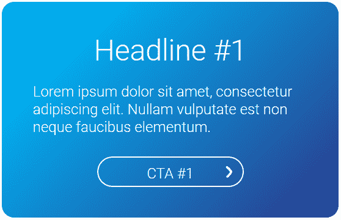
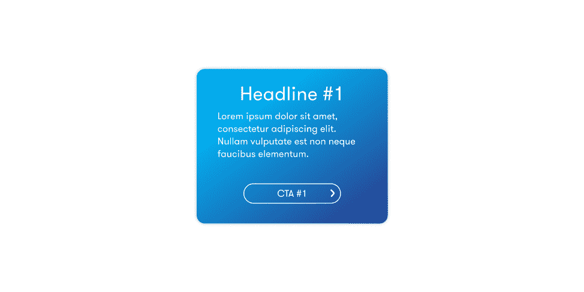
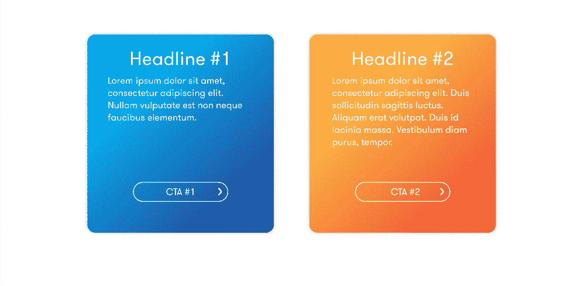
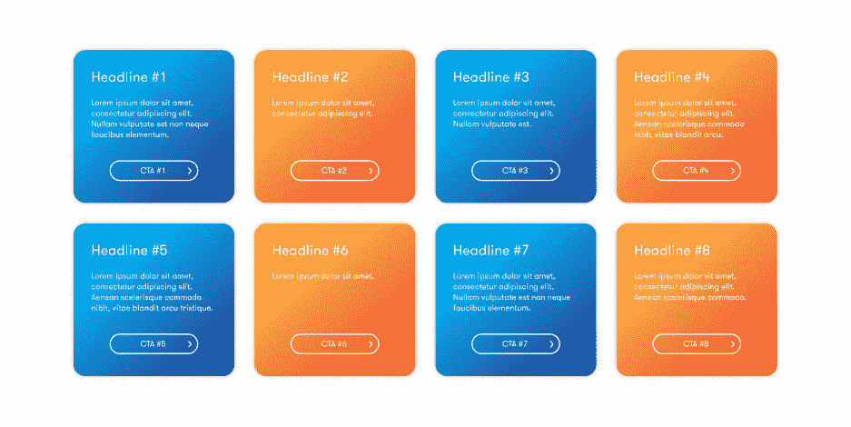
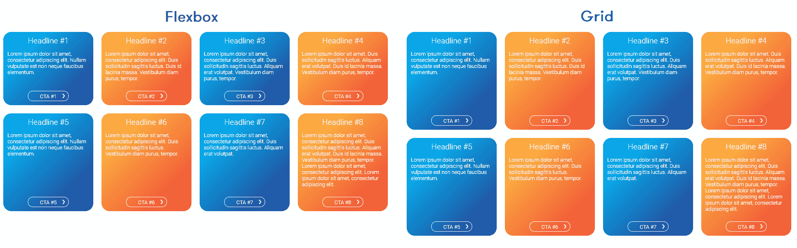
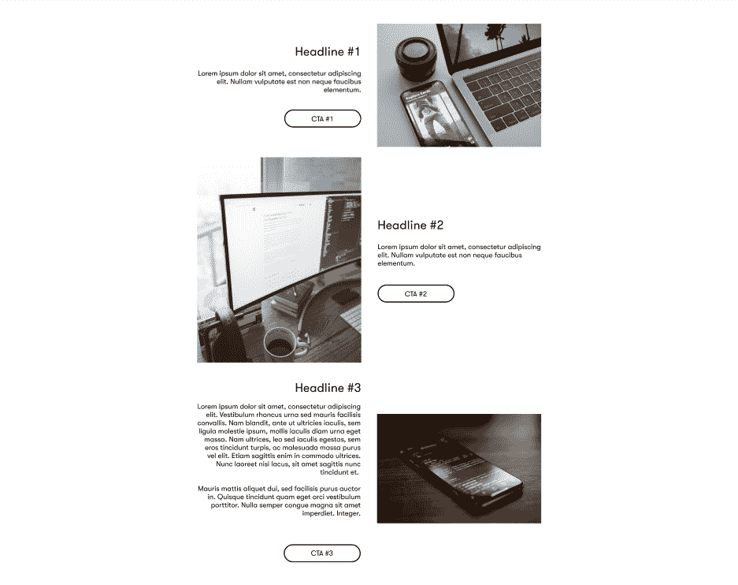
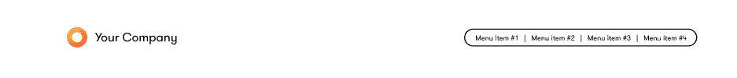
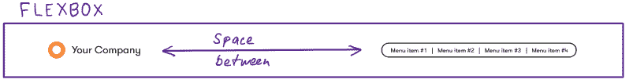
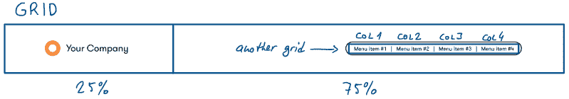

# flexbox vs . Grid——如何构建最常见的 HTML 布局

> 原文：<https://www.freecodecamp.org/news/flexbox-vs-grid-how-to-build-the-most-common-html-layouts/>

互联网上有很多很棒的 CSS 资源。但是如果你只是想要一个简单的布局，而且你现在就想要呢？

在本文中，我描述了 5 种最常见的网页布局，以及如何使用 Flexbox 和 Grid 来构建它们。

### 这将如何工作

在 CodePen 上，每个布局下面都有一个完整 HTML 和 CSS 代码的链接。

请注意，我使用 SASS 来编写样式定义，所以如果您想在本地上做同样的事情，请使用以下命令安装 SASS:

```
npm i sass -g 
```

## 基本卡片模板



我用上面的卡片作为网页布局的基础。它由垂直方向上的三个元素组成，所以普通的`div`块会工作得很好。然而，我稍后将需要使中间的元素-文本段落-伸展。

在这里，Flexbox 和 Grid 可以无缝地完成这项工作。我更喜欢 Flexbox，因为它对我来说更简单。

**获胜者:Flexbox**

[CodePen Flexbox](https://codepen.io/ondrabus/pen/rNeOEQJ) ， [CodePen Grid](https://codepen.io/ondrabus/pen/mdPeZvd)

现在让我们开始创建我们不同的布局。

## #1 垂直和水平居中的卡



对于 Flexbox，我们需要一个水平居中的元素，另一个(子元素)垂直居中。

项目的顺序由`flex-direction`定义。元素如何在可用空间中定位由元素上的`align-self`或其父元素上的`align-items`设置。

对于网格，我们需要三列三行。然后我们将卡片放在中间的单元格中。

水平居中很容易。我们使用`grid-template-columns: auto 33% auto`定义了三列及其大小，因为卡片应该与可视区域的 1/3 一样宽。

问题是，我们不知道垂直维度。我们希望顶行和底行占据剩余的空间，这对于 grid 是不可能的。卡片居中，但其高度取决于窗口的高度。

然而，我们可以用一个额外的包装元素来解决这个问题，并使用`margin`使其居中。

**获胜者:Flexbox**

[CodePen Flexbox](https://codepen.io/ondrabus/pen/vYGYobr) ， [CodePen Grid](https://codepen.io/ondrabus/pen/yLOYdLO)

## #2 两张垂直和水平居中的卡片



通常，我们需要将不止一个元素置于中心。如果其中一张包含较长的文本，这两张卡片也应该保持相同的高度。

使用 Flexbox，我们需要将两张卡包装在另一个元素中，并使用它一次性将两张卡居中。

我们不能在这里使用`align-items`,因为在这种情况下它适用于 Y 轴。我们需要用`justify-content: center`定义 X 轴上的剩余空间应该如何分配。这样可以确保两张卡片水平居中。

如果我们忽略网格的可变高度问题，即使没有任何额外的包裹元素，我们也可以获得相同的结果。这一次我们用`grid-template-columns: auto 33% 50px 33% auto`定义了包含五列的网格。其余部分与上一个示例相同。

**获胜者:Flexbox**

[CodePen Flexbox](https://codepen.io/ondrabus/pen/mdPybJa) ， [CodePen Grid](https://codepen.io/ondrabus/pen/RwaWXOp)

## #3 宽度和高度相同的多张卡



这是博客、电子商务网站或任何显示某种列表的网站的另一个典型用例。我们希望这些卡片有相同的宽度和高度。高度需要从列表中最大的元素来推断。

这可以在 Flexbox 中使用`flex-wrap: wrap`来完成。如果元素的宽度超过了每一行的剩余空间，它们将换行到下一行。但是，相同的高度只保留在单行的范围内，除非明确定义。



网格在这里显示了它的真正威力。这个布局可以使用`grid-auto-rows: 1fr`创建，它在所有行上强制相同的高度。

**获胜者:格子**

[CodePen Flexbox](https://codepen.io/ondrabus/pen/LYNpawv) ， [CodePen Grid](https://codepen.io/ondrabus/pen/QWNjPLg)

## #4 垂直和水平居中交替显示文本和图像



在本例中，我们有带 CTA 按钮的文本，另一侧有图像。这两个组件应该垂直居中，因为它们的大小可以变化。

这对于 Flexbox 来说是小菜一碟。每一行都是一个分成两个包装容器`.img`和`.content`的`article`元素。它们需要均匀的尺寸分布(`flex-basis: 50%`)。

内部内容的垂直居中由`align-items: center`定义。

交替是通过在每个奇数物件上通过`flex-direction: row-reverse`反转 Flexbox 的方向来实现的。

Grid 也很好地处理了这个用例。我们不需要定义一个巨大的网格，而是为每个`article`定义一个。

它使用`align-items: center`定义垂直居中的等宽列。

通过`grid-column`的切换值在单元级定义交替。

**获胜者:平局**

[CodePen Flexbox](https://codepen.io/ondrabus/pen/BaKoEyQ) ， [CodePen Grid](https://codepen.io/ondrabus/pen/WNwrOOv)

## #5 带菜单的水平标题



为了使用 Flexbox 实现这种设计，需要用一个元素来表示头部的两侧。



徽标和公司名称在左边形成一个`anchor`，菜单在右边是一个单独的`nav`元素。Flexbox 用`justify-content: space-between`将它们定位。



对于 Grid，我们需要两列——一列用于标识，另一列用于菜单。菜单是另一个网格，它使用`grid-template-columns: repeat(4, minmax(0, 1fr))`平均分配列的大小。

这里的问题是，如果我们想向菜单添加另一个项目，我们还需要调整 CSS。

**获胜者:Flexbox**

[CodePen Flexbox](https://codepen.io/ondrabus/pen/wvGMqXq) ， [CodePen Grid](https://codepen.io/ondrabus/pen/oNxbeKx)

## 获胜者是...

最终的比分是 5:2 赞成 Flexbox，但这并不意味着它成为最终的 CSS 赢家。有些情况下，你需要使用其中的一个，有时甚至两个一起使用，来达到你的目的。

如果您需要灵活和有条件的定位，请使用 Flexbox。如果您想要创建需要相同大小的元素或具有表格形式的列表或类似结构，请使用 Grid。

作为一名前端开发人员，如果不了解这两者，您将无法脱身。

[参考导轨柔性盒](https://css-tricks.com/snippets/css/a-guide-to-flexbox/)，[参考导轨网格](https://css-tricks.com/snippets/css/complete-guide-grid/)

附言:如果我错过了你日常使用的布局，请在 [Twitter](https://twitter.com/ondrabus) 上告诉我，我会准备一个续集:-)