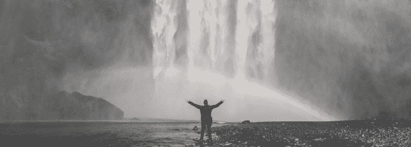
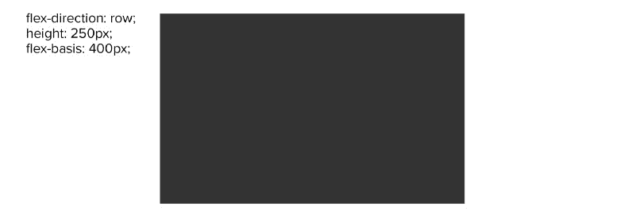
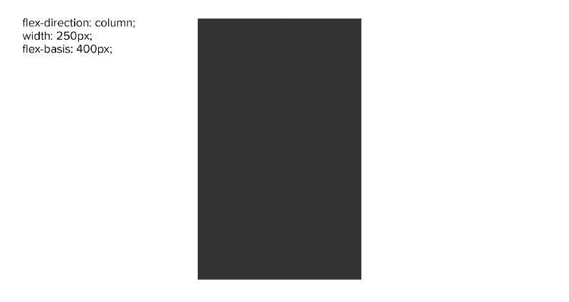

# Flexbox 中宽度和弹性基础的区别

> 原文：<https://www.freecodecamp.org/news/flexboxs-flex-basis-explained-83d1a01413b7/>

凯尔·加拉格尔

# Flexbox 中宽度和弹性基础的区别

#### 理解奇怪的部分



当我第一次开始学习 Flexbox 时，最让我好奇的是“他们为什么要加入这个 flex-basis？”我的意思是，我有宽度…为什么还有弹性底座？

#### “动态约束”

我读了很多关于这个话题的文章。所有这些都声称宽度和柔性基底之间存在一些差异。然而，没有一个能完全解释这种差异应该是什么。

经过大量的实验和一些不错的 o'l 时尚摆弄，我得出结论，flex-basis 的主要目的是提供一个“动态”约束。我这么说到底是什么意思呢？“动态”约束。


我假设你已经熟悉或者至少大体熟悉 CSS 和 Flexbox。

我不会深入讨论任何关于 CSS 或 Flexbox 的细节，这些细节会教给你它们中任何一个的核心概念。

#### 需要知道的

我也将利用 SCSS，而不是原生 CSS，和“块-元素-修饰符(BEM)”的方法。这样做的原因是，我认为这样更容易做到简明扼要。所以你需要了解 SCSS 和嵌套的基础，边界元法应该在例子中自我描述。


本文的目标是简化互联网上似乎存在的与 flex-basis 相关的谜团。我经常看到这样的回答“你用 flex-basis 而不是 width”来回答这个问题。当然，这对于大多数情况来说是完全可以接受的，尽管有可能以更高级的方式使用它。看起来 flex-basis 的潜力已经躲避了许多人一段时间了(当然不是所有人),但是我敢说有许多人。

我想在这篇文章中说服你，Flexbox 的 flex-basis **不能代替宽度(或高度)**。这是一个全新的工具，完全有自己的一套可能性。


### 肉和土豆

所以现在我已经说了这些事情…接下来的部分是解释和展示我在这里到底在说什么。如你所知，当使用 flex-box 时，你可以使用 flex-basis 来代替 width。

#### 视觉示例

在上面的例子中，我们有一个“内部”元素，它将存在于外部“元素”中。外部元素是我们的 Flexbox，内部元素具有 400px 的 flex 基础。

上述内容的 HTML 可能如下所示:

在屏幕中央产生一个 400 像素宽、250 像素高的灰色方框，如下所示:



在上面的例子中，我们的包装器*。元素*，自动默认为一个伸缩方向，即**行(从左到右)**而不是列(从上到下)。记住这一点。很快我们将把它改为专栏，你将会看到整篇文章的内容。Flexbox flex-basis 的动态特性。

#### 让我们变得“动态”

因此，让我们更改代码以显示“动态性质”。要做到这一点，我们需要做的就是将外部元素更改为具有一个( *flex-direction: column* )并将内部元素上的*高度*更改为*宽度*(html 不变)。

改变伸缩方向会改变伸缩基准的作用方向。因此，flex-basis 实际上既是宽度也是高度。在上面的例子中，flex-basis 现在将导致块高 400px，而不是我们之前看到的 400px 宽的矩形。



*如果你想自己玩这个代码，这里有一个[码笔](https://codepen.io/litonfiredesign/pen/wOeBjp)，里面有上面的代码。*

#### 观察

请注意，在第一个示例中，flex-basis 如何接管宽度的角色，在第二个示例中，如何接管高度的角色。Flex-basis 是 Flexbox 中的宽度和高度，具体取决于伸缩方向。相当酷！

### **更深入的理解/最佳实践**

以下是我在使用 Flexbox 的 flex-basis 期间了解到的一些关于 flex-basis 的最重要的事情。

*   基于伸缩方向控制“宽度”或“高度”
*   如果明确声明了除 Flex-basis: **auto** 之外的任何内容，flex-basis 将覆盖任何其他*宽度:*或*高度:*属性(默认为 auto)
*   flex basis 的简写是(flex: $grow，$shrink，$size)，默认设置为(flex: 0 1 **auto** )。
*   当 flex basis 设置为 **auto** 时，它首先检查宽度或高度属性(基于方向)**如果没有**，它**使用元素内容尺寸**
*   Flex-basis 仍将遵循任何*最小* / *最大*宽度或高度设置。同样，它是基于*伸缩方向:*
*   列中的 Flex-basis 会覆盖 *height:* ，这很重要，因为虽然 *width:* 会服从 flex-shrink，但是 *height:* 不会。*(这可能会在您的设计中导致混乱和意想不到的结果。)*

#### 需要注意的重要事项

注意**自动**是如何加粗的。默认情况下，如果设置了宽度，但没有声明弹性基准值，宽度将在该元素上正常工作。*、*和*、*对元素的作用方式没有区别。使用 Flexbox 时，宽度甚至会服从伸缩。

宽度和柔性基底之间的差异因素是柔性基底基于柔性方向改变其有效方向的动态能力。

#### 警告

另一方面，身高的表现有点不同。height 属性不像 width 那样服从 flex-shrink。使用 flex-direction *列*时，您应该始终使用 flex-basis 来动态控制 Flexbox 的大小，以便获得一致的预期结果。

**还要特别注意要点*编号 4* :**

*   当 flex basis 设置为 **auto** 时，它首先检查宽度或高度属性(基于方向)**如果没有**，它**使用元素内容尺寸**

这意味着当设置为 *flex-basis: auto 时，flex basis 将根据内容大小(内部元素的大小)自动调整元素的大小。*仅当元素上没有设置*宽度:*或*高度:*时。

#### 最佳实践

我建议，如果可以的话，最好在宽度或高度上使用 flex-basis，这样你的结果总是一致的。考虑到*宽度:*将服从 flex-shrink，而*高度:*不服从 flex-shrink，请理解当您结合使用 Flexbox 的其他属性(例如 flex-wrap)时，宽度和高度在 Flexbox 中的作用会有显著的差异。为了方便、一致和可读性，也使用 flex 的简写。

flex-basis 的简写是(flex: $grow，$shrink，$size)，默认设置为(flex: 0 1 **auto** )。

```
flex: 0 1 200px;
```

在某些情况下，您可能需要在 flex-basis 上使用宽度或高度。一些案例可能包含 Flexbox bug 解决方法。关于这个主题的一个很好的资源是 Flexbugs。Flexbugs 也是根据您打算支持的浏览器来确定其他最佳实践的好地方。

### **附加资源**

在下面的 [*codepen*](https://codepen.io/litonfiredesign/pen/OaZLWd) 示例中，我展示了 flex-wrap 来演示来自本文的上述信息的可视化示例。

使用此[代码笔](https://codepen.io/litonfiredesign/pen/OaZLWd)彻底检查代码。您将看到我如何在整个代码库中只使用一次 flex-basis 来控制多个场景。这只是可能用例的一个小例子。

### **结论**

知道 flex-basis 既是宽度约束又是高度约束是一个很好的工具。它是动态可变的。使用 flex-basis，您可以创建一些非常直观的设计元素。有些甚至可以在 Flexbox 的弯曲方向改变时，在你设计中的一个关键断点进行切换，希望给你一个更干净的解决方案。这些知识也将帮助您更好、更自信地使用 Flexbox 进行设计，因为该功能是充分发挥 Flexbox 潜力的关键。

如果你认为我遗漏了什么，发现了一个错别字，等等…请告诉我！

我希望这篇短小精悍的文章对某些人有用。如果你欣赏投入的努力，请给这篇文章一个掌声！？

### **取得联系？**

如果你想谈生意，那么和我联系的最好方式是在 linkedin 上或者通过我在 T2 的网站联系我。

我会尽我所能在 Medium 上回应任何评论或问题。

如果你从事社交活动:Instagram 或者 T2 和脸书。

**照片鸣谢:**(瀑布|贾里德·埃隆杜) (喋喋不休|丹·韦曼) (免责声明|波普&斑马) (客观|奥拉夫·阿伦斯·罗特内)和(走吧| Goh Rhy Yan)。所有照片来自 Unsplash.com