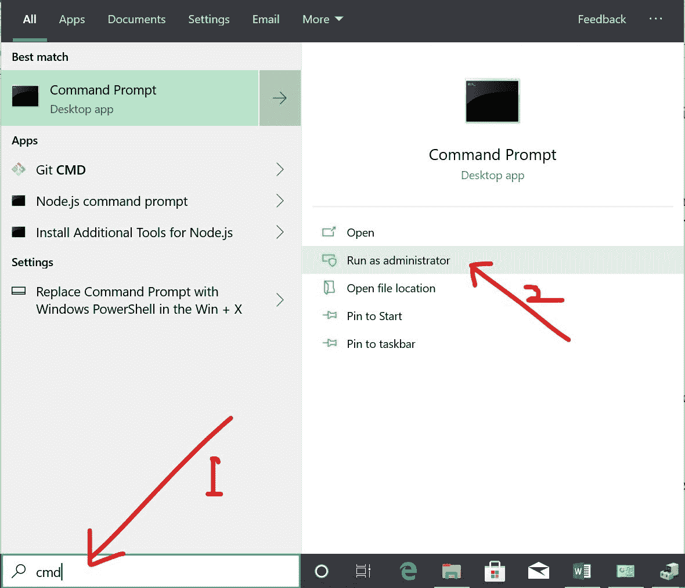
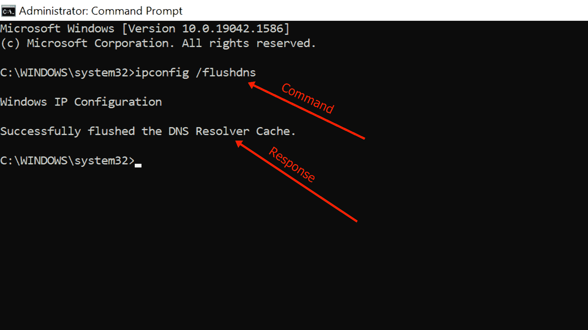
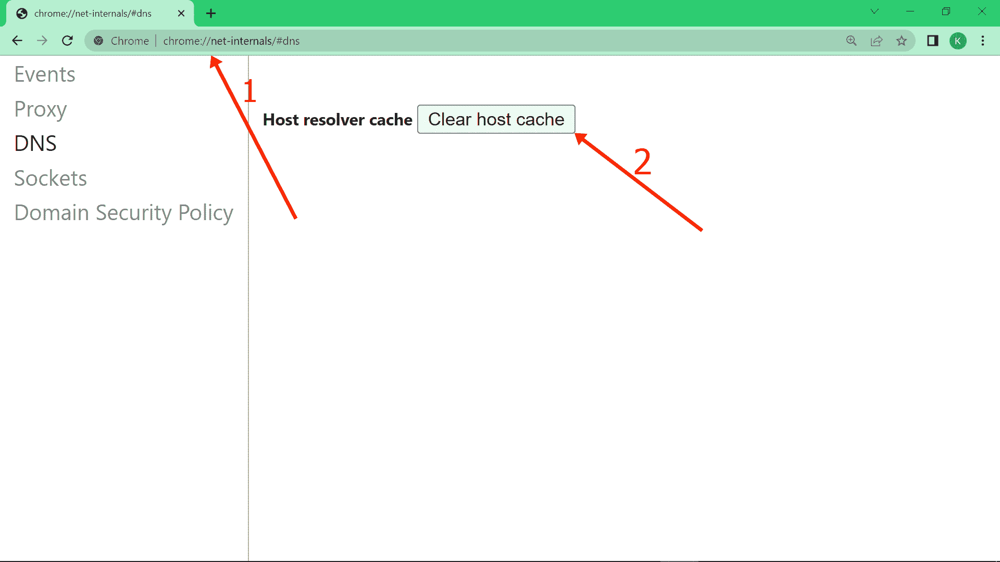

# Flush dns–如何使用 Windows ipconfig /flushdns 命令刷新 DNS

> 原文：<https://www.freecodecamp.org/news/flushdns-how-to-flush-dns-with-the-windows-ipconfig-flushdns-command/>

你可能已经注意到，在第一次访问一个网站之后，下次你访问的时候，这个网站的加载速度要快得多。

这是因为你的操作系统，或者谷歌 Chrome 的浏览器，会缓存你访问的任何网站的 IP 地址和 DNS(域名系统)信息。DNS 缓存包含:

*   网站地址或主机名，技术上称为资源数据(rdata)
*   网站的域名
*   记录类型(IPv4 或 IPv6)
*   缓存或 TTL(生存时间)的有效性

当 TTL 过期时，缓存将被清除，DNS 将自动为您刷新。但是，有时您不想等待数小时或数天的 TTL 过期，并希望手动刷新您的 DNS。

在这篇文章中，我将回顾为什么你应该刷新你的域名，以及如何在 Windows 10 和 Chrome 中做到这一点。

## 那么，你为什么要刷新(或清除)你的域名呢？

刷新 DNS 有几个好处，例如:

*   对数据收集者隐藏你的搜索行为，他们可能会根据你的搜索历史向你展示广告
*   请求加载网站或 web 应用程序的更新版本。如果网站或 web 应用程序迁移到新域，这可以帮助解决 404 问题
*   防止 DNS 缓存中毒–这是一种安全情况，黑帽黑客恶意获取对您的 DNS 缓存的访问权限并对其进行修改，从而将您重定向到可能会从您那里收集敏感信息的网站

## 如何刷新 Windows 上的 DNS

要刷新 Windows 10 上的 DNS 记录，请按照以下步骤操作:

**第一步**:点击开始或者点击键盘上的 Windows `[logo]`键

**第二步**:输入“cmd”，然后在右边选择“以管理员身份运行”

**第三步**:输入“ipconfig /flushdns”，点击`ENTER`

您应该会得到一个响应，表明 DNS 缓存已被刷新，如下所示:

这意味着您的缓存已被完全清除，您访问的任何网站的新版本都将被加载。

## 如何清除谷歌 Chrome 上的 DNS 缓存

尽管 Chrome 不是一个操作系统，但它有自己的 DNS 缓存来帮助个性化你的浏览体验。

要刷新 Chrome 的 DNS，你只需要在地址栏输入`chrome://net-internals/#dns`，然后点击`ENTER`。

然后单击“清除主机缓存”:

## 结论

正如您在本文中了解到的，刷新 DNS 有很多好处，可以让您的互联网体验更加安全。

即使缓存在 TTL 过期后被清除，您也应该尽可能频繁地刷新您的 DNS，以便获得这些优势。

感谢您的阅读！