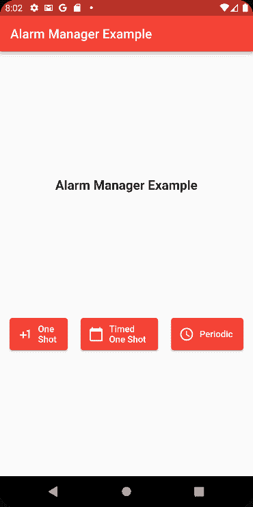

# 如何使用 Alarm Manager Plus 软件包在 Flutter 中设置警报

> 原文：<https://www.freecodecamp.org/news/flutter-alarmmanager-tutorial/>

如果您是 Android 开发人员，当您希望安排应用程序在未来的特定时间运行时，您可以使用 AlarmManager。

但是如果你是一个 iOS 开发者，这种类型的组件在那里是不存在的。

所以如果你是一个 Flutter 开发者，你会怎么做？

像大多数与 Flutter 相关的事情一样，当您想要使用特定于平台的组件时，您需要公开它的功能。

AlarmManager 也不例外。

在本文中，我们将详细介绍 [Android AlarmManager Plus](https://pub.dev/packages/android_alarm_manager_plus) 包，并展示如何在您的应用程序中使用它。

准备好设置你的闹钟了吗？

## 项目设置

首先，打开您的 pubspec.yaml 文件并添加以下内容:

```
dependencies:
  android_alarm_manager_plus: ^2.0.6
```

> ✋免责声明→我写这篇文章的时候，最新版本是 2.0.6

然后运行 **`pub get`** 下载依赖项。

我们将使用你在 Android Studio 中创建一个 Flutter 项目时得到的 vanilla 项目(减去所有的计数器逻辑)。

打开 AndroidManifest.xml 文件并添加以下权限:

```
<uses-permission android:name="android.permission.RECEIVE_BOOT_COMPLETED"/>
<uses-permission android:name="android.permission.WAKE_LOCK"/>

<!-- For apps with targetSDK=31 (Android 12) -->
<uses-permission android:name="android.permission.SCHEDULE_EXACT_ALARM"/>
```

在您的应用程序标记中，也添加这些内容:

```
<service
    android:name="dev.fluttercommunity.plus.androidalarmmanager.AlarmService"
    android:permission="android.permission.BIND_JOB_SERVICE"
    android:exported="false"/>
<receiver
    android:name="dev.fluttercommunity.plus.androidalarmmanager.AlarmBroadcastReceiver"
    android:exported="false"/>
<receiver
    android:name="dev.fluttercommunity.plus.androidalarmmanager.RebootBroadcastReceiver"
    android:enabled="false"
    android:exported="false">
    <intent-filter>
        <action android:name="android.intent.action.BOOT_COMPLETED" />
    </intent-filter>
</receiver>
```

最后，您的 AndroidManifest 文件应该如下所示:

```
<manifest xmlns:android="http://schemas.android.com/apk/res/android"
    package="com.tomerpacific.alarm_manager_example">

    <uses-permission android:name="android.permission.RECEIVE_BOOT_COMPLETED"/>
    <uses-permission android:name="android.permission.WAKE_LOCK"/>
    <!-- For apps with targetSDK=31 (Android 12) -->
    <uses-permission android:name="android.permission.SCHEDULE_EXACT_ALARM"/>

   <application
        android:label="alarm_manager_example"
        android:name="${applicationName}"
        android:icon="@mipmap/ic_launcher">
        <activity
            android:name=".MainActivity"
            android:exported="true"
            android:launchMode="singleTop"
            android:theme="@style/LaunchTheme"
            android:configChanges="orientation|keyboardHidden|keyboard|screenSize|smallestScreenSize|locale|layoutDirection|fontScale|screenLayout|density|uiMode"
            android:hardwareAccelerated="true"
            android:windowSoftInputMode="adjustResize">
            <!-- Specifies an Android theme to apply to this Activity as soon as
                 the Android process has started. This theme is visible to the user
                 while the Flutter UI initializes. After that, this theme continues
                 to determine the Window background behind the Flutter UI. -->
            <meta-data
              android:name="io.flutter.embedding.android.NormalTheme"
              android:resource="@style/NormalTheme"
              />
            <intent-filter>
                <action android:name="android.intent.action.MAIN"/>
                <category android:name="android.intent.category.LAUNCHER"/>
            </intent-filter>
        </activity>
        <!-- Don't delete the meta-data below.
             This is used by the Flutter tool to generate GeneratedPluginRegistrant.java -->
        <meta-data
            android:name="flutterEmbedding"
            android:value="2" />
       <service
           android:name="dev.fluttercommunity.plus.androidalarmmanager.AlarmService"
           android:permission="android.permission.BIND_JOB_SERVICE"
           android:exported="false"/>
       <receiver
           android:name="dev.fluttercommunity.plus.androidalarmmanager.AlarmBroadcastReceiver"
           android:exported="false"/>
       <receiver
           android:name="dev.fluttercommunity.plus.androidalarmmanager.RebootBroadcastReceiver"
           android:enabled="false"
           android:exported="false">
           <intent-filter>
               <action android:name="android.intent.action.BOOT_COMPLETED" />
           </intent-filter>
       </receiver>
    </application>
</manifest>
```

## 警钟正在敲响

该包公开了一个 **AndroidAlarmManager** 对象，该对象具有以下(相关)方法:

*   **one shot—**触发一次性闹钟
*   **one shot at–**在特定日期触发一次性闹钟
*   **周期性–**在定义的时间间隔内触发警报

让我们详细讨论每个选项。

### `oneShot`方法的工作原理

**oneShot** 方法接受以下参数:

```
 static Future<bool> oneShot(
    Duration delay,
    int id,
    Function callback, {
    bool alarmClock = false,
    bool allowWhileIdle = false,
    bool exact = false,
    bool wakeup = false,
    bool rescheduleOnReboot = false,
  })
```

前三个参数(delay、id 和 callback)是不言自明的，所以我们将关注其余的。

*   **alarm clock–**一个标志，指示是否将使用 Android 的 alarm manager compact . setalarm clock 设置计时器
*   **allowWhileIdle–**一个标志，指示是否将使用 alarmmanagercompat . setexactandallowwhileidle 或 alarmmanagercompat . setandallowwhileidle 来设置计时器
*   **exact–**一个标志，指示是否将使用 AlarmManagerCompat.setExact 设置计时器
*   **wake up–**一个标志，表示当警报被触发时，设备是否会被唤醒
*   **重新调度重启–**一个标志，表示设备重启后警报是否会持续

**oneShotAt** 方法与 oneShot 方法非常相似，只有一个关键区别。第一个参数不是持续时间类型的延迟，而是设置何时触发警报的 DateTime 对象。

```
static Future<bool> oneShotAt(
    DateTime time,
    int id,
    Function callback, {
    bool alarmClock = false,
    bool allowWhileIdle = false,
    bool exact = false,
    bool wakeup = false,
    bool rescheduleOnReboot = false,
  })
```

**周期**方法接受以下参数:

```
static Future<bool> periodic(
    Duration duration,
    int id,
    Function callback, {
    DateTime? startAt,
    bool allowWhileIdle = false,
    bool exact = false,
    bool wakeup = false,
    bool rescheduleOnReboot = false,
  })
```

正如你所看到的，这个方法的参数也是相似的。这里最重要的论点是:

*   **startAt–**指示何时应该第一次触发警报
*   **持续时间—**负责在每个持续时间间隔重新触发报警。

## 记得设置你的闹钟

关于 Alarm Manager Plus 软件包需要注意的一点是，它使用**隔离**来运行警报。隔离类似于线程，只是它们不共享内存。因此，他们用信息交流。

因此，您必须将报警处理程序(回调)声明为静态的，以便可以访问它们。

你可以在这里阅读更多关于隔离的信息。

## 包扎

如果你想看看我们在本文中讨论的所有东西的例子，请点击这里的。

