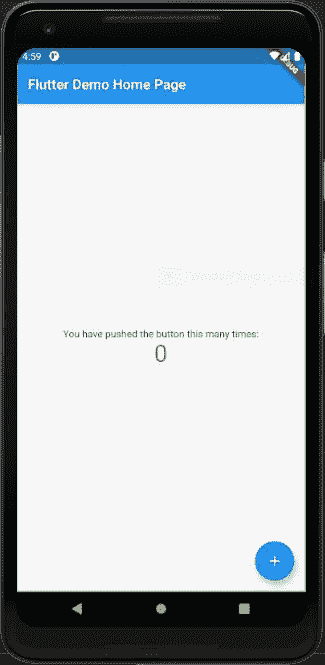
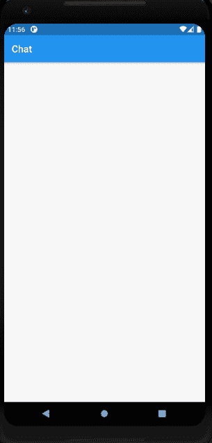
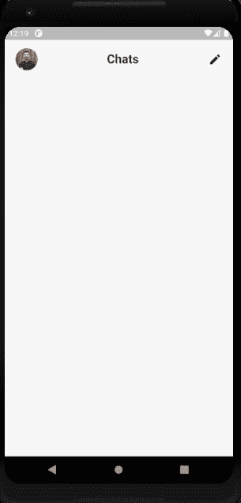
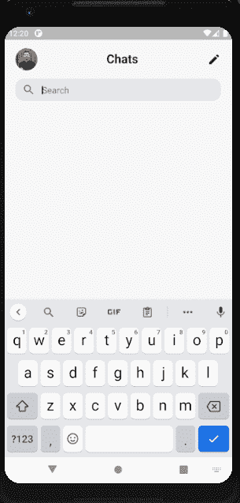
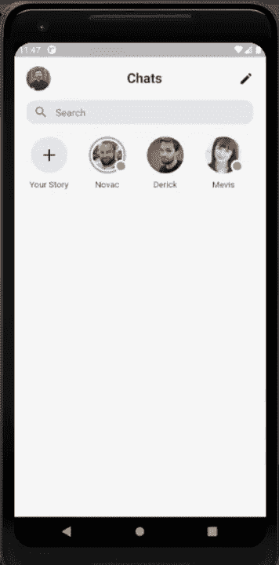
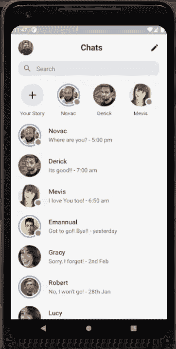

# Flutter UI 教程——如何使用 Flutter SDK 构建一个有故事的聊天应用

> 原文：<https://www.freecodecamp.org/news/flutter-messenger-clone/>

聊天应用已经成为互联网上最简单的交流方式之一。因此，许多应用程序将聊天功能融入其中，以便用户可以进行互动和参与社交交流。

这些应用以其强大的端到端音频/视频和基于文本的通信使世界变得更小。最重要的是，其他功能，如分享故事、发送附件等，使这些应用程序更加引人入胜和有用。

大多数应用程序也有故事功能。它让用户简单地分享他们的经历，故事在一段时间后就消失了。这些功能让用户迷上了这款应用，并让他们想要分享自己的想法、创意、记忆和经历。

Facebook Messenger 是使用最广泛的聊天应用程序之一。它在全球的整体使用量仅次于 WhatsApp。

在本教程中，我们将使用 Flutter 移动应用程序开发框架来复制 Messenger UI。我们还将探索使用 Flutter 编码的基于小部件的 UI 开发。这将让我们熟悉 Flutter 生态系统以及编写 Flutter 代码的最佳实践。

这里，我们将实现 messenger 应用程序的主对话主屏幕，它将包含一个顶部应用程序栏、一个搜索栏、一个故事部分和一个对话列表部分。

通过这个过程，我们将看到 Flutter 如何使 UI 开发变得更容易，并且我们将从中获得一个 messenger 克隆聊天应用程序。

所以，让我们开始吧！

## 创建一个新的颤振项目

首先，我们需要创建一个新的 Flutter 项目。为此，请确保正确安装了 Flutter SDK 和其他与 Flutter 应用程序开发相关的需求。

如果一切都设置妥当，那么要创建一个项目，我们只需在所需的本地目录中运行以下命令:

```
flutter create messengerUI 
```

建立项目后，我们可以在项目目录中导航，并在终端中执行以下命令，以便在可用的仿真器或实际设备中运行项目:

```
flutter run 
```

成功构建后，我们将在模拟器屏幕中获得以下结果:



现在，我们需要用我们自己的项目结构模板替换默认模板。

首先，我们需要创建一个名为**的文件夹。/屏幕**在**里面。/lib** 文件夹。然后在。/lib/screens 文件夹，我们需要创建一个名为 **conversations.dart** 的新文件。

在 **conversation.dart** 中，我们将实现一个简单的有状态小部件类，返回一个带有基本应用程序栏和空`Container`主体的`Scaffold`小部件。下面的代码片段显示了 **conversations.dart** 的代码:

```
import 'package:flutter/material.dart';

class Conversations extends StatefulWidget {
  @override
  _ConversationsState createState() => _ConversationsState();
}

class _ConversationsState extends State<Conversations> {
  @override
  Widget build(BuildContext context) {
    return Scaffold(
      appBar: AppBar(
        title: Text("Chat"),
      ),
      body: Container(),
    );
  }
} 
```

现在，我们需要替换 **main.dar** t 文件中的默认模板，并调用`MaterialApp`小部件的`home`选项中的`Conversations`屏幕，如下面的代码片段所示:

```
import 'package:flutter/material.dart';
import 'package:messangerUI/screens/conversations.dart';

void main() {
  runApp(MyApp());
}

class MyApp extends StatelessWidget {
  @override
  Widget build(BuildContext context) {
    return MaterialApp(
      title: 'Messenger Demo',
      debugShowCheckedModeBanner: false,
      theme: ThemeData(
        primarySwatch: Colors.blue,
        visualDensity: VisualDensity.adaptivePlatformDensity,
      ),
      home: Conversations(),
    );
  }
} 
```

我们得到的结果如下图所示:



## 如何添加 AppBar

现在，我们将自定义顶部的应用程序栏。由于应用程序栏需要可滚动，我们**而不是**将使用`Scaffold`小部件提供的`appBar`选项。我们只需在`Scaffold`的 body 选项中使用`ListView`小部件，并将所有其他小部件作为`ListView`小部件的子部件。

下面的代码片段提供了自定义应用程序栏的整体实现:

```
Widget build(BuildContext context) {
    return Scaffold(
      body: SafeArea(
          child: Container(
        padding: EdgeInsets.only(left: 20, right: 20, top: 15),
        child: ListView(
          children: [
            Row(
              mainAxisAlignment: MainAxisAlignment.spaceBetween,
              children: <Widget>[
                Container(
                  width: 40,
                  height: 40,
                  decoration: BoxDecoration(
                      shape: BoxShape.circle,
                      image: DecorationImage(
                          image: NetworkImage(
                              "<https://randomuser.me/api/portraits/men/11.jpg>"),
                          fit: BoxFit.cover)),
                ),
                Text(
                  "Chats",
                  style: TextStyle(fontSize: 22, fontWeight: FontWeight.bold),
                ),
                Icon(Icons.edit)
              ],
            ),
          ],
        ),
      )),
    );
  } 
```

对于应用程序栏 UI，我们在`ListView`小部件中使用了一个`Row`小部件。在行部件中，我们放置了一个子部件为`NetworkImage`的`Container`部件、`Text`部件和`Icon`部件。

因此，我们将得到如下图所示的结果:



## 如何添加搜索栏

现在，我们将在应用程序栏下方添加一个搜索输入字段。它将包含一个用样式装饰的`InputField`小部件和一个搜索图标。

由于我们需要一个文本控制器用于`InputField`小部件，我们需要首先初始化它，如下面的代码片段所示:

```
TextEditingController _searchController = new TextEditingController(); 
```

现在，我们将在父`ListView`小部件内的`Row`小部件下实现搜索栏的 UI。我们将使用`SizedBox`小部件在两个部分之间进行微小的分隔。

在带有装饰的`Container`小部件中使用`TextField`小部件的搜索栏的整体实现如下面的代码片段所示:

```
body: SafeArea(
          child: Container(
        padding: EdgeInsets.only(left: 20, right: 20, top: 15),
        child: ListView(
          children: [
            Row(
              mainAxisAlignment: MainAxisAlignment.spaceBetween,
              children: <Widget>[
                Container(
                  width: 40,
                  height: 40,
                  decoration: BoxDecoration(
                      shape: BoxShape.circle,
                      image: DecorationImage(
                          image: NetworkImage(
                              "<https://randomuser.me/api/portraits/men/11.jpg>"),
                          fit: BoxFit.cover)),
                ),
                Text(
                  "Chats",
                  style: TextStyle(fontSize: 22, fontWeight: FontWeight.bold),
                ),
                Icon(Icons.edit)
              ],
            ),
            SizedBox(
              height: 15,
            ),
            Container(
              width: double.infinity,
              height: 40,
              decoration: BoxDecoration(
                  color: Color(0xFFe9eaec),
                  borderRadius: BorderRadius.circular(15)),
              child: TextField(
                cursorColor: Color(0xFF000000),
                controller: _searchController,
                decoration: InputDecoration(
                    prefixIcon: Icon(
                      Icons.search,
                      color: Color(0xFF000000).withOpacity(0.5),
                    ),
                    hintText: "Search",
                    border: InputBorder.none),
              ),
            ),
          ],
        ),
      )),
    ); 
```

因此，我们将得到如下图所示的搜索栏:



## 如何实现故事部分

现在是实现故事部分的时候了。如今，故事是每个社交应用的热门功能。我们将在搜索栏下面实现它。

这一部分将包含一个用户的图像，他们的名字在底部。有故事的用户的图片周围会有一个蓝色圆环，而其他人没有。

但是首先，我们需要准备一个模拟用户列表，在 stories 部分向他们展示。

为此，我们将初始化一个名为`storyList`的列表。我们将保留一些包含用户信息的对象，如`name`、`imageUrl`、`isOnline`(检查用户是否在线)和`hasStory`(检查用户是否有故事)。

下面的代码片段提供了模拟列表数据:

```
List storyList = [
    {
      "name": "Novac",
      "imageUrl": "<https://randomuser.me/api/portraits/men/31.jpg>",
      "isOnline": true,
      "hasStory": true,
    },
    {
      "name": "Derick",
      "imageUrl": "<https://randomuser.me/api/portraits/men/81.jpg>",
      "isOnline": false,
      "hasStory": false,
    },
    {
      "name": "Mevis",
      "imageUrl": "<https://randomuser.me/api/portraits/women/49.jpg>",
      "isOnline": true,
      "hasStory": false,
    },
    {
      "name": "Emannual",
      "imageUrl": "<https://randomuser.me/api/portraits/men/35.jpg>",
      "isOnline": true,
      "hasStory": true,
    },
    {
      "name": "Gracy",
      "imageUrl": "<https://randomuser.me/api/portraits/women/56.jpg>",
      "isOnline": false,
      "hasStory": false,
    },
    {
      "name": "Robert",
      "imageUrl": "<https://randomuser.me/api/portraits/men/36.jpg>",
      "isOnline": false,
      "hasStory": true,
    }
  ]; 
```

现在，我们将实现一个单独的函数，返回 Stories 部分的整个 UI。下面的代码片段提供了实现:

```
_stories() {
    return SingleChildScrollView(
      scrollDirection: Axis.horizontal,
      child: Row(
        children: <Widget>[
          Padding(
            padding: EdgeInsets.only(right: 20),
            child: Column(
              children: <Widget>[
                Container(
                  width: 60,
                  height: 60,
                  decoration: BoxDecoration(
                      shape: BoxShape.circle, color: Color(0xFFe9eaec)),
                  child: Center(
                    child: Icon(
                      Icons.add,
                      size: 33,
                    ),
                  ),
                ),
                SizedBox(
                  height: 10,
                ),
                SizedBox(
                  width: 75,
                  child: Align(
                      child: Text(
                    'Your Story',
                    overflow: TextOverflow.ellipsis,
                  )),
                )
              ],
            ),
          ),
          Row(
              children: List.generate(storyList.length, (index) {
            return Padding(
              padding: const EdgeInsets.only(right: 20),
              child: Column(
                children: <Widget>[
                  Container(
                    width: 60,
                    height: 60,
                    child: Stack(
                      children: <Widget>[
                        storyList[index]['hasStory']
                            ? Container(
                                decoration: BoxDecoration(
                                    shape: BoxShape.circle,
                                    border: Border.all(
                                        color: Colors.blueAccent, width: 3)),
                                child: Padding(
                                  padding: const EdgeInsets.all(3.0),
                                  child: Container(
                                    width: 75,
                                    height: 75,
                                    decoration: BoxDecoration(
                                        shape: BoxShape.circle,
                                        image: DecorationImage(
                                            image: NetworkImage(
                                                storyList[index]['imageUrl']),
                                            fit: BoxFit.cover)),
                                  ),
                                ),
                              )
                            : Container(
                                width: 70,
                                height: 70,
                                decoration: BoxDecoration(
                                    shape: BoxShape.circle,
                                    image: DecorationImage(
                                        image: NetworkImage(
                                            storyList[index]['imageUrl']),
                                        fit: BoxFit.cover)),
                              ),
                        storyList[index]['isOnline']
                            ? Positioned(
                                top: 38,
                                left: 42,
                                child: Container(
                                  width: 20,
                                  height: 20,
                                  decoration: BoxDecoration(
                                      color: Color(0xFF66BB6A),
                                      shape: BoxShape.circle,
                                      border: Border.all(
                                          color: Color(0xFFFFFFFF), width: 3)),
                                ),
                              )
                            : Container()
                      ],
                    ),
                  ),
                  SizedBox(
                    height: 10,
                  ),
                  SizedBox(
                    width: 75,
                    child: Align(
                        child: Text(
                      storyList[index]['name'],
                      overflow: TextOverflow.ellipsis,
                    )),
                  )
                ],
              ),
            );
          }))
        ],
      ),
    );
  } 
```

这里，我们返回了一个`SingleChildScrollView`作为父窗口小部件，带有一个水平滚动选项。

然后，我们使用`Row`小部件中的`List.generate`小部件来遍历我们的`storyList`数组。对于列表中的每一项，返回一个位于`List.generate`中的模板。条件呈现用于在线用户和那些有故事的用户。

现在，我们需要调用`InputField`下面的`ListView`子元素中的函数，使用`SizedBox`小部件进行分隔，如下面的代码片段所示:

```
body: SafeArea(
          child: Container(
        padding: EdgeInsets.only(left: 20, right: 20, top: 15),
        child: ListView(
          children: [
            Row(
              mainAxisAlignment: MainAxisAlignment.spaceBetween,
              children: <Widget>[
                Container(
                  width: 40,
                  height: 40,
                  decoration: BoxDecoration(
                      shape: BoxShape.circle,
                      image: DecorationImage(
                          image: NetworkImage(
                              "<https://randomuser.me/api/portraits/men/11.jpg>"),
                          fit: BoxFit.cover)),
                ),
                Text(
                  "Chats",
                  style: TextStyle(fontSize: 22, fontWeight: FontWeight.bold),
                ),
                Icon(Icons.edit)
              ],
            ),
            SizedBox(
              height: 15,
            ),
            Container(
              width: double.infinity,
              height: 40,
              decoration: BoxDecoration(
                  color: Color(0xFFe9eaec),
                  borderRadius: BorderRadius.circular(15)),
              child: TextField(
                cursorColor: Color(0xFF000000),
                controller: _searchController,
                decoration: InputDecoration(
                    prefixIcon: Icon(
                      Icons.search,
                      color: Color(0xFF000000).withOpacity(0.5),
                    ),
                    hintText: "Search",
                    border: InputBorder.none),
              ),
            ),
            SizedBox(
              height: 20,
            ),
            _stories(),
          ],
        ),
      )),
    ); 
```

我们将得到如下演示所示的结果:



如您所见，stories 部分可以水平滚动。

## 如何创建对话列表部分

现在，我们将在 Stories 部分下面创建一个对话列表。它将包含用户的图像，他们的名字，消息和时间。

对于对话列表，我们也将创建一些模拟数据。该列表与`storiesList`相似，但有两条额外的信息分别针对`message`和`time`。模拟数据列表`conversationList`如下面的代码片段所示:

```
List conversationList = [
    {
      "name": "Novac",
      "imageUrl": "<https://randomuser.me/api/portraits/men/31.jpg>",
      "isOnline": true,
      "hasStory": true,
      "message": "Where are you?",
      "time": "5:00 pm"
    },
    {
      "name": "Derick",
      "imageUrl": "<https://randomuser.me/api/portraits/men/81.jpg>",
      "isOnline": false,
      "hasStory": false,
      "message": "It's good!!",
      "time": "7:00 am"
    },
    {
      "name": "Mevis",
      "imageUrl": "<https://randomuser.me/api/portraits/women/49.jpg>",
      "isOnline": true,
      "hasStory": false,
      "message": "I love You too!",
      "time": "6:50 am"
    },
    {
      "name": "Emannual",
      "imageUrl": "<https://randomuser.me/api/portraits/men/35.jpg>",
      "isOnline": true,
      "hasStory": true,
      "message": "Got to go!! Bye!!",
      "time": "yesterday"
    },
    {
      "name": "Gracy",
      "imageUrl": "<https://randomuser.me/api/portraits/women/56.jpg>",
      "isOnline": false,
      "hasStory": false,
      "message": "Sorry, I forgot!",
      "time": "2nd Feb"
    },
    {
      "name": "Robert",
      "imageUrl": "<https://randomuser.me/api/portraits/men/36.jpg>",
      "isOnline": false,
      "hasStory": true,
      "message": "No, I won't go!",
      "time": "28th Jan"
    },
    {
      "name": "Lucy",
      "imageUrl": "<https://randomuser.me/api/portraits/women/56.jpg>",
      "isOnline": false,
      "hasStory": false,
      "message": "Hahahahahaha",
      "time": "25th Jan"
    },
    {
      "name": "Emma",
      "imageUrl": "<https://randomuser.me/api/portraits/women/56.jpg>",
      "isOnline": false,
      "hasStory": false,
      "message": "Been a while!",
      "time": "15th Jan"
    }
  ]; 
```

与 stories 部分类似，我们将把对话列表部分作为一个单独的功能来构建。

作为父窗口小部件，我们已经返回了`Column`窗口小部件。`Column`小部件的子部件包含`List.generate`小部件，它遍历`conversationList`数组，并为对话列表中的每一项提供 UI。

我们对在线用户和那些有故事的用户使用条件渲染。下面的代码片段提供了该函数的整体实现:

```
_conversations(BuildContext context) {
    return Column(
      children: List.generate(conversationList.length, (index) {
        return InkWell(
          child: Padding(
            padding: const EdgeInsets.only(bottom: 20),
            child: Row(
              children: <Widget>[
                Container(
                  width: 60,
                  height: 60,
                  child: Stack(
                    children: <Widget>[
                      conversationList[index]['hasStory'] ? 
                      Container(
                        decoration: BoxDecoration(
                            shape: BoxShape.circle,
                            border:
                                Border.all(color: Colors.blueAccent, width: 3)),
                        child: Padding(
                          padding: const EdgeInsets.all(3.0),
                          child: Container(
                            width: 75,
                            height: 75,
                            decoration: BoxDecoration(
                                shape: BoxShape.circle,
                                image: DecorationImage(
                                    image: NetworkImage(
                                        conversationList[index]['imageUrl']),
                                    fit: BoxFit.cover)),
                          ),
                        ),
                      )
                      : Container(
                        width: 70,
                        height: 70,
                        decoration: BoxDecoration(
                            shape: BoxShape.circle,
                            image: DecorationImage(
                                image: NetworkImage(
                                    conversationList[index]['imageUrl']),
                                fit: BoxFit.cover)),
                      ),
                      conversationList[index]['isOnline']
                          ? Positioned(
                              top: 38,
                              left: 42,
                              child: Container(
                                width: 20,
                                height: 20,
                                decoration: BoxDecoration(
                                    color: Color(0xFF66BB6A),
                                    shape: BoxShape.circle,
                                    border: Border.all(color: Color(0xFFFFFFFF), width: 3)),
                              ),
                            )
                          : Container()
                    ],
                  ),
                ),
                SizedBox(
                  width: 20,
                ),
                Column(
                  crossAxisAlignment: CrossAxisAlignment.start,
                  children: <Widget>[
                    Text(
                      conversationList[index]['name'],
                      style:
                          TextStyle(fontSize: 17, fontWeight: FontWeight.w500),
                    ),
                    SizedBox(
                      height: 5,
                    ),
                    SizedBox(
                      width: MediaQuery.of(context).size.width - 135,
                      child: Text(
                        conversationList[index]['message'] +
                            " - " +
                            conversationList[index]['time'],
                        style: TextStyle(
                            fontSize: 15, color: Color(0xFF000000).withOpacity(0.7)),
                        overflow: TextOverflow.ellipsis,
                      ),
                    )
                  ],
                )
              ],
            ),
          ),
        );
      }),
    );
  } 
```

现在我们需要调用`Scaffold`的`ListView`中的`_converstions()`函数，就在 Stories 函数下面，如下面的代码片段所示:

```
body: SafeArea(
          child: Container(
        padding: EdgeInsets.only(left: 20, right: 20, top: 15),
        child: ListView(
          children: [
            Row(
              mainAxisAlignment: MainAxisAlignment.spaceBetween,
              children: <Widget>[
                Container(
                  width: 40,
                  height: 40,
                  decoration: BoxDecoration(
                      shape: BoxShape.circle,
                      image: DecorationImage(
                          image: NetworkImage(
                              "<https://randomuser.me/api/portraits/men/11.jpg>"),
                          fit: BoxFit.cover)),
                ),
                Text(
                  "Chats",
                  style: TextStyle(fontSize: 22, fontWeight: FontWeight.bold),
                ),
                Icon(Icons.edit)
              ],
            ),
            SizedBox(
              height: 15,
            ),
            Container(
              width: double.infinity,
              height: 40,
              decoration: BoxDecoration(
                  color: Color(0xFFe9eaec),
                  borderRadius: BorderRadius.circular(15)),
              child: TextField(
                cursorColor: Color(0xFF000000),
                controller: _searchController,
                decoration: InputDecoration(
                    prefixIcon: Icon(
                      Icons.search,
                      color: Color(0xFF000000).withOpacity(0.5),
                    ),
                    hintText: "Search",
                    border: InputBorder.none),
              ),
            ),
            SizedBox(
              height: 20,
            ),
            _stories(),
            SizedBox(
              height: 20,
            ),
            **_conversations(context)**
          ],
        ),
      )),
    );
  } 
```

我们将得到如下演示所示的结果:



如您所见，整个屏幕在对话列表视图中可以垂直滚动，故事部分可以水平滚动。

最后，我们使用 Flutter 成功地创建了一个 messenger 应用程序的主屏幕。

## 结论

本教程的主要目的是向你展示如何使用 Flutter 生态系统构建一个像脸书信使一样的 UI。

如果你仔细观察代码，你会发现大部分实现都非常简单，因为 Flutter 提供了灵活性和结构化的布局构建。

只需几个小部件，我们就可以将 UI 中的每个组件放在正确的位置。伴随着这个漂亮的 UI 创建，您还可以学习用于 Flutter 开发的基本编码模式。

将大部分代码分成独立的函数有助于简化和清理我们的代码。这展示了在 Flutter 中 UI 开发的最佳编码实践。

该教程还强调了 Flutter 中的一些小部件如何使我们的工作变得更容易，例如水平滚动和放置图标以及带有样式的图像。您绝对可以利用这些信息，在将来构建自己的聊天应用程序。

此外，你还可以从最先进的 [Flutter 聊天应用模板](https://www.instaflutter.com/app-templates/flutter-chat-app/)中获得灵感，这些模板提供了漂亮的用户界面和强大的功能。如果你想查看使用其他移动应用开发框架构建的聊天应用模板，你也可以仔细阅读这些 [React 原生聊天应用](https://www.instamobile.io/app-templates/react-native-chat-app-template/)模板。