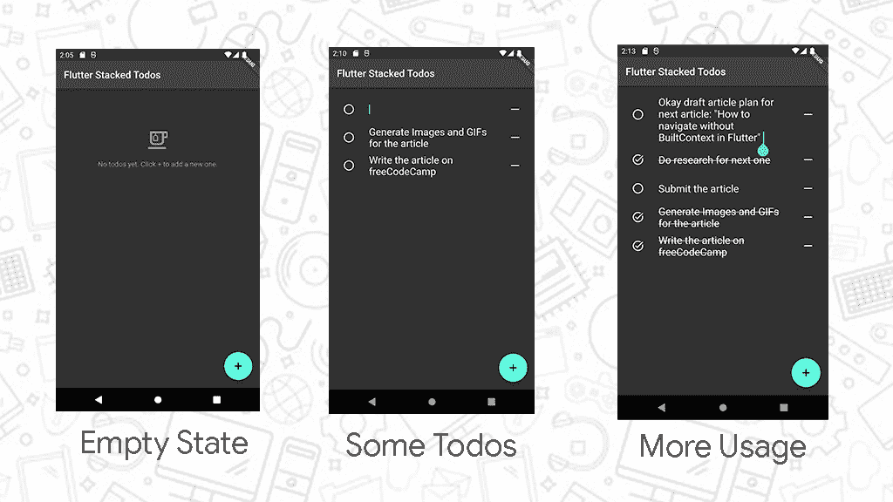
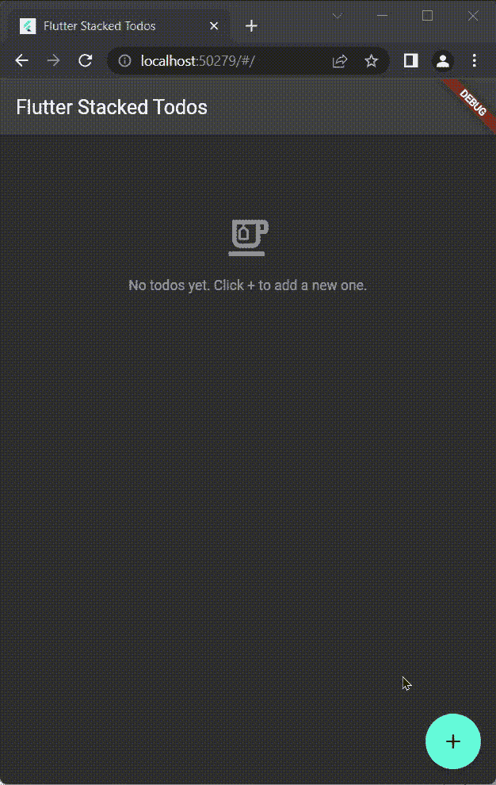
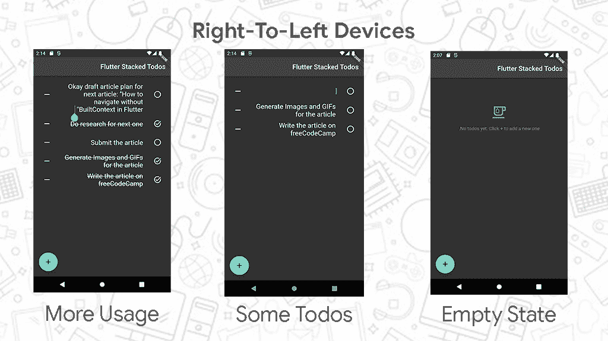
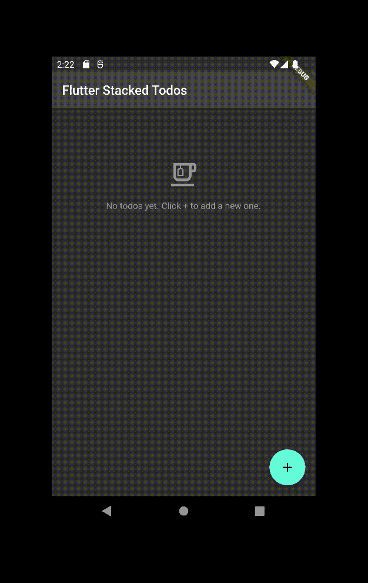

# 如何使用堆叠架构构建 Flutter Todo App

> 原文：<https://www.freecodecamp.org/news/flutter-stacked-architecture-todo-app/>

Flutter 是一个用于构建跨平台应用程序的 UI 工具包。您可以使用各种状态管理技术来构建 Flutter 应用程序，如[堆栈](https://pub.dev/packages/stacked)架构。

这篇文章将解释什么是堆叠架构，并引导你在 Flutter 中创建一个简单的 Todo 应用程序。

## 目录

*   [应用状态和 Flutter Widgets 简介](#intro-to-app-state-and-flutter-widgets)
*   [为什么在 Flutter](#why-do-you-need-state-management-architectures-in-flutter) 中需要状态管理架构？
*   [什么是堆叠架构](#what-is-stacked-architecture)？
*   [关于我们将要开发的 Todo 应用](#about-the-todo-app-we-will-be-building)
*   [如何设置 Flutter 和 Todos 服务](#how-to-setup-flutter-and-the-todos-service)
*   [如何构建 Todo 应用的 UI](#how-to-build-the-todo-app-s-ui)
*   [关于其他堆叠特征的注释](#note-on-other-stacked-features)
*   [总结](#summary)

## 应用状态和 Flutter 小部件简介

状态是指在呈现用户界面时使用的任何数据。它可能是用户生成的，也可能来自您的服务器或后端。

在 Flutter 中，应用程序的[用户界面(UI)](https://en.wikipedia.org/wiki/User_interface) 是状态的函数。换句话说，在任何给定的时间点，你的 UI 都是你的应用程序状态的可视化表示。

不过，在 Flutter 中，你可以使用小部件来构建应用程序 UI 的不同部分。Flutter 中的小部件是 UI 的一部分或一个单元。从本质上讲，Flutter 应用程序是一棵由小部件组成的大树。小部件的例子有 [AppBar](https://api.flutter.dev/flutter/material/AppBar-class.html) 、[容器](https://api.flutter.dev/flutter/widgets/Container-class.html)、[图标](https://api.flutter.dev/flutter/widgets/Icon-class.html)、[图像](https://api.flutter.dev/flutter/widgets/Image-class.html)、[文本](https://api.flutter.dev/flutter/widgets/Text-class.html)等等。

Flutter 有两种类型的小部件: [StatelessWidget](https://api.flutter.dev/flutter/widgets/StatelessWidget-class.html) s 和 [StatefulWidget](https://api.flutter.dev/flutter/widgets/StatefulWidget-class.html) s。

要告诉 Flutter 应用程序中的某些状态已经改变，您可以调用`[setState](https://api.flutter.dev/flutter/widgets/State/setState.html)`函数(仅在 StatefulWidgets 中可用), Flutter 将根据已经改变的状态数据重建小部件树。

Flutter 中的小部件不会改变。它们是不可改变的。颤振以每秒 60 帧的速度有效地绘制 ui。

在每一帧绘制时，Flutter 检查小部件树。如果有任何小部件发生了变化，Flutter 会删除它们，并用状态发生变化的新部件替换它们。

## 为什么在 Flutter 中需要状态管理架构？

`setState`好。这是处理 UI 和状态的最佳方式，因为它鼓励一种[声明式编程](https://www.freecodecamp.org/news/imperative-vs-declarative-programming-difference/)风格(这是编写 UI 的最佳方式)。

但是随着你的 Flutter 代码库的增长，你会意识到你总是会调用`setState`。你的 Flutter 应用将会有如此多的依赖于巨大且不断变化的状态数据的部件。这导致你的代码堵塞。

跨框架和库使用状态管理架构有助于[分离关注点](https://en.wikipedia.org/wiki/Separation_of_concerns)、干净的代码和伸缩性。当多个开发人员参与同一个代码库时，状态管理也很有帮助。架构也有助于代码的可测试性。

因此，要构建健壮的应用程序，应该在需要的地方使用状态管理。默认情况下，`setState`是状态管理的首选选项。但是当你开始采用架构时，你将在 Flutter 中使用其他可用的[状态管理选项。](https://docs.flutter.dev/development/data-and-backend/state-mgmt/options)

在 Flutter 中，每个部件都有一个返回部件树的`build`方法。`build`方法采用了一个`BuildContext`,通过它可以访问应用程序的重要数据，或者执行导航或显示对话框等任务。

[`InheritedWidget`](https://api.flutter.dev/flutter/widgets/InheritedWidget-class.html) 是一种内置的方法，用于从窗口小部件树中更高的窗口小部件访问状态。它在 BuildContext 的帮助下从这个更高的小部件访问状态。

`[ChangeNotifier](https://api.flutter.dev/flutter/foundation/ChangeNotifier-class.html)`是一个如其名的 Flutter 类。它通知侦听器其值的变化。您可以扩展这个类并调用它的`[notifyListeners();](https://api.flutter.dev/flutter/foundation/ChangeNotifier/notifyListeners.html)`方法，然后您可以在需要的地方使用它来更新 UI。颤振使用中流行的状态管理选项`ChangeNotifier`。例如，[提供者](https://docs.flutter.dev/development/data-and-backend/state-mgmt/simple)。

一些状态管理架构找到了一种在 build 方法中不使用 BuildContext 来导航或显示对话框的方法。这样，他们可以在不包含小部件的文件中完成应用程序的这些关键部分。如果他们需要更新 UI，他们使用`notifyListeners()`。堆叠架构就是这种情况。

## 什么是堆叠架构？

Stacked 是一种现代的颤振状态管理，具有顶级的[关注点分离](https://en.wikipedia.org/wiki/Separation_of_concerns)和[依赖注入](https://www.freecodecamp.org/news/a-quick-intro-to-dependency-injection-what-it-is-and-when-to-use-it-7578c84fa88f/)。

关注点分离包括将所有 UI 代码与逻辑代码分离。这种分离对于颤振项目的可维护性非常重要。

例如，通过在代码库中正确设置关注点分离，如果有对后端 API 的更新，您将只需要更新处理 API 逻辑的文件。您不一定需要更新 UI 代码。这最大限度地减少了编码时可能出现的错误。

依赖注入(或控制反转)是一种流行的编程技术。对于一个给定的代码块，依赖注入是这样一个事实，即该代码块不配置它自己运行所需的东西(依赖)。

通过依赖注入，您可以为一个类提供正常运行所需的服务(依赖)。反过来，这些服务抽象出并处理应用程序的业务逻辑。

例如，天气服务可以获取天气细节，天气显示小部件将使用该服务来显示数据。此 widget 不知道如何设置服务。它所知道的是，它将以某种方式从天气服务类接收需要显示的天气数据。

Stacked 通过围绕 3 个实体构建 Flutter 代码来实现关注点分离和依赖注入:**视图**、**视图模型**和**服务**。

视图只处理 UI 代码，并链接到视图模型。视图模型伴随视图并处理 UI 逻辑。视图模型使用服务。视图不应该访问服务。

Stacked 由 Dane Mackier 创建，现在由社区维护。 [Dane Mackier 是 Dart 和 Flutter](https://developers.google.com/community/experts/directory/profile/profile-dane-mackier) 的 GDE(谷歌开发者专家)。他使用了其他流行的状态管理架构，并在构建 Stacked 时结合了它们的优点。

请注意，Stacked 使用 ChangeNotifier。

## 关于我们将要构建的 Todo 应用程序

为了简单起见，我们将构建一个具有堆叠架构的单屏幕黑暗模式 Todo 应用程序。

如果还没有待办事项，应用程序会显示一条消息。但是，如果有待办事项，它会依次显示所有待办事项。

每个待办事项的左边都会有一个“可检查的圆圈”来表示它是否已经完成。在待办事项的右侧，将有一个按钮(带有破折号图标)用于删除待办事项。待办事项的文本内容将填充屏幕的中心或主要部分。

我们也将有一个浮动的行动按钮(有一个加号图标)来创建新的待办事项。



除了以上这些，我们还会用 [Hive](https://pub.dev/packages/hive) 将 Todos 存储到某个浏览器或者设备存储中。因此，在关闭并重新打开待办事项应用程序时，所有之前创建的待办事项都将被恢复。



Todos been restored after browser reload

因为这是堆叠架构，我们将有一个 Todos 服务来管理 Todos。我们还将有一个 TodosScreen(用于 UI)。TodosScreen 将有一个视图和一个视图模型。

也就是说，让我们开始编码。

如果你不想继续写下去，最后的代码就在这里。

## 如何设置 Flutter 和 Todos 服务

### 1.安装颤振

首先，你需要安装 Flutter 并正常工作。如果是的话，你可以进入第二步。如果你不想继续，你也可以进入第二步。

如果你没有安装 Flutter，请按照[这里](https://docs.flutter.dev/get-started/install)的操作系统步骤安装。

在您的终端中运行`flutter doctor -v`命令。如果所有列出的选项都有一个好的复选标记或绿色，那么您可以继续。如果任何结果有错误，在网上搜索错误，你会找到问题的解决方案。

### 2.创建颤振项目

运行以下命令创建新的颤振项目:

```
flutter create todo 
```

这将创建一个新的 Flutter 项目，并以`todo`作为应用程序的名称。如果你想要一个不同的应用名称(除了`todo`，用它代替`todo`。

### 3.添加包

我们需要将`[stacked](https://pub.dev/packages/stacked)` Flutter 包添加到项目中。它将为我们提供必要的类(比如视图模型)，假设我们正在使用堆叠架构进行构建。

我们还需要安装另一个包来帮助依赖注入或服务。为了简单起见，我们将在这个 Todo 应用程序中使用`[get_it](https://pub.dev/packages/get_it)`包来“获取”服务。

因为我们希望通过 Hive 跨应用关闭持久化 todos，所以我们还需要添加`[hive](https://pub.dev/packages/hive)`和`[hive_flutter](https://pub.dev/packages/hive_flutter)`包。

将终端的焦点目录更改到您刚刚在上面创建的`todo` Flutter 项目中。在同一终端中运行以下命令:

```
cd todo
```

如果您使用了不同的应用程序名称，请在`cd`命令中使用它，而不是`todo`。

在您的终端中运行以下命令，将`get_it`、`hive`、`hive_flutter`和`stacked`添加到颤振项目中。

```
flutter pub add get_it hive hive_flutter stacked
```

### 4.创建 Todo 模型

我们正在构建一个 Todo 应用程序，这意味着我们将与 Todos 互动。在代码的上下文中，Todo 是我们将要操作的实体。

为了简单起见，Todo 将是一个只有三个属性的 Dart 类:

1.  `id`:每个待办事项的唯一标识字符串。
2.  `completed`:指示待办事项状态的布尔值
3.  `content`:待办事项的实际文本内容。

在您喜欢的编辑器中打开 Flutter 项目。

在`lib`文件夹中创建一个名为`models`的新文件夹。在这个新创建的`models`文件夹中，创建一个名为`todo.dart`的新文件。

将以下内容粘贴到新创建的`lib/models/todo.dart`文件中:

```
class Todo {
  final String id;
  bool completed;
  String content;

  Todo({required this.id, this.completed = false, this.content = ''});
} 
```

请注意，`id`属性对于每个 todo 都是必需的。然而，默认情况下，Todo 是**而不是**完成的，并且具有空内容。

### 5.创建 TodoAdapter(用于配置单元)

Hive 可以很好地处理原始类型(如 bools、int、strings 等)。但是为了正确地从浏览器或设备存储中检索和保存自定义类型(比如我们的 Todo 模型), Hive 需要我们为自定义类型创建适配器。

在`lib/models`文件夹中创建一个名为`todo.adapter.dart`的文件。`todo.adapter.dart`应该伴随着`todo.dart`文件。

将以下内容粘贴到新创建的`lib/models/todo.adapter.dart`文件中:

```
import 'package:hive_flutter/hive_flutter.dart';

import 'todo.dart';

class TodoAdapter extends TypeAdapter<Todo> {
  @override
  final int typeId = 1;

  @override
  Todo read(BinaryReader reader) {
    final numOfFields = reader.readByte();
    final fields = <int, dynamic>{
      for (int i = 0; i < numOfFields; i++) reader.readByte(): reader.read(),
    };
    return Todo(
      id: fields[0] as String,
      completed: fields[1] as bool,
      content: fields[2] as String,
    );
  }

  @override
  void write(BinaryWriter writer, Todo obj) {
    writer
      ..writeByte(3)
      ..writeByte(0)
      ..write(obj.id)
      ..writeByte(1)
      ..write(obj.completed)
      ..writeByte(2)
      ..write(obj.content);
  }
} 
```

上面的代码基本上为 Hive 提供了读取和写入方法来检索和存储一个 Todo。

### 6.创建 todos 服务

在`lib`文件夹中创建一个名为`services`的新文件夹。在这个新创建的`services`文件夹中，创建一个名为`todos.service.dart`的新文件。

将以下内容粘贴到新创建的`lib/services/todos.services.dart`文件中:

```
import 'dart:math';

import 'package:hive_flutter/hive_flutter.dart';
import 'package:stacked/stacked.dart';

import '../models/todo.dart';

class TodosService with ReactiveServiceMixin {
  final _todos = ReactiveValue<List<Todo>>(
    Hive.box('todos').get('todos', defaultValue: []).cast<Todo>(),
  );
  final _random = Random();

  List<Todo> get todos => _todos.value;

  TodosService() {
    listenToReactiveValues([_todos]);
  }

  String _randomId() {
    return String.fromCharCodes(
      List.generate(10, (_) => _random.nextInt(33) + 80),
    );
  }

  void _saveToHive() => Hive.box('todos').put('todos', _todos.value);

  void newTodo() {
    _todos.value.insert(0, Todo(id: _randomId()));
    _saveToHive();
    notifyListeners();
  }

  bool removeTodo(String id) {
    final index = _todos.value.indexWhere((todo) => todo.id == id);
    if (index != -1) {
      _todos.value.removeAt(index);
      _saveToHive();
      notifyListeners();
      return true;
    } else {
      return false;
    }
  }

  bool toggleStatus(String id) {
    final index = _todos.value.indexWhere((todo) => todo.id == id);
    if (index != -1) {
      _todos.value[index].completed = !_todos.value[index].completed;
      _saveToHive();
      notifyListeners();
      return true;
    } else {
      return false;
    }
  }

  bool updateTodoContent(String id, String text) {
    final index = _todos.value.indexWhere((todo) => todo.id == id);
    if (index != -1) {
      _todos.value[index].content = text;
      _saveToHive();
      return true;
    } else {
      return false;
    }
  }
} 
```

#### 了解堆栈中的反应式服务

TodosService 类声明带有一个 [ReactiveServiceMixin](https://pub.dev/documentation/stacked/latest/stacked/ReactiveServiceMixin-mixin.html) 。这就是堆叠功能开始发挥作用的地方。

使用堆栈，默认情况下服务是非反应性的。然而，如果项目代码的任何其他部分(其他服务或视图模型)必须对服务值的变化做出“反应”,那么您需要使服务成为反应性的。

如果服务是反应性的，即具有 ReactiveServiceMixin，这意味着该服务在其属性中至少有一个[反应值](https://pub.dev/documentation/stacked/latest/stacked/ReactiveValue-class.html)。这也意味着服务必须调用`[listenToReactiveValues](https://pub.dev/documentation/stacked/latest/stacked/ReactiveServiceMixin/listenToReactiveValues.html)`并提供该服务中的反应值列表。

reactivity 背后的思想是，当 reactive 值发生变化时(无论是来自用户交互还是后端服务器)，服务可以更新该值的侦听器，告诉它们发生了变化。反过来，这些侦听器可以重新构建 ui，就像从小部件中调用了`setState`一样。

#### 关于 TodosService 类

在我们的例子中，TodosService 类只有一个私有的 reactive `_todos`字段。`_todos`保持一个`ReactiveValue`的 TodoList。这个私有的 reactive `_todos`也给了构造函数(`listenToReactiveValues`)中要监听的反应值列表。

这就是 Hive 的用武之地。使用 Hive，您可以将数据作为键值对存储在盒子中。对于我们的应用程序，我们使用的是“待办事项”框。在这个盒子里，我们使用“todos”键来检索存储的`todos`。

```
 Hive.box('todos').get('todos', defaultValue: []).cast<Todo>(),
```

空列表(`[]` ) defaultValue 是必需的。Todo 应用程序第一次在以前从未存储过`todos`的设备上运行，因此将返回空列表。

[将检索到的值转换为 Todo 对象也很重要(`.cast<Todo>()`)。如果忽略这一步，Flutter 将抛出错误。](https://en.wikipedia.org/wiki/Type_conversion)

TodosService 类提供了一个`todos` getter，用于访问私有 reactive TodoList ( `_todos.value`)的值。

```
List<Todo> get todos => _todos.value;
```

TodosService 类还提供了操作 Todos 及其属性的方法(`removeTodo`、`toggleStatus`和`updateTodoContent`)。这些方法中的每一个都接受 Todo 的`id`，并使用`id`来执行适当的动作。

注意，所有这些方法都调用私有的`_saveToHive()`方法。原因是无论何时`todos`被更新，更新都被保存到我们的本地 Hive 存储中。因此，如果应用程序被关闭并重新打开，最新的状态`todos`将被加载回来。

还要注意这些方法调用了`notifyListeners()`。这是只有一个 getter 用于`todos`(没有 setter)的想法的一部分。这样，每当有更新(来自这些方法)，我们就可以调用`notifyListeners()`(如果需要的话)并执行适当的逻辑(比如`_saveToHive`)。

`notifyListeners()`相当于`setState()`,但这次不是在 StatefulWidget 中。它告诉可能的听众(比如即将到来的 TodosScreenViewModel)这个`todos` getter 已经改变了。接下来，ViewModel 将重建其视图的 UI，并呈现`todos`的新状态。

值得指出的是`updateTodoContent`并不调用`notifyListeners()`。我们将在构建 TodosScreenView 的 UI 时指出原因。

注意私有的`_randomId()`方法，它返回一个 10 个字符的随机字符串。`newTodo()`方法使用`_randomId()`来设置新 Todo 的`id`，并将该新 Todo 插入 TodoList 的开头。

如果你想在列表末尾添加新的待办事项，在`newTodo()`方法中使用`_todos.value.add(Todo(id: _randomId()));`而不是`_todos.value.insert(0, Todo(id: _randomId()));`。

使用服务的上述整个模式引入了代码结构，使代码更容易阅读(与所有内容都在一个小部件中相比)。

如果我们将`todos`保存到某个外部 API，并在应用程序加载时取回它们，这种服务模式会变得非常有用。但是这将超出简单介绍堆叠架构的范围。

### 6.设置服务定位器

在`lib`文件夹中创建一个名为`app`的新文件夹。在这个新创建的`app`文件夹中，创建一个名为`locator.dart`的新文件。

将以下内容粘贴到新创建的`lib/app/locator.dart`文件中:

```
import 'package:get_it/get_it.dart';

import '../services/todos.service.dart';

final locator = GetIt.instance;

setupLocator() {
  locator.registerLazySingleton(() => TodosService());
} 
```

这里，出于惯例，我们将`GetIt`实例命名为`locator`。毕竟，这个名字反映了它的作用。它定位服务。其他开发人员可能想为这个服务定位器使用`getIt`或其他一些描述性的名称。没关系。

我们有一个`setupLocator()`函数向定位器注册我们的 TodosService。如果我们有其他服务，我们会以类似的方式在这里注册它们。

我们需要在整个 Flutter 应用程序启动之前调用`setupLocator()`函数。这样，Flutter 应用程序需要的任何小部件都可以使用这些服务。

删除`lib/main.dart`文件的全部内容，并在其中粘贴以下内容:

```
import 'package:flutter/material.dart';
import 'package:hive_flutter/hive_flutter.dart';

import 'app/locator.dart';
import 'models/todo.adapter.dart';
import 'ui/views/todos_screen_view.dart';

void main() async {
  WidgetsFlutterBinding.ensureInitialized();

  await Hive.initFlutter();
  Hive.registerAdapter(TodoAdapter());
  await Hive.openBox('todos');

  setupLocator();

  runApp(const MyApp());
}

class MyApp extends StatelessWidget {
  const MyApp({Key? key}) : super(key: key);

  @override
  Widget build(BuildContext context) {
    return MaterialApp(
      home: const TodosScreenView(),
      theme: ThemeData.dark(),
      title: 'Flutter Stacked Todos',
    );
  }
} 
```

`WidgetsFlutterBinding.ensureInitialized()`是同一`main`方法中的第一条语句。

简而言之，我们使用这个语句是因为 Flutter 要求我们在使用`runApp()`启动 Flutter 应用程序之前，每当我们想要做一些其他事情(如`Hive.initFlutter()`或`setupLocator()`)时，总是将它作为第一件事包含在`main`方法中。

注意，我们正在初始化 Hive，注册 TodoAdapter，并在`main`方法中打开“todos”框。这是设置 Hive 的最后一部分。

还要注意，我们现在在调用`main`方法中的`setupLocator()`函数，在最后一个`runApp`调用启动 Flutter 应用程序之前。

我们在 MaterialApp 中使用了深色主题，将`theme`属性设置为`ThemeData.dark()`。这个深色主题只是为了造型，如果你喜欢默认的浅色主题，你可以去掉它。你也可以随心所欲地定制应用的主题。

我们的`lib/main.dart`文件目前有错误。错误在于`TodosScreenView`小部件不存在，我们将其设置为 MaterialApp 的`home`属性。

如果你使用的是支持 [Flutter 的 IDE](https://docs.flutter.dev/get-started/editor) ，你会注意到上面提到的错误。

别担心，我们现在就创建这些文件。

## 如何构建 Todo 应用程序的用户界面

### 不同类型的视图模型

在堆栈中，先考虑视图模型，再考虑视图。这将帮助您在实际构建视图之前收集相应视图所需的依赖项。

Stacked 有不同的视图模型类型。在 Stacked 中，有 BaseViewModels、ReactiveViewModels、FutureViewModels、StreamViewModels 和 MultipleFutureViewModels。根据您当前的需求使用每一种方法。

如果您的视图或其视图模型需要使用来自反应服务的反应值，请使用 ReactiveViewModels。

我们将为 TodosScreenViewModel 使用反应视图模型类型。我们使用 ReactiveViewModel，因为我们将需要 TodosScreen 中的 reactive `todos` getter。

### 1.创建 TodosScreenViewModel

在`lib`文件夹中创建一个名为`ui`的新文件夹。在这个新创建的`ui`文件夹中，创建另一个名为`todos_screen`的文件夹。然后在新的`todos_screen`文件夹中，创建一个名为`todos_screen_viewmodel.dart`的新文件。

将以下内容粘贴到新创建的`lib/ui/todos_screen/todos_screen_viewmodel.dart`文件中:

```
import 'package:flutter/material.dart';
import 'package:stacked/stacked.dart';

import '../../app/locator.dart';
import '../../models/todo.dart';
import '../../services/todos.service.dart';

class TodosScreenViewModel extends ReactiveViewModel {
  final _firstTodoFocusNode = FocusNode();
  final _todosService = locator<TodosService>();
  late final toggleStatus = _todosService.toggleStatus;
  late final removeTodo = _todosService.removeTodo;
  late final updateTodoContent = _todosService.updateTodoContent;

  List<Todo> get todos => _todosService.todos;

  void newTodo() {
    _todosService.newTodo();
    _firstTodoFocusNode.requestFocus();
  }

  FocusNode? getFocusNode(String id) {
    final index = todos.indexWhere((todo) => todo.id == id);
    return index == 0 ? _firstTodoFocusNode : null;
  }

  @override
  List<ReactiveServiceMixin> get reactiveServices => [_todosService];
} 
```

注意我们如何在`locator`的帮助下访问`_todosService`。我们在 ReactiveViewModels 上覆盖了`reactiveServices` getter，并将`_todosService`提供给这个列表。

这样，每当在 TodosService 内部调用`notifyListeners()`时，这个 TodosScreenViewModel 将被通知，并且它将根据需要重新构建 UI。

从 TodosScreenViewModel 中，我们将服务中的`removeTodo`、`toggleStatus`和`updateTodoContent`方法公开给 TodosScreenView(稍后将出现)。

你可能想知道为什么我们需要这样做。为什么不直接公开服务本身，或者从视图或小部件本身访问服务？

这里的要点是架构规则和关注点的分离。请记住，堆叠架构声明视图永远不应该访问服务。

此外，我们这样做是因为我们让事情变得简单。如果应用程序变得比这更大，并且我们开始向视图添加功能，您将意识到 TodosScreenViewModel 将不得不在调用服务的方法之前或之后执行其他逻辑。那样的话，我们就不做这种直接的方法暴露了。

这在 TodosScreenViewModel 的`newTodo()`方法中显而易见。它调用`_todosService.newTodo()`函数来创建一个新的空 Todo。然后，它继续请求关注第一个或刚刚创建的 Todo 节点(`_firstTodoFocusNode.requestFocus()`)。

这样，在新创建的空 Todo 创建后，光标将自动聚焦在它的文本输入字段上。当我们创建 TodosScreenView 时，您将看到这一点。

如果调用该方法的 Todo 是第一个 Todo，则该方法返回这个`_firstTodoFocusNode`。这个调用将从 TodosScreenView(稍后出现)中的 UI 进行。

#### 关于`late`关键字的说明

附加在直接公开的服务方法上的关键字`late`是必要的。

Dart 很漂亮。`late`是 Dart 的一个特性，它表示我们确信在 ViewModel 被实例化之后，这些方法将在*之后*被分配。

如果删除`late`关键字，Dart 将报错“初始化器中的实例成员' _todosService '不能被访问。”这个投诉是有效的。

投诉出现的原因是，当 TodosScreenViewModel 被实例化时，Dart 不确定在它需要实例化那些公开的方法(在它们前面有`late`)时，‘_ todos service’是否已经完成了它的初始化，以便可用于这些方法。

通常，实例成员不能相互自我初始化。例外情况是使用`late`关键字(正如我们所做的)或者在构造函数中进行这样的初始化。

在幕后，`late`关键字延迟了依赖实例成员(在本例中是直接公开的方法)的初始化，直到独立实例成员(在本例中是 _todosService)完成初始化。

我们没有在构造函数中做这些初始化，因为这会使代码更长。而且除此之外，和使用`late`效果一样。

### 2.创建 TodosScreenView

在`lib/ui/todos_screen`文件夹中创建一个名为`todos_screen_view.dart`的新文件。换句话说，`todos_screen_view.dart`文件应该伴随它的 ViewModel 文件:`todos_screen_viewmodel.dart`。

将以下内容粘贴到新创建的`lib/ui/todos_screen/todos_screen_view.dart`文件中:

```
import 'package:flutter/material.dart';
import 'package:stacked/stacked.dart';

import 'todos_screen_viewmodel.dart';

class TodosScreenView extends StatelessWidget {
  const TodosScreenView({Key? key}) : super(key: key);

  @override
  Widget build(BuildContext context) {
    return ViewModelBuilder<TodosScreenViewModel>.reactive(
      viewModelBuilder: () => TodosScreenViewModel(),
      builder: (context, model, _) => Scaffold(
        appBar: AppBar(title: const Text('Flutter Stacked Todos')),
        body: ListView(
          padding: const EdgeInsets.symmetric(vertical: 16),
          children: [
            if (model.todos.isEmpty)
              Opacity(
                opacity: 0.5,
                child: Column(
                  children: const [
                    SizedBox(height: 64),
                    Icon(Icons.emoji_food_beverage_outlined, size: 48),
                    SizedBox(height: 16),
                    Text('No todos yet. Click + to add a new one.'),
                  ],
                ),
              ),
            ...model.todos.map((todo) {
              return ListTile(
                leading: IconButton(
                  icon: Icon(
                    todo.completed ? Icons.task_alt : Icons.circle_outlined,
                  ),
                  onPressed: () => model.toggleStatus(todo.id),
                ),
                title: TextField(
                  controller: TextEditingController(text: todo.content),
                  decoration: null,
                  focusNode: model.getFocusNode(todo.id),
                  maxLines: null,
                  onChanged: (text) => model.updateTodoContent(todo.id, text),
                  style: TextStyle(
                    fontSize: 20,
                    decoration:
                        todo.completed ? TextDecoration.lineThrough : null,
                  ),
                ),
                trailing: IconButton(
                  icon: const Icon(Icons.horizontal_rule),
                  onPressed: () => model.removeTodo(todo.id),
                ),
              );
            }),
          ],
        ),
        floatingActionButton: FloatingActionButton(
          onPressed: model.newTodo,
          child: const Icon(Icons.add),
        ),
      ),
    );
  }
} 
```

#### 关于 TodosScreenView 视图

`build`方法声明后的第一行是 return 语句。该语句为 TodosScreenViewModel 返回一个`ViewModelBuilder`小部件。

这是堆叠架构的另一个方面。它解释了我们所说的视图附加到视图模型的含义。本质上，我们使用 ViewModelBuilders 来呈现视图。

这样，视图就可以访问其视图模型的公共属性和方法。此外，在 ViewModel 内部调用`notifyListeners()`会自动更新视图的 UI。此外，大部分(如果不是全部的话)非声明性的 UI 逻辑应该移到 ViewModel 中。

这解释了为什么我们将第一个 Todo 的 FocusNode 的逻辑转移到 TodosScreenViewModel。

TodosScreenView 脚手架的`body`是所有从`model.todos`获得的 Todos 的`ListView`。

但是，ListView 的第一个成员是一个不透明度为 0.5 的条件不透明度小部件。它的子级是一个空状态列，带有空格、茶杯图标和子级文本。

我们使用`ListTile`来显示每个待办事项。这是一个方便的小部件，它将`leading`、`title`和`trailing`小部件用于屏幕的左、中和右部分。

**从右到左的注意事项** : ListTile 是一个很好的 widget，Flutter 是一个很好的框架。他们都是国际化的。如果此应用程序在自然设置为从右到左语言环境(例如阿拉伯语)的设备上运行，该应用程序将被镜像。因此 ListTiles 的前导、标题和尾随小部件将位于屏幕的右侧、中间和左侧。



ListTile 上的`leading`小部件是一个图标按钮，根据待办事项是否完成，它的图标可以是空的，也可以是选中的圆圈。IconButton 上的`onPressed`回调切换 Todo 的状态。

ListTile 上的`title`(中心)小部件是一个没有修饰的 TextField。这里没有装饰意味着它没有背景、边框或下划线。目的是给用户一种感觉，他们可以只阅读他们的待办事项内容，而同时，编辑内容的能力是在同一个地方。

赋予 TextField 的`[TextEditingController](https://api.flutter.dev/flutter/widgets/TextEditingController-class.html)`用于从 Todo 的内容中设置字段上的文本内容。将 TextField 上的`maxLines`设置为 null 是告诉 Flutter TextField 中的文本可以跨多行。

`onChanged`回调更新附加 Todo 的文本内容。每次击键或编辑文本时都会调用这个回调函数。我们这样做是为了让所有待办事项始终与用户界面保持同步。

我们没有在 TodosService 的这个回调(`updateTodoContent`)中调用`notifyListeners()`来防止光标跳跃(假设我们是为每个击键进行调用)。

如果在这个回调中调用了`notifyListeners()`,那么每次都会重新构建 UI，并且每次击键后光标都会跳回到 TextField 的开头。


### 3.运行待办事项应用程序

如果您使用的是支持 Flutter 的 IDE，那么您应该已经能够在预配置的设备上运行上面的应用程序了。

如果不是，没问题——在同一个终端中运行下面的命令。或者，确保您位于终端中的同一个项目文件夹中，然后运行命令:

```
flutter run
```

它应该在一个可用的设备上运行 Flutter 应用程序，或者让你选择一个设备，然后在其上运行应用程序。

您应该能够创建待办事项，将它们标记为完成，并删除它们。



如果你已经做到了这一步，那么恭喜用堆叠架构构建了一个 Todo 应用！

简单概括一下，您的`lib`文件夹中的文件现在应该是:

*   `app/locator.dart`
*   `models/todo.adapter.dart`
*   `models/todo.dart`
*   `services/todos.service.dart`
*   `ui/todos_screen/todos_screen_view.dart`
*   `ui/todos_screen/todos_screen_viewmodel.dart`
*   `main.dart`

[你可以在这里](https://github.com/obumnwabude/flutter_stacked_todo/tree/freecodecamp)获得 GitHub 上的最终代码。

## 关于其他堆叠特征的注释

使用堆叠架构还有更多好处。上面的 Todo 应用程序只有一个屏幕，它不需要任何导航。

您将需要在大多数(如果不是所有)您将使用 Flutter 构建的应用程序中配置导航或路由。当你在 Flutter 应用程序中有多个屏幕时，导航是必不可少的。

Stacked 允许你在一个空的 Dart 类上配置一个`@StackedApp`装饰。这个修饰可以接受路由和依赖信息，如下面的代码片段所示:

```
@StackedApp(
  routes: [MaterialRoute(page: TodosScreenView, initial: true)],
  dependencies: [LazySingleton(classType: TodosService)],
)
class App {
  // This class has no puporse besides housing the annotation that
  // generates the required functionality.
} 
```

然后你需要将`build_runner`和`stacked_generator`包添加到 Flutter 项目中。然后在开发过程中，保持以下命令运行:

```
flutter pub run build_runner build --delete-conflicting-outputs
```

这个命令将为您生成`setupLocator()`函数的内容。这是您将添加到`lib/main.dart`中的 main 方法的生成文件(和函数)。

此外，堆叠架构还有一个`[stacked_services](https://pub.dev/packages/stacked_services)`封装。这个包有助于配置关键的服务，如底部表单、对话框、导航和小吃店，而不需要在视图模型中构建上下文。

所有这些都带来了便利，并在使用 Stacked 时为您提供了更好的开发体验。

但是这些功能对于我们刚刚构建的简单的 Todo 应用程序来说是多余的。这就是为什么我们没有包括他们。

这个想法是为了理解堆叠架构背后的基本原理，并能够在您的**大型**颤振项目中使用该架构。

压力是大规模的。实际上，如果你正在构建简单的东西，你不需要使用任何状态管理架构。甚至一个*简单的* Todo 应用。

但是在这篇文章中，我的目标是让你开始使用堆叠架构，我需要一些简单的东西(比如这个 Todo 应用程序)来解释这些概念。

当然，您仍然可以使用 Stacked 来构建简单的东西。这就是我们刚刚用 Todo 应用程序做的事情。但要明白，当你开始在 Todo 应用程序中添加更多功能时，如将 Todo 保存到某个服务器、身份验证、将 Todo 分组到类别等，你将享受到 Stacked 的好处。

## 摘要

状态管理架构是构建颤振项目的好方法。它们是可选的，但是如果您正在构建一个复杂的应用程序，或者如果不止一个人在为同一个代码库做贡献，那么它们可能是必需的。

这些架构找到了一种方法来更新 UI，而不需要默认调用`setState()`。堆叠就是这样一种架构。它使用`notifyListeners()`来更新 UI。

Stacked 的一个关键特性是在没有 BuildContext 的情况下执行导航等关键服务。我们没有在这个 Todo 应用程序中探索该功能。但是，当您进一步使用 Stacked 时，请记住这一点。

您的堆叠应用程序应该在视图文件中包含微件。视图应该绑定到视图模型，UI 逻辑应该在这里发生。服务应该用于应用程序的业务逻辑和 API。它们应该由其他服务或视图模型使用。

我们已经使用这个简单的 3 实体结构构建了一个功能性的 Todo 应用程序。您可以使用相同的模式来构建更大更好的应用程序。更好的是，您可以重构现有的应用程序，使其遵循这种模式并拥有更干净的代码。

我们还使用 Hive 在关闭并重新打开 Flutter 应用程序后保存和检索 Todos。Hive 是一个轻量级的包，可以在你的应用程序中起到类似的作用。

[freeCodeCamp 手机 app](https://play.google.com/store/apps/details?id=org.freecodecamp) 采用 Flutter 打造。它是开源的，使用堆栈式架构构建。[你可以在这里给 freeCodeCamp app 投稿。](https://github.com/freeCodeCamp/mobile)

干杯！