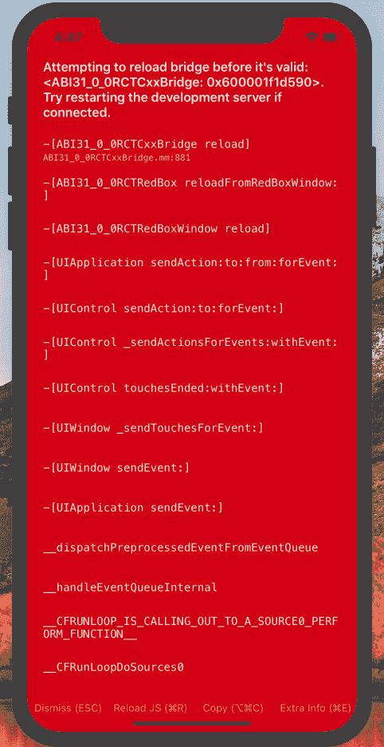

# Flutter VS React Native——以及为什么我认为 Flutter 最适合移动应用开发

> 原文：<https://www.freecodecamp.org/news/flutter-vs-react-native-and-why-i-think-flutter-is-best-for-mobile-app-development/>

这不是你可能认为的那种文章。我不会列出每个框架的优缺点，也不会对性能进行比较分析。

在过去的几周里，我尝试使用这两种框架来创建简单、实用的应用程序。这篇文章的标题是我从实验中得出的结论。

⚠️声明:我绝不是说框架 a 比框架 b 好，我也没有因为给出我的观点而得到报酬。这仅仅是一篇基于我个人经历的文章，仅此而已。

## 一些背景

虽然我对 [Dart](https://www.dartlang.org/) 或 [React](https://reactjs.org/) 都不熟悉，但我有一些 JavaScript 背景知识，而且比我所能分享的本地开发要多。由于这两个框架相对较新，并且提供相同类型的开发体验，所以我想我应该让他们尝试一下，看看这到底是怎么回事。当然，我对这两者的整个逻辑并不十分精通，我还没有完全理解 React 中的状态组件或 Dart 中的组件层次结构。也就是说，我开始在两个平台上创建一个基本的应用程序。申请的前提？一个可以接受用户输入的界面，一按按钮就可以在某种列表中显示用户输入，用户可以在屏幕上滚动浏览。

* * *

# 我的反应

我首先开始使用******React Native******开发应用程序。设置项目非常简单。你所要做的就是按照[入门文档](https://facebook.github.io/react-native/docs/getting-started.html)中的说明进行操作。我安装了******Expo******，几分钟后，我的应用程序就加载到了我的手机上。我非常欣赏 Expo 应用程序的二维码扫描仪识别屏幕上的代码的速度。Expo 在电脑上的界面也非常直观。你可以看到应用程序的状态(构建或失败)，启动一个 Android/iOS 模拟器等等。现在是时候把我自己的逻辑放到应用程序中了。这就是事情变得令人沮丧的地方。

用文本输入替换视图元素很容易，用 onClick 动作添加按钮也很容易。但是试图用一个数据集来保存用户的输入，这是令人难以置信的。我创建了一个变量，它是 state 对象中的一个数组，并尝试了各种方法在用户完成输入后更新它。我到处寻找并实施了各种解决方案来允许我的应用程序将数据保存到阵列中，但都无济于事。我找到的文档很少，也没什么帮助。更不用说我遇到的过多的编译错误了，这些错误对我的代码有什么问题没有太大的指导意义。过了一段时间，反复看到那个红屏变得挺烦的。

Why React? Why?

# 飘飘而去

由于慌乱和羞愧，我无法使用 React 开发出最简单的应用程序，在 Flutter 发布之后，我想我应该尝试构建一个相同的应用程序。 ******你知道他们说什么，换个地方——换个运气。******

设置是一件轻而易举的事，提供了与 React 相同的快速体验，我已经准备好立即开始开发。下载 Flutter SDK 和安装插件只是开始开发 Flutter 的几个简单步骤的一部分。

接下来是查看代码的任务。我该怎么用语言表达呢？不是我所期待的。在一个漫长而曲折的层次结构中，您有不同的组件，有时很难保持跟踪。除此之外，你还有小部件、列和行，你需要弄清楚所有的东西放在哪里。现在，你可能在想我应该告诉你我为什么喜欢 Flutter。正如大多数事物一样，它们有各自的长处和短处。在回顾了我认为令人恼火的事情后，我可以享受我发现的可爱之处。

对于初学者来说，颤振有大量的文献记载。每当我需要查找某样东西时，我都能很容易地在文档中找到它。更重要的是，现实生活中有如此多的各种应用实例，你一定会找到一个与你正在尝试制作的东西相似的实例。

在修改了起始代码之后，您开始掌握层次结构，以及视图是如何显示的，您会逐渐理解其中怪异的复杂性。意识到让一个组件以某种方式运行就像给小部件添加另一个特性一样简单，这也是一个爆炸。

而最重要的是， ******我已经在原生设定****** 。我在家里使用 Android Studio，了解所有东西的去向，享受熟悉环境的奢华和好处。

与我花在 React 上的 ******尝试****** 开发我的应用程序的时间相比，我花在 Flutter 上的时间只是其中的一小部分。此外，即使你试图做的事情并不总是奏效，你也会有最终进步的感觉，并且鼓励你在文档中更详细地查看事情。

生气？？心烦？？兴奋吗？？喜气洋洋？？让我知道你的想法。