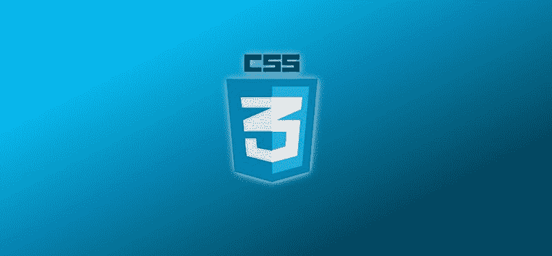
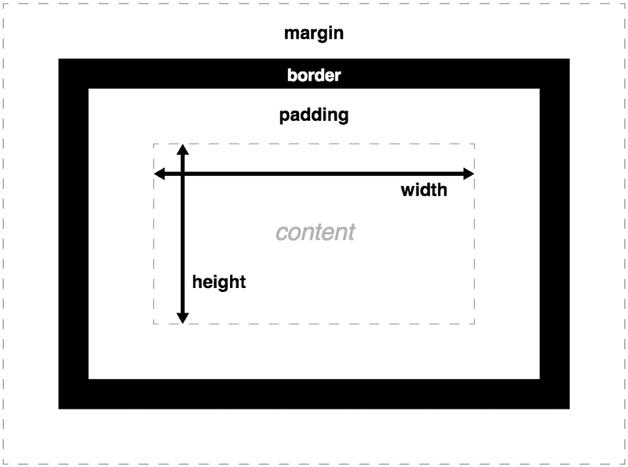
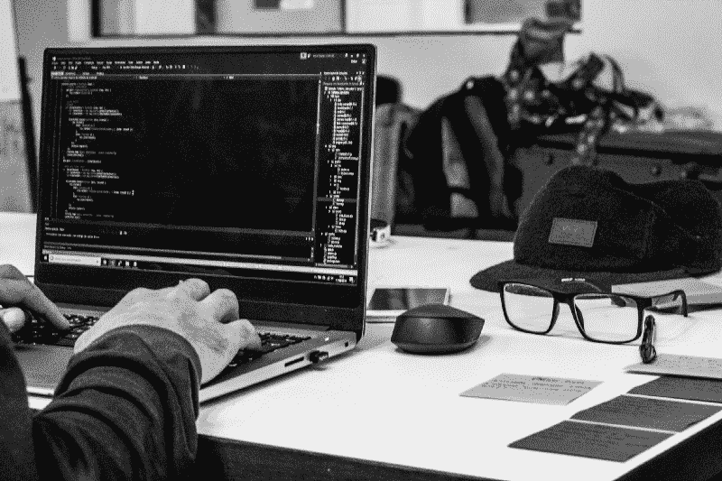
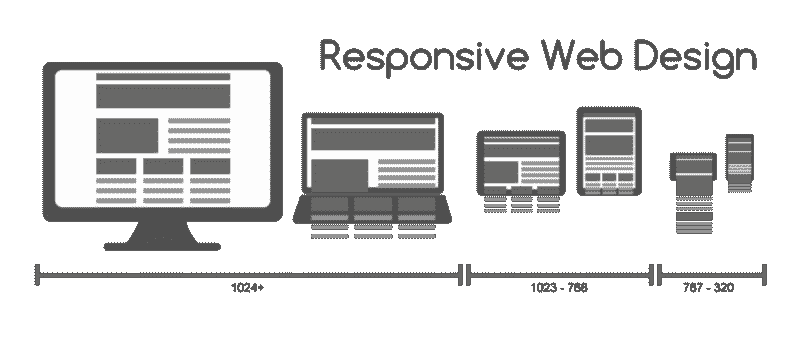

# 遵循这些步骤，成为一个 CSS 巨星

> 原文：<https://www.freecodecamp.org/news/follow-these-steps-to-become-a-css-superstar-837cd6cb9b1a/>

由 Preetish HS

# 遵循这些步骤，成为一个 CSS 巨星



CSS(层叠样式表)是用于构建网页的核心技术之一。因为它是浏览器唯一能理解的样式表语言，所以深入学习 CSS 对掌握 web 开发很重要。

CSS 入门非常容易。只需几个小时的培训，您就可以轻松设计文本、元素和布局。然而，这变得越来越困难，很快您就会发现您的代码开始变得非常混乱。以前正常工作的组件开始损坏，你搜索并找到修复方法，修复了你的元素，但损坏了其他 5 个元素，因为你在谷歌上找到的解决方案改变了`display` 或`position`？

### **为什么以正确的方式学习 CSS 很重要**

如果你对基础知识没有更深入的理解，CSS 就变得更像是一种**试错法。**你将为不同的属性尝试不同的值，并最终保持一个接近你想要的值，而不需要真正理解它是如何工作的。

你将开始谷歌一些基本的东西，比如**“如何使两个 div 居中”**或**“如何垂直对齐一个 div 和一个文本”**，并且每次都从 StackOverflow 或 codePen 复制粘贴代码。回到那些日子，当 **flexbox** 还不那么流行的时候，**“你如何在页面中垂直和水平对齐一个 div？”**是一个经典的 CSS 面试问题。许多初学者能把水平部分做对，但只有少数人能把垂直部分也做对。

### 路线图？？

#### **1。基本的？**

如果你刚开始 web 开发，在开始 CSS 之前先学习一些 [HTML](https://developer.mozilla.org/en-US/docs/Learn/HTML/Introduction_to_HTML) 的基础知识。在 CSS 中，首先阅读关于 CSS 是什么，它如何在浏览器中工作，以及它的基本语法和用法的理论。

了解不同种类的可用样式表、它们的差异、选择器和基本样式，如`font-size`、`width`、`height`等。

您可以通过浏览位于 [MDN](https://developer.mozilla.org/en-US/docs/Learn/CSS) 的教程开始学习。

#### **2。CSS 盒子模型？**



credit: [https://developer.mozilla.org](https://developer.mozilla.org)

了解 [CSS 盒子模式](https://developer.mozilla.org/en-US/docs/Learn/CSS/Introduction_to_CSS/Box_model) l 的基本知识以及与之相关的属性如`margin`、`border`、`padding` 等

#### **3。图像和背景？**

图像使网页变得生动。有许多方法来添加图像，如图像标签，添加背景颜色/梯度和背景图像到各种其他标签。你也可以应用你以前学过的东西，比如给图片设置边框，或者使用多张图片，开发一个简单的图库。

```
<div class="image" > </div>
```

```
.image {   background-image: url(../images/wallpaper.jpg);}
```

#### **4。显示和位置？**

这两个是 CSS 中最重要的属性，你需要注意正确理解它们。很好地了解这两个属性可以让你的 CSS 之旅更加顺利。

```
 display: block | inline | inline-block | table | etc
```

了解如何使用这些`display` 属性。你会开始注意到一些 HTML 元素，比如`<d`I`v&g`t；& `lt;p` >或< h `1> behave l` ike 显示:block 和 s`ome e`l`ements`like <span&g`t；行为类似于显示:内联。

```
position: static | absolute | relative | fixed | sticky
```

这是即使有经验的程序员也会犯错误的属性之一。了解每个元素是如何工作的，一个元素的位置如何影响它的兄弟或父元素，在什么情况下使用它们，等等。

这一步非常重要，你可以一遍又一遍地重复，直到你理解为止！

```
float: left | right
```

虽然浮动布局现在有点过时了，但仍有许多旧网站使用浮动布局。

#### **5。颜色、字体、列表和表格☑️**

了解不同的颜色格式，如`HEX`代码、`rgb`、`rgba`、`hsl`、`hsla`、`transparent`等

```
color: white;color: #fff;color: rgb(255, 255, 255);color: rgba(255, 255, 255, 1);color: hsl(0, 100%, 100%);color: hsla(0, 100%, 100%, 1);color: transparent;
```

学习如何使用不同的字体。有些字体并非在所有浏览器上都可用，因此您需要学习使用`woff`或`ttf`文件手动添加字体或导入谷歌字体。

CSS 可以把一个基本的*无序列表* `<` ul >变成一个漂亮的导航栏！几年前，表格被用来创建屏幕布局，感谢上帝，我们不再这样做了！？

#### **6。伪类和组合子➕**

CSS **伪类**是添加到选择器中的一个关键字，指定所选元素的特殊状态。伪类可以简单到`:hover` 或`:visited`，也可以复杂到像`nth-last-of-type(odd)`

组合子帮助我们轻松地将样式应用到子元素或兄弟元素，而不必为它们分别创建新的类。

```
/* all the paragraph elements inside the container will have color red */
```

```
.container > p {  color: yellow;}
```

#### **7。调试和开发工具？**

CSS 不会抛出任何错误。如果你没有得到正确的样式，它会悄悄地破坏用户界面？所以学习如何使用开发工具是非常重要的。

Chrome Dev tools 是 web 开发人员的绝佳工具。它包含许多用于实时调试网站的强大功能，还内置了性能检查工具，如 [**灯塔**](https://developers.google.com/web/tools/lighthouse/) 。

#### **8。练习练习练习？**



Photo by [David Rangel](https://unsplash.com/@rangel?utm_source=medium&utm_medium=referral) on [Unsplash](https://unsplash.com?utm_source=medium&utm_medium=referral)

你在上面学到的内容足以开发一个基本的网站，所以此时你应该从开发小网站开始练习。当你构建一个真正的应用程序时，你会遇到各种各样的挑战。对于你的实践，你可以开发一个简单的度假网站，或者建立一个图片库，或者一个博客，或者你也可以建立一些你最喜欢的社交媒体的基本功能，如脸书或 Instagram。

#### **9。响应式网页设计？？**



credit: Wikipedia

在学习了桌面网站开发之后，还有很多其他设备可以用来访问网站。支持这些设备同样重要。在响应式设计流行之前，开发人员曾经为手机设计一个单独的网站，为支持触摸的设备设计一个单独的网站等等。还记得*m.facebook.com*和*touch.facebook.com*吗？

在响应式网页设计中有三件重要的事情:

****流体布局:****

**用`px` 设置的宽度不根据浏览器窗口缩放。为了使元素根据浏览器的大小缩放，我们需要通过以`%` 或`rem` 为单位设置大小来创建流畅的布局。**

****媒体查询:****

媒体查询是一种只有在特定条件为真时才包括 CSS 属性块的技术。我们根据自己的设计设置断点，并根据浏览器的宽度改变 CSS。

**`@media only screen and (max-width: 600px) {`**
**` body {`**
**`   background-color: lightblue;`**
**` }`**
**`}`**

****响应式图片:****

随着浏览器窗口宽度的减小，或者如果在移动设备上浏览网站，图像会缩小。有时很难将注意力集中在特定图像的重要细节上，所以我们需要在不同的屏幕上使用不同的图像。

#### ****10。Flexbox 和网格◼️ ⬛？****

**已经 10 年左右了(！)自 Flexbox 首次推出以来，但直到 2015 年才被纳入。——[来源](http://annairish.github.io/historicizing/history)**

Flexbox 和 Grid 是用来创建灵活布局的样式，它们让我们的生活变得更加轻松！这是 CSS 发生过的最好的事情之一。？

如果没有 Flexbox 或 Grid，下面显示的布局可能需要 300 多行 CSS 代码。

#### ****11。变换、过渡和动画？****

如果你想创建一个在鼠标事件或键盘事件(如悬停或点击)上有移动部件的交互式网页，学习基本的变换和转换会很方便。

在 CSS3 之前，动画大多是用 jQuery——一个 JavaScript 库完成的。现在 CSS 已经变得如此强大，我们可以不用任何 JavaScript 就能做复杂的动画。

#### ****12。前置处理器✴️****

****CSS 预处理器**是扩展 CSS 默认功能的脚本语言。它们使我们能够在 CSS 代码中使用逻辑，比如变量、嵌套、继承、混合、函数和数学运算。比较流行的有[萨斯](http://sass-lang.com/)、[少](http://lesscss.org/)、[手写笔](http://stylus-lang.com/)和 [POSTCSS](http://postcss.org/) 。**

**SASS 的 **SCSS** 格式被更广泛地使用，所以开始使用 SASS 进行开发是很好的。**

**POSTCSS 的`autoprefixer`插件通过添加额外的规则，如`-moz-`和`-webkit-`，使你的 CSS 规则可以跨各种浏览器兼容。**

#### ****13。框架**？**

**学习框架，如[引导](http://getbootstrap.com/)、[语义界面](http://semantic-ui.com/)或[物化](http://materializecss.com/)是可选的，但对更快的开发非常有用，因为它们提供了许多现成的样式和布局。**

这些框架已经在各种浏览器上测试过了，所以使用它们将会避免一些兼容性问题。大多数框架都遵循响应式设计模式，并且有许多免费的第三方模板可供快速使用。

#### ****14。特异性**？**

**“*试图修改 bootstrap 的按钮样式但失败了，谷歌搜索解决方案，使用`!important`，兴奋地认为这是解决所有问题的正确方法！*“这就是你如何注定你的项目！？如果你正确理解了 S[**specificity**](https://developer.mozilla.org/en/docs/Web/CSS/Specificity)**c**的概念，那么关于多个样式表中重叠规则的问题将会大大减少。**

特异性是应用于给定 CSS 声明的权重，由匹配选择器中每个选择器类型的数量决定。每个选择器都有不同的权重，使用多个选择器可以改变特异性。如果总体特异性相等，则考虑顺序。请看下面的例子:

**你认为这一段会是什么颜色？？**

#### ******15。CSS 架构？******

**编写 CSS 代码很容易，但是编写可维护的 CSS 代码很难。要写出好的 CSS 代码，必须遵循适当的结构和方法。仅仅遵循最佳实践不足以编写可维护的 CSS。**

**CSS 的一些架构模式有 [BEM](http://getbem.com/introduction/) ， [OOCSS](http://oocss.org/) ，[smacs](https://smacss.com/)等。您可以浏览文档，选择适合您的口味和项目的模式。**

### **你知道了吧！？**

**掌握 CSS 需要耐心和大量的练习。当你开始练习时，你会体验到 CSS 的神奇。15 个大步骤起初看起来令人望而生畏，但实际上并非如此。我热爱每一步，我的经历一次比一次好。？**

**感谢您阅读我的文章。我希望您发现这很有用。如果是这样，一定要留下很多掌声！？(最多可以留 50？)**

#### **想为你的下一个项目雇用我吗？给我发邮件到 contact@preetish.in？**