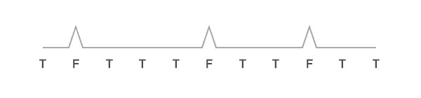
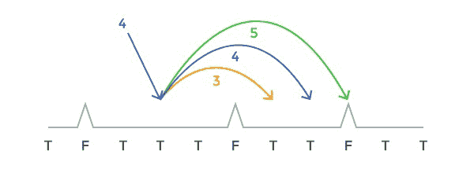
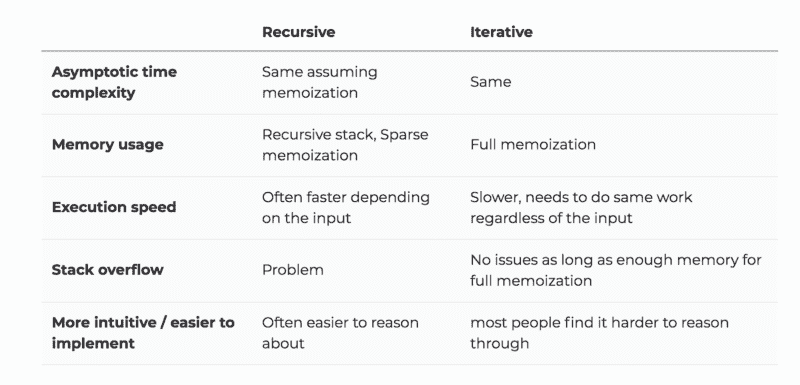
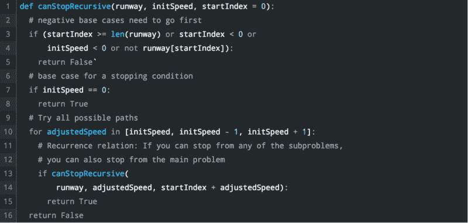
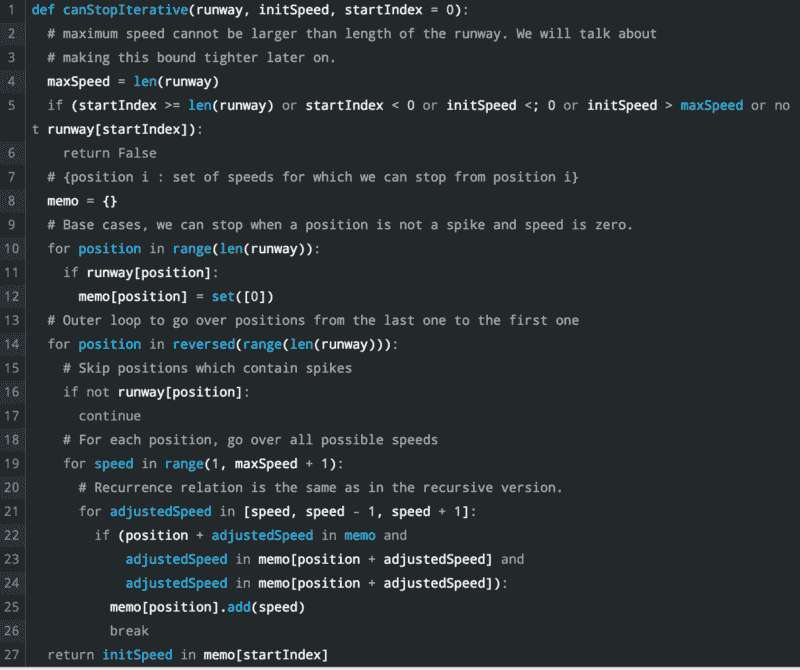
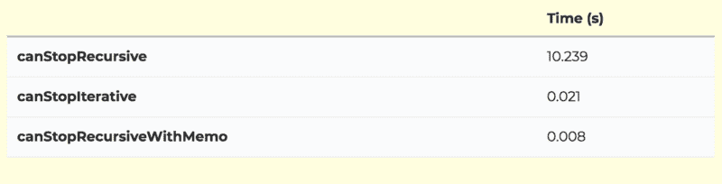
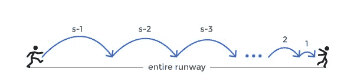

# 按照以下步骤解决任何动态规划面试问题

> 原文：<https://www.freecodecamp.org/news/follow-these-steps-to-solve-any-dynamic-programming-interview-problem-cc98e508cd0e/>

尼古拉·奥塔舍维奇

# 按照以下步骤解决任何动态规划面试问题

尽管在构建软件产品方面有丰富的经验，但许多工程师一想到要参加侧重于算法的编码面试就感到紧张不安。我已经采访了数百名来自 Refdash、Google 和我参与的初创公司的工程师，一些最常见的让工程师感到不安的问题是那些涉及动态编程(DP)的问题。

很多科技公司都喜欢在面试中问 DP 问题。虽然我们可以讨论它们是否能有效地评估一个人在工程角色中的表现能力，但 DP 仍然是一个让工程师在寻找他们热爱的工作的道路上绊倒的领域。

### 动态编程—可预测和可分析

我个人认为 DP 问题可能不是测试工程能力的最佳方式的原因之一是它们是可预测的，并且易于模式匹配。相对于工程能力，它们允许我们过滤更多的准备能力。

这些问题从表面上看似乎非常复杂，可能会给你一种解决这些问题的人非常擅长算法的印象。类似地，那些可能无法克服 DP 的一些令人困惑的概念的人，他们的算法知识可能会显得相当薄弱。

现实是不同的，他们表现的最大因素是准备。所以让我们确保每个人都有所准备。彻底地。

### 解决动态规划问题的 7 个步骤

在这篇文章的剩余部分，我将回顾一个方法，你可以按照它来判断一个问题是否是一个“DP 问题”,以及找出这样一个问题的解决方案。具体来说，我将经历以下步骤:

1.  如何识别 DP 问题
2.  身份问题变量
3.  清楚地表达递归关系
4.  确定基本案例
5.  决定你想要迭代地还是递归地实现它
6.  添加记忆
7.  确定时间复杂度

### DP 问题示例

为了给我将要做的抽象提供一个例子，让我介绍一个样例问题。在每一节中，我都会提到这个问题，但是你也可以独立于这个问题来阅读。

#### 问题陈述:

在这个问题中，我们在一个疯狂跳跃的球上，试图停下来，同时避免沿途的尖峰。

#### 规则如下:

1)给你一条平坦的跑道，上面有一堆钉子。跑道由一个布尔数组表示，该数组指示一个特定(离散)点是否没有尖峰。对清楚是真，对不清楚是假。

示例数组表示:

2)给你一个开始速度 S，S 在任何给定点都是一个非负整数，它表示你在下一次跳跃中向前移动了多少。

3)每一次定点着陆，在下一次跳跃之前，最多可以调整 1 个单位的速度。

4)您想要安全地停在跑道上的任何地方(不需要在阵列的末端)。当你的速度变成 0 时，你停下来。然而，如果你在任何一点落在钉子上，你疯狂的弹跳球就会爆炸，游戏就结束了。

你的函数的输出应该是一个布尔值，表明我们是否可以安全地停在跑道上的任何地方。

#### 步骤 1:如何识别动态编程问题

首先，让我们弄清楚 DP 本质上只是一种优化技术。DP 是一种解决问题的方法，它将问题分解成一系列更简单的子问题，每个子问题只解决一次，然后存储它们的解。下一次出现同样的子问题时，不用重新计算它的解，只需查找先前计算的解。这节省了计算时间，代价是(希望)适度的存储空间开销。

认识到使用 DP 可以解决问题是解决问题的第一步，也是最困难的一步。你要问自己的是，你的问题解是否可以表达为类似的更小问题的解的函数。

在我们的示例问题中，给定跑道上的一个点、一个速度和前方的跑道，我们可以确定下一个可能跳跃的点。此外，似乎我们能否以目前的速度从目前的点停下来，只取决于我们能否从我们选择的下一个点停下来。

这是一件伟大的事情，因为通过前进，我们缩短了前方的跑道，使我们的问题变得更小。我们应该能够一直重复这个过程，直到我们到达一个点，在这个点上我们是否能够停下来是显而易见的。

> 识别动态编程问题通常是解决它的最困难的步骤。问题的解决方案可以表示为类似的小问题的解决方案的函数吗？

#### 步骤 2:识别问题变量

现在我们已经建立了在我们的子问题之间有一些递归结构。接下来，我们需要用函数参数来表达这个问题，看看哪些参数在变化。

通常在面试中，你会有一两个变化的参数，但从技术上讲，这可能是任何数字。一个改变参数问题的经典例子是“确定第 n 个斐波那契数”。两个可变参数问题的一个例子是“计算字符串之间的编辑距离”。如果你不熟悉这些问题，不要担心。

确定变化参数数量的一种方法是列出几个子问题的例子并比较这些参数。计算变化参数的数量对于确定我们必须解决的子问题的数量是有价值的。它本身也很重要，可以帮助我们加强对步骤 1 中的递归关系的理解。

在我们的例子中，对于每个子问题，两个可以改变的参数是:

1.  **数组位置(P)**
2.  **速度**

可以说前方的跑道也在改变，但是考虑到整个不变的跑道和位置(P)已经携带了该信息，这是多余的。

现在，有了这两个变化的参数和其他静态参数，我们就有了子问题的完整描述。

> 识别变化的参数并确定子问题的数量。

#### 第三步:明确表达递归关系

这是一个重要的步骤，许多人为了进入编码而匆忙完成。尽可能清楚地表达递归关系将会加强你对问题的理解，并使其他事情变得容易得多。

一旦你发现了递归关系的存在，并根据参数指定了问题，这应该是一个自然的步骤。问题是如何相互联系的？换句话说，让我们假设你已经计算了子问题。你如何计算主要问题？

在我们的示例问题中，我们是这样考虑的:

因为在跳到下一个位置之前，你最多可以调整 1 的速度，所以只有 3 种可能的速度，因此我们可能是下一个到达的 3 个地点。

更正式地说，如果我们的速度是 S，位置 P，我们可以从(S，P)到:

1.  **(S，P+S)**；#如果我们不改变速度
2.  **(S — 1，P+S—1)**；#如果我们改变速度-1
3.  **(S + 1，P+S+1)**；#如果我们将速度改变+1

如果我们能在上面的任何一个子问题中找到停止的方法，那么我们也能从(S，P)停止。这是因为我们可以从(S，P)过渡到上述三个选项中的任何一个。

这通常是对问题的一种很好的理解(简单的英语解释)，但是有时你可能也想用数学的方式来表达这种关系。让我们调用一个函数来计算 canStop。然后:

**canStop(S，P) = canStop(S，P + S) || canStop(S — 1，P + S — 1) || canStop(S + 1，P + S + 1)**

哇哦，看来我们有递归关系了！

> 递归关系:假设你已经计算了子问题，你将如何计算主问题？

#### 步骤 4:确定基本案例

基本情况是一个不依赖于任何其他子问题的子问题。为了找到这样的子问题，您通常希望尝试几个例子，看看您的问题如何简化成更小的子问题，并确定在什么情况下不能进一步简化。

问题不能被进一步简化的原因是，在给定问题的**约束**的情况下，其中一个参数会变成不可能的值。

在我们的示例问题中，我们有两个不断变化的参数 S 和 P。让我们考虑一下 S 和 P 的哪些可能值可能不合法:

1.  **P 应在给定跑道的边界内**
2.  P 不能是这样的，跑道[P]是假的，因为那意味着我们站在一个尖峰上
3.  **S 不能为负，S==0 表示我们完成了**

有时，将我们关于参数的断言转换成可编程的基本案例可能有点困难。这是因为，除了列出断言之外，如果您想让代码看起来简洁，并且不检查不必要的条件，您还需要考虑这些条件中哪些是可能的。

在我们的例子中:

1.  跑道的长度似乎是正确的选择。另一种可能是把 m *带* **P ==跑道终点**作为基本情况。然而，有可能一个问题分裂成一个超出跑道尽头的子问题，所以我们真的需要检查不等式。
2.  这似乎很明显。我们可以简单地检查**runway[P]是否为假*。***
3.  类似于#1，我们可以简单地在 S == 0 是 S 参数的充分基本情况之前检查 S < 0 and S == 0\. However, here we can reason that it is impossible for S to be < 0 because S decreases by at most 1, so it would have to go through S == 0 case beforehand. Ther**。**

#### 步骤 5:决定你是想迭代地还是递归地实现它

到目前为止，我们讨论这些步骤的方式可能会让您认为我们应该递归地实现这个问题。然而，到目前为止，我们所讨论的一切都完全不知道您是决定递归地还是迭代地实现这个问题。在这两种方法中，您必须确定递归关系和基本案例。

为了决定是迭代还是递归，你需要仔细考虑权衡。

堆栈溢出问题通常是交易的破坏者，也是你不希望在(后端)生产系统中使用递归的原因。然而，出于采访的目的，只要你提到了权衡，你通常对这两种实现都没问题。您应该对实现这两者感到满意。

在我们的特殊问题中，我实现了两个版本。这里是 python 代码:
递归解决方案:(原始代码片段可以在[这里找到](http://blog.refdash.com/dynamic-programming-tutorial-example/))

迭代解决方案:(原始代码片段可以在[这里](http://blog.refdash.com/dynamic-programming-tutorial-example/)找到)

#### 第六步:添加记忆

**记忆**是一种与 DP 密切相关的技术。它用于存储昂贵的函数调用的结果，并在相同的输入再次出现时返回缓存的结果。

为什么我们要在递归中加入记忆？我们遇到同样的子问题，如果没有记忆，这些子问题会被重复计算。这些重复经常导致指数级的时间复杂度。

在递归解决方案中，添加记忆化应该很简单。我们来看看为什么。记住，记忆化只是函数结果的缓存。有时候，为了挤出一些小的优化，您想要偏离这个定义，但是将记忆化视为函数结果缓存是实现它的最直观的方式。

这意味着您应该:

1.  在每次*返回* *语句*之前，将您的函数结果存储到您的内存中
2.  在开始任何其他计算之前，查找函数结果的内存

下面是上面添加了记忆的代码(添加的行被突出显示):(原始代码片段可以在[这里](http://blog.refdash.com/dynamic-programming-tutorial-example/)找到)

为了说明记忆和不同方法的有效性，让我们做一些快速测试。我将对目前为止我们看到的所有三种方法进行压力测试。这里是设置:

1.  我创建了一条长度为 1000 的跑道，在随机的地方有长钉(我选择长钉出现在任何给定位置的概率为 20%)
2.  初始速度= 30
3.  我将所有函数运行了 10 次，并测量了平均执行时间

以下是结果(秒):

您可以看到，纯递归方法比迭代方法多花费大约 500 倍的时间，比带记忆的递归方法多花费大约 1300 倍的时间。请注意，这种差异会随着跑道长度的增加而迅速增加。我鼓励你尝试自己运行它。

#### 步骤 7:确定时间复杂度

有一些简单的规则可以使计算动态规划问题的时间复杂度变得容易得多。这里有两个你需要做的步骤:

1.  计算状态的数量——这取决于问题中变化参数的数量
2.  想想每个州所做的工作。换句话说，如果除了一个状态之外的所有东西都已经计算过了，那么计算最后一个状态需要做多少工作呢？

在我们的示例问题中，状态的数量是 **|P| * |S|，**其中

*   P 是所有位置的集合(|P|表示 P 中元素的数量)
*   s 是所有速度的集合

在这个问题中，每个状态所做的功是 O(1 ),因为给定所有其他状态，我们只需查看 3 个子问题来确定结果状态。

正如我们在前面的代码中提到的，|S|受限于跑道的长度(|P|)，所以我们可以说状态的数量是|P|并且因为每个状态所做的工作是 O(1)，所以总的时间复杂度是 O(|P|)。

然而，似乎|S|可以被进一步限制，因为如果它真的是|P|，很明显停止是不可能的，因为你必须在第一次移动时跳过整个跑道的长度。

因此，让我们看看如何对|S|进行更严格的限制。我们称最大速度为 s，假设我们从位置 0 开始。如果我们试图尽快停止，并且忽略潜在的峰值，我们能多快停止？

在第一次迭代中，我们必须至少到达点(S-1 ),通过将我们的速度从零调整-1。从那里我们至少要向前走(S-2)步，以此类推。

对于长度为 L 的跑道，必须满足以下条件:

(S-1) + (S-2) + (S-3) + …。+1L

**= > S*(S-1) / 2** < L

**= > S — S — 2L** < 0

如果你找到上述函数的根，它们将是:

**r1 = 1/2 + sqrt(1/4 + 2L)和 r2 = 1/2 — sqrt(1/4 + 2L)**

我们可以把我们的不等式写成:

**(S—R1)*(S—R2)<**；0

考虑到对于任何 S > 0 和 L > 0，S-R2 > 0，我们需要:

**S—1/2—sqrt(1/4+2L)<**；0

**=>S<1/2+sqrt(1/4**+2L)

这是我们在长度为 l 的跑道上可能达到的最大速度。如果我们的速度高于这个速度，即使理论上我们也不能停下来，不管尖峰的位置如何。

这意味着总时间复杂度仅取决于跑道长度 L，如下所示:

O(L * sqrt(L))比 O(L)好

> *O(L * sqrt(L))是时间复杂度的上界*

太棒了，你成功了！:)

我们所经历的 7 个步骤应该给你一个系统地解决任何动态编程问题的框架。我强烈推荐在更多的问题上实践这种方法来完善你的方法。

### **以下是你可以采取的一些后续步骤**

1.  通过尝试找到到达停止点的路径来扩展示例问题。我们解决了一个问题，它告诉你是否可以停下来，但是如果你也想知道最终在跑道上停下来需要采取的步骤呢？您将如何修改现有的实现来做到这一点？
2.  如果你想巩固你对 memoization 的理解，并且明白它只是一个函数结果缓存，你应该阅读一下 Python 中的 decorators 或者其他语言中的类似概念。想一想，对于你想记忆的任何函数，它们一般是如何允许你实现记忆的。
3.  按照我们所经历的步骤解决更多的 DP 问题。你总能在网上找到一堆(例如。 [LeetCode](https://leetcode.com/tag/dynamic-programming/) 或者 [GeeksForGeeks](http://www.geeksforgeeks.org/dynamic-programming/) 。在你练习的时候，记住一点:学思路，不要学问题。想法的数量明显减少，这是一个更容易征服的空间，也将更好地为你服务。

当你觉得你已经征服了这些想法时，看看 [**Refdash**](https://refdash.com/?utm_source=dp_blog) ，在那里你会接受一位高级工程师的采访，并获得关于你的编码、算法和系统设计的详细反馈。

*最初发表于 [Refdash 博客](http://blog.refdash.com/dynamic-programming-tutorial-example/)。Refdash 是一个面试平台，帮助工程师匿名采访来自谷歌、脸书或 Palantir 等顶级公司的经验丰富的工程师，并获得详细的反馈。 [Refdash](https://refdash.com/) 还帮助工程师根据他们的技能和兴趣发现惊人的工作机会。*