# 对于您的第一个 HTML 代码，让我们帮助蝙蝠侠写一封情书

> 原文：<https://www.freecodecamp.org/news/for-your-first-html-code-lets-help-batman-write-a-love-letter-64c203b9360b/>

作者 Kunal

# 对于您的第一个 HTML 代码，让我们帮助蝙蝠侠写一封情书

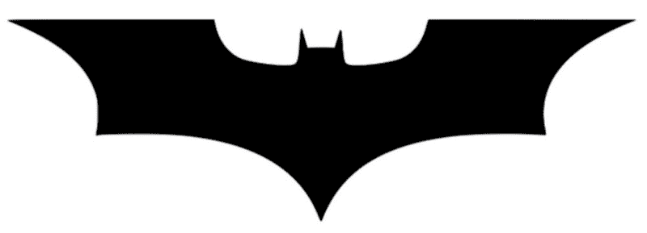

[Image Credit](https://www.pexels.com/photo/batman-black-and-white-logo-93596/)

一个晴朗的夜晚，你的胃拒绝消化晚餐时吃的大披萨，你不得不在睡梦中冲进浴室。

在浴室里，当你想知道为什么会发生这种事时，你听到通风口传来一个沉重的声音:“嘿，我是蝙蝠侠。”

你会怎么做？

在你惊慌失措，在关键时刻挺身而出之前，蝙蝠侠会说:“我需要你的帮助。我是一个超级极客，但是我不懂 HTML。我需要用 HTML 写我的情书——你能帮我写吗？”

谁能拒绝蝙蝠侠的请求呢？我们用 HTML 写蝙蝠侠的情书吧。

### 你的第一个 HTML 文件

HTML 网页就像电脑上的其他文件。当一个. doc 文件在 MS Word 中打开时，一个. jpg 文件在 Image Viewer 中打开，一个. html 文件在您的浏览器中打开。

所以，让我们创建一个. html 文件。您可以在记事本或任何其他基本编辑器中完成这项工作，但是我建议您使用 VS 代码。[在这里下载安装 VS 代码](https://code.visualstudio.com/)。它是免费的，也是我唯一喜欢的微软产品。

在您的系统中创建一个目录，并将其命名为“HTML Practice”(不带引号)。在这个目录中，再创建一个名为“蝙蝠侠的情书”的目录(不带引号)。这将是我们的项目根目录。这意味着我们所有与这个项目相关的文件都将存放在这里。

打开 VS 代码，按 ctrl+n 创建新文件，按 ctrl+s 保存文件。导航到“蝙蝠侠的情书”文件夹，将文件命名为“loveletter.html”，然后单击保存。

现在，如果您在文件资源管理器中双击打开该文件，它将在默认浏览器中打开。我推荐使用 Firefox 进行 web 开发，但是 Chrome 也不错。

让我们把这个过程和我们已经熟悉的东西联系起来。还记得你第一次接触电脑的时候吗？我做的第一件事就是打开 MS Paint，画点东西。您在画图中画了一些东西，并将其保存为图像，然后可以在图像查看器中查看该图像。然后，如果您想再次编辑该图像，您可以在画图中重新打开它，编辑它，并保存它。

我们现在的流程很相似。当我们使用画图来创建和编辑图像时，我们使用 VS 代码来创建和编辑我们的 HTML 文件。当我们使用图像查看器查看图像时，我们使用浏览器查看我们的 HTML 页面。

### 你的 HTML 第一段

我们有空白的 HTML 文件，所以这是蝙蝠侠想在情书中写的第一段

“在我们一起战斗了那么多之后，在我们一起经历了那么多艰难的时刻之后，在我们经历了那么多好的和坏的时刻之后，我想是时候让你知道我对你的感觉了。”

用 VS 代码复制 loveletter.html 中的段落。通过单击视图->切换自动换行(alt+z)启用自动换行。

保存文件并在浏览器中打开。如果它已经打开，请在浏览器上单击刷新。

瞧啊。那是你的第一个网页！

我们的第一段已经准备好了，但是这不是 HTML 中推荐的写段落的方式。我们有一个特定的方法让浏览器知道一个文本是一个段落。

如果你用`<p>`和`</p>`将文本换行，那么浏览器就会知道`<p>`和`</p>`里面的文本是一个段落。让我们这样做:

```
<p>After all the battles we fought together, after all the difficult times we saw together, after all the good and bad moments we've been through, I think it's time I let you know how I feel about you.</p>
```

通过在`<p>`和`</p>`中编写段落，你创建了一个 HTML 元素。网页是 HTML 元素的集合。

让我们先弄清楚一些术语:`<p>`是开始标记，`</p>`是结束标记，“p”是标记名。元素的开始和结束标记内的文本是该元素的内容。

### “风格”属性

您将看到文本覆盖了整个屏幕宽度。

我们不想那样。没有人想读这么长的行。假设我们的段落宽度为 550 像素。

我们可以通过使用元素的“style”属性来做到这一点。您可以在元素的 style 属性中定义元素的样式(例如，本例中的 width)。下面的行将在“p”元素上创建一个空的样式属性:

```
<p style="">...</p>
```

你看到那个空的`""`了吗？这是我们定义元素外观的地方。现在我们想设置宽度为 550 像素。让我们这样做:

```
<p style="width:550px;">  
    After all the battles we fought together, after all the difficult times we saw together, after all the good and bad moments we've been through, I think it's time I let you know how I feel about you.
</p>
```

我们将“宽度”属性设置为 550 像素，用冒号“:”分隔，以分号“；”结尾。

另外，请注意我们如何将`<p>`和`</p>`放在单独的行中，并且文本内容缩进一个制表符。像这样设计您的代码使它更具可读性。

### HTML 中的列表

接下来，蝙蝠侠想列出一些他钦佩的人的优点，就像这样:

“你用你的光完成了我的黑暗。我喜欢:
-你在最糟糕的事情中看到好的一面的方式
-你处理情感困境的方式
-你看待正义的方式
我从你身上学到了很多。久而久之，你在我心中占据了特殊的位置。”

这看起来很简单。

让我们将所需的文本复制到`</` p >下面:

```
<p style="width:550px;">
  After all the battles we faught together, after all the difficult times we saw together, after all the good and bad moments we've been through, I think it's time I let you know how I feel about you.
</p>
<p style="width:550px;">
  You complete my darkness with your light. I love:
  - the way you see good in the worse
  - the way you handle emotionally difficult situations
  - the way you look at Justice
  I have learned a lot from you. You have occupied a special place in my heart over the time.
</p>
```

保存并刷新浏览器。

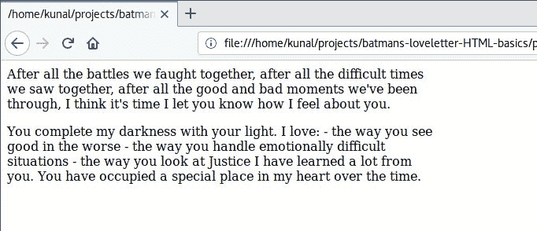

哇哦。这里发生了什么，我们的名单呢？

如果仔细观察，您会发现没有显示换行符。我们在代码中将列表项写在了新行中，但是它们在浏览器中显示在一行中。

如果你想在 HTML 中插入一个换行符，你必须使用`<br>`来提及它。让我们用`<br>`看看它是什么样子:

```
<p style="width:550px;">
  After all the battles we faught together, after all the difficult times we saw together, after all the good and bad moments we've been through, I think it's time I let you know how I feel about you.
</p>
<p style="width:550px;">
  You complete my darkness with your light. I love: <br>
  - the way you see good in the worse <br>
  - the way you handle emotionally difficult situations <br>
  - the way you look at Justice <br>
  I have learned a lot from you. You have occupied a special place in my heart over the time.
</p>
```

保存并刷新:

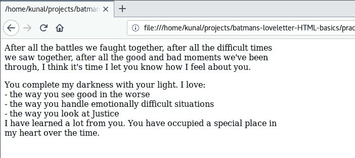

好了，现在看起来是我们想要的样子了。

另外，注意我们没有写`</br>`。有些标签不需要结束标签，(它们被称为自结束标签)。

还有一点:我们没有在两个段落之间使用`<br>`,但是第二个段落仍然从新的一行开始。这是因为“p”元素会自动插入一个换行符。

我们使用纯文本编写了我们的列表，但是有两个标签可以用于同样的目的:`<ul>`和`<li>`。

简单地说一下命名:ul 代表无序列表，li 代表列表项。让我们用这些来显示我们的列表:

```
<p style="width:550px;">
  After all the battles we faught together, after all the difficult times we saw together, after all the good and bad moments we've been through, I think it's time I let you know how I feel about you.
</p>

<p style="width:550px;">
  You complete my darkness with your light. I love:
  <ul>
    <li>the way you see good in the worse</li>
    <li>the way you handle emotionally difficult situations</li>
    <li>the way you look at Justice</li>
  </ul>
  I have learned a lot from you. You have occupied a special place in my heart over the time.
</p>
```

在复制代码之前，请注意我们所做的区别:

*   我们删除了所有的`<br>`，因为每个`<li>`会自动显示在新行中
*   我们将单个列表项包装在`<li>`和`</li>`之间。
*   我们将所有列表项的集合包装在`<ul>`和`</ul>`之间
*   我们没有像定义“p”元素那样定义“ul”元素的宽度。这是因为“ul”是“p”的子元素，而“p”已经被限制为 550px，所以“ul”不会超出这个范围。

让我们保存文件并刷新浏览器以查看结果:

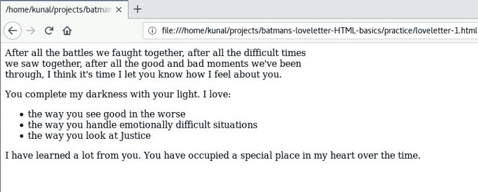

您会立即注意到，我们在每个列表项目前都显示了项目符号。我们现在不需要在每个列表项前写那个“-”。

仔细检查，你会发现最后一行的宽度超过了 550 像素。这是为什么呢？因为在 HTML 中，不允许在“p”元素中包含“ul”元素。让我们将第一行和最后一行放在单独的“p”元素中:

```
<p style="width:550px;">
  After all the battles we faught together, after all the difficult times we saw together, after all the good and bad moments we've been through, I think it's time I let you know how I feel about you.
</p>

<p style="width:550px;">
  You complete my darkness with your light. I love:
</p>

<ul style="width:550px;">
  <li>the way you see good in the worse</li>
  <li>the way you handle emotionally difficult situations</li>
  <li>the way you look at Justice</li>
</ul>

<p style="width:550px;">
  I have learned a lot from you. You have occupied a special place in my heart over the time.
</p>
```

保存并重新加载。

注意，这次我们还定义了“ul”元素的宽度。这是因为我们现在已经将“ul”元素移出了“p”元素。

定义信中所有元素的宽度会变得很麻烦。为此，我们有一个特定的元素:“div”元素。“div”元素是一个通用的容器，用于对内容进行分组，这样就可以很容易地设置样式。

让我们用一个 div 元素将整个字母包装起来，并给这个 div 元素赋予 width:550px:

```
<div style="width:550px;">
  <p>
    After all the battles we faught together, after all the difficult times we saw together, after all the good and bad moments we've been through, I think it's time I let you know how I feel about you.
  </p>
  <p>
    You complete my darkness with your light. I love:
  </p>
  <ul>
    <li>the way you see good in the worse</li>
    <li>the way you handle emotionally difficult situations</li>
    <li>the way you look at Justice</li>
  </ul>
  <p>
    I have learned a lot from you. You have occupied a special place in my heart over the time.
  </p>
</div>
```

太好了。我们的代码现在看起来干净多了。

### HTML 中的标题

蝙蝠侠很高兴看到目前为止的结果，他希望在信上有一个标题。他想做标题:“蝙蝠信”。当然，你已经看到这个名字了，不是吗？:D

您可以使用 ht、h2、h3、h4、h5 和 h6 标签添加标题，h1 是最大的主标题，h6 是最小的主标题。

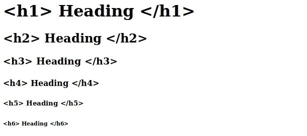

让我们使用 h1 和第二段前的副标题来制作主标题:

```
<div style="width:550px;">
  <h1>Bat Letter</h1>
  <p>
    After all the battles we faught together, after all the difficult times we saw together, after all the good and bad moments we've been through, I think it's time I let you know how I feel about you.
  </p>

  <h2>You are the light of my life</h2>
  <p>
    You complete my darkness with your light. I love:
  </p>
  <ul>
    <li>the way you see good in the worse</li>
    <li>the way you handle emotionally difficult situations</li>
    <li>the way you look at Justice</li>
  </ul>
  <p>
    I have learned a lot from you. You have occupied a special place in my heart over the time.
  </p>
</div>
```

保存并重新加载。

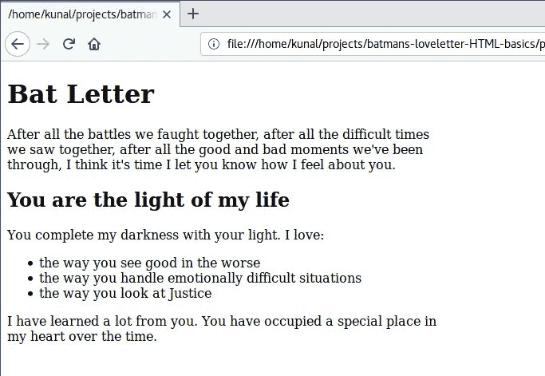

### HTML 中的图像

我们的信还没有完成，但在继续之前，还有一件重要的东西不见了——一个蝙蝠标志。你见过蝙蝠侠拥有的没有蝙蝠标志的东西吗？

没有。

那么，让我们在信中加上一个蝙蝠标志。

在 HTML 中包含图像就像在 Word 文件中包含图像一样。在 MS Word 中，你进入菜单->插入->图像->然后导航到图像的位置->选择图像->点击插入。

在 HTML 中，我们不用点击菜单，而是使用``标签让浏览器知道我们需要加载一张图片。我们将文件的位置和名称写在“src”属性中。如果图像在项目根目录中，我们可以简单地在 src 属性中写入图像文件的名称。

在我们开始编码之前，请从[这里](https://www.pexels.com/photo/batman-black-and-white-logo-93596/)下载这个蝙蝠标志。您可能想要裁剪图像中多余的空白。将图片复制到你的项目根目录下，重命名为“bat-logo.jpeg”。

```
<div style="width:550px;">
  <h1>Bat Letter</h1>
  
  <p>
    After all the battles we faught together, after all the difficult times we saw together, after all the good and bad moments we've been through, I think it's time I let you know how I feel about you.
  </p>

<h2>You are the light of my life</h2>
  <p>
    You complete my darkness with your light. I love:
  </p>
  <ul>
    <li>the way you see good in the worse</li>
    <li>the way you handle emotionally difficult situations</li>
    <li>the way you look at Justice</li>
  </ul>
  <p>
    I have learned a lot from you. You have occupied a special place in my heart over the time.
  </p>
</div>
```

我们在第 3 行加入了 img 标签。这个标签也是自结束标签，所以我们不需要写`</img>`。在 src 属性中，我们给出了图像文件的名称。这个名字应该和你的**一模一样，包括扩展名(。jpeg)及其案例。**

**保存并刷新以查看结果。**

**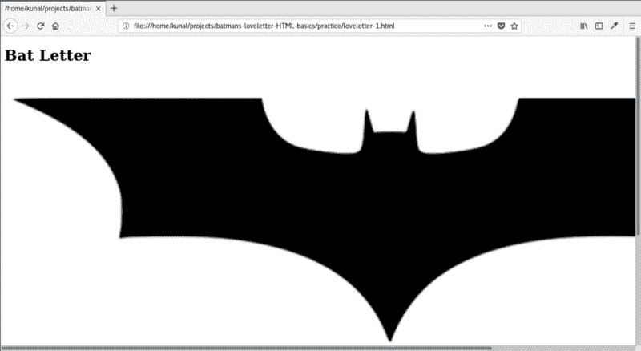**

**该死的。刚刚发生了什么？**

**当您使用 img 标签包含图像时，默认情况下，图像将以其原始分辨率显示。在我们的例子中，图像比 550 像素宽得多。让我们使用样式属性来定义它的宽度:**

```
`<div style="width:550px;">
  <h1>Bat Letter</h1>
  
  <p>
    After all the battles we faught together, after all the difficult times we saw together, after all the good and bad moments we've been through, I think it's time I let you know how I feel about you.
  </p>

<h2>You are the light of my life</h2>
  <p>
    You complete my darkness with your light. I love:
  </p>
  <ul>
    <li>the way you see good in the worse</li>
    <li>the way you handle emotionally difficult situations</li>
    <li>the way you look at Justice</li>
  </ul>
  <p>
    I have learned a lot from you. You have occupied a special place in my heart over the time.
  </p>
</div>`
```

**你会注意到，这次我们用“%”而不是“px”来定义宽度。当我们用“%”定义宽度时，它将占据父元素宽度的%。所以，550px 的 100%会给我们 550px。**

**保存并刷新以查看结果。**

**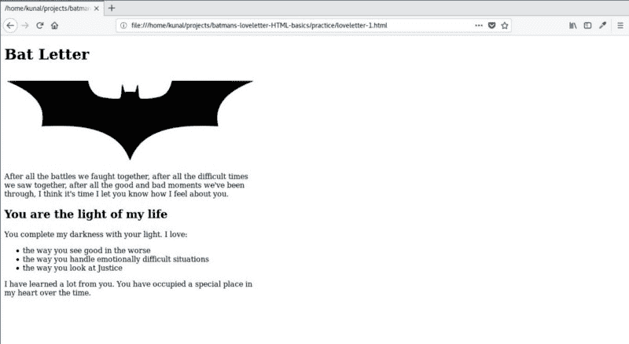**

**太棒了。这给蝙蝠侠的脸上带来了胆怯的笑容:)**

### **HTML 中的粗体和斜体**

**现在蝙蝠侠要在最后几段表白了。他让你用 HTML 写下这段文字:**

**“我要坦白一件事**

**感觉我的胸部*有心脏*没有。你让我心跳。你的微笑带给我脸上的微笑，你的痛苦带给我心里的痛苦。**

**我不表露自己的情绪，但我觉得面具后面的这个男人是为你而倾倒的。"**

**当你读到这封信时，你问蝙蝠侠，“等等，这是给谁的？”蝙蝠侠回答道:**

**“是为了超人。”**

**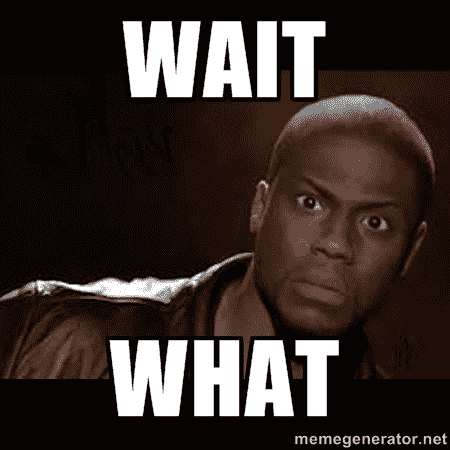**

**你:哦！我本来想猜神奇女侠。**

**蝙蝠侠:不，是 Sups，请在最后写上“我爱你超人”。**

**好吧，那我们就这么做吧:**

```
`<div style="width:550px;">
  <h1>Bat Letter</h1>
  
  <p>
    After all the battles we faught together, after all the difficult times we saw together, after all the good and bad moments we've been through, I think it's time I let you know how I feel about you.
  </p>

<h2>You are the light of my life</h2>
  <p>
    You complete my darkness with your light. I love:
  </p>
  <ul>
    <li>the way you see good in the worse</li>
    <li>the way you handle emotionally difficult situations</li>
    <li>the way you look at Justice</li>
  </ul>
  <p>
    I have learned a lot from you. You have occupied a special place in my heart over the time.
  </p>
  <h2>I have a confession to make</h2>
  <p>
    It feels like my chest does have a heart. You make my heart beat. Your smile brings smile on my face, your pain brings pain to my heart.
  </p>
  <p>
    I don't show my emotions, but I think this man behind the mask is falling for you.
  </p>
  <p>I love you Superman.</p>
  <p>
    Your not-so-secret-lover, <br>
    Batman
  </p>
</div>`
```

**信快写完了，蝙蝠侠只想要两处修改。蝙蝠侠希望告白段落第一句话里的“does”是斜体，“我爱你超人”这句话是粗体。**

**我们使用`<em>`和`<strong>`以斜体和粗体显示文本。让我们更新这些变化:**

```
`<div style="width:550px;">
  <h1>Bat Letter</h1>
  
  <p>
    After all the battles we faught together, after all the difficult times we saw together, after all the good and bad moments we've been through, I think it's time I let you know how I feel about you.
  </p>

  <h2>You are the light of my life</h2>
  <p>
    You complete my darkness with your light. I love:
  </p>
  <ul>
    <li>the way you see good in the worse</li>
    <li>the way you handle emotionally difficult situations</li>
    <li>the way you look at Justice</li>
  </ul>
  <p>
    I have learned a lot from you. You have occupied a special place in my heart over the time.
  </p>
  <h2>I have a confession to make</h2>
  <p>
    It feels like my chest <em>does</em> have a heart. You make my heart beat. Your smile brings smile on my face, your pain brings pain to my heart.
  </p>
  <p>
    I don't show my emotions, but I think this man behind the mask is falling for you.
  </p>
  <p><strong>I love you Superman.</strong></p>
  <p>
    Your not-so-secret-lover, <br>
    Batman
  </p>
</div>`
```

**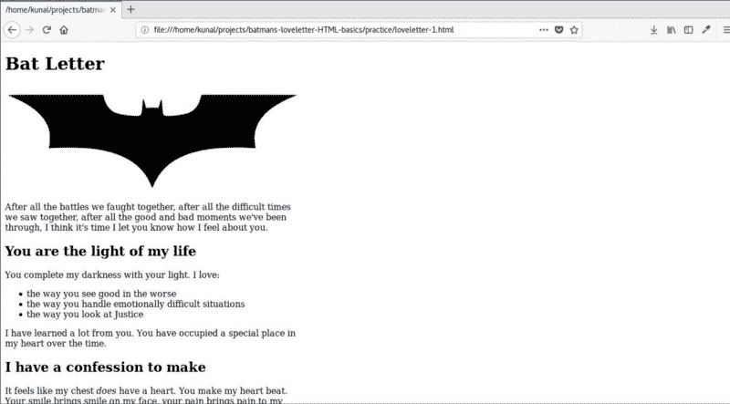**

### **HTML 中的样式**

**有三种方法可以设计或定义 HTML 元素的外观:**

*   **内联样式:我们使用元素的“style”属性来编写样式。这是我们到目前为止所做的。这不是一个好的做法。**
*   **嵌入式样式:我们在一个由包装的“style”元素中编写所有的样式。**
*   **链接样式表:我们用。css 扩展。这个文件叫做样式表。**

**让我们看看到目前为止我们是如何定义“div”的内联样式的:**

```
`<div style="width:550px;">`
```

**我们可以像这样在`<style>`和`</style>`中编写相同的样式:**

```
`div{
  width:550px;
}`
```

**在嵌入式样式中，我们编写的样式与元素是分开的。所以我们需要一种方法来联系元素和它的风格。第一个单词“div”就是这样做的。它让浏览器知道花括号`{…}`中的样式属于“div”元素。因为这个短语决定了对哪个元素应用样式，所以它被称为选择器。**

**我们编写样式的方式保持不变:属性(宽度)和值(550px)由冒号(:)分隔，以分号(；).**

**让我们从“div”和“img”元素中移除内联样式，并将其写入到`<style>`元素中:**

```
`<style>
  div{
    width:550px;
  }
  img{
    width:100%;
  }
</style>

<div>
  <h1>Bat Letter</h1>
  
  <p>
    After all the battles we faught together, after all the difficult times we saw together, after all the good and bad moments we've been through, I think it's time I let you know how I feel about you.
  </p>

  <h2>You are the light of my life</h2>
  <p>
    You complete my darkness with your light. I love:
  </p>
  <ul>
    <li>the way you see good in the worse</li>
    <li>the way you handle emotionally difficult situations</li>
    <li>the way you look at Justice</li>
  </ul>
  <p>
    I have learned a lot from you. You have occupied a special place in my heart over the time.
  </p>
  <h2>I have a confession to make</h2>
  <p>
    It feels like my chest <em>does</em> have a heart. You make my heart beat. Your smile brings smile on my face, your pain brings pain to my heart.
  </p>
  <p>
    I don't show my emotions, but I think this man behind the mask is falling for you.
  </p>
  <p><strong>I love you Superman.</strong></p>
  <p>
    Your not-so-secret-lover, <br>
    Batman
  </p>
</div>`
```

**保存并刷新，结果应该保持不变。**

**但是有一个大问题——如果我们的 HTML 文件中有不止一个“div”和“img”元素怎么办？我们在“style”元素中为 div 和 img 定义的样式将应用于页面上的每个 div 和 img。**

**如果您将来在代码中添加另一个 div，那么该 div 也将变成 550px 宽。我们不想那样。**

**我们希望将我们的样式应用到我们现在正在使用的特定 div 和 img。为此，我们需要为 div 和 img 元素提供惟一的 id。下面是如何使用元素的“id”属性为元素提供 id:**

```
`<div id="letter-container">`
```

**下面是如何在我们的嵌入式风格中使用这个 id 作为选择器:**

```
`#letter-container{
  ...
}`
```

**请注意“#”符号。它表示它是一个 id，并且{…}中的样式应该只应用于具有该特定 id 的元素。**

**让我们将此应用到我们的代码中:**

```
`<style>
  #letter-container{
    width:550px;
  }
  #header-bat-logo{
    width:100%;
  }
</style>

<div id="letter-container">
  <h1>Bat Letter</h1>
  
  <p>
    After all the battles we faught together, after all the difficult times we saw together, after all the good and bad moments we've been through, I think it's time I let you know how I feel about you.
  </p>

  <h2>You are the light of my life</h2>
  <p>
    You complete my darkness with your light. I love:
  </p>
  <ul>
    <li>the way you see good in the worse</li>
    <li>the way you handle emotionally difficult situations</li>
    <li>the way you look at Justice</li>
  </ul>
  <p>
    I have learned a lot from you. You have occupied a special place in my heart over the time.
  </p>
  <h2>I have a confession to make</h2>
  <p>
    It feels like my chest <em>does</em> have a heart. You make my heart beat. Your smile brings smile on my face, your pain brings pain to my heart.
  </p>
  <p>
    I don't show my emotions, but I think this man behind the mask is falling for you.
  </p>
  <p><strong>I love you Superman.</strong></p>
  <p>
    Your not-so-secret-lover, <br>
    Batman
  </p>
</div>`
```

**我们的 HTML 已经具备了嵌入式样式。**

**然而，你可以看到，随着我们包含更多的样式，会变得更大。这很快会使我们的主 html 文件变得混乱。所以让我们更进一步，通过将样式标签中的内容复制到一个新文件中来使用链接样式。**

**在项目根目录下创建一个新文件，并将其另存为 style.css:**

```
`#letter-container{
  width:550px;
}

#header-bat-logo{
  width:100%;
}`
```

**我们不需要在 CSS 文件中写`<style>`和`</style>`。**

**我们需要使用 html 文件中的`<link>`标签将新创建的 CSS 文件链接到 HTML 文件。我们可以这样做:**

```
`<link rel="stylesheet" type="text/css" href="style.css">`
```

**我们使用 link 元素在 HTML 文档中包含外部资源。它主要用于链接样式表。我们使用的三个属性是:**

*   **rel:关系。链接文件与文档的关系。包含的文件。css 扩展称为样式表，因此我们保留 rel="stylesheet "。**
*   **类型:链接文件的类型；它是 css 文件的“文本/css”。**
*   **href:超文本参考。链接文件的位置。**

**link 元素的末尾没有。所以，<link>也是一个自闭标签。**

```
`<link rel="gf" type="cute" href="girl.next.door">`
```

**要是找个女朋友这么容易就好了，:D**

**不，那是不可能的，我们继续吧。**

**以下是我们 loveletter.html 的内容:**

```
`<link rel="stylesheet" type="text/css" href="style.css">
<div id="letter-container">
  <h1>Bat Letter</h1>
  
  <p>
    After all the battles we faught together, after all the difficult times we saw together, after all the good and bad moments we've been through, I think it's time I let you know how I feel about you.
  </p>
  <h2>You are the light of my life</h2>
  <p>
    You complete my darkness with your light. I love:
  </p>
  <ul>
    <li>the way you see good in the worse</li>
    <li>the way you handle emotionally difficult situations</li>
    <li>the way you look at Justice</li>
  </ul>
  <p>
    I have learned a lot from you. You have occupied a special place in my heart over the time.
  </p>
  <h2>I have a confession to make</h2>
  <p>
    It feels like my chest <em>does</em> have a heart. You make my heart beat. Your smile brings smile on my face, your pain brings pain to my heart.
  </p>
  <p>
    I don't show my emotions, but I think this man behind the mask is falling for you.
  </p>
  <p><strong>I love you Superman.</strong></p>
  <p>
    Your not-so-secret-lover, <br>
    Batman
  </p>
</div>`
```

**和我们的 style.css:**

```
`#letter-container{
  width:550px;
}

#header-bat-logo{
  width:100%;
}`
```

**保存文件并刷新，浏览器中的输出应该保持不变。**

### **一些手续**

**我们的情书几乎已经准备好送给蝙蝠侠了，但是还剩下一些正式的部分。**

**像任何其他编程语言一样，HTML 自诞生之年(1990 年)以来也经历了许多版本。HTML 的当前版本是 HTML5。**

**那么，浏览器如何知道你用哪个版本的 HTML 来编码你的页面呢？要告诉浏览器你正在使用 HTML5，你需要在页面顶部包含`<!DOCTYPE html>`。对于旧版本的 HTML，这一行曾经是不同的，但你不需要学习，因为我们不再使用它们。**

**此外，在以前的 HTML 版本中，我们曾经将整个文档封装在`<html></html>`标签中。整个文件被分成两个主要部分:头，在`<head></head>`里面，和主体，在`<body></body>`里面。这在 HTML5 中并不是必需的，但是出于兼容性的原因，我们仍然这样做。让我们用`<Doctype>`、`<html>`、`<head>`和`<body>`来更新我们的代码:**

```
`<!DOCTYPE html>
<html>
<head>
  <link rel="stylesheet" type="text/css" href="style.css">
</head>
<body>
<div id="letter-container">
  <h1>Bat Letter</h1>
  
  <p>
    After all the battles we faught together, after all the difficult times we saw together, after all the good and bad moments we've been through, I think it's time I let you know how I feel about you.
  </p>
  <h2>You are the light of my life</h2>
  <p>
    You complete my darkness with your light. I love:
  </p>
  <ul>
    <li>the way you see good in the worse</li>
    <li>the way you handle emotionally difficult situations</li>
    <li>the way you look at Justice</li>
  </ul>
  <p>
    I have learned a lot from you. You have occupied a special place in my heart over the time.
  </p>
  <h2>I have a confession to make</h2>
  <p>
    It feels like my chest <em>does</em> have a heart. You make my heart beat. Your smile brings smile on my face, your pain brings pain to my heart.
  </p>
  <p>
    I don't show my emotions, but I think this man behind the mask is falling for you.
  </p>
  <p><strong>I love you Superman.</strong></p>
  <p>
    Your not-so-secret-lover, <br>
    Batman
  </p>
</div>
</body>
</html>`
```

**主要内容放在`<body>`中，元信息放在`<head>`中。所以我们将 div 保存在`<body>`中，并将样式表加载到`<head>`中。**

**保存并刷新，您的 HTML 页面应该和前面显示的一样。**

### **HTML 格式的标题**

**这是最后一个变化。我保证。**

**您可能已经注意到选项卡的标题显示了 HTML 文件的路径:**

**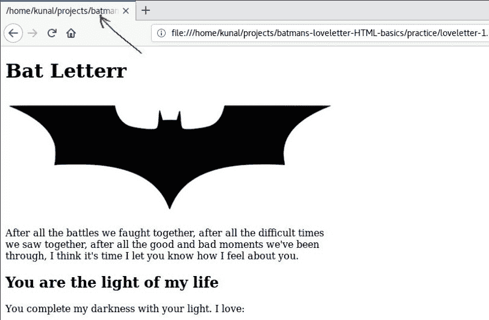**

**我们可以使用`<title>`标签为我们的 HTML 文件定义一个标题。title 标签也像 link 标签一样放在 head 里面。让我们把“蝙蝠信”放在标题里:**

```
`<!DOCTYPE html>
<html>
<head>
  <title>Bat Letter</title>
  <link rel="stylesheet" type="text/css" href="style.css">
</head>
<body>
<div id="letter-container">
  <h1>Bat Letter</h1>
  
  <p>
    After all the battles we faught together, after all the difficult times we saw together, after all the good and bad moments we've been through, I think it's time I let you know how I feel about you.
  </p>
  <h2>You are the light of my life</h2>
  <p>
    You complete my darkness with your light. I love:
  </p>
  <ul>
    <li>the way you see good in the worse</li>
    <li>the way you handle emotionally difficult situations</li>
    <li>the way you look at Justice</li>
  </ul>
  <p>
    I have learned a lot from you. You have occupied a special place in my heart over the time.
  </p>
  <h2>I have a confession to make</h2>
  <p>
    It feels like my chest <em>does</em> have a heart. You make my heart beat. Your smile brings smile on my face, your pain brings pain to my heart.
  </p>
  <p>
    I don't show my emotions, but I think this man behind the mask is falling for you.
  </p>
  <p><strong>I love you Superman.</strong></p>
  <p>
    Your not-so-secret-lover, <br>
    Batman
  </p>
</div>
</body>
</html>` 
```

**保存并刷新，你会看到选项卡上现在显示的不是文件路径，而是“Bat Letter”。**

**蝙蝠侠的情书现在完成了。**

**恭喜你！你用 HTML 做了蝙蝠侠的情书。**

****

### **我们学到了什么**

**我们学习了以下新概念:**

*   **HTML 文档的结构**
*   **如何在 HTML 中编写元素()**
*   **如何使用 style 属性在元素内部编写样式(这称为内联样式，尽可能避免)**
*   **如何在  中编写元素的样式(这称为嵌入式样式)**
*   **如何在一个单独的文件中编写样式，并使用<link>在 HTML 中链接到它(这称为链接样式表)**
*   **什么是标签名称、属性、开始标签和结束标签**
*   **如何使用 id 属性给元素一个 id**
*   **CSS 中的标签选择器和 id 选择器**

**我们学习了以下 HTML 标签:**

*   **:用于段落**

*   **:换行符**
*   **、*   :显示列表**
*   **:用于对我们信函中的元素进行分组**
*   # **、

    ## :标题和副标题** 

*   **:插入图像**
*   ****、*:用于粗体和斜体文本样式*****

*   <link>**:用于包含外部样式表**
*   **:包装整个 HTML 文档**
*   **让浏览器知道我们正在使用 HTML5**
*   **:包装元信息，如<link>和<title></li><li>:实际显示的 HTML 页面的主体</li><li><title>:HTML 页面的标题</title>**

**我们学习了以下 CSS 属性:**

*   **宽度:定义元素的宽度**
*   **CSS 单位:“px”和“%”**

**当天的朋友就到此为止，下期教程再见。**

**想通过有趣且吸引人的教程学习 Web 开发吗？**

**[**点击这里每周获取新的 Web 开发教程。**](http://supersarkar.com)**