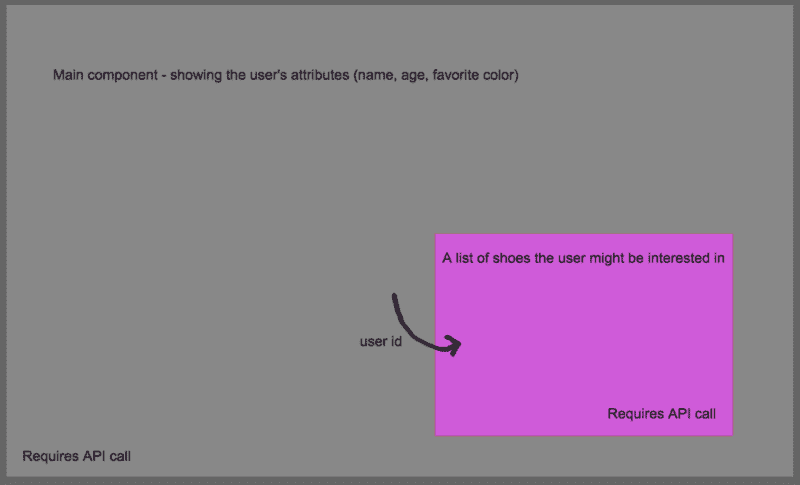

# 如何强制刷新 React 子组件:简单的方法

> 原文：<https://www.freecodecamp.org/news/force-refreshing-a-react-child-component-the-easy-way-6cdbb9e6d99c/>

**注意:从 React 16 开始，`componentWillReceiveProps()`被弃用，这意味着如果您在项目中使用该版本或更高版本，这对您来说不是好建议。**

在 React 世界中，强制重新渲染是不被允许的。当 React 察觉到对`state`或`props`的更改时，您应该让 DOM 自己处理。为了遵循这些模式，我们有时不得不做一些看起来有点傻的事情。考虑这个场景:



Silly simple example of a child component who manages their own state

我们有两个组成部分——父母和孩子。父进程调用 API 来获取`user`。由此，我们得到类似于`name`、`age`、`favorite color`的东西。我们还从我们的数据库中得到一个`id`。我们将把它传递给我们的子组件，子组件也将使用用户 id 进行 API 调用。太棒了——大量数据进入我们的应用程序。

假设我们在数据库中存储了一个鞋的列表。当用户改变他们的颜色偏好时，服务器将新数据写入用户的鞋列表。太好了！除此之外，我们在子组件中看不到新的鞋子列表。怎么回事？

**旁注**:当然我们应该只从用户的呼叫中获取鞋子——这只是一个简化的解释。

### 反应重新渲染基础

简而言之，React 将只更新 DOM 中发生变化的部分。在这种情况下，我们传递给鞋组件(`userId`)的`props`没有改变，所以我们的子组件没有任何变化。

当我们从 API 获取新信息时，用户的颜色偏好将会更新——假设我们在更新用户后对响应做了一些事情。

但是 React 认为没有理由更新鞋子列表，所以不会更新——即使在我们的服务器上，鞋子现在已经不同了。

### 起始代码

```
const UserShow extends Component {
  state = {
    user: {}
  }

  componentDidMount() {
    this.fetchUser().then(this.refreshUser)
  }

  setNewColor = color => {
    this.updateUser({color}).then(this.refreshUser)
  }

  refreshUser = res => this.setState({user: res.data.user})

  render() {
    const { user } = this.state;

    return (
      <div>
        User name: {user.name}
        Pick color: 
        <div>
          {colors.map(color => 
            <div className={color} 
                 onClick={() => this.setNewColor(color)} />)}
          )}
        </div>
        <ShoeList id={user.id} />
      </div>
    )
  }
}
```

我们的`ShoeList`只是一个鞋的列表，我们将使用用户的 id 从服务器获取它:

```
const ShoeList extends Component {
  state = {
    shoes: []
  }

  componentDidMount() {
    this.fetchShoes(this.props.id)
        .then(this.refreshShoeList)
  }

  refreshShoeList = res => this.setState({ shoes: res.data.shoes })

  render() {
    // some list of shoes
  }
}
```

如果我们希望鞋组件获取新的鞋列表，我们需要更新发送给它的道具。否则它将认为没有必要刷新。

事实上，这样写的话，`ShoeList`永远不会刷新，因为我们不依赖道具来渲染。让我们解决这个问题。

### 触发子组件重新呈现

为了强制子组件重新呈现——并进行新的 API 调用——我们需要传递一个属性，如果用户的颜色偏好发生变化，该属性也会发生变化。

为此，我们将在`setNewColor`中添加一个方法:

```
[...]

setNewColor = color => {
  this.updateUser({color}).then(res => {
    this.refreshUser(res);
    this.refreshShoeList();
  })
}

refreshShoeList = () => 
  this.setState({refreshShoeList: !this.state.refreshShoeList})

[...]

<ShoeList id={user.id} refresh={refreshShoeList}
```

这是一个我们可以扳动的简单开关。我尽可能地保持简单，但是在制作中，我们希望确保我们设置的颜色不同于我们之前的颜色。否则就没什么可更新的了。

现在在`ShoeList`:

```
componentWillReceiveProps(props) {
  const { refresh, id } = this.props;
  if (props.refresh !== refresh) {
    this.fetchShoes(id)
      .then(this.refreshShoeList)
  }
}
```

如果你只传递`refreshShoeList`，然后基于那个布尔值进行切换，那么组件将会永远更新。

我们需要确保开关只翻转了一次——所以我们只需检查进来的道具是否与我们之前的道具不同。如果它们不同，我们将进行新的 API 调用来获取新的鞋子列表。

嘣—我们的子组件被“强制”更新。

#### componentWillReceiveProps

值得再花一分钟来回顾一下最后一段代码中发生了什么。在`componentWillReceiveProps`中，我们有唯一的机会观看新道具，并与之前的道具进行比较。

在这里我们可以检测到变化(就像在`refresh`中一样)，我们也可以检查新的道具(例如，注意`refresh`最初是`undefined`)。

这个 React 方法是操纵和检查`props`的一种非常强大的方式。