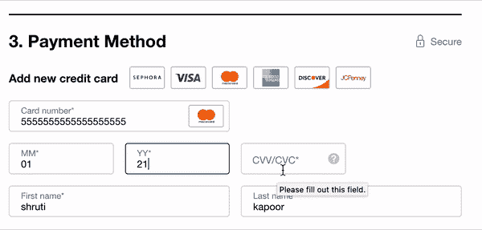
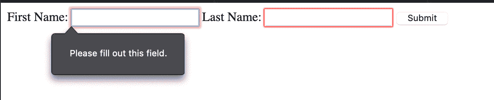

# 数据验证——如何用示例 JavaScript 代码检查 HTML 表单上的用户输入

> 原文：<https://www.freecodecamp.org/news/form-validation-with-html5-and-javascript/>

表单在 web 应用程序中无处不在。一些应用程序使用表格收集数据来注册用户并提供电子邮件地址。其他人使用它们来完成在线交易，以促进购物体验。

您可能使用一些 web 表单来申请新的汽车贷款，而您将使用其他表单来预订晚餐的披萨。因此，从这些表单中收集的数据必须是干净的、格式正确的，并且没有任何恶意代码，这一点很重要。这个过程称为表单验证。

我们在接受用户输入的任何时候都需要表单验证。我们必须确保输入的数据格式正确，位于有效的数据范围内(例如日期字段)，并且不包含可能导致 SQL 注入的恶意代码。格式错误或缺失的数据也会导致 API 抛出错误。

## 表单验证有哪些不同的类型？

表单验证可以发生在客户端和服务器端。

客户端验证使用 HTML5 属性和客户端 JavaScript 进行。

您可能已经注意到，在某些表单中，只要您输入一个无效的电子邮件地址，表单就会给出一个错误“请输入一个有效的电子邮件”。这种即时类型的验证通常是通过客户端 JavaScript 完成的。



在其他情况下，您可能已经注意到，当您填写表单并输入信用卡等详细信息时，它可能会显示加载屏幕，然后显示错误“此信用卡无效”。

这里，表单调用了它的服务器端代码，并在执行额外的信用卡检查后返回了一个验证错误。进行服务器端调用的这种验证情况称为服务器端验证。

## 应该验证哪些数据？

每当您接受来自用户的数据时，都需要进行表单验证。这可能包括:

1.  验证电子邮件地址、电话号码、邮政编码、姓名和密码等字段的格式。
2.  验证必填字段
3.  检查数据的类型，例如字符串和数字，例如社会保险号。
4.  确保输入的值是有效值，如国家、日期等。

## 如何设置客户端验证

在客户端，可以通过两种方式进行验证:

1.  使用 HTML5 功能
2.  使用 JavaScript

### 如何使用 HTML5 功能设置验证

HTML5 提供了一系列属性来帮助验证数据。以下是一些常见的验证案例:

*   使用`required`制作必填字段
*   约束数据长度:
    *   `minlength`、`maxlength`:文本数据
    *   数字类型最大值的`min`和`max`
*   使用`type`限制数据类型:
    *   `<input type="email" name="multiple>`
*   使用`pattern`指定数据模式:
    *   指定输入的表单数据需要匹配的正则表达式模式

当输入值与上面的 HTML5 验证匹配时，它被赋予一个伪类`:valid`，如果不匹配，则被赋予`:invalid`。

让我们试一个例子:

```
<form>
<label for="firstname"> First Name: </label>
<input type="text" name="firstname" id="firstname" required maxlength="45">
<label for="lastname"> Last Name: </label>
<input type="text" name="lastname" id="lastname" required maxlength="45">
<button>Submit</button>
</form> 
```



[链接到 js dild](https://jsfiddle.net/58xc2qyj/)

这里我们有两个必填字段——名和姓。在 JSFidle 中试试这个例子。如果您跳过这两个字段中的任何一个并按提交，您将得到一条消息，“请填写这个字段”。这是使用内置 HTML5 的验证。

### 如何使用 JavaScript 设置验证

当实现表单验证时，有一些事情需要考虑:

1.  什么被定义为“有效”数据？这有助于回答有关格式、长度、必填字段和数据类型的问题。
2.  输入无效数据会怎样？这将帮助您定义验证的用户体验——是在表单内还是在表单顶部显示错误消息，错误消息应该有多详细，表单是否应该提交，是否应该有分析来跟踪无效的数据格式？诸如此类。

您可以通过两种方式执行 JavaScript 验证:

1.  使用 JavaScript 的内联验证
2.  HTML5 约束验证 API

#### 使用 JavaScript 的内联验证

```
<form id="form">
  <label for="firstname"> First Name* </label>
  <input type="text" name="firstname" id="firstname" />
  <button id="submit">Submit</button>

  <span role="alert" id="nameError" aria-hidden="true">
    Please enter First Name
  </span>
</form> 
```

```
const submit = document.getElementById("submit");

submit.addEventListener("click", validate);

function validate(e) {
  e.preventDefault();

  const firstNameField = document.getElementById("firstname");
  let valid = true;

  if (!firstNameField.value) {
    const nameError = document.getElementById("nameError");
    nameError.classList.add("visible");
    firstNameField.classList.add("invalid");
    nameError.setAttribute("aria-hidden", false);
    nameError.setAttribute("aria-invalid", true);
  }
  return valid;
} 
```

```
#nameError {
  display: none;
  font-size: 0.8em;
}

#nameError.visible {
  display: block;
}

input.invalid {
  border-color: red;
} 
```

[链接到 js dild](https://jsfiddle.net/0tq3e49w/4/)

在本例中，我们使用 JavaScript 检查必填字段。如果必填字段不存在，我们使用 CSS 来显示错误消息。

Aria 标签被相应地修改以发出错误信号。通过使用 CSS 来显示/隐藏错误，我们减少了需要进行的 DOM 操作的数量。在上下文中提供错误消息，从而使用户体验直观。

#### HTML5 约束验证 API

HTML 属性`required`和`pattern`可以帮助执行基本的验证。但是如果您想要更复杂的验证或者想要提供详细的错误消息，您可以使用约束验证 API。

该 API 提供的一些方法有:

1.  `checkValidity`
2.  `setCustomValidity`
3.  `reportValidity`

以下属性很有用:

1.  `validity`
2.  `validationMessage`
3.  `willValidate`

在本例中，我们将使用 HTML5 内置的方法(如`required`和`length`)结合约束验证 API 进行验证，以提供详细的错误消息。

```
<form>
<label for="firstname"> First Name: </label>
<input type="text" name="firstname" required id="firstname">
<button>Submit</button>
</form> 
```

```
const nameField = document.querySelector("input");

nameField.addEventListener("input", () => {
  nameField.setCustomValidity("");
  nameField.checkValidity();
  console.log(nameField.checkValidity());
});

nameField.addEventListener("invalid", () => {
  nameField.setCustomValidity("Please fill in your First Name.");
}); 
```

[链接到 js dild](https://jsfiddle.net/xz2wjLck/1/)

## 不要忘记服务器端验证

客户端验证不是您应该做的唯一验证检查。您还必须在服务器端代码上验证从客户端接收的数据，以确保数据与您预期的相符。

您还可以使用服务器端验证来执行不应该存在于客户端的业务逻辑验证。

## 表单验证最佳实践

1.  始终进行服务器端验证，因为恶意行为者可以绕过客户端验证。
2.  提供与产生错误的字段相关的详细错误消息。
3.  提供一个在出现错误消息时数据应该是什么样子的示例，例如-“电子邮件与格式不符-[test@example.com](mailto:test@example.com)
4.  避免使用涉及重定向的单个错误页。这是糟糕的用户体验，迫使用户返回到上一页来修改表单并丢失上下文。
5.  始终标记必填字段。

### 对更多类似的教程和文章感兴趣吗？注册订阅我的时事通讯。或[在推特上关注我](https://twitter.com/shrutikapoor08)