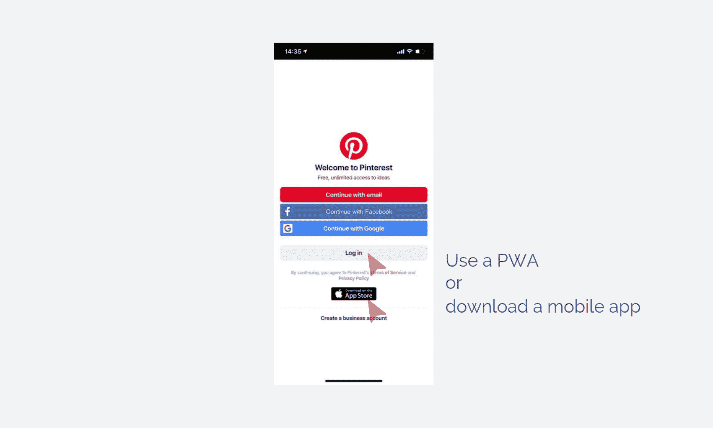
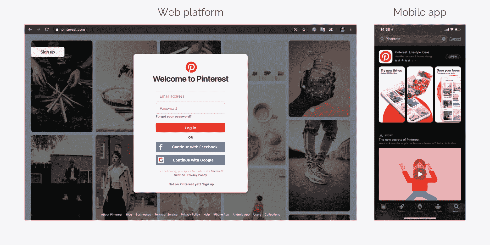
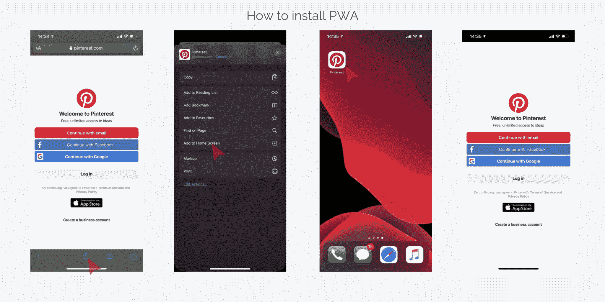
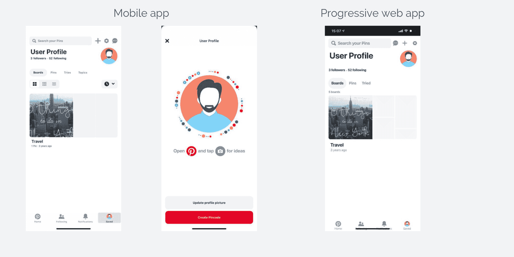

# 你真的需要 PWA 吗？这里有四个问题可以帮助你做出决定。

> 原文：<https://www.freecodecamp.org/news/four-questions-to-understand-if-you-need-pwa/>

## 你为什么需要 PWA 是毫无疑问的。让我们看看为什么你可能不需要它

在我的上两篇文章之后，我的收件箱里已经塞满了关于 PWAs 的问题。

我的“[渐进式 web 应用程序开发实用技巧](https://www.freecodecamp.org/news/practical-tips-on-progressive-web-app-development/)”分享了 PWA 技术的实际优势，我的“[渐进式 Web 应用程序与原生的](https://keenethics.com/blog/progressive-web-apps-vs-native-which-to-choose-and-when)”进一步坚定了许多人的信念，即渐进式 Web 应用程序正是他们所需要的。

我非常高兴我成功地让他们相信 pwa 是网络应用的未来。我支持 PWA 技术，认为这是软件开发行业未来应该走的一条路。但是渐进式网络应用不是万灵药，也不是万能的解决方案。

既然我已经解释了**PWA 是什么意思** 和 **为什么你需要* a *PWA** ，今天，我将完成这项工作并展示 **为什么你可能不需要* a *PWA** 。

在使用和不使用 PWA 之间做出选择比您想象的要容易。只要回答四个简单的问题，你自己就会看到正确的道路。

## 1.有没有现成的开发？

渐进式 web 应用程序开发的速度和简单性是 PWAs 的主要优势之一。然而，这种优势可能会被一个事实所抵消，即你已经有了一些现成的移动应用程序开发。

将现成的移动应用程序转换为渐进式的网络应用程序不是简单的几次点击就能完成的。相反，必须从头开始开发一个渐进式的 web 应用程序。如果你已经走过了 native app 开发漫长而复杂的过程，为什么还要把它扔出去，从头开始一切？

当然，你的手机应用可能已经过时或者效率低下。在这种情况下，你必须选择是否在移动应用开发公司的帮助下恢复它，或者使用 PWA 技术构建一个全新的应用。

例如，[Pinterest](https://www.pinterest.ca/)——实施 PWA 的公司中最聪明的例子之一——决定选择这两个选项。他们开发了一个渐进式网络应用程序，但也没有忘记传统的移动应用程序。

***关键思想**:如果你没有现成的开发，PWA 方法是一个很好的解决方案。如果你已经有了一个原生的或者跨平台的移动版本的应用程序，那么完成这些将会比从头开始构建一个新的应用程序更容易和更有效率。*

## 2.你打算只专注于移动设备吗？

PWA 功能的理念是改善用户从移动设备访问网页的体验。在引入 PWA 技术之前，希望同时瞄准 web 和移动设备的企业有两种选择:

*   使网页适应移动设备
*   从头开始开发移动应用程序

从用户的角度来看，第一种选择是笨拙和不方便的。从企业的角度来看，第二种选择是消耗资源的。

PWAs 的进步带来了中庸之道:方便用户，提高业务效率。如果你不打算进入网络或桌面利基市场，而是选择只专注于移动应用，就没有必要建立 PWA。

当然，在开发渐进式网络应用程序时，你会赢，因为你正在为 Android 和 iOS 开发一个应用程序。然而，这正是你使用 Ionic、Cordova 或 React Native 进行跨平台开发所能实现的。

与此同时，Pinterest 开发了一个渐进式网络应用程序，以增强他们现有的网络平台和移动应用程序。

***关键理念** : PWAs 最适合同时面向 web 和移动平台的业务。如果你选择只关注其中的一个，就没有理由选择渐进式 web 应用程序开发。*

## 3.你是否不愿意让你的用户通过网络浏览器访问应用程序？

移动应用和渐进式网络应用之间的另一个本质区别在于，前者是从商店下载的，而后者是通过共享链接或直接从网站下载的，如下图所示。

口味不同。如果你认为与 App Store 或 Google Play 合作比在 Google 上对抗 SEO 竞争或激发用户分享你的链接更容易，你应该放心选择移动应用开发。

如果你认为与谷歌搜索结果相比，更难出现在商店的顶级搜索结果中，请使用 PWA。此外，如果你的网站已经有足够多的忠实用户，渐进式网络应用程序将最适合你。

* * *

***关键思想**:如果你希望你的用户通过 app store 或 Google Play 访问应用程序，而不是通过浏览器，或者如果 App Store 优化(ASO)听起来比搜索引擎优化(SEO)简单，你应该选择移动应用程序。*

## 4.您需要高级移动设备功能吗？

虽然 PWAs 可以使用地理定位，但许多高级移动设备功能仍然超出了它们的能力范围。渐进式网络应用程序不支持接近传感器、高级相机控制、音频或视频录制、指纹扫描、NFC，甚至蓝牙。

向您的开发团队询问他们无法实现的特性的 PWA 清单。如果你离不开这些特性中的至少一个，你应该选择移动开发。

例如，Pinterest 的渐进式网络应用程序没有拍照功能，而这一功能在他们的移动应用程序中是存在的。

***关键思想**:与原生设备特性不兼容会阻碍你开发 PWA。虽然这个问题可能会在未来得到解决，但就目前而言，你应该使用移动应用程序。*

## 总结

在申请 PWA 之前，你需要决定你是否真的需要 PWA 方法。首先回答四个简单的问题:

1.  有没有现成的开发，比如原生手机 app？
2.  你想只关注移动设备吗？没有桌面或网络平台？
3.  你是否不愿意让你的用户通过网络浏览器访问应用程序？
4.  您是否需要高级移动设备功能？你打算使用指纹扫描、NFC 还是蓝牙？

如果你对大多数关于渐进式网络应用的问题回答“是”，那么，很可能，你不需要渐进式网络应用。一个手机 app 就能完全覆盖你的所有需求。

## 你对 PWA 有什么想法吗？

我的公司 KeenEthics 是一家经验丰富的[渐进式网络应用开发公司](https://keenethics.com/tech-apps-progressive-web-apps)。如果您需要以下服务，请随时联系****。****

你可以在 KeenEthics 博客上阅读更多我的文章:[四个问题了解是否需要 PWA](https://keenethics.com/blog/four-questions-to-understand-if-you-need-pwa) 。

## **附言**

另外，我想对 [Tetiana Matviiok](https://www.linkedin.com/in/tania-matviiok-222b9b16a/) 帮我编辑这篇文章说声“谢谢”。

发布在 KeenEthics 博客上的原始文章可以在这里找到:[渐进式网络应用 vs 原生:选择哪个，何时选择？](https://keenethics.com/blog/progressive-web-apps-vs-native-which-to-choose-and-when)。