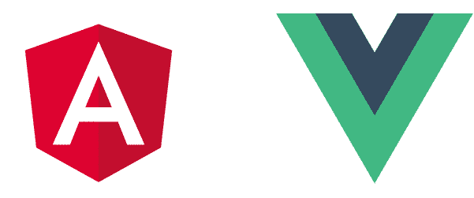
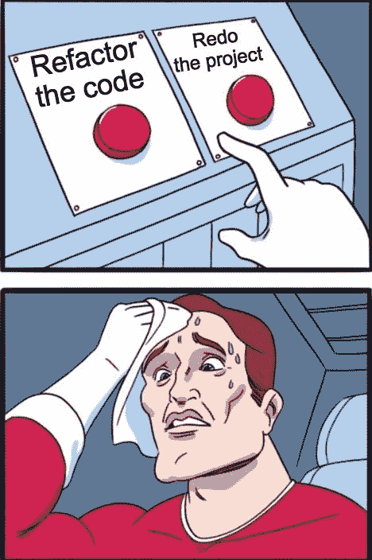
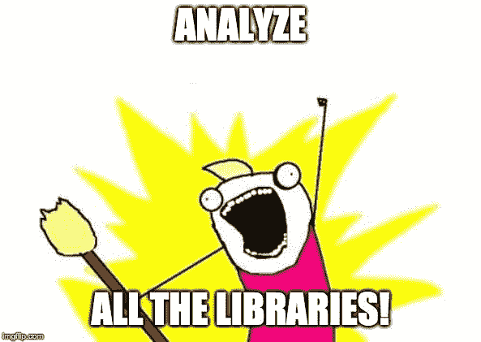

# 框架和库有什么区别？

> 原文：<https://www.freecodecamp.org/news/frameworks-vs-libraries/>

买房，还是谨慎自建。

框架和库有什么区别？我在工作和聚会中与开发人员进行过这样的讨论，核心思想可以归结为这一点。

> 你告诉库做什么，框架告诉你做什么。

## 框架结构

一般来说，框架告诉你该做什么。它有一种“正确的”做事方式，并提供工具来支持你。

两个完美的例子是[角度](https://angular.io)和 [Vue](https://vuejs.org) 。

### 所有的工具都在这里

这些是由专门的团队创建的框架，并附带了构建大规模应用程序所需的一切。

*   成分
*   基本状态管理
*   指令
*   处理表单
*   按指定路线发送
*   超文本传送协议
*   测试
*   更多(UI 库，动画等。)

### 官方风格指南

然后，各个团队提供官方的风格指南，描述他们框架的最佳实践。一旦你知道你马上就有效率了。

### 简化入职流程

如果你相信这种结构并希望投资，那么框架对你的项目来说是完美的。培训新队友也变得更加容易，因为他们只需要学习一个核心工具。

### 清除升级路径

最重要的是，你的升级路径非常清晰。只要遵循团队的发布时间表，阅读他们的突破性变化，并在您准备好的时候进行升级。

## 框架缺点

这只是我的经验之谈。我肯定我错过了什么。

### 性能下降(某种程度上)

一个框架必然由大量代码组成。更多的代码意味着更长的下载时间和降低的性能。

然而，随着[框架成为编译器](https://tomdale.net/2017/09/compilers-are-the-new-frameworks/)，我怀疑这将不再是一个问题。

### 小应用不需要它

一个可伸缩的架构必须解决我们上面讨论的许多问题。一些应用程序非常简单，以至于使用整个框架会使事情变得更加复杂。你最终会得到一大堆没有回报的样板文件。

### 违背框架可能很困难

在我大学毕业后的第一份工作中，我们试图在 Angular 意识之外编译一些内容。结果并不漂亮，但经过一些尝试和错误，我们完成了工作。

虽然我听说 Vue 允许你在现有的应用中逐步采用它。这听起来很有希望！

### 要学的东西很多

然而，这一点适用于任何架构。无论你使用什么工具，学习所有这些都需要时间。要么是一个大工具，要么是许多小工具。

### 你太舒服了

这适用于生活中的任何事情——有时我们太习惯于以特定的方式做事。这完全取决于你的职业目标。也许这个工具可以帮助你保持一份稳定的工作或者运行一个高效的业务构建应用程序。如果那是你想要的，那就继续做吧！

但是如果你像我们中的许多人一样，每天都使用相同的技术会变得有点过时。尝试其他框架和库是保持技能敏锐的关键。

## 库升级

与框架相反，库是为单一目的而构建的工具。

*   [反应](https://reactjs.org)创建用户界面
*   Redux 提供状态管理
*   JQuery 提供了跨浏览器的 DOM 操作

这样的例子不胜枚举。让我们放大反应。它是做什么的？

> 一个用于构建用户界面的 JavaScript 库- [官方 React 网站](https://reactjs.org)

### 单焦点

这就是它所做的一切。他们的指南会告诉你如何使用 React，主要就是这些。该团队没有正式指定全局状态管理、路由、HTTP、服务或表单的库。

这就是他们的设计选择！这是一个很好的职位，取决于你在寻找什么。

### 你在控制中

图书馆完全在你的掌控之中。你决定如何使用它，在投入一些时间去学习它之后，你就一帆风顺了。

### 仅添加您需要的内容

如果您的应用程序很小，一个库就足够了！没必要把事情复杂化。随着应用程序的发展，你可以混合搭配库来构建你自己的架构。这是一次很棒的学习经历！

### 学习许多不同的工具

说到这里，使用许多不同的库会让你的 JavaScript 技能变得更好更敏锐。您将一直阅读文档，尝试新事物，并扩展您的技术视野。

尽管它并不完美...

## 图书馆的缺点

### 定制架构会毁了你的应用

定制架构开始时很有趣，但将来可能会非常昂贵。如果你是第一次建造，我建议你要非常小心。

一个好的架构可以提高开发人员的工作效率，并最小化添加、修改和删除代码的痛苦。

一个糟糕的建筑会导致恐惧和痛苦。

人们选择 Angular 和 Vue 是因为他们不想冒险花费时间和金钱来建立自己的规则。他们只是学习框架的规则，并专注于游戏。

而在 React 世界中，任何两个大规模应用程序的结构都会有所不同。这完全取决于团队认为什么是最好的。

### 瘫痪分析

有时候选择太多是件坏事，我们会被可怕的[分析瘫痪](https://en.wikipedia.org/wiki/Analysis_paralysis)所打击。我们没有选择一个库并继续前进，而是花了无数的时间比较不同的库，这些库做着几乎相同的事情。

### 还有很多要学

不管是不是框架，一个大的应用程序仍然需要时间去理解。这也是为什么强架构很重要的另一个原因，因为它会减缓学习曲线。

### 潜在的紧张升级路径

如果每次升级后我的`package.json`中的两个库不兼容时我都得到报酬，我就会退休。说够了。

## 想要免费辅导？

如果你想安排一个免费电话来讨论前端开发代码、面试、职业或其他任何事情[请在 Twitter 上关注我，并给我发短信](https://twitter.com/yazeedBee)。

之后，如果你喜欢我们的第一次会议，我们可以讨论持续辅导，以帮助你达到你的前端发展目标！

## 感谢阅读

更多类似的内容，请查看[https://yazeedb.com！](https://yazeedb.com)

下次见！