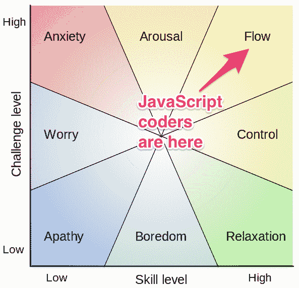

# 自由代码营现在有了一首官方主题曲

> 原文：<https://www.freecodecamp.org/news/free-code-camp-now-has-an-official-theme-song-97765270d2bd/>

我们的 Twitch.tv 频道有一个虚拟点唱机。当你在那里观看我们的代码时，你可以在 Youtube 上点播几乎任何歌曲，它将被排队并作为背景音乐在我们的流上播放。

尽管有数以百万计的歌曲，但有一首歌似乎一次又一次地出现。这首英文歌曲是 6 个月前由一位名叫 Patrick Hund 的德国软件开发人员低调发布的。听一听:

对于那些手边没有耳机的人(或者有立即停止它的冲动)，我已经将完整的歌词转录为“JavaScript 编码器”:

**与产品负责人的会议终于结束了**
**我花了大部分时间在 Twitter 上浏览关于最新库和框架的新闻。**
**现在我回到了办公桌前**
**我戴上了耳机**
**现在终端输入提示符听从我的命令**
**我从 Github 原点做了一个追赶合并**
**打了个呼噜看着等待我做手头的任务**

**合唱:**
**我是个 Javascript**
**给我骨干牵线木偶**
**我该去找 Angular 还是 Ember.js？**
**淘汰赛，react 还是 Vue？**

**制作单页 web app**
**这个星球上最棒的东西**
**万维网上有一个奇妙的世界**
**这么多可以尝试的东西，而时间却这么少**
**Scrum master 不要烦我**
**我需要一步一步地弄明白这一点 Underscore.js，Gulp，React.js，Angular.js，Ember.js，Grunt，Web Components，Lo-dash，Express.js，jQuery**

**我只是一个有两个女儿和一个妻子的中年人**
**我全心全意地心疼他们**
**我是一个普通的居家男人**
**但是当我打开 Macbook Pro， 这是一种不同的生活**

**(合唱)**

**我是一名 JavaScript 程序员**
**我活在梦里**
**我用我的代码**
**构建世界，我为我的团队做这件事**

“JavaScript 程序员”可能不会赢 作者是“一个中年人，有两个女儿和一个妻子”，从事软件开发。

类似地，大多数自由代码营的受训开发人员都超过了 30 岁，而且他们中的许多人都有孩子。如果他们还没有在会议中和戴着耳机坐在办公桌前度过他们的工作日，他们很快就会了。

“JavaScript 编码器”的中心冲突是遍布 JavaScript 世界的一系列工具困境。JavaScript 最近成为最流行的语言，并且正在经历前所未有的“库和框架”的寒武纪大爆发。"给我大口喝还是咕哝？"以及“我应该选 Angular 还是 Ember.js？”是常见的工具问题。与这些工具保持同步是一项严肃的工作，因此作者的 Twitter 研究悄悄进入了他的会议时间。

“JavaScript 编码器”也谈到了敏捷开发工作流程的支柱。他工作的办公室使用最流行的敏捷方法 Scrum。他每天都与产品负责人和 Scrum 主管开会。要了解 Scrum 如何工作的更多细节，请观看这段 15 分钟的精彩视频:

最重要的是，“JavaScript 编码者”传达了 JavaScript 编码者对他们工作的热情。像“当我打开我的 Macbook Pro 时，这是一种不同的生活”和“我用我的代码构建世界/我为我的团队这样做”这样的话反映了当今 web 开发人员的建设性和协作精神。他甚至提到“处于最佳状态”,这不仅仅是一种对处于高效状态的表达。这类似于进入一种“心流状态”。[心流状态](http://en.wikipedia.org/wiki/Flow_%28psychology%29)是克莱蒙特大学教授 mihály csikszentmihályiare 的创意，也是越来越多心理学文献的主题。为了达到心流状态，你需要高难度的创造性工作，这需要你的全部注意力和努力。这是一种作家、作曲家，是的，还有编码者努力达到的极端生产力状态。

他心流状态的兴奋在视频的插图中闪闪发光:

我们非常高兴将“JavaScript Coder”命名为自由代码营的官方主题曲。关于 JavaScript 你能写出更好的歌吗？[发推特给我们一个链接](http://www.twitter.com/freecodecamp)，或者更好的是，来我们的 [Twitch.tv 频道聊天室](http://twitch.tv/freecodecamp)并在我们的无限点唱机上请求它。