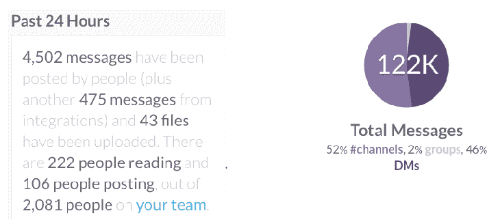
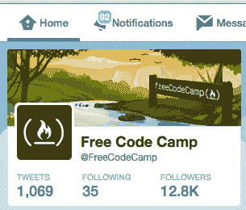
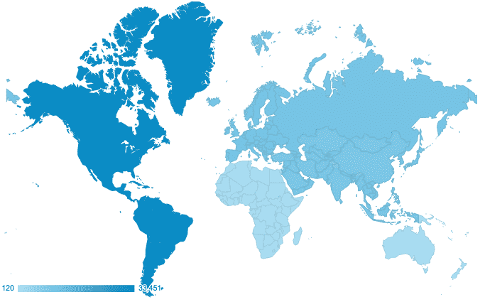
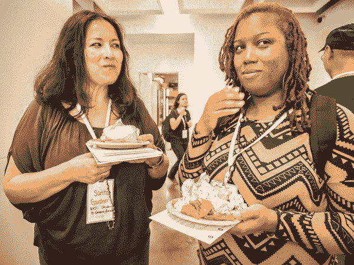
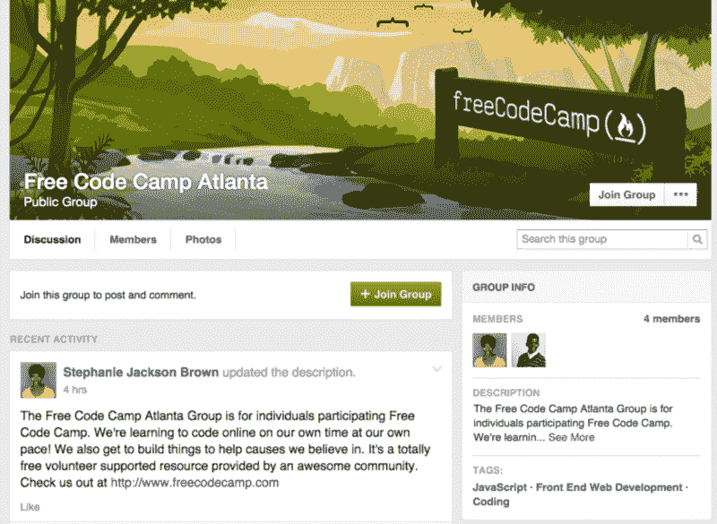

# 自由代码营现在有本地团体

> 原文：<https://www.freecodecamp.org/news/free-code-camp-now-has-local-groups-1e0b58bae363/>

由免费代码营

# 自由代码营现在有本地团体

我们的开源社区是在线诞生的。我们的营员擅长使用互联网交流。这种交流大多只是来回的短信。但是有很多。

We switched to Slack 3 weeks ago, and already a lot of our campers are active on here. *To put these numbers in perspective, Harvard’s CS50x course, which has hundreds of thousands of enrolled students, launched a Slack in March. Our total message volume is already double theirs.*

我们的很多营员也用 Twitter 交流。尽管如此，与人面对面交流还是有好处的。你可以获得更高带宽的通信。你可以在白板上画出草图。你可以打乒乓球。你们可以互相拥抱或击掌。

我们的社区分散在全球各地。我们大多数营员最接近“闲逛”的方式是在屏幕英雄上一起结对编程。

我们一半以上的营员生活在美国以外。但这种情况即将改变。我们一直鼓励我们的营员去参加黑客马拉松和下班后的编码活动。他们中的许多人住在有黑客空间或创客空间的城市，在那里他们可以和其他程序员一起工作。

在像旧金山这样的大城市，每个月都会有几个晚上有与 JavaScript 相关的聚会。(图片来自 [SFHTML5](http://www.meetup.com/sfhtml5/) )但是告诉我们的营员“去看看 Meetup.com”也只是这么有用。从一开始，我们就希望有一个工具将你和你所在城市的其他露营者联系起来，这样你就可以协调一起参加大型活动，甚至计划自己的活动。

我们考虑了 Eventbrite.com 和 Meetup.com。我们尝试在我们的(现已退休的)论坛上协调当地团体。我们甚至在我们的主网站上调查了一个“你附近的露营者”的特性。最终，我们决定最好的解决方案是一个你可能已经熟悉的工具——脸书！

Camper Stephanie Jackson Brown created the Free Code Camp Atlanta Group,

是的。脸书。你父母用的那个婴儿照片分享应用。这个应用吞噬了美国人近四分之一的上网时间。事实证明，脸书有一个设计非常好的群组功能。它非常适合管理本地团体。

*   它是免费的
*   它具有易于使用的活动创建、会员管理、消息传递和照片共享功能
*   几乎每个人都已经有了一个脸书账户，所以加入这个群就像点击一个按钮一样简单

你自己看吧。加入你所在城市的免费代码营群组(如果还没有的话，也可以创建一个)[这里](http://www.freecodecamp.com/field-guide/how-can-i-find-other-free-code-camp-campers-in-my-city)。
我们期待未来几周的拥抱和击掌！

*最初发布于[blog.freecodecamp.com](http://blog.freecodecamp.com/2015/05/free-code-camp-now-has-local-groups.html)2015 年 5 月 8 日。*