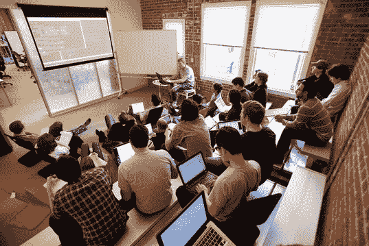
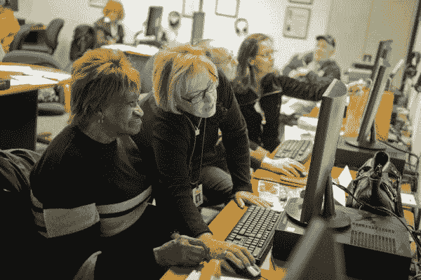
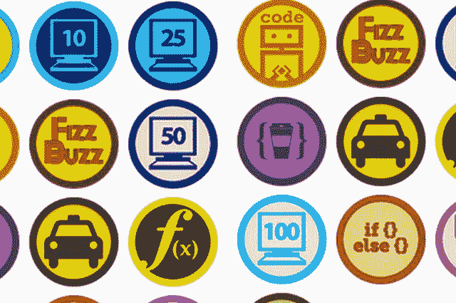
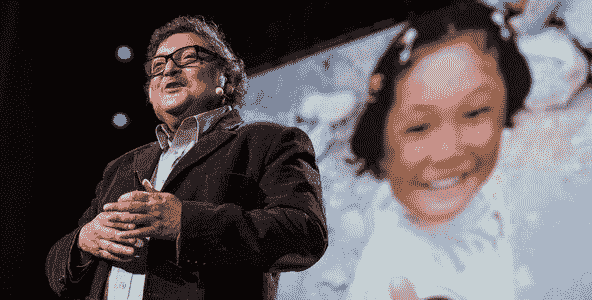
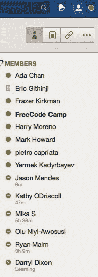

# 自由代码营的第一个月

> 原文：<https://www.freecodecamp.org/news/free-code-camp-s-first-month-9bed140da1f4/>

2014 年 10 月初，我和我的朋友 Yong Park、Dominique Schuwey 决定解散我们的项目。我们的产品是一个在线课程推荐引擎，它既考虑了你在哪里(你的教育背景和工作经历)，也考虑了你想去哪里(我们有 25 个技术职业领域可供选择)。

我在过去的一年里建立了核心技术。随后，Yong、Dom 和我尝试了许多方法来提高参与度，包括用户体验改革和游戏化系统。但是很明显，大多数学习者需要的不仅仅是定制的课程。

在一次 Skype 会议结束时，我们中的一个人提到了编码训练营。也许我们应该建一个训练营！

但仅在美国就有 100 多个训练营。一个小小的新训练营如何在如此分散的市场中取得成功？如果我们收取平均每人 15，000 美元的训练营费用，每年接受 100 名学员，我们可能有能力在旧金山租赁办公场所作为我们的“校园”，购买一些宜家家具，通过在线广告宣传我们自己，并亲自教学员。

我们可能会收支平衡，但我们永远不会赶上盈利性大学集团所拥有的训练营连锁店。所以我们放弃了这个想法，继续前进。

但是那次谈话让我想到了编写训练营的代码。所以我开始会见训练营的创始人和毕业生，并分解他们的课程和教学方法。

我发现的关于编写训练营的最惊人的事情是:大多数训练营的参与者是 25 岁左右的单身男性大学毕业生。我做了一些粗略的计算:

大约有 1000 万 25-29 岁的美国男性。而这些人中只有 1/3 有大学学历。这意味着编码训练营主要针对的是不到 1%的美国人，他们最终会从学习编码中受益。

当然，还有 95%的人类因为经济或移民相关原因无法参加这些美国训练营。

The typical coding bootcamp demographic — 20-something men.

#### 挑战

这个世界需要一个帮助其他人的编码训练营。

这意味着:

1.  它应该完全在线，以便有家庭的忙碌的人和美国以外的人可以参与。
2.  它应该是包容性的，而不是“选择性的”，对所有人开放，无论年龄、性别、种族、原籍国或英语水平如何。
3.  只有一个确定的方法可以消除社会经济因素:让它 100%免费。

太好了！所以我只需要建立一个在线编码训练营，可以服务数百万人，而且完全免费。

接受挑战！

Millions of Americans can and should learn how to code, but traditional coding bootcamps aren’t necessarily the best solution for them. (Photo credit: Steve Pfost)

#### 获得免费

我最近读了克里斯·安德森的《免费——未来的激进代价》和杰里米·里夫金的《零边际成本社会》所以我知道内容和技术的边际成本在下降。

我查看了我在 2012 年使用的在线课程，当时我离开了学校主管的职业，成为了一名软件工程师。我查看了我用来编写和部署代码的所有工具。我查看了我用来组织项目和结对编程的工具。有一件事立即打动了我，那就是所有这些工具和资源都是免费的。

没错——我是一名受过教育的加州中产阶级，甚至我也选择了免费资源而不是付费资源。我学习了 Udacity 和 Coursera 上的免费课程，使用未注册(免费)的 Sublime 用开源编程语言编写了数千小时的代码，通过 Skype 和 Team Viewer 举行了数百次结对编程会议，与 Trello 和 HipChat 协调了项目和黑客马拉松团队，并在 Heroku 上托管了数十个网站，所有这些都是免费的。

我不是一个人。我和很多在大学之外学习编程的人交谈过，他们中的大多数人也是专门使用免费工具和资源来学习编程的。

既然我相信有足够的免费工具和学习资源，一个大问题仍然存在:谁将免费教数百万学习者？

Badges, like Khan Academy’s pictured above, are a deceptively powerful incentive for spurring intrinsic motivation in learners.

#### 大实验

我密切关注教育家 Sugata Mitra 的工作，他因在印度同伴学习方面的工作获得了 2013 年 TED 奖。

他的工作的基本前提是，你可以挑战一群住在贫民窟的孩子去学习，比如说，生物化学，留下一台可以上网的电脑，然后孩子们会自学。

在标准化生物化学考试中普遍得分为 0%的孩子(考试是用英语进行的，最初这些孩子甚至不懂英语)在两个月后平均得分为 30%。

在 Mitra 称之为“奶奶云”的志愿者的帮助下，这些志愿者对生物化学一无所知，只是简单地鼓励孩子们，这些孩子的分数随后上升到了 50%。

它是这样工作的:孩子们天生的好奇心和讨论推动了探究，互联网为他们提供了学习所需的工具和参考资料。

在过去的十年里，米特拉博士在世界各地重复了这些实验，对象是不同文化和社会经济背景的孩子，结果相似。

Mitra 博士已经证明，没有受过教育、不会说英语的孩子可以通过简单地相互讨论和在互联网上追求他们的好奇心来学习高级科目。那么工作年龄的成年人就不能用同样的方式学习编码吗？

我认为结对编程，也就是两个人在一台电脑上一起编程的流行做法，是重现 Mitra 博士的环境的最佳方式，在这个环境中，住在贫民窟的孩子们来回聊天，并指着一个互联网终端。

我很快创造了一些挑战，从“在互联网上部署一个引导模板”到“逆向工程 Pinterest”，并把它们发布到网上。我创建了一个聊天室，并指导学习者下载 Team Viewer，这是一个免费的屏幕共享应用程序，允许用户控制鼠标和键盘。

在选择这条路线时，我选择了教学设计而不是指导，选择了同伴学习而不是传统的基于讲座的模式。这样就不需要雇佣忙碌而昂贵的软件工程师来当老师了。

Sugata Mitra, the educator whose “Hole in the Wall” experiment of putting computers in New Deli slums revitalized the peer learning movement.

#### 目标

传统的编码训练营为学习者提供三样东西:

1.  技能
2.  投资组合项目和
3.  同龄人组成的校友网络。

我们想提供这些东西，还有更多。

软件工程师供不应求，许多最需要编码帮助的组织负担不起。因此，代替通常的 bootcamp capstone 项目，我邀请非营利组织提交项目，供我们的学习者编写代码。

如果成功的话，不仅我们的学习者可以构建完整的生产级应用，而且这些应用可以满足非营利利益相关者的需求，并因此拥有活跃的用户。

对于雇主来说，最引人注目的组合项目是很多人都在使用的定制应用程序。

#### 迄今为止我们的进展(自 10 月发布以来):

*   已经有 340 人报名了
*   40 人完成了前两项挑战
*   7 个非营利组织已经签约成为我们学习者项目的利益相关者
*   我们创造了 20 个挑战
*   在任何时候，我们的聊天室平均有 10 个人
*   我们已经在六大洲的人们之间进行了几十次结对编程

#### 前进的道路

我的短期愿景是建立一个在我们的聊天室里闲逛的学习者的临界质量，这样你就可以在一天中的任何时间登录，并可靠地将程序与和你具有相同熟练水平的人配对。我希望我们能在 2015 年初到达那里！

Some of our community members hanging out in the Free Code Camp Chatroom as I type this.

登录[freeCodeCamp.org](https://freecodecamp.org)加入我们的社区，开始一些挑战的结对编程。

我只写编程和技术。如果你在推特上关注我，我不会浪费你的时间。？