# freeCodeCamp 的 1000 多个学习小组现在完全自治

> 原文：<https://www.freecodecamp.org/news/free-code-camps-1-000-study-groups-are-now-fully-autonomous-d40a3660e292/>

贾斯汀·桑恩

# freeCodeCamp 的 1000 多个学习小组现在完全自治

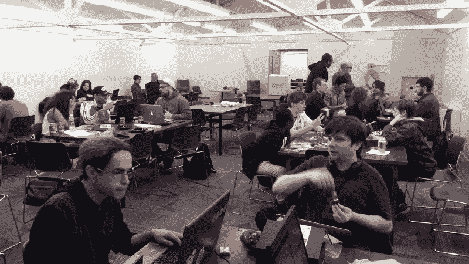

The Providence, Rhode Island freeCodeCamp Study Group.

当第一个本地自由代码营(fCC)研究小组出现时，我们不知道不到一年，几乎地球上每个主要城市都会有一个。

不知不觉中，我成了营员们伸手去注册他们小组的人。我发现自己每天激活十几个学习小组，与他们分享咖啡和代码的美妙。

今天，我们在 160 多个国家有 1000 多个脸书团体。真是莫名其妙，是吧？

我被我们的一些营员在招募成员、保护场地、宣传活动以及为他们的社区带来亲自编码的机会方面表现出的创新和纯粹的坚韧所震撼。

#### 我是谁，以及我是如何管理 fCC 多伦多学习小组的

我是一个相当成功的设计师(平面和网页)，但并不感到满意。所以我决定休息一段时间，寻找一些让我开心的事情。

我早就对编码感兴趣了。我们谈论的是我大学早期的 C++，以及从那以后的大量 HTML 和 CSS。但是我从来没有找到一种方法来恰当地与它相处。对我来说，编码似乎是一件难以捉摸的、深奥的事情，只有少数人能够做到。

长话短说，一年多以前，我从旧金山搬到多伦多，和我的未婚妻(她是加拿大人)住在一起。这意味着我必须等待工作许可。这似乎是征服编码高峰的绝佳机会。因此，我花了几个月的时间参加各种技术活动，并全职学习编码。

freeCodeCamp 帮助我实现了以前看似遥不可及的目标——成为一名称职的 web 开发人员。

通过学习小组，freeCodeCamp 还把我介绍给了好朋友，他们也在向软件开发方向发展。(我在看你[亚历山大·卡拉威](https://www.freecodecamp.org/news/free-code-camps-1-000-study-groups-are-now-fully-autonomous-d40a3660e292/undefined)和[哈勒明](https://www.freecodecamp.org/news/free-code-camps-1-000-study-groups-are-now-fully-autonomous-d40a3660e292/undefined)。)这也给了我一种成就感，因为我帮助其他露营者实现了向编码的飞跃。

在拿到加拿大工作许可证的一周内，我找到了一份前端开发人员的工作。我也不例外——我们小组中的其他几个营员最近也获得了他们的第一份开发人员工作。

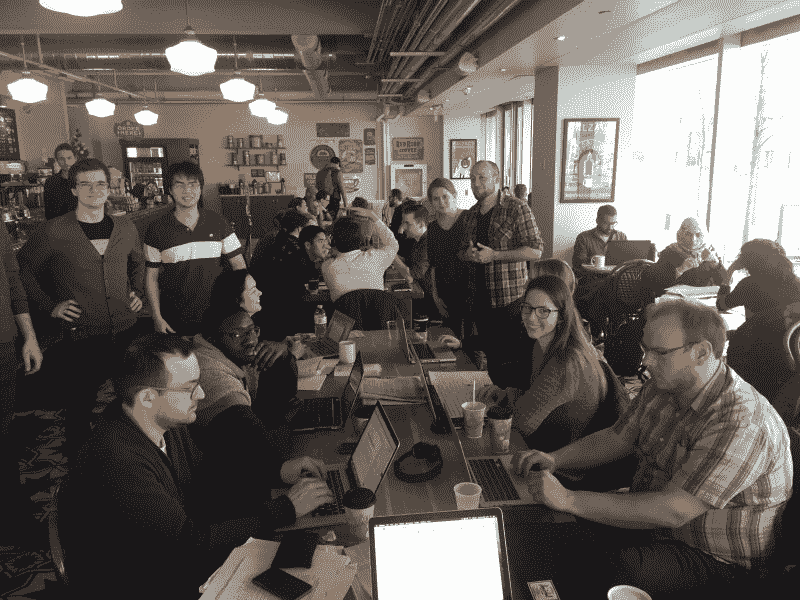

The fCC Toronto study group. I’m the guy in the flannel shirt with the big smile.

从这个社区受益匪浅，我决定加倍努力，在晚上和周末提供更多的帮助。

但这不是我一个人的故事。在世界各地，fCC 学习小组正在帮助人们建立他们的技能。他们提供了与其他开发人员交流以及与当地雇主的招聘经理交流的机会。

The fCC Busan study group, in a venue they obtained through the local government

#### 放眼全球，立足本地

几个营员正在通过他们的自由代码营学习小组实现创造性的和雄心勃勃的目标。

我们在联邦通信委员会普罗维登斯研究小组的朋友会见了他们城市的市长，以建立伙伴关系。他们的政府现在帮助赞助他们的活动。他们还与当地的科技公司建立关系，并申请成为注册的非营利组织。

fCC 关岛研究小组正在与关岛大学及其教育部合作，通过使用 freeCodeCamp 课程的夏季试点项目来促进计算机科学、数学和英语教育。

fCC 达拉斯研究小组已经建立了自己的网站来互相帮助和衡量他们的进步。

Some campers from the fCC Dallas study group hang out at [NoD](http://www.noddfw.com/), which hosted one of their events.

#### 自由代码营学习小组是完全自主的

freeCodeCamp 开源社区的领导者没有试图通过强加一堆规则来约束学习小组，而是选择给予每个学习小组完全的自主权。

这意味着每个研究小组可以:

*   无需征得 freeCodeCamp 核心团队的许可，即可与当地组织自由合作并签署文件
*   申请免税(非营利)地位，这有利于将公共空间用作活动场所
*   如果绝对有必要支付比萨饼和苏打水，收取会费
*   基本上一群普通人可以合法做的任何事情

这不仅给了露营者适应当地习俗的灵活性，还免除了 freeCodeCamp——一个主要由志愿者组成的开发小组——对发生在世界另一端的事情的责任。

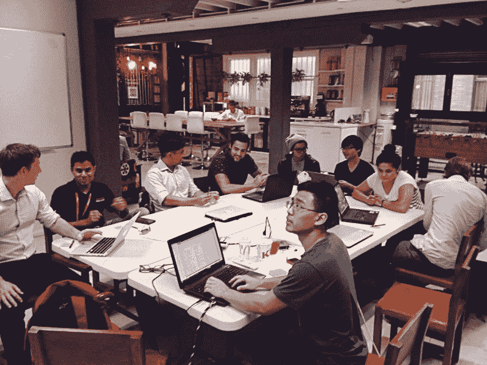

The fCC New South Wales study group.

我们要求学习小组不要做的唯一一件事是在 t 恤或其他商品上印上 freeCodeCamp 的标志，因为我们的商店目前是 freeCodeCamp 支持自己的唯一方式。

如果您想为您当地的学习小组定制装备，请联系我们。我们可以为您的团队以透明、无风险的方式处理印刷和分发。

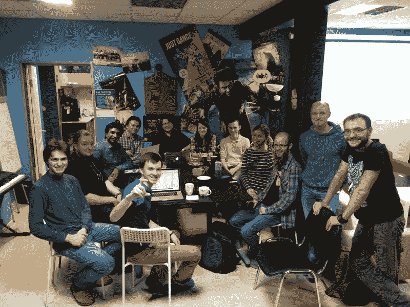

The fCC Moscow study group.

我们甚至在 GitHub 上有一个[资源库，其中包含我们所有的知识共享许可资产，你可以修改这些资产，并在海报、网站和标志上使用它们来推广你的团队。](https://github.com/FreeCodeCamp/FCCAssets)

尽管我正在适应我的新工作，但我将继续为我们所有的学习小组提供支持，并帮助分享最佳实践。如果我能帮上什么忙，请联系我。

另外，我邀请你写一写你当地的学习小组在做什么。这是分享你们小组创新方法的好方法，也可以激励其他小组的露营者。

这里有一些由露营者写的关于他们如何领导当地学习小组的经典媒体文章:

[**成长黑客你所在城市的露营地**](https://medium.com/p/8cf76300a5d1)
[*超过 500 个城市现在都有免费的代码营地露营地。这些大多是新的，仍然相对不活跃。这个…*medium.com](https://medium.com/p/8cf76300a5d1)[**原来我的邻居也想学编程。他们只是没有意识到这是可能的。**](https://medium.com/p/554a7bd8d4a7)
[*我们都有不同的动机去开创一个咖啡和代码。在家自学会很孤独，而且更少……*medium.com](https://medium.com/p/554a7bd8d4a7)

我会用更多来自我们令人惊叹的学习小组的照片来结束我的演讲。希望很快能看到你的照片。编码快乐！

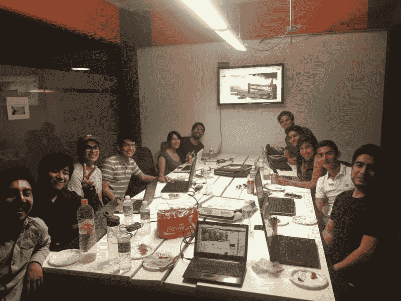

The fCC Mexico City study group.

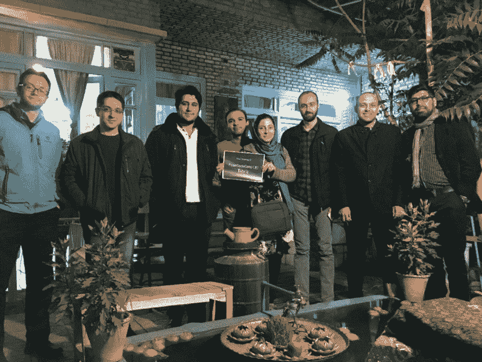

The fCC Tabriz study group

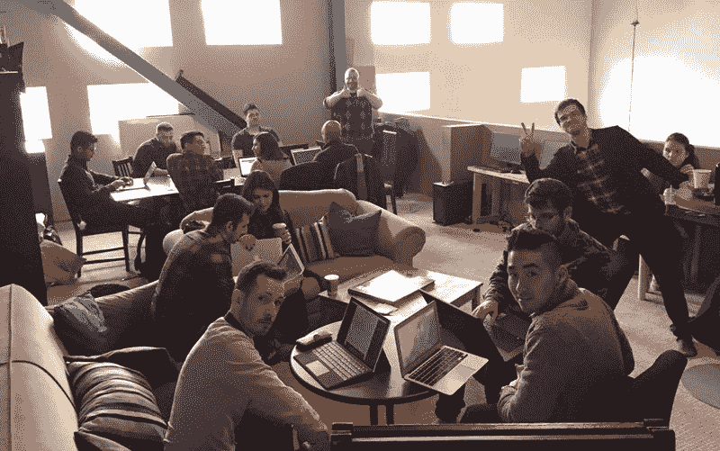

The fCC Mississauga study group

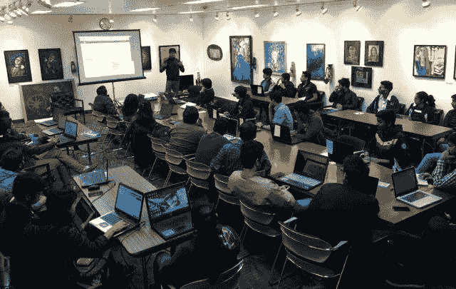

An fCC Delhi study group event in an art museum.

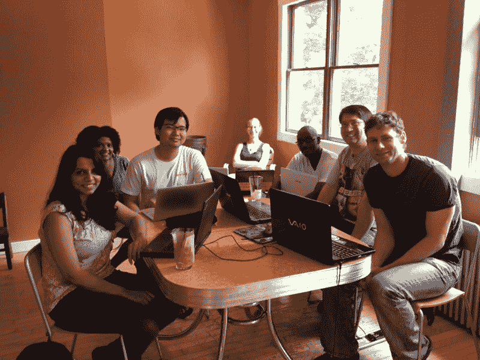

The fCC Pittsburgh study group

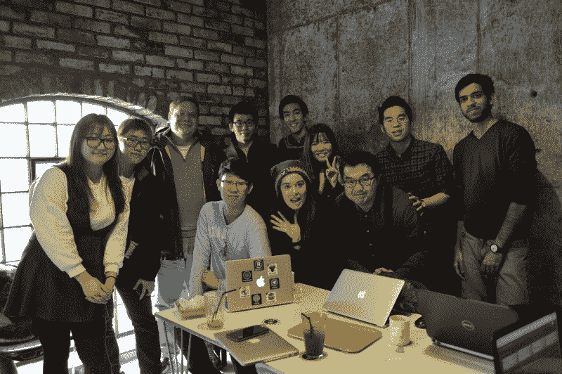

The fCC Seoul study group

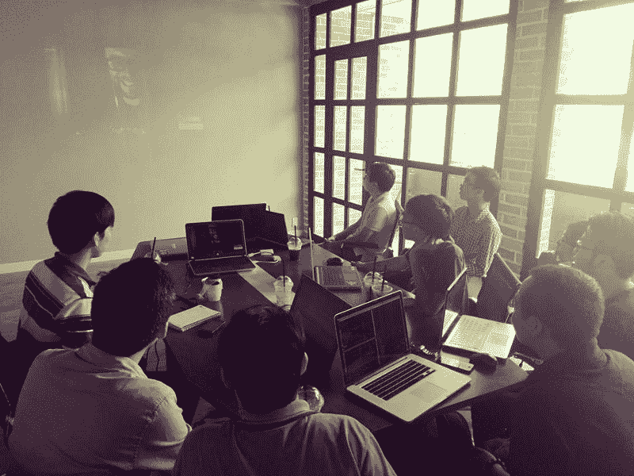

The fCC Ho Chi Minh City study group

The fCC New York City study group

The fCC Lagos study group

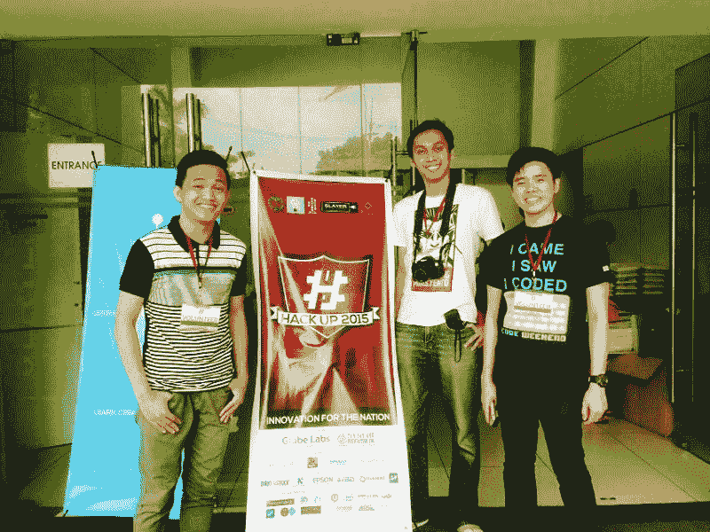

The fCC Manila study group

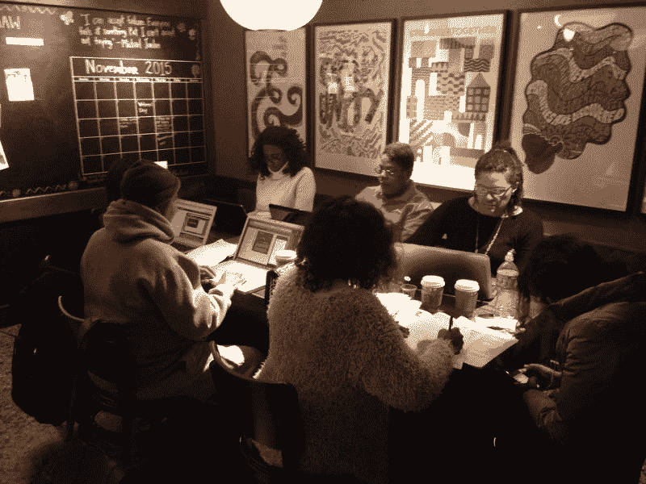

The fCC South Los Angeles study group

不编码的时候，你会发现我在指导其他编码员，玩 freeCodeCamp 的设计，在 [Metrolinx](http://www.metrolinx.com/) 开发内部应用程序，在多伦多和朋友们闲逛，或者在探索世界上其他神奇的地方时迷失了方向。

*喜欢这篇文章？请点击下面的心形按钮或[在推特上告诉我](http://twitter.com/hallaathrad)！*